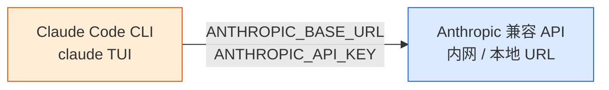

# Claude Code 离线部署实施方案

> 适用场景：内网开发机、隔离环境、Agent OS 沙箱镜像预装。  
> 官方参考：[Advanced setup](https://code.claude.com/docs/en/setup) · [Settings](https://code.claude.com/docs/en/settings) · [LLM Gateway](https://code.claude.com/docs/en/llm-gateway-connect)

## 0. 方案总览

### 0.1 核心结论

| 组件 | 能否离线 | 说明 |
|------|----------|------|
| **Claude Code 客户端** | ✅ 可以 | 原生二进制 / npm / apt 等均可提前缓存，断网可安装运行 |
| **Anthropic 云端模型** | ❌ 不可以 | 闭源 API，必须联网 |
| **本地 / 内网模型服务** | ✅ 可以 | 客户端通过 `ANTHROPIC_BASE_URL` + `ANTHROPIC_API_KEY` 指向任意 Anthropic 兼容端点 |

**离线可用的完整链路**：离线安装客户端 → 禁用自动更新 → 配置本地 API 地址与密钥 → 完全断网使用。

模型服务的部署（Ollama、vLLM、LiteLLM、自研网关等）**不在本文范围**，由基础设施侧单独提供；Claude Code 侧只需接收 **`baseURL` + `apiKey`**。

### 0.2 架构



Claude Code 通过 [Anthropic Messages API](https://code.claude.com/docs/en/llm-gateway-protocol)（`POST /v1/messages`）与上游通信。上游可以是 Anthropic 官方、企业 LLM 网关，或任何实现该协议的本地/内网服务。

### 0.3 离线部署两大难点

1. **安装包依赖外网**：原生安装器、npm optionalDependencies、apt/dnf 仓库均需在联网环境提前拉取并校验。
2. **默认行为依赖外网**：Native 安装会自动后台更新；断网时更新检查可能报错。离线环境必须显式禁用更新，并关闭非必要出站流量。

### 0.4 安装方式选型

| 方案 | 适用规模 | 优点 | 缺点 |
|------|----------|------|------|
| **A. 原生二进制离线包**（推荐） | 个人 / 小团队 / 容器镜像 | 与官方一致、无需 Node.js、可 GPG 验签 | 需按 OS/架构分别打包 |
| **B. Linux 包管理器离线包** | 企业 Linux 标准化环境 | 与系统升级流程一致、自带签名校验 | 仅 Linux；需维护本地 repo 镜像 |
| **C. npm 全量依赖打包** | 已有 Node.js toolchain | 熟悉 npm 的团队易操作 | 需 Node 22+；optional deps 易漏 |
| **D. Verdaccio 内网源** | 数十台以上、需版本管控 | 统一版本、可审计 | 运维成本高 |

---

## 1. 前置资源清单（联网环境提前准备）

所有资源在**有网机器**下载后，经 U 盘 / 内网文件服务器 / 镜像仓库分发至离线环境。

### 1.1 客户端安装资源

| 资源 | 版本建议 | 用途 |
|------|----------|------|
| Claude Code 二进制 | 固定版本号（如 `2.1.89`） | 客户端本体 |
| `manifest.json` + `.sig` | 与二进制同版本 | GPG 完整性校验 |
| Git（Windows 可选） | 最新稳定版 | Bash 工具、代码检索 |
| Node.js（仅方案 C） | **22.x LTS** | npm 安装时的引擎要求（v2.1.198+） |

**支持的平台标识**（npm optional dependency 命名）：`darwin-arm64`、`darwin-x64`、`linux-x64`、`linux-arm64`、`linux-x64-musl`、`linux-arm64-musl`、`win32-x64`、`win32-arm64`。

### 1.2 系统要求（官方最低配置）

- **OS**：macOS 13+ / Windows 10 1809+ / Ubuntu 20.04+ / Debian 10+ / Alpine 3.19+
- **硬件**：4 GB+ RAM，x64 或 ARM64
- **Shell**：Bash、Zsh、PowerShell 或 CMD
- **Alpine / musl**：需预装 `libgcc`、`libstdc++`、`ripgrep`，并设置 `USE_BUILTIN_RIPGREP=0`

---

## 2. Claude Code 客户端离线安装

### 方案 A：原生二进制离线包（推荐）

官方推荐安装方式为 [Native Install](https://code.claude.com/docs/en/setup#native-install-recommended)。离线场景下，在有网机器完成安装后，整目录拷贝即可。

#### 步骤 1：有网机器安装并锁定版本

```bash
# Linux / macOS / WSL
curl -fsSL https://claude.ai/install.sh | bash -s 2.1.89

# Windows PowerShell
& ([scriptblock]::Create((irm https://claude.ai/install.ps1))) 2.1.89
```

#### 步骤 2：验证完整性（可选但推荐）

```bash
# 下载 manifest 并 GPG 验签
REPO=https://downloads.claude.ai/claude-code-releases
VERSION=2.1.89
curl -fsSL https://downloads.claude.ai/keys/claude-code.asc | gpg --import
curl -fsSLO "$REPO/$VERSION/manifest.json" "$REPO/$VERSION/manifest.json.sig"
gpg --verify manifest.json.sig manifest.json

# 校验二进制 SHA256（Linux 示例）
sha256sum ~/.local/share/claude/versions/$VERSION/claude
# 与 manifest.json 中对应 platform 的 checksum 对比
```

#### 步骤 3：打包离线安装目录

| 平台 | 需拷贝路径 |
|------|------------|
| Linux / macOS / WSL | `~/.local/bin/claude` + `~/.local/share/claude/` |
| Windows | `%USERPROFILE%\.local\bin\claude.exe` + `%USERPROFILE%\.local\share\claude\` |

```bash
# Linux / macOS 打包示例
tar czf claude-code-native-offline.tar.gz \
  -C "$HOME/.local" bin/claude share/claude
```

#### 步骤 4：离线机器部署

```bash
# 解压到用户目录
mkdir -p ~/.local
tar xzf claude-code-native-offline.tar.gz -C ~/.local

# 确保 ~/.local/bin 在 PATH 中
export PATH="$HOME/.local/bin:$PATH"
claude --version
```

---

### 方案 B：Linux 包管理器离线包

适用于 Debian/Ubuntu、RHEL/Fedora、Alpine 等企业标准化 Linux 环境。包管理器安装**不会**触发 Claude Code 内置自动更新。

#### 有网机器：下载 deb/rpm/apk 及依赖

```bash
# Debian/Ubuntu 示例
sudo apt install curl
curl -fsSL https://downloads.claude.ai/keys/claude-code.asc \
  | sudo gpg --dearmor -o /etc/apt/keyrings/claude-code.gpg
echo "deb [signed-by=/etc/apt/keyrings/claude-code.gpg] https://downloads.claude.ai/claude-code/deb stable main" \
  | sudo tee /etc/apt/sources.list.d/claude-code.list
sudo apt update
apt download claude-code
# 同时 download 所有依赖包
```

#### 离线机器：本地安装

```bash
sudo dpkg -i claude-code_*.deb   # 或 rpm -i / apk add
claude --version
```

---

### 方案 C：npm 全量依赖打包

> npm 安装的是**同一套原生二进制**，通过 optional dependency 按平台拉取。v2.1.198+ 要求 Node.js 22+。

#### 步骤 1：有网机器完整安装

```bash
mkdir claude-code-offline-build && cd claude-code-offline-build
npm init -y
npm install @anthropic-ai/claude-code@2.1.89
```

#### 步骤 2：确认平台二进制完整

检查 `node_modules/@anthropic-ai/` 下必须存在目标平台包，例如：

- `@anthropic-ai/claude-code-win32-x64`
- `@anthropic-ai/claude-code-linux-x64`
- `@anthropic-ai/claude-code-darwin-arm64`

缺失对应平台包会导致离线机器启动报「binary not found」。

#### 步骤 3：打包与离线部署

```bash
# 打包
zip -r claude-code-npm-offline.zip node_modules package.json package-lock.json

# 离线机器
npm install --offline
npm link @anthropic-ai/claude-code
claude --version
```

---

### 方案 D：Verdaccio 内网私有仓库

**适用**：数十台以上开发机、需统一版本与审计。

1. 有网环境部署 Verdaccio，代理并缓存 `@anthropic-ai/claude-code` 及其 optional dependencies。
2. 将 Verdaccio storage 目录打包迁移至内网。
3. 内网启动 Verdaccio，开发机配置 `registry=<内网地址>` 后正常 `npm install -g @anthropic-ai/claude-code@<版本>`。

---

## 3. 离线必做：禁用联网行为

Claude Code Native 安装默认**后台自动更新**，断网时可能报错或阻塞启动。离线/内网分发必须显式关闭。

### 3.1 推荐配置（settings.json）

Claude Code 的配置写在 `~/.claude/settings.json`（Windows：`%USERPROFILE%\.claude\settings.json`）。**环境变量应放在 `env` 块中**。

```json
{
  "env": {
    "DISABLE_UPDATES": "1",
    "CLAUDE_CODE_DISABLE_NONESSENTIAL_TRAFFIC": "1"
  },
  "autoUpdatesChannel": "stable",
  "minimumVersion": "2.1.89"
}
```

| 变量 | 作用 |
|------|------|
| `DISABLE_UPDATES=1` | 阻止**所有**更新路径，含 `claude update`（离线分发必选） |
| `DISABLE_AUTOUPDATER=1` | 仅阻止后台自动更新；`claude update` 仍可用（半离线场景） |
| `CLAUDE_CODE_DISABLE_NONESSENTIAL_TRAFFIC=1` | 关闭遥测、错误上报等非必要出站 |
| `minimumVersion` | 防止自动更新降级到更低版本 |

> 同一行为若同时存在环境变量与 settings 字段，**环境变量优先**。

### 3.2 系统级环境变量（可选补充）

```bash
# Linux / macOS — 写入 ~/.bashrc 或 ~/.zshrc
export DISABLE_UPDATES=1
export CLAUDE_CODE_DISABLE_NONESSENTIAL_TRAFFIC=1
```

Windows：系统环境变量中新增 `DISABLE_UPDATES=1`。

### 3.3 企业 / 容器场景：managed-settings

容器或 MDM 管控环境，可将策略写入 `/etc/claude-code/managed-settings.json`（Linux），优先级最高，用户无法覆盖：

```json
{
  "env": {
    "DISABLE_UPDATES": "1",
    "CLAUDE_CODE_DISABLE_NONESSENTIAL_TRAFFIC": "1"
  },
  "requiredMinimumVersion": "2.1.89",
  "requiredMaximumVersion": "2.1.89"
}
```

---

## 4. 对接本地 / 内网 API

Claude Code 不感知上游是云端还是本地，只需两个配置项：

| 配置项 | 环境变量 | 说明 |
|--------|----------|------|
| API 地址 | `ANTHROPIC_BASE_URL` | Anthropic 兼容端点根 URL，如 `http://10.0.0.1:4000` |
| 凭证 | `ANTHROPIC_API_KEY` 或 `ANTHROPIC_AUTH_TOKEN` | 网关要求的 API Key 或 Bearer Token |

### 4.1 settings.json 固化（推荐）

```json
{
  "env": {
    "ANTHROPIC_BASE_URL": "http://10.0.0.1:4000",
    "ANTHROPIC_API_KEY": "your-api-key",
    "DISABLE_UPDATES": "1",
    "CLAUDE_CODE_DISABLE_NONESSENTIAL_TRAFFIC": "1"
  },
  "model": "claude-sonnet-4-6"
}
```

- `ANTHROPIC_API_KEY`：网关使用 `x-api-key` 头时
- `ANTHROPIC_AUTH_TOKEN`：网关使用 `Authorization: Bearer` 头时
- `model`：与上游网关支持的模型 ID 一致；也可用 `--model` 或 `ANTHROPIC_MODEL` 覆盖

非 Anthropic 官方上游若返回 400，可按需追加：

```json
{
  "env": {
    "CLAUDE_CODE_DISABLE_EXPERIMENTAL_BETAS": "1",
    "CLAUDE_CODE_DISABLE_ADAPTIVE_THINKING": "1"
  }
}
```

### 4.2 Shell 临时配置

```bash
# Linux / macOS
export ANTHROPIC_BASE_URL=http://10.0.0.1:4000
export ANTHROPIC_API_KEY=your-api-key

# Windows PowerShell
$env:ANTHROPIC_BASE_URL = "http://10.0.0.1:4000"
$env:ANTHROPIC_API_KEY = "your-api-key"
```

### 4.3 验证连接

**curl 预检**（确认 URL 和 Key 有效后再启动 Claude Code）：

```bash
curl -X POST "$ANTHROPIC_BASE_URL/v1/messages" \
  -H "x-api-key: $ANTHROPIC_API_KEY" \
  -H "anthropic-version: 2023-06-01" \
  -H "content-type: application/json" \
  -d '{"model": "claude-sonnet-4-6", "max_tokens": 64, "messages": [{"role": "user", "content": "hello"}]}'
```

返回含 `"content"` 字段的 JSON 即表示上游可达。若 401，尝试换用 `ANTHROPIC_AUTH_TOKEN` 和 `Authorization: Bearer` 头。

**Claude Code 内确认**：

```bash
claude --version
claude doctor
claude --model claude-sonnet-4-6
```

会话内执行 `/status`，确认 `Anthropic base URL` 与 `API key` / `Auth token` 显示正确。

---

## 5. 离线验证清单

| 步骤 | 命令 / 检查项 | 预期结果 |
|------|---------------|----------|
| 1 | `claude --version` | 显示锁定版本，无网络超时 |
| 2 | `claude doctor` | 无更新失败 / 网络错误 |
| 3 | `curl` 上游 `/v1/messages` | 返回正常 JSON |
| 4 | `claude` 进入 TUI 并发消息 | 有流式回复 |
| 5 | 断网后重复 1–4 | 全部通过 |

---

## 6. Agent OS 容器化预装（扩展）

结合 [三方 Agent 接入 Agent OS 设计](./third_party_agent_agentos_requirements_design_spec.md)，Claude Code 以**沙箱实例**形式运行，Gateway 通过 SSH 透传 TUI。

### 6.1 镜像构建要点

```dockerfile
FROM ubuntu:22.04

RUN apt-get update && apt-get install -y git openssh-server ripgrep curl \
    && rm -rf /var/lib/apt/lists/*

# 离线拷贝 Claude Code 原生二进制
COPY claude-offline/ /root/.local/
ENV PATH="/root/.local/bin:${PATH}"

# 策略与 API 配置
COPY managed-settings.json /etc/claude-code/managed-settings.json

COPY entrypoint.sh /entrypoint.sh
ENTRYPOINT ["/entrypoint.sh"]
```

### 6.2 容器内 managed-settings 示例

```json
{
  "env": {
    "ANTHROPIC_BASE_URL": "http://llm-gateway.internal:4000",
    "ANTHROPIC_API_KEY": "your-api-key",
    "DISABLE_UPDATES": "1",
    "CLAUDE_CODE_DISABLE_NONESSENTIAL_TRAFFIC": "1"
  },
  "disableRemoteControl": true,
  "disableClaudeAiConnectors": true
}
```

`ANTHROPIC_BASE_URL` 指向集群内 LLM 网关地址即可，模型服务由基础设施侧独立维护。

### 6.3 与 Gateway SSH 透传

- 容器内 `claude` 作为交互进程，由 sshd 承载 PTY。
- Gateway 只做字节流透传，不解析 TUI 内容（参见 [TUI vs ACP 对比](./tui_vs_acp_comparison.md)）。

---

## 7. 常见问题

### 7.1 npm 安装超时 / 依赖解析失败

**原因**：未使用 `--offline`，或打包时遗漏 optional dependency。  
**解决**：重新在有网环境 `npm install`，确认 `@anthropic-ai/claude-code-<platform>` 存在后再打包。

### 7.2 启动提示更新失败 / 网络超时

**原因**：Native 安装默认后台更新。  
**解决**：确认 `DISABLE_UPDATES=1` 已写入 `settings.json` 的 `env` 块或 managed-settings。

### 7.3 API 连接失败 / 401 / 400

| 现象 | 排查 |
|------|------|
| Connection refused | 检查 `ANTHROPIC_BASE_URL` 是否可达 |
| 401 | `ANTHROPIC_API_KEY` vs `ANTHROPIC_AUTH_TOKEN` 是否与上游要求匹配 |
| 400 Extra inputs | 追加 `CLAUDE_CODE_DISABLE_EXPERIMENTAL_BETAS=1` |
| 400 thinking/adaptive | 追加 `CLAUDE_CODE_DISABLE_ADAPTIVE_THINKING=1` |

### 7.4 二进制缺失

**原因**：npm optional dependency 被 `--omit=optional` 跳过，或打包时手动删减了 `node_modules`。  
**解决**：使用方案 A 原生二进制，或重新完整 npm install。

### 7.5 Windows 无 Git Bash

Claude Code 在 Windows 无 Git 时回退到 PowerShell 工具。如需 Bash 工具，安装 Git for Windows 并配置：

```json
{
  "env": {
    "CLAUDE_CODE_GIT_BASH_PATH": "C:\\Program Files\\Git\\bin\\bash.exe"
  }
}
```

---

## 8. 方案选型速查

| 场景 | 客户端安装 |
|------|------------|
| 个人离线开发机 | 方案 A 原生二进制 |
| 企业 Linux 标准化 | 方案 B apt/dnf 离线包 |
| 多机 npm 统一版本 | 方案 D Verdaccio |
| Agent OS 沙箱 | 方案 A 写入 Docker 镜像 + managed-settings 注入 `ANTHROPIC_BASE_URL` |

---

## 参考链接

- [Claude Code Setup（安装与更新）](https://code.claude.com/docs/en/setup)
- [Claude Code Settings（配置项）](https://code.claude.com/docs/en/settings)
- [Environment variables 完整列表](https://code.claude.com/docs/en/env-vars)
- [Connect to LLM Gateway](https://code.claude.com/docs/en/llm-gateway-connect)
- [Gateway Protocol Reference](https://code.claude.com/docs/en/llm-gateway-protocol)
- [Development containers](https://code.claude.com/docs/en/devcontainer)
