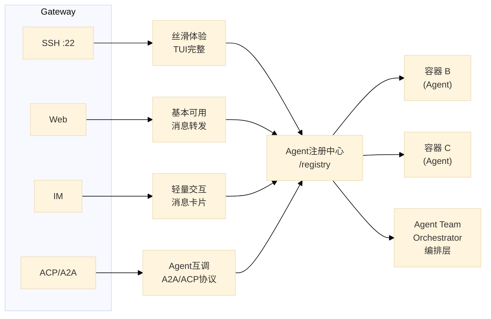
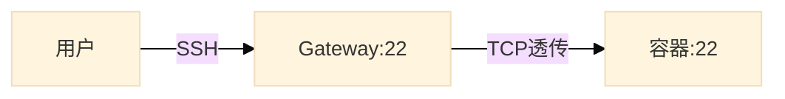
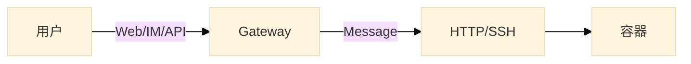
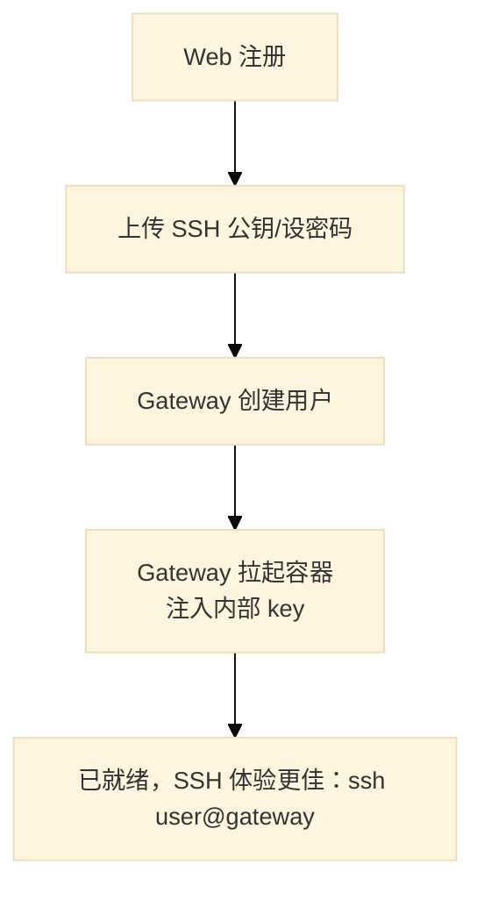
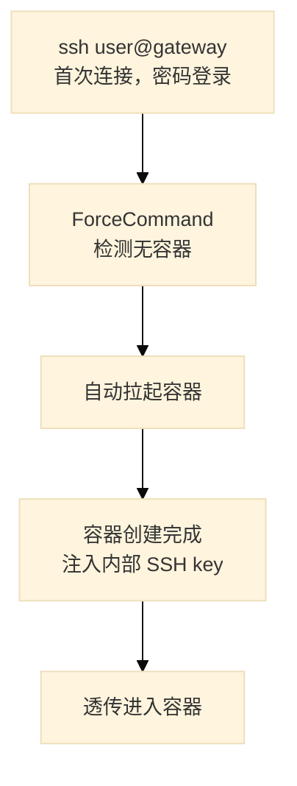
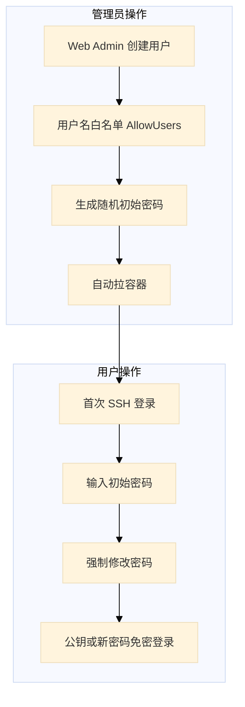
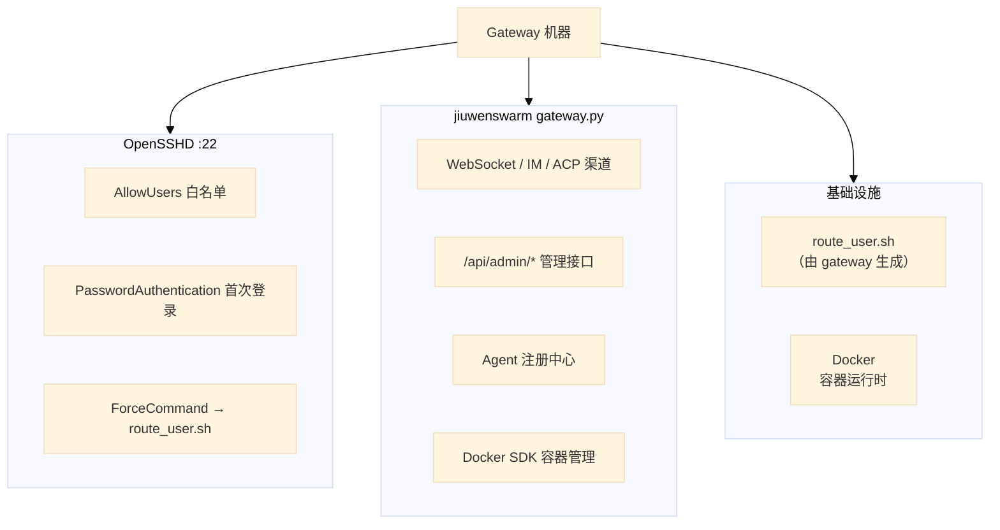

# Gateway 架构设计：SSH 统一入口与 Agent 管理平面

## 概述

本文档描述基于 opencode + jiuwenswarm gateway 构建的 AI Agent 平台架构。核心设计理念是：**一个 Gateway 入口，多端接入，统一身份，体验分级**。



## 两条路径，体验分级

### SSH 路径（完整 TUI 体验）



- SSH 字节流端到端透传，Gateway 不做消息解析
- 用户享受原生 SSH 体验：流式输出、tmux 保活、交互式输入
- 底层用 OpenSSH ForceCommand 做路由，不重复造轮子

### 消息路径（非 SSH 渠道）



- 支持 Web 界面、飞书/DingTalk/Telegram 等 IM 平台
- 一问一答模式，非流式，适合轻量交互
- 在非 SSH 渠道提示用户切换到 SSH 以获取更完整体验

## Gateway 作为管理平面

Gateway 不只是一个消息路由器，更是整个平台的控制平面：

| 功能 | 说明 |
|---|---|
| 用户管理 | 注册、认证、角色 |
| SSH 密钥管理 | 用户公钥上传、自动注入到容器 |
| 容器生命周期 | 按需创建、停止、销毁 |
| 路由配置 | 用户 → 容器的映射自动更新 |

### 首次接入流程

#### 场景一：用户先走 Web



#### 场景二：用户先走 SSH



#### 场景三：管理员预创建



### 密钥分层

Gateway 管理两层密钥：

| 层 | 凭证 | 用户需操作 |
|---|---|---|
| 用户 → Gateway | 公钥 / 密码 | 注册时上传公钥，或首次密码登录 |
| Gateway → 容器 | 内部密钥对（自动生成） | 无感知 |

## Agent 注册中心

每个容器启动时自动注册到 Gateway：

```json
{
  "agent_id": "userA-opencode",
  "host": "container-a",
  "capabilities": {
    "protocols": ["acp", "a2a", "ssh"],
    "models": ["gpt-5.5", "claude-4"],
    "tools": ["write", "bash", "read"],
    "skills": ["python", "react", "docker"]
  },
  "status": "online",
  "owner": "userA"
}
```

### 路由规则

| 来源 | 路由目标 |
|---|---|
| 用户 A 的 SSH 连接 | 容器 A（用户专属 Agent） |
| 用户 A 通过 IM 发消息 | 容器 A |
| Agent A 调用"数据库 Agent" | 注册中心查询 → 容器 B |
| Agent Team 协作 | Orchestrator → 分发给多个 Agent |

## 权限模型

```python
class UserRole(enum):
    GUEST = "guest"      # 自注册，默认受限
    MEMBER = "member"    # 审核通过
    ADMIN = "admin"      # 管理权限

class UserPermissions:
    max_containers: int
    allow_ssh: bool
    resource_limits: ResourceSpec
    can_access_admin: bool
```

## 基础设施



## 扩展方向

- **Agent Team**：Orchestrator 编排多个 Agent 协作完成任务
- **A2A Federation**：与外部 Agent 系统互通（Google A2A 协议）
- **专业 Agent**：数据库 Agent、代码审查 Agent、部署 Agent 等，供其他 Agent 调用
- **资源配额**：按用户角色分配 CPU/内存/GPU 限制
