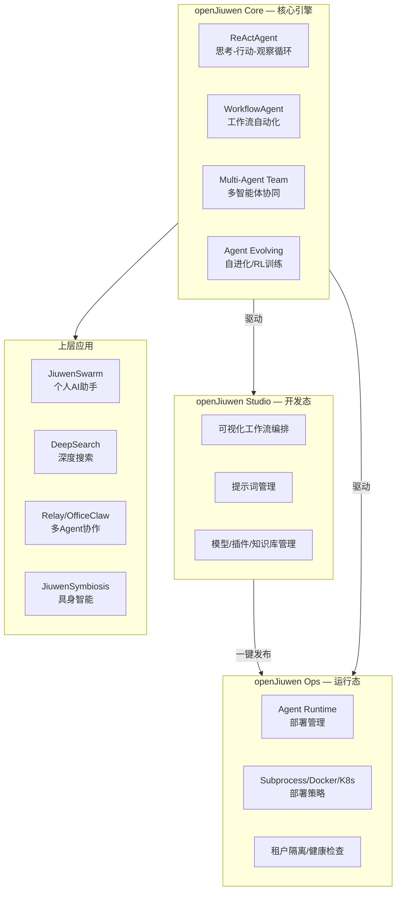
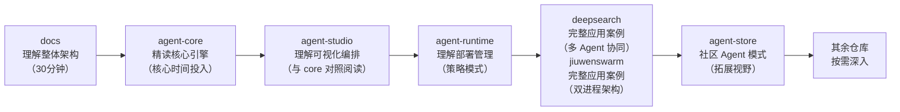

# openJiuwen 代码仓库导读

[openJiuwen](https://gitcode.com/openJiuwen) 是华为开源的 AI Agent 平台，致力于构建易用、灵活且稳定的开源智能体平台，推动商用级 Agentic AI 技术广泛应用与落地。

## 前言

openJiuwen 的代码分散在 **13 个核心仓库**中，覆盖了从底层 SDK 到可视化开发、从运行时部署到应用案例的完整链路。对初次接触这个项目的开发者来说，面对如此多的仓库可能会感到无从下手。

**本文的写作目的**，是为这些代码仓库提供一个清晰的导航地图，帮助你按合理的顺序系统学习 openJiuwen 的架构设计。

---

## 第一章 系统架构全景

在深入每个仓库之前，先理解 openJiuwen 的三层架构：



**Core** 是整个平台的灵魂，提供 Agent SDK 和运行时引擎；**Studio** 基于 Core 构建了可视化低代码开发能力；**Ops** 负责将 Agent 从开发态带到生产态。而上层应用（Swarm、DeepSearch、Relay 等）则是在此基础上的完整产品实现。

---

## 第二章 仓库分类导航

### 2.1 核心引擎层（必读）

这是整个 openJiuwen 的基石，所有上层应用都依赖它们。

| 仓库 | 语言 | 链接 | 一句话描述 |
|------|------|------|-----------|
| **agent-core** | Python | [gitcode](https://gitcode.com/openJiuwen/agent-core) | Agent SDK 核心引擎，定义所有 Agent 的"灵魂" |
| **agent-core-java** | Java 21 | [gitcode](https://gitcode.com/openJiuwen/agent-core-java) | agent-core 的 Java 移植版，同样基于 Pregel 图执行引擎 |

#### agent-core（Python，最核心）

**建议作为第一个深入学习的仓库。** 这是整个平台的引擎，定义了：

- **两种 Agent 范式**：
  - `ReActAgent`（`core/single_agent/`）——思考→行动→观察的迭代循环，适合对话式交互
  - `WorkflowAgent`（`core/workflow/`）——预定义工作流的多步骤自动化，适合业务流程
- **执行引擎**（`core/graph/`）——基于 Pregel 模型的异步并行图执行器，支持流式处理、状态中断与恢复
- **Runner**（`core/runner/`）——统一的 Agent 执行入口
- **多智能体协作**（`agent_teams/`）——多 Agent 团队、消息通信、孵化/销毁
- **Agent 自进化**（`agent_evolving/`）——基于强化学习（PPO + vLLM）的在线/离线训练管线
- **CLI 工具**（`harness/cli/`）——`openjiuwen` 命令行，提供完整的终端 AI 编程助手工具集（文件操作、Shell、LSP、Web Search 等）
- **记忆与检索**（`core/memory/` + `core/retrieval/`）——图记忆、向量检索、查询重写

> 关键入口：`pyproject.toml` 中的 CLI 命令 `openjiuwen chat` / `openjiuwen run PROMPT`

#### agent-core-java（Java 21）

agent-core 的 Java 实现，设计上与 Python 版保持一致：

- **双 Agent 模式**：`LlmAgent`（ReAct）和 `WorkflowAgent`
- **Pregel 图执行引擎**：`core/graph/pregel/`
- **Controller 层**：`core/controller/` 管理 Agent 生命周期

如果对 Java 生态下的 Agent 框架设计感兴趣，可以与 Python 版对比阅读。

---

### 2.2 协议与通信层

| 仓库 | 语言 | 链接 | 核心功能 |
|------|------|------|---------|
| **agent-protocol** | C++ | [gitcode](https://gitcode.com/openJiuwen/agent-protocol) | MCP 和 A2A 协议的 C++ SDK |

#### agent-protocol（C++）

提供 Agent 间通信的标准协议实现：

- **MCP CPP SDK**——Model Context Protocol 的 C++ 客户端/服务端实现
- **A2A CPP SDK**——Agent-to-Agent 协议的 C++ 实现
- 目标平台 Linux，使用 C++17 + CMake 构建

如果你的工作涉及 Agent 间通信协议或需要对 MCP/A2A 协议做底层深度定制，这个仓库是很好的参考。

---

### 2.3 可视化开发平台

| 仓库 | 语言 | 链接 | 核心功能 |
|------|------|------|---------|
| **agent-studio** | TypeScript + Python | [gitcode](https://gitcode.com/openJiuwen/agent-studio) | 零码/低码 Agent 可视化开发平台 |

#### agent-studio（全栈）

这是 openJiuwen 的"产品级界面"，面向非深度编程用户的可视化开发平台：

- **前端**：`frontend/src/`——React 18 + Vite 6 + Tailwind CSS 3
  - 工作流画布基于字节跳动 FlowGram（`@flowgram.ai`）
  - 状态管理用 Zustand，服务端状态用 React Query
  - 路由管理、页面（Agent、工作流、提示词、模型、插件、知识库等）
- **后端**：`backend/`——Python FastAPI
  - 29 个路由模块，SQLAlchemy ORM，Alembic 数据迁移
  - 核心依赖 `openjiuwen` SDK
- **连接器**：`connect/`——多渠道接入（WhatsApp、Telegram、Slack 等）+ MCP 服务端
- **插件服务**：`plugin_server/`——基于 FastMCP 的第三方插件管理
- **沙箱**：`sandbox_server/`——隔离的工作流执行环境

**学习重点**：前端的工作流画布如何实现拖拽式编排，后端如何将画布配置转换为 agent-core 可执行的 Workflow。

---

### 2.4 运行时部署层

| 仓库 | 语言 | 链接 | 核心功能 |
|------|------|------|---------|
| **agent-runtime** | Python | [gitcode](https://gitcode.com/openJiuwen/agent-runtime) | Agent 运行时与部署管理系统 |

#### agent-runtime（Python）

将 Agent 从"开发态"稳定带到"生产态"的关键组件。与 agent-studio 协作，支持从 Studio 中一键发布到 Runtime：

- **管理服务**：`server/`——FastAPI 服务，暴露 `/deploy`、`/agents` 等管理 API
- **部署策略**：`management/deployments/`——策略模式，支持子进程 / Docker / K8s 三种部署方式
- **服务抽象**：`service/`——`BaseApp` / `AgentApp` / `AppGroup`，为每个 Agent 进程提供标准化框架
- **租户隔离**：`server/middleware/tenant.py`——通过 `user_id` / `space_id` 隔离多租户
- **基础设施**：`foundation/`——数据库抽象（SQLite/MySQL/Redis）、端口分配、虚拟环境管理

**学习重点**：策略模式在部署中的运用，以及如何设计一个统一的管理面来协调异构的 Agent 运行时。

---

### 2.5 搜索与工具层

| 仓库 | 语言 | 链接 | 核心功能 |
|------|------|------|---------|
| **deepsearch** | Python | [gitcode](https://gitcode.com/openJiuwen/deepsearch) | 深度搜索与研究框架 |
| **agent-tools** | Python | [gitcode](https://gitcode.com/openJiuwen/agent-tools) | vLLM 插件 + 社区工具集 |

#### deepsearch（Python）

一个企业级的、基于多 Agent 协同的**知识增强型深度搜索与研究平台**，核心链路：

```
查询理解 → 意图识别 → 任务规划 → 多源搜索（联网 + 本地知识库）
  → 信息评估精炼 → 报告生成（含图表）→ 溯源验证 → 用户反馈交互
```

- `algorithm/`——核心算法模块（搜索 Agent、查询理解、报告生成、图表生成、溯源推理）
- `server/`——FastAPI 后端服务，暴露 REST API
- 支持多种 LLM（Qwen3-Max、GLM-5、DeepSeek V3.2、Kimi-K2.5）和搜索引擎（Tavily、Serper、Jina 等）

**学习重点**：如何将复杂的多步骤搜索任务拆解为可控的工作流节点，以及片段级溯源引用的实现方式。

#### agent-tools（Python）

包含两个部分：

1. **openJiuwen-vllm-affinity**（核心产品）——vLLM 插件，实现**双区 KV-cache 主动管理**，将空闲块队列分为"老化区"和"新鲜区"，通过 `/release_kv_cache` API 让客户端主动释放缓存，解决多轮对话中的缓存碎片问题
2. **Agent Innovation Challenge**——5 个社区获奖作品（图片搜索、网页抓取、LangGraph 迁移、桌面自动化、AI 投资分析）

---

### 2.6 应用与协作层

| 仓库 | 语言 | 链接 | 核心功能 |
|------|------|------|---------|
| **jiuwenswarm** | Python | [gitcode](https://gitcode.com/openJiuwen/jiuwenswarm) | 个人 AI 智能助手（星数最高） |
| **relay** | TypeScript | [gitcode](https://gitcode.com/openJiuwen/relay) | 多 Agent 协作平台 OfficeClaw |
| **jiuwensymbiosis** | Python | [gitcode](https://gitcode.com/openJiuwen/jiuwensymbiosis) | 具身智能机器人 Agent |
| **agent-store** | Python | [gitcode](https://gitcode.com/openJiuwen/agent-store) | 社区 Agent 应用商店 |

#### jiuwenswarm（Python）

openJiuwen 中**星数最高**的项目（本人日常使用的 AI 助手），架构设计非常值得学习：

- **双进程架构**：`AgentServer`（WebSocket 服务端）+ `Gateway`（消息路由网关）独立运行
- **多模式运行**：PLAN / AGENT / CODE / TEAM 四种模式可切换
- **9+ IM 通道**：飞书、微信、企业微信、Telegram、Discord、钉钉、WhatsApp 等
- **技能系统**：`symphony/`——能力图谱 + 渐进式技能检索，支持技能自主进化
- **定时心跳**：cron 表达式驱动的周期性任务
- **jiuwenbox 沙箱**：基于 bubblewrap 的 Linux 安全隔离执行环境（Landlock/seccomp/cgroup）
- **多实例管理**：`instance_manager/`

**学习重点**：双进程架构如何解耦，"Symphony" 能力图谱的树形检索设计，以及如何在 IM 通道中保持 Agent 会话的一致体验。

#### relay / OfficeClaw（TypeScript）

一个功能丰富的**多 Agent 协作平台**（华为内部可能称为 OfficeClaw），采用 TypeScript monorepo 架构：

- **前端**：React 18 + Vite + Tailwind CSS，434 个组件
- **后端**：Fastify 4 + Socket.IO 4，491 个 TypeScript 文件
- **技能系统**：14 个技能包（邮件管理、会议记录、公文格式化、事实核查等）
- **知识引擎**：SQLite + sqlite-vec 向量搜索
- **频道接入**：Web 端 + 飞书/Telegram/企业微信等多平台
- **定时调度**：cron 任务自动编排执行

**学习重点**：大型 TypeScript monorepo 的工程化实践，技能插件的契约设计（`packages/plugin/`），以及多 Agent 协作中的消息路由与调度。

#### jiuwensymbiosis（Python）

面向**物理世界机器人操控**的 Agent 框架：

- **硬件解耦**：Capability Mixin 架构（`MotionMixin`、`GripperMixin`、`VisionMixin`），通过 YAML 配置 + 适配器层支持不同形态机器人
- **三层安全护栏**：SafetyRail（运动边界）→ RecoveryRail（异常恢复）→ VisualFeedbackRail（视觉闭环验证）
- **视觉管线**：GroundingDINO + SAM2 作为独立边车进程运行，LLM 只需自然语言描述目标即可获取 3D 抓取位姿
- **技能文档**：SKILL.md 将复杂任务标准化为可审计的步骤

**学习重点**：硬件抽象层的 Mixin 设计，安全护栏在 Agent 系统中的分层实现，以及视觉闭环如何与 LLM 协同工作。

#### agent-store（Python）

19 个社区贡献的 Agent 应用示例：

| 类型 | 代表性 Agent | 亮点 |
|------|-------------|------|
| 开发工具 | tomato-reviewer | 3 个 Agent 协同的代码审查迭代循环 |
| 金融分析 | finsight-agent | 5 个 Agent（搜索/收集/分析/报告/编排）的金融分析流水线 |
| 框架迁移 | lg2jiuwen | AST 级别的 LangGraph → openJiuwen 自动转换 |
| CI/CD | codyFix | 自然语言驱动的 Jenkins 构建修复 |
| 学术研究 | mango | TextGrad 优化 + 强化学习的多 Agent 协作论文复现 |
| 儿童教育 | novastar | 4 个 Agent 的多模态幼儿伴学系统 |

**学习重点**：学习如何在 openJiuwen 框架上构建不同场景的 Agent，以及 `metadata.json` 标准的 Agent 打包规范。

---

### 2.7 社区治理层

| 仓库 | 语言 | 链接 | 核心内容 |
|------|------|------|---------|
| **community** | Markdown/YAML | [gitcode](https://gitcode.com/openJiuwen/community) | 社区章程、SIG 治理、CLA |
| **docs** | Markdown | [gitcode](https://gitcode.com/openJiuwen/docs) | 产品简介文档 |

#### community（文档型）

不是代码仓库，但**理解它能帮你理解 openJiuwen 的组织方式**：

- **12 个 SIG 组**：`agent-core`、`agent-studio`、`agent-protocol`、`agent-tools`、`deepsearch`、`docs`、`skillhub`、`jiuwenswarm`、`jiuwensymbiosis`、`rm`、`sec`、`agent-core-java`
- 每个 SIG 的 `sig-info.yaml` 中列出了 Maintainer/Committer 及负责的仓库
- 包含完整的贡献规范（Conventional Commits、PR 流程、CI 门禁）

#### docs

纯产品简介文档，但其中的**系统架构图**（Core/Studio/Ops 三层）和**两种 Agent 范式**（ReActAgent/WorkflowAgent）的说明是理解整体设计的绝佳入口。

---

## 第三章 推荐学习路线



### 第一阶段：建立全局认知（1-2 小时）

1. 读完 `docs/zh/产品简介.md`——理解 Core/Studio/Ops 三层架构
2. 浏览 `community/coreteam/openJiuwen社区章程.md`——了解 12 个 SIG 的职责分工
3. 打开 `agent-core` 的目录结构，对照本导读建立 mental map

### 第二阶段：深入核心引擎（主要时间投入）

这是在 agent-core 中建议深入阅读的模块，按优先级排列：

1. **`openjiuwen/core/single_agent/`**——理解 ReActAgent 的"思考→行动→观察"循环（最重要）
2. **`openjiuwen/core/workflow/`**——理解 WorkflowAgent 的组件化工作流
3. **`openjiuwen/core/runner/`**——理解 Runner 如何统一调度 Agent
4. **`openjiuwen/harness/tools/`**——理解 Agent 如何使用工具（文件、Shell、LSP、Web 等）
5. **`openjiuwen/core/graph/`**——理解 Pregel 图执行引擎
6. **`openjiuwen/agent_teams/`**——理解多 Agent 协作的消息通信与生命周期

### 第三阶段：理解工程化实践

1. **agent-studio**：如何将 agent-core 的 Agent 包装为可视化产品
2. **agent-runtime**：如何用策略模式实现统一的 Agent 部署管理
3. **agent-protocol**：MCP/A2A 协议的底层实现（C++视角）

### 第四阶段：学习完整应用案例

1. **deepsearch**——研究如何将复杂搜索任务拆解为可控的工作流节点
2. **jiuwenswarm**——研究双进程架构、多通道接入、技能检索系统
3. **agent-store**——浏览社区实现，学习不同场景的 Agent 设计模式

### 第五阶段：按需拓展

- 对**具身智能**感兴趣 → `jiuwensymbiosis`
- 对**多 Agent 协作平台**感兴趣 → `relay`
- 对**LLM 推理优化**感兴趣 → `agent-tools` 中的 vLLM 插件
- 对**Java 生态**感兴趣 → `agent-core-java`

---

## 第四章 关键设计模式速查

以下是学习过程中值得重点关注的架构设计：

| 设计模式 | 所在仓库 | 具体位置 |
|---------|---------|---------|
| **策略模式（部署策略）** | agent-runtime | `management/deployments/` — Subprocess/Docker/K8s |
| **适配器模式（硬件解耦）** | jiuwensymbiosis | `adapters/` — `_common/` + `piper/` |
| **Mixin 模式（能力组合）** | jiuwensymbiosis | `api/mixins.py` — Motion/Gripper/Vision Mixin |
| **管道模式（安全护栏）** | jiuwensymbiosis | `rails/` — Safety → Recovery → VisualFeedback |
| **Pregel 图计算模型** | agent-core | `core/graph/pregel/` |
| **双进程分离架构** | jiuwenswarm | AgentServer + Gateway |
| **能力图谱检索** | jiuwenswarm | `symphony/` — 树形渐进式检索 |
| **Monorepo 插件契约** | relay | `packages/plugin/` — API/Web 端契约定义 |
| **工作流编排（FlowGram）** | agent-studio | 前端 `packages/workflow-canvas/` |

---

> **文档版本**：v1.0  
> **最后更新**：2026-06-15
