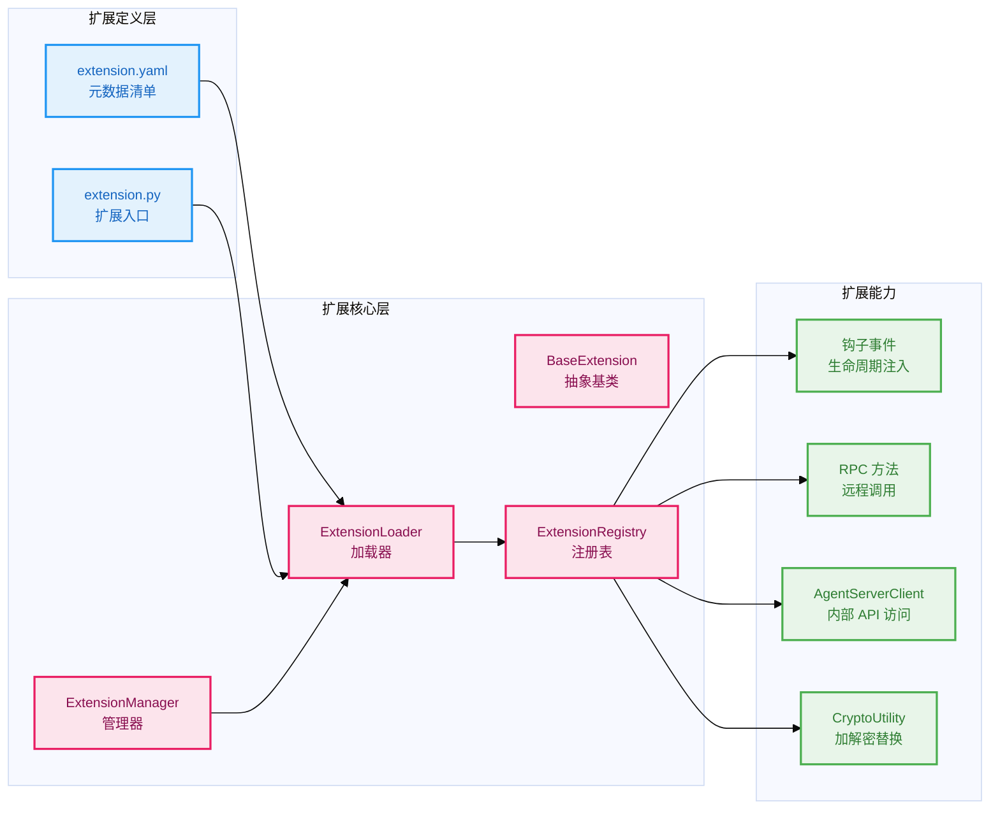

# JiuwenSwarm 扩展机制深度分析

JiuwenSwarm 内置了一套完整的扩展系统，允许第三方在不修改核心代码的前提下，通过钩子事件、RPC 方法注入和能力替换来扩展 Agent 服务器的功能。本文档从定义、架构、加载流程到实战案例，逐层解析这套机制。

> **代码根路径**：`jiuwenswarm/jiuwenswarm/extensions/`  
> **仓库链接**：[jiuwenswarm](https://gitcode.com/openJiuwen/jiuwenswarm)

---

## 一、整体架构

一个扩展本质上是一个**目录**，包含两张核心牌：

```
my_extension/
├── extension.yaml    # 元数据清单 —— 声明"我是谁、需要什么依赖"
└── extension.py      # 扩展入口 —— 必须提供 register_extensions(registry) 函数
```

扩展系统围绕六个核心组件运转：



**关键设计**：扩展与核心代码通过 `extension.yaml` + `register_extensions()` 两个约定完全解耦。扩展到核心系统之间不 import 彼此的类，只通过 `ExtensionRegistry` 交互。

---

## 二、核心组件详解

### 2.1 BaseExtension — 抽象基类

文件：`extensions/sdk/base.py`

```python
class BaseExtension(ABC):
    @abstractmethod
    async def initialize(self, config: ExtensionConfig) -> None:
        """扩展初始化，传入全局配置和 logger"""
        pass

    @abstractmethod
    async def shutdown(self) -> None:
        """扩展关闭，释放资源"""
        pass

    @property
    def metadata(self) -> ExtensionMetadata:
        """自动从 extension.yaml 加载的元数据"""
        ...

    def _load_config_from_yaml(self) -> dict:
        """从 config.yaml 加载扩展私有配置"""
        ...
```

继承自 `BaseExtension` 有两个专用子类：

| 子类 | 文件 | 额外能力 |
|------|------|---------|
| `AgentServerClientExtension` | `extensions/sdk/agent_server_client.py` | 持有 `AgentServerClient` 实例，可替换默认的通信客户端 |
| `CryptoUtility` | `extensions/sdk/crypto_utility.py` | 提供加解密工具接口，可替换默认的加解密实现 |

### 2.2 ExtensionRegistry — 注册表

文件：`extensions/registry.py`

注册表是扩展与核心系统之间的桥梁。它采用**单例模式**（`create_instance` / `get_instance`），维护三种注册信息：

```python
class ExtensionRegistry:
    _agent_server_client   # 唯一的 AgentServerClient   —— 全局替换
    _crypto_tool           # 唯一的加解密工具             —— 全局替换
    _rpc_handlers          # RPC 方法池：{方法名 → 函数} —— 多方法注册
    callback_framework     # 来自 openjiuwen 的回调框架   —— 钩子机制

    # === 钩子事件 ===
    def register(self, event, handler, priority=100)  # 订阅事件
    def unregister(self, event, handler)              # 取消订阅
    async def trigger(self, event, context)           # 触发事件

    # === RPC 方法 ===
    def register_rpc_handler(self, method, handler)   # 注册 RPC 方法
    def get_rpc_handler(self, method) -> Callable     # 获取 RPC 方法
```

**设计关键**：

- `register_agent_server_client` / `register_crypto_utility` — **全局唯一替换**，一个 JiuwenSwarm 实例只能有一个
- `register_rpc_handler` — **多方法注册**，每个扩展可以注册自己的 RPC 方法名
- `register`（钩子事件） — **多对多**，多个扩展可以同时注册同一个事件的处理器

### 2.3 ExtensionLoader — 加载器

文件：`extensions/loader.py`

加载器负责将磁盘上的扩展目录变成内存中的可执行模块。核心流程：

```python
class ExtensionLoader:
    async def load_extension(self, root: Path):
        # ① 加载 extension.yaml 清单
        manifest = _load_manifest_dict(root)

        # ② 安装声明的依赖（uv pip / pip，超时 120s）
        await self._install_dependencies(manifest, root)

        # ③ 通过 importlib.util 动态导入 extension.py
        module = self._import_module(root)

        # ④ 调用 register_extensions(registry) 完成注册
        if hasattr(module, "register_extensions"):
            registered = await module.register_extensions(self.registry)

        return registered
```

**三个关键实现细节**：

1. **依赖安装**：优先使用 `uv pip`，回退到 `pip`，单个依赖失败不中断整体加载
2. **模块隔离**：动态导入的模块挂载到 `jiuwenswarm.loaded_extension.{module_name}` 命名空间下
3. **扩展发现**：扫描配置的搜索路径，找到包含 `extension.yaml` 或 `extension.py` 的目录

### 2.4 ExtensionManager — 管理器

文件：`extensions/manager.py`

管理器协调整个扩展的生命周期：

```python
class ExtensionManager:
    async def load_all_extensions(self):
        roots = self.loader.discover_extension_roots()    # 扫描
        for path in roots:
            loaded = await self.loader.load_extension(path) # 逐个加载
            self._loaded_extensions.append(loaded)

    async def shutdown_all_extensions(self):
        for ext in self._loaded_extensions:
            if hasattr(ext, "shutdown"):
                await ext.shutdown()
```

搜索路径来自配置 `extensions.extension_dirs`，用 `;` 分割多个目录。

### 2.5 ExtensionMetadata — 元数据

文件：`extensions/types.py`

```python
@dataclass
class ExtensionMetadata:
    id: str                      # 全局唯一标识 —— "symphony"
    name: str                    # 人类可读名称
    version: str                 # SemVer 版本 —— "0.1.0"
    description: str             # 一句话描述
    author: str                  # 作者标识
    min_jiuwenswarm_version: str # 兼容性约束 —— "0.2.0"
    dependencies: dict[str, str] # PyPI 依赖 —— {"json-repair": ">=0.30.0"}
    config_schema: dict | None   # JSON Schema，校验用户配置
```

---

## 三、扩展能力详解

### 3.1 钩子事件系统

扩展通过 `registry.register(event, handler, priority)` 订阅事件。系统在关键生命周期节点触发回调，**上下文对象被设计为可变引用**——扩展直接原地修改，上层调用方在回调返回后读取修改后的值。

**Gateway 级别事件**（`extensions/hook_event.py`）：

| 事件名 | 触发时机 | 上下文类型 |
|--------|---------|-----------|
| `gateway_started` | Gateway 启动完毕 | — |
| `gateway_stopped` | Gateway 即将关闭 | — |
| `before_chat_request` | 消息到达，即将路由到 AgentServer | `GatewayChatHookContext` |

**AgentServer 级别事件**：

| 事件名 | 触发时机 | 上下文类型 | 可变字段 |
|--------|---------|-----------|---------|
| `agent_server_started` | AgentServer 启动完毕 | — | — |
| `agent_server_stopped` | AgentServer 即将关闭 | — | — |
| `before_chat_request` | 消息即将被处理 | `AgentServerChatHookContext` | `params`（可修改请求参数） |
| `memory_before_chat` | 注入记忆之前 | `MemoryHookContext` | `memory_blocks`（可注入自定义记忆） |
| `memory_after_chat` | 记忆更新之后 | `MemoryHookContext` | `metadata`（可记录扩展元数据） |
| `before_system_prompt_build` | 构建系统提示词之前 | `SystemPromptHookContext` | `home_dir`、`skill_dir`（可覆盖默认路径） |

**上下文对象的关键设计**——以 `MemoryHookContext` 为例：

```python
@dataclass
class MemoryHookContext:
    session_id: str
    request_id: str
    channel_id: str | None
    agent_name: str
    workspace_dir: str
    assistant_message: str | None = None
    extra: dict = field(default_factory=dict)         # 扩展间传递数据
    memory_blocks: list[str] = field(default_factory=list)  # ★ 写入此处
    metadata: dict = field(default_factory=dict)      # ★ 写入此处
```

钩子处理器可以直接向 `memory_blocks` 追加记忆文本，宿主在回调返回后从这里读取注入内容。

### 3.2 RPC 方法注册

扩展可以向注册表注册可被远程调用的方法：

```python
registry.register_rpc_handler("my_method", handler)

# Gateway 侧调用：
handler = registry.get_rpc_handler("my_method")
result = await handler(params={...}, request=request)
```

Handler 签名约定：

```python
async def handler(
    params: dict[str, Any] | None = None,
    request: Any = None
) -> dict[str, Any]
```

### 3.3 AgentServerClient 替换

通过实现 `AgentServerClientExtension`，扩展可以替换 JiuwenSwarm 与 AgentServer 通信的客户端实现——这是接入第三方 LLM 平台或 Agent 服务的关键入口。

### 3.4 CryptoUtility 替换

类似地，通过 `CryptoUtility` 可以替换默认的加解密模块，适配企业已有的密钥管理体系。

---

## 四、实战分析：Symphony 扩展

Symphony 是 JiuwenSwarm 内置的扩展，通过五个 RPC 方法为前端和 Gateway 提供技能总谱的构建、查询、规划和暂停能力。

### 4.1 清单

`extensions/symphony/extension.yaml`：

```yaml
id: symphony
name: symphony
version: 0.1.0
description: Build Symphony scores and plan explicit skill execution paths.
author: jiuwenswarm
min_jiuwenswarm_version: "0.2.0"
dependencies:
  json-repair: ">=0.30.0"
  rich: ">=13.7.0"
config_schema:
  type: object
```

### 4.2 入口实现

```python
class SymphonyExtension(BaseExtension):
    def register(self, registry):
        registry.register_rpc_handler("symphony.build_score", self.build_score)
        registry.register_rpc_handler("symphony.pause_build", self.pause_build)
        registry.register_rpc_handler("symphony.score_status", self.score_status)
        registry.register_rpc_handler("symphony.graph", self.graph)
        registry.register_rpc_handler("symphony.plan", self.plan)

    async def initialize(self, config):
        return None

    async def shutdown(self):
        return None

async def register_extensions(registry):
    extension = SymphonyExtension()
    extension.register(registry)
    return [extension]
```

### 4.3 五个 RPC 方法

| 方法 | 行为 | 关键设计 |
|------|------|---------|
| `build_score` | 启动技能总谱构建 | 用 `asyncio.Lock` 防止并发；记录进度到 `build_log.jsonl` |
| `pause_build` | 取消正在运行的构建 | 调用 `task.cancel()`，捕获 `CancelledError` 保留已完成的缓存 |
| `score_status` | 返回构建状态 | 从 `build_log.jsonl` 解析进度百分比和 Token 消耗 |
| `graph` | 返回技能关系图 | 加载已构建的 manifest + skills + graph |
| `plan` | 根据 query 做编排规划 | 返回 Markdown 计划 + Mermaid 流程图（可直接前端渲染） |

**值得学习的实现细节**：

1. **异步互斥**：`_build_guard = asyncio.Lock()` 保证同时只有一个构建任务
2. **优雅取消**：捕获 `asyncio.CancelledError` → 写 "paused" 日志 → 返回暂停状态 → 清理 active_task
3. **进度可观测**：通过 `_BuildProcessLogger` 在每个阶段向 `build_log.jsonl` 追加一条 JSON 行日志，`score_status` 从中解析出当前进度百分比
4. **Token 用量追踪**：构建完成后将 LLM token 消耗写入 `llm_token_usage.json`，status 接口读取后以 `llm_token_usage` 字段透出

---

## 五、开发指南

### 5.1 最小示例：一个日志钩子扩展

```python
from jiuwenswarm.extensions.sdk import BaseExtension
from jiuwenswarm.extensions.hook_event import AgentServerHookEvents

class HelloExtension(BaseExtension):
    async def initialize(self, config):
        config.logger.info("[HelloExtension] 已初始化")

    async def shutdown(self):
        pass

    def register(self, registry):
        registry.register(
            AgentServerHookEvents.BEFORE_CHAT_REQUEST,
            self._on_before_chat,
        )

    async def _on_before_chat(self, context):
        context.params["greeting"] = "Hello from extension!"
        self.config.logger.info(f"[Hello] session={context.session_id}")

async def register_extensions(registry):
    ext = HelloExtension()
    ext.register(registry)
    return [ext]
```

### 5.2 部署

将扩展目录放到 `extensions.extension_dirs` 配置的路径下，重启 JiuwenSwarm 即可自动加载。

### 5.3 扩展开发的四个切入点

| 想做的事情 | 使用的机制 |
|-----------|-----------|
| 在每次请求前后做额外处理 | 钩子事件 `before_chat_request` |
| 注入自定义记忆或系统提示词 | `memory_before_chat` + `before_system_prompt_build` |
| 暴露新的 API 给前端调用 | `register_rpc_handler` |
| 替换默认的 LLM Agent 客户端 | `AgentServerClientExtension` |
| 替换默认的加解密实现 | `CryptoUtility` |

---

## 六、架构评析

**亮点**：
- 清单文件 + 入口函数的约定足够简洁，扩展开发者只需关注 `BaseExtension` 的两个抽象方法
- 自动依赖安装（uv pip install）降低了部署门槛
- 钩子上下文采用"可变引用传副作用"模式，避免了中间层的数据搬运——扩展写 `memory_blocks`，宿主读 `memory_blocks`
- Symphony 扩展展示了异步 Lock + asyncio.CancelledError 的优雅任务管理

**待完善**：
- `dependencies` 目前只管理 PyPI 依赖，不支持扩展间的加载顺序依赖
- 只有 `initialize` / `shutdown` 两个生命周期钩子，缺少"配置变更""热重载"等中间态
- 扩展与核心代码运行在同一进程中，没有进程级隔离

---

> **文档版本**：v1.0  
> **最后更新**：2026-06-15
