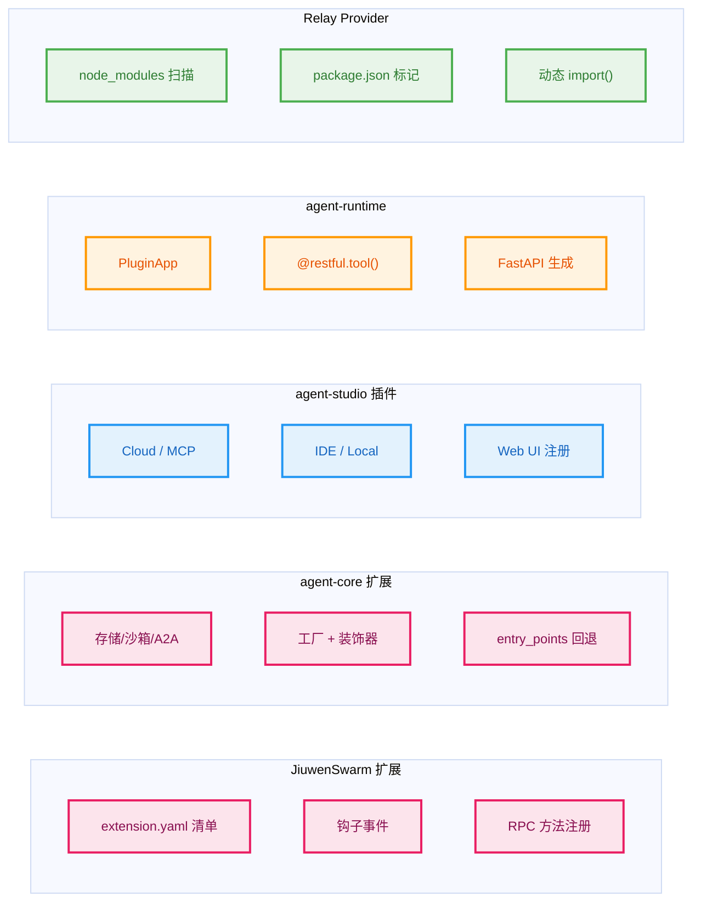

# openJiuwen 第三方生态与扩展机制

openJiuwen 并非一个封闭的单体框架，它通过**五种独立的扩展/插件机制**支持第三方接入。本文档梳理了每种机制的定义、加载方式、核心接口和代码路径，帮助理解如何在 openJiuwen 生态中开发自己的扩展。

---

## 一、全景概览

openJiuwen 中并存五种扩展系统，分属不同的子项目，各自解决不同层面的问题。



---

## 二、JiuwenSwarm 扩展系统（最成熟）

> **定位**：面向 JiuwenSwarm 运行时的功能扩展，通过钩子事件和 RPC 机制扩展 Agent 服务器的能力。  
> **代码路径**：`jiuwenswarm/jiuwenswarm/extensions/`  
> **仓库链接**：[jiuwenswarm](https://gitcode.com/openJiuwen/jiuwenswarm)  
> **语言**：Python

### 2.1 扩展定义

每个扩展是一个目录，包含两个核心文件：

```
my_extension/
├── extension.yaml    # 元数据清单
└── extension.py      # 扩展代码，必须提供 register_extensions(registry) 函数
```

**清单格式（`extension.yaml`）**：

```yaml
id: symphony
name: symphony
version: 0.1.0
description: Build Symphony scores and plan explicit skill execution paths.
author: jiuwenswarm
min_jiuwenswarm_version: "0.2.0"
dependencies:
  json-repair: ">=0.30.0"
  rich: ">=13.7.0"
config_schema:
  type: object
```

字段说明：
- `id` — 全局唯一标识，用于重名检测
- `dependencies` — 自动通过 `uv pip install` 安装的依赖
- `config_schema` — JSON Schema，用户配置的校验规则

### 2.2 抽象基类

`BaseExtension` 是所有扩展的顶层契约（`extensions/sdk/base.py`）：

```python
class BaseExtension(ABC):
    def initialize(self, config: dict) -> None:  # 可选
        pass
    
    def shutdown(self) -> None:  # 可选
        pass
```

此外还有两个专用基类：

| 基类 | 用途 | 文件 |
|------|------|------|
| `AgentServerClientExtension` | 持有 AgentServerClient 实例，使扩展能直接调用 AgentServer 的内部 API | `extensions/sdk/agent_server_client.py` |
| `CryptoUtility` | 提供加解密工具接口 | `extensions/sdk/crypto_utility.py` |

### 2.3 钩子事件系统

扩展通过 `register(event, handler, priority)` 注册钩子，系统在关键生命周期节点触发回调。

**Gateway 级别钩子**：

| 事件名 | 触发时机 |
|--------|---------|
| `gateway_started` | Gateway 启动完成 |
| `gateway_stopped` | Gateway 即将关闭 |
| `before_chat_request` | 用户消息到达、路由到 AgentServer 之前 |

**AgentServer 级别钩子**：

| 事件名 | 触发时机 |
|--------|---------|
| `agent_server_started` | AgentServer 启动完成 |
| `agent_server_stopped` | AgentServer 即将关闭 |
| `before_chat_request` | 用户消息到达、开始处理之前 |
| `memory_before_chat` | 记忆注入之前 |
| `memory_after_chat` | 记忆更新之后 |
| `before_system_prompt_build` | 构建系统提示词之前 |

每种事件有对应的上下文对象（`hooks_context.py`），例如 `MemoryHookContext` 包含 `session`、`query`、`memories` 等字段，扩展可以修改这些数据。

### 2.4 RPC 方法注册

扩展可以向注册表注册 RPC 方法，供 Gateway 或前端远程调用：

```python
registry.register_rpc_handler("my_method", lambda **kwargs: "result")
```

内置的 Symphony 扩展注册了五个 RPC 方法：

```python
# extensions/symphony/extension.py
registry.register_rpc_handler("symphony.build_score", build_score)
registry.register_rpc_handler("symphony.pause_build", pause_build)
registry.register_rpc_handler("symphony.score_status", score_status)
registry.register_rpc_handler("symphony.graph", get_graph)
registry.register_rpc_handler("symphony.plan", get_plan)
```

### 2.5 加载流程

1. **`ExtensionManager`** 从配置读取 `extensions.extension_dirs`（扩展搜索路径列表）
2. **`ExtensionLoader.discover_extension_roots()`** 扫描路径，找到含 `extension.yaml` 或 `extension.py` 的目录
3. 对每个扩展依次执行：
   - 加载 `extension.yaml` 并校验 schema
   - 安装 `dependencies` 中声明的依赖
   - 通过 `importlib` 动态导入 `extension.py`
   - 调用 `register_extensions(registry)` 完成注册
4. 关闭时遍历所有扩展调用 `shutdown()`

### 2.6 核心代码文件索引

| 文件 | 职责 |
|------|------|
| `extensions/__init__.py` | 公共 API 导出 |
| `extensions/loader.py` | 扩展发现与加载 |
| `extensions/registry.py` | 注册表（回调框架、AgentServerClient、RPC handlers） |
| `extensions/manager.py` | 扩展管理器，协调加载/卸载 |
| `extensions/types.py` | `ExtensionMetadata` 和 `ExtensionConfig` 数据模型 |
| `extensions/hook_event.py` | 钩子事件枚举定义 |
| `extensions/hooks_context.py` | 钩子上下文数据结构 |
| `extensions/sdk/base.py` | `BaseExtension` 抽象基类 |

---

## 三、agent-core 扩展系统（基础设施层）

> **定位**：为 agent-core 提供可选的、与外部基础设施对接的能力（存储、沙箱、协议、消息队列等）。  
> **代码路径**：`agent-core/openjiuwen/extensions/`  
> **仓库链接**：[agent-core](https://gitcode.com/openJiuwen/agent-core)  
> **语言**：Python

### 3.1 扩展类别

agent-core 的扩展采用 **Python 子包** 形式，没有清单文件，通过导入时副作用或工厂模式按需加载。

```1:13:d:\workspace\Agent\openJiuwen\agent-core\docs\en\2.Development Guide\API Docs\openjiuwen.extensions.README.md
# openjiuwen.extensions
`openjiuwen.extensions` provides optional extension capabilities for integrating
with external infrastructure or extending the runtime environment.

**Modules**:

| MODULE | DESCRIPTION |
|---|---|
| [message_queue](./openjiuwen.extensions/message_queue.README.md) | Message queue extensions, such as Pulsar. |
| [checkpointer](./openjiuwen.extensions/checkpointer.README.md) | Checkpoint extensions, such as Redis. |
| [a2a](./openjiuwen.extensions/a2a/README.md) | A2A protocol integration for remote clients and server adapters. |
```

### 3.2 存储扩展

存储扩展基于**抽象基类 + 工厂模式**，支持第三方注册自己的实现。

#### 向量存储：`BaseVectorStore`

```python
class BaseVectorStore(ABC):
    """
    **Plugin authoring**: This class is a stable public API. Third-party
    packages MAY subclass this and register via the ``openjiuwen.vector_stores``
    entry_points group or ``register_vector_store``.

    Plugin contract:
    - Implement every abstract method declared below.
    - Every method MUST be async-compatible (``async def``).
    """
```

必需实现的方法：`create_collection`, `delete_collection`, `collection_exists`, `get_schema`, `add_docs`, `search`, `delete_docs_by_ids`, `delete_docs_by_filters`, `list_collection_names`, `update_schema`, `update_collection_metadata`, `get_collection_metadata`

**注册方式**：

```python
from openjiuwen.core.foundation.store import register_vector_store

register_vector_store("my_store", lambda **kwargs: MyVectorStore(**kwargs))
```

内置实现：Chroma、Milvus、GaussVector。扩展实现：`ElasticsearchVectorStore`（位于 `extensions/store/vector/`）。

#### KV 存储：`BaseKVStore`

第三方直接继承并 import 使用，无需注册到工厂。

```python
class BaseKVStore(ABC):
    """
    Plugin authoring: Stable public API. Third-party packages may
    subclass this and export the class directly from their package.
    """
```

必需方法：`set`, `get`, `exists`, `delete`, `mget`, `batch_delete`, `pipeline` 等。

扩展实现：`RedisStore`（`extensions/store/kv/redis_store.py`）

#### 数据库存储：`BaseDbStore`

提供对 SQLAlchemy `AsyncEngine` 的访问。扩展实现：`GaussDbStore`（`extensions/store/db/`）。

### 3.3 A2A 协议扩展（远程客户端 + 服务端适配器）

A2A 扩展实现了双重注册模式：

1. **import-time 注册**：当 `openjiuwen.extensions.a2a` 被导入时，自动调用 `register_remote_client()` 和 `register_server_adapter()`
2. **entry_points 回退**：在 `pyproject.toml` 中声明，作为可安装包的替代路径

**抽象基类**：

| 基类 | 文件 | 用途 |
|------|------|------|
| `RemoteClient` | `core/runner/drunner/remote_client/remote_client.py` | 远程 Agent 的调用接口（start, stop, invoke, stream, cancel_task） |
| 服务端适配器 | `core/runner/drunner/server_adapter/` | 将 AgentServer 暴露为 A2A 服务 |

### 3.4 检查点扩展

使用**装饰器注册**模式：

```python
from openjiuwen.core.session.checkpointer.checkpointer import CheckpointerFactory, CheckpointerProvider

@CheckpointerFactory.register("redis")
class RedisCheckpointerProvider(CheckpointerProvider):
    async def create(self, conf: dict) -> Checkpointer:
        ...
```

内置实现：`in_memory`。扩展实现：`RedisCheckpointerProvider`（启动时根据配置按需导入）

### 3.5 沙箱扩展

使用**装饰器注册到中心注册表**：

```python
@SandboxRegistry.provider("jiuwenbox", "fs")
class JiuwenBoxFSProvider(_JiuwenBoxProviderMixin, BaseFSProvider):
    ...

@SandboxRegistry.provider("aio", "fs")
class AIOFSProvider(BaseFSProvider):
    ...
```

抽象基类：`BaseFSProvider`（文件系统操作）、`BaseShellProvider`（Shell 执行）、`BaseCodeProvider`（代码执行）。

### 3.6 消息队列扩展

通过 `importlib.import_module()` 延迟加载：

```python
elif mq_type == MessageQueueType.PULSAR:
    module = importlib.import_module("openjiuwen.extensions.message_queue.message_queue_pulsar")
    mq_cls = getattr(module, "MessageQueuePulsar")
```

### 3.7 三种注册策略总结

| 策略 | 适用场景 | 示例 |
|------|---------|------|
| **工厂 + entry_points** | 需要按名称动态选择实现 | 远程客户端、向量存储 |
| **装饰器注册** | 类定义时自动注册 | 检查点、沙箱提供者 |
| **直接 import** | 调用方直接依赖具体类 | KV 存储、消息队列 |

### 3.8 可选依赖与扩展的对应关系

从 `pyproject.toml` 的 `[project.optional-dependencies]` 可以看到，大部分扩展需要安装对应的 pip extra：

| pip extra | 解锁能力 |
|-----------|---------|
| `all-a2a` | A2A 远程客户端 + 服务端适配器 |
| `redis` | Redis 检查点 + Redis KV 存储 |
| `pulsar` | Pulsar 消息队列 |
| `elasticsearch` | ES 向量存储 |
| `sandbox` | AIO 沙箱提供者 |
| `gaussdb` | GaussDB 数据库存储 |
| `pgvector` | PostgreSQL 向量支持 |

---

## 四、agent-studio 插件系统（用户面）

> **定位**：面向非深度编程用户，通过 Web UI 注册和使用插件，无需编写扩展代码。  
> **代码路径**：`agent-studio/backend/openjiuwen_studio/`（后端）+ `agent-studio/plugin_server/`（本地插件服务）  
> **仓库链接**：[agent-studio](https://gitcode.com/openJiuwen/agent-studio)  
> **文档**：`agent-studio/docs/en/4.Development Guide/Plugin Management.md`  
> **语言**：Python（后端）+ TypeScript（前端）

### 4.1 四种插件类型

| 类型 | 描述 | 适用场景 |
|------|------|---------|
| **Cloud Plugin** | 基于已有 RESTful 服务创建插件，配置 Service URL 和 API 路径 | 接入公司内部已部署的 API 服务 |
| **MCP Server Plugin** | 连接 [MCP](https://modelcontextprotocol.io) 协议服务器，支持 5 种传输协议（STDIO / SSE / Streamable HTTP / OpenAPI / Playwright） | 接入任何实现了 MCP 协议的第三方工具 |
| **IDE Plugin（Code Plugin）** | 手动编写 Python/JavaScript 代码，本地沙盒运行 | 快速开发原型工具 |
| **Local Plugin Server** | 自部署 FastAPI 插件服务 | 需要复杂逻辑、需要保持长连接的工具服务 |

### 4.2 本地插件服务框架

`plugin_server/` 提供了 `BasePluginRouter` 基类，开发者可以快速构建插件服务：

```python
from openjiuwen_plugin_server.routers import BasePluginRouter

class MyPluginRouter(BasePluginRouter):
    def __init__(self):
        super().__init__()
        
    def register_endpoints(self):
        # 使用 self.register_endpoint() 注册工具端点
        self.register_endpoint(
            path="/my_tool",
            method="POST",
            handler=self.run_my_tool,
            description="My custom tool"
        )
```

### 4.3 插件管理后端

插件在 Studio 后端通过以下模块进行管理：

| 文件 | 职责 |
|------|------|
| `models/plugin.py` | SQLAlchemy 数据模型 |
| `schemas/plugin.py` | Pydantic 请求/响应 Schema |
| `routers/plugin.py` | FastAPI 路由（CRUD） |
| `core/manager/plugin.py` | 插件管理核心逻辑 |
| `core/manager/repositories/plugin_repository.py` | 数据仓库层 |

---

## 五、agent-runtime PluginApp（部署级工具服务）

> **定位**：将一个工具集快速封装为独立的 RESTful 服务，部署到 agent-runtime 中。  
> **代码路径**：`agent-runtime/service/openjiuwen_runtime/service/app/plugin_app.py`  
> **仓库链接**：[agent-runtime](https://gitcode.com/openJiuwen/agent-runtime)  
> **语言**：Python

### 5.1 核心 API

```python
from openjiuwen_runtime.service.app.plugin_app import PluginApp

app = PluginApp(
    app_name="CalculatorTools",
    app_description="数学计算工具集",
    version="0.1.0",
)

@app.restful.tool(name="add", description="计算两个数字的和")
async def add(a: float, b: float) -> dict:
    return {"operation": "addition", "result": a + b}

app.run()  # 自动生成 /health, /tools, /tools/add 端点
```

`PluginApp` 继承自 `BaseApp`（FastAPI 封装），自动提供：

| 端点 | 用途 |
|------|------|
| `GET /health` | 健康检查 |
| `GET /tools` | 列出所有注册的工具及参数 schema |
| `POST /tools/{name}` | 调用指定工具 |

---

## 六、Relay 提供者插件系统（TypeScript 生态）

> **定位**：为 Relay/OfficeClaw 平台动态加载 Provider 插件。  
> **代码路径**：`relay/packages/core/src/plugin/` + `relay/packages/plugin/`  
> **仓库链接**：[relay](https://gitcode.com/openJiuwen/relay)  
> **语言**：TypeScript

### 6.1 插件接口

```typescript
export interface OfficeClawProviderPlugin {
  name: string;
  providers: readonly string[];
  createAgentService(context: AgentServiceFactoryContext): AgentService | Promise<AgentService>;
}
```

### 6.2 发现机制

1. 扫描 `node_modules/@office-claw/provider-*` 目录
2. 读取 `package.json` 中 `clowder.kind === 'provider'` 标记
3. 通过动态 `import()` 加载符合接口的插件

### 6.3 插件契约包

Relay 将插件接口定义为独立的契约包（`packages/plugin/api/` 和 `packages/plugin/web/`），插件只依赖契约包而不依赖主应用的具体实现，形成清晰的依赖边界。

---

## 七、总结对比

| 维度 | JiuwenSwarm | agent-core | agent-studio | agent-runtime | Relay |
|------|------------|------------|-------------|--------------|-------|
| **面向对象** | 扩展开发者 | 基础设施扩展 | 最终用户 | 工具开发者 | TypeScript 插件开发者 |
| **清单格式** | `extension.yaml` | 无（纯模块） | Web 表单 | 无（代码注册） | `package.json` 标记 |
| **加载方式** | 目录扫描 + importlib | import / 工厂 / 装饰器 | Web UI + DB | 代码调用 | npm 动态 import |
| **注册方式** | `register(evt, handler)` | `register_*()` / `@register` | Web 表单注册 | `@restful.tool()` | `package.json` `clowder.kind` |
| **核心能力** | 钩子事件 + RPC | 存储 / 沙箱 / 协议 | 即插即用工具 | RESTful 工具服务 | 多 LLM Provider 接入 |
| **语言** | Python | Python | Python + TS | Python | TypeScript |

---

> **文档版本**：v1.0  
> **最后更新**：2026-06-15
