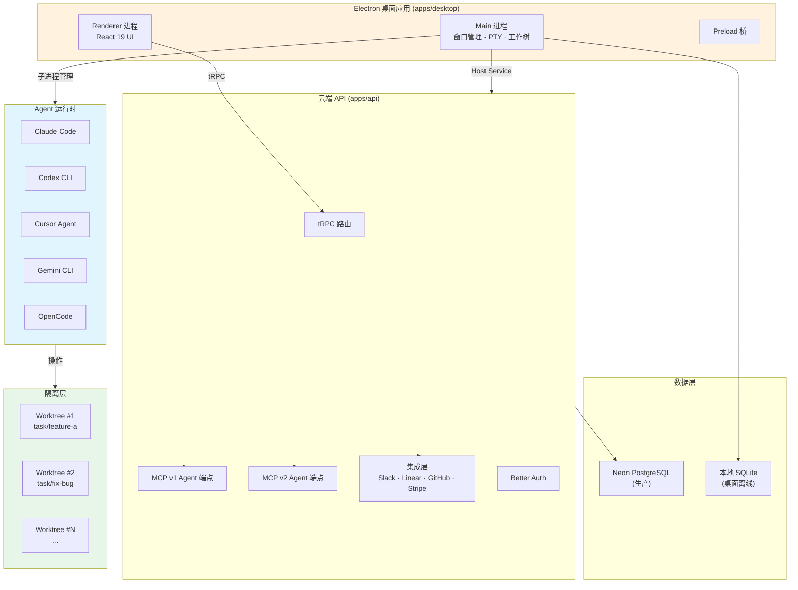
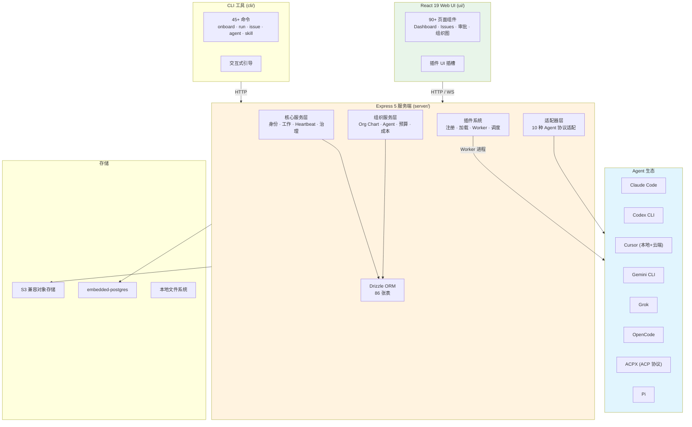
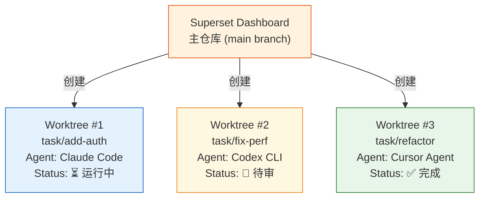
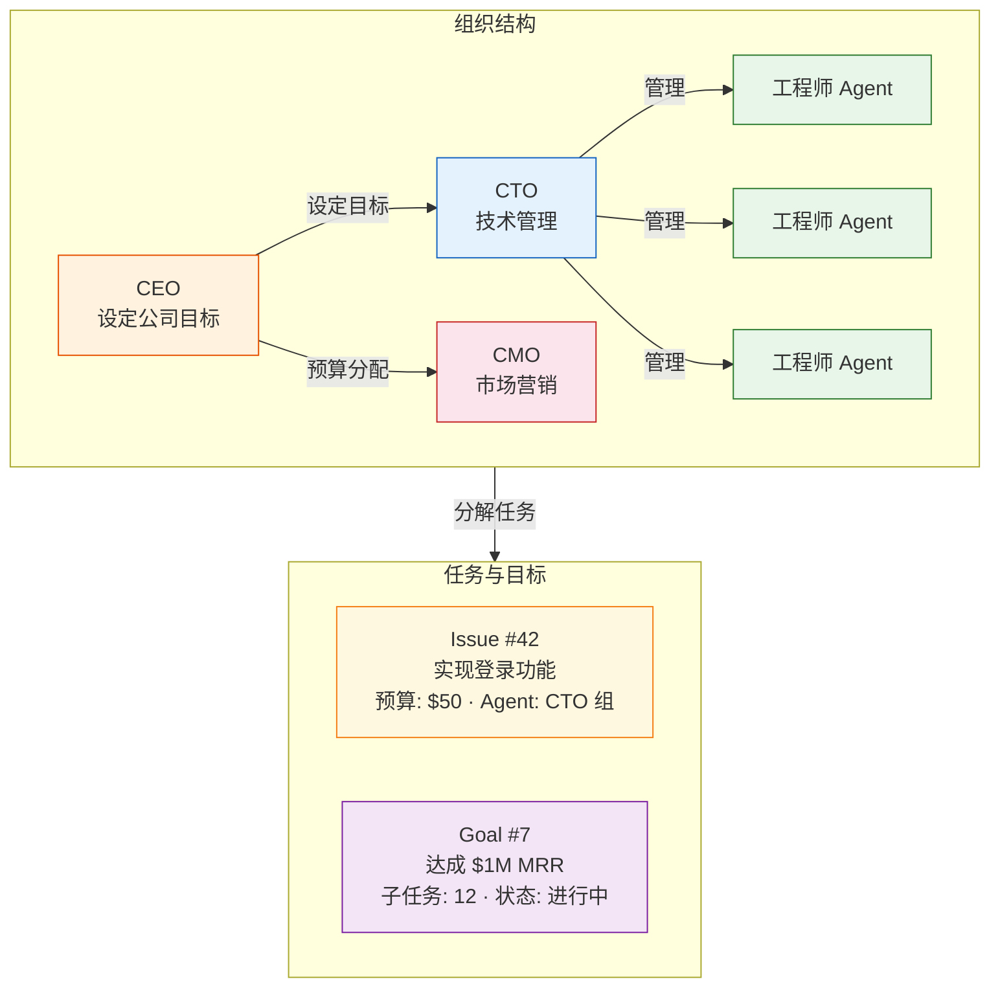
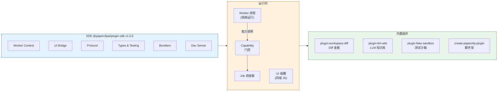
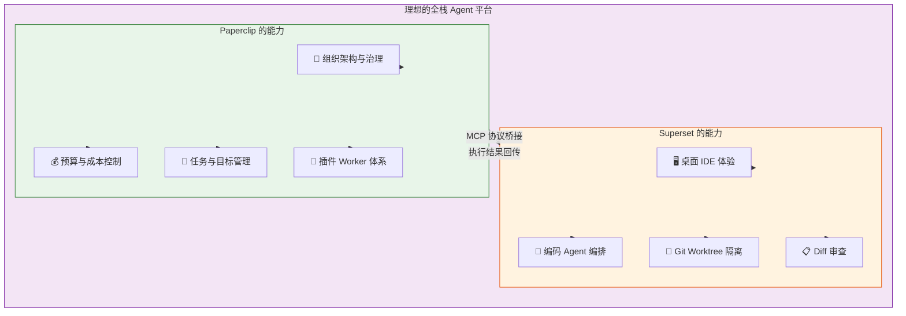

# AI Agent 编排平台深度调研：Superset vs Paperclip

> 调研日期：2026-06-08  
> 分析对象：[Superset v1.12.4](https://github.com/superset-sh/superset) · [Paperclip v0.3.1](https://github.com/paperclipai/paperclip)  
> 许可证：Superset (Elastic License 2.0) · Paperclip (MIT)

---

## 一、项目概览与背景

2025–2026 年，**AI Coding Agent** 从单 CLI 工具（Claude Code、Codex、Gemini CLI）演进到**多 Agent 编排平台**的赛道。两个代表性项目——**Superset** 与 **Paperclip**——以截然不同的哲学切入这一领域，分别定义了"Agent IDE"和"Agent 组织"两种范式。

### 1.1 Superset：Agent 的代码编辑器

| 维度 | 说明 |
|------|------|
| **标语** | *"The Code Editor for AI Agents"* |
| **定位** | 在桌面端并行编排多个 CLI 编码 Agent，每人一个隔离工作树 |
| **核心用户** | 需要同时跑多个编码 Agent 的软件开发者 |
| **主力形态** | Electron 桌面应用（`apps/desktop`），辅以 Next.js 云端 API |
| **技术栈** | TypeScript · Bun · Turborepo · Electron · React 19 · TailwindCSS v4 · Drizzle ORM |
| **许可证** | Elastic License 2.0 |
| **社区** | 开源，GitHub 主仓库，Issue / PR 模板齐全，14 个 CI/CD Workflow |

**核心理念**：每个 Agent 任务就是一个隔离的 Git Worktree，Agent 在其中自由操作文件、运行命令。Superset 提供统一的终端、Diff 审查、文件树等 IDE 体验，但不干预 Agent 的内部编排逻辑。

### 1.2 Paperclip：Agent 的公司

| 维度 | 说明 |
|------|------|
| **标语** | *"The app people use to manage AI agents for work."* |
| **定位** | 为 AI Agent 团队建立组织架构、预算、治理和任务跟踪系统 |
| **核心用户** | 需要长期运行多 Agent 团队的业务运营者 |
| **主力形态** | Express 5 服务端 + React 19 Web UI + CLI 管理工具 |
| **技术栈** | TypeScript · pnpm · Express 5 · React 19 · Drizzle ORM · embedded-postgres |
| **许可证** | MIT |
| **社区** | 开源，详细的开发者文档，完整的插件 SDK |

**核心理念**：Agent 不是工具，是员工。Paperclip 让用户为 AI Agent 创建公司——定义岗位（CEO / CTO / 工程师）、分配预算、设置目标、审批策略，让 Agent 团队像真实公司一样运作。

### 1.3 哲学差异

```mermaid
flowchart LR
    subgraph SUP["Superset 的隐喻"]
        direction TB
        S1["Agent = 开发者"]
        S2["任务 = PR / 分支"]
        S3["工作台 = IDE"]
        S4["隔离 = Git Worktree"]
        S5["⏱ 生命周期 = 会话级"]
    end

    subgraph PAP["Paperclip 的隐喻"]
        direction TB
        P1["Agent = 员工"]
        P2["任务 = Ticket"]
        P3["组织 = 公司"]
        P4["治理 = Org Chart"]
        P5["♾️ 生命周期 = 持续"]
    end

    SUP --- PAP

    style SUP fill:#fff3e0,stroke:#e65100
    style PAP fill:#e8f5e9,stroke:#2e7d32
    style S1 fill:#ffe0b2
    style S2 fill:#ffe0b2
    style S3 fill:#ffe0b2
    style S4 fill:#ffe0b2
    style S5 fill:#ffe0b2
    style P1 fill:#c8e6c9
    style P2 fill:#c8e6c9
    style P3 fill:#c8e6c9
    style P4 fill:#c8e6c9
    style P5 fill:#c8e6c9
```

---

## 二、架构设计

### 2.1 Superset 架构

**关键架构特点**：

- **双进程 Electron**：Renderer 负责 UI，Main 进程负责子进程管理（Agent 启动/终止）、PTY 终端、工作树创建
- **双数据源**：桌面端使用本地 SQLite 离线可用；云端使用 Neon PostgreSQL
- **MCP 双协议**：同时支持 MCP v1 和 v2 协议端点，Agent 可通过 MCP 调用 Superset 工具
- **集成层**：Slack Bot 作为 Agent Runner，Linear 做任务同步，GitHub Webhook 做事件驱动

### 2.2 Paperclip 架构

**关键架构特点**：

- **单进程服务端**：Express 5 HTTP 服务端承载全部业务逻辑，嵌入式 Postgres 省去外部数据库部署
- **插件 Worker 架构**：插件以独立子进程运行，通过 capability-gated API 与主进程通信
- **适配器设计模式**：每种 Agent 一个适配器包，统一转换为 Paperclip 内部协议
- **数据模型庞大**：86 张 ORM 表覆盖公司、Agent、Issue、Goal、Budget、Plugin 等全领域
- **三端同构**：Server / UI / CLI 三种入口共享同一 `@paperclipai/shared` 类型系统和 `@paperclipai/db` 数据层

### 2.3 架构对比

| 维度 | Superset | Paperclip |
|------|----------|-----------|
| **部署模式** | 桌面为主 + 云端辅助 | 自托管服务端 + Web UI |
| **进程模型** | Electron 双进程 + 子进程 Agent 池 | Express 单进程 + 插件 Worker 子进程 |
| **数据库** | PostgreSQL (生产) + SQLite (离线) | embedded-postgres (本地)、可切换 PG |
| **API 协议** | tRPC (类型安全 RPC) + MCP v1/v2 | REST (Express) + WebSocket |
| **插件系统** | 未独立（通过 Agent 原生 Hooks 扩展） | 完整插件 SDK：Worker + UI 插槽 + API |
| **客户端** | Electron 桌面应用 + Web | Web SPA + CLI + Mobile-ready |
| **实时性** | ElectricSQL (实时查询) | Live Events + WebSocket |

---

## 三、Agent 编排模型

这是两个项目最核心的差异所在——**如何组织和管理 AI Agent 完成工作**。

### 3.1 Superset：工作树并行执行

Superset 的设计围绕**一次一个任务，每个任务一个分支**的开发者工作流展开：

关键实现细节：

- **WorkspaceInitManager** (`apps/desktop/src/main/lib/workspace-init-manager.ts`)：工作树生命周期管理的单例 EventEmitter，支持 `"branch"`（主仓库）和 `"worktree"`（Git 工作树）两种模式
- **状态流**：`pending → creating_worktree → setting_up → ready | failed`
- **并发控制**：每个项目互斥锁防止并发 Git 操作
- **支持取消**：正在创建的工作树可取消，自动清理
- **Agent 启动**：`agent-session-orchestrator.ts` 统一调度终端适配器（终端标签页）和聊天适配器（对话标签页）

### 3.2 Paperclip：组织图 + 任务驱动

Paperclip 将 Agent 视为组织的成员，通过岗位体系、预算、目标和任务驱动工作：

关键实现细节：

- **Heartbeat 机制**（`server/src/services/heartbeat.ts`）：Agent 通过定时心跳被唤醒执行任务，不是常驻进程
- **Issue 生命周期**（`server/src/services/issues.ts` + 20+ 关联服务）：Issue → Plan → Execution → Approval 全链路追踪
- **Govrnance Holds**（`issue-tree-control.ts`）：任务树的审批门控机制
- **预算控制**（`budgets.ts` + `costs.ts`）：每个 Agent/项目有月度预算，超预算触发告警或暂停
- **目标对齐**（`goals.ts` + `projects.ts`）：每个 Issue 可追溯到公司级目标

### 3.3 编排模型对比

| 维度 | Superset | Paperclip |
|------|----------|-----------|
| **Agent 生命周期** | 会话级：用户创建任务 → Agent 执行 → 审查 → 完成 | 持续级：Agent 员工在组织图中长期存在，心跳驱动 |
| **任务单位** | Git Worktree（分支级隔离） | Issue / Ticket（带完整生命周期） |
| **并行策略** | 每个 Worktree 独立运行一个 Agent | 多个 Agent 按分工并行，通过 Heartbeat 调度 |
| **隔离机制** | 文件系统级：Git Worktree | 数据模型级：公司/项目/Issue 所有权 |
| **状态管理** | 本地 SQLite 记录工作树状态 | 服务端数据库全量持久化 |
| **审批流程** | 手动审查 Diff | 可配置的 Governance Holds |
| **预算控制** | 无 | 完善的 Budget + Cost 追踪 |
| **目标管理** | 无 | Goal → Project → Issue 三层对齐 |

---

## 四、关键技术实现

### 4.1 数据库与持久化

#### Superset

| 层级 | 技术 | 用途 |
|------|------|------|
| 生产数据库 | Neon PostgreSQL (Drizzle ORM) | 用户、项目、集成数据 |
| 本地数据库 | SQLite (`better-sqlite3` + `@superset/local-db`) | 桌面端离线数据、工作树状态 |
| 实时查询 | TanStack DB + ElectricSQL | 缓存优先的实时数据同步 |
| API 层 | tRPC（类型安全 RPC） | 服务端与客户端之间的类型安全通信 |

#### Paperclip

| 层级 | 技术 | 用途 |
|------|------|------|
| 主数据库 | PostgreSQL (embedded-postgres / 外部) | 全部业务数据：86 张表 |
| ORM | Drizzle ORM | 全链路类型安全的数据库操作 |
| 迁移 | drizzle-kit | 98 个增量迁移快照 |
| 文件存储 | S3 兼容存储 + 本地磁盘双支持 | 附件、项目文件、插件数据 |
| 缓存 | 不依赖外部缓存（数据库直查） | 当前版本去中心化设计 |

### 4.2 认证与安全

| 维度 | Superset | Paperclip |
|------|----------|-----------|
| **认证方案** | Better Auth (内置) | Better Auth |
| **API 认证** | API Key (`sk_live_`)、OAuth/JWT、Session Cookie | API Key、Session、CLI Auth Challenge |
| **OAuth** | GitHub OAuth、Google OAuth | 可配置 |
| **Agent 权限** | 操作系统级：Agent 在 Worktree 中的 Shell 权限 | 应用级：Agent Permission、Trust Preset、Sandbox Provider |
| **安全沙箱** | 无内置沙箱（依赖 Agent 自身的安全策略） | Sandbox Provider 插件（Modal、E2B、Daytona、Cloudflare） |
| **多租户隔离** | 项目级（每个 Worktree 隔离） | 公司级（Multi-Company，完整数据隔离） |
| **审计日志** | Git 提交历史 | 全局 Activity Log + Secret Access Events |

### 4.3 支持的 Agent 种类

| Agent | Superset | Paperclip |
|-------|----------|-----------|
| **Claude Code** | ✅ 原生支持 | ✅ adapter-claude-local |
| **Codex CLI** | ✅ 原生支持 | ✅ adapter-codex-local |
| **Cursor Agent** | ✅ 原生支持 | ✅ adapter-cursor-local + cursor-cloud |
| **Gemini CLI** | ✅ 原生支持 | ✅ adapter-gemini-local |
| **OpenCode** | ✅ 原生支持 | ✅ adapter-opencode-local |
| **Grok** | ❌ | ✅ adapter-grok-local |
| **Pi** | ❌ | ✅ adapter-pi-local |
| **ACPX (ACP 协议)** | ❌ | ✅ adapter-acpx-local |
| **OpenClaw Gateway** | ❌ | ✅ adapter-openclaw-gateway |
| **GitHub Copilot** | ✅ | ❌ |
| **Amp Code** | ✅ | ❌ |
| **Droid (Factory AI)** | ✅ | ❌ |
| **Mastra Code** | ✅ | ❌ |
| **任何 CLI Agent** | ✅ 通用兼容 | ✅ CLI/bach Agent |

**Superset 的优势**：对编码 Agent 覆盖全面，强调"任何可在终端运行的 CLI Agent"，通过 Shell 包装器通用兼容。

**Paperclip 的优势**：Agent 类型更广——从编码 Agent 到 ACP 协议 Agent、Grok、OpenClaw Gateway，甚至纯 HTTP/Webhook Bot，通过适配器模式统一接入。

---

## 五、生态与扩展性

### 5.1 Superset：Agent 生态内扩展

Superset 的扩展策略是**尊重 Agent 原生生态**，通过统一工作台聚合各类扩展：

- **MCP 服务器**：支持 MCP v1 + v2 协议，预置 Superset、Maestro、Neon、Linear、Sentry 等 MCP 工具
- **Agent 原生工具**：不重新实现 Agent 工具，保留 Claude Hooks、Codex Exec Sandbox 等原生能力
- **Workspace Presets**：通过 `.superset/config.json` 定义项目初始化脚本（setup、teardown、run）
- **IDE 快捷键**：一键在 VS Code、Cursor、JetBrains 等编辑器中打开工作区

**没有独立的插件系统**——Superset 的扩展性依赖 Agent 自身的扩展机制（Claude Plugins、MCP、Hooks），而非构建自己的插件生态。

### 5.2 Paperclip：自有插件生态

Paperclip 构建了从 SDK 到 Worker 运行时的完整插件体系：

**插件功能亮点**：

- **完整的 Worker 生命周期管理**（27 个服务文件）：注册 → 加载 → 配置校验 → 能力门控 → Worker 启动 → 工具调度 → 日志 → 清理
- **UI 插槽**：插件可以在主 UI 的任意位置注入 React 组件
- **命名空间数据库**：插件拥有独立的数据库命名空间，避免 schema 冲突
- **脚手架工具**：`create-paperclip-plugin` 一键创建插件项目
- **热重载**：开发模式下 `pnpm dev:ui` 支持 UI 热替换

### 5.3 MCP 协议支持对比

| 维度 | Superset | Paperclip |
|------|----------|-----------|
| **MCP v1** | ✅ 独立端点 (`/api/agent/mcp`) | ✅ `packages/mcp-server` |
| **MCP v2** | ✅ 独立端点 (`/api/v2/agent/mcp`) | ❌ 未实现 |
| **MCP 客户端** | ✅ Slack Bot 使用 MCP 客户端调用 Superset 工具 | ❌ 暂无 |
| **MCP 服务器配置** | ✅ `.mastracode/mcp.json` 管理多个 MCP 服务器 | ❌ 依赖 Agent 原生 MCP 配置 |
| **认证方式** | API Key / OAuth / Session 三种 | 未公开 |

---

## 六、开发者体验

### 6.1 本地开发环境

| 维度 | Superset | Paperclip |
|------|----------|-----------|
| **包管理器** | Bun v1.0+ | pnpm 9.15+ |
| **构建系统** | Turborepo | pnpm workspaces |
| **语言** | TypeScript (strict) | TypeScript (strict, ESM) |
| **Node 版本** | 未限定 | 20+ |
| **数据库** | Docker Postgres + Electric (`setup.local.sh`) | 内置 embedded-postgres（零配置） |
| **Dev 命令** | 未公开（参考 `apps/desktop/package.json` scripts） | `pnpm dev`（全栈监听） |
| **类型检查** | Biome | `pnpm typecheck` |
| **测试** | Vitest | Vitest + Playwright E2E |
| **Storybook** | 未集成 | ✅ 35+ stories |

### 6.2 CLI 工具

| 维度 | Superset | Paperclip |
|------|----------|-----------|
| **CLI 名称** | 无独立 CLI（桌面应用入口） | `paperclipai` |
| **安装方式** | Electron 桌面应用安装包 | `npx paperclipai onboard --yes` 或 npm 全局安装 |
| **命令数量** | 无 | 45+ 命令 |
| **交互式引导** | 无 | ✅ `onboard` 交互式向导 |
| **健康检查** | 无 | ✅ `doctor` 诊断命令 |
| **资源管理** | 通过桌面 UI | CLI 支持 Issue / Agent / Skill / Secrets / Cost / Budget 全资源 CRUD |

### 6.3 文档质量

| 维度 | Superset | Paperclip |
|------|----------|-----------|
| **README** | 简洁明确，突出 8 大特性 | 详细完整，三步入门 |
| **开发者文档** | `AGENTS.md`（AI Agent 开发指南）+ `DEVELOPMENT.md` | `DEVELOPING.md` + `SPEC.md` + `SPEC-implementation.md` |
| **架构文档** | 无独立文档（依赖 AGENTS.md 描述） | `PLUGIN_SPEC.md`、`PLUGIN_AUTHORING_GUIDE.md` 等 |
| **API 文档** | tRPC 类型自文档 | 未单独提供 |
| **Plans 目录** | 无 | 40+ 按日期组织的计划文档 |
| **产品截图** | ❌ 无可用截图 | ✅ Banner、Dashboard、Diff Viewer 等多张截图 |

---

## 七、总结与对比

### 7.1 全方位对比矩阵

| 维度 | Superset | Paperclip |
|------|----------|-----------|
| **许可证** | Elastic License 2.0 ⚠️ | MIT ✅ |
| **部署难度** | 中等（需 Docker + 多服务） | 低（embedded-postgres，单命令启动） |
| **桌面端** | ✅ Electron 原生应用 | ❌ Web-only |
| **离线能力** | ✅ 本地 SQLite + 离线工作流 | ❌ 依赖服务端 |
| **编码功能** | ✅ 代码编辑器 + Diff + 终端 + 文件树 | ❌ 无内置编码工具 |
| **任务管理** | ❌ 无（依赖 Git Branch） | ✅ 完整的 Issue/Ticket 系统 |
| **预算控制** | ❌ | ✅ Budget + Cost 追踪 |
| **组织图** | ❌ | ✅ 多层 Org Chart |
| **审批流程** | ❌（手动审查） | ✅ Governance Holds |
| **多公司隔离** | ❌ | ✅ Multi-Company |
| **Agent 常驻** | ❌（会话级） | ✅ Heartbeat 驱动 |
| **插件系统** | ❌（依赖 Agent 原生扩展） | ✅ 完整 SDK + Worker |
| **MCP 协议** | ✅ v1 + v2 | ✅ v1 |
| **社区活跃度** | ✅ CI 完整、Issue 模板齐全 | ✅ 详细文档、丰富 Screenshots、Plans |
| **适合场景** | 开发者的编码并行加速 | 业务运营的 Agent 团队管理 |

### 7.2 适用场景建议

**选择 Superset 当你的需求是：**

- 你是一名软件开发者，需要并行跑多个编码 Agent 加速开发
- 你熟悉 Git Worktree 工作流，希望在隔离分支上并行实验
- 你需要在桌面端获得 IDE 级别的编码体验（编辑、Diff、终端）
- 你希望利用 Agent 的原生生态（Claude Hooks、Codex Sandbox）

**选择 Paperclip 当你的需求是：**

- 你需要长期运行一组 AI Agent，像管理团队一样管理它们
- 你需要预算控制、任务追踪、审批流程等治理能力
- 你希望 Agent 能自动按目标分解任务、定期 Heartbeat 执行
- 你需要插件扩展能力，自定义 Agent 工作流
- 你希望多团队/多公司在同一部署中完整隔离

### 7.3 互补与融合空间

两个项目在以下方面存在互补：

一个可能的融合方向：Paperclip 作为**组织管理层**，Superset 作为**编码执行层**——Paperclip 通过 MCP 调用 Superset 的 Worktree 能力，Superset 的 Agent 执行结果回传到 Paperclip 的任务追踪系统。

---

## 参考资料

### Superset
- [GitHub 仓库](https://github.com/superset-sh/superset)
- [AGENTS.md — Monorepo 开发指南](https://github.com/superset-sh/superset/blob/main/AGENTS.md)
- [DEVELOPMENT.md](https://github.com/superset-sh/superset/blob/main/DEVELOPMENT.md)
- [许可证: Elastic License 2.0](https://github.com/superset-sh/superset/blob/main/LICENSE.md)

### Paperclip
- [GitHub 仓库](https://github.com/paperclipai/paperclip)
- [Developer Setup Guide](https://github.com/paperclipai/paperclip/blob/main/doc/DEVELOPING.md)
- [System Specification](https://github.com/paperclipai/paperclip/blob/main/doc/SPEC.md)
- [Plugin Authoring Guide](https://github.com/paperclipai/paperclip/blob/main/doc/plugins/PLUGIN_AUTHORING_GUIDE.md)
- [Deployment Modes](https://github.com/paperclipai/paperclip/blob/main/doc/DEPLOYMENT-MODES.md)

### 调研数据来源
- 本地源码深度分析（`C:\data\project\climanager\superset/` & `paperclip/`）
- README 及仓库内文档
- 各包 `package.json` 文件
- 服务端、客户端、CLI 源码结构分析
