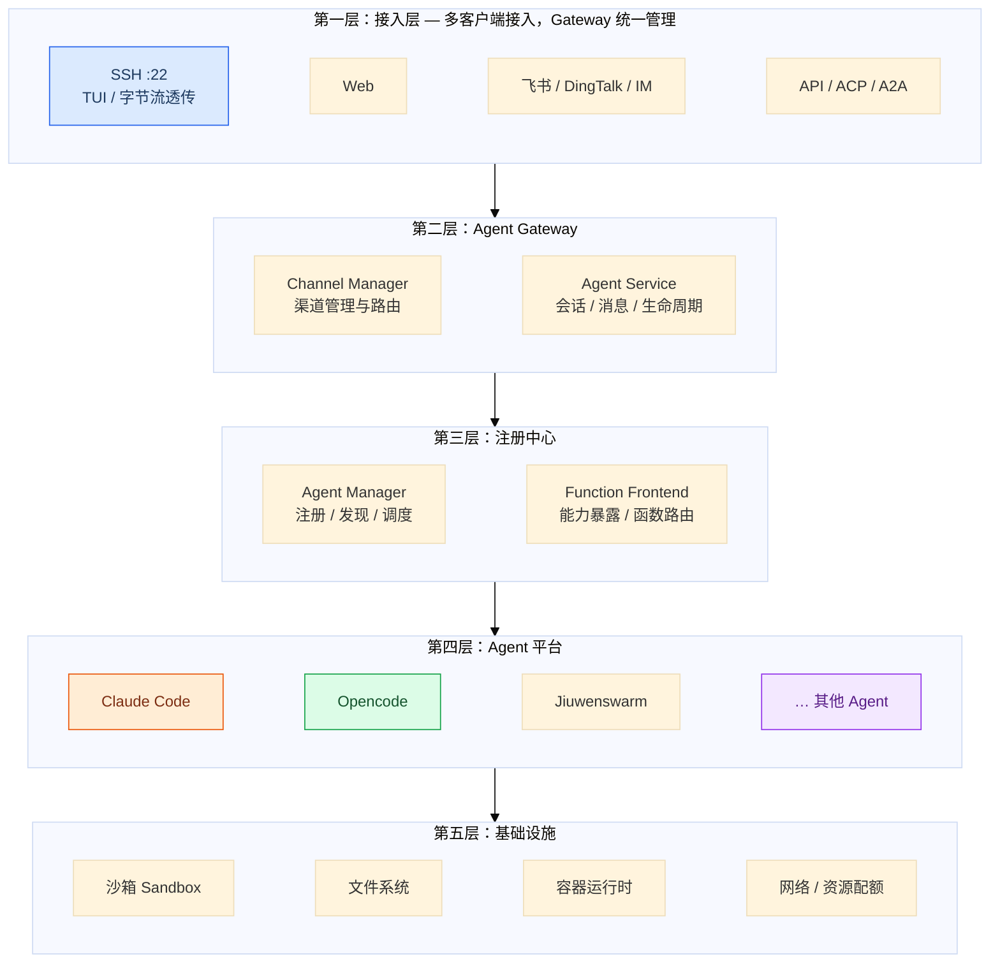
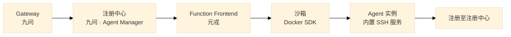
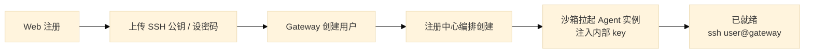
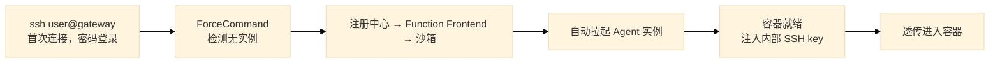
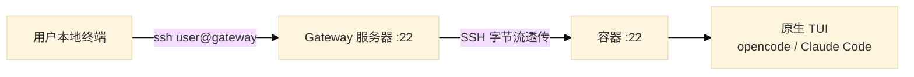
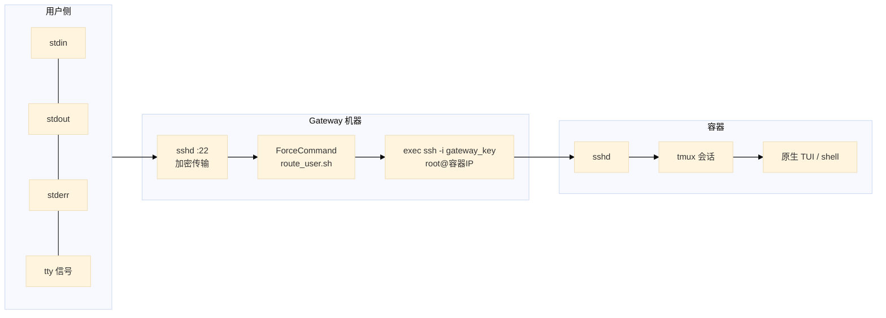
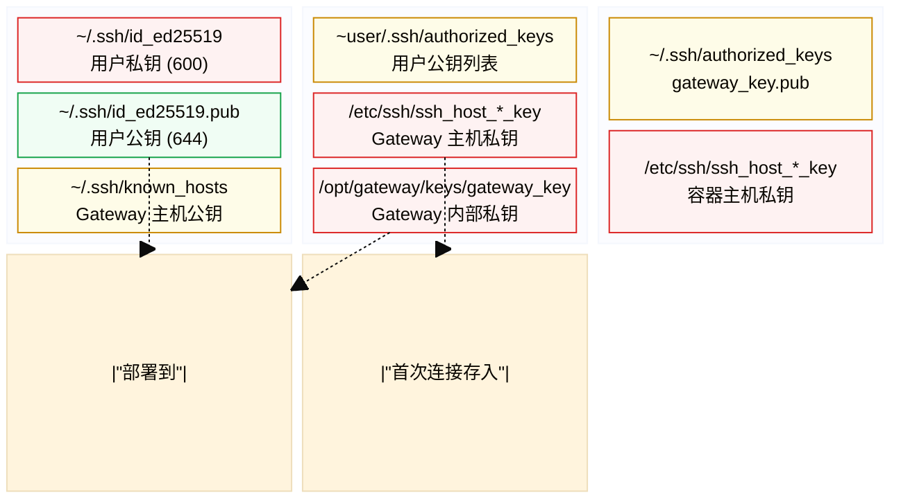
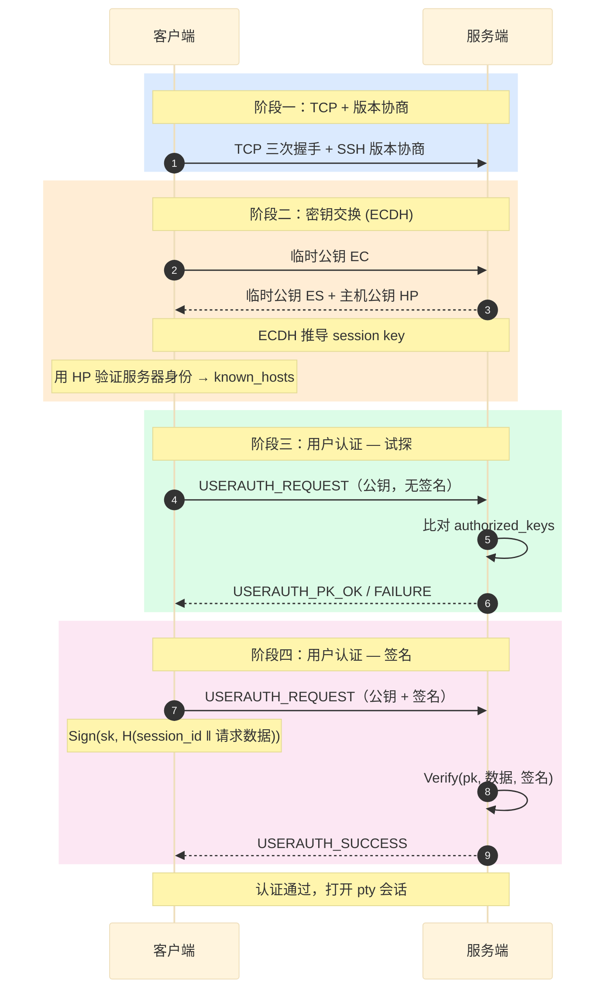
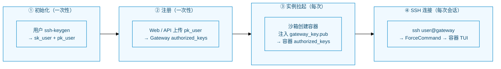
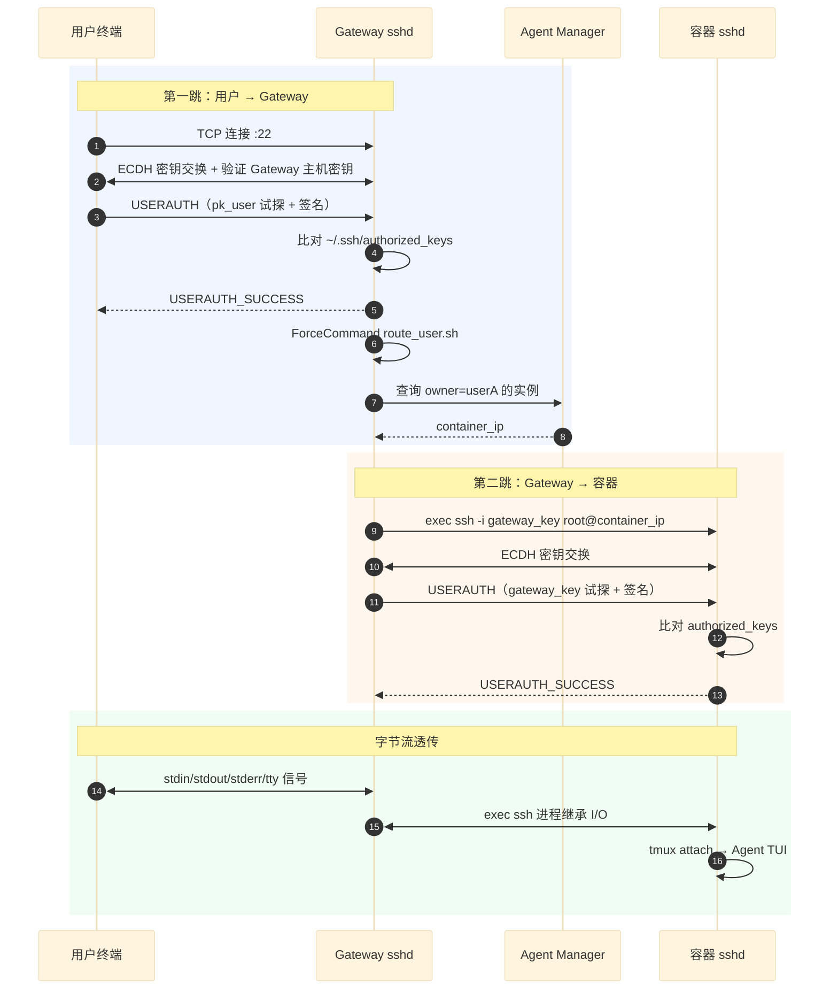

# 三方 Agent 接入 Agent OS 需求设计说明书

## 概述

设计目标是基于 opencode/claude 等第三方 Agent 平台接入 Agent OS 的需求设计，核心理念：**与 jiuwen 统一前端接入，由 Gateway 作为消息转发的统一入口，多端接入，统一身份认证**。

**设计组件及职责：**

| 组件 | 职责 |
|------|------|
| **openYuanRong** | 硬件资源管理；运行沙箱隔离；容器化拉起 Agent 实例；Function Frontend 能力暴露与函数路由 |
| **openJiuwen Gateway** | 统一消息入口；支持 SSH / Web / IM / ACP / A2A 等多端接入；Agent 实例生命周期管理与路由 |



## 第一章 Agent 实例创建

三方 Agent（opencode、Claude Code 等）需以**独立沙箱实例**运行，并内置 SSH 服务供 Gateway 透传。实例拉起链路如下：



### 1.1 拉起流程

| 步骤 | 组件 | 职责 |
|------|------|------|
| 1 | **Gateway（九问）** | 接收用户接入请求（Web / SSH / IM），校验身份与配额，向注册中心发起「创建 Agent 实例」 |
| 2 | **注册中心（九问）** | `Agent Manager` 编排实例生命周期：分配 owner、选择 Agent 类型（opencode / Claude Code 等）、下发创建任务 |
| 3 | **Function Frontend（元戎）** | 对外暴露沙箱创建/销毁等函数接口，将注册中心的创建请求转换为沙箱操作 |
| 4 | **沙箱** | 基于 **Docker SDK** 拉起容器，镜像内预装目标 Agent 与 **sshd**，完成网络、卷挂载与资源配额配置 |
| 5 | **Agent 实例** | 容器内 Agent 就绪，SSH 服务监听；Gateway 注入内部密钥，建立 Gateway → 容器的 SSH 通道 |
| 6 | **注册回写** | 实例向注册中心上报 `agent_id`、host、capabilities、status、owner 等元数据，供后续路由与发现 |

### 1.2 首次接入流程

用户首次使用平台时，Gateway 在完成身份认证后触发上述拉起链路。按接入入口不同，分为两种场景：

#### 场景一：用户先走 Web



#### 场景二：用户先走 SSH



### 1.3 密钥分层

Gateway 管理两层密钥，用户仅感知第一层：

| 层 | 凭证 | 存储位置 | 用户需操作 |
|---|---|---|---|
| 用户 → Gateway | 公钥 / 密码 | Gateway `~/.ssh/authorized_keys`（按 Linux 用户隔离） | 注册时上传公钥，或首次密码登录 |
| Gateway → 容器 | 内部密钥对（自动生成） | Gateway `/opt/gateway/keys/gateway_key`；容器 `authorized_keys` | 无感知 |

### 1.4 Agent 注册中心

Agent 实例在沙箱内就绪后，自动向注册中心（九问 `Agent Manager`）注册：

```json
{
  "agent_id": "userA-opencode",
  "host": "container-a",
  "capabilities": {
    "protocols": ["acp", "a2a", "ssh"],
    "models": ["gpt-5.5", "claude-4"],
    "tools": ["write", "bash", "read"],
    "skills": ["python", "react", "docker"]
  },
  "status": "online",
  "owner": "userA"
}
```

注册完成后，Gateway 通过注册中心查询实例元数据完成 SSH 路由：

| 来源 | 路由目标 |
|---|---|
| 用户 A 的 SSH 连接 | 容器 A（用户专属 Agent） |
| Agent A 调用「数据库 Agent」 | 注册中心查询 → 容器 B |
| Agent Team 协作 | Orchestrator → 分发给多个 Agent |

## 第二章 SSH 接入与密钥认证

第一章完成 Agent 实例创建与注册后，用户通过本地终端 **SSH 连接 Gateway**，Gateway 将终端字节流透传到容器内，直接使用 opencode / Claude Code 等三方 Agent 的**原生 TUI**。Gateway 全程不解析终端内容，因此流式输出、交互式输入、tmux 会话保持与本地直连服务器体验一致。



### 2.1 三层透传机制



| 技术 | 作用 |
|------|------|
| **OpenSSH ForceCommand** | 用户认证完成后执行 `route_user.sh`，不启动用户 shell |
| **exec ssh** | 用 SSH 进程替换脚本进程，stdin/stdout/stderr 全部继承，用户无感知中间层 |
| **注册中心查询** | 从 Agent Manager 获取容器 IP / 实例 ID，用于 SSH 目标路由 |

```bash
# route_user.sh 核心逻辑（伪代码）
容器IP=$(curl -s "http://agent-manager/agents?owner=$USER" | jq -r '.host')

exec ssh -o StrictHostKeyChecking=no \
         -i /opt/gateway/keys/gateway_key \
         root@"$容器IP" \
         "$SSH_ORIGINAL_COMMAND"
```

| 透传层 | 说明 |
|--------|------|
| SSH 加密（第一跳） | 用户 → Gateway，由 Gateway sshd 处理 |
| SSH 加密（第二跳） | Gateway → 容器，由 `exec ssh` 建立独立 SSH 会话 |
| 终端信号 | SIGINT、窗口大小变化自动透传 |

**tmux 保持：** 用户在容器内通过 tmux 运行 Agent TUI，会话状态保存在服务器侧。本地 SSH 断开后，再次 `ssh user@gateway` 并 `tmux attach` 即可恢复，Gateway 透传链路不破坏 tmux 会话。容器镜像需预装 tmux。

### 2.2 SSH 公钥认证原理

整条链路包含**两次独立的 SSH 握手**，每次握手均经历「主机身份验证 + 用户公钥认证」：



单次 SSH 连接的四阶段握手：



**关键规则：**

- 私钥（`sk_user`、`gateway_key`）永不离开持有方
- 公钥通过 `authorized_keys` 授权：用户私钥对应 Gateway 上的用户账户，Gateway 内部私钥对应容器 root
- 认证结果取决于：客户端使用的**私钥**是否在目标 `authorized_keys` 中有对应的**公钥**

### 2.3 密钥生命周期



#### 阶段 1：用户生成密钥对

```bash
ssh-keygen -t ed25519 -f ~/.ssh/id_ed25519_agentos
# → sk_user : ~/.ssh/id_ed25519_agentos        (权限 600)
# → pk_user : ~/.ssh/id_ed25519_agentos.pub    (权限 644)
```

#### 阶段 2：公钥注册 — 绑定 Gateway 用户身份

```http
POST /api/keys
Authorization: Bearer <token>
Content-Type: application/json

{
    "public_key": "ssh-ed25519 AAAAC3NzaC1lZDI1NTE5AAAAI... user@workstation"
}
```

Gateway 将公钥写入对应 Linux 用户的 `~/.ssh/authorized_keys`，并与平台账户关联。用户可管理多把密钥（laptop、desktop 各一把）。

#### 阶段 3：实例拉起 — 内部密钥注入

| 方式 | 说明 | 推荐度 |
|------|------|:---:|
| **cloud-init** | 容器 user-data 注入 `gateway_key.pub` | ⭐⭐⭐ |
| **volume mount** | 挂载公钥文件至 `authorized_keys` | ⭐⭐ |
| **Gateway SSH 写入** | 容器就绪后 Gateway 用内部密钥 SSH 写入 | ⭐ |

Gateway 内部密钥对在平台初始化时生成，所有容器共用同一 `gateway_key`（或按租户隔离）。容器销毁后密钥随实例废弃，Gateway 侧内部密钥长期有效。

#### 阶段 4：用户 SSH 连接

```bash
# 连接 Gateway，ForceCommand 自动转发至容器
ssh -i ~/.ssh/id_ed25519_agentos user@gateway

# 或配置 ~/.ssh/config
Host agentos
    HostName gateway.example.com
    User userA
    IdentityFile ~/.ssh/id_ed25519_agentos

ssh agentos
```

### 2.4 完整认证时序



**身份绑定要点：**

| 环节 | 校验内容 | 防越权机制 |
|------|----------|------------|
| WS/API 上传公钥 | Bearer Token → 平台用户 | Token 与 Linux 用户一一绑定 |
| Gateway SSH 认证 | `pk_user` 签名 | 仅已注册公钥可连 Gateway |
| ForceCommand 路由 | `$USER` → 注册中心 owner | 用户只能路由至自己的容器 |
| 容器 SSH 认证 | `gateway_key` 签名 | 容器仅接受 Gateway 内部密钥 |

### 2.5 Gateway 管理职责

Gateway 作为 SSH 接入的控制平面，统一管理用户、密钥、实例生命周期与路由：

| 功能 | 说明 |
|------|------|
| 用户管理 | 注册、认证、角色；Linux 用户与平台账户映射 |
| SSH 密钥管理 | 用户公钥上传、写入 Gateway `authorized_keys`、实例拉起时注入容器 |
| 内部密钥管理 | 生成/轮换 `gateway_key`，注入新容器 `authorized_keys` |
| 容器生命周期 | 按需创建、停止、销毁（经注册中心编排） |
| 路由配置 | `$USER` → 容器的映射经注册中心自动更新 |
