# 三方 Agent 接入 Agent OS 需求设计说明书


## 概述


设计目标是基于 opencode/claude 等第三方 Agent 平台接入 Agent OS 的需求设计，核心理念：**一个 Gateway 入口，多端接入，统一身份，体验分级**。


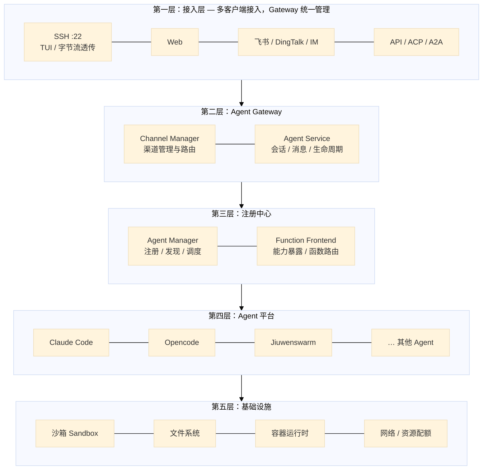

## 第一章 Jiuwenswarm Gateway 原生架构

本章介绍 `jiuwenswarm/gateway` 的现有架构，作为后续三方 Agent 接入 Agent OS 的设计基线。Jiuwenswarm 采用 **Split Layout（分离部署）**：Gateway 负责多客户端接入与消息路由，AgentServer 负责 Agent 运行时与实例管理，二者通过 **WebSocket + E2A 协议** 通信。

### 1.1 总体架构

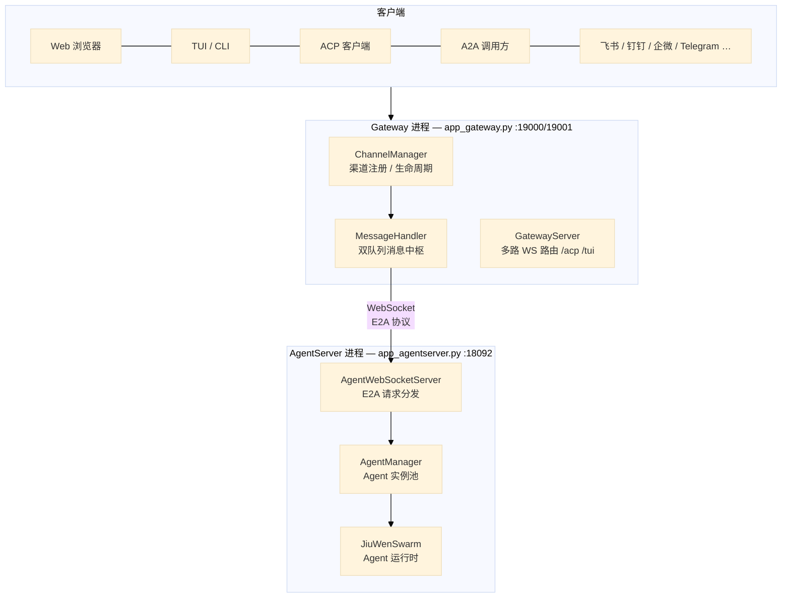

**进程启动方式**（`jiuwenswarm/app.py`）：

| 进程 | 入口 | 默认端口 | 职责 |
|------|------|----------|------|
| AgentServer | `jiuwenswarm/server/app_agentserver.py` | `18092` (WS) | Agent 运行时、`AgentManager`、`AgentWebSocketServer` |
| Gateway | `jiuwenswarm/gateway/app_gateway.py` | `19001` (ACP/TUI)、`19000` (Web) | Channel 接入、消息路由、Cron/Heartbeat |
| 组合启动 | `jiuwenswarm/app.py` | — | `subprocess.Popen` 先后拉起上述两进程 |

**关键结论**：Gateway **不直接拉起 Agent 进程**。Agent 在 AgentServer 进程内以 Python 对象形式由 `AgentManager` **懒加载创建**；Gateway 只做接入层与消息中转。

### 1.2 Channel 接入与通信协议

Gateway 通过 `ChannelManager` 统一管理多种接入渠道，各 Channel 实现 `BaseChannel` 抽象接口（`start` / `stop` / `send` / `on_message`），收到消息后统一交给 `MessageHandler` 入队转发。

**对外通信协议矩阵**：

| Channel | channel_id | 传输 | 协议 |
|---------|------------|------|------|
| Web | `web` | WS `:19000/ws` | 原生 req/res/event JSON 帧 |
| TUI/CLI | `tui` | WS `:19001/tui` | 同上 + 本地 handler |
| ACP | `acp` | WS `:19001/acp` | **JSON-RPC 2.0** ↔ E2A（`AcpGatewayBridge` 双向转换） |
| A2A | `a2a` | HTTP `:19100/a2a` | **A2A SDK** JSON-RPC（FastAPI） |
| 飞书 | `feishu` | 飞书 WS 长连接 | 平台 SDK → 统一 `Message` |
| 钉钉 | `dingtalk` | dingtalk-stream WS | Stream SDK 收 + HTTP API 发 |
| 企微 / 微信 / Telegram / Discord 等 | 各平台 channel_id | 各平台协议 | 平台适配 → 统一 `Message` |

**Channel 统一帧格式**（Web / TUI / ACP 路由共用）：

```json
{"type":"req",  "id":"...", "method":"chat.send", "params":{...}, "is_stream":true}
{"type":"res",  "id":"...", "ok":true, "payload":{...}}
{"type":"event","event":"chat.final", "payload":{...}}
```

方法枚举由 `ReqMethod` 定义（`common/schema/message.py`），涵盖 `chat.send`、`session.list`、`agent.reload_config` 等。

### 1.3 内部骨干协议：E2A

Gateway 与 AgentServer 之间采用 **E2A（Envelope-to-Agent）** 协议，传输层为 **WebSocket**（`WebSocketAgentServerClient` ↔ `AgentWebSocketServer`）。

| 项目 | 说明 |
|------|------|
| 协议版本 | `1.0`（`common/e2a/models.py`） |
| 握手 | 双方首帧 `{"type":"event","event":"connection.ack","payload":{"protocol_version":"1.0"}}` |
| 请求信封 | `E2AEnvelope` — 含 `request_id`、`channel`、`method`、`params`、`is_stream` |
| 响应 | `E2AResponse` 线 JSON（`wire_codec.py` 编解码） |
| 主动推送 | AgentServer `send_push()`，用于进化审批、Team 消息、Cron 结果等 |
| 默认连接 | `ws://127.0.0.1:18092` |

协议转换层：

- `common/e2a/gateway_normalize.py` — `Message` ↔ `E2AEnvelope` / `E2AResponse`
- `common/e2a/adapters/` — ACP JSON-RPC → E2A
- `message_handler.message_to_e2a()` — Gateway 出站统一转 E2A

### 1.4 Agent 拉起与生命周期

Agent 实例管理在 **AgentServer 侧** 的 `AgentManager`（`server/runtime/agent_manager.py`）完成：

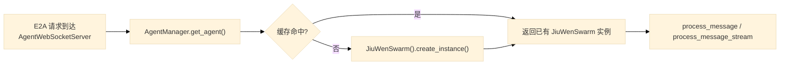

| 阶段 | 行为 |
|------|------|
| 懒创建 | `get_agent(channel_id, mode, project_dir, sub_mode)` → `_create_agent()` |
| 缓存键 | `{mode}:{sub_mode}:{project_dir}`，按 channel 分组 |
| ACP 初始化 | `initialize(channel_id="acp")` 重建 ACP agent，返回 `ACP_DEFAULT_CAPABILITIES` |
| 配置热更新 | `reload_agents_config(config, env)` 遍历所有实例 |
| 重建 | `recreate_agent(channel_id)` — 沙箱切换等场景 |
| 清理 | Gateway WS 断开时 `cancel_all_inflight_work()` |

沙箱执行（非 Gateway 职责）由 AgentServer 侧 `jiuwenbox_runner.py` 通过 `asyncio.create_subprocess_exec` 拉起。

### 1.5 消息路由与执行流

Gateway 核心消息中枢为 `MessageHandler`（单例），采用 **双队列** 模型：

| 队列 | 方向 | 消费者 |
|------|------|--------|
| `_user_messages` | Channel → AgentServer | `_forward_loop()` |
| `_robot_messages` | AgentServer → Channel | `ChannelManager._dispatch_robot_messages()` |

**端到端消息流**：

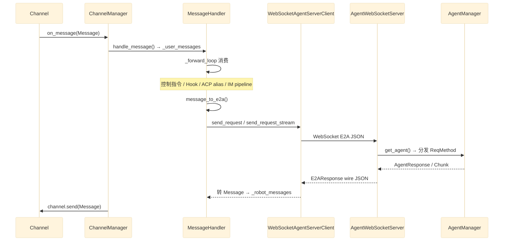

`_forward_loop` 处理逻辑摘要：

1. 消费 `_user_messages`
2. **Channel 控制指令**（`\new_session`、`\mode`、`\skills list` 等）— 本地处理，不转发
3. **Gateway Hook**（`UserPromptSubmit`）
4. **中断/恢复**（`CHAT_CANCEL` / `CHAT_ANSWER`）
5. **IM Inbound Pipeline**（数字分身改写）
6. **ACP session alias 解析**
7. `message_to_e2a()` → `agent_client.send_request` 或 `send_request_stream`
8. 流式响应逐 chunk 转 `Message` 入 `_robot_messages`；非流式完整响应一次性入队

### 1.6 管理与运维组件

| 组件 | 位置 | 职责 |
|------|------|------|
| `ChannelManager` | `gateway/channel_manager/` | Channel 注册/注销、配置热更新、出站派发 |
| `GatewayServer` | `gateway/app_gateway.py` | 多路 WS 路由（`/acp`、`/tui`），按 `(channel_id, request_id)` 精确路由 |
| `MessageHandler` | `gateway/message_handler/` | 双队列消息中枢、转发循环 |
| `SessionMap` | `gateway/routing/session_map.py` | IM 身份 → agent session_id 持久映射 |
| `GatewayHeartbeatService` | `gateway/heartbeat/` | 周期 E2A `chat.send` 探活 |
| `CronSchedulerService` | `gateway/cron/` | 定时任务调度，到点经 `agent_client` 唤醒 Agent |
| `ExtensionRegistry` | `extensions/registry.py` | 可插拔扩展（如替换 `AgentServerClient` 为远程 HTTP 客户端） |
| `InstanceManager` | `instance_manager/` | 多实例端口/工作区/PID 管理（`instances.yaml`） |

**会话管理**：AgentServer 提供 `session.list/create/switch/delete/rewind` 等 API；ACP 场景下 `MessageHandler` 维护外部 session_id ↔ 内部 session_id 映射。

**配置热更新**：Gateway 保存配置后发送 `agent.reload_config` E2A 请求 → AgentServer `reload_agents_config()` 遍历所有实例生效。

### 1.7 架构特点小结

| 维度 | Jiuwenswarm Gateway 现状 |
|------|--------------------------|
| 部署模型 | Gateway + AgentServer 双进程分离，Gateway 不持有 Agent 运行时 |
| Agent 拉起 | AgentServer 内 `AgentManager` 懒加载 Python 对象，非容器/per-user 隔离 |
| 内部协议 | WebSocket + E2A 信封 |
| 对外协议 | 原生 WS req/res/event、ACP JSON-RPC 2.0、A2A JSON-RPC、各 IM 平台 SDK |
| 消息模型 | `MessageHandler` 双队列异步转发 |
| 渠道管理 | `ChannelManager` 统一注册，配置驱动 IM Channel 启停 |
| 扩展性 | `ExtensionRegistry` 可替换 AgentServer 连接方式 |

后续章节将在此基础上，描述如何将 opencode / Claude Code 等第三方 Agent 平台接入 Agent OS，补齐 SSH 透传、容器隔离、统一注册中心等能力。

## 两条路径，体验分级


### SSH 路径（完整 TUI 体验）


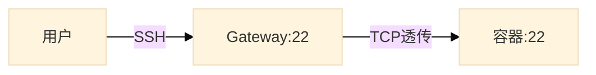


- SSH 字节流端到端透传，Gateway 不做消息解析

- 用户享受原生 SSH 体验：流式输出、tmux 保活、交互式输入

- 底层用 OpenSSH ForceCommand 做路由，不重复造轮子


### 技术实现：三层透传


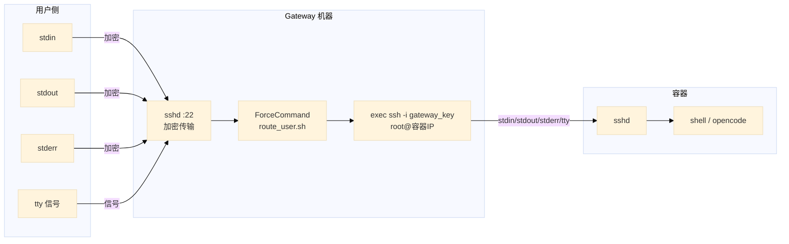


**核心机制：**


| 技术 | 作用 |

|---|---|

| **OpenSSH ForceCommand** | 用户认证完成后，不启动用户 shell，而是执行 route_user.sh |

| **exec ssh** | 用 SSH 进程替换当前 shell 脚本进程，stdin/stdout/stderr 全部继承，用户感觉不到中间层 |

| **docker inspect** | 获取容器的 IP 地址用于 SSH 目标路由 |


```bash

# route_user.sh 核心逻辑（伪代码）

容器IP=$(docker inspect -f '{{range.NetworkSettings.Networks}}{{.IPAddress}}{{end}}' "opencode-$USER")


exec ssh -o StrictHostKeyChecking=no \

         -i /opt/gateway/keys/gateway_key \

         root@"$容器IP" \

         "$SSH_ORIGINAL_COMMAND"

```


**三次透传，无状态干预：**


| 层 | 说明 |

|---|---|

| SSH 加密 | 用户 → Gateway 传输加密，由 OpenSSH 处理 |

| TCP 字节流 | Gateway → 容器 SSH 会话，字节流透传 |

| 终端信号 | SIGINT、窗口大小变化自动透传 |


### 消息路径（非 SSH 渠道）


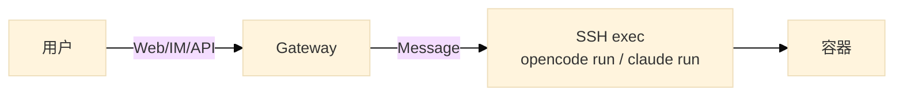


- 支持 Web 界面、飞书/DingTalk/Telegram 等 IM 平台

- 一问一答模式，非流式，适合轻量交互

- 底层通过 SSH 在容器内执行 `opencode run` 或 `claude run` 命令

- 在非 SSH 渠道提示用户切换到 SSH 以获取更完整体验


**技术实现：**


```bash

# Gateway 收到用户消息后，SSH 到容器执行一次命令

ssh root@容器IP \

    -i /opt/gateway/keys/gateway_key \

    "opencode run --no-tui \"$用户消息\""


# 若容器部署的是 Claude Code

ssh root@容器IP \

    -i /opt/gateway/keys/gateway_key \

    "claude run \"$用户消息\""

```


**选型理由：** 部分 Agent CLI（如 Claude Code）不支持 HTTP Server 模式，SSH + CLI 是通用的调用方式，兼容 opencode、Claude Code 等任意 Agent 软件。


### 消息路径技术方案对比


Gateway 内部实现非 SSH 渠道的消息转发，有以下几种技术选择：


| 方案 | 实现 | 代码量 | 优点 | 缺点 |

|---|---|---|---|---|

| **asyncssh 嵌入** | Gateway 进程内用 asyncssh 连接容器 SSH 执行命令 | ~20 行 | 消息全在 Gateway 管控内；可预处理/转义/校验；支持并发 | 需要 Python asyncssh 依赖 |

| **subprocess + ssh CLI** | Gateway 内 subprocess 调用系统 ssh 命令 | ~10 行 | 零依赖，系统自带 | 进程开销大；并发差；信号处理麻烦 |

| **ttyd Web 终端** | ttyd 桥接 WebSocket → SSH PTY | 独立部署 | 浏览器获得完整 TUI | 绕过 Gateway 消息管道；非一问一答 |

| **SSHForwardChannel** | 基于 Gateway 已有的 BaseChannel 封装 asyncssh | ~50 行 | 复用 Gateway 的 WebSocket 层和连接管理 | 依赖 Gateway 架构 |


**推荐方案：asyncssh 嵌入**


```python

# asyncssh 核心用法：异步 SSH 命令执行

import asyncssh


async def run_in_container(container_ip: str, command: str) -> str:

    async with asyncssh.connect(

        host=container_ip,

        username="root",

        client_keys=["/opt/gateway/keys/gateway_key"],

        known_hosts=None,  # 容器 IP 动态，首次连接跳过 known_hosts

    ) as conn:

        result = await conn.run(command)

        return result.stdout

```


asyncssh 是一个纯 Python 的异步 SSH2 协议实现，支持：


- 客户端/服务端模式

- 命令执行、Shell/PTY、SFTP、SCP

- 端口转发（本地/远程）

- 多种密钥格式（RSA/ECDSA/Ed25519）

- 原生 asyncio 集成，支持成百上千并发 SSH 连接


## Gateway 作为管理平面


Gateway 不只是一个消息路由器，更是整个平台的控制平面：


| 功能 | 说明 |

|---|---|

| 用户管理 | 注册、认证、角色 |

| SSH 密钥管理 | 用户公钥上传、自动注入到容器 |

| 容器生命周期 | 按需创建、停止、销毁 |

| 路由配置 | 用户 → 容器的映射自动更新 |


### 首次接入流程


#### 场景一：用户先走 Web


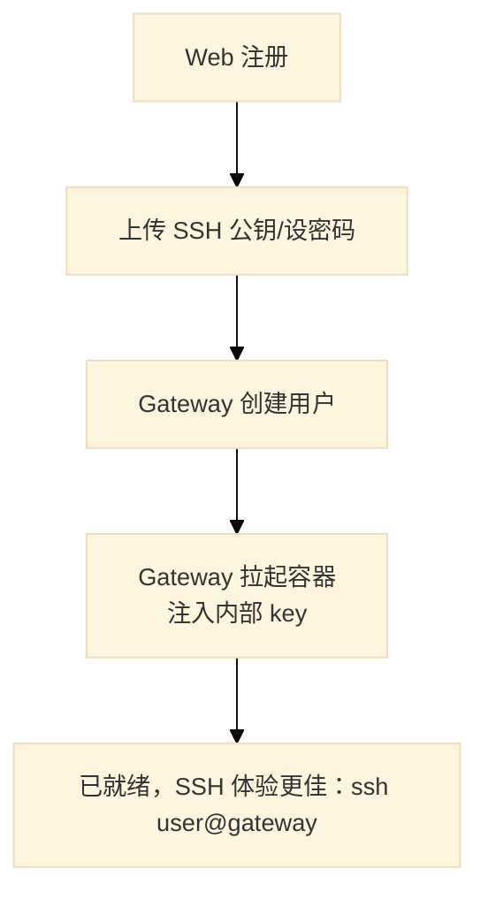


#### 场景二：用户先走 SSH


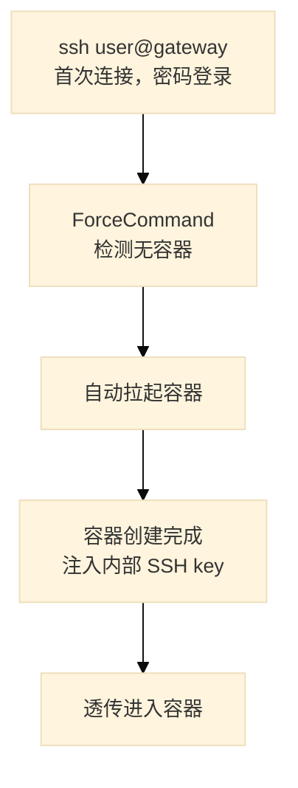


#### 场景三：管理员预创建


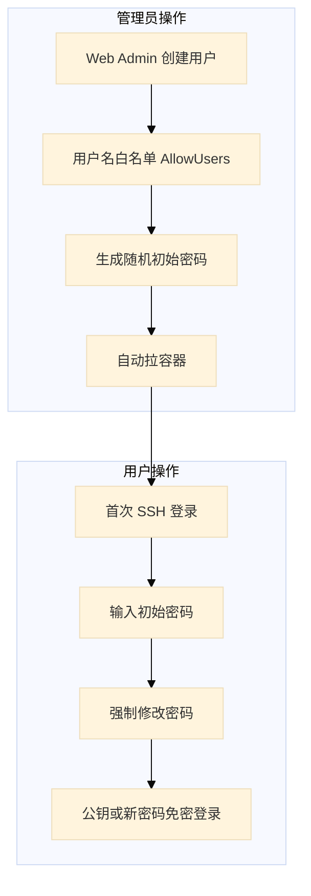


### 密钥分层


Gateway 管理两层密钥：


| 层 | 凭证 | 用户需操作 |

|---|---|---|

| 用户 → Gateway | 公钥 / 密码 | 注册时上传公钥，或首次密码登录 |

| Gateway → 容器 | 内部密钥对（自动生成） | 无感知 |


## Agent 注册中心


每个容器启动时自动注册到 Gateway：


```json

{

  "agent_id": "userA-opencode",

  "host": "container-a",

  "capabilities": {

    "protocols": ["acp", "a2a", "ssh"],

    "models": ["gpt-5.5", "claude-4"],

    "tools": ["write", "bash", "read"],

    "skills": ["python", "react", "docker"]

  },

  "status": "online",

  "owner": "userA"

}

```


### 路由规则


| 来源 | 路由目标 |

|---|---|

| 用户 A 的 SSH 连接 | 容器 A（用户专属 Agent） |

| 用户 A 通过 IM 发消息 | 容器 A |

| Agent A 调用"数据库 Agent" | 注册中心查询 → 容器 B |

| Agent Team 协作 | Orchestrator → 分发给多个 Agent |


## 权限模型


```python

class UserRole(enum):

    GUEST = "guest"      # 自注册，默认受限

    MEMBER = "member"    # 审核通过

    ADMIN = "admin"      # 管理权限


class UserPermissions:

    max_containers: int

    allow_ssh: bool

    resource_limits: ResourceSpec

    can_access_admin: bool

```


## 基础设施


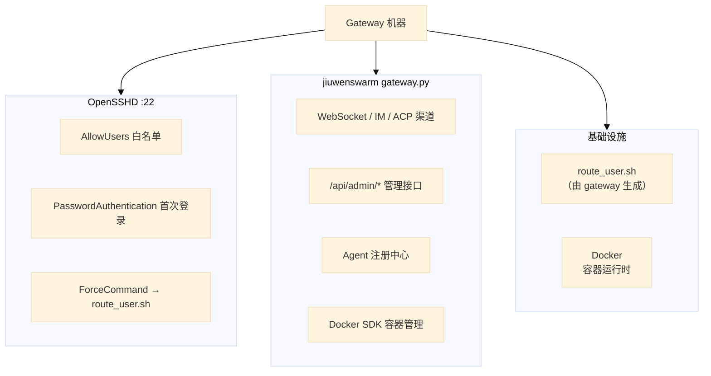


## 扩展方向


- **Agent Team**：Orchestrator 编排多个 Agent 协作完成任务

- **A2A Federation**：与外部 Agent 系统互通（Google A2A 协议）

- **专业 Agent**：数据库 Agent、代码审查 Agent、部署 Agent 等，供其他 Agent 调用

- **资源配额**：按用户角色分配 CPU/内存/GPU 限制


