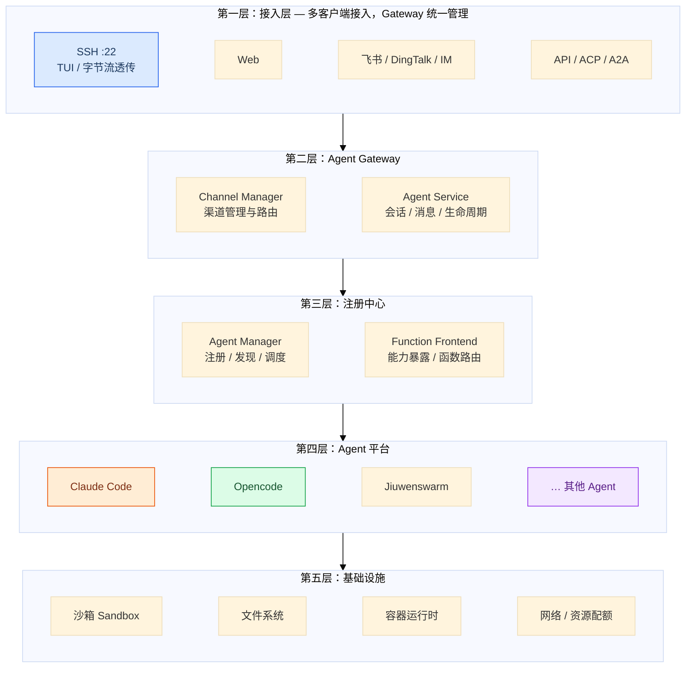
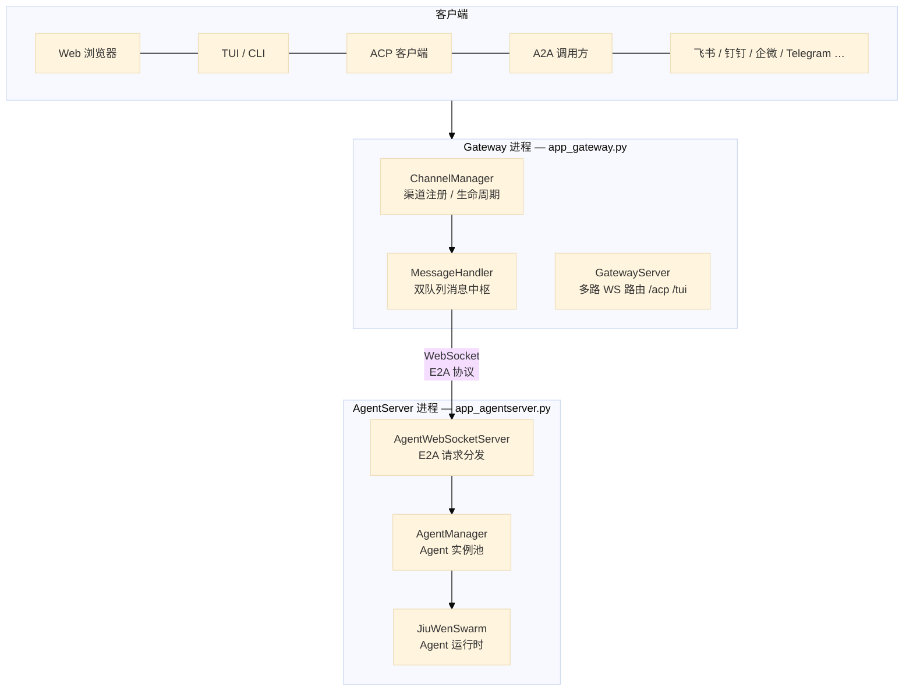
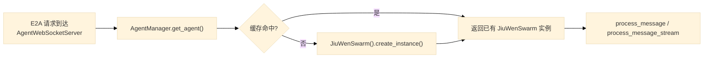
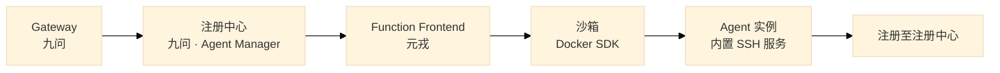
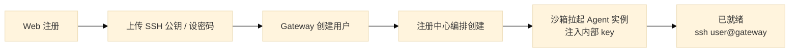
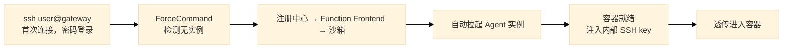
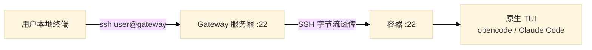
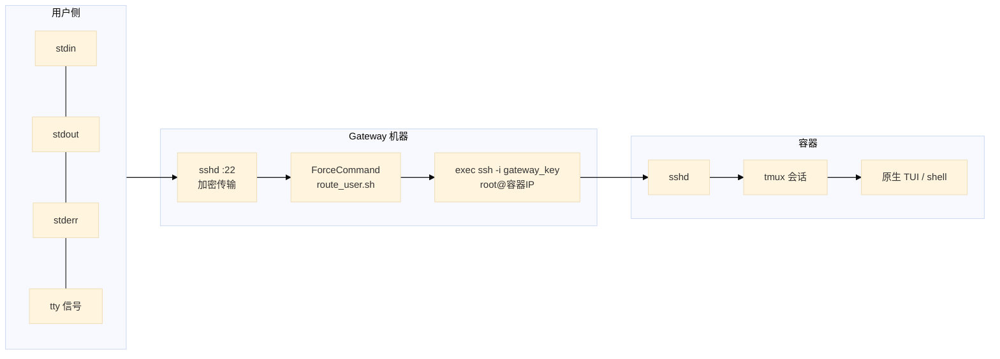
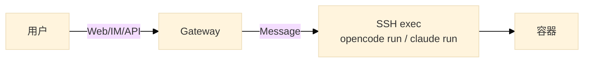

# 三方 Agent 接入 Agent OS 需求设计说明书


## 概述


设计目标是基于 opencode/claude 等第三方 Agent 平台接入 Agent OS 的需求设计，核心理念：**一个 Gateway 入口，多端接入，统一身份，体验分级**。




## 第一章 Jiuwenswarm Gateway 原生架构

本章介绍 `jiuwenswarm/gateway` 的现有架构，作为后续三方 Agent 接入 Agent OS 的设计基线。Jiuwenswarm 采用 **Split Layout（分离部署）**：Gateway 负责多客户端接入与消息路由，AgentServer 负责 Agent 运行时与实例管理，二者通过 **WebSocket + E2A 协议** 通信。

### 1.1 总体架构



**进程启动方式**（`jiuwenswarm/app.py`）：

| 进程 | 入口 | 职责 |
|------|------|------|
| AgentServer | `jiuwenswarm/server/app_agentserver.py` | Agent 运行时、`AgentManager`、`AgentWebSocketServer` |
| Gateway | `jiuwenswarm/gateway/app_gateway.py` | Channel 接入、消息路由、Cron/Heartbeat |
| 组合启动 | `jiuwenswarm/app.py` | `subprocess.Popen` 先后拉起上述两进程 |

**关键结论**：Gateway **不直接拉起 Agent 进程**。Agent 在 AgentServer 进程内以 Python 对象形式由 `AgentManager` **懒加载创建**；Gateway 只做接入层与消息中转。

### 1.2 Channel 接入与通信协议

`ChannelManager` 统一管理 Web、TUI、ACP（JSON-RPC 2.0）、A2A（HTTP JSON-RPC）及飞书/钉钉等 IM 渠道，各 Channel 将平台消息归一为 `Message` 后交给 `MessageHandler`，对外以 req/res/event JSON 帧通信，ACP 经 `AcpGatewayBridge` 与内部 E2A 双向转换。

### 1.3 Agent 拉起与生命周期

Agent 实例管理在 **AgentServer 侧** 的 `AgentManager`（`server/runtime/agent_manager.py`）完成：



| 阶段 | 行为 |
|------|------|
| 懒创建 | `get_agent(channel_id, mode, project_dir, sub_mode)` → `_create_agent()` |
| 缓存键 | `{mode}:{sub_mode}:{project_dir}`，按 channel 分组 |
| ACP 初始化 | `initialize(channel_id="acp")` 重建 ACP agent，返回 `ACP_DEFAULT_CAPABILITIES` |
| 配置热更新 | `reload_agents_config(config, env)` 遍历所有实例 |
| 重建 | `recreate_agent(channel_id)` — 沙箱切换等场景 |
| 清理 | Gateway WS 断开时 `cancel_all_inflight_work()` |

沙箱执行（非 Gateway 职责）由 AgentServer 侧 `jiuwenbox_runner.py` 通过 `asyncio.create_subprocess_exec` 拉起。

## 第二章 Agent 实例创建

相较第一章 Jiuwenswarm 在 AgentServer 进程内懒加载 Agent 对象，三方 Agent（opencode、Claude Code 等）需以**独立沙箱实例**运行，并内置 SSH 服务供 Gateway 透传或远程执行。新架构下的实例拉起链路如下：



### 2.1 拉起流程

| 步骤 | 组件 | 职责 |
|------|------|------|
| 1 | **Gateway（九问）** | 接收用户接入请求（Web / SSH / IM），校验身份与配额，向注册中心发起「创建 Agent 实例」 |
| 2 | **注册中心（九问）** | `Agent Manager` 编排实例生命周期：分配 owner、选择 Agent 类型（opencode / Claude Code 等）、下发创建任务 |
| 3 | **Function Frontend（元戎）** | 对外暴露沙箱创建/销毁等函数接口，将注册中心的创建请求转换为沙箱操作 |
| 4 | **沙箱** | 基于 **Docker SDK** 拉起容器，镜像内预装目标 Agent 与 **sshd**，完成网络、卷挂载与资源配额配置 |
| 5 | **Agent 实例** | 容器内 Agent 就绪，SSH 服务监听；Gateway 注入内部密钥，建立 Gateway → 容器的 SSH 通道 |
| 6 | **注册回写** | 实例向注册中心上报 `agent_id`、host、capabilities、status、owner 等元数据，供后续路由与发现 |

### 2.2 首次接入流程

用户首次使用平台时，Gateway 在完成身份认证后触发上述拉起链路。按接入入口不同，分为两种场景：

#### 场景一：用户先走 Web



#### 场景二：用户先走 SSH



### 2.3 密钥分层

Gateway 管理两层密钥，用户仅感知第一层：

| 层 | 凭证 | 用户需操作 |
|---|---|---|
| 用户 → Gateway | 公钥 / 密码 | 注册时上传公钥，或首次密码登录 |
| Gateway → 容器 | 内部密钥对（自动生成） | 无感知 |

### 2.4 Agent 注册中心

Agent 实例在沙箱内就绪后，自动向注册中心（九问 `Agent Manager`）注册：

```json
{
  "agent_id": "userA-opencode",
  "host": "container-a",
  "capabilities": {
    "protocols": ["acp", "a2a", "ssh"],
    "models": ["gpt-5.5", "claude-4"],
    "tools": ["write", "bash", "read"],
    "skills": ["python", "react", "docker"]
  },
  "status": "online",
  "owner": "userA"
}
```

注册完成后，Gateway 与各 Channel 通过注册中心查询实例元数据完成路由：

| 来源 | 路由目标 |
|---|---|
| 用户 A 的 SSH 连接 | 容器 A（用户专属 Agent） |
| 用户 A 通过 IM 发消息 | 容器 A |
| Agent A 调用「数据库 Agent」 | 注册中心查询 → 容器 B |
| Agent Team 协作 | Orchestrator → 分发给多个 Agent |

## 第三章 三方 Agent 服务接入

第二章完成 Agent 实例创建与注册后，Gateway 通过两条接入路径与沙箱内的三方 Agent 通信：**SSH 路径**提供完整 TUI 体验，**消息路径**覆盖 Web / IM 等轻量渠道。核心理念不变——体验分级，统一由 Gateway 管控。

### 3.1 两条路径，体验分级

| 路径 | 接入方式 | 体验 | 适用场景 |
|------|----------|------|----------|
| SSH 路径 | `ssh user@gateway` | 完整 TUI，流式输出，交互式输入 | 深度编码、长时间会话 |
| 消息路径 | Web / 飞书 / DingTalk / API 等 | 一问一答，基本可用 | 轻量查询、移动端、IM 协作 |

### 3.2 SSH 路径

用户从本地 **SSH 连接 Gateway 服务器**，Gateway 将终端字节流透传到容器内，直接使用 opencode / Claude Code 等三方 Agent 的**原生 TUI**——不是 Gateway 自研的 WebSocket TUI Channel，也不是消息路径的一次性 CLI 调用。Gateway 全程不解析终端内容，因此流式输出、交互式输入、tmux 会话保持与本地直连服务器体验一致。



**三层透传机制：**



| 技术 | 作用 |
|------|------|
| **OpenSSH ForceCommand** | 用户认证完成后执行 `route_user.sh`，不启动用户 shell |
| **exec ssh** | 用 SSH 进程替换脚本进程，stdin/stdout/stderr 全部继承，用户无感知中间层 |
| **docker inspect** | 从注册中心获取容器 IP，用于 SSH 目标路由 |

```bash
# route_user.sh 核心逻辑（伪代码）
容器IP=$(docker inspect -f '{{range.NetworkSettings.Networks}}{{.IPAddress}}{{end}}' "opencode-$USER")

exec ssh -o StrictHostKeyChecking=no \
         -i /opt/gateway/keys/gateway_key \
         root@"$容器IP" \
         "$SSH_ORIGINAL_COMMAND"
```

| 透传层 | 说明 |
|--------|------|
| SSH 加密 | 用户 → Gateway，由 OpenSSH 处理 |
| TCP 字节流 | Gateway → 容器，字节流透传 |
| 终端信号 | SIGINT、窗口大小变化自动透传 |

**tmux 保持：** 用户在容器内通过 tmux 运行 Agent TUI，会话状态保存在服务器侧。本地 SSH 断开后，再次 `ssh user@gateway` 并 `tmux attach` 即可恢复，Gateway 透传链路不破坏 tmux 会话。容器镜像需预装 tmux。

### 3.3 消息路径

Web / IM 等渠道经 Gateway 转发，通过 SSH 在容器内执行 Agent CLI 命令，一问一答模式，适合轻量交互；非 SSH 渠道可提示用户切换 SSH 获取完整体验。



```bash
# Gateway 收到用户消息后，SSH 到容器执行一次命令
ssh root@容器IP \
    -i /opt/gateway/keys/gateway_key \
    "opencode run --no-tui \"$用户消息\""

# 若容器部署的是 Claude Code
ssh root@容器IP \
    -i /opt/gateway/keys/gateway_key \
    "claude run \"$用户消息\""
```

**选型理由：** 部分 Agent CLI（如 Claude Code）不支持 HTTP Server 模式，SSH + CLI 是通用调用方式，兼容 opencode、Claude Code 等任意 Agent 软件。

**技术方案对比：**

| 方案 | 实现 | 优点 | 缺点 |
|------|------|------|------|
| **asyncssh 嵌入**（推荐） | Gateway 进程内 asyncssh 连接容器 SSH | 消息全在 Gateway 管控；支持并发与预处理 | 需要 Python asyncssh 依赖 |
| subprocess + ssh CLI | subprocess 调用系统 ssh | 零依赖 | 进程开销大，并发差 |
| ttyd Web 终端 | WebSocket → SSH PTY | 浏览器完整 TUI | 绕过 Gateway 消息管道 |
| SSHForwardChannel | 基于 BaseChannel 封装 asyncssh | 复用 Gateway WebSocket 层 | 依赖 Gateway 架构 |

```python
# asyncssh 核心用法：异步 SSH 命令执行
import asyncssh

async def run_in_container(container_ip: str, command: str) -> str:
    async with asyncssh.connect(
        host=container_ip,
        username="root",
        client_keys=["/opt/gateway/keys/gateway_key"],
        known_hosts=None,
    ) as conn:
        result = await conn.run(command)
        return result.stdout
```

### 3.4 Gateway 管理职责

Gateway 作为控制平面，统一管理用户、密钥、实例生命周期与路由：

| 功能 | 说明 |
|------|------|
| 用户管理 | 注册、认证、角色 |
| SSH 密钥管理 | 用户公钥上传、自动注入到容器 |
| 容器生命周期 | 按需创建、停止、销毁（经注册中心编排） |
| 路由配置 | 用户 → 容器的映射自动更新（经注册中心） |
