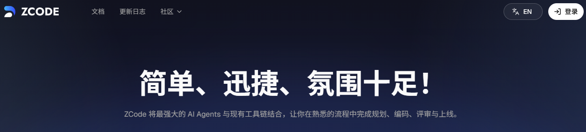

# 智谱 ZCode 洞察

## 前言

[ZCode](https://zcode.z.ai/newdocs/welcome) 是智谱 AI 推出的面向 **Long Horizon Task（长程任务）** 的全功能 Agentic Development Environment（ADE，智能体开发环境）。它的核心目标，是让 AI Agent 能够端到端、稳定可控地完成跨度更长、步骤更多的开发任务——从需求理解、任务拆解与规划，到编写代码、调试 Bug、项目预览，尽可能在一套工作流中一气呵成。

与早期以「多 CLI Agent 统一调度」为主的定位相比，新版 ZCode 做了更系统的升级：自研 **ZCode Agent** 针对长链路任务的稳定性与上下文保持做了专项优化；以插件形式兼容 Claude / Codex / Gemini / OpenCode 等主流框架；并支持飞书 / 微信 Bot 接入与移动端 Remote 控制，实现随时随地下达指令。平台强调全场景感知（项目结构、文件内容、UI 视觉元素）与分层权限管控，在提升自动化能力的同时保留关键操作的人工确认。

**本文的写作目的**，是在官方产品叙事之外，从工程实践与 Agent 系统视角，对 ZCode 的能力边界、架构设计与使用体验做持续观察与记录。后续章节将围绕其核心功能（Agent、Remote Control、Bot、MCP、子智能体、Skill、Hook、Memory 等）展开分析，并结合实际使用场景，梳理它在 Long Horizon Task 场景下的优势、局限与可借鉴之处，供 CodeAgent 相关研究与选型参考。
> 官方文档：[欢迎使用全新 ZCode](https://zcode.z.ai/newdocs/welcome)
