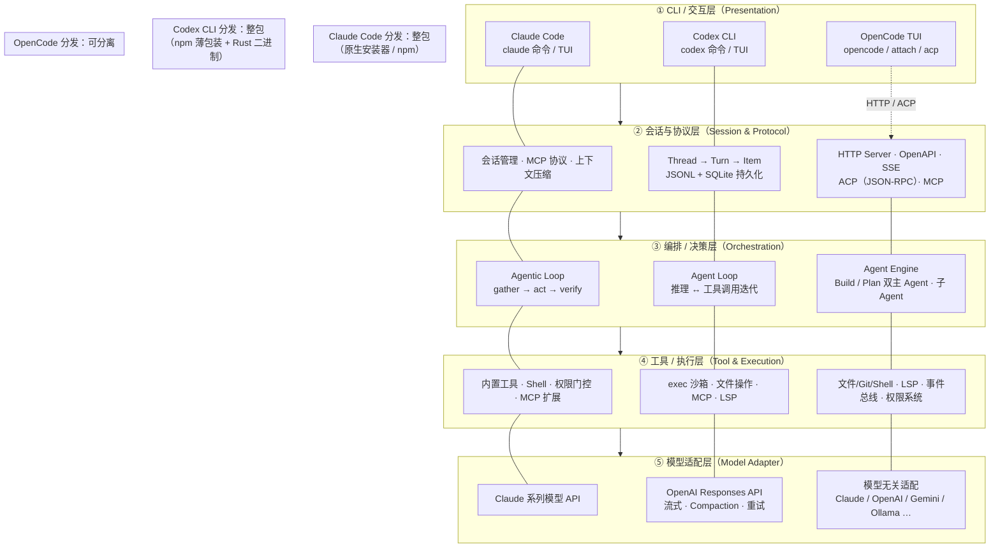
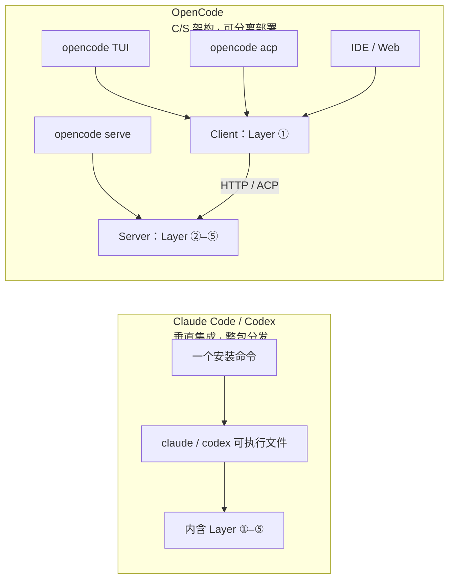
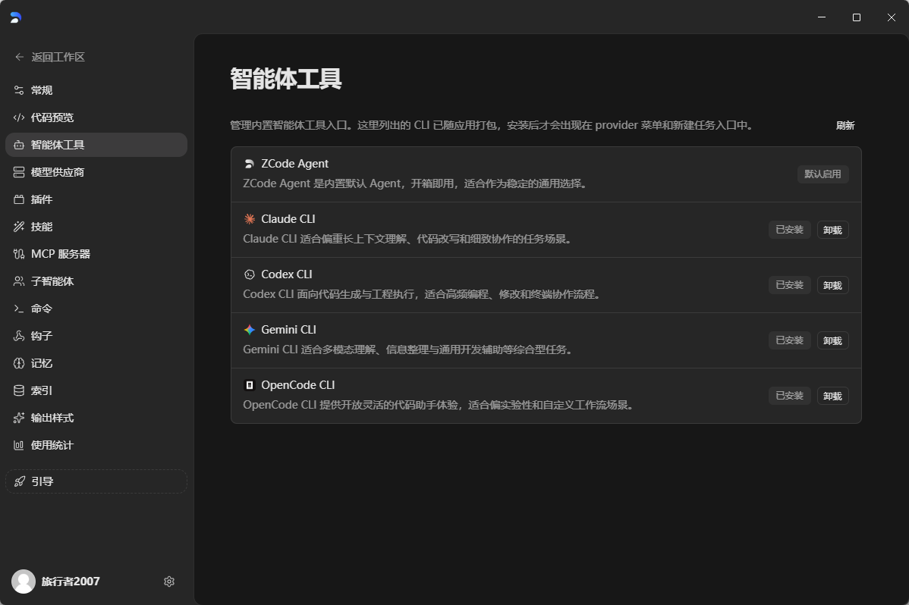

# 智谱 ZCode 洞察

[](https://zcode.z.ai/newdocs/welcome)

## 前言

[ZCode](https://zcode.z.ai/newdocs/welcome) 是智谱 AI 推出的面向 **Long Horizon Task（长程任务）** 的全功能 Agentic Development Environment（ADE，智能体开发环境）。它的核心目标，是让 AI Agent 能够端到端、稳定可控地完成跨度更长、步骤更多的开发任务——从需求理解、任务拆解与规划，到编写代码、调试 Bug、项目预览，尽可能在一套工作流中一气呵成。

与早期以「多 CLI Agent 统一调度」为主的定位相比，新版 ZCode 做了更系统的升级：自研 **ZCode Agent** 针对长链路任务的稳定性与上下文保持做了专项优化；以插件形式兼容 Claude / Codex / Gemini / OpenCode 等主流框架；并支持飞书 / 微信 Bot 接入与移动端 Remote 控制，实现随时随地下达指令。平台强调全场景感知（项目结构、文件内容、UI 视觉元素）与分层权限管控，在提升自动化能力的同时保留关键操作的人工确认。

**本文的写作目的**，洞察其 ZCode 设计模式，从产品体验的角度了解其独特之处。

> 官方文档：[欢迎使用全新 ZCode](https://zcode.z.ai/newdocs/welcome)

---

## 第一章 我们要接入什么？Code Agent 通用架构

本章将介绍 codeagent 通用分层模型**最小通用分层模型**。希望通过这个角度理清楚 Zcode 多 CLI 切换的核心逻辑。

### 1.1 整体架构图

下图展示五层纵向堆叠关系，以及三家产品在**分发形态**上的差异（整包 vs 客户端/服务端分离）。



**要点**：

- **纵向五层**是三家共有的逻辑架构，不代表物理进程边界。
- **Claude Code / Codex**：五层打包在同一可执行分发单元中，用户只安装一个入口命令（`claude` / `codex`）。
- **OpenCode**：唯一明确支持**客户端与服务端分离**的主流 Agent——TUI、Web、IDE 插件、ACP 客户端均可作为 Layer ①，通过 HTTP 或 JSON-RPC 连接承载 Layer ②–⑤ 的服务端进程。

### 1.2 五层职责详解

#### ① CLI / 交互层（Presentation Layer）

| 维度 | 说明 |
|------|------|
| **职责** | 终端 TUI、参数解析、启动/退出、会话入口、用户输入回显、流式输出渲染 |
| **Claude Code** | `claude` 为统一入口，驱动 REPL / headless（`--print`）及 [Agent SDK](https://code.claude.com/docs/en/how-claude-code-works) 调用；官方术语为 **agentic harness**（智能体外壳），将模型包装为可行动 Agent |
| **Codex CLI** | `codex` 命令由 npm 薄包装（`bin/codex.js`）路由到 `codex-rs` 原生 Rust 二进制；TUI 与 non-interactive 模式共用同一入口 |
| **OpenCode** | `opencode` 启动 TUI 客户端；`opencode attach <url>` 连接远程服务端；`opencode acp` 以子进程方式对接 ACP 兼容编辑器（Zed、JetBrains 等） |
| **可安装性** | Claude Code / Codex：**只能整包安装**，无法单独拆出交互层。OpenCode：TUI 客户端可独立连接已有服务端，但 CLI 包本身仍包含完整能力 |

#### ② 会话与协议层（Session & Protocol Layer）

| 维度 | 说明 |
|------|------|
| **职责** | 会话生命周期、上下文窗口管理、状态持久化、消息编解码、外部协议适配（MCP / ACP） |
| **Claude Code** | 内置会话管理；通过 [MCP（Model Context Protocol）](https://code.claude.com/docs/en/glossary) 连接外部工具与数据源；支持 compaction（上下文压缩）、子 Agent 会话隔离 |
| **Codex CLI** | 采用 **Thread（会话）→ Turn（轮次）→ Item（事件原子单元）** 三级模型；Thread 以 JSONL rollout 文件持久化（`~/.codex/sessions/`），元数据与状态存入 SQLite（`~/.codex/data/`）；支持 `codex resume` 恢复会话 |
| **OpenCode** | 默认 `opencode` 同时启动 **HTTP Server（Hono + OpenAPI 3.1）** 与 TUI 客户端；`opencode serve` 可单独运行无头服务端；支持 SSE 事件流、[ACP 协议](https://agentclientprotocol.com/get-started/introduction)（`session/new`、`session/prompt` 等 JSON-RPC 方法）及 MCP 服务配置 |
| **可安装性** | Claude Code / Codex：会话层**内嵌于整包**，不独立分发。OpenCode：服务端（Layer ②–⑤）可通过 `opencode serve` **独立部署**到本地或远程机器 |

#### ③ 编排 / 决策层（Orchestration Layer）

| 维度 | 说明 |
|------|------|
| **职责** | Agent 主循环、任务拆解、工具选择、多轮路由、子 Agent 调度 |
| **Claude Code** | 官方称 **Agentic Loop**，每轮任务经历 *gather context → take action → verify results* 三阶段，工具结果反馈驱动下一轮决策；扩展点（Skills、Hooks、MCP、Subagents）挂载在循环各阶段 |
| **Codex CLI** | **Agent Loop** 是核心协调层：将用户输入组装为 prompt → 调用 Responses API → 处理流式事件 → 执行工具 → 将结果追加到 input → 循环直至产出 assistant message；支持 `/responses/compact` 自动压缩上下文 |
| **OpenCode** | **Agent Engine** 编排内置 **Build**（全权限开发）与 **Plan**（只读分析）双主 Agent，支持 Tab 切换；另可通过配置定义子 Agent（如 `code-reviewer`、`@general`） |
| **可安装性** | Claude Code / Codex：编排层为内核，**不独立安装**。OpenCode：随服务端一起部署，无单独分发包 |

#### ④ 工具 / 执行层（Tool & Execution Layer）

| 维度 | 说明 |
|------|------|
| **职责** | 文件读写、代码编辑、Git、Shell 执行、沙箱隔离、LSP 集成、权限控制 |
| **Claude Code** | 内置工具集（Read、Edit、Bash、Grep、WebFetch 等）；采用**逐操作权限门控**（permission gating），敏感操作需用户授权；可通过 MCP 扩展工具能力 |
| **Codex CLI** | `codex-exec` 模块负责沙箱执行与文件操作；`codex-rs` 含 `linux-sandbox`、`process-hardening` 等 crate；严格权限模型，支持 workspace-write 等沙箱模式 |
| **OpenCode** | 内置文件 / Git / Shell 工具；集成 LSP 做代码分析；通过权限系统（`permission.edit`、`permission.bash` 等）精细控制各 Agent 能力；事件总线管理诊断信息 |
| **可安装性** | 三家均**不单独分发**工具层；OpenCode 工具层随服务端部署 |

#### ⑤ 模型适配层（Model Adapter Layer）

| 维度 | 说明 |
|------|------|
| **职责** | LLM 调用、提示词模板、流式响应解析、错误重试、多模型路由 |
| **Claude Code** | 适配 Anthropic Claude 系列；统一 Messages API 接口；支持 extended thinking 等模型特性 |
| **Codex CLI** | 通过 `codex-api` crate 调用 **OpenAI Responses API**；处理 SSE 流式事件、Compaction、Memory Summarize；支持 o3 / o4-mini / GPT 系列及第三方后端（Ollama、LM Studio） |
| **OpenCode** | **模型无关**：通过 `opencode auth login` 配置多 Provider，统一适配 Claude / OpenAI / Gemini / Ollama 等；各 Agent 可绑定不同模型 |
| **可安装性** | 均内嵌于分发单元；OpenCode 适配层随服务端部署 |

### 1.3 两种分发模式

逻辑架构同为五层，但物理打包方式分为 **CLI 整包集成** 与 **C/S 分离部署** 两类：



主流 Code Agent 在物理打包上可归为两种模式，核心差异在于：**内核五层是否必须随一条 CLI 安装命令整体交付**。

| 模式 | 代表产品 | 一句话 |
|------|----------|--------|
| **CLI 整包集成** | Claude Code、Codex、Gemini CLI | 一条命令装完全部五层，入口即 `claude` / `codex` / `gemini`，无法单独拆出会话层或工具层 |
| **C/S 分离部署** | OpenCode | 客户端（TUI / Web / ACP）与内核服务端可分开安装，多客户端可连接同一 `opencode serve` 实例 |

#### CLI 整包集成

用户安装一个可执行分发单元，交互、会话、编排、工具、模型适配全部内嵌其中。Claude Code 与 Codex 是这一模式的典型代表——安装后直接在项目目录运行 `claude` 或 `codex` 即可开始 Agent 会话，没有独立的「内核服务」可另行部署。

- Claude Code 安装：[Setup 官方文档](https://code.claude.com/docs/en/setup)
- Codex CLI 安装：[GitHub README](https://github.com/openai/codex)（`npm install -g @openai/codex`）

#### C/S 分离部署

OpenCode 是唯一在官方文档中明确支持客户端/服务端分离的主流 Agent。服务端承载会话、编排、工具、模型四层；TUI、浏览器、IDE 插件等作为客户端，通过 HTTP 或 ACP 协议连接。

```bash
# 远程机器：启动无头服务端
OPENCODE_SERVER_PASSWORD=secret opencode serve --port 4096 --hostname 0.0.0.0

# 本地机器：TUI 连接远程实例
opencode attach http://<remote-ip>:4096
```

- 服务端部署：[OpenCode Server 文档](https://opencode.ai/docs/server/)
- 客户端连接：[OpenCode CLI 文档](https://opencode.ai/docs/cli/)（`attach` / `run --attach`）
- Web 远程访问：[OpenCode Web 文档](https://opencode.ai/docs/web/)

### 1.4 Zcode 集成方式

ZCode 的多 CLI 切换，走的是 **CLI 整包集成** 路线，而非 OpenCode 式的 C/S 分离。

ZCode 桌面端作为统一的 Layer ① 交互壳，在本地预装或引导安装 Claude Code、Codex、Gemini CLI、OpenCode 等完整 CLI 包，然后在任务顶栏直接切换框架——每次切换实质上是调度不同的 CLI 整包进程，而非连接远程 Agent 服务端。各框架的五层能力仍保留在各自 CLI 内部，ZCode 负责统一的任务管理、模型配置、权限模式与会话入口。



这与 [ZCode 多智能体框架](https://zcode.z.ai/en/newdocs/agent-framework) 官方描述一致：创建任务时选择 Agent Framework，对话过程中可随时从顶部菜单切换，无需新建任务。对 ZCode 而言，多 CLI 切换的集成点就在 **CLI 层级**——把多个已整包安装的 CLI Agent 纳入同一工作台，而不是把各框架的内核层抽出来重组。

---

> **参考资料**
>
> - [Claude Code — How it works](https://code.claude.com/docs/en/how-claude-code-works)
> - [OpenAI — Unrolling the Codex agent loop](https://openai.com/index/unrolling-the-codex-agent-loop/)
> - [Codex CLI — Core concepts (Thread / Turn / Item)](https://openai-codex.mintlify.app/concepts/overview)
> - [OpenCode — Server architecture](https://opencode.ai/docs/server/)
> - [OpenCode — Agents (Build / Plan)](https://opencode.ai/docs/agents/)
> - [Agent Client Protocol — Introduction](https://agentclientprotocol.com/get-started/introduction)
> - [ZCode — Multi-Agent Framework](https://zcode.z.ai/en/newdocs/agent-framework)
