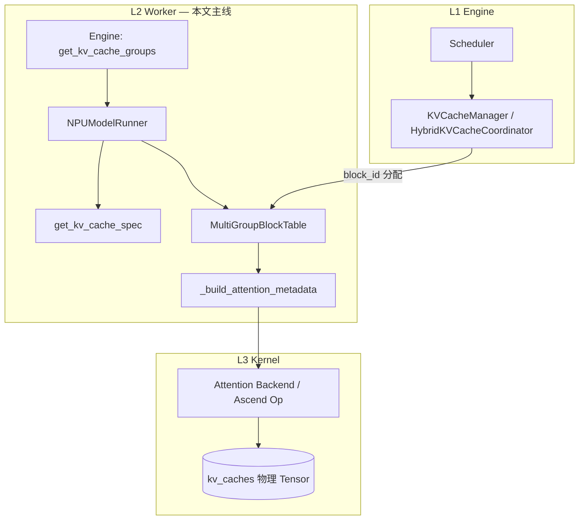
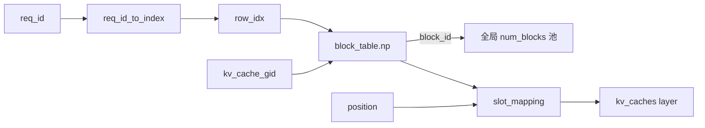
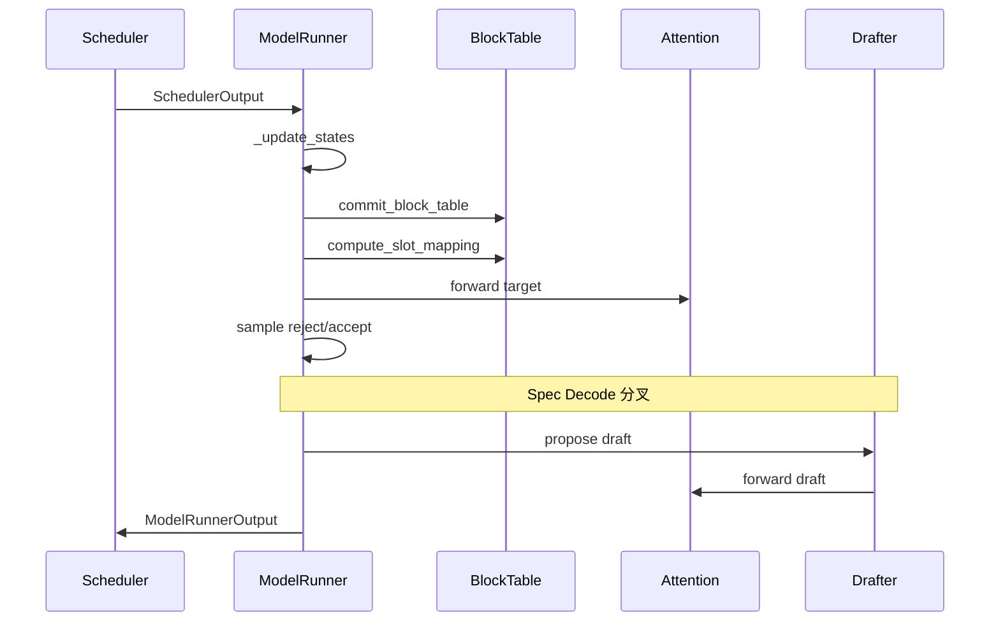

# KV Cache 与页表管理 — `NPUModelRunner` (`model_runner_v1.py`)

> 基于 `vllm_ascend/worker/model_runner_v1.py`（继承 upstream `GPUModelRunner`）整理。  
> 知识粒度：**整体架构 → 分组与配置 → 页表数据结构 → 物理内存 → 每步 token 映射 → 变体与索引**。  
> 行号随 upstream 漂移，以仓库内实际代码为准。

**图例**：<font color="red">**[Spec Decode]**</font> 表示投机解码（Eagle / MTP / `qwen3_5_mtp` 等）相关分支或额外约束。

---

## 1. vLLM 背景与三层架构

### 1.1 关键技术（为何需要页表）

| 技术 | 作用 |
|------|------|
| **PagedAttention** | KV 按固定大小 **block（页）** 存放，避免每序列预留连续 `max_model_len` |
| **Continuous Batching** | 多请求拼批；长短不一靠 **block 表 + slot_mapping** 组织 |
| **v1 Engine / Hybrid KV Cache Manager** | Scheduler 分配 `block_id`；混合模型（Full + Mamba/GDN 等）**分组**且 **统一物理页大小** |
| **Speculative Decoding** | Target 验证 + Draft 提议；有效序列长度与 slot 重算更复杂（见各章红色标注） |

Ascend 插件（vllm-ascend）保持 vLLM v1 **语义分层**，在 Worker 实现 NPU 的 `block_table`、attention backend、`reshape_and_cache` 等。

### 1.2 三层职责（Model Runner 只管 L2→L3）



```text
L1  Scheduler / KVCacheManager     分配 block_id、调度 token、num_computed_tokens、前缀缓存
         ▼
L2  Model Runner                   KVCacheSpec → 页表 → slot_mapping → AttentionMetadata
         ▼
L3  Attention Backend              按 metadata 读写 kv_caches（reshape_and_cache / paged attn / GDN）
```

### 1.3 Worker 核心成员

| 成员 | 含义 |
|------|------|
| `self.kv_cache_config` | `num_blocks`、`kv_cache_groups[]`、`kv_cache_tensors[]` |
| `self.attn_groups[kv_cache_gid][]` | 组内再按 backend+spec 分的 `AttentionGroup`（metadata builder） |
| `self.input_batch.block_table` | `MultiGroupBlockTable`：每组一张页表 + 本步 `slot_mapping` |
| `self.kv_caches[layer_name]` | reshape 后 bind 到层的 tensor 视图 |
| `self.shared_kv_cache_layers` | 从层 → 共享目标层（不单独分配 KV） |

<font color="red">**[Spec Decode]**</font> 额外成员：`self.drafter`、`draft_attn_groups`、`decode_token_per_req = 1 + num_speculative_tokens`、`spec_decode_common_attn_metadata`。

---

## 2. 对象关系：从 Request 到 Token 的 slot

### 2.1 索引对照表（先记住这张表）

| 概念 | 代码索引 | 含义 |
|------|----------|------|
| **KV cache group** | `kv_cache_gid` = 0, 1, … | 同组层共用 **一张** `block_table[gid]`、同一套 block 分配规则 |
| **Request 槽位** | `row_idx` = `input_batch.req_id_to_index[req_id]` | batch 内第几行，**不是**字符串 req_id |
| **逻辑 block 列** | `col` = 0 … `logical_table_size-1` | 该 request 在本组下的第几个 block **槽位**（存 `block_id`） |
| **物理 KV 页** | `block_id` ∈ [0, `num_blocks`) | 全局池中的页号；由 L1 分配 |
| **本步 token** | `slot_mapping[token_idx]` | 该 token 在 paged 池中的 **线性写入地址** |



### 2.2 静态配置链（启动时）

```python
# ① Worker 产出（model_runner_v1.py L3914+）
kv_cache_spec: dict[str, KVCacheSpec]
# 例: "model.layers.0.self_attn.attn" -> FullAttentionSpec(...)
#     "model.layers.0.linear_attn"     -> MambaSpec(...)

# ② Engine: vllm/v1/core/kv_cache_utils.py — get_kv_cache_groups()
kv_cache_groups: list[KVCacheGroupSpec]
# KVCacheGroupSpec(layer_names: list[str], kv_cache_spec: KVCacheSpec)

# ③ Engine 打包后回调 Worker — initialize_kv_cache()
kv_cache_config: KVCacheConfig
#   num_blocks: int
#   kv_cache_groups: list[KVCacheGroupSpec]
#   kv_cache_tensors: list[KVCacheTensor]   # 物理 buffer 布局
```

#### `get_kv_cache_groups()` 入参 / 出参

| | 类型 | 说明 |
|---|------|------|
| **入参** `vllm_config` | `VllmConfig` | `cache_config.block_size`、`disable_hybrid_kv_cache_manager` 等 |
| **入参** `kv_cache_spec` | `dict[str, KVCacheSpec]` | 来自 Worker `get_kv_cache_spec()` |
| **出参** | `list[KVCacheGroupSpec]` | 分组结果；同组共享 block 表语义 |

**分支（决定 group 个数）**：

```text
disable_hybrid → unify 成一种 spec
无 KV 层       → []
全模型同 spec  → 通常 1 组（Llama）
UniformType    → 1 组（组内按 layer_name 再分 spec）
混合模型       → unify page size → _get_kv_cache_groups_uniform_page_size()
                  （Qwen3.5 通常 2 组：Full + Mamba/GDN）
```

分组规则摘要（[Hybrid KV Cache Manager](https://github.com/vllm-project/vllm/blob/v0.19.0/docs/design/hybrid_kv_cache_manager.md)）：

1. 先按 **相同 KVCacheSpec 类型** 聚类（Full / Mamba / SWA …）。
2. 再按层数启发式切成 **等层数子组**（`group_size = min(各类型层数)`，MTP 等场景可能用 `max`）。
3. 组内 `layer_specs[0].merge(...)` 得到 group 级 spec。

#### Qwen3.5 典型分组

| Group | 层 | `kv_cache_spec` | 页表 |
|-------|-----|-----------------|------|
| 0 | `*.self_attn.*`（含 MTP full-attn 层） | `FullAttentionSpec` | `block_table[0]`，正常 `compute_slot_mapping` |
| 1 | `*.linear_attn`（GDN） | `MambaSpec` | `block_table[1]`，常 `kernel_block_sizes=[0]` |

<font color="red">**[Spec Decode]**</font> Mamba 组 `max_num_blocks_per_req` 需 `+ num_speculative_blocks`（`may_reinitialize_input_batch` L3784–3789）；310P 需与主线一致传入 `max_num_blocks_per_req`（见 §13）。

### 2.3 运行时页表：`BlockTable` 的 shape 与 row/col

**文件**：`vllm_ascend/worker/block_table.py`。

```python
# 单个 KV group 一张表（BlockTable.__init__）
block_table.np: int32[max_num_reqs * duplicate_size, logical_table_size]
num_blocks_per_row: int32[max_num_reqs]
slot_mapping:     int32[≈ max_num_batched_tokens + ...]   # 本步每个 token 一条
```

| 维度 | 名称 | 含义 |
|------|------|------|
| **row** | `row_idx` / `req_idx` | batch 内 request 槽位，与 `req_id_to_index` 一致 |
| **col** | 列下标 | 该 request 在本组的 **第几个逻辑 block 槽**；单元值为 **物理 `block_id`** |
| **`num_blocks_per_row[row]`** | 标量 | 该行 **已填充** 的列数（有效长度），不是列上限 |

```python
# append_row（L88–103）：Scheduler 新分配 block_ids 写入
start = num_blocks_per_row[row_idx]
block_table.np[row_idx, start : start + len(block_ids)] = block_ids
num_blocks_per_row[row_idx] += len(block_ids)
```

**`logical_table_size`**：

- 普通：`max_num_blocks_per_req`
- hybrid kernel 切分：`max_num_blocks_per_req * blocks_per_phys_block`（如物理 128、kernel 16 → 8 逻辑列/物理页）

**`MultiGroupBlockTable`**：`block_tables[g]` 与 `kv_cache_groups[g]` 一一对应；`append_row((ids_g0, ids_g1), row_idx)` 同时更新各组。

#### 小例子：2 group × 2 request

`req_id_to_index = {"A": 0, "B": 1}`，`max_num_blocks_per_req = 4`。

**Group 0（Full）** `block_table[0].np`：

```text
              col:   0    1    2    3
row 0 (A)           [ 7,  12,   0,   0]   num_blocks_per_row[0] = 2
row 1 (B)           [ 3,  19,  25,   0]   num_blocks_per_row[1] = 3
```

**Group 1（Mamba）** 同一 `row_idx=0` 可以是 **另一串** `block_id`，`num_blocks_per_row` 独立。

#### 从 position 到 slot（单 token）

```text
row_idx = req_id_to_index["A"]
position = 20
logical_block_idx = position // block_size      # 例: 20 // 16 = 1
block_id = block_table.np[row_idx, logical_block_idx]
offset   = position % block_size
slot     = block_id * block_size + offset      # → slot_mapping 中一项
```

查表实现（`block_table.py` L213–218）：`block_table_indices = req_indices * max_num_blocks_per_req * blocks_per_phys_block + logical_block_idx`，再 `ravel` 取 `block_numbers`。

### 2.4 三张「表」不要混

| 结构 | 形状 | 存什么 |
|------|------|--------|
| 全局池 | `num_blocks` 页 | 物理 KV 字节；`block_id` 为页号 |
| `block_table.np` | `[row, col]` | 逻辑页表项 = 物理 `block_id` |
| `num_blocks_per_row` | `[row]` | 每 request 已用列数 |
| `slot_mapping` | `[本步 token 数]` | 线性 slot（由 row + position 算出） |

---

## 3. 生命周期

### 3.1 阶段 A — `get_kv_cache_spec()`（Worker）

**位置**：`model_runner_v1.py` L3914–4019。

```text
AttentionLayerBase
├─ Attention（无 kv_sharing）→ get_kv_cache_spec()
├─ MLAAttention → AscendMLAAttentionSpec
├─ MambaBase → MambaSpec（Qwen3.5 GDN）
└─ CacheOnlyAttentionLayer → extract_hidden_states draft
```

混合模型：先 Attention/MLA 后 Mamba；Mamba `page_size_bytes` 对齐 Attention `page_size_padded`（L4008–4017）。

### 3.2 阶段 B — `initialize_kv_cache(kv_cache_config)`

**位置**：L3217–3253。

```text
initialize_kv_cache
├── initialize_attn_backend        → attn_groups[kv_cache_gid]
├── use_hybrid_blocks = len(attn_groups) > 1
├── need_accepted_tokens           （组内含 MambaSpec）
├── may_reinitialize_input_batch   → block_sizes, kernel_block_sizes, max_num_blocks_per_req
├── initialize_kv_cache_tensors    → allocate / reshape / bind_kv_cache
└── [Spec Decode] drafter.initialize_attn_backend
```

#### `may_reinitialize_input_batch`（页表列宽）

对每个非 `EncoderOnly` 的 group 计算 `max_num_blocks_per_req` 并传入 `NPUInputBatch`：

```python
max_num_blocks_per_req = cdiv(max_model_len, block_sizes[i] * get_total_cp_world_size())
if isinstance(spec, MambaSpec):
    mamba_blocks = (max_num_blocks_per_req if prefix_caching else 1) + spec.num_speculative_blocks
    max_num_blocks_per_req = max(max_num_blocks_per_req, mamba_blocks)
```

列宽不足时 `append_row` 会触发 `ValueError: broadcast (2,) into (1,)`。

<font color="red">**[Spec Decode]**</font> `num_speculative_blocks` 与 `num_speculative_tokens` 相关，主要影响 **Mamba 组** 页表宽度。

### 3.3 阶段 C — 每步 `execute_model`

```text
SchedulerOutput
  → _update_states          （block_table append_row / add_row，num_computed_tokens_cpu）
  → _prepare_inputs         （commit_block_table → positions → compute_slot_mapping）
  → [Qwen3.5] preprocess_mamba   （mamba_cache_mode == align）
  → _build_attention_metadata
  → forward → 写 kv_caches
  → sample / rejection
  → [Spec Decode] propose_draft_token_ids
```

| 步骤 | 文件/位置 | KV 含义 |
|------|-----------|---------|
| `commit_block_table` | `_prepare_inputs` | 页表 CPU→GPU |
| `positions` | 同上 | token 序列绝对位置 |
| `compute_slot_mapping` | `block_table.py` | token_idx → slot |
| `_calc_spec_decode_metadata` | `_prepare_inputs` | <font color="red">**[Spec Decode]**</font> logits 索引 |

---

## 4. 物理内存：`allocate` 与 `reshape`（按 shape 理解）

**位置**：`_allocate_kv_cache_tensors` L3346+，`_reshape_kv_cache_tensors` L3492+。

### 4.1 分配路径

| 路径 | 条件 | 结果 shape 思路 |
|------|------|----------------|
| 单 tensor | `linear_attn` / `hybrid_with_attn_and_mamba` / `cache_only` | 一层一块 `int8[numel]`，再 view |
| K/V 分离 | 纯 `attn` | `k: (num_blocks, block_size, kv_heads, dim)` + `v: (...)` |
| Hybrid 标志 | 同 pool 既有 Mamba 又有 Attn | `hybrid_with_attn_and_mamba = True` |

### 4.2 Full Attention reshape 示例

```python
# 逻辑块数可能 × block_size_chunk（hybrid kernel 切分）
k_cache.shape == (num_blocks_logical, kernel_block_size, num_kv_heads, head_size)
kv_caches[layer_name] = (k_cache, v_cache)
```

### 4.3 MambaSpec

```python
# 每个 state 一块: (num_blocks, *mamba_shape)
kv_caches[layer_name] = [conv_state_tensor, ssm_state_tensor, ...]
```

页表（block_id）与物理 tensor 通过 **同一 `block_id` 索引第 0 维** 关联；Mamba 组 **slot_mapping 常为 `[0]` 禁用**，state 更新走 `preprocess_mamba` / GDN kernel。

---

## 5. 每步 metadata 与 Attention 读写

### 5.1 `_build_attention_metadata`（L2553+）

```text
cm_base(query_start_loc, seq_lens, block_table_tensor, slot_mapping, ...)
for kv_cache_gid, group in enumerate(kv_cache_groups):
    if gid > 0:
        cm.block_table, cm.slot_mapping = _get_block_table_and_slot_mapping(gid)
    for attn_group in attn_groups[gid]:
        builder.build(cm) → per-layer AttentionMetadata
```

<font color="red">**[Spec Decode]**</font> 若 `drafter.attn_layer_names[0] in group.layer_names`，保存 `spec_decode_common_attn_metadata = cm`（draft 必须用 **所在 group** 的页表/slot）。Padded batch 时需 `unpadded(num_tokens, num_reqs)` 给 draft piecewise graph。

### 5.2 `AscendAttentionState` 与 KV 行为

| State | 条件 | KV |
|-------|------|-----|
| `PrefillNoCache` | 全新序列 | 写新 cache |
| `DecodeOnly` | 每 req 1 token | 单 token decode |
| `SpecDecoding` | 投机多 token | <font color="red">**[Spec Decode]**</font> 一步多 slot 写入 |

```python
# L1201–1204: MTP 即使每 req 仅 1 token 也走 SpecDecoding
if np.all(num_scheduled_tokens == 1) and method == "mtp":
    attn_state = SpecDecoding
```

| 方法 | Target 对外 state | 备注 |
|------|-------------------|------|
| MTP | `SpecDecoding` | MLA；非 MLA dummy 可能 ChunkedPrefill |
| Eagle/Eagle3 | 常对外 `ChunkedPrefill`（PCP） | 内部仍多 token |
| `qwen3_5_mtp` | 同 MTP 路径 | 配置见 Qwen3.5 教程 |

### 5.3 Qwen3.5 / GDN 补充

- `_has_gdn`：prefill 用 `gdn_query_start_loc`。
- <font color="red">**[Spec Decode]**</font> `num_accepted_tokens`、`num_decode_draft_tokens_cpu` 传入 GDN builder；reject 后 **不能** 只靠 Attention 的「覆盖语义」，需 `preprocess_mamba` + accept 计数对齐 state。

---

## 6. Rejected draft 与 KV（语义澄清）

**Full Attention paged KV**（组 0）：

1. Target 一步可能为 **1 + num_draft** 个 token 写 KV，但 rejection 后 **`num_computed_tokens` / `seq_lens` 只按接受数前进**。
2. 未接受位置的 KV 字节通常 **不 erase**；本步 **attention 不读** 有效长度之外的 slot。
3. 下次写到 **同一逻辑 position** 时 **覆盖** 即可。

<font color="red">**[Spec Decode]**</font> Eagle 多步 propose 会 **`compute_new_slot_mapping`** 重算 slot（`eagle_proposer.py`），不是因为要擦 KV，而是 reject 后 **token 布局变了**。Mamba 组见 §5.3。

---

## 7. Spec Decode 分叉总览（红色索引）

| 阶段 | 位置 | 要点 |
|------|------|------|
| 初始化 | `initialize_kv_cache` L3241+ | `drafter.initialize_attn_backend` |
| 页表列宽 | `may_reinitialize_input_batch` | Mamba `+ num_speculative_blocks` |
| 每步 token 数 | `_set_up_drafter` | `decode_token_per_req = 1 + N` |
| Target forward | `_prepare_inputs` | `_calc_spec_decode_metadata`；多 token slot 写入 |
| attn_state | `_build_attn_state` L1201+ | MTP → `SpecDecoding` |
| Draft forward | `propose_draft_token_ids` | `spec_decode_common_attn_metadata`、Eagle `prepare_inputs_padded` |
| MTP + PCP | `eagle_proposer` | `mtp_slot_pad` / `slot_indices` |
| KV Connector | `execute_model` | `defer_finalize` 至 draft 结束 |
| Eagle 空索引 | `prepare_next_token_ids_padded` | `num_discarded_requests==0` 时跳过 `index_fill_`（NPU） |

---

## 8. 其他变体（简表）

| 变体 | 对页表/KV 的影响 |
|------|------------------|
| PCP/DCP | `block_table` 行扩展；slot 非本 rank 填 -1 |
| KV Sharing | 从层无独立 spec；alias 目标层 tensor |
| Sparse MLA | 多 tensor（k,v,dsa_k,…） |
| Prefix caching | hybrid 下 scheduler `block_size` 可能很大（如 2048） |
| KV Transfer | k/v 2MB 对齐；`defer_finalize` 与 spec 交互 |
| Hamming sparse | 与 `speculative_config` 互斥 |

---

## 9. 单步时序（Decode + Eagle3）



---

## 10. 与 `_310p/model_runner_310p.py` 的差异

- 使用 `_310p/block_table.py`、`NPUInputBatch310`；逻辑与主线一致。
- **`may_reinitialize_input_batch` 必须传入 `max_num_blocks_per_req`**（与 `model_runner_v1.py` L3778–3815 对齐），否则 MTP/多 group 时页表列宽不足 → `(2,) into (1,)`。
- <font color="red">**[Spec Decode]**</font> `prepare_next_token_ids_padded` 对空 `discard` 索引加 guard，避免 NPU `index_fill_` 报错。
- 310P `_310p/attention/attention_v1.py` 上 MTP `SpecDecoding` 等路径可能仍有 `NotImplementedError`，需单独适配。

---

## 11. 读代码索引

| 想理解… | 先看 |
|---------|------|
| 每层 KV 规格 | `get_kv_cache_spec()` L3914 |
| Engine 分组 | upstream `get_kv_cache_groups()` |
| 页表 row/col / append | `worker/block_table.py` |
| 列宽 / MTP block | `may_reinitialize_input_batch` L3721 |
| 内存 layout | `_allocate` L3346、`_reshape` L3492 |
| 每步 slot | `_prepare_inputs` L630 + `compute_slot_mapping` |
| metadata | `_build_attention_metadata` L2553 |
| Qwen3.5 GDN | `preprocess_mamba` L1765、`need_accepted_tokens` |
| <font color="red">Spec Decode</font> | §7、`eagle_proposer.py`、`propose_draft_token_ids` L1325 |

| 主题 | 文件 | 约行 |
|------|------|------|
| KV 初始化 | `worker/model_runner_v1.py` | 3217–3253 |
| InputBatch 重建 | 同上 | 3721–3816 |
| BlockTable | `worker/block_table.py` | 全文 |
| 310P runner | `_310p/model_runner_310p.py` | `may_reinitialize_input_batch` |

---

*上游设计参考：[hybrid_kv_cache_manager.md](https://github.com/vllm-project/vllm/blob/v0.19.0/docs/design/hybrid_kv_cache_manager.md)。*
