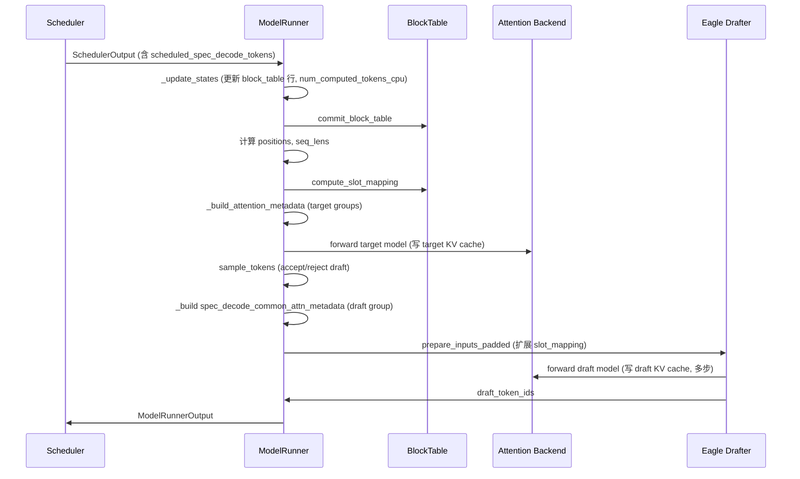

# KV Cache 逻辑梳理 — `NPUModelRunner` (`model_runner_v1.py`)

> 基于 `vllm_ascend/worker/model_runner_v1.py`（继承 upstream `GPUModelRunner`）整理。  
> 目标：把分散在 4000+ 行代码里的 KV cache 相关逻辑，按**生命周期**和**数据流**串起来读。

---

## 1. 总览：KV Cache 在 vLLM v1 里的位置

vLLM v1 把 KV cache 管理拆成三层，Model Runner 只负责**最下层（Worker 侧）**：

```
Scheduler / KVCacheManager（Engine）
    │  分配 block_id、调度 token、维护 num_computed_tokens
    ▼
Model Runner（Worker）← 本文重点
    │  ① 定义每层 KV 规格（KVCacheSpec）
    │  ② 分配/reshape 物理 buffer，bind 到 Attention 层
    │  ③ 每步：block_table → slot_mapping → attention metadata → forward 写 cache
    ▼
Attention Backend / Custom Op（Ascend）
    │  reshape_and_cache / paged attention 等
    ▼
NPU 物理 KV Tensor
```

Model Runner 里与 KV cache **直接相关**的核心成员：

| 成员 | 含义 |
|------|------|
| `self.kv_cache_config` | 全局 KV 配置：`kv_cache_groups`、`num_blocks`、tensor 共享关系 |
| `self.attn_groups` | 每个 KV cache group 下的 AttentionGroup 列表（backend + metadata builder） |
| `self.input_batch.block_table` | `MultiGroupBlockTable`：逻辑 block 表 + slot_mapping |
| `self.kv_caches` | bind 后的 layer → tensor 映射（由 upstream `bind_kv_cache` 填充） |
| `self.shared_kv_cache_layers` | 跨层 KV 共享：layer_name → target_layer_name |

---

## 2. 生命周期：三阶段

### 2.1 阶段 A — 规格定义：`get_kv_cache_spec()`

**时机**：Worker 启动、Engine 询问「每层需要多大 KV cache」时。  
**位置**：`model_runner_v1.py` L3914–4019。

遍历 `static_forward_context` 中所有 `AttentionLayerBase` 子类，为每层生成 `KVCacheSpec`：

```
Attention / MLAAttention / MambaBase / CacheOnlyAttentionLayer
         │
         ├─ Attention + kv_sharing_target_layer_name → 跳过，记入 shared_kv_cache_layers
         ├─ Attention → attn_module.get_kv_cache_spec()
         ├─ MLAAttention → AscendMLAAttentionSpec（含 sparse / fa_quant 分支）
         ├─ MambaBase → MambaSpec（conv state + ssm state）
         └─ CacheOnlyAttentionLayer → 用于 extract_hidden_states draft，单 tensor cache
```

**混合模型额外逻辑**（Mamba + Attention 共存）：

- 先处理 Attention/MLA，再处理 Mamba（顺序影响 graph 参数更新）。
- 若存在 Mamba 层，将其 `page_size_bytes` 作为 padding 基准，对齐所有 Attention 层的 `page_size_padded`，保证 hybrid block 内存布局一致。

```python
# L4008-4017: Mamba page size 对齐 Attention page size
if len(mamba_layers) > 0:
    ...
    for layer_name in attn_layer_names:
        if kv_cache_spec[layer_name].page_size_bytes < mamba_page_size_padded:
            object.__setattr__(kv_cache_spec[layer_name], "page_size_padded", mamba_page_size_padded)
```

Engine 收到各层 spec 后，合并成 `KVCacheConfig`（含 `kv_cache_groups`），再回调 Worker 的 `initialize_kv_cache`。

---

### 2.2 阶段 B — 初始化：`initialize_kv_cache(kv_cache_config)`

**时机**：Engine 确定 block 数量后，Worker 真正分配 NPU 内存。  
**位置**：L3217–3253。

```
initialize_kv_cache
├── deepcopy → self.kv_cache_config
├── may_add_encoder_only_layers_to_kv_cache_config()      [upstream]
├── maybe_add_kv_sharing_layers_to_kv_cache_groups()      [upstream]
├── initialize_attn_backend(kv_cache_config)              → self.attn_groups
├── self.use_hybrid_blocks = len(self.attn_groups) > 1
├── self.need_accepted_tokens = any(MambaSpec in attn_groups)
├── may_reinitialize_input_batch(kv_cache_config)         → block_sizes / kernel_block_sizes
├── initialize_kv_cache_tensors(kv_cache_config)          → 分配 + reshape + bind
├── [Eagle/Draft] drafter.initialize_attn_backend(...)    → draft_attn_groups
└── [KV Transfer] register_kv_caches(kv_caches)
```

#### B.1 `initialize_attn_backend` — Attention 后端分组

**位置**：L3818–3889。

对每个 `kv_cache_group`：
1. 按 `(attn_backend_cls, kv_cache_spec)` 去重，把同 backend + 同 spec 的层合并为一个 `AttentionGroup`。
2. 为每个 group 创建 `MetadataBuilder`（负责每步构建 `AttentionMetadata`）。
3. 结果存入 `self.attn_groups[kv_cache_gid][attn_gid]`。

`kv_cache_gid`（KV cache group id）是后续 **block_table 索引** 和 **metadata 构建** 的主键。

#### B.2 `may_reinitialize_input_batch` — BlockTable 与 kernel block 对齐

**位置**：L3721–3816。

若各 KV cache group 的 `block_size` 与构造时的默认值不同（混合模型常见），则**重建** `NPUInputBatch`：

- `block_sizes[]`：每个 group 的物理 block 大小。
- `kernel_block_sizes[][]`：
  - Attention + hybrid：`backend.get_supported_kernel_block_sizes()`（如 128→16 的虚拟 split）。
  - Mamba：`[0]`，禁用 slot mapping 对 mamba block 的计算。
- `max_num_blocks_per_req[]`：Mamba 额外加 `num_speculative_blocks`（投机解码预留 block）。

#### B.3 `initialize_kv_cache_tensors` — 内存分配与绑定

**位置**：L3276–3312。

```
_allocate_kv_cache_tensors   # raw int8 buffer
    ↓
_reshape_kv_cache_tensors    # view 成 (num_blocks, block_size, heads, dim)
    ↓
shared_kv_cache_layers 别名  # 共享层指向同一 tensor
    ↓
bind_kv_cache(...)           # 挂到 Attention 模块 + self.kv_caches
    ↓
[可选] init_and_bind_hashk_cache  # Hamming sparse 压缩
```

---

### 2.3 阶段 C — 运行时：每步 `execute_model` 中的 KV 数据流

**位置**：L1577 起，核心在 `_update_states` → `_prepare_inputs` → `_build_attention_metadata` → forward。

```
SchedulerOutput
    │
    ▼
_update_states(scheduler_output)          [upstream GPUModelRunner]
    │  更新 input_batch：req 增删、block_table 行、num_computed_tokens_cpu
    ▼
_prepare_inputs(...)
    │  commit_block_table
    │  计算 positions / seq_lens / slot_mapping
    │  构建 spec_decode_metadata（若有 draft tokens）
    ▼
[混合模型] preprocess_mamba(...)          [mamba_cache_mode == "align"]
    ▼
_build_attention_metadata(...)
    │  按 kv_cache_gid 构建 CommonAttentionMetadata + 各层 AttentionMetadata
    ▼
set_ascend_forward_context(attn_metadata, ...)
    ▼
model.forward → Attention 层读 slot_mapping，写 kv_caches
    ▼
_update_states_after_model_execute(...)   [upstream，含 postprocess_mamba]
    ▼
[投机解码] propose_draft_token_ids → drafter 写 draft KV cache
```

---

## 3. 核心数据结构详解

### 3.1 KVCacheSpec 类型族

| 类型 | 典型模型 | KV 物理形态 |
|------|----------|-------------|
| `AttentionSpec` | Llama, Qwen | `(k_cache, v_cache)` 两个 tensor |
| `MLAAttentionSpec` | DeepSeek V2/V3 | `(nope_cache, rope_cache)`，K/V 维度不同 |
| `MambaSpec` | Qwen3.5, Jamba | `[conv_state, ssm_state]` 列表 |
| `EncoderOnlyAttentionSpec` | Encoder 侧 | 无 paged KV，metadata 填零 |
| `UniformTypeKVCacheSpecs` | 同 group 内层 spec 不同 | group 级容器，按 layer_name 索引 |

### 3.2 KV Cache Group

一个 **group** = 共享同一套 block 分配策略的一组层。

- `kv_cache_config.kv_cache_groups[i].layer_names`：该 group 包含的层。
- `kv_cache_config.kv_cache_groups[i].kv_cache_spec`：该 group 的 spec（可能是 UniformType）。
- `input_batch.block_table[i]`：第 i 个 group 对应的 `BlockTable`。

**典型多 group 场景**：
- Full Attention 层 vs Sliding Window / Mamba 层（block_size 不同）。
- Target model vs Draft model（Eagle/MTP 的 draft attention 层在另一个 group）。

### 3.3 BlockTable 与 Slot Mapping

**文件**：`vllm_ascend/worker/block_table.py` + `npu_input_batch.py`。

#### BlockTable

- **物理 block**：Scheduler 分配的 `block_id`（KVCacheManager 管理）。
- **逻辑 block**（hybrid 模式）：物理 block 按 `kernel_block_size` 切分，例如 block_size=128、kernel=16 → 1 物理 block = 8 逻辑 block。
- `block_table[req_idx, :]`：该请求的逻辑 block id 序列。
- `commit_block_table(num_reqs)`：CPU → GPU 拷贝 block 表。

#### Slot Mapping

每个 scheduled token 对应 KV cache 中的一个**线性 slot 地址**：

```
slot = block_number * block_size + offset_within_block
```

计算入口（非 PCP）：

```python
# _prepare_inputs L998-1003
self.input_batch.block_table.compute_slot_mapping(
    num_reqs,
    self.query_start_loc.gpu[: num_reqs + 1],
    self.positions[:total_num_scheduled_tokens],
)
```

Attention kernel 通过 `slot_mapping[token_idx]` 知道「这个 token 的 K/V 写到哪里」。

#### positions 与 num_computed_tokens

```python
# positions = 该 token 在序列中的绝对位置
positions = num_computed_tokens[req] + query_pos_within_step

# seq_lens = 本步 forward 后的序列长度（GPU）
seq_lens = num_computed_tokens + num_scheduled_tokens
```

---

## 4. 内存分配细节：`_allocate_kv_cache_tensors`

**位置**：L3346–3490。按 `kv_cache_config.kv_cache_tensors`（共享内存池）迭代。

### 4.1 三条分配路径

```
                    kv_cache_tensor.shared_by 中的层
                              │
        ┌─────────────────────┼─────────────────────┐
        ▼                     ▼                     ▼
  linear_attn /          attn 层（纯 Attention）   (已在上面处理)
  hybrid attn-mamba /
  cache_only_layers
        │
        ▼
  单个 int8 tensor（不拆 K/V）
```

**路径 1 — 单 tensor**（L3382–3397）：

- 触发条件：`linear_attn` in name，或 `hybrid_with_attn_and_mamba`，或 `cache_only_layers`。
- Mamba / hybrid / extract_hidden_states 共用此路径。

**路径 2 — K/V 分离**（L3398–3481）：

- 纯 Attention 层（`attn` in name 且无 mamba 共享）。
- 为 prefill disaggregation（KV 传输）单独分配 k_tensor、v_tensor，地址 2MB 对齐。
- MLA：按 `kv_lora_rank` / `qk_rope_head_dim` 拆分。
- Sparse (DeepSeek V3.2)：额外分配 `dsa_k_tensor`、可选 `dsa_k_scale_tensor`。

**路径 3 — hybrid 标志**（L3370–3378）：

```python
self.hybrid_with_attn_and_mamba = False
for kv_cache_tensor in kv_cache_config.kv_cache_tensors:
    use_mamba = any(MambaSpec)
    use_attn = any(AttentionSpec)
    self.hybrid_with_attn_and_mamba |= (use_mamba and use_attn)
```

---

## 5. Reshape 细节：`_reshape_kv_cache_tensors`

**位置**：L3492–3719。

### 5.1 普通 Attention

```python
k_cache = raw_k_tensor.view(dtype).view(k_shape)   # e.g. (num_blocks, block_size, kv_heads, head_dim)
v_cache = raw_v_tensor.view(dtype).view(v_shape)
kv_caches[layer_name] = (k_cache, v_cache)
```

### 5.2 Hybrid Block 虚拟切分

当 `use_hybrid_blocks` 且 backend 支持 `get_supported_kernel_block_sizes()`：

```python
# L3584-3593: 物理 num_blocks → 逻辑 num_blocks * block_size_chunk
block_size_chunk = current_kv_cache_spec.block_size // kernel_block_size
kv_cache_shape = attn_backend.get_kv_cache_shape(
    num_blocks * block_size_chunk, kernel_block_size, ...)
```

### 5.3 Hybrid Attn + Mamba 内存布局（Ascend 特有）

**位置**：L3594–3614、L3700–3705。

同一块 raw tensor 内，按 page 对齐拼接：

```
tensor 布局（注释 L3702-3705）:
  tensor1: [(kv_padding), conv_state, ...]
  tensor2: [k_cache,      ssm_state, ...]
  tensor3: [v_cache,      (mamba_padding), ...]
```

reshape 时从 raw tensor 末尾跳过 conv padding，再切出 k/v 区域：

```python
conv_block_padding_size = raw_k_tensor.numel() - attn_tensor_page_size * 2
raw_kv_tensor = raw_k_tensor[conv_block_padding_size:]
raw_k_tensor = raw_kv_tensor[:attn_tensor_page_size]
raw_v_tensor = raw_kv_tensor[attn_tensor_page_size:]
```

### 5.4 MambaSpec

```python
# L3697-3715: 按 shapes/dtypes 列表切分 state_tensors
for shape, dtype in zip(MambaSpec.shapes, MambaSpec.dtypes):
    target_shape = (num_blocks, *shape)
    tensor = raw_tensor[start_idx:target_idx].view(dtype).view(target_shape)
    state_tensors.append(tensor)
kv_caches[layer_name] = state_tensors
```

---

## 6. 运行时：`_prepare_inputs` 中的 KV 相关步骤

**位置**：L630–1092。

按执行顺序：

| 步骤 | 代码 | KV 含义 |
|------|------|---------|
| 1 | `commit_block_table(num_reqs)` | 同步 block 表到 GPU |
| 2 | 计算 `positions` | token 在序列中的绝对位置 → 决定写哪个 slot |
| 3 | [PCP] 提前算 slot_mapping | PCP 会改 positions，需用 split 前的 positions |
| 4 | 更新 `num_computed_tokens` GPU | async spec decode 时用 kernel 修正 |
| 5 | 计算 `seq_lens` | attention metadata 的序列长度 |
| 6 | `compute_slot_mapping` | token → slot 映射（非 PCP 路径） |
| 7 | `_calc_spec_decode_metadata` | 投机解码的 logits 索引 |

### 6.1 Attention State 与 KV 读写模式

**位置**：`_build_attn_state` L1195–1224。

| `AscendAttentionState` | 条件 | KV 行为 |
|------------------------|------|---------|
| `PrefillNoCache` | 所有 req 的 num_computed_tokens == 0 | 首次 prefill，写新 cache |
| `PrefillCacheHit` | 非 chunked，有 cache 命中 | 写增量 cache |
| `ChunkedPrefill` | splitfuse / 有效 token > 1 且无 spec | 分块 prefill |
| `DecodeOnly` | 每 req 恰好 1 个 scheduled token | 单 token decode |
| `SpecDecoding` | 投机解码（draft tokens > 0） | 多 token 一步 decode |

**MTP 特殊处理**（L1201–1204）：

```python
elif np.all(num_scheduled_tokens == 1):
    attn_state = AscendAttentionState.DecodeOnly
    if self.speculative_config and self.speculative_config.method == "mtp":
        attn_state = AscendAttentionState.SpecDecoding  # MTP 即使 seq_len=1 也走 SpecDecoding
```

**Eagle3 与 PCP 冲突**（L1217–1222）：

```python
# Eagle3 + PCP 时，attn_state 对外仍用 ChunkedPrefill（PCP 接口要求）
if attn_state == SpecDecoding and method != "mtp":
    self.attn_state = ChunkedPrefill
else:
    self.attn_state = attn_state
```

---

## 7. 运行时：`_build_attention_metadata`

**位置**：L2553–2820。这是 KV cache 逻辑最集中的「组装点」。

### 7.1 整体流程

```
if len(kv_cache_groups) == 0: return {}   # 无 KV 模型（如 MLP-only）

cm_base = AscendCommonAttentionMetadata(
    query_start_loc, seq_lens, block_table_tensor, slot_mapping, ...
)

for kv_cache_gid, kv_cache_group in enumerate(kv_cache_groups):
    cm = copy(cm_base)
    cm.encoder_seq_lens = _get_encoder_seq_lens(...)   # encoder-decoder

    if kv_cache_gid > 0:
        # 非 0 号 group 用自己的 block_table / slot_mapping
        cm.block_table_tensor, cm.slot_mapping = _get_block_table_and_slot_mapping(kv_cache_gid)

    # 投机解码：找到 draft 层所在的 group，保存 spec_decode_common_attn_metadata
    if drafter is Eagle/Draft/Dflash and draft layer in group:
        spec_decode_common_attn_metadata = cm

    for attn_gid in attn_groups[kv_cache_gid]:
        builder.build(common_attn_metadata=cm) → 各 layer 的 AttentionMetadata
```

### 7.2 `_get_block_table_and_slot_mapping(kv_cache_gid)`

**位置**：L2610–2663。

- `EncoderOnlyAttentionSpec`：block_table / slot_mapping 填零（无 paged KV）。
- 否则：从 `input_batch.block_table[kv_cache_gid]` 取。
- PCP hybrid attention：`maybe_pcp_full_tokens` 用 padded token 数计算 slot_mapping 长度。
- Full graph 模式：padding 区域 slot_mapping 填 -1，block_table 填 0。

### 7.3 GDN（Gated Delta Net）混合模型补充

当 `self._has_gdn`（Qwen3.5 等 linear attention）：

- 使用 unpadded 的 `gdn_query_start_loc`（L2773–2778）。
- Spec decode + GDN：`num_accepted_tokens`、`num_decode_draft_tokens_cpu` 传入 builder（L2723–2728）。
- Full graph + spec decode：mamba spec_state_indices padding 从 -1 改 0（L2739–2744）。

---

## 8. 混合注意力模型（Full Attention + Mamba/GDN）

典型代表：**Qwen3.5**（Full Attention 层 + Linear/Mamba 层交替）。

### 8.1 识别标志

| 标志 | 设置位置 | 含义 |
|------|----------|------|
| `len(attn_groups) > 1` | `initialize_kv_cache` L3231 | 多个 KV cache group → `use_hybrid_blocks = True` |
| `hybrid_with_attn_and_mamba` | `_allocate_kv_cache_tensors` L3370 | 同一 memory pool 共享 attn + mamba |
| `need_accepted_tokens` | L3233–3235 | 任一 group 含 MambaSpec |
| `_has_gdn` | `__init__` L263 | 含 GDN linear attention 层 |

### 8.2 Block 数量：Mamba 额外预留

```python
# may_reinitialize_input_batch L3784-3789
if isinstance(kv_cache_spec, MambaSpec):
    mamba_blocks_per_req = (
        max_num_blocks_per_req if enable_prefix_caching else 1
    ) + kv_cache_spec.num_speculative_blocks
```

`num_speculative_blocks` 为投机解码时 Mamba state 复制预留额外 block。

### 8.3 每步 Mamba 预处理：`preprocess_mamba`

**位置**：`execute_model` L1765–1790。

仅在 `mamba_cache_mode == "align"` 时：

1. 先应用 deferred state corrections（async spec decode 的 num_computed_tokens 修正）。
2. 调用 `mamba_utils.preprocess_mamba(...)`：
   - 读 `num_computed_tokens_cpu` 决定 state 是否需 copy 到新 block。
   - 维护 `mamba_state_idx` 映射。
3. 重置 `num_accepted_tokens` 并同步 GPU（Mamba kernel 从 init_token_idx=0 读 state）。

对应 upstream 的 `postprocess_mamba` 在 `_update_states_after_model_execute` 中调用（Ascend 未 override 该方法）。

### 8.4 num_accepted_tokens 同步链

混合模型 + 投机解码时，reject 的 draft token 数量影响 Mamba state 写入位置：

```
sample_tokens → _update_states_after_model_execute
    → input_batch.num_accepted_tokens_cpu 更新
    → _prepare_inputs 中 num_accepted_tokens_event.synchronize()
    → 写入 num_accepted_tokens.gpu
    → GDN metadata builder 消费
```

---

## 9. MTP / Eagle3 投机解码下的 KV Cache 变化

### 9.1 初始化阶段差异

**位置**：`initialize_kv_cache` L3241–3247。

```python
if speculative_config.use_eagle() or speculative_config.uses_draft_model():
    # Eagle / Eagle3 / MTP / DraftModel / DFlash
    self.drafter.initialize_attn_backend(kv_cache_config, block_size)
    # → 创建 self.drafter.draft_attn_groups，draft 层 bind 到 kv_caches
```

Draft 模型的 attention 层：
- 在 `get_kv_cache_spec` 阶段已纳入 `kv_cache_config`（通常是独立 group 或与 target 共享 block pool）。
- `AscendEagleProposer.load_model` 识别 draft 层：`all_attn_layers - target_attn_layers - indexer_layers`（eagle_proposer.py L208–216）。

**Eagle3 特有**（`_set_up_drafter` L524–526）：

```python
if method == "eagle3":
    self.use_aux_hidden_state_outputs = drafter.eagle3_use_aux_hidden_state
    # forward 返回 (hidden_states, aux_hidden_states)，供 draft 模型消费
```

### 9.2 运行时：decode_token_per_req

**位置**：`_set_up_drafter` L517–521。

```python
self.decode_token_per_req = 1 + num_speculative_tokens
# 例：num_speculative_tokens=3 → 每 req 每步最多 4 个 token（1 target + 3 draft）
```

影响：
- `_get_block_table_and_slot_mapping` 中 CP 模式下 block_table 行数扩展（L2637）。
- `_build_attention_metadata` 中 `cm.decode_token_per_req` 传入 backend。

### 9.3 Target Model Forward 阶段

#### 9.3.1 Spec Decode Metadata

当 scheduler 下发 `scheduled_spec_decode_tokens`（上一步 propose 的 draft）：

```python
# _prepare_inputs L1029-1058
spec_decode_metadata = _calc_spec_decode_metadata(num_draft_tokens, cu_num_tokens, ...)
# 产出：logits_indices, target_logits_indices, bonus_logits_indices, draft_token_ids
```

Target model 一步 forward 处理 **1 + num_draft** 个 token，KV cache 按 slot_mapping 依次写入。

#### 9.3.2 KV Connector 延迟 finalize

**位置**：L1865–1885、L2086–2090。

```python
clear_kv_metadata = self.speculative_config is None
maybe_get_kv_connector_output(..., defer_finalize=not clear_kv_metadata)
# 投机解码时 defer，等 draft model 跑完再 finalize_kv_connector()
```

### 9.4 Draft Model（Eagle/MTP）Forward 阶段

**入口**：`propose_draft_token_ids` → `drafter._propose`（L1325–1529）。

#### 9.4.1 spec_decode_common_attn_metadata 的选取

**位置**：`_build_attention_metadata` L2782–2787。

```python
if isinstance(drafter, AscendEagleProposer | AscendDraftModelProposer | AscendDflashProposer):
    if drafter.attn_layer_names[0] in kv_cache_group.layer_names:
        spec_decode_common_attn_metadata = cm  # 取 draft 层所在 group 的 metadata
```

若 target 与 draft 在不同 KV cache group，draft 必须使用**自己 group** 的 block_table / slot_mapping。

#### 9.4.2 Unpadded metadata

**位置**：L2813–2819。

Draft model 仍用 piecewise graph，不接受 padded metadata：

```python
if spec_decode_common_attn_metadata and (num_reqs != num_reqs_padded or num_tokens != num_tokens_padded):
    spec_decode_common_attn_metadata = spec_decode_common_attn_metadata.unpadded(num_tokens, num_reqs)
```

#### 9.4.3 Eagle：`prepare_inputs_padded` 扩展 slot

Eagle 逐步 propose 时，每步可能 reject 部分 draft token，需要**重新计算 slot_mapping**（eagle_proposer.py L1226–1249）：

```python
new_slot_mapping = compute_new_slot_mapping(
    cad, new_positions, is_rejected_token_mask, block_size, ...)
new_cad = extend_all_queries_by_N(cad, N=net_num_new_slots_per_request, new_slot_mapping=...)
```

#### 9.4.4 MTP 与 Eagle 的 attn_state 差异

| 方法 | Target attn_state | Draft attn_state | 说明 |
|------|-------------------|------------------|------|
| **MTP** | `SpecDecoding`（含 seq_len=1） | `SpecDecoding` | MLA 模型专用；非 MLA 在 dummy_run 时降级 ChunkedPrefill |
| **Eagle/Eagle3** | 对外 `ChunkedPrefill`（PCP 兼容） | `ChunkedPrefill` | 内部仍按多 token decode 处理 |
| **extract_hidden_states** | 正常 | 写 CacheOnlyAttentionLayer | 无真正 speculate，只缓存 hidden states |

MTP graph capture 特殊逻辑（dummy_run L2950–2955）：

```python
if method == "mtp":
    if use_mla:
        attn_state = SpecDecoding
    else:
        attn_state = ChunkedPrefill
```

#### 9.4.5 MTP + PCP 的 slot_mapping

PCP 下 token 分布在多个 rank，不能简单 `slot_mapping += 1`。  
在 `_generate_pcp_mtp_input` 预分配 `mtp_slot_pad`，draft 每步用 `slot_indices` 索引（eagle_proposer.py L718–753）。

### 9.5 extract_hidden_states（MTP 变体 / KV Transfer）

**位置**：L1393–1421。

- Draft 模型为 `CacheOnlyAttentionLayer`，KV cache 是**单 tensor**（非 K/V 对）。
- 用 target 的 `aux_hidden_states` 写入 cache，供 KV connector 传输。
- 不走 Eagle 的多步 propose，仅 `drafter.propose(...)` 一次。

---

## 10. 其他 KV 相关变体

### 10.1 Sparse Attention（DeepSeek V3.2）

- `use_sparse`：`get_kv_cache_spec` 生成带 `sparse_kv_cache_ratio` 的 spec。
- 分配 3~4 个 tensor：k, v, dsa_k, [dsa_k_scale]。
- reshape 时按 index_head_dim 构造 dsa_k_cache shape。

### 10.2 MLA + FA Quant（KV Consumer）

- `is_kv_consumer and enable_fa_quant`：k/v 使用量化 dtype，split_factor 由 quant_config 决定。

### 10.3 KV Sharing（跨层共享）

- `shared_kv_cache_layers`：allocate 时跳过，reshape 后 alias 到 target 层 tensor。
- `kv_sharing_fast_prefill`：prefill 时通过 `logits_indices_padded` 优化（L2706–2708）。

### 10.4 PCP / DCP（Context Parallel）

- KV 按 rank 交错存储（`cp_kv_cache_interleave_size`）。
- `block_table` 行数 × `(1 + num_speculative_tokens)` 扩展。
- slot_mapping 非本 rank 的 token 填 -1。
- hybrid attention + PCP：token 数用 padded 版本（L1809–1810、L2615–2620）。

### 10.5 Hamming Sparse KV 压缩

- `enable_hamming_sparse`（与 speculative_config 互斥）。
- `initialize_kvcomp_metadata` + `build_kvcomp_metadata` 注入 attention metadata。
- `init_and_bind_hashk_cache` 额外 bind hash cache。

### 10.6 KV Transfer（Prefill Disaggregation）

- k/v tensor 2MB 地址对齐（`_allocate_kv_cache_tensors`）。
- `register_kv_caches` + `maybe_get_kv_connector_output` 协调 producer/consumer。

---

## 11. 逻辑流程图（单步 Decode + Eagle3）



---

## 12. 读代码建议：按问题定位

| 想理解… | 先看… |
|---------|--------|
| 每层 KV 多大、什么类型 | `get_kv_cache_spec()` L3914 |
| 内存怎么分、hybrid 布局 | `_allocate_kv_cache_tensors` L3346, `_reshape_kv_cache_tensors` L3492 |
| block 和 slot 怎么算 | `_prepare_inputs` L630 + `block_table.py` |
| 每步 metadata 怎么组装 | `_build_attention_metadata` L2553 |
| Mamba state 怎么对齐 | `preprocess_mamba` 调用 L1765 + `_reshape` L3700 注释 |
| MTP 为何 seq_len=1 仍 SpecDecoding | `_build_attn_state` L1201 |
| Eagle3 draft KV 写哪里 | `_build_attention_metadata` L2782 + `eagle_proposer._propose` |
| 多 KV group 怎么索引 | `kv_cache_gid` 贯穿 block_table / attn_groups |

---

## 13. 与 `_310p/model_runner_310p.py` 的关系

310P 路径继承同一套 upstream `GPUModelRunner` KV 框架，但：

- 使用 `_310p/block_table.py`、`npu_input_batch.py` 等 310P 专用实现；
- 部分 hybrid / speculative 分支可能未启用或简化；
- **本文以 Ascend 910B 主路径 `model_runner_v1.py` 为准**，读 310P 时可对照相同函数名定位差异。

---

## 14. 关键源码索引

| 主题 | 文件 | 行号（约） |
|------|------|-----------|
| KV 初始化入口 | `worker/model_runner_v1.py` | 3217–3253 |
| KV 内存分配 | 同上 | 3346–3490 |
| KV reshape + hybrid 布局 | 同上 | 3492–3719 |
| InputBatch 重建 | 同上 | 3721–3816 |
| Attn backend 分组 | 同上 | 3818–3889 |
| KV spec 生成 | 同上 | 3914–4019 |
| 每步 input 准备 | 同上 | 630–1092 |
| Attn state 判定 | 同上 | 1195–1224 |
| Metadata 构建 | 同上 | 2553–2820 |
| Execute 主流程 | 同上 | 1577–1920 |
| Draft token propose | 同上 | 1325–1529 |
| BlockTable | `worker/block_table.py` | 全文 |
| NPUInputBatch | `worker/npu_input_batch.py` | 全文 |
| Eagle/MTP draft | `spec_decode/eagle_proposer.py` | 全文 |

---

*文档生成自源码静态分析，若 upstream 版本漂移，以实际行号为准。*
