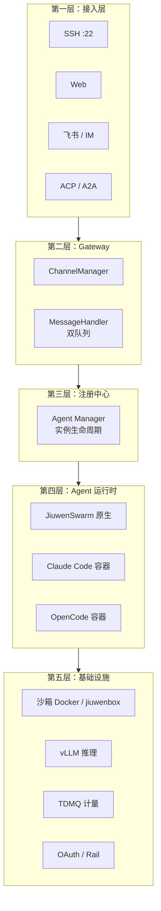
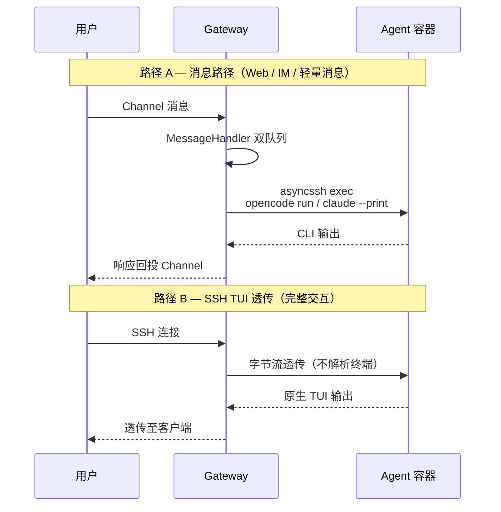
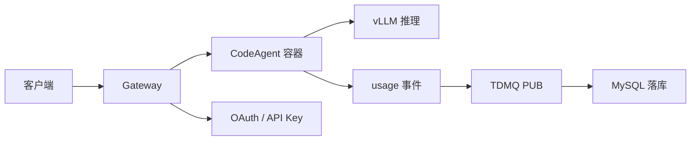

# 全局架构认知

> **首读文档**。在读 Claude Code、OpenCode 等 Agent 专题之前，先建立 Agent OS + 三方 CodeAgent 接入的整体地图。

## 1. 系统五层架构

| 层 | 职责 | 深入学习 |
|----|------|----------|
| 接入层 | 多端统一入口：SSH TUI、Web、IM、ACP/A2A | [03-communication-protocols](01-infrastructure/03-communication-protocols.md) |
| Gateway | 消息归一、双队列转发、Channel 路由 | [04-integration-patterns](04-integration-patterns/README.md) |
| 注册中心 | 创建/发现/调度 Agent 实例，绑定 owner | [04/sandbox-lifecycle](04-integration-patterns/sandbox-lifecycle.md) |
| Agent 运行时 | 原生 JiuwenSwarm，或三方 CC/OC 独立沙箱 | [02-claude-code](02-claude-code/README.md)、[03-opencode](03-opencode/README.md) |
| 基础设施 | 隔离、推理、异步计费、鉴权护栏 | [01-infrastructure](01-infrastructure/README.md) |

## 2. 两条接入路径

三方 CodeAgent（Claude Code、OpenCode）接入时，Gateway 提供两种路径：

| 路径 | 经过 MessageHandler | 典型命令 | 适用场景 |
|------|---------------------|----------|----------|
| **消息路径** | 是 | `opencode run --no-tui`、`claude --print` | Web/IM 轻量问答、自动化 |
| **TUI 路径** | 否（字节流透传） | 容器内 `opencode` / `claude` TUI | 完整交互、tmux 会话 |

**选型要点**：Claude Code 无 HTTP Server 模式，SSH + CLI 是通用方案；OpenCode 额外支持 `opencode serve`（HTTP）和 `opencode acp`（JSON-RPC）。

## 3. 端到端数据流（含计量）

| 环节 | 技术 | 对应文档 |
|------|------|----------|
| 容器隔离 | namespace / OCI / Docker / jiuwenbox | [01-sandbox-oci-docker](01-infrastructure/01-sandbox-oci-docker.md) |
| 推理调用 | vLLM OpenAI API + 多 Key | [02-vllm-multitenant](01-infrastructure/02-vllm-multitenant.md) |
| 进程/协议通信 | ZMQ / SSH / HTTP / ACP / MCP | [03-communication-protocols](01-infrastructure/03-communication-protocols.md) |
| 异步计费 | TDMQ Topic PUB → Consumer | [04-message-queue](01-infrastructure/04-message-queue.md) |
| 安全 | OAuth2 / API Key / Agent Rail | [05-auth-security](01-infrastructure/05-auth-security.md) |

## 4. agentos 源码锚点（只读对照）

| 模块 | 路径 | 关注点 |
|------|------|--------|
| Gateway | `agentos/jiuwenswarm/gateway/` | ChannelManager、MessageHandler、ACP Bridge |
| 沙箱 | `agentos/jiuwenswarm/jiuwenbox/` | bubblewrap、namespace、cgroup、Landlock policy |

## 5. 推荐阅读路径

1. [01 基础设施](01-infrastructure/README.md) — 五篇介绍，建立各层原理认知
2. [02 Claude Code](02-claude-code/README.md) — 用法 + 架构 + 泄露源码分析
3. [03 OpenCode](03-opencode/README.md) — 开源架构 + ACP 走读
4. [04 接入模式](04-integration-patterns/README.md) — SSH / ACP / 容器拉起
5. [notes 自研笔记](notes/README.md) — 走读产出

详细周计划见 [ROADMAP.md](ROADMAP.md)。
