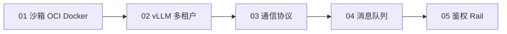

# 01 基础设施

> **第二站 · 介绍级**。每篇固定结构：**原理 → 典型应用场景 → 参考链接**。建立全局认知后再读 [02 Claude Code](../02-claude-code/README.md)。

## 技术链路

## 文档索引

| # | 文档 | 主题 |
|---|------|------|
| 1 | [01-sandbox-oci-docker.md](01-sandbox-oci-docker.md) | Linux 沙箱 → OCI → Docker |
| 2 | [02-vllm-multitenant.md](02-vllm-multitenant.md) | vLLM 推理、多租户、API Key 计量 |
| 3 | [03-communication-protocols.md](03-communication-protocols.md) | ZMQ / SSH / HTTP / ACP / MCP |
| 4 | [04-message-queue.md](04-message-queue.md) | TDMQ / CMQ 异步落库 |
| 5 | [05-auth-security.md](05-auth-security.md) | OAuth / API Key / Agent Rail |

## Capstone 延伸阅读

- [The LLM Engineer Handbook 2025](https://maximelabonne.medium.com/the-llm-engineer-handbook-2025-77a9a3173016) — 容器 vLLM + 多租户 + MQ 计费 + Agent 安全
- B 站搜索：`云原生容器从底层 runc 到 Docker 完整教程` · `vLLM 生产级落地 容器 + 网关 + 消息队列` · `大模型 Agent 安全防护 Rail 护栏实战`
- GitHub 搜索：`llm multi-tenant gateway vllm docker mq`
- 推荐项目：[baggie11/Multi-tenant-LLM-gateway](https://github.com/baggie11/Multi-tenant-LLM-gateway)
