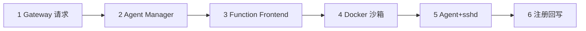

# Agent 容器实例生命周期

## 六步拉起流程



| 步骤 | 组件 | 职责 |
|------|------|------|
| 1 | Gateway | 校验身份，发起创建实例 |
| 2 | Agent Manager | 分配 owner、选择 Agent 类型（CC/OC） |
| 3 | Function Frontend | 沙箱创建 API |
| 4 | Docker SDK | 拉镜像、网络、卷、资源配额 |
| 5 | 容器 | 预装 Agent + sshd 就绪 |
| 6 | 注册中心 | 上报 agent_id、host、capabilities |

## 容器镜像要点

- 基础镜像 + Node.js（CC）或 OpenCode 安装包
- **openssh-server**，Gateway 注入公钥
- 项目目录 bind mount
- 环境变量：API Key、MCP 配置
- 可选：预装 vLLM 客户端 curl 指向推理端点

## 与 jiuwenbox 的关系

- **Docker 容器**：三方 CodeAgent 默认方案（需完整 OS + sshd）
- **jiuwenbox**：bubblewrap 轻量沙箱，适合 JiuwenSwarm 原生 Agent 工具执行

见 [01-sandbox-oci-docker](../01-infrastructure/01-sandbox-oci-docker.md)。

## 调试命令示例

```bash
docker inspect -f '{{range.NetworkSettings.Networks}}{{.IPAddress}}{{end}}' "opencode-$USER"
ssh -i gateway_key user@<容器IP>
```
