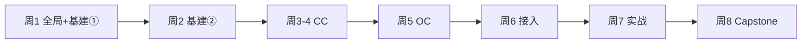

# 学习计划（8 周）

> **原则**：Week 1–2 只读 00 + 01，建立全局认知后再深入 Agent。**不跳读**。

## 总览



## 周计划

| 周 | 阶段 | 阅读 | 验收 |
|----|------|------|------|
| **1** | 全局 + 基建 ① | [00](00-architecture-overview.md) 全文 → [01/01](01-infrastructure/01-sandbox-oci-docker.md) + [01/02](01-infrastructure/02-vllm-multitenant.md) | 画出五层架构图；口述容器隔离与 vLLM 多租户角色 |
| **2** | 基建 ② | [01/03](01-infrastructure/03-communication-protocols.md) ~ [01/05](01-infrastructure/05-auth-security.md) | 画出 Gateway→Agent→vLLM→MQ 全链路 |
| 3 | CC ① | [02](02-claude-code/README.md) 官方 + 泄露分析 Ch.00–03 + [notes/cc-agent-loop](notes/cc-agent-loop.md) | `claude` TUI + `--print` |
| 4 | CC ② | 泄露分析 Ch.04–08 + [notes/cc-permission-model](notes/cc-permission-model.md)、[cc-mcp-hooks](notes/cc-mcp-hooks.md) | Permission/MCP 笔记初稿 |
| 5 | OpenCode | [03](03-opencode/README.md) + 源码 acp/ + [notes/oc-*](notes/README.md) | serve + attach + acp |
| 6 | 接入模式 | [04](04-integration-patterns/README.md) + [notes/integration-ssh-passthrough](notes/integration-ssh-passthrough.md) | SSH vs MessageHandler 决策图 |
| 7 | Gateway 实战 | [04](04-integration-patterns/README.md) + `agentos/jiuwenswarm/gateway/` | Web → asyncssh → opencode run |
| 8 | Capstone | 回顾 00 + 整合 notes | CC + OC 各一种接入路径 |

## 每周固定动作

1. 更新所读资源的 `status`（todo → in_progress → done）
2. Agent 专题周：至少完成 1 篇 [notes/](notes/README.md)
3. 基础设施周：只读 01 介绍文档，点开 1–2 个 P0 链接即可

## 推荐技术栈学习顺序

（与 [01-infrastructure/README](01-infrastructure/README.md) 一致）

1. Linux Namespace/cgroup → OCI runc/crun/kata/bwrap → Docker
2. vLLM 本地 → 容器打包 → 网关 API Key + 流量统计
3. ZMQ 进程通信、SSH 隧道、ACP/MCP Agent 协议
4. TDMQ PUB 消息，usage 异步写 DB
5. OAuth2 替换静态 Key、Agent Rail、容器沙箱隔离

## Capstone 目标架构

```
Gateway → 沙箱容器(CodeAgent+sshd) → vLLM 推理
                ↓ usage 事件
              TDMQ PUB → Consumer → MySQL
                ↓
         OAuth 鉴权 + Agent Rail
```

延伸阅读见 [01-infrastructure/README](01-infrastructure/README.md) Capstone 章节。
