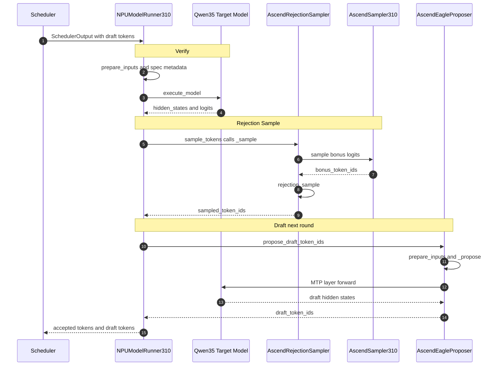
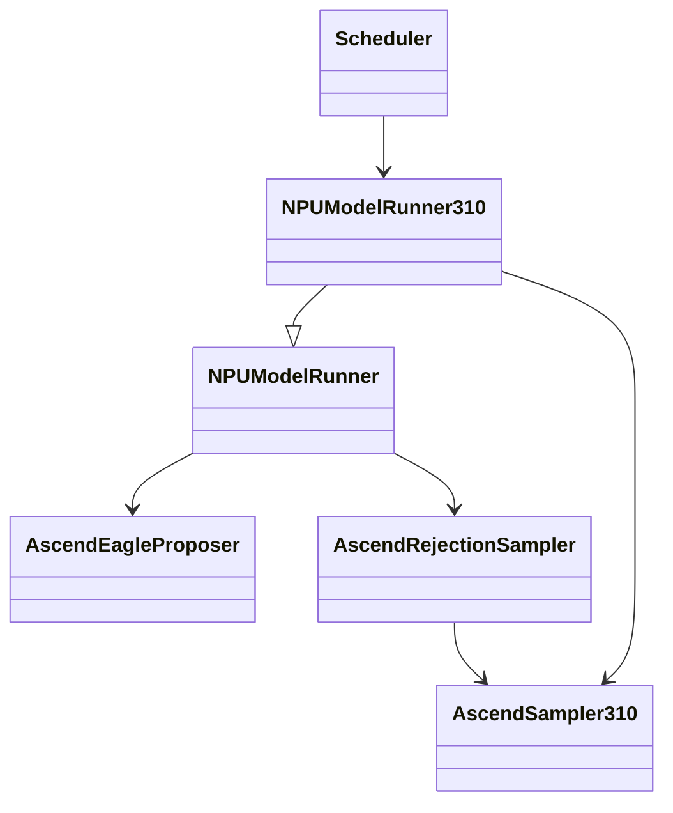
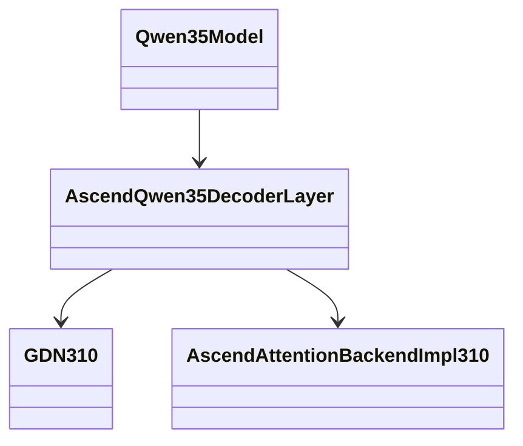
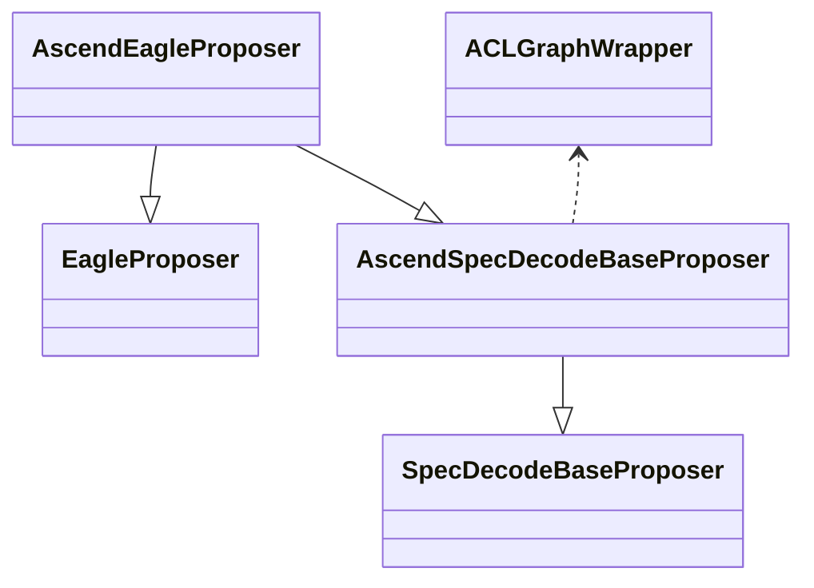
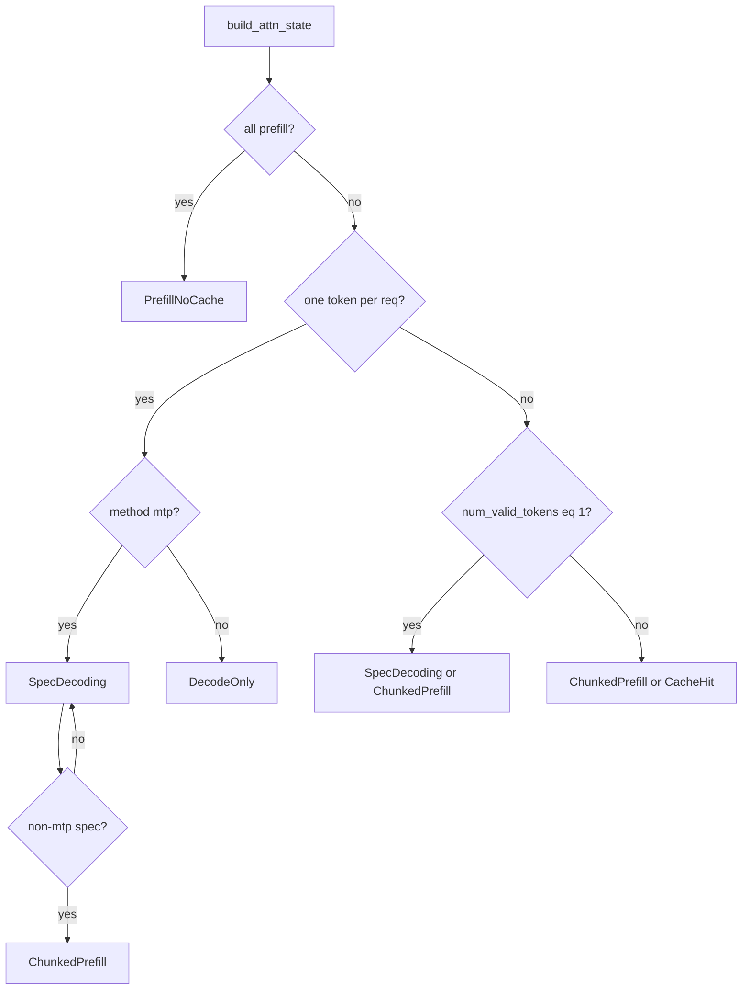
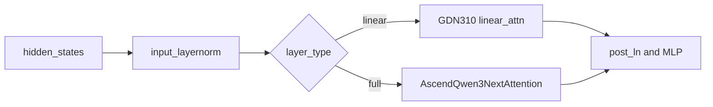

# MTP（Multi-Token Prediction）在 Ascend 310P 上的设计说明

> 模型场景：**Qwen3.5 + MTP**（`speculative_config.method = "mtp"`）。  
> **主线一致、实现按算子能力适配**：MTP 的 Drafter → Verify → Rejection 流程与 910B 等主分支相同；310P 在保持该流程的前提下，根据本设备算子支持情况调整实现，主要体现在 **Runner 输入准备**、**Attention/GDN**、**Sampler/Rejection**（无 Triton / triton-ascend）等环节。

---

## 1. 整体架构：Drafter → Verify → RejectionSampler

### 1.1 单步 Decode 时序图

下图为一轮 Decode 的 **Mermaid 时序图**（`sequenceDiagram`）：先 **Verify + Rejection**，再 **Draft**，与 `model_runner_v1.py` 中 `execute_model` → `sample_tokens` → `propose_draft_token_ids` 顺序一致。



**ASCII 时序备用**（预览不渲染 Mermaid 时对照）：

```
Scheduler    Runner310      TargetModel    RejectionSampler    Sampler310    EagleProposer
    |            |               |                |               |              |
    |-- output -->|               |                |               |              |
    |            |-- prepare ----|                |               |              |
    |            |-- verify ---->|                |               |              |
    |            |<-- logits ----|                |               |              |
    |            |-- sample ---------------------->|               |              |
    |            |                |               |-- bonus ----->|              |
    |            |                |               |<-- bonus id ---|              |
    |            |                |               |-- reject -----|              |
    |            |<-- sampled ids-|                |               |              |
    |            |-- propose --------------------------------------------------->|
    |            |                |<-- MTP forward -----------------------------|
    |            |<-- draft ids ------------------------------------------------|
    |<-- result -|                |                |               |              |
```

### 1.2 类图（含 310P 工作量标注）

> 类图拆成两张 Mermaid，减少交叉连线导致的错位；**★** 表示 310P 有开发工作量。  
> ASCII 备用图请用**等宽字体**（Consolas / Courier New）查看。

#### 1.2.1 调度与 Runner / Drafter / Sampler



| 类 | 310P |
|----|------|
| `NPUModelRunner310` | ★ `_prepare_inputs`、挂载 `AscendSampler310` |
| `AscendSampler310` | ★ `fill_exponential_310p` |
| `AscendRejectionSampler` | ★ 无 Triton 时走 PyTorch 路径 |

#### 1.2.2 模型前向与 310P Attention 算子



| 类 | 310P |
|----|------|
| `GDN310` | ★ linear_attn / spec 分支 |
| `AscendAttentionBackendImpl310` | ★ `forward_spec_decoding_310` |

调用方（见 1.2.1）：`NPUModelRunner` 做 Verify forward，`AscendEagleProposer` 做 Draft forward，二者均进入 `Qwen35Model`。

#### 1.2.3 ASCII 备用（整体，纵向对齐）

```
+-------------------+
|     Scheduler     |
+---------+---------+
          |
          v
+-----------------------------+
|     NPUModelRunner310       |  [310P]
|  _prepare_inputs            |
|  AscendSampler310           |
+-------------+---------------+
              | extends
              v
+-----------------------------+
|       NPUModelRunner        |
+-------+---------------------+
        |
        +-----------------------------+
        |                             |
        v                             v
+----------------+          +-------------------+
| AscendEagle    |          | AscendRejection   |
| Proposer       |          | Sampler           |
+-------+--------+          +---------+---------+
        |                             |
        | draft                       | uses AscendSampler310 [310P]
        |                             |
        +-------------+---------------+
                      |
                      v
              +---------------+
              |  Qwen35Model  |  <-- verify (Runner)
              +-------+-------+
                      |
                      v
              +-----------------------+
              | AscendQwen35Decoder   |
              | Layer                 |
              +-----------+-----------+
                          |
              +-----------+-----------+
              |                       |
              v                       v
        +-----------+         +-------------------+
        |  GDN310   |         | AttnBackend310    |  [310P]
        +-----------+         +-------------------+
```

### 1.3 310P 开发工作量一览

| 模块 | 路径 | 310P 工作说明 |
|------|------|----------------|
| **Worker / Runner** | `_310p/model_runner_310p.py`, `_310p/worker_310p.py` | 使用 `NPUModelRunner310`；CPU 侧 slot/block 准备；挂载 `AscendSampler310` / `AscendRejectionSampler` |
| **Attention (Full)** | `_310p/attention/attention_v1.py` | 新增 `forward_spec_decoding_310`（MTP Verify/Draft 的 `SpecDecoding` 状态） |
| **Linear Attn (GDN)** | `_310p/ops/fla/gdn_310.py` | Spec 序列 mask 下 `spec_token_indx` / `spec_state_indices_tensor` 分支 |
| **Sampler** | `_310p/sample/sampler.py` | CPU 指数分布 `fill_exponential_310p`（无 Triton 时 recovery 采样） |
| **Rejection** | `sample/rejection_sampler.py` | `is_310p()` 调用 `fill_exponential_310p`；`HAS_TRITON=False` 走 PyTorch 实现 |
| **Proposer** | `spec_decode/llm_base_proposer.py` | 与主分支共用；MTP 仍设 `AscendAttentionState.SpecDecoding`（图捕获/dummy_run） |
| **模型 Patch** | `patch/worker/patch_qwen3_5.py` | Qwen3.5 `linear_attn` / `full_attn` 分支（主分支已有，310P 走 310 算子） |

---

## 2. 草稿生成（Drafter / MTP Propose）

### 2.1 子类图



`direction BT`：基类在下、子类在上，继承链纵向展开，避免横向挤在一起错位。

**ASCII 备用（子类，等宽字体）**

```
                 +----------------------+
                 |  AscendEagleProposer |
                 +----------+-----------+
                            |
           +----------------+----------------+
           | extends                         | extends
           v                                 v
+---------------------------+      +------------------+
| AscendSpecDecodeBase      |      |  EagleProposer   |
| Proposer                  |      |  (vLLM)          |
+-------------+-------------+      +------------------+
              | extends
              v
+---------------------------+
| SpecDecodeBaseProposer    |
| (vLLM)                    |
+---------------------------+

AscendSpecDecodeBaseProposer --> ACLGraphWrapper (optional FULL graph)
```

**入口**：`get_spec_decode_method("mtp")` → `AscendEagleProposer`（`spec_decode/__init__.py`）。

### 2.2 Qwen3.5 + MTP 关键调用链（`num_speculative_tokens = 1`）

310P 与主分支 **共用** 下列路径，无单独 `if is_310p()` 分支：

```
sample_tokens()
  └─ propose_draft_token_ids()          [model_runner_v1.py]
       ├─ drafter.prepare_next_token_ids_padded()  # 上一轮 RS 输出 → next_token_ids
       ├─ drafter.prepare_inputs_padded()          # common_attn_metadata, token_indices
       └─ drafter._propose()                       [llm_base_proposer.py]
            ├─ set_inputs_first_pass()             # 拼 input_ids / positions / hidden_states
            ├─ draft_attn_groups[0].builder.build() # attn_metadata, slot_mapping
            ├─ (K>1) attn_update_stack_num_spec_norm() × (K-1)  # 多步 draft 元数据
            └─ set_ascend_forward_context(..., is_draft_model=True)
                 └─ _run_merged_draft() / ACLGraphWrapper
                      ├─ model(input_ids, positions, hidden_states)  # MTP layer
                      └─ model.compute_logits() → argmax → draft_token_ids
```

### 2.3 数据流与典型 Shape（Decode，batch = B，hidden = H，vocab = V）

| 阶段 | 变量 | Shape / 说明 |
|------|------|----------------|
| 输入（来自 Verify 步） | `target_token_ids` | `[num_tokens]`，`token_indices` 索引 `input_ids.gpu` |
| | `target_positions` | `[num_tokens]` 或 M-RoPE `[3, num_tokens]` |
| | `target_hidden_states` | `[num_tokens, H]`，Verify 最后一层 hidden |
| | `next_token_ids` | `[B]`，上一轮接受后的“锚点” token |
| MTP 第 1 步 forward | `model_input_ids` | `[num_input_tokens]`，含 padding（graph 时） |
| | `model_positions` | `[num_input_tokens]` 或 `[3, num_input_tokens]` |
| | `hidden_states` | `[num_input_tokens, H]` |
| 采样索引 | `token_indices_to_sample` | `[B]`，每请求 1 个 logits 行 |
| Draft 输出 | `draft_token_ids` | `[B, num_speculative_tokens]`，K=1 时为 `[B, 1]` |

**多步 draft（K>1）**：`attn_update_stack_num_spec_norm` 每步 `positions += 1`、`seq_lens += 1`，并重算 `slot_mapping`（`block_numbers = positions // block_size`）。Draft 侧 `attn_state = SpecDecoding`（MTP），与 Verify 侧 Qwen3.5 非 MLA 时在 graph 捕获可能为 `ChunkedPrefill`（见 §3）。

### 2.4 310P 在 Draft 阶段的实际分支

- **逻辑分支**：与主分支相同（`llm_base_proposer.py` 中 `method == "mtp"`）。
- **算子分支**：Draft 模型若含 **linear_attention** 层，走 `gdn_310.py`；**full_attention** 层在 `SpecDecoding` 下走 `forward_spec_decoding_310` → 内部复用 `forward_chunked_prefill_310` + splitfuse mask。

---

## 3. 主模型验证（Verify）

### 3.1 执行位置

```
execute_model()
  ├─ _prepare_inputs() → logits_indices, SpecDecodeMetadata
  ├─ _build_attn_state() → AscendAttentionState
  ├─ _model_forward() → Qwen3.5 全层
  └─ compute_logits(hidden_states[logits_indices])
sample_tokens()
  └─ _sample(logits, spec_decode_metadata) → AscendRejectionSampler
```

### 3.2 Attention 状态机（MTP）



**Qwen3.5 + MTP Decode（每轮调度 1+K 个 token）**：通常 **不是** `num_scheduled_tokens == 1`，会进入 **ChunkedPrefill** 或 **SpecDecoding**（`num_valid_tokens == 1` 的 spec 路径）。  
**310P Verify**：`ChunkedPrefill` → `forward_chunked_prefill_310`；若状态为 `SpecDecoding` → `forward_spec_decoding_310`。

### 3.3 Qwen3.5：Linear Attn vs Full Attn



| 类型 | 实现 | Spec/MTP 相关关键变量 |
|------|------|------------------------|
| **full_attention** | `patch_qwen3_5.py` → `AscendQwen3NextAttention` → `self.attn(q,k,v)` | **`slot_mapping`**：token→KV cache 物理槽位；**`block_table` / `block_table_tensor`**：逻辑块号；**`seq_lens`**：各 req 已见长度；**`query_start_loc`**：packed batch 内 Q 段起始 |
| **linear_attention** | `gdn_310.py` | **`spec_token_indx` / `non_spec_token_indx`**：spec 与 non-spec token 行索引；**`spec_state_indices_tensor`**：SSM state 槽位；**`spec_query_start_loc`**：spec 段 `cu_seqlens`；**`num_accepted_tokens`**：上轮接受 token 数（async/spec） |

Verify 时 **一次 forward 处理多条 scheduled token**（已接受 token + K 个 draft 位置），FIA/splitfuse 在 310P 上用 `AttentionMaskBuilder310.get_splitfuse_mask` 构造 mask。

### 3.4 SpecDecodeMetadata 与 Logits 索引（Verify 采样）

由 `_calc_spec_decode_metadata(num_draft_tokens, cu_num_scheduled_tokens)` 构造：

| 字段 | 含义 | 典型用途 |
|------|------|----------|
| `draft_token_ids` | `[num_draft_tokens_flat]` | RS 比较的 draft token |
| `target_logits_indices` | `[num_draft_tokens_flat]` | 取 target logits 行 |
| `bonus_logits_indices` | `[batch_size]` | 每 req 的 bonus logits 行 |
| `logits_indices` | `[sum(num_draft+1)]` | `hidden_states` 上 `compute_logits` 的行索引 |
| `cu_num_draft_tokens` | `[batch_size]` | draft token 前缀和 |

**Logits shape**：`[len(logits_indices), V // tp_size]`（TP 切分词表）。

**示例**（B=2，req0: 3 draft，req1: 0 draft）：

- `num_sampled_tokens` = [4, 1]
- `logits_indices` 长度 = 5
- `target_logits_indices` 长度 = 3
- RS 输出 `sampled_token_ids`: `[2, max_spec_len+1]`

---

## 4. RejectionSampler（310P：无 Triton / triton-ascend）

### 4.1 类与分支选择

```
AscendRejectionSampler.forward()
  ├─ bonus_logits = logits[bonus_logits_indices]     # [B, V/tp]
  ├─ AscendSampler310 / AscendSampler → bonus_token_ids  # [B, 1]
  ├─ target_logits = apply_logits_processors + apply_sampling_constraints
  └─ rejection_sample(..., draft_probs=None)         # MTP 无 draft_probs
        ├─ HAS_TRITON?  → 310P 通常为 False
        ├─ greedy: rejection_greedy_sample_pytorch (或 spec_len=1 快速路径)
        └─ random: sample_recovered_tokens → rejection_random_sample_pytorch
```

### 4.2 310P 特化函数与算子

| 步骤 | 函数 | 后端 | 说明 |
|------|------|------|------|
| Penalties | `Sampler.apply_penalties` | PyTorch | `HAS_TRITON=False` 时不用 Triton penalties |
| Temperature / TopK / TopP | `apply_top_k_top_p` | NPU PyTorch | `apply_sampling_constraints` |
| Greedy argmax（TP） | `greedy_sample` | `all_gather` + `argmax` | `enable_reduce_sample` 时 |
| Expand batch→token | `expand_pytorch` | PyTorch | 替代 `expand_triton` |
| Recovery 分布 q | **`fill_exponential_310p`** | **CPU RNG → NPU** | `_310p/sample/sampler.py` |
| Recovery token | `sample_recovered_tokens_pytorch` | PyTorch | `argmax(max(P_target - P_draft, 0) / q)` |
| Greedy RS | `rejection_greedy_sample_pytorch` | PyTorch | draft == target_argmax 则接受 bonus |
| Random RS | `rejection_random_sample_pytorch` | PyTorch | `P_target/P_draft >= U` |

### 4.3 Greedy MTP 计算过程（`draft_probs=None`，最常见）

设第 `i` 个 draft 位置：

1. **Target 预测**：`target_argmax[i] = argmax(target_logits[i])`（可能经 TP `greedy_sample`）。
2. **接受条件**：`draft_token_ids[i] == target_argmax[i]`。
3. **截断**：首个不匹配位置 `first_mismatch`；复制 `[0, first_mismatch]` 的 `target_argmax` 到输出。
4. **Bonus**：若全部 K 个 draft 均匹配且该 req 为 greedy，在位置 K 写入 `bonus_token_ids[req]`。

MTP 文档约定：`P_draft` 未提供时视为 1，随机采样时接受条件退化为 `P_target >= U`。

**Recovery（随机采样）**：

```
prob = max(target_probs - draft_probs, 0)   # MTP ngram 式: draft_probs 缺省
q ~ Exponential(1)  per req                 # 310P: fill_exponential_310p (CPU)
recovered_id = argmax(prob / q)
```

### 4.4 输入 / 输出汇总

| 方向 | 张量 | Shape |
|------|------|--------|
| 输入 | `logits` | `[num_logits_rows, V/tp]`，含 target + bonus 行 |
| 输入 | `metadata.draft_token_ids` | `[num_draft_tokens]` |
| 输入 | `draft_probs` | `None`（MTP） |
| 输入 | `bonus_token_ids` | `[B, 1]` |
| 输出 | `SamplerOutput.sampled_token_ids` | `[B, K+1]`，`int32`，未用位置为 `PLACEHOLDER_TOKEN_ID` |

### 4.5 与最近提交的关系

- **`2f660054`**：`_310p/attention/attention_v1.py` 增加 `forward_spec_decoding_310`，使 Draft/Verify 的 `SpecDecoding` 在 310P 可执行。
- **`627189ce`**：`fill_exponential_310p`、`_random_sample_310p` 完善；`rejection_sampler.py` 中 `is_310p()` 走 CPU 指数采样，修复 recovery 随机性。

---

## 5. 配置示例（Qwen3.5 MTP）

```bash
vllm serve Qwen/Qwen3.5-0.8B \
  --speculative_config '{"method": "mtp", "num_speculative_tokens": 1}'
```

E2E 参考：`tests/e2e/light/single-card/test_qwen3_5_0_8b.py`（`FULL_DECODE_ONLY` + MTP）。

**约束**（见 `Multi_Token_Prediction.md`）：`num_speculative_tokens + 1` 受 FIA TND layout 限制，`decode_threshold <= 16`（即 K ≤ 15）。

---

## 6. 相关源文件索引

| 主题 | 文件 |
|------|------|
| Runner 主流程 | `vllm_ascend/worker/model_runner_v1.py` |
| 310P Runner | `vllm_ascend/_310p/model_runner_310p.py` |
| MTP Propose | `vllm_ascend/spec_decode/llm_base_proposer.py` |
| Proposer 工厂 | `vllm_ascend/spec_decode/__init__.py` |
| Rejection | `vllm_ascend/sample/rejection_sampler.py` |
| 310P Sampler | `vllm_ascend/_310p/sample/sampler.py` |
| 310P Attention | `vllm_ascend/_310p/attention/attention_v1.py` |
| 310P GDN | `vllm_ascend/_310p/ops/fla/gdn_310.py` |
| Qwen3.5 层 | `vllm_ascend/patch/worker/patch_qwen3_5.py` |
| 功能文档 | `docs/source/user_guide/feature_guide/Multi_Token_Prediction.md` |

---

*文档版本：与当前工作区 `627189ce` / `2f660054` 提交对齐。*
