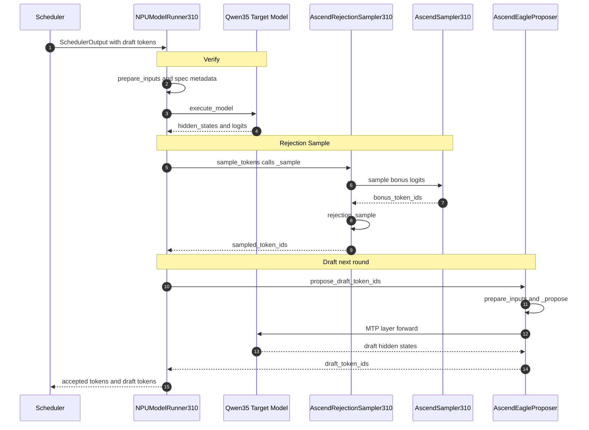
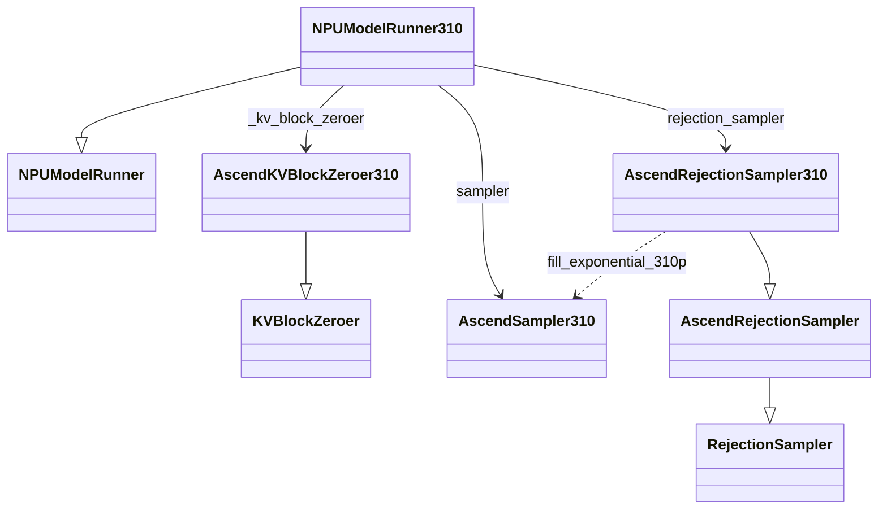
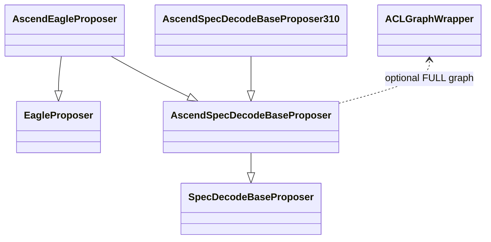
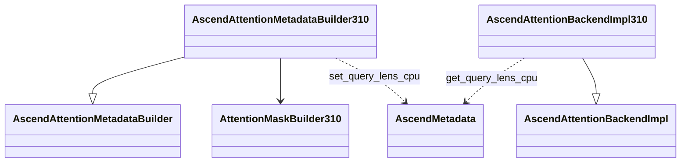
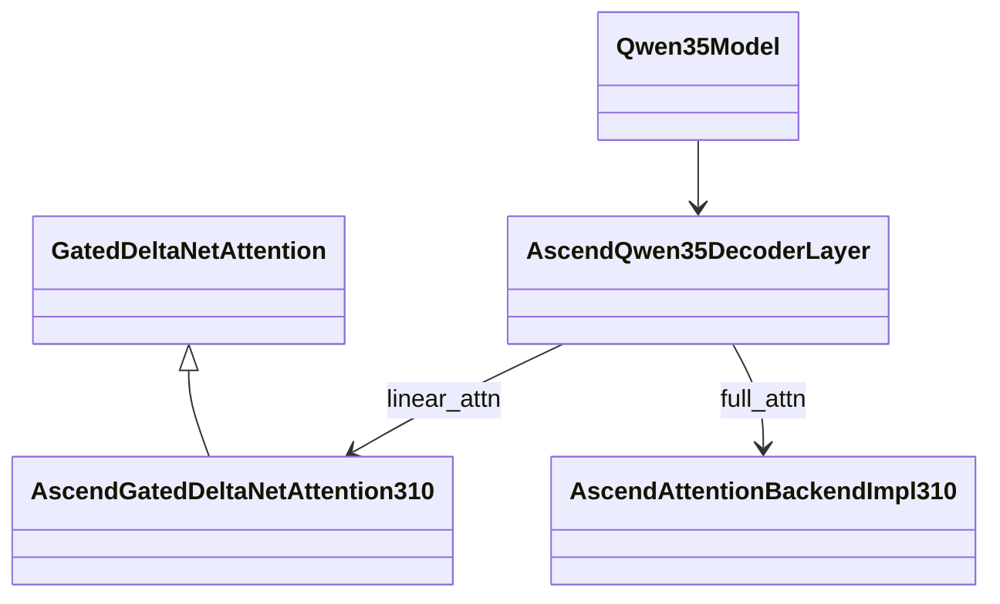
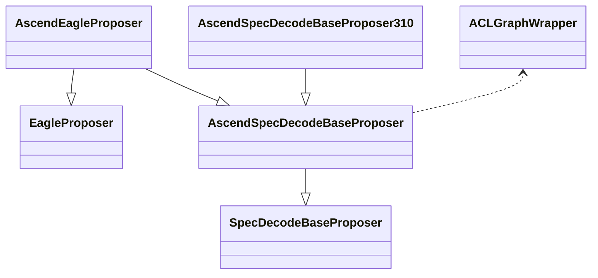
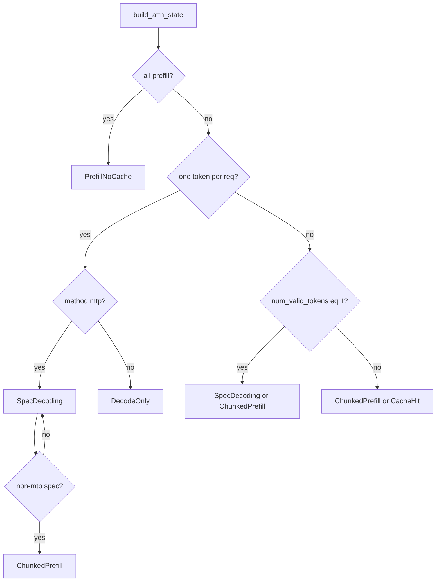
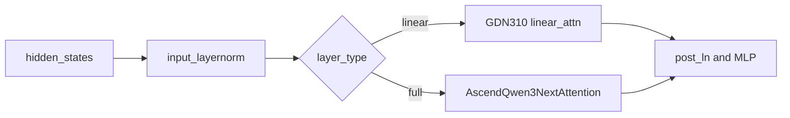

# MTP（Multi-Token Prediction）在 Ascend 310P 上的设计说明

> 模型场景：**Qwen3.5 + MTP**（`speculative_config.method = "mtp"` 或 E2E 中 `"qwen3_5_mtp"`）。  
> **主线一致、实现按算子能力适配**：MTP 每轮 Decode 分三步——**① Verify**（主模型验证）→ **② Rejection**（拒绝采样）→ **③ Draft**（草稿生成）——流程与 910B 等主分支相同；310P 在保持该流程的前提下，根据本设备算子支持情况调整实现，主要体现在 **Runner 输入准备**、**Attention/GDN**、**Sampler/Rejection**（无 Triton / triton-ascend）、**KV Block Zeroer**、**Graph Capture/Replay** 等环节。  
> **实现 PR**：[vllm-ascend #10309](https://github.com/vllm-project/vllm-ascend/pull/10309)（已合入 main，merge commit `969baed`）。

---

## 1. 整体架构：Verify → Rejection → Draft

一轮 Decode 按 **Verify → Rejection → Draft** 三步执行（与 §1.2 时序图编号一致）。Draft 在本轮末尾产出，供 **下一轮** Scheduler 调度验证。

### 1.1 三步功能概览

| 步骤 | 执行入口 | 核心功能 | 主要输入 | 主要输出 | 310P 适配要点 |
|------|----------|----------|----------|----------|---------------|
| **① Verify**（主模型验证） | `execute_model()` | 主模型一次前向，对每个请求同时处理 **1 个已确定 token + K 个 draft token**，在完整上下文中计算 target 侧表示与词表 logits，供后续比对 | Scheduler 调度的 `input_ids`、draft tokens、KV cache | `hidden_states`、`logits`（经 `logits_indices` 索引） | `SpecDecoding` 走 splitfuse（`forward_chunked_prefill_310`）；GDN 区分 spec/non-spec token；metadata 预填 `query_lens_cpu` |
| **② Rejection**（拒绝采样） | `sample_tokens()` → `_sample()` | 将 draft 预测与 target logits 做 **rejection sampling**：逐位比对 draft 与 target 预测，决定接受几个 draft；若 K 个全部接受且为 greedy，再采样 **bonus token** 多产出 1 个 token | Verify 产出的 `logits`、`SpecDecodeMetadata.draft_token_ids` | `sampled_token_ids` `[B, K+1]`，写回各请求序列 | `AscendRejectionSampler310`；recovery 随机数经 `fill_exponential_310p`（CPU RNG → NPU） |
| **③ Draft**（草稿生成） | `propose_draft_token_ids()` | MTP 层基于 Verify 最后一层 hidden state，**预测下一轮 K 个 draft token**，供 Scheduler 在下一轮 Verify 中验证，形成投机解码闭环 | 上一轮 RS 接受的 `next_token_ids`、`target_hidden_states` | `draft_token_ids` `[B, K]` | 逻辑与主分支共用；算子走 GDN 310 / splitfuse；uniform spec 可 ACL graph replay |

**一步产出的数据闭环**：

```
Scheduler（含上轮 draft）
    → ① Verify：主模型算 target logits
    → ② Rejection：决定本轮实际接受哪些 token
    → ③ Draft：为下轮生成新 draft
    → 回 Scheduler
```

---

### 1.2 单步 Decode 时序图

下图为一轮 Decode 的 **时序图**（`sequenceDiagram`）：按 **① Verify → ② Rejection → ③ Draft** 顺序执行，与 `model_runner_v1.py` 中 `execute_model` → `sample_tokens` → `propose_draft_token_ids` 一致。



### 1.3 类图

> 类图按 PR #10309 模块拆分；**★** 表示 310P 新增或 override。  
> ASCII 备用图请用**等宽字体**（Consolas / Courier New）查看。

#### 1.3.1 Runner / KV / 采样（① Verify + ② Rejection）



| 类 | 310P 职责（#10309） |
|----|---------------------|
| `NPUModelRunner310` ★ | `_build_attn_state` 强制 MTP `SpecDecoding`；MTP graph 策略；`_mtp_spec_dummy_capture`；`_init_kv_zero_meta` |
| `AscendKVBlockZeroer310` ★ | 无 Triton，新分配 KV block 经 `zero_block_ids` tensor 写零 |
| `AscendSampler310` ★ | `_random_sample_310p`、`fill_exponential_310p`（CPU RNG） |
| `AscendRejectionSampler310` ★ | override `sample_recovered_tokens`，recovery 走 `fill_exponential_310p` |

#### 1.3.2 Proposer（③ Draft）



| 类 | 310P 职责（#10309） |
|----|---------------------|
| `AscendEagleProposer` | MTP 入口（`method=mtp`）；调用 MTP layer forward |
| `AscendSpecDecodeBaseProposer310` ★ | override `prepare_next_token_ids_padded`：空 discard 索引时跳过 NPU `index_fill_` |
| `patch_idex_310` | 运行时 method-assign，将 310 实现挂到 `AscendSpecDecodeBaseProposer` |

#### 1.3.3 Attention / Metadata（① Verify · full_attention）



| 类 / 函数 | 310P 职责（#10309） |
|-----------|---------------------|
| `AscendAttentionMetadataBuilder310.build` ★ | `SpecDecoding`/`ChunkedPrefill` 时填充 `query_lens_cpu`、绑定 device view |
| `set_query_lens_cpu` / `get_query_lens_cpu` ★ | host qLens 动态挂载/读取（graph capture 必需） |
| `AscendAttentionBackendImpl310.forward_impl` ★ | `SpecDecoding` 与 `ChunkedPrefill` 同路径 → splitfuse |

#### 1.3.4 GDN / 模型前向（① Verify + ③ Draft · linear_attention）



| 类 / 函数 | 310P 职责（#10309） |
|-----------|---------------------|
| `AscendGatedDeltaNetAttention310` ★ | spec/non-spec 分支；uniform spec graph 下 conv1d `buffer_replay` |
| `update_conv1d_graph_params_310p` ★ | graph replay 前刷新 conv1d device buffer（经 `patch_idex_310` 注册到 `gdn_ops`） |
| `_merge_spec_and_non_spec_outputs_310` ★ | 避免 NPU `index_copy_`，direct indexing 合并输出 |
| `_flatten_state_indices` ★ | uniform spec 用 reshape 替代 `masked_select`（兼容 stream capture） |

调用方：`NPUModelRunner310` 做 ① Verify forward，`AscendEagleProposer` 做 ③ Draft forward，二者均进入 `Qwen35Model`。

#### 1.3.5 ASCII 备用（整体，纵向对齐）

```
+-------------------+
|     Scheduler     |
+---------+---------+
          |
          v
+-----------------------------+
|     NPUModelRunner310       |  [310P ★]
|  AscendSampler310           |
|  AscendRejectionSampler310  |
|  AscendKVBlockZeroer310     |
+-------------+---------------+
              | extends
              v
+-----------------------------+
|       NPUModelRunner        |
+-------+---------------------+
        |
        +-----------------------------+
        |                             |
        v                             v
+----------------+          +------------------------+
| AscendEagle    |          | AscendRejection        |
| Proposer       |          | Sampler310             |
| (+ Proposer310 |          |  → fill_exponential    |
|   patch)       |          +------------------------+
+-------+--------+
        | ③ Draft
        |
        +-------------+---------------+
                      |
                      v
              +---------------+
              |  Qwen35Model  |  <-- ① Verify (Runner)
              +-------+-------+
                      |
                      v
              +-----------------------+
              | AscendQwen35Decoder   |
              | Layer                 |
              +-----------+-----------+
                          |
              +-----------+-----------+
              |                       |
              v                       v
+---------------------------+  +---------------------------+
| AscendGatedDeltaNet       |  | AscendAttentionBackend    |
| Attention310  [GDN ★]     |  | Impl310  [Attn ★]         |
| conv1d buffer_replay      |  | splitfuse + query_lens_cpu|
+---------------------------+  +---------------------------+
              ^                       ^
              |                       |
    MetadataBuilder310 ───────────────┘
    (query_lens_cpu)
```

### 1.4 310P 开发工作量一览

| 模块 | 路径 | 310P 工作说明 |
|------|------|----------------|
| **Worker / Runner** | `_310p/model_runner_310p.py`, `_310p/worker_310p.py` | 使用 `NPUModelRunner310`；CPU 侧 slot/block 准备；挂载 `AscendSampler310` / `AscendRejectionSampler310`；MTP uniform batch 图捕获策略 |
| **Attention (Full)** | `_310p/attention/attention_v1.py`, `_310p/attention/metadata_builder.py` | `SpecDecoding` / `ChunkedPrefill` 均走 `forward_chunked_prefill_310`；`query_lens_cpu` 供 ATB splitfuse |
| **KV Block Zeroer** | `_310p/kv_block_zeroer.py` | `AscendKVBlockZeroer310`：MTP≥2 时新分配 KV block 直接 tensor 写零（替代 Triton） |
| **Linear Attn (GDN)** | `_310p/ops/fla/gdn_310.py` | Spec 序列 mask 分支；uniform spec graph 下 conv1d `buffer_replay` |
| **Sampler** | `_310p/sample/sampler.py` | CPU 指数分布 `fill_exponential_310p`（Top-K/Top-P 与 Rejection 共用） |
| **Rejection** | `_310p/sample/rejection_sampler.py` | `AscendRejectionSampler310`：绑定 PyTorch recovery + `fill_exponential_310p` |
| **Proposer** | `_310p/spec_decode/llm_base_proposer_310.py` | 310P patch 空 `discard_request_indices` 时不调用 NPU `index_fill_` |
| **模型 Patch** | `patch/worker/patch_qwen3_5.py`, `patch/worker/patch_idex_310.py` | Qwen3.5 层走 310 算子；GDN conv1d graph replay / proposer patch 注册 |

---

## 2. 草稿生成（③ Draft / MTP Propose）

> **功能**：在 Verify + Rejection 完成后，由 `AscendEagleProposer` 调用 Qwen3.5 的 **MTP 层**，以上一轮接受的 token 与 Verify 输出的 hidden states 为输入，**一次性预测 K 个 draft token**。这些 draft 不直接写入用户可见输出，而是交给 Scheduler，在 **下一轮 ① Verify** 中由主模型并行验证，从而在不增加主模型前向次数的前提下提高 decode 吞吐。

**相关类图**：§1.3.2（Proposer 继承链 + `AscendSpecDecodeBaseProposer310` patch）、§1.3.4（Draft forward 同样经过 GDN / full_attn）。

### 2.1 子类图

与 §1.3.2 一致；310P 通过 `patch_idex_310` 将 `AscendSpecDecodeBaseProposer310.prepare_next_token_ids_padded` 挂到基类，**不改变** `AscendEagleProposer` 继承关系。



`direction BT`：基类在下、子类在上，继承链纵向展开，避免横向挤在一起错位。

**ASCII 备用（子类，等宽字体）**

```
                 +----------------------+
                 |  AscendEagleProposer |  method=mtp
                 +----------+-----------+
                            |
           +----------------+----------------+
           | extends                         | extends
           v                                 v
+---------------------------+      +------------------+
| AscendSpecDecodeBase      |      |  EagleProposer   |
| Proposer                  |      |  (vLLM)          |
|  ↑ patch: Proposer310     |      +------------------+
|    prepare_next_token_*   |
+-------------+-------------+
              | extends
              v
+---------------------------+
| SpecDecodeBaseProposer    |
| (vLLM)                    |
+---------------------------+

AscendSpecDecodeBaseProposer310 ──patch_idex_310──> prepare_next_token_ids_padded
AscendSpecDecodeBaseProposer --> ACLGraphWrapper (optional FULL graph)
```

**入口**：`get_spec_decode_method("mtp")` → `AscendEagleProposer`（`spec_decode/__init__.py`）。

### 2.2 Qwen3.5 + MTP 关键调用链（`num_speculative_tokens = 1`）

310P 与主分支 **共用** 下列路径，无单独 `if is_310p()` 分支：

```
sample_tokens()
  └─ propose_draft_token_ids()          [model_runner_v1.py]
       ├─ drafter.prepare_next_token_ids_padded()  # 上一轮 RS 输出 → next_token_ids
       ├─ drafter.prepare_inputs_padded()          # common_attn_metadata, token_indices
       └─ drafter._propose()                       [llm_base_proposer.py]
            ├─ set_inputs_first_pass()             # 拼 input_ids / positions / hidden_states
            ├─ draft_attn_groups[0].builder.build() # attn_metadata, slot_mapping
            ├─ (K>1) attn_update_stack_num_spec_norm() × (K-1)  # 多步 draft 元数据
            └─ set_ascend_forward_context(..., is_draft_model=True)
                 └─ _run_merged_draft() / ACLGraphWrapper
                      ├─ model(input_ids, positions, hidden_states)  # MTP layer
                      └─ model.compute_logits() → argmax → draft_token_ids
```

### 2.3 数据流与典型 Shape（Decode，batch = B，hidden = H，vocab = V）

| 阶段 | 变量 | Shape / 说明 |
|------|------|----------------|
| 输入（来自 Verify 步） | `target_token_ids` | `[num_tokens]`，`token_indices` 索引 `input_ids.gpu` |
| | `target_positions` | `[num_tokens]` 或 M-RoPE `[3, num_tokens]` |
| | `target_hidden_states` | `[num_tokens, H]`，Verify 最后一层 hidden |
| | `next_token_ids` | `[B]`，上一轮接受后的“锚点” token |
| MTP 第 1 步 forward | `model_input_ids` | `[num_input_tokens]`，含 padding（graph 时） |
| | `model_positions` | `[num_input_tokens]` 或 `[3, num_input_tokens]` |
| | `hidden_states` | `[num_input_tokens, H]` |
| 采样索引 | `token_indices_to_sample` | `[B]`，每请求 1 个 logits 行 |
| Draft 输出 | `draft_token_ids` | `[B, num_speculative_tokens]`，K=1 时为 `[B, 1]` |

**多步 draft（K>1）**：`attn_update_stack_num_spec_norm` 每步 `positions += 1`、`seq_lens += 1`，并重算 `slot_mapping`（`block_numbers = positions // block_size`）。Draft 侧 `attn_state = SpecDecoding`（MTP），与 Verify 侧 Qwen3.5 非 MLA 时在 graph 捕获可能为 `ChunkedPrefill`（见 §3）。

### 2.4 310P 在 Draft 阶段的实际分支

- **逻辑分支**：与主分支相同（`llm_base_proposer.py` 中 `method == "mtp"`）。
- **算子分支**：Draft 模型若含 **linear_attention** 层，走 `gdn_310.py`；**full_attention** 层在 `SpecDecoding` 下与 `ChunkedPrefill` 相同，走 `forward_chunked_prefill_310` + splitfuse mask（#10309 将二者合并为同一路径）。

---

## 3. 主模型验证（① Verify）

> **功能**：接收 Scheduler 本轮调度的 token 布局（每个请求 **1 个已接受 token + K 个待验证 draft**），驱动 Qwen3.5 **全层主模型**做一次前向。在更新 KV cache 的同时，为每个 draft 位置及 bonus 位置产出对应 logits 行，供 **② Rejection** 逐位比对。Verify 是投机解码的「裁判计算」阶段——只算 target 侧概率，不做接受/拒绝决策。

**相关类图**：§1.3.3（full_attention / splitfuse）、§1.3.4（linear_attention / GDN）。

### 3.1 执行位置

```
execute_model()
  ├─ _prepare_inputs() → logits_indices, SpecDecodeMetadata
  ├─ _build_attn_state() → AscendAttentionState
  ├─ _model_forward() → Qwen3.5 全层
  └─ compute_logits(hidden_states[logits_indices])
sample_tokens()
  └─ _sample(logits, spec_decode_metadata) → AscendRejectionSampler310
```

### 3.2 Attention 状态机（MTP）



**Qwen3.5 + MTP Decode（每轮调度 1+K 个 token）**：通常 **不是** `num_scheduled_tokens == 1`，会进入 **ChunkedPrefill** 或 **SpecDecoding**（`num_valid_tokens == 1` 的 spec 路径）。  
**310P Verify**：`ChunkedPrefill` 与 `SpecDecoding` 均 → `forward_chunked_prefill_310`（splitfuse）；metadata 构建阶段预填 `query_lens_cpu` 供 ATB host qLens。

### 3.3 Qwen3.5：Linear Attn vs Full Attn



| 类型 | 实现 | Spec/MTP 相关关键变量 |
|------|------|------------------------|
| **full_attention** | `patch_qwen3_5.py` → `AscendQwen3NextAttention` → `self.attn(q,k,v)` | **`slot_mapping`**：token→KV cache 物理槽位；**`block_table` / `block_table_tensor`**：逻辑块号；**`seq_lens`**：各 req 已见长度；**`query_start_loc`**：packed batch 内 Q 段起始 |
| **linear_attention** | `gdn_310.py` | **`spec_token_indx` / `non_spec_token_indx`**：spec 与 non-spec token 行索引；**`spec_state_indices_tensor`**：SSM state 槽位；**`spec_query_start_loc`**：spec 段 `cu_seqlens`；**`num_accepted_tokens`**：上轮接受 token 数（async/spec） |

Verify 时 **一次 forward 处理多条 scheduled token**（已接受 token + K 个 draft 位置），FIA/splitfuse 在 310P 上用 `AttentionMaskBuilder310.get_splitfuse_mask` 构造 mask。

### 3.4 SpecDecodeMetadata 与 Logits 索引（Verify 采样）

由 `_calc_spec_decode_metadata(num_draft_tokens, cu_num_scheduled_tokens)` 构造：

| 字段 | 含义 | 典型用途 |
|------|------|----------|
| `draft_token_ids` | `[num_draft_tokens_flat]` | RS 比较的 draft token |
| `target_logits_indices` | `[num_draft_tokens_flat]` | 取 target logits 行 |
| `bonus_logits_indices` | `[batch_size]` | 每 req 的 bonus logits 行 |
| `logits_indices` | `[sum(num_draft+1)]` | `hidden_states` 上 `compute_logits` 的行索引 |
| `cu_num_draft_tokens` | `[batch_size]` | draft token 前缀和 |

**Logits shape**：`[len(logits_indices), V // tp_size]`（TP 切分词表）。

**示例**（B=2，req0: 3 draft，req1: 0 draft）：

- `num_sampled_tokens` = [4, 1]
- `logits_indices` 长度 = 5
- `target_logits_indices` 长度 = 3
- RS 输出 `sampled_token_ids`: `[2, max_spec_len+1]`

---

## 4. RejectionSampler（② Rejection / 310P：无 Triton）

> **功能**：读取 Verify 产出的 target logits 与 metadata 中的 draft token，执行 **rejection sampling**：从第 0 个 draft 起逐位检查是否与 target 预测一致，在首个不匹配处截断；被接受的位写入 target 预测 token。若 K 个 draft 全部接受（greedy 场景），再从 bonus logits 采样 **额外 1 个 token**。输出 `sampled_token_ids` 即本轮各请求 **实际落盘的 token 序列**，并作为 ③ Draft 的 `next_token_ids` 输入。

**相关类图**：§1.3.1（`AscendRejectionSampler310` / `AscendSampler310` / `fill_exponential_310p`）。

### 4.1 类与分支选择

```
AscendRejectionSampler310.forward()                  # 310P 专用子类
  ├─ _bind_sample_recovered_tokens(sample_recovered_tokens)  # 注入 310P recovery
  └─ AscendRejectionSampler.forward()
       ├─ bonus_logits = logits[bonus_logits_indices]     # [B, V/tp]
       ├─ AscendSampler310 → bonus_token_ids               # [B, 1]
       ├─ target_logits = apply_logits_processors + apply_sampling_constraints
       └─ rejection_sample(..., draft_probs=None)         # MTP 无 draft_probs
             ├─ HAS_TRITON?  → 310P 通常为 False
             ├─ greedy: rejection_greedy_sample_pytorch (或 spec_len=1 快速路径)
             └─ random: sample_recovered_tokens → fill_exponential_310p + pytorch
```

### 4.2 310P 特化函数与算子

| 步骤 | 函数 | 后端 | 说明 |
|------|------|------|------|
| Penalties | `Sampler.apply_penalties` | PyTorch | `HAS_TRITON=False` 时不用 Triton penalties |
| Temperature / TopK / TopP | `apply_top_k_top_p` | NPU PyTorch | `apply_sampling_constraints` |
| Greedy argmax（TP） | `greedy_sample` | `all_gather` + `argmax` | `enable_reduce_sample` 时 |
| Expand batch→token | `expand_pytorch` | PyTorch | 替代 `expand_triton` |
| Recovery 分布 q | **`fill_exponential_310p`** | **CPU RNG → NPU** | `_310p/sample/sampler.py`（Sampler + Rejection 共用） |
| Recovery token | `sample_recovered_tokens_pytorch` | PyTorch | `argmax(max(P_target - P_draft, 0) / q)` |
| Greedy RS | `rejection_greedy_sample_pytorch` | PyTorch | draft == target_argmax 则接受 bonus |
| Random RS | `rejection_random_sample_pytorch` | PyTorch | `P_target/P_draft >= U` |

### 4.3 Greedy MTP 计算过程（`draft_probs=None`，最常见）

设第 `i` 个 draft 位置：

1. **Target 预测**：`target_argmax[i] = argmax(target_logits[i])`（可能经 TP `greedy_sample`）。
2. **接受条件**：`draft_token_ids[i] == target_argmax[i]`。
3. **截断**：首个不匹配位置 `first_mismatch`；复制 `[0, first_mismatch]` 的 `target_argmax` 到输出。
4. **Bonus**：若全部 K 个 draft 均匹配且该 req 为 greedy，在位置 K 写入 `bonus_token_ids[req]`。

MTP 文档约定：`P_draft` 未提供时视为 1，随机采样时接受条件退化为 `P_target >= U`。

**Recovery（随机采样）**：

```
prob = max(target_probs - draft_probs, 0)   # MTP ngram 式: draft_probs 缺省
q ~ Exponential(1)  per req                 # 310P: fill_exponential_310p (CPU)
recovered_id = argmax(prob / q)
```

### 4.4 输入 / 输出汇总

| 方向 | 张量 | Shape |
|------|------|--------|
| 输入 | `logits` | `[num_logits_rows, V/tp]`，含 target + bonus 行 |
| 输入 | `metadata.draft_token_ids` | `[num_draft_tokens]` |
| 输入 | `draft_probs` | `None`（MTP） |
| 输入 | `bonus_token_ids` | `[B, 1]` |
| 输出 | `SamplerOutput.sampled_token_ids` | `[B, K+1]`，`int32`，未用位置为 `PLACEHOLDER_TOKEN_ID` |

### 4.5 Graph Capture 策略（310P MTP）

310P ACL graph 与 910B 的 FIA fullgraph 契约不同：`NPUModelRunner310` 仅在 **uniform spec-decode batch**（每 req 恰好 `1+K` token、`attn_state == SpecDecoding`）时走 graph replay；mixed prefill 或非 uniform batch 强制 eager。

| 场景 | 行为 |
|------|------|
| uniform decode + MTP + 非 MLA | dummy capture 时 `_mtp_spec_dummy_capture=True`，强制 `SpecDecoding` 以 splitfuse 构图 |
| mixed prefill / 非 uniform token 数 | `_determine_batch_execution_and_padding` → `force_eager=True` |
| GDN conv1d（uniform spec） | capture 注册 `buffer_replay`；replay 前 `update_conv1d_graph_params_310p` 刷新 device buffer |
| 310P 编译 | `fuse_muls_add` fusion pass 在 `is_310p()` 时禁用 |

---

## 5. 配置示例（Qwen3.5 MTP）

**生产 / serve**（method 为 `"mtp"`）：

```bash
vllm serve Qwen/Qwen3.5-0.8B \
  --speculative_config '{"method": "mtp", "num_speculative_tokens": 1}'
```

**310P E2E（#10309，method 为 `"qwen3_5_mtp"`）**：

```python
VllmRunner(
    "Qwen/Qwen3.5-4B",
    tensor_parallel_size=1,
    enforce_eager=True,          # PR 路径；图模式需 uniform batch + MTP=1 验证
    dtype="float16",
    max_model_len=2048,
    mamba_ssm_cache_dtype="float16",
    speculative_config={
        "method": "qwen3_5_mtp",
        "num_speculative_tokens": 1,
    },
)
```

E2E 参考：

- `tests/e2e/pull_request/one_card/_310p/test_spec_decode_mtp_310p.py`（#10309 新增）
- `tests/e2e/light/single-card/test_qwen3_5_0_8b.py`（`FULL_DECODE_ONLY` + MTP）

**约束**（见 `Multi_Token_Prediction.md`）：`num_speculative_tokens + 1` 受 FIA TND layout 限制，`decode_threshold <= 16`（即 K ≤ 15）。Qwen3.5 仅 1 层 MTP，理论支持 K>1，**#10309 仅验证 K=1**。

---

## 6. 接口说明（PR #10309）

310P MTP 相对主线的增量接口与关键数据结构，统一如下（调用关系见 §1–§4）。

| 模块 | 接口 / 结构 | 说明 |
|------|-------------|------|
| Runner | `NPUModelRunner310` | 挂载 310P 采样器与拒绝采样器 |
| Runner | `_determine_batch_execution_and_padding` | 非 uniform spec batch 强制 eager |
| Runner | `_build_attn_state` | uniform `1+K` decode 强制 `SpecDecoding` |
| Runner | `_build_attention_metadata` | 图捕获 dummy 时 override 为 `SpecDecoding` |
| Runner | `_dummy_run` | 管理 `_mtp_spec_dummy_capture` 上下文 |
| Runner | `_init_kv_zero_meta` | 初始化 KV block 清零器（替代 Triton） |
| Runner | `_prepare_input_ids` | spec 索引避免 graph 下 CPU 同步 |
| Attention | `forward_impl` | `SpecDecoding` 与 `ChunkedPrefill` 均走 splitfuse |
| Attention | `forward_chunked_prefill_310` | splitfuse 前向；写有效 token 后返回完整 output buffer |
| Attention | `set_query_lens_cpu` / `get_query_lens_cpu` | 读写 host qLens；图捕获缺失时报错 |
| Attention | `AscendAttentionMetadataBuilder310.build` | splitfuse 状态下填充 `query_lens_cpu` 与 device view |
| KV Cache | `AscendKVBlockZeroer310` | 无 Triton 的 KV block 清零实现 |
| KV Cache | `init_meta` | 收集 KV 张量、计算 logical page 比例 |
| KV Cache | `zero_block_ids` | 按 block id 将对应 KV 切片置零 |
| Sampler | `_get_cpu_generator_310p` | 缓存 CPU Generator 并同步 RNG 状态 |
| Sampler | `_fill_cpu_exponential_310p` | CPU 上填充指数随机数 |
| Sampler | `fill_exponential_310p` | CPU 填充后拷回 NPU；采样与 rejection 共用 |
| Sampler | `_random_sample_310p` | Gumbel-max 随机采样 |
| Rejection | `AscendRejectionSampler310.forward` | 注入 310P recovery 后调用基类 |
| Rejection | `AscendRejectionSampler310.sample_recovered_tokens` | recovery 采样 + CPU 指数随机数 |
| GDN | `update_conv1d_graph_params_310p` | uniform spec 图 replay 前刷新 conv1d 参数 |
| GDN | `_merge_spec_and_non_spec_outputs_310` | 合并 spec / non-spec GDN 输出 |
| GDN | `_flatten_state_indices` | uniform spec 用 reshape 替代 masked_select |
| Proposer | `AscendSpecDecodeBaseProposer310.prepare_next_token_ids_padded` | 无 discard 请求时跳过 `index_fill_` |
| Patch | `patch_idex_310` | 注册 GDN graph replay 与 Proposer 310 实现 |
| 数据 | `SpecDecodeMetadata` | draft / target / bonus logits 索引，供 Verify 与 Rejection |
| 数据 | `AscendMetadata.query_lens_cpu` | splitfuse host qLens，图 replay 必需 |
| 数据 | `GDNAttentionMetadata` | linear_attn 的 spec token、state、接受数等元数据 |

---

## 7. 测试用例说明（PR #10309）

测试环境（PR 描述）：vLLM **v0.21.0**，vLLM main `9090368`。

### 7.1 E2E

**文件**：`tests/e2e/pull_request/one_card/_310p/test_spec_decode_mtp_310p.py`

| 用例 | 覆盖模块 | 验证要点 |
|------|----------|----------|
| `test_qwen3_5_mtp_tp1_eager` | Runner + Attention + GDN + Proposer + Rejection 全链路 | Qwen3.5-4B、TP=1、`enforce_eager=True`、`method=qwen3_5_mtp`、`K=1`；prompt `"Hello, my name is"` greedy 生成 8 token 不崩溃 |

### 7.2 单元测试 — KV Block Zeroer

**文件**：`tests/ut/_310p/test_kv_block_zeroer_310p.py`

| 用例 | 覆盖接口 | 验证要点 |
|------|----------|----------|
| `test_zero_block_ids_noop_when_empty` | `zero_block_ids([])` | 空 block 列表时 KV tensor 不变 |
| `test_zero_block_ids_zeros_target_slices` | `zero_block_ids([1])` | `logical_page_ratio=2` 时 block 1 对应 slice `[2:4]` 被清零 |
| `test_init_meta_deduplicates_kv_pointers` | `init_meta(...)` | K/V 共享存储时 `_kv_tensors` 去重为 1 条 |

### 7.3 单元测试 — Attention

**文件**：`tests/ut/_310p/attention/test_attention_v1_310.py`

| 用例 | 覆盖接口 | 验证要点 |
|------|----------|----------|
| `test_forward_mtp_310` | `forward_impl` + `forward_chunked_prefill_310` | `attn_state=SpecDecoding` 时不再 `NotImplementedError`，而是委托 splitfuse 路径 |

### 7.4 单元测试 — Sampler

**文件**：`tests/ut/_310p/sample/test_sampler_310.py`（#10309 增强 mock，与 Rejection 共用 `_fill_cpu_exponential_310p`）

| 用例 | 覆盖接口 | 验证要点 |
|------|----------|----------|
| `test_random_sample_310p_reuse_cpu_generator_cache` | `_random_sample_310p` / `_get_cpu_generator_310p` | 同 slot、同 generator 连续采样仅创建 1 次 CPU Generator |
| `test_random_sample_310p_fallback_to_initial_seed_when_set_state_failed` | `_get_cpu_generator_310p` | `get_state`/`set_state` 失败时回退 `manual_seed(initial_seed)` |
| `test_random_sample_310p_rebuild_cache_when_generator_identity_changes` | `_get_cpu_generator_310p` | 同 slot 换 generator 对象时重建缓存 |

### 7.5 测试覆盖矩阵

| 能力域 | UT | E2E | 备注 |
|--------|----|-----|------|
| SpecDecoding splitfuse forward | ✓ | ✓ | |
| CPU RNG rejection recovery | ✓（sampler） | ✓（隐式） | Rejection 无独立 UT，经 E2E 覆盖 |
| KV block zero（MTP≥2） | ✓ | — | 当前 E2E 仅 K=1 |
| GDN graph buffer replay | — | 部分 | eager E2E；graph 需单独场景 |
| K>1 多步 draft | — | — | 理论支持，待补充 |

---

## 8. 相关源文件索引

| 主题 | 文件 |
|------|------|
| Runner 主流程 | `vllm_ascend/worker/model_runner_v1.py` |
| 310P Runner | `vllm_ascend/_310p/model_runner_310p.py` |
| 310P KV Zeroer | `vllm_ascend/_310p/kv_block_zeroer.py` |
| MTP Propose | `vllm_ascend/spec_decode/llm_base_proposer.py` |
| 310P Proposer patch | `vllm_ascend/_310p/spec_decode/llm_base_proposer_310.py` |
| Proposer 工厂 | `vllm_ascend/spec_decode/__init__.py` |
| Rejection（基类） | `vllm_ascend/sample/rejection_sampler.py` |
| 310P Rejection | `vllm_ascend/_310p/sample/rejection_sampler.py` |
| 310P Sampler | `vllm_ascend/_310p/sample/sampler.py` |
| 310P Attention | `vllm_ascend/_310p/attention/attention_v1.py` |
| 310P Metadata Builder | `vllm_ascend/_310p/attention/metadata_builder.py` |
| 310P GDN | `vllm_ascend/_310p/ops/fla/gdn_310.py` |
| 310P patch 入口 | `vllm_ascend/patch/worker/patch_idex_310.py` |
| Qwen3.5 层 | `vllm_ascend/patch/worker/patch_qwen3_5.py` |
| E2E 310P MTP | `tests/e2e/pull_request/one_card/_310p/test_spec_decode_mtp_310p.py` |
| 功能文档 | `docs/source/user_guide/feature_guide/Multi_Token_Prediction.md` |

---

*文档版本：与 [PR #10309](https://github.com/vllm-project/vllm-ascend/pull/10309)（merge `969baed`）对齐；早期 attention/sampler 探索提交 `2f660054` / `627189ce` 已合入该 PR。*
