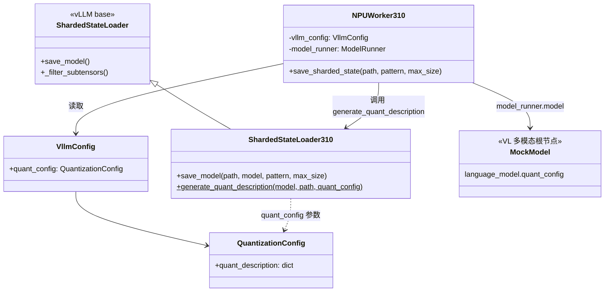
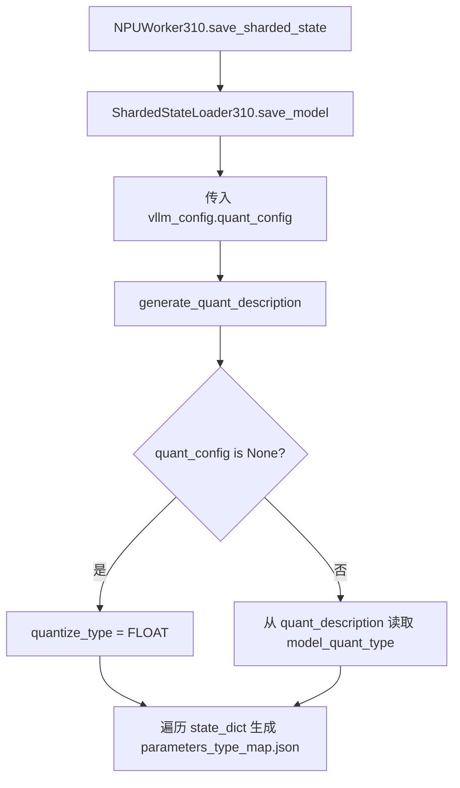
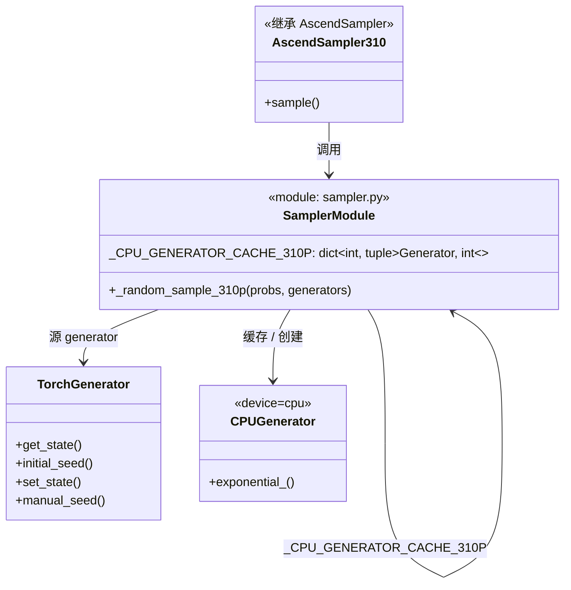
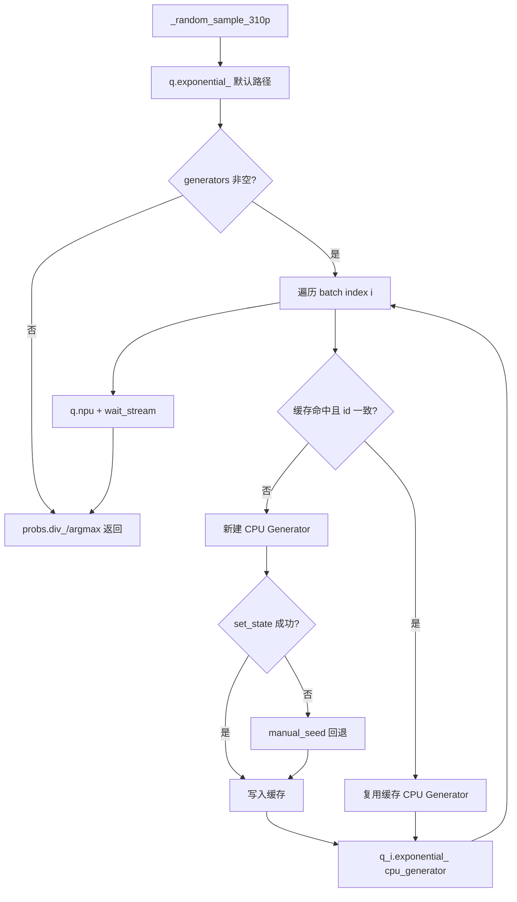
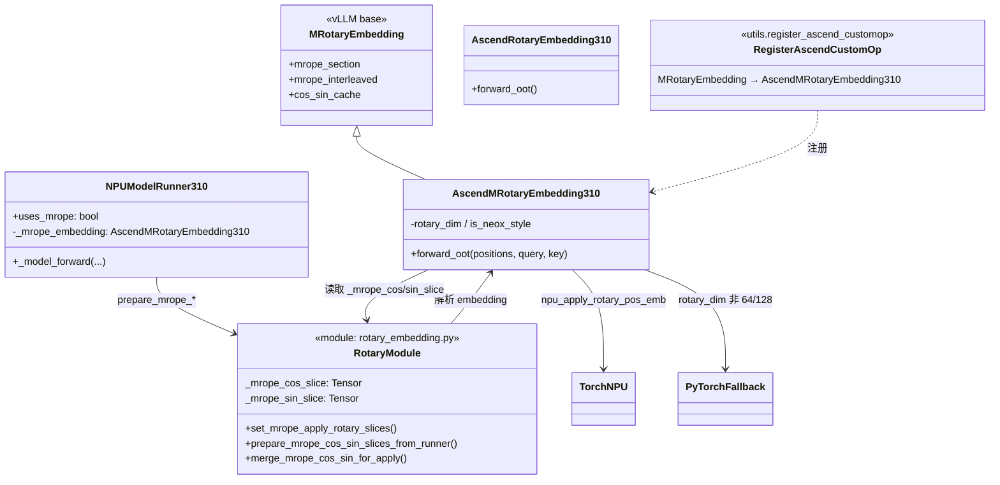
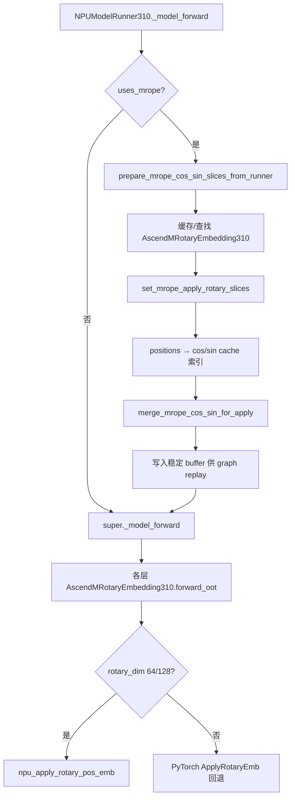
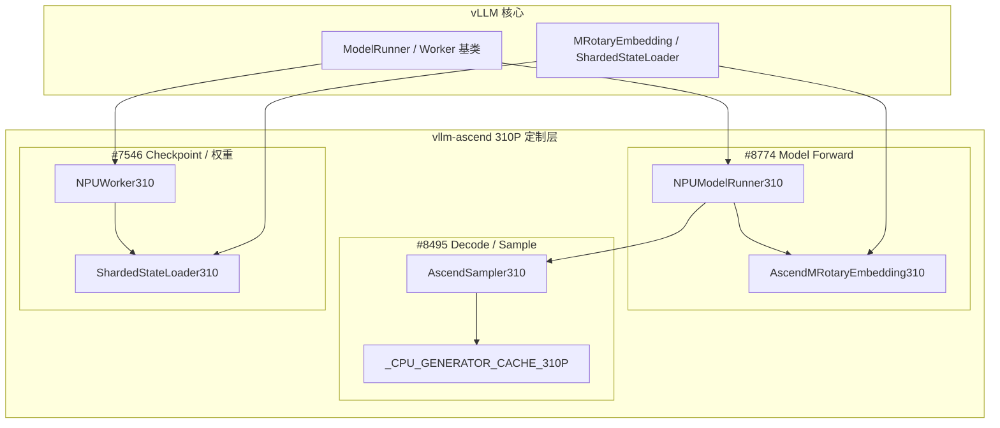
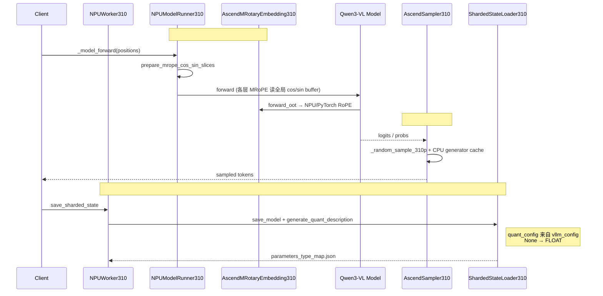

# vLLM-Ascend 310P 三 PR 设计说明

> 工程：vllm-project/vllm-ascend  
> 涉及 PR：[7546](https://github.com/vllm-project/vllm-ascend/pull/7546) · [8495](https://github.com/vllm-project/vllm-ascend/pull/8495) · [8774](https://github.com/vllm-project/vllm-ascend/pull/8774)

---

## 1. 概述

三个 PR 均针对 **310P 硬件** 的专项优化，互不直接调用，可按推理生命周期阶段理解：

| PR | 主题 | 触发阶段 |
|----|------|----------|
| #8774 | M-RoPE 缓存 + NPU forward 集成 | Prefill / Decode Forward |
| #8495 | CPU generator 缓存采样 | Token 采样 |
| #7546 | 分片状态保存 / 量化元数据 | Checkpoint 落盘（按需） |

---

## 2. PR #7546 — 分片状态保存 / 量化元数据

### 2.1 功能简述

修复 `ShardedStateLoader310` 在 VL 模型上生成权重压缩元数据的问题：VL 模型的 `quant_config` 常挂在 `language_model` 而非多模态根节点，改为由 `NPUWorker310` 从 `vllm_config.quant_config` 传入；`generate_quant_description` 支持可选 `quant_config`，`None` 时按 FLOAT 处理。

### 2.2 类图

### 2.3 流程图

### 2.4 测试

- 新增 UT：`test_generate_quant_description_no_quant_config_310`
- 更新 2 个既有用例以适配新函数签名

---

## 3. PR #8495 — 310P 采样 CPU Generator 缓存

### 3.1 功能简述

在 `exponential_` 采样中引入 CPU generator 缓存，避免直接依赖非 CPU generator 执行；缓存键为 `(batch_index, id(generator))`，状态同步失败时回退到 `initial_seed`，保证 RNG 行为与原始 generator 一致。

### 3.2 类图

### 3.3 流程图

### 3.4 测试

- 新增 `tests/ut/_310p/sample/test_sampler_310.py`，3 个 UT：
  - 缓存创建与复用
  - 状态同步失败回退 `initial_seed`
  - generator 身份变更后重建缓存

---

## 4. PR #8774 — M-RoPE 缓存与 NPU Forward 集成

### 4.1 功能简述

在 310P 上优化 M-RoPE：每次 forward 前通过 `set_mrope_apply_rotary_slices` 预计算 cos/sin 切片并写入稳定 buffer（支持 graph replay）；`AscendMRotaryEmbedding310` 在 `rotary_dim ∈ {64, 128}` 时走 `npu_apply_rotary_pos_emb`，否则 PyTorch 回退；在 `register_ascend_customop` 中注册 `MRotaryEmbedding → AscendMRotaryEmbedding310`。

### 4.2 类图

### 4.3 流程图

### 4.4 测试

- 新增 `tests/ut/_310p/ops/test_rotary_embedding_310.py`，2 个 UT：
  - 全局 cos/sin buffer 填充
  - buffer 地址复用（graph replay）

---

## 5. 整体架构 — 三 PR 在 310P 链路中的位置

三个 PR **互不直接调用**，同属 `vllm_ascend._310p` 在不同阶段的专项优化。

### 5.1 模块关系图

### 5.2 端到端时序图

---

## 6. 设计文档章节建议

| 章节 | 内容 |
|------|------|
| 背景 | 310P 上 VL 推理的三类问题：M-RoPE 性能、采样 RNG、分片保存量化元数据 |
| #8774 | 类图 + forward 前切片缓存；buffer 稳定地址与 graph replay |
| #8495 | 类图 + 缓存键 `(index, id(generator))`；CPU/NPU generator 解耦 |
| #7546 | 类图 + `quant_config` 注入链；VL 模型 config 挂载点差异 |
| 整体 | 第 5 节架构图 + 时序图；三 PR 正交、可独立合入 |
| 测试 | 7546: 1 新增 + 2 更新；8495: 3 UT；8774: 2 UT |

---

## 7. 关键源码路径

| PR | 功能代码 | 测试代码 |
|----|----------|----------|
| #7546 | `vllm_ascend/_310p/sharded_state_loader_310p.py` `vllm_ascend/_310p/worker_310p.py` | `tests/ut/_310p/test_sharded_state_loader_310p.py` |
| #8495 | `vllm_ascend/_310p/sample/sampler.py` | `tests/ut/_310p/sample/test_sampler_310.py` |
| #8774 | `vllm_ascend/_310p/ops/rotary_embedding.py` `vllm_ascend/_310p/model_runner_310p.py` `vllm_ascend/utils.py` | `tests/ut/_310p/ops/test_rotary_embedding_310.py` |

---

*文档生成说明：Mermaid 图可在 [Mermaid Live Editor](https://mermaid.live) 中渲染为 PNG/SVG 后插入 Word / Confluence。*
