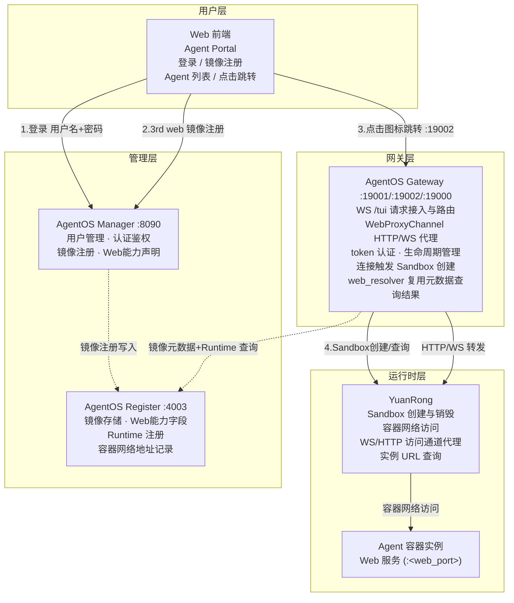
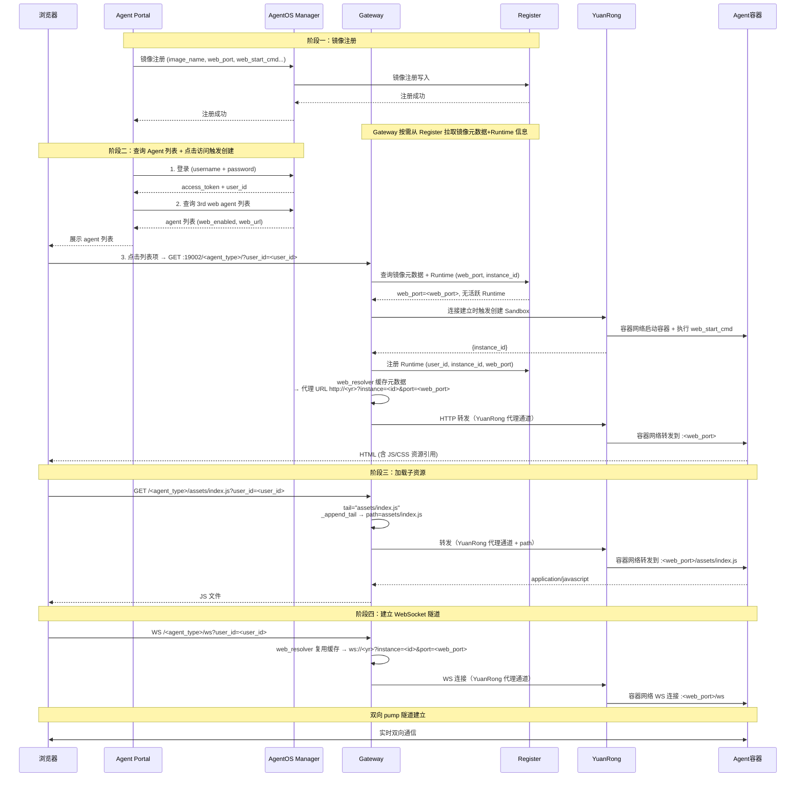

# AgentOS Web 直通方案设计文档

## 1. 背景与目标

### 1.1 背景

AgentOS 平台通过 YuanRong 容器管理 3rd agent 运行时。部分 3rd agent（如 OpenClaw）在容器内运行 Web 服务（HTTP + WebSocket），需要从外部浏览器直接访问。

当前已实现的 Web Proxy 通道（详见 [design-agent-web-channel.md](./design-agent-web-channel.md)）解决了 **Gateway 层的 HTTP/WS 代理转发** 问题，但缺少完整的端到端方案：

- 镜像注册阶段无法声明 Web 服务能力（端口、启动方式）
- Sandbox 创建阶段无法自动暴露 Web 端口
- 用户访问阶段缺少统一的入口前端
- 各组件间缺少端到端的 Web 服务元数据贯通

### 1.2 目标

- **端到端贯通**：从镜像注册 → Sandbox 创建 → 用户访问，Web 服务元数据全程传递
- **声明式注册**：镜像注册时声明 Web 服务端口、启动命令
- **自动启动**：Sandbox 创建后自动启动 Web 服务，无需手动配置
- **统一入口**：Web 前端提供登录、Agent 列表、一键访问
- **双协议代理**：支持 HTTP 请求转发，WebSocket 通过 HTTP 升级建立
- **零侵入**：不修改 agent 容器内的服务逻辑

### 1.3 关联文档

- [design-agent-web-channel.md](./design-agent-web-channel.md) — WebProxyChannel 详细设计（HTTP/WS 代理实现、路由、SPA 兼容等）

***

## 2. 整体架构

### 2.1 组件关系图



### 2.2 端到端数据流



***

## 3. 组件需求分解

### 3.1 AgentOS Manager

**职责**：用户管理、认证鉴权、3rd agent 镜像注册与管理

> 本节仅列出本次需求的新增部分；用户管理、认证鉴权（`/api/v1/auth/login`、`/api/v1/auth/verify`）为 Manager 存量能力，不再赘述。

#### 3.1.1 镜像注册功能增强

**需求**：镜像注册时支持声明 Web 服务能力

- 注册请求中支持携带 Web 服务能力声明，涵盖：容器内 Web 服务监听端口、Web 服务启动命令
- 协议不需要单独声明：统一为 HTTP，WebSocket 通过 HTTP 升级（Upgrade）建立
- 未声明 Web 能力的镜像按存量流程注册，行为不变

> 具体接口定义与字段/表设计不在本次设计范围内。

#### 3.1.2 镜像元数据存储与查询

**需求**：Manager 将镜像 Web 服务能力元数据写入 Register，Gateway 按需从 Register 拉取

- Manager 注册镜像时将 Web 能力字段写入 Register（不直接下发 Gateway）
- Gateway 在 :19002 Web 代理连接建立时按需从 Register 查询镜像元数据
- 元数据包含 Web 服务字段，用于：
  - Sandbox 创建时无需主机端口映射，YuanRong 通过容器网络访问 `<web_port>`
  - Sandbox 创建后自动启动 Web 服务（使用 `web_start_cmd`）
  - Manager 的 Agent 列表查询响应中标注 agent 是否支持 Web 访问

#### 3.1.3 Agent 列表查询

**需求**：为 Web 前端提供 3rd web agent 列表查询

- Portal 登录后直接调用 Manager 查询 agent 列表（不再经 Gateway WS `3rdagent.list`）
- 响应包含 `agent_type`、`image_name`、`web_enabled`、`web_url` 字段
- 基于 `user_id` 过滤，仅返回该用户可用的 agent

***

### 3.2 AgentOS Register

**职责**：3rd agent 镜像注册存储、Agent Runtime 注册管理

#### 3.2.1 镜像存储扩展

**需求**：镜像元数据支持存储 Web 服务能力声明

- 存储镜像时记录其 Web 服务能力声明（端口、启动命令）
- 未声明 Web 能力的镜像按存量流程存储，行为不变

#### 3.2.2 镜像查询

**需求**：支持按 Web 能力过滤查询镜像

- 支持按「是否具备 Web 能力」过滤查询镜像列表与详情
- 查询结果需包含 Web 能力声明，供 Gateway 在 :19002 连接建立时按需拉取

#### 3.2.3 Agent Runtime 注册

**需求**：Runtime 注册时记录 Web 访问信息

- Runtime 创建后注册到 Register，记录实例归属（用户、agent 类型）与 Web 访问定位信息（容器内 Web 端口、YuanRong 代理访问 URL）及运行状态
- 状态涵盖创建中 / 运行中 / 已停止

> 具体表结构、接口定义与字段设计不在本次设计范围内。

***

### 3.3 AgentOS Gateway

**职责**：Agent 请求接入、路由转发、认证鉴权、Agent Runtime 生命周期管理

#### 3.3.1 WebProxyChannel（已实现）

详见 [design-agent-web-channel.md](./design-agent-web-channel.md)

- 监听 19002 端口，HTTP/WS 双协议代理
- 通过 `web_resolver` 查询上游 URL
- 支持 SPA 兼容（301 重定向、Referer 兜底、子路径转发）
- 支持 SSE 流式响应

#### 3.3.2 web\_resolver 实现

**需求**：`AgentOSRouterClient.resolve_web_endpoint` 实现 WebResolver 接口

```python
async def resolve_web_endpoint(
    self, user_id: str, agent_type: str, protocol: str
) -> str | None:
    """查询用户的 agent 实例 Web 访问 URL

    复用连接建立时查询的镜像元数据 + Runtime 信息，无需重复查询 Register

    1. 从缓存的镜像元数据获取 web_port（连接建立时已查询）
    2. 从缓存的 Runtime 信息获取 instance_id（Sandbox 创建后已记录）
    3. 若无活跃 Runtime → 触发 Sandbox 创建（详见 3.3.3）
    4. 根据 protocol 返回 YuanRong 代理 URL（ws:// 或 http://）
    """
```

**查询逻辑**：

```
web_resolver 在 :19002 连接建立时触发，复用同一次查询的元数据：

1. 镜像元数据（首次连接时从 Register 查询并缓存）: web_port, web_start_cmd
2. Runtime 信息（Sandbox 创建 + Runtime 注册后缓存）: instance_id
3. 根据 protocol 返回 YuanRong 代理 URL:
   - protocol=="ws"  → "ws://<yr_host>?instance=<id>&port=<web_port>"
   - protocol=="http" → "http://<yr_host>?instance=<id>&port=<web_port>"
4. 若缓存中无活跃 Runtime（Sandbox 未创建） → 触发创建流程（3.3.3），
   创建失败或超时 → 返回 None
```

**缓存机制**：

- :19002 连接建立时查询 Register 获取镜像元数据，结果缓存在 `AgentOSRouterClient` 实例中
- YuanRong 返回 `instance_id` 后，一并写入缓存
- 后续请求直接从缓存读取，避免对 Register 的重复查询
- 缓存按 `user_id + agent_type` 维度隔离

#### 3.3.3 连接触发 Sandbox 创建

**需求**：:19002 连接建立时，若用户无活跃 Runtime，自动触发 Sandbox 创建（不再依赖 `3rdagent.switch` 命令）

```
触发流程（首次访问 GET :19002/<agent_type>/?user_id=<uid>）:

1. web_resolver 发现无活跃 Runtime
2. 从 Register 查询镜像元数据，获取 web_port
3. 调用 YuanRong 创建 Sandbox（无需指定 web_port，无需主机端口映射）
4. YuanRong 启动容器 + 执行 web_start_cmd
5. YuanRong 返回 {instance_id}
6. Gateway 向 Register 注册 Runtime (user_id, agent_type, instance_id, web_port)
7. 写入缓存，继续完成本次 HTTP/WS 转发（经 YuanRong 代理通道）
```

**并发控制**：

- 同一 `user_id + agent_type` 的并发首次请求，仅触发一次创建（加锁去重）
- 创建期间的其他请求等待创建完成或返回 503（含 Retry-After）

#### 3.3.4 认证鉴权

**需求**：WS /tui 连接的 token 认证

- `on_connect` 钩子调用 `AgentOSAuthenticator.authenticate()`
- Token 提取优先级：`?token=xxx` > `Authorization: Bearer xxx` > `X-Token: xxx`
- 认证失败返回 `1008 (policy violation) unauthorized`
- 认证成功返回 `AuthResult(success=True, user_id=xxx)`

#### 3.3.5 Agent Runtime 生命周期管理

**需求**：基于用户的 Runtime 创建、查询、销毁

| 操作   | 触发条件                     | 说明                                 |
| ---- | ------------------------ | ---------------------------------- |
| 创建   | :19002 连接建立（无活跃 Runtime） | 调用 YuanRong 创建 Sandbox（容器网络访问）     |
| 查询   | `web_resolver`           | 查询 Runtime 的 Web URL               |
| 销毁   | 用户退出 / 超时                | 调用 YuanRong 销毁 Sandbox             |

***

### 3.4 YuanRong

**职责**：Agent Runtime Sandbox 管理、容器网络访问、访问通道代理

> 本节仅列出本次需求相关部分，Sandbox 创建、容器网络访问、Web 服务自动启动均为已有功能，不再赘述。

#### 3.4.1 访问通道代理

**需求**：提供 WS/HTTP 访问通道代理（YuanRong Serverless 风格），作为 Gateway 访问容器的唯一通道

- YuanRong 收到代理请求后，通过容器网络转发到容器内 Web 服务
- WebProxyChannel 的 `_append_tail()` 已支持该代理 URL 格式

> 具体接口定义与字段设计不在本次设计范围内。

***

### 3.5 Web 前端

**职责**：3rd Web 镜像注册入口、3rd web agent 统一访问入口

本节分为两部分：镜像注册等管理能力扩展（基于已有 AgentOS Manager Portal 扩展）、3rd web agent 访问（两种备选方案）。

#### 3.5.1 管理能力扩展（基于已有 AgentOS Manager Portal 扩展）

**3rd Web 镜像注册**：

- 管理员登录 Manager Portal 后，通过表单提交 3rd Web 镜像注册
- 调用 `POST /api/v1/images/register`（AgentOS Manager）
- 请求头携带 `Authorization: Bearer <token>`
- 表单字段与 Manager 镜像注册接口对齐：
  - `image_name`、`agent_type`、`framework`、`framework_version`
  - `web.enabled`、`web.port`、`web.start_cmd`
- 注册成功后刷新 Agent 列表

#### 3.5.2 3rd web agent 访问

**备选方案**：

1. **基于已有 AgentOS Manager Portal 扩展**：在 Manager Portal 中新增 Agent 列表页与访问入口，复用其登录态与页面框架，同源访问无 CORS 问题
2. **新增独立的 Web Portal（Agent Portal）**：独立部署的轻量前端，包含登录页面（调用 Manager `POST /api/v1/auth/login`，存储 `token` + `user_id`）；跨域请求 Manager API 需通过代理转发或与 Manager 同源部署

两种方案均需提供以下能力：

**Agent 列表**：

- 登录后调用 AgentOS Manager 查询 3rd web agent 列表（`GET /api/v1/images?web_enabled=true&user_id=<uid>`）
- 请求头携带 `Authorization: Bearer <token>`
- 展示 Agent 卡片：图标 + 名称 + 框架版本 + Web 能力标识
- 仅 `web_enabled=true` 的 agent 可点击跳转

**点击跳转**：

- 点击 Agent 图标 → 新窗口打开 `http://<gateway>:19002/<agent_type>/?user_id=<uid>`
- Gateway 在连接建立时自动触发 Sandbox 创建（若无活跃 Runtime），无需前端调用 switch
- Gateway WebProxyChannel 代理到 Agent 容器的 Web 服务

***

## 4. 组件改造清单

| 组件                   | 改造项                             | 优先级 | 说明                                             |
| -------------------- | ------------------------------- | --- | ---------------------------------------------- |
| **AgentOS Manager**  | 镜像注册功能增强                        | P0  | 注册请求支持 Web 能力声明（`web_port`、`web_start_cmd`）    |
| <br />               | 镜像元数据写入 Register                | P0  | 注册时写入，Gateway 按需拉取，不直接下发                       |
| <br />               | Agent 列表查询                      | P1  | 为 Web 前端提供 3rd web agent 列表（按 Web 能力过滤）        |
| **AgentOS Register** | 镜像存储扩展                          | P0  | 存储 Web 能力声明（端口、启动命令）                           |
| <br />               | 镜像查询支持 Web 过滤                   | P1  | 支持按 Web 能力过滤，供 Gateway 连接建立时按需拉取               |
| <br />               | Runtime 注册记录 Web 访问信息           | P1  | 记录实例归属、容器内 Web 端口、YuanRong 代理 URL 及状态          |
| **AgentOS Gateway**  | WebProxyChannel                 | -   | 已实现（详见关联文档）                                    |
| <br />               | web\_resolver 实现                | P0  | 查询 Register + 缓存，返回 YuanRong 代理 URL            |
| <br />               | 连接触发 Sandbox 创建                 | P0  | :19002 连接建立时自动创建（替代 switch 命令），含并发控制           |
| <br />               | Runtime 生命周期管理                  | P1  | 退出/超时销毁 Sandbox 并注销 Runtime                    |
| **YuanRong**         | 访问通道代理                          | P0  | Gateway 访问容器的唯一通道，容器网络转发到容器内 Web 服务            |
| <br />               | Sandbox 创建 / 容器网络访问 / Web 服务自动启动 | -   | 已有功能                                           |
| **Web 前端**           | 3rd Web 镜像注册                    | P1  | 基于已有 Manager Portal 扩展，注册表单调用 Manager 注册接口     |
| <br />               | 3rd web agent 访问入口              | P1  | Agent 列表 + 点击跳转（Manager Portal 扩展或独立 Portal，二选一） |

***

## 5. 约束与限制

1. **前提条件**：`gateway.agent_client.type` 必须为 `agentos_router`
2. **镜像注册**：Web 服务能力声明是可选的，未声明的镜像不影响现有流程
3. **容器访问**：Gateway 经 YuanRong 代理通道访问容器（容器网络直连），不占用主机端口
4. **认证**：WS 连接需要 token 认证（从 `?token=xxx` 提取）
5. **CORS**：Agent Portal 跨域请求需代理转发或同源部署
6. **协议**：容器 Web 服务统一以 HTTP 暴露，WebSocket 通过 HTTP 升级建立
7. **Sandbox 生命周期**：用户退出或超时未使用时自动销毁 Sandbox
8. **并发限制**：同一用户同一 agent\_type 仅允许一个活跃 Sandbox

