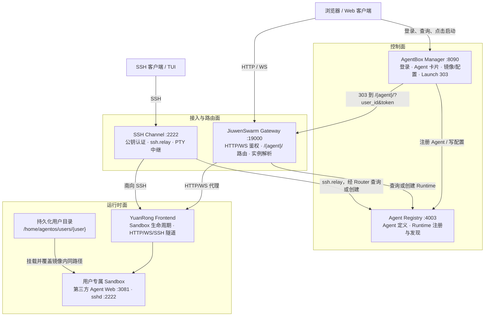
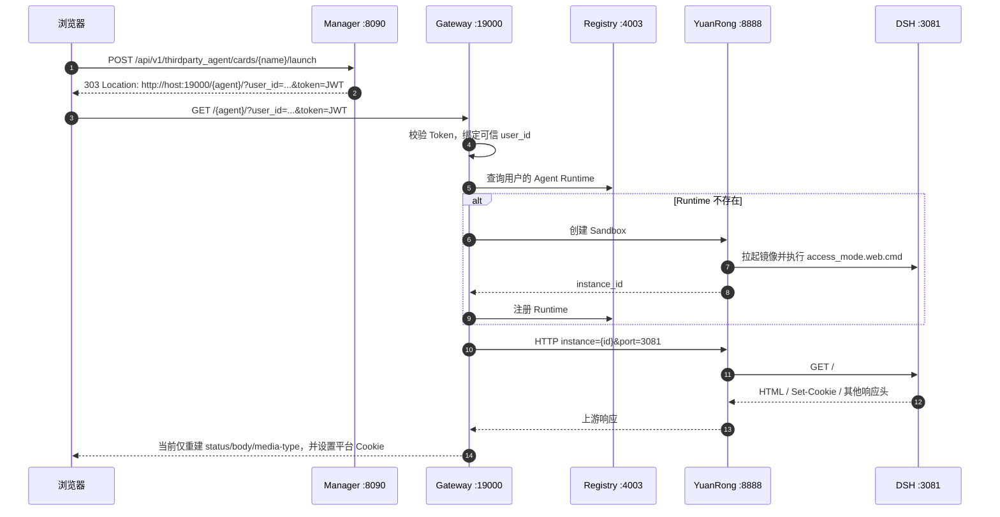
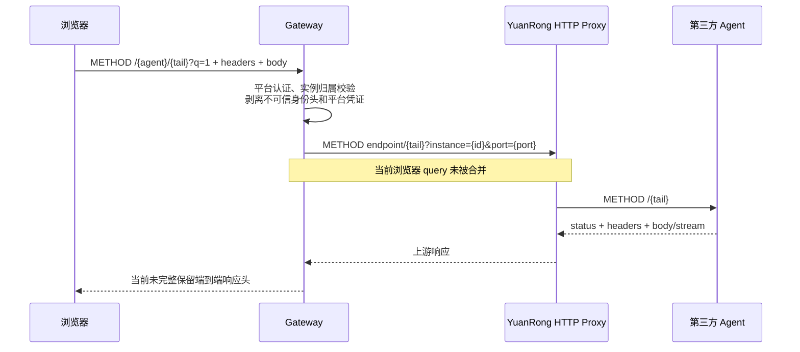
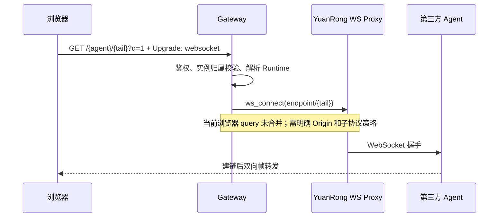
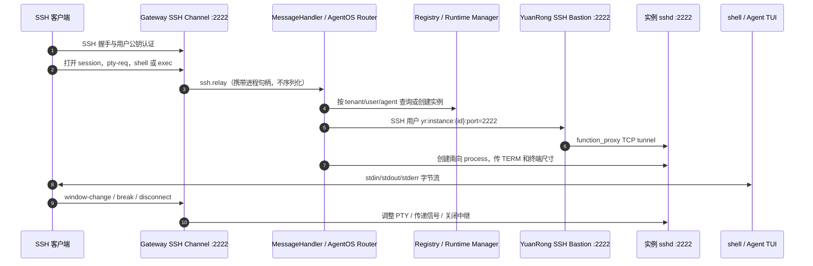
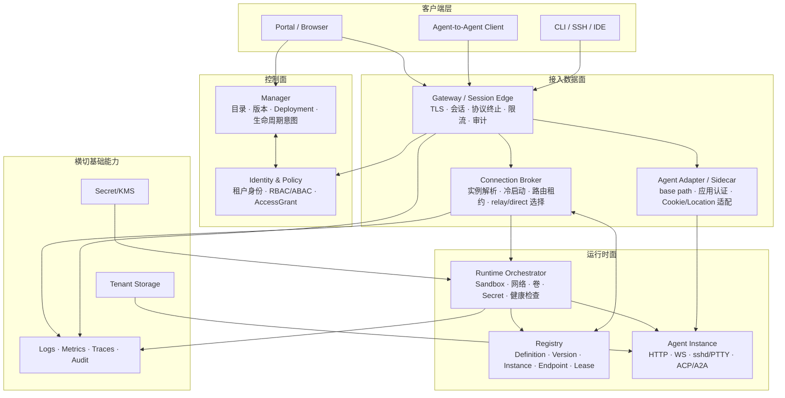
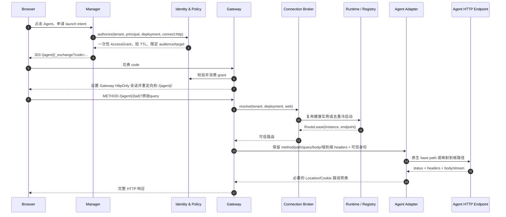
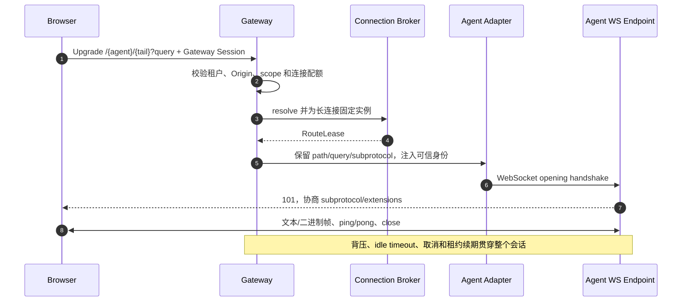
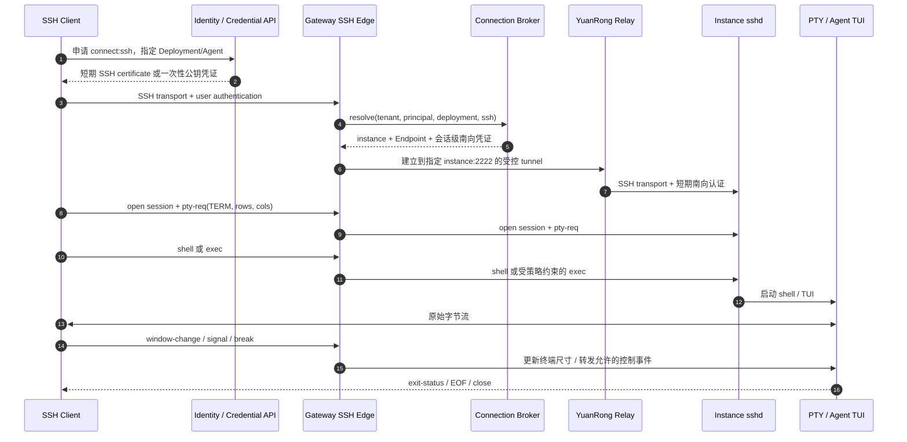

# 第三方 Agent 接入架构：现状、协议边界与理想模型

## 1. 结论与设计目标

设计目标已经足够清晰，可以进入架构设计。本文将其收敛为五点：

1. 保留多租户，任何实例、路由、会话、密钥和审计记录都必须归属于明确的租户和主体。
2. 保留 Gateway 规定的公开接入路径 `/{agent}/...`，不以改成独立域名或独立端口作为前提。
3. 对第三方 Agent 同时支持 HTTP、WebSocket，以及 SSH 进入实例后分配 PTY 的原生 TUI 体验。
4. Manager 负责控制面；请求数据流在首次授权后不再经过 Manager。
5. 平台提供稳定的接入契约，不再为每个第三方 Agent 持续注入前端补丁。

这里唯一需要消除歧义的是“Agent 直连”。本文把它拆成两个层次：

- **必选的逻辑直连**：客户端的数据流不经过 Manager，由 Gateway 直接连接目标实例；这是默认模式。
- **可选的网络直连**：Gateway 完成授权后，客户端凭短期凭证直接连接实例或节点中继；这是后续性能优化，不能绕过租户隔离和审计。

因此，终态不是让 Manager 或 Gateway 二选一，而是明确分工：**Manager 管“谁可以使用什么”，Gateway 管“这次连接如何安全、完整地到达实例”**。

本文不定义具体数据库表、API 字段名称和部署编排实现；它定义概念模型、责任边界、协议不变量和演进顺序。

## 2. 当前架构

### 2.1 现场快照

以下内容来自 2026-09-21 对 `118.195.209.130` 的只读核对以及当前 `AgentBox-Manager` 分支。端口是这套部署的现场值，不应固化为平台协议常量。

| 组件 | 当前地址或版本 | 当前作用 |
|---|---|---|
| AgentBox Manager | 对外 `http://118.195.209.130:8090`，镜像 `agentos-control-panel:26.2.0-20260921` | 用户、镜像、Agent 卡片、启动入口、用户配置 |
| JiuwenSwarm Gateway | 对外 `http://118.195.209.130:19000`，监听 `10.206.0.13:19000`，`jiuwenswarm 0.2.4b4` | Web/WS 接入、认证、实例解析和代理 |
| Gateway SSH Channel | 对外 `118.195.209.130:2222` | SSH 北向接入和 PTY 字节流中继 |
| Agent Registry | `10.206.0.13:4003`，`a2x-registry 0.3.3` | Agent 定义和 Runtime 注册/发现 |
| YuanRong Frontend | `10.206.0.13:8888`，`openyuanrong 9.9.9` | Sandbox 生命周期与 HTTP/WS 代理通道 |
| YuanRong SSH Bastion | `:2222` | 按实例和端口建立南向 TCP/SSH 隧道 |
| DSH Runtime | `dsh:0.1.5-rc.2`，Web `:3081` | 第三方 Agent Web 服务；实例内另有 sshd 接入能力 |

当前 Manager 分支为 `feature/thirdparty-access-mode-image`。远端 Gateway 的 `web_proxy_connect.py` 存在现场热补丁：为规避 YuanRong Frontend 在复用连接时第二个请求返回空 404，HTTP client 临时使用 `TCPConnector(force_close=True)`。该修改尚不能视为正式产品能力。

当前对外 Web 入口仍是明文 HTTP，主机 `:80` 未提供统一入口。生产终态应在 Gateway/Ingress 终止 TLS，并避免继续把可复用 Token 放在 query 中。

### 2.2 当前组件职责



| 层 | 当前实际职责 | 不应承担的职责 |
|---|---|---|
| Manager | 登录、用户和租户管理、Agent/镜像元数据、`access_mode`、用户配置、生成启动跳转 | 代理 HTTP/WS/SSH 数据流；理解第三方页面内部 URL |
| Registry | 保存 Agent 定义、版本、Runtime 和实例定位信息 | 处理用户协议流量；替代鉴权策略引擎 |
| Gateway | 接收公开请求、认证、按用户和 Agent 解析实例、按协议转发 | 保存第三方 Agent 的业务状态；用 Agent 专属补丁污染通用代理 |
| YuanRong | 创建和销毁 Sandbox，提供到实例端口的代理/隧道 | 决定用户是否有权访问某实例 |
| Agent 镜像 | 启动服务，声明端口，提供 HTTP/WS/SSH 能力 | 猜测平台路由；持有平台长期凭证 |
| DSH 兼容插件 | 当前承担根路径、前端 URL 和 DSH 自身认证的临时适配 | 成为长期、不可测试的通用反向代理 |

### 2.3 当前 Web 启动链路



当前 Manager 的 launch URL 是 Gateway 要求的接入方式，本文不建议改变 `/{agent}/...` 这一公开路由。问题在于路由后的协议语义还不完整：

- Gateway 的 `_append_tail()` 保留 YuanRong endpoint 自带的 `instance`、`port` 查询参数，但不合并浏览器原始 query。
- Gateway 会剥离浏览器的 `Cookie`、`Authorization`、`X-Token` 和伪造的转发头，再注入 `X-Forwarded-User`。防止凭证泄漏的方向正确，但没有同时建立可用的上游会话契约。
- HTTP 响应目前只回传 body、status 和 media type，上游 `Set-Cookie`、`Location`、ETag、缓存与流式相关响应头会丢失。
- Manager 的 303 带 `Referrer-Policy: no-referrer`，而 Gateway 又把 Referer 中的 Token 当作首批子资源的兜底认证来源，两者相互矛盾。
- Token 暴露在 URL 中，可进入浏览器历史、访问日志或监控标签；它不应是终态的浏览器会话方案。

### 2.4 当前 HTTP 子请求链路



DSH 当前把部分 RPC 基址解析为 `location.origin`，并生成根路径 `/plugins/??...`，因此浏览器会请求 `/api/...` 或 `/plugins/...`，绕开 Gateway 的 `/{agent}/` 路由。镜像里的 HTML/Fetch/XHR/WS/启动图重写可以临时补洞，但无法穷举 Service Worker、动态 `import()`、绝对 URL、重定向和未来版本新增的 URL 生成点。

### 2.5 当前 WebSocket 链路



WebSocket 不是“HTTP 转发成功以后自然就会正确”的附属能力。握手阶段仍要保留目标 path/query、`Origin`、Cookie/会话和 `Sec-WebSocket-Protocol`；建链后还要正确处理文本/二进制帧、fragment、ping/pong、close code、背压和连接取消。

### 2.6 当前 SSH 到实例 PTY 链路

当前实现不是简单的端口映射，而是两段 SSH 加 YuanRong 实例隧道：



这个模型与 SSH Connection Protocol 的语义一致：先打开 `session` channel，再请求 `pty-req`，随后请求 `shell` 或 `exec`，终端尺寸变化通过 `window-change` 传递。Gateway 可以审计“谁在何时连接了哪个实例”，但默认不应解析或改写 TUI 字节流。

当前南向使用部署机 `/root/.ssh` 下的 key，实例通过只读挂载的 `authorized_keys` 接受它。它能工作，但共享、长期有效的后台私钥扩大了泄漏半径，理想模型应改为实例级或会话级短期凭证。

### 2.7 当前根因与责任归属

| 问题 | 根因 | 第一责任层 | 说明 |
|---|---|---|---|
| `/api`、`/plugins` 绕过前缀 | 第三方应用假设部署在 origin 根路径 | Agent Adapter / Agent 上游 | Gateway 保留 `/{agent}/`；兼容应集中在边界层，原生 base path 最佳 |
| 浏览器 query 丢失 | Gateway 把路由 endpoint query 当成完整上游 query | Gateway | 需要无损合并并保留重复参数和顺序 |
| DSH Cookie 无法闭环 | Gateway 剥离请求 Cookie，又丢弃上游 `Set-Cookie` | Gateway + Adapter | 平台 Cookie 与应用 Cookie 必须分命名空间和信任边界 |
| 重定向、缓存、SSE 不完整 | Gateway 重建响应时丢掉端到端语义 | Gateway | 反向代理必须定义完整 HTTP 契约 |
| 第二次 keep-alive 请求空 404 | YuanRong Frontend 的连接复用缺陷 | YuanRong | Gateway `force_close` 只能临时止血 |
| Token/Referer 契约冲突 | Manager 禁止 Referer，Gateway 又依赖 Referer 兜底 | Gateway 为主，Manager 配合 | 终态应改成一次性授权码换 Gateway 会话 |
| 镜像反复踩 UID、目录、依赖坑 | 平台镜像契约未显式化 | Runtime/镜像工厂 | 需形成可校验的 AgentVersion/Endpoint 契约 |
| 现场包直接热修 | 发布和回滚链路不完整 | Gateway/YuanRong 工程体系 | 修复必须回到源码、版本、测试和制品 |

就当前 DSH 穿刺而言，改造重心约为：**Gateway 55%～60%，Agent Adapter 或 DSH 上游 25%～35%，Manager 10%～15%**。这不是说 Manager 不重要，而是它不应吸收数据面问题。

## 3. 理想概念模型

### 3.1 核心对象

| 对象 | 关键含义 |
|---|---|
| `Tenant` | 资源、策略、密钥、配额和审计的最高隔离域 |
| `Principal` | 用户、服务账号或 Agent 身份；始终与 `tenant_id` 组合使用 |
| `AgentDefinition` | 稳定的 Agent 产品定义，如 DSH、OpenCode；不绑定具体镜像版本 |
| `AgentVersion` | 不可变制品及运行契约，包含镜像 digest、启动命令、运行用户、挂载和 EndpointSpec |
| `EndpointSpec` | 一个可访问能力的声明：协议、容器端口、路径模式、认证模式和特性 |
| `Deployment` | 某租户允许使用哪个 AgentVersion，以及配额、共享和持久化策略 |
| `AgentInstance` | 某次实际运行的 Sandbox；具有 owner、状态、节点、租约和健康信息 |
| `AccessPolicy` | 谁能对哪个 Deployment/Instance 执行 launch、connect、exec、admin |
| `AccessGrant` | Manager/IAM 签发的短期、窄范围、可一次性兑换的接入凭证 |
| `GatewaySession` | AccessGrant 兑换后的边缘会话；绑定主体、租户、Agent 和允许协议 |
| `RouteLease` | Endpoint 到健康实例的短期映射；带版本和过期时间，避免永久脏路由 |
| `Connection` | 一条 HTTP request、WS session 或 SSH session 的运行态对象和审计单位 |

最重要的建模变化是：`access_mode` 不再只是“名称 + 端口 + 启动命令”，而是可验证的 `EndpointSpec`；用户身份也不再通过 URL 中可长期使用的 JWT 传给每个组件。

### 3.2 分层模型



### 3.3 每层需要解决的问题

#### 客户端与 Portal

- 展示 Agent 目录、版本、状态和授权结果。
- 向 Manager 申请 launch intent，不自行拼接长期 Token。
- HTTP/WS 使用 Gateway 会话；SSH 使用短期证书、公钥或一次性连接凭证。
- 不知道实例 IP、容器端口和 YuanRong 内部 URL。

#### Manager：控制面

- 管理 Tenant、Principal、AgentDefinition、AgentVersion、Deployment 和策略。
- 校验用户是否可以 launch/connect，签发短期 AccessGrant。
- 接收“创建、停止、升级”意图并查询结果；不承载 HTTP/WS/SSH 字节流。
- 对 EndpointSpec、镜像 digest、运行用户、挂载和依赖做发布前校验。

#### Identity & Policy

- 统一认证用户、服务和 Agent 身份。
- 在 `tenant_id + principal_id + resource + action` 上做授权。
- AccessGrant 包含明确的 audience、目标、协议、scope、过期时间和唯一 ID。
- 支持吊销、重放防护和短期凭证兑换，不把平台主会话 Token 下发给第三方 Agent。

#### Gateway / Session Edge

- 对外终止 TLS、HTTP、WebSocket 和 SSH，建立统一 GatewaySession。
- 消费或兑换 AccessGrant，删除 URL 中的敏感凭证，再用 HttpOnly Cookie 或协议会话维持登录态。
- 根据协议保持语义完整，执行租户级限流、连接数、带宽和超时策略。
- 剥离客户端伪造的身份头，只向可信 Adapter 注入经过签名或 mTLS 保护的身份上下文。
- 记录连接元数据和错误分层，不保存第三方 Agent 的业务状态。

#### Connection Broker

- 将 `(tenant, principal, deployment, endpoint)` 解析为健康 AgentInstance。
- 去重冷启动，等待 readiness，维护 RouteLease，并防止实例销毁与活动连接竞争。
- 为 HTTP request、WS session、SSH session 选择 relay 或可选 direct 模式。
- direct 失败时可安全回退 relay；客户端永远不能指定任意上游 URL。

#### Registry

- 保存声明事实：定义、版本、EndpointSpec、实例、健康状态和租约。
- 所有主键和查询都带 `tenant_id`；Instance 状态由 Runtime 负责更新。
- 不承担流量代理，也不把 Registry 中的 owner 字段当作唯一授权判断。

#### Agent Adapter / Sidecar

- 在 Gateway 保持通用的前提下，集中处理第三方应用差异。
- 把公开 `/{agent}/...` 映射为应用根路径或原生 base path。
- 处理必要的 `Location`、Cookie Path/Domain、HTML base 等边界转换。
- 将平台可信身份转换成应用支持的 trusted-proxy/session 机制。
- Adapter 能覆盖标准 HTTP 行为，但不应承诺可靠重写任意 JavaScript。应用支持原生 base path 时应优先使用原生模式。

#### Runtime Orchestrator / Sandbox

- 依据 AgentVersion 创建不可变 Sandbox，配置 CPU、内存、网络、卷、UID/GID、Secret 和健康检查。
- 只暴露 EndpointSpec 声明的端口，阻止跨租户网络和存储访问。
- 报告实例状态与 Endpoint readiness；不替 Gateway 做用户鉴权。
- 平台挂载覆盖哪些目录、需要哪些动态库等要求必须成为可自动检查的显式契约。

#### Secret、State 与 Observability

- Secret 通过引用和短期注入使用，不进入镜像、URL、日志或 Registry 明文。
- 用户工作区按 tenant/user/deployment 隔离，升级 AgentVersion 不覆盖持久化数据。
- trace 至少贯穿 Manager grant、Gateway connection、Broker resolve、Runtime instance 和上游请求。
- 审计记录连接元数据、授权结果和管理操作；SSH TUI 内容采集应是明确策略，而非默认旁路抓取。

## 4. 统一 Endpoint 契约

概念上，一个 AgentVersion 可以声明多个 Endpoint：

```yaml
agentVersion: dsh@0.1.5-rc.2
runtime:
  imageDigest: sha256:...
  user: agentos
  homeMount: /home/agentos
endpoints:
  - name: web
    protocol: http
    containerPort: 3081
    publicRoute: "/{agent}/"
    pathMode: native-prefix | adapter-root
    authMode: trusted-identity
    features: [websocket, sse, streaming]
    health: { path: /health, protocol: http }
  - name: tui
    protocol: ssh
    containerPort: 2222
    sessionMode: pty
    authMode: platform-ephemeral
    features: [shell, exec, window-change]
```

这段 YAML 只是概念示例。真正的契约应满足：

- `publicRoute` 由平台生成，Agent 不能覆盖其他 Agent 的路由空间。
- `pathMode=native-prefix` 表示应用自己理解 `/{agent}/`；这是首选。
- `pathMode=adapter-root` 表示 Adapter 把外部前缀映射为应用根路径；它是兼容模式。
- HTTP 与 WebSocket 可以共享一个端口，但两种能力都要显式声明和验收。
- SSH `pty`、非交互 `exec` 和纯 TCP tunnel 是不同能力，不能只用“开放 2222”代替协议声明。
- 端口、命令、探针、运行用户、挂载和依赖在发布阶段校验，不能等到用户首次连接才发现。

## 5. 理想请求链路

### 5.1 HTTP 到实例



HTTP 代理的关键不变量：

- 保留 method、原始 path、原始 query（含顺序、重复键和空值）、body、trailers 与取消信号。
- 除逐跳字段和平台凭证外，默认保留端到端请求头；响应同样保留多值头。
- `Set-Cookie` 不能折叠；平台 Cookie 与应用 Cookie 使用独立名称和受控 Path。
- `Location` 只在跨越 external prefix / internal root 时由 Adapter 重写。
- 支持流式 body、SSE、range、缓存校验和合理的 idle/total timeout。
- Gateway 移除 `Connection` 指定的逐跳字段；不能用“只复制 media type”代替 HTTP 语义。

### 5.2 WebSocket 到实例



WebSocket session 建立后必须粘在同一实例。GatewaySession 到期策略需要明确：允许现有连接在短暂宽限期内继续、主动关闭，或通过控制消息重新认证；不能悄悄把同一连接切换到另一个实例。

### 5.3 SSH 到实例 PTY



理想 SSH 模型有四条边界：

- 北向用户凭证与南向实例凭证分离，南向凭证限定 tenant、instance、endpoint 和短 TTL。
- Gateway 验证实例归属后才请求 Broker 路由；SSH username 或远程 command 只能选择允许的 Agent，不能成为越权输入。
- PTY 是 SSH `session` channel 的能力，不是普通 TCP 流。TERM、尺寸、`window-change`、signal、break、EOF 和 exit status 都要有明确语义。
- tmux 等断线恢复属于实例内应用能力；Gateway 只保证新连接能重新到达同一持久实例或显式命名的会话。

### 5.4 可选的网络直连

当延迟、带宽或 Agent-to-Agent 流量足以证明收益时，Connection Broker 可以返回一个短期 `ConnectionDescriptor`：

```text
tenant + principal + instance + endpoint + protocol
+ reachable address + server identity
+ one-time / short-lived mTLS or SSH credential
+ expires_at + nonce + allowed source/network
```

客户端随后直连节点中继或实例，Gateway 不再搬运数据，但授权、路由、凭证和审计仍由平台控制。该模式必须满足：

- 实例地址不是长期公开端口；网络策略只允许持有有效凭证的来源。
- 凭证不能访问同租户的其他实例，更不能跨租户。
- direct 建链失败可回退 Gateway relay。
- HTTP 浏览器场景受同源、Cookie 和证书约束，默认仍使用 Gateway relay；网络直连更适合 SSH、服务到服务或 Agent-to-Agent。

## 6. Manager、Gateway 与 Adapter 的责任边界

| 能力 | Manager | Gateway | Broker/Registry | Adapter | Runtime |
|---|:---:|:---:|:---:|:---:|:---:|
| Tenant、用户、Agent 目录 | 主责 | 只消费 | 存运行态索引 | 否 | 否 |
| AgentVersion / EndpointSpec 发布 | 主责 | 校验支持度 | 保存/发现 | 声明兼容能力 | 校验并执行 |
| AccessPolicy / AccessGrant | 主责 | 消费并建立会话 | 否 | 否 | 否 |
| `/{agent}/` 公开路由 | 生成入口 | 主责 | 返回目标 | 处理内外路径差异 | 否 |
| HTTP/WS/SSH 协议正确性 | 否 | 主责 | 选目标 | 应用边界适配 | 提供隧道 |
| 实例冷启动与路由租约 | 发意图/查询 | 请求 | 主责 | 否 | 执行 |
| 第三方应用 Cookie/base path | 否 | 提供通用机制 | 否 | 主责 | 否 |
| Sandbox、卷、UID/GID、网络 | 声明策略 | 否 | 记录状态 | 否 | 主责 |
| 审计 | 管理操作 | 连接操作 | 路由决策 | 适配错误 | 资源操作 |

近期修复重点应放在 Gateway，因为当前失败发生在请求/响应语义和协议边界；长期模型中 Manager 仍需升级为真正的控制面，提供 EndpointSpec、AccessGrant 和租户策略，但不要把路径重写、Cookie 转换或 PTY 中继放入 Manager。

## 7. 多租户与安全不变量

1. 每个 Registry key、cache key、route lock、session 和审计事件都包含 `tenant_id`，不能只用 `user_id + agent_type`。
2. URL 中的 `user_id` 只是路由提示，最终身份只能来自已验证会话；客户端不能用它切换 owner。
3. Gateway 在信任代理身份头前先删除所有客户端同名头，并通过 mTLS、Unix socket 或签名上下文保护 Gateway 到 Adapter 的边界。
4. Agent 实例端口默认不暴露公网；YuanRong、Gateway 与 Sandbox 之间使用网络策略限制横向访问。
5. Secret 以引用和短期租约注入。日志、redirect、query、Referer 和指标 label 中不得出现长期 Token。
6. 平台 Cookie、Agent Cookie、OAuth Token 和模型 API Key 分属不同信任域，不得原样跨域转发。
7. HTTP/WS 限制请求大小、带宽、并发连接和 idle timeout；SSH 限制会话数、认证尝试和允许的 channel 类型。
8. 管理员共享、团队实例和 Agent-to-Agent 调用都通过显式策略表达，不能依赖“同一机器上可达”。

## 8. 演进路线

### P0：先让现有链路协议正确

- Gateway 合并并无损保留浏览器 query；HTTP 与 WS 共用经过测试的 URI 组合规则。
- Gateway 代理完整的 HTTP request/response 语义，特别是多值 `Set-Cookie`、`Location`、缓存头、SSE 和 streaming。
- 明确 Gateway Cookie 与 Agent Cookie 的命名空间、Path 和转发策略。
- 修复 YuanRong keep-alive 第二请求 404；在修复发布前保留 `force_close` 作为有指标、有开关的兼容策略。
- 去掉 Referer Token 依赖，或在过渡期至少让 Manager 的 Referrer-Policy 与 Gateway 契约一致。
- 把服务器 `dist-packages` 热修回灌源码、单测、版本制品和回滚流程。

### P1：建立控制面契约

- 用 EndpointSpec 替代松散的 `access_mode`，发布时校验端口、启动命令、运行用户、挂载、依赖和探针。
- Manager 签发短期一次性 AccessGrant；Gateway 兑换后建立自己的安全会话。
- Registry、cache、lock 和 Runtime key 全部升级为 tenant-scoped。
- 为 HTTP、WS、SSH 建立统一 connection ID 和端到端 trace。

### P2：收敛第三方兼容层

- 提供标准 Agent Adapter/Sidecar，集中处理 base path、Cookie、Location 和可信身份转换。
- 推动 DSH 原生支持可配置 base path，并提供正式 trusted-proxy 身份模式。
- 当 DSH 原生能力达到验收标准后，删除 HTML/Fetch/XHR/WS/启动图等运行时补丁。
- 为不支持 base path 的 Agent 明确标记 `adapter-root`，不宣称所有 SPA 都可零侵入接入。

### P3：升级 SSH 与直连能力

- 将共享长期南向私钥替换为实例级/会话级短期 SSH certificate 或一次性 key。
- Connection Broker 统一冷启动、RouteLease、活动连接引用计数和 relay/direct 选择。
- 先在 SSH 和 Agent-to-Agent 场景试点网络直连，保留 Gateway relay 回退。

### P4：产品化与高可用

- Gateway、Broker、Registry 支持水平扩展；长连接使用租约和显式 drain，而不是隐式粘住单进程内存。
- 建立按 AgentVersion 的兼容矩阵、契约测试、金丝雀发布和自动回滚。
- 以协议级 SLO 监控首字节、流式中断、WS close reason、SSH 建链阶段和冷启动耗时。

## 9. 最小验收矩阵

| 场景 | 必测内容 |
|---|---|
| HTTP | 所有常用 method；重复 query；上传/下载；chunked/stream；SSE；range；304；重定向；多 `Set-Cookie`；取消 |
| Base path | HTML 相对资源；绝对 `/api`；动态 import；Worker/Service Worker；Location；Cookie Path；刷新深层路由 |
| WebSocket | query；Cookie；Origin；subprotocol；文本/二进制；大帧/fragment；ping/pong；背压；close code；实例销毁 |
| SSH PTY | host key；用户认证；`pty-req`；shell；exec；TERM/尺寸；`window-change`；Ctrl-C/break；stderr；exit status；断连 |
| 多租户 | 改 user_id；猜 instance_id；复用 grant；跨租户 route/cache；共享实例策略；配额和并发 |
| 生命周期 | 并发首次连接只创建一次；readiness；冷启动超时；活动连接不被回收；死实例清理；版本升级 |
| 安全 | Token 不落 URL/日志；伪造转发头；Origin/CSRF；任意上游 SSRF；Cookie 泄漏；短期凭证过期和吊销 |

## 10. 依据与参考

### 当前实现依据

| 位置 | 证据 |
|---|---|
| `AgentBox-Manager/backend/app/services/thirdparty_agent_service.py` | `build_launch_redirect()` 生成 Gateway 启动地址 |
| `AgentBox-Manager/backend/app/thirdparty_agent/launch_config.py` | 当前 Gateway 浏览器入口端口和 origin 计算 |
| `AgentBox-Manager/backend/app/api/v1/thirdparty_agent.py` | launch 303 与 `Referrer-Policy` |
| 服务器 `jiuwenswarm/.../web_proxy/web_proxy_connect.py` | 当前 Token/Cookie 鉴权、头部剥离、上游 URL 和响应重建逻辑 |
| 服务器 `jiuwenswarm/.../protocol/ssh/ssh_connect.py` | 北向 SSH Channel、`ssh.relay` 和 session 生命周期 |
| 服务器 `jiuwenswarm/.../agentos_router/ssh_relay.py` | YuanRong SSH 用户名、南向 key、PTY 创建、字节泵和终端尺寸变化 |
| 服务器 `/root/.agentos/deploy/README.md` | `frontend bastion :2222 + function_proxy tcp tunnel + public key mount` 部署契约 |

### 公开协议与上游依据

- [RFC 9110: HTTP Semantics](https://www.rfc-editor.org/rfc/rfc9110.html)：HTTP 消息、代理、逐跳字段、Location 等语义。
- [RFC 6265: HTTP State Management Mechanism](https://www.rfc-editor.org/rfc/rfc6265.html)：Cookie/Set-Cookie 与多 Set-Cookie 处理。
- [RFC 6455: The WebSocket Protocol](https://www.rfc-editor.org/rfc/rfc6455.html)：opening handshake、Origin、subprotocol 和双向帧。
- [RFC 4253: SSH Transport Layer Protocol](https://www.rfc-editor.org/rfc/rfc4253.html)：SSH 传输层和服务器身份基础。
- [RFC 4254: SSH Connection Protocol](https://www.rfc-editor.org/rfc/rfc4254.html)：session、`pty-req`、shell/exec 与 `window-change`。
- [openYuanRong 配置文档](https://docs.openyuanrong.org/en/latest/multi_language_function_programming_interface/api/yr_command_line_tool/yr_config.html)：Function Proxy 是可配置的独立组件；现场端口是部署配置而非协议常量。
- [DSH Web RPC `resolveBase()`](https://github.com/deepseek-ai/deepseek-harness/blob/master/packages/client/connection/src/client/rpc.ts#L108-L110)：当前上游使用 `location.origin` 作为浏览器 RPC 基址。
- [DSH plugin combo URL](https://github.com/deepseek-ai/deepseek-harness/blob/master/packages/client/modules/src/index.ts#L217-L224)：当前上游生成根路径 `/plugins/...`。
- [DSH trustedHosts 讨论 #397](https://github.com/deepseek-ai/deepseek-harness/discussions/397)：Host 信任与特权 API 的 loopback 限制是不同安全边界。

## 11. 与仓库现有文档的关系

- [AgentOS Web 直通方案](design-agentos-web-direct.md) 描述已有 Web Proxy 方向；本文补充现场事实、协议不变量和终态分层。
- [第三方智能体 Web 跳转鉴权方案](gateway-web-auth-design.md) 对比了现有登录态交接选项；本文把推荐方向收敛为 AccessGrant → GatewaySession。
- [第三方 Agent AgentOS 需求](../requirements/third-party-agent-agentos-requirements.md) 描述业务需求；本文将 SSH、HTTP、WS 放入统一 Endpoint/Connection 模型。
- [SSH Channel 接入](../../../knowledge/agent/integration/ssh-channel.md) 可作为 SSH 两种使用方式的基础知识入口。
