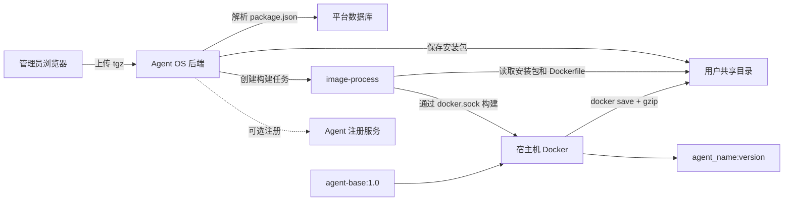
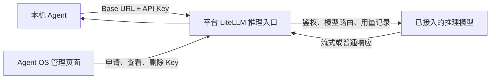
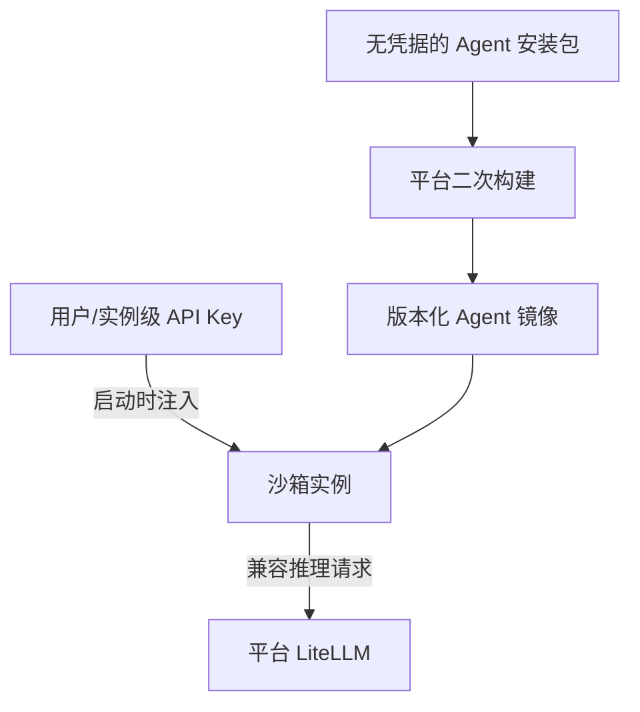

# 三方 Agent 使用与接入原理

> 本文面向 Agent OS 的使用者、Agent 软件维护者和平台管理员，说明两种已经明确的接入方式：
>
> 1. 将 CLI 型 Agent 打进平台基础镜像，形成可由平台调度的 Agent 镜像；
> 2. Agent 保持本机部署，只从平台获取 API Key 和推理服务地址。
>
> 本文以当前 `build` 分支实现为准。镜像构建链路已经落地；API Key 链路由 Agent OS 的 LiteLLM 服务提供。Gateway、SSH 透传、自动拉起实例等属于后续运行编排能力，不与“镜像构建成功”混为一谈。

## 1. 先选接入方式

| 判断项 | 方式一：平台二次构建镜像 | 方式二：本机 Agent + 平台 API Key |
|---|---|---|
| Agent 在哪里运行 | 平台管理的容器/沙箱 | 用户本机、开发机或自有服务器 |
| 平台提供什么 | 统一基础环境、Agent 可执行文件镜像、镜像制品 | 统一推理入口、API Key、模型访问和用量记录 |
| Agent 软件要求 | 可作为 CLI 运行；能够制成符合约定的 NPM 风格 `.tgz` 包 | 能配置自定义模型 Base URL 和 API Key；最好兼容 OpenAI API |
| 是否依赖 NPM 包 | 是。当前解析器要求 NPM 包目录结构和 `package.json` | 否 |
| 是否需要管理员 | 上传并构建镜像需要管理员权限 | 普通登录用户可申请自己的 Key |
| 适合场景 | 平台统一部署、隔离、分发和版本管理 | 已有本机 Agent，最快接入平台模型，不改变运行环境 |
| 主要限制 | 只能构建与构建机 OS/架构/libc 匹配的包 | Agent 的协议必须与平台暴露的推理协议兼容 |

简单选择：需要平台托管运行环境时选方式一；只想让现有 Agent 使用平台模型时选方式二。两种方式也可以组合：先制作 Agent 镜像，再在容器启动时注入平台 API Key。

---

## 2. 方式一：基于 `agent-base` 二次构建 CLI Agent 镜像

### 2.1 使用前提

构建前应确认：

- 已使用管理员账号登录 Agent OS；
- `image-process` 服务健康，并能访问宿主机 Docker；
- Docker 中已经存在 `agent-base:1.0`；
- 上传包与构建服务器的平台完全一致；
- Agent 是可以从命令行启动的自包含软件，或其运行依赖已包含在 `agent-base`/安装包中。

当前 ARM 环境的基础镜像契约为 openEuler 24.03 LTS ARM64、glibc、Python 3.11、Node.js 24，容器用户为 `agentos`，并提供监听 `2222` 端口的非 root SSH 服务。具体组件版本应以实际部署的 `agent-base:1.0` 标签为准。

### 2.2 准备安装包

当前上传接口接收 `.tgz` 或 `.tar.gz`，但包内必须是 NPM `pack` 风格：

```text
demo-agent-linux-arm64-1.2.0.tgz
└── package/
    ├── package.json
    ├── bin/
    │   └── demo-agent
    └── ...运行所需文件
```

`package/package.json` 至少包含 `name` 和 `version`，建议同时声明 `displayName` 和 `bin`：

```json
{
  "name": "@example/demo-agent-linux-arm64",
  "version": "1.2.0",
  "displayName": "Demo Agent",
  "bin": {
    "demo-agent": "bin/demo-agent"
  }
}
```

包名必须以下列平台后缀结尾：

```text
-linux-x64
-linux-arm64
-linux-x64-musl
-linux-arm64-musl
-darwin-x64
-darwin-arm64
-win32-x64
-win32-arm64
```

例如在当前 Linux ARM64 glibc 构建机上，应使用 `demo-agent-linux-arm64`，不能上传 `linux-x64` 或带 `-musl` 的包。平台会去掉平台后缀，将 `demo-agent` 作为 `agent_name`。

如果使用 NPM 工程，可在工程目录执行：

```bash
npm pack
tar -tzf demo-agent-linux-arm64-1.2.0.tgz | head
```

上传前检查：

- 归档内确实存在 `package/package.json`；
- `bin` 指向的文件存在；
- CLI 文件保留 Unix 可执行权限；
- 不把模型 API Key、SSH 私钥等凭据打进包；
- 包内包含运行时所需的 JS、原生库或其他资源，而不是只包含一个无法独立运行的软链接。

> 当前 Dockerfile 会从 `package/` 中找出具有用户可执行位的文件并复制到 `/usr/local/bin/`。如果 Agent 依赖相对目录中的其他资源，打包者必须验证安装后的目录结构，不能假设整棵 NPM 包都会原样放进全局模块目录。

### 2.3 在页面中构建

1. 打开 Agent OS，进入 `资源管理 → Agent 框架`，对应路由为 `/resources/agent/framework`。
2. 点击 **接入新框架**。
3. 拖入或选择一个 `.tgz`/`.tar.gz` 文件。
4. 平台解析完成后，核对确认框：
   - `Agent 名称`：由包名和平台后缀推导，不可编辑；
   - `版本`：来自 `package.json.version`，不可编辑；
   - `显示名称`：可修改；
   - `启动命令`：优先来自 `package.json.bin`，可修改。
5. 确认后启动构建。
6. 页面每 2 秒刷新一次进度，等待状态变为 `done`；若为 `failed`，展开错误信息排查。
7. 已上传但未完成构建的条目，可以在框架列表中再次点击 **启动构建**。

同一 `agent_name + version` 不能重复上传。升级软件时应修改 `version`，不要用同一个版本覆盖旧制品。

### 2.4 构建结果和验证

构建成功后得到：

- Docker 镜像：`<agent_name>:<version>`；
- gzip 压缩的离线镜像：`<agent_name>-<version>.tar.gz`；
- 镜像 ID、基础镜像、文件路径等构建元数据。

离线镜像保存在当前上传用户的目录：

```text
${AGENTOS_HOME_BASE}/${user_id}/images/<agent_name>-<version>.tar.gz
```

默认 `AGENTOS_HOME_BASE` 为 `/home/agentos/users`。可进行以下验证：

```bash
gzip -t <agent_name>-<version>.tar.gz
docker load -i <agent_name>-<version>.tar.gz
docker image inspect <agent_name>:<version>
docker run --rm --entrypoint <启动命令> <agent_name>:<version> --help
```

直接执行 `docker run <image>` 时，镜像继承 `agent-base` 的默认命令，当前默认行为是保持容器运行，并不会自动启动三方 Agent。页面中的“启动命令”目前是框架元数据，供后续注册和运行编排使用；手工验证时需要通过 `--entrypoint` 或显式命令启动 CLI。

### 2.5 镜像构建的完整原理



完整过程如下：

1. 后端读取归档内的 `package/package.json`，校验名称、版本、目标 OS、CPU 架构和 libc。
2. 后端把安装包写入上传用户的 `installers` 目录，并保存框架记录。
3. 用户确认后，后端创建 `build-<随机标识>` 任务并交给 `image-process`。
4. `image-process` 以 `agent-base:1.0` 为基础镜像执行 `agent.Dockerfile`，把可执行文件安装到 `/usr/local/bin`。
5. 生成的镜像命名为 `<agent_name>:<version>`。
6. 服务执行 `docker save | gzip`，把可迁移制品放入该用户的 `images` 目录。
7. 后端在用户查询任务时同步构建状态和结果到数据库。
8. 如果配置了 `AGENT_REGISTER_URL`，后端会尝试把框架、版本、镜像和运行规格注册到外部 Agent 服务；注册失败不会反向判定镜像构建失败。

后端保存任务记录；`image-process` 的实时任务记录保存在内存中，完成后默认保留 24 小时。因此不要把构建服务的内存状态当成永久制品目录，最终结果应以平台数据库和用户 `images` 目录为准。

### 2.6 为什么必须同架构构建

当前链路使用宿主机 Docker 做普通 `docker build`，没有自动启用 QEMU 或 Buildx 跨架构模拟。包解析器也会主动拒绝与构建机不一致的 OS、CPU 架构或 libc。因此：

- ARM64 包在 ARM64 构建机上构建；
- x86_64 包在 x86_64 构建机上构建；
- glibc 与 musl 包不可混用；
- 多架构版本需要分别打包、分别构建和分别保存。

### 2.7 常见失败

| 现象 | 原因 | 处理方式 |
|---|---|---|
| 上传即返回 400 | 不是 gzip tar、缺少 `package/package.json`、缺少名称/版本或包超过 500 MB | 重新执行 `npm pack` 并检查归档结构和大小 |
| 提示平台不匹配 | 包名声明的平台/架构/libc 与构建机不一致 | 换成目标平台的包或到对应架构构建机操作 |
| 返回 409 | 同版本已存在、同一版本已有活跃任务或并发已满 | 升级版本号、等待现有任务完成；系统最多同时构建 5 个任务 |
| 返回 507 | 用户目录可用空间不足 | 清理旧安装包/镜像或扩容；检查会额外预留约 50 MB |
| 构建成功但 CLI 找不到资源 | CLI 不是自包含文件，或相对路径资源没有被复制 | 调整包结构/启动脚本，或扩展 Agent Dockerfile 的安装逻辑 |
| `docker run` 没有进入 Agent | 最终镜像继承基础镜像默认命令 | 使用 `--entrypoint`；由运行编排层按元数据启动 |
| 镜像成功但平台注册不可用 | 镜像构建与外部注册是两步，注册失败不阻塞构建 | 检查 `AGENT_REGISTER_URL` 和注册服务日志 |

---

## 3. 方式二：本机部署 Agent，使用平台 API Key

这种方式不上传 Agent 软件，也不构建镜像。Agent 仍在用户本机运行，模型请求发送到 Agent OS 后面的 LiteLLM 推理入口。

### 3.1 数据流



这里有两个不同地址：

- **管理平台地址**：用于登录、申请 Key、查看 Key 和用量；
- **推理服务 Base URL**：供 Agent 发起模型请求，通常以 `/v1` 结尾。

不能把管理页面 URL 直接当作 Agent 的 Base URL。实际推理地址和可用模型名由平台管理员提供，本文用以下占位符表示：

```text
<INFERENCE_BASE_URL>   例如 https://inference.example.com/v1
<MODEL_NAME>           例如平台模型列表中显示的模型别名
<AGENTOS_API_KEY>      在平台申请得到的 Key 原文
```

### 3.2 获取 Key

1. 登录 Agent OS。
2. 进入推理服务的 **API Key 管理**页面。
3. 点击申请/生成 Key，可填写便于识别的名称。
4. 如需最小权限，可绑定一个模型；不绑定模型表示可访问该 Key 被允许的全部模型。
5. 创建成功后立即复制并保存在密码管理器中。

Key 原文只在生成成功时返回一次。之后的 Key 列表只显示前 8 位和掩码，无法再次查看原文；丢失后应删除旧 Key 并重新生成。默认每个用户最多拥有 10 个 Key。

平台对应接口为：

```text
GET    /api/v1/litellm/key
POST   /api/v1/litellm/key/generate
DELETE /api/v1/litellm/key/{key_alias}
```

接口使用登录后的用户 JWT，不要把登录 JWT 和推理 API Key 混用。

### 3.3 先验证推理服务

在配置 Agent 前，先用 OpenAI 兼容接口验证地址、Key 和模型名：

```bash
curl <INFERENCE_BASE_URL>/chat/completions \
  -H "Authorization: Bearer <AGENTOS_API_KEY>" \
  -H "Content-Type: application/json" \
  -d '{
    "model": "<MODEL_NAME>",
    "messages": [{"role": "user", "content": "只回复 OK"}],
    "stream": false
  }'
```

如果平台给出的 Base URL 已经包含 `/v1`，不要再重复拼接 `/v1/v1`。

### 3.4 配置支持 OpenAI 兼容接口的 Agent

大多数开放式 Agent 都可以通过环境变量或 Provider 配置接入：

```bash
export OPENAI_API_KEY="<AGENTOS_API_KEY>"
export OPENAI_BASE_URL="<INFERENCE_BASE_URL>"
```

然后在 Agent 配置中把模型设为 `<MODEL_NAME>`。不同软件可能使用 `OPENAI_API_BASE`、`baseURL`、`base_url` 或自定义 Provider 配置，名称不同但含义相同。

配置文件示例：

```yaml
provider: openai-compatible
base_url: <INFERENCE_BASE_URL>
api_key: ${AGENTOS_API_KEY}
model: <MODEL_NAME>
```

推荐把 Key 放入系统密钥环、CI Secret 或仅当前用户可读的环境文件，不要写入 Git 仓库、Shell 历史、Agent 提示词或日志。

### 3.5 原生协议 Agent 的注意事项

不是所有 Agent 都直接使用 OpenAI 协议：

- Claude Code 原生使用 Anthropic Messages API；
- Gemini CLI 原生使用 Google Gemini API；
- Codex CLI、OpenCode、Aider 等可配置自定义 Provider，但配置字段和模型能力要求不同。

如果平台只暴露 OpenAI 兼容接口，原生 Anthropic/Gemini 客户端不能只靠“换一个环境变量名”完成接入。必须满足下列条件之一：

1. 平台同时暴露该 Agent 所需的兼容协议；
2. Agent 本身支持 OpenAI-compatible 自定义 Provider；
3. 在 Agent 与平台之间增加协议适配器。

接入前还要确认目标模型支持 Agent 需要的能力，尤其是工具调用、流式响应、JSON/结构化输出、上下文长度和多模态输入。普通聊天请求成功，不等于 Agent 的工具循环一定可用。

### 3.6 故障排查

| 现象 | 检查项 |
|---|---|
| `401/403` | Key 是否完整；是否误用了登录 JWT；Key 是否已删除；是否绑定了其他模型 |
| `404` | Base URL 是否错误或重复包含 `/v1`；模型名是否使用平台别名 |
| `400` | Agent 发出的请求格式或工具调用字段是否被当前兼容接口支持 |
| `429` | 用户/模型配额、并发限制或上游限流 |
| 普通请求成功、Agent 卡住 | 模型是否支持 tools/function calling；Agent 需要的流式事件格式是否兼容 |
| Key 创建后找不到原文 | 当前设计只在创建时返回一次；删除旧 Key 后重新申请 |

---

## 4. 不同 Agent 软件的差别与接入建议

下面比较的是接入时最重要的差异，而不是对模型效果做绝对排名。软件能力和配置项会持续变化，落地时应以所用版本的帮助信息为准。

| Agent 软件 | 主要形态 | 默认模型协议倾向 | 自定义模型灵活度 | 方式一：镜像化 | 方式二：平台 Key | 更适合 |
|---|---|---|---|---|---|---|
| Claude Code | Node.js CLI、交互式 TUI/非交互命令 | Anthropic Messages | 中；使用非 Anthropic 网关前需验证协议兼容 | 适合，NPM 发行形态与当前打包链路接近 | 有条件；平台需提供 Anthropic 兼容接口或适配层 | 大型代码库理解、跨文件修改、长流程任务 |
| OpenCode | 开源 CLI/TUI | 多 Provider | 高；通常最容易配置 OpenAI-compatible Provider | 适合，但需为目标架构准备可执行包 | 推荐 | 多模型切换、私有模型和开放网关接入 |
| Codex CLI | CLI/TUI | OpenAI Provider | 较高；可配置模型 Provider，但需核对版本配置 | 适合，需将对应平台发行物整理为约定 tgz | 推荐，优先使用 OpenAI-compatible 路径 | 代码修改、测试、诊断和自动化开发任务 |
| Gemini CLI | Node.js CLI/TUI | Gemini API | 中；非 Gemini 后端取决于扩展/适配能力 | 适合，需准备目标平台包 | 有条件；通常需要 Gemini 兼容入口或适配器 | 超长上下文、Google 生态和多模态任务 |
| Aider | Python CLI | 多 Provider/LiteLLM | 高 | 可以，但 Python 包需要额外整理成当前 NPM 风格 tgz，或扩展构建器 | 推荐 | Git 驱动、轻量结对编程、明确文件范围的修改 |
| 自研 CLI Agent | 由团队决定 | 由团队决定 | 最高 | 推荐定义稳定 CLI、`--help`/非交互模式和自包含发行包 | 推荐直接采用 OpenAI-compatible 客户端 | 企业内部工作流、特定工具链和权限模型 |

接入选择建议：

- 想快速验证平台推理能力：优先用 OpenCode、Aider 或支持自定义 OpenAI Provider 的 Agent，选择方式二；
- 想让平台统一提供隔离环境和版本：选择方式一，为每个 CPU 架构制作独立包；
- 使用 Claude Code/Gemini CLI：先验证协议，而不是只验证 Key；
- 自研 Agent：同时支持 OpenAI-compatible Base URL、Bearer Key、模型名配置和无交互 CLI，可最大程度兼容两种方式；
- 需要平台托管且要调用平台模型：镜像中只放 Agent 软件，Key 在实例启动时注入，禁止写入镜像层。

## 5. 两种方式的共同边界

### 5.1 镜像、Agent 和模型不是一回事

- **Agent 软件**负责规划、调用工具和组织上下文；
- **模型服务**负责推理；
- **镜像**只是 Agent 软件及其运行环境的交付形式；
- **API Key**只是访问模型服务的凭证；
- **运行编排**负责创建实例、挂载项目、注入 Key、启动命令和回收资源。

因此，镜像构建成功不表示模型已经配置；拿到 API Key 也不表示 Agent 软件已经具备平台托管能力。

### 5.2 推荐的生产组合



生产环境推荐：镜像负责“软件和依赖”，运行时 Secret 负责“身份和权限”，平台推理入口负责“模型路由与用量”。三者分离后，镜像可以安全复用，Key 可以独立轮换，模型也可以在不重做镜像的情况下切换。

## 6. 接入验收清单

### 方式一

- [ ] 包内存在 `package/package.json`；
- [ ] 名称后缀与构建机 OS/架构/libc 一致；
- [ ] `bin` 和页面确认的启动命令正确；
- [ ] 包内没有任何 API Key 或私钥；
- [ ] 页面构建状态为 `done`；
- [ ] 离线镜像通过 `gzip -t` 和 `docker load`；
- [ ] CLI 在最终镜像内可以执行 `--help` 或一次最小任务；
- [ ] 若依赖模型，Key 由运行时注入而不是写入镜像。

### 方式二

- [ ] 已保存首次生成的 Key 原文；
- [ ] 已取得准确的推理 Base URL 和模型别名；
- [ ] `curl` 最小请求成功；
- [ ] Agent 使用的协议与平台入口兼容；
- [ ] 工具调用和流式输出测试成功；
- [ ] Key 未进入仓库、日志或命令历史；
- [ ] 已确认 Key 的模型范围、配额和轮换方式。

## Knowledge Extraction

- [ ] Review which conclusions remain valid outside this task or release.
- [ ] Update existing atomic knowledge before creating a new note.
- [ ] Link extracted knowledge here and add this document under its `Applied In` section.
