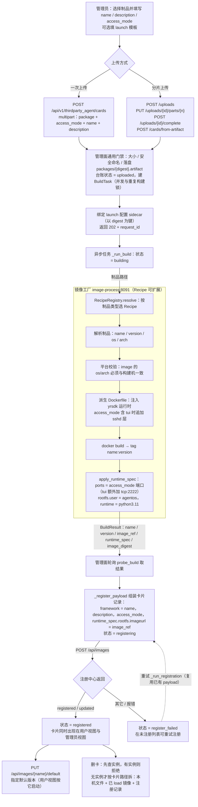
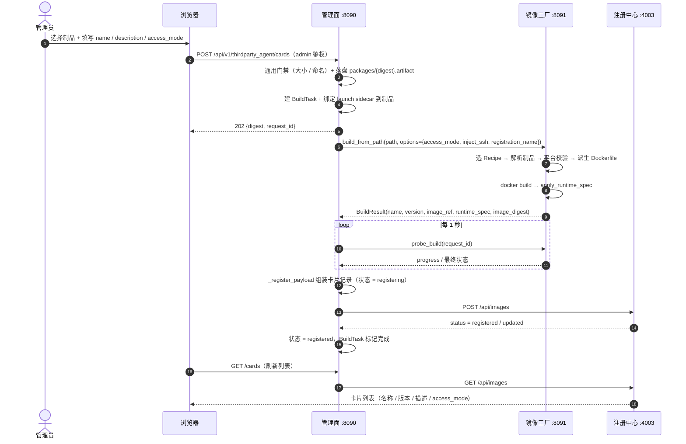
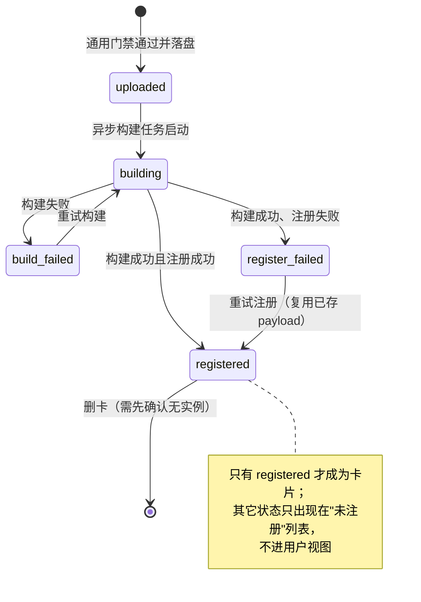
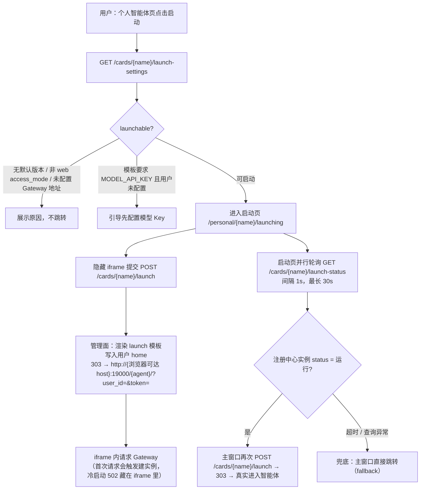
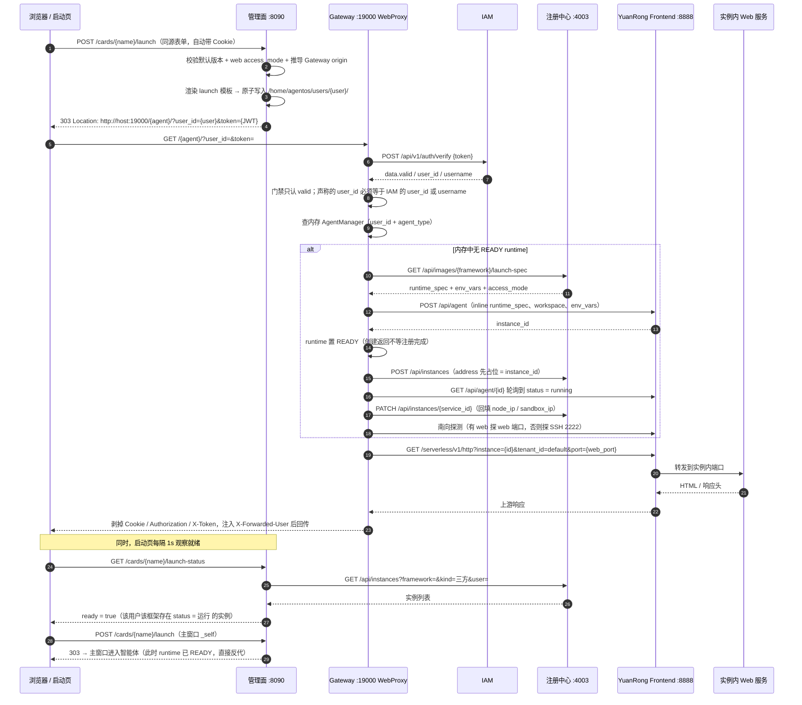
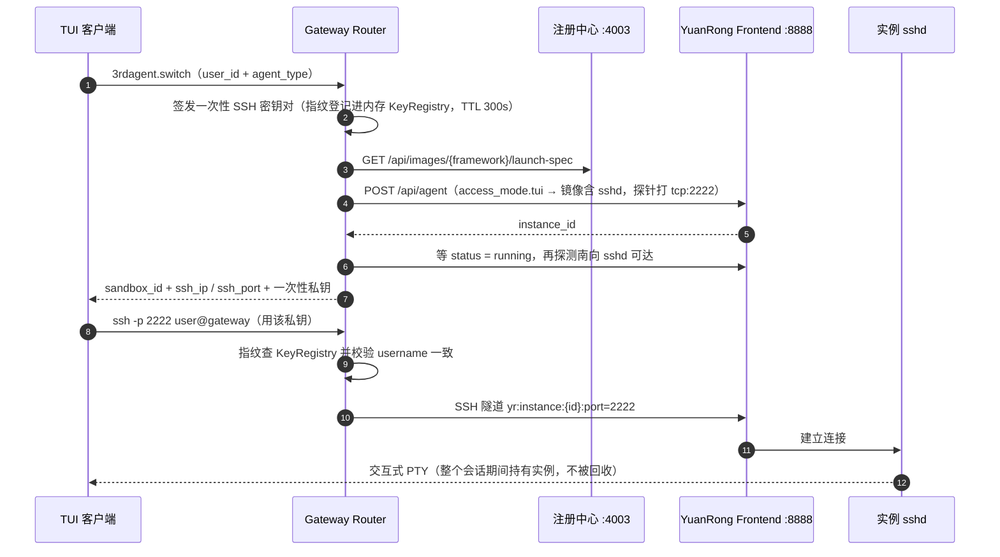

# 第三方智能体上架与启动跳转流程：流程图与时序图

## 1. 范围与依据

本文只画两条链路的**当前实现**，不包含理想模型与改造建议：

| 图组 | 链路 | 起点 | 终点 |
|---|---|---|---|
| 图一 | **上架** | 管理员拿到制品（npm tgz / OCI 镜像归档） | 注册中心上出现一张可查询、可启动的卡片 |
| 图二 | **启动跳转** | 用户在管理面点击启动 | 浏览器进入实例内的 Web 服务（或经 SSH 进入实例 PTY） |

依据（2026-09-29 只读核对）：

- **管理面** `AgentBox-Manager`（`feature/thirdparty-access-mode-image` 分支）：`backend/app/api/v1/thirdparty_agent.py`、`backend/app/services/thirdparty_agent_service.py`、`backend/app/services/agent_register_client.py`、`backend/app/thirdparty_agent/launch_config.py`、`sandbox-manager/image_process/app/factory/`
- **Gateway** `jiuwenswarm 0.2.4b4`：`extensions/agentos/agentos_router/`（`router_client` / `registry_client` / `agent_manager` / `stale_cleanup`）、`extensions/yuanrong_frontend_client.py`、`gateway/channel_manager/protocol/web_proxy/web_proxy_connect.py`

与既有文档的关系（避免重复阅读）：

- 上架的字段模型与镜像工厂设计见 [image-factory v2](third-party-agent-artifact-image-factory-design-v2.md) §5.1 / §6.1 / §8.3 / §8.4；本文补的是**实际调用链、制品状态机与落卡契约**。
- 跳转的协议缺口与理想模型见 [接入架构](third-party-agent-access-architecture.md) §2.3 / §2.4；本文画的是**实测时序**，含隐藏 iframe 预热与 `launch-status` 轮询这两个前端行为。

## 2. 参与方与关键标识

| 参与方 | 地址 | 本文中的角色 |
|---|---|---|
| 管理面 Manager | `:8090` | 制品的通用门禁与台账、launch 配置渲染、卡片查询转发、返回 303 |
| 镜像工厂 image-process | `:8091` | 解析制品、选 Recipe 与 Base、构建镜像、产出 `runtime_spec` |
| 注册中心 a2x-registry | `:4003` | 卡片（镜像记录）与实例（Runtime）的权威 |
| Gateway | `:19000` | Web/WS 接入、鉴权、实例解析与代理；南向调 YuanRong |
| Gateway SSH Channel | `:2222` | SSH 北向接入，中继到实例 PTY |
| YuanRong Frontend | `:8888` | 沙箱生命周期（`/api/agent`）与实例 HTTP/WS 代理（`/serverless/v1/...`） |

| 标识 | 生成方 | 含义 |
|---|---|---|
| `name` / `framework` | 管理员填写（注册中心上两者同值） | 卡片名；同时是 Gateway 侧 `agent_type` 与 URL 路径段 `/{agent}/` |
| `version` | 镜像工厂解析 | 同一 name 的版本；用户视图按**默认版本**启动 |
| `access_mode[]` | 管理员填写 | `{name, port, cmd}`：`web` 决定浏览器跳转的端口与启动命令，`tui` 决定是否注入 sshd 与 SSH 接入 |
| `launch 模板` | 管理员填写，随制品落 sidecar | 启动时渲染进用户 home 的配置文件；`${MODEL_API_KEY}` 是 agent 侧环境变量引用，由用户单独配置 |
| `service_id` | Gateway 派生 `generic_{sha256(user\0framework)[:8]}` | 注册中心实例行主键：一个 (用户, 框架) 恒定一行，POST 幂等 upsert |
| `instance_id` | YuanRong `POST /api/agent` | 沙箱实例 ID；代理、SSH、删除都用它 |
| `content_digest` | 管理面（SHA-256） | 制品身份；launch sidecar 与本地台账按它绑定 |

## 3. 图一：第三方智能体上架

### 3.1 上架流程图

**这张图的读法**：上架的"成功"定义只有一个——`POST /api/images` 返回 `registered` / `updated`。构建产物（镜像、`runtime_spec`）只是注册的输入；管理面本地的 `LocalAgentPackage` 只是构建与注册的台账，卡片本身不落管理面库（卡片信息必须来自注册中心）。

### 3.2 上架时序图

### 3.3 制品状态机

### 3.4 落卡契约（上架后什么变得"可启动"）

`POST /api/images` 的请求体由镜像工厂的构建结果组装，字段与来源一一对应：

| 注册中心字段 | 来源 | 启动时的消费方与用途 |
|---|---|---|
| `name` / `framework` | 管理员填写的卡片名（两者同值） | Gateway `3rdagent.list` 列为 `agent_type`；URL `/{agent}/` 路径段 |
| `version` | 镜像工厂解析 | 实例行 `framework_version`；管理面按默认版本启动 |
| `description` | 管理员填写 | 仅展示（用户视图与管理员视图） |
| `access_mode[{name,port,cmd}]` | 管理员填写，工厂校验并转成端口 | Gateway：`web` 行决定 `web_port` 与 `cmds[0]`；`tui` 行决定 SSH 探针端口 |
| `runtime_spec` | 镜像工厂 `apply_runtime_spec` + `rootfs.imageurl = image_ref` | Gateway `GET /api/images/{framework}/launch-spec` 直接作为 YuanRong `POST /api/agent` 的 inline spec |
| `image_module_version` | 镜像工厂配置 | 版本兼容标识 |
| `uploaded_by` | 管理员账号 | 归属与审计 |
| `package_path` / `image_archive_path` | 管理面落盘路径 | 管理员详情展示；删卡时按它级联清本机文件 |

对应地，**启动链路的三个前置**都由这张卡片决定：有没有 web 端口（决定浏览器跳转是否可行）、`runtime_spec` 是否完整（决定沙箱能否创建）、`access_mode` 里有没有 `tui`（决定镜像里有没有 sshd 层）。

## 4. 图二：从管理面开始的启动跳转

### 4.1 跳转流程图

**这张图的读法**：管理面**不创建实例**，只做两件事——把用户配置写好、把浏览器引到 Gateway。实例由 Gateway 在**首次请求**时按需创建；启动页的 iframe 是先遣队（把冷启动的等待与 502 关在 1px iframe 里），`launch-status` 只读注册中心、**不会触发创建**，等到实例 `运行` 后再让主窗口真正跳转。

### 4.2 启动跳转时序图

### 4.3 access_mode 决定跳转方式

| 卡片 `access_mode` | 入口 | 管理面动作 | Gateway 动作 |
|---|---|---|---|
| `web`（如 OpenClaw / DSH 的 Web 服务） | 浏览器 `:19000/{agent}/` | 303 跳转 +（可选）渲染配置 | 建/复用实例 → HTTP/WS 反代到 `access_mode.web.port` |
| `tui`（如 Claude Code 等终端形态） | TUI：`3rdagent.switch` 后 SSH `-p 2222` | 不涉及浏览器跳转 | 建实例 + 注入 sshd 层 → 返回 `ssh_ip/ssh_port` + 一次性私钥；北向 SSH 公钥指纹校验后中继到实例 PTY |

SSH / TUI 这条路的建立过程（与 Web 跳转并列的另一半）：

## 5. 关键不变量与易错点

1. **上架的唯一成功判据是落卡**：构建成功不等于上架成功；状态只有到 `registered` 才出现在用户视图。构建/注册失败都不进用户视图，只在"未注册"列表可重试。
2. **`name` 三处同值**：卡片 `name`、注册中心 `framework`、Gateway 的 `agent_type`（也是 URL 路径段）必须一致，否则 `launch-spec` 查不到、跳转 404。
3. **`access_mode` 是上架与启动之间的唯一契约**：web 端口决定能不能浏览器跳转，`tui` 决定镜像里有没有 sshd 层（漏了就只能 `3rdagent.switch` 失败，实例建出来也连不上）。
4. **实例键是 (用户, 框架) 而不是卡片版本**：`service_id` 由 `user + framework` 派生，一个用户对一个框架只有一个实例行；版本切换不会新建第二行。
5. **注册是异步的、`address` 先占位**：`3rdagent.switch` / 首次跳转返回时，注册中心里的 `address` 可能还是 `instance_id` 占位值，真实 `node_ip` / `sandbox_ip` 要等后台轮询到 `running` 后 PATCH 上去。监控侧此刻看到的是占位地址。
6. **就绪判定只读注册中心**：`launch-status` 按 `framework + kind=三方 + user + status=运行` 判断，不会去探测实例，也不会触发创建；因此它既不会误建实例，也不能代替真实连通性验证。
7. **Token 只做门禁**：Web 反代路径会校验"声称的 `user_id` 必须等于 IAM 的 `user_id` 或 `username`"（否则 403），但 Web/TUI 的 WS 握手路径只拒绝非法 token，**不把 IAM 身份回写连接**，业务身份取自客户端声明的 `X-User-Id` / `?user_id=`。上架/启动链路上的鉴权强度不等价。
8. **管理面不创建用户 home**：Gateway 只校验 `/home/agentos/users/{user}` 已存在（不存在按可重试错误处理），目录的创建与属主由管理面负责，否则实例创建会一直失败。
9. **卡片删除有实例闸门**：注册中心里还剩实例（含其它用户的实例）就整卡不能删；删除顺序是先删本机文件与镜像、再删注册记录，中途失败会留下需要人工清理的孤儿。
10. **一次性 SSH 私钥是内存态**：Gateway 重启后 KeyRegistry 清空，之前签发的私钥全部失效，需要重新 `3rdagent.switch`。

## 6. 依据与联动

- 上架：`backend/app/api/v1/thirdparty_agent.py`（`/uploads*`、`/cards*`）、`services/thirdparty_agent_service.py`（`publish*`、`_publish_accepted`、`_run_build`、`_register_payload`、`_normalize_access_mode`）、`services/image_process_client.py`、`sandbox-manager/image_process/app/factory/{service,recipe,inject}.py`、`app/factory/recipes/oci_archive.py`
- 跳转：`thirdparty_agent/launch_config.py`（`gateway_origin`、`render_launch_config`、`env_path_for`）、`frontend/src/views/resources/agent/PersonalAgentLaunchingPage.vue`、`frontend/src/api/framework.ts`（`submitLaunchForm`）
- Gateway：`jiuwenswarm 0.2.4b4` 的 `web_proxy_connect.py`（`_authenticate_web_proxy`、`_forward_headers`）、`agentos_router/router_client.py`（`resolve_web_endpoint`、`_create_agent`、`_register_agent`、`thirdagent_switch`）、`yuanrong_frontend_client.py`

**图需要随代码更新而更新的触发点**：`access_mode` 的语义（§3.4 / §4.3）、`service_id` 的派生规则（§2 / §5.4）、跳转端点与 `launch-status` 的就绪判据（§4.2）、以及 Gateway 侧鉴权与身份传递方式（§5.7）。
