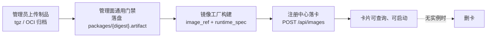
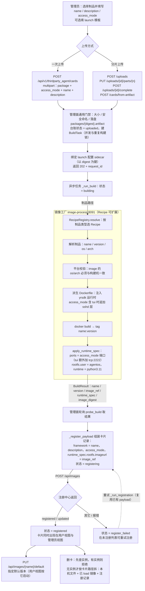
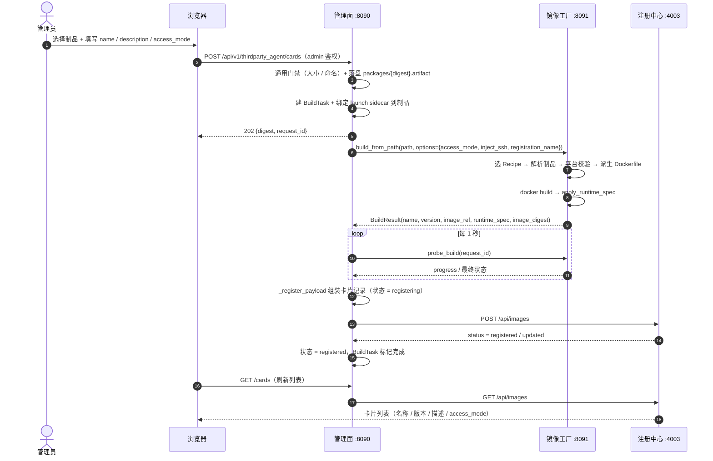
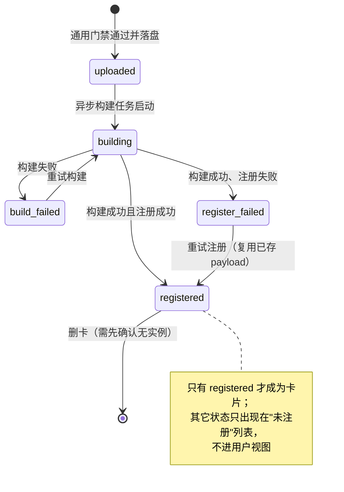
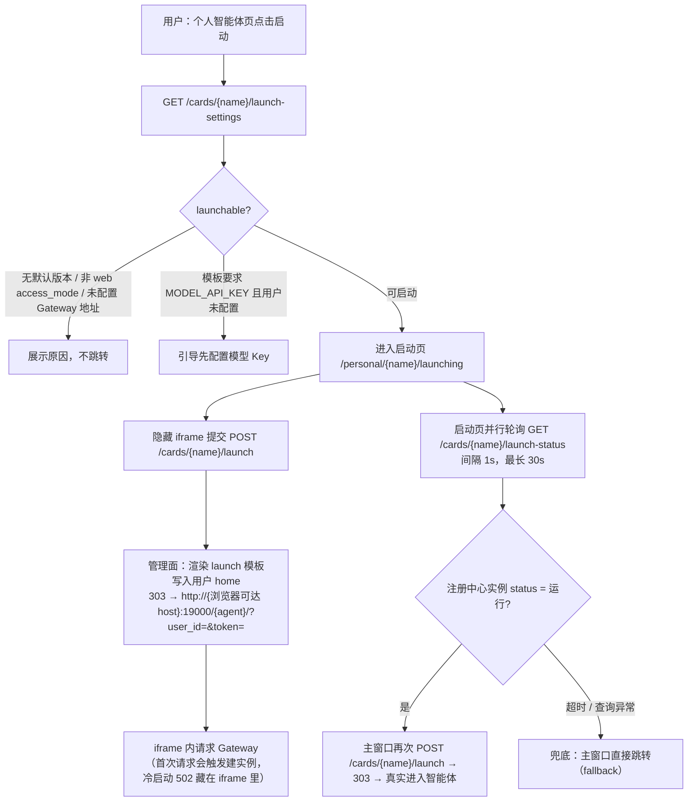
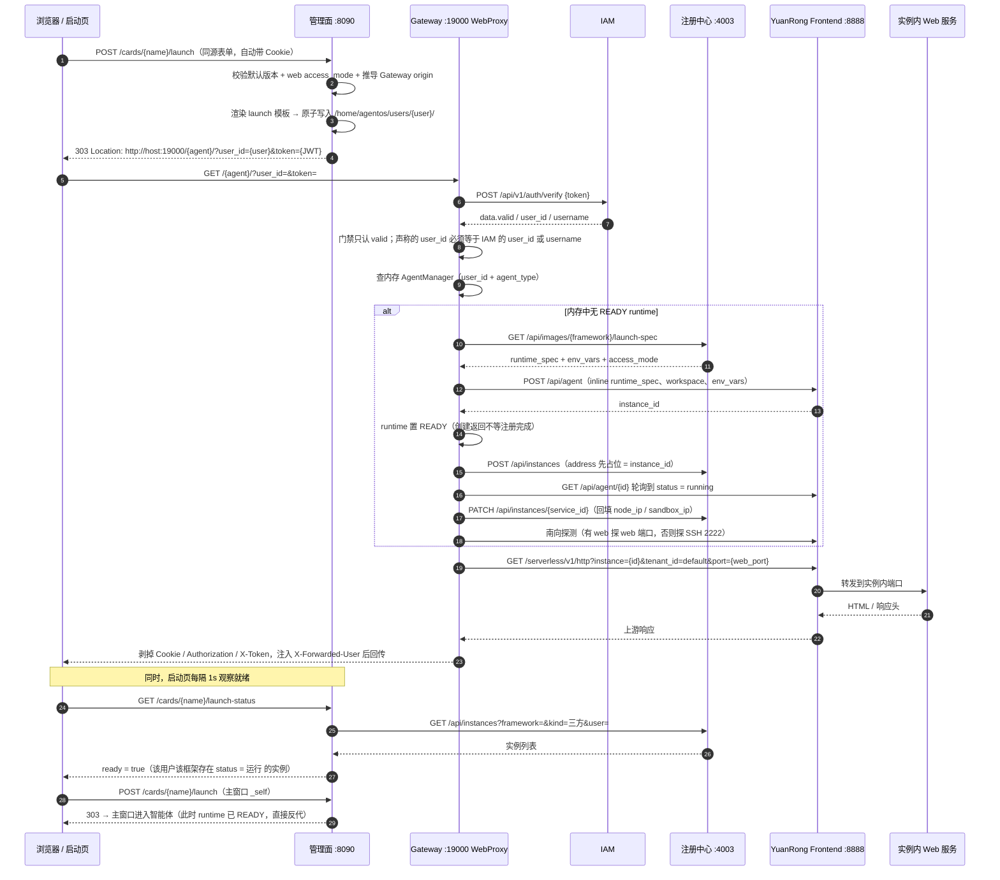
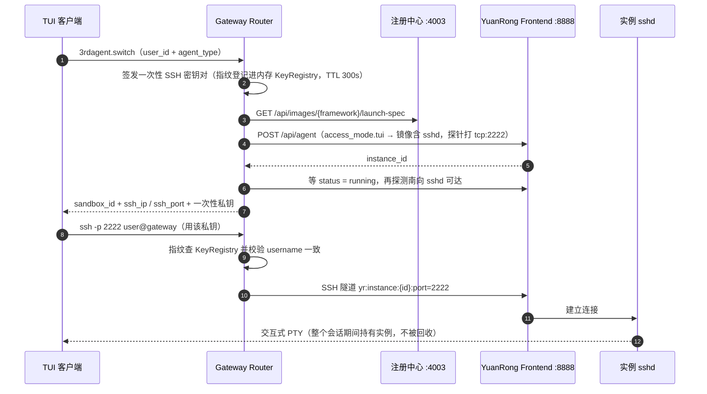

# 第三方智能体上架与启动跳转流程

## 1. 范围与依据

**当前实现**：

| 图组 | 链路 | 起点 | 终点 |
|---|---|---|---|
| 图一 | **上架** | 管理员拿到制品（npm tgz / OCI 镜像归档） | 注册中心上出现一张可查询、可启动的卡片 |
| 图二 | **启动跳转** | 用户在管理面点击启动 | 浏览器进入实例内的 Web 服务（或经 SSH 进入实例 PTY） |

关联文档：

- 上架的字段模型与镜像工厂设计见 [image-factory v2](third-party-agent-artifact-image-factory-design-v2.md) §5.1 / §6.1 / §8.3 / §8.4；本文补的是**实际调用链、制品状态机，以及两条链路的耦合点与变动点分析**。
- 跳转的协议缺口与理想模型见 [接入架构](third-party-agent-access-architecture.md) §2.3 / §2.4；本文画的是**实测时序**，含隐藏 iframe 预热与 `launch-status` 轮询这两个前端行为。

## 2. 组件与关键Tag

| 组件 | 地址 | 职责 |
|---|---|---|
| 管理面 Manager | `:8090` | 制品的通用门禁与台账、launch 配置渲染、卡片查询转发、返回 303 |
| 镜像工厂 image-process | `:8091` | 解析制品、选 Recipe 与 Base、构建镜像、产出 `runtime_spec` |
| 注册中心 a2x-registry | `:4003` | 卡片（镜像记录）与实例（Runtime）的权威 |
| Gateway | `:19000` | Web/WS 接入、鉴权、实例解析与代理；南向调 YuanRong |
| Gateway SSH Channel | `:2222` | SSH 北向接入，中继到实例 PTY |
| YuanRong Frontend | `:8888` | 沙箱生命周期（`/api/agent`）与实例 HTTP/WS 代理（`/serverless/v1/...`） |

| 标识 | 生成方 | 含义 |
|---|---|---|
| `name` / `framework` | 管理员填写（注册中心上两者同值） | 卡片名；同时是 Gateway 侧 `agent_type` 与 URL 路径段 `/{agent}/` |
| `version` | 镜像工厂解析 | 同一 name 的版本；用户视图按**默认版本**启动 |
| `access_mode[]` | 管理员填写 | `{name, port, cmd}`：`web` 决定浏览器跳转的端口与启动命令，`tui` 决定是否注入 sshd 与 SSH 接入 |
| `launch 模板` | 管理员填写，随制品落 sidecar | 启动时渲染进用户 home 的配置文件；`${MODEL_API_KEY}` 是 agent 侧环境变量引用，由用户单独配置 |
| `service_id` | Gateway 派生 `generic_{sha256(user\0framework)[:8]}` | 注册中心实例行主键：一个 (用户, 框架) 恒定一行，POST 幂等 upsert |
| `instance_id` | YuanRong `POST /api/agent` | 沙箱实例 ID；代理、SSH、删除都用它 |
| `content_digest` | 管理面（SHA-256） | 制品身份；launch sidecar 与本地台账按它绑定 |

## 3. 图一：第三方智能体上架

### 3.1 上架流程图

**简略流程**

**完整流程**

**Tips**：上架的"成功"定义：`POST /api/images` 返回 `registered` / `updated`。构建产物（镜像、`runtime_spec`）只是注册的输入；管理面本地的 `LocalAgentPackage` 只是构建与注册的台账，卡片本身不落管理面库（卡片信息必须来自注册中心,保证数据唯一性）。

### 3.2 上架时序图

### 3.3 制品状态机

### 3.4 耦合点与变动点分析

> 判断规则：跨进程边界且无显式契约 = 耦合点，要做接口抽象；有外部升级驱动力 = 变动点，要做契约版本化与兼容窗口；两者交叉处优先；单进程内单一 owner 的高频点不解耦。

**耦合点**

| # | 位置 | 耦合双方 | 现状靠什么对齐 | 类型 | 风险爆发点 |
|---|---|---|---|---|---|
| C1 | `access_mode[]` | 管理面 → 工厂 → 卡片 | 只对齐形状 `{name,port,cmd}`；语义由工厂单侧解释：`tui` 决定是否注入 sshd 与端口，其余翻成 `rootfs.ports` | 接口 + 语义 | 新增一种 access_mode 时卡片已落、镜像能力不对应，要到运行时才暴露（消费端见 §4.4 C13） |
| C2 | `runtime_spec` | 工厂 → 卡片 | JSON blob 透传：工厂改 `rootfs.user/ports`，管理面只覆盖 `rootfs.imageurl` | 接口（无版本） | RuntimeSpec 升级后无校验点，坏值在建沙箱时才暴露 |
| C3 | 制品身份 `{digest}.artifact` | 管理面 ↔ 卡片 `package_path` | 注册中心不认识 digest：管理面用正则 `([0-9a-f]{64})\.artifact` 从卡片路径反解 | **语义** | 路径或命名规则一改，反解静默返回 None——已注册判重失效、删卡找不到本地台账 |
| C4 | `name` = `framework` | 管理面写卡 → Gateway 消费 | 写入时强制同值，无校验点 | **语义** | 任一侧改名或做归一化，`launch-spec` 即 404 |
| C5 | 本机路径 `package_path` / `image_archive_path` | 管理面 → 卡片 | 卡片里存了管理面的文件系统布局（launch sidecar 也按它定位） | 接口 | 管理面多副本或迁移后，卡片找得到、sidecar 读不到 |
| C6 | 删卡级联 | 管理面 → 注册中心 → 工厂 | 固定顺序：查实例 → 升默认版本 → 删注册记录 → 删本机包与归档 → 工厂卸镜像 | 接口（无补偿） | 中途失败留孤儿（记录没了镜像还在，或反之），无回滚 |

**变动点**

| # | 变动点 | 驱动力 | 现状 | 影响半径 |
|---|---|---|---|---|
| V1 | `access_mode` 取值集合 | 产品需求（新 agent 形态） | 无集中解析器，两侧各自判 `web` / `tui` | 管理面 + 工厂（+ Gateway） |
| V2 | Recipe 集合 | 产品需求（新包类型） | `RecipeRegistry` 插件化 | 仅工厂 —— 已解耦，不必再动 |
| V3 | 注入层 `yrsdk`、`inject_ssh`、`_DEFAULT_RUNTIME=python3.11` | 上游底座升级 | 工厂内 Dockerfile 片段 | 仅工厂，但产物语义影响 Gateway 探针 |
| V4 | `runtime_spec` 语义 | 上游 openYuanRong | 无版本协商 | 工厂 + Gateway |
| V5 | 卡片字段集与 sidecar schema | 上游 a2x-registry | sidecar 已 v1 → v2 → v3 | 三方 |
| V6 | 管理面本地台账状态机 | 自身实现 | 单进程单 owner | 仅管理面 —— 不解耦 |

**优先级与处理方向**

| 优先级 | 项 | 处理方向 |
|---|---|---|
| P0 | C1 / V1 access_mode | 定义 access_mode 契约（取值、每段语义由谁解释），收口到单一解析器 + 契约测试 |
| P0 | C3 制品身份 | digest 升为卡片一等字段（或独立制品注册表），禁止从路径反解 |
| P1 | C2 / V4 runtime_spec | 声明为带版本的外部契约，落卡前校验必需字段 |
| P1 | C5 本机路径 | 卡片只存逻辑 locator，物理路径由管理面内部解析 |
| P1 | C6 删卡级联 | 定义幂等、可重试的拆除契约，补齐补偿 |
| P2 | C4 name / framework | 落卡时加一致性校验，成本低 |
| 不动 | V2 Recipe、V6 台账 | 已解耦 / 单侧自持 |

## 4. 图二：从管理面开始的启动跳转

### 4.1 跳转流程图

**这张图的读法**：管理面**不创建实例**，只做两件事——把用户配置写好、把浏览器引到 Gateway。实例由 Gateway 在**首次请求**时按需创建；启动页的 iframe 是先遣队（把冷启动的等待与 502 关在 1px iframe 里），`launch-status` 只读注册中心、**不会触发创建**，等到实例 `运行` 后再让主窗口真正跳转。

### 4.2 启动跳转时序图

### 4.3 access_mode 决定跳转方式

| 卡片 `access_mode` | 入口 | 管理面动作 | Gateway 动作 |
|---|---|---|---|
| `web`（如 OpenClaw / DSH 的 Web 服务） | 浏览器 `:19000/{agent}/` | 303 跳转 +（可选）渲染配置 | 建/复用实例 → HTTP/WS 反代到 `access_mode.web.port` |
| `tui`（如 Claude Code 等终端形态） | TUI：`3rdagent.switch` 后 SSH `-p 2222` | 不涉及浏览器跳转 | 建实例 + 注入 sshd 层 → 返回 `ssh_ip/ssh_port` + 一次性私钥；北向 SSH 公钥指纹校验后中继到实例 PTY |

SSH / TUI 这条路的建立过程（与 Web 跳转并列的另一半）：

### 4.4 耦合点与变动点分析

> 判断规则同 §3.4；本链路额外看一类"最终一致性依赖"——管理面读到的就绪状态完全取决于 Gateway 是否完成实例注册。

**耦合点**

| # | 位置 | 耦合双方 | 现状靠什么对齐 | 类型 | 风险爆发点 |
|---|---|---|---|---|---|
| C7 | `service_id = generic_{sha256(user\0framework)[:8]}` | Gateway 派生 → 注册中心 → 管理面反查 | 管理面按 `framework` + `kind` + `user` 查实例、自己判就绪 | **语义** | 派生算法一改，历史实例被判成"不是我的"：就绪判定与删卡闸门同时失效 |
| C8 | 字面量 `"三方"` / `"运行"` / `"异常"` | 管理面 ↔ 注册中心 ↔ Gateway | 三处硬编码同一批中文字符串 | **语义** | 注册中心换状态词汇表即三处同时坏，无编译期保护 |
| C9 | 跳转 URL 与 `AGENTBOX_WEB_PORT=19000` | 管理面 → Gateway | 两侧常量与注释对齐：`{origin}/{agent}/?user_id=&token=` | 接口 | 端口或参数语义一调整即断链，只在浏览器侧暴露 |
| C10 | 身份口径 | 管理面 → Gateway → IAM | 管理面用 username；Gateway 要求声称 `user_id` 等于 IAM 的 `user_id` 或 `username` | **语义** | 口径不一致表现为 403；WS 握手路径不做该校验，两条路强度不等价 |
| C11 | launch 模板的占位符与 `relative_path` | 管理面 → 用户 home → agent 镜像 | 单侧实现：白名单只约束占位符，模板内容与 agent 实际配置结构的一致性无校验 | 接口（跨"人"） | 卡片能启动但 agent 读不到期望配置，无任何报错 |
| C12 | 实例就绪的最终一致性 | Gateway → 注册中心 → 管理面 | Gateway 建沙箱后**异步**注册（先占位后 PATCH），管理面轮询 `launch-status` 判断 | 接口 + 时序 | 注册失败或延迟时，管理面判"未就绪"而实例其实可用（或反之），两侧无对账 |
| C13 | `access_mode` 的运行时解释 | 卡片 → Gateway | 与 §3.4 C1 同一契约的消费端：按 `web` 取 `web_port` 与 `cmds[0]`，按 `tui` 选探针端口并走 SSH 接入 | 接口 + 语义 | 生产端加了新模式而消费端不认识，静默走默认分支 |

**变动点**

| # | 变动点 | 驱动力 | 现状 | 影响半径 |
|---|---|---|---|---|
| V7 | 实例注册协议与状态词汇 | 上游 a2x-registry | 无版本协商 | Gateway + 管理面（= C8） |
| V8 | Gateway 的 registry 客户端与 launch-spec 解析 | 上游 jiuwenswarm | 随包升级 | Gateway 单侧，契约另一头是注册中心 |
| V9 | YR `/api/agent`、`/serverless/v1/*` 与实例状态机 | 上游 openYuanRong | 无版本协商 | 工厂 + Gateway |
| V10 | IAM 校验契约 | 上游 IAM | 只看 `data.valid`，资源级授权未用 | Gateway |
| V11 | 前端启动预热与轮询策略（iframe 预热、1s / 30s） | 交互与浏览器兼容 | 前端自持 | 仅前端 —— 不解耦 |

**优先级与处理方向**

| 优先级 | 项 | 处理方向 |
|---|---|---|
| P0 | C7 实例查找 | 收口为"按用户 + 框架查实例状态"的接口，派生规则不再被外部依赖 |
| P0 | C12 就绪判定 | 明确就绪的唯一来源与重试、对账机制，去掉"是否已注册"的隐式依赖 |
| P1 | C8 / V7 状态与 kind 词汇 | 与注册中心共同定义枚举，双方引用同一事实源 |
| P1 | C10 身份口径 | 统一 user_id 口径（username 与 IAM 主体二选一），两条接入路径强度对齐 |
| P1 | C9 跳转 URL | 端口与参数纳入部署配置，写进契约测试 |
| P1 | V8 / V9 / V10 上游依赖 | 用契约测试锁住依赖字段，跟随升级并保留兼容窗口 |
| P2 | C11 模板一致性 | 校验模板必需键与路径，或提供样例校验 |
| P2 | C13 access_mode 消费端 | 与 C1 同一契约；消费端遇到未知值应显式失败 |
| 不动 | V11 前端策略 | 单侧自持 |

## 5. 依据与联动

- 上架：`backend/app/api/v1/thirdparty_agent.py`（`/uploads*`、`/cards*`）、`services/thirdparty_agent_service.py`（`publish*`、`_publish_accepted`、`_run_build`、`_register_payload`、`_normalize_access_mode`）、`services/image_process_client.py`、`sandbox-manager/image_process/app/factory/{service,recipe,inject}.py`、`app/factory/recipes/oci_archive.py`
- 跳转：`thirdparty_agent/launch_config.py`（`gateway_origin`、`render_launch_config`、`env_path_for`）、`frontend/src/views/resources/agent/PersonalAgentLaunchingPage.vue`、`frontend/src/api/framework.ts`（`submitLaunchForm`）
- Gateway：`jiuwenswarm 0.2.4b4` 的 `web_proxy_connect.py`（`_authenticate_web_proxy`、`_forward_headers`）、`agentos_router/router_client.py`（`resolve_web_endpoint`、`_create_agent`、`_register_agent`、`thirdagent_switch`）、`yuanrong_frontend_client.py`

**图需要随代码更新而更新的触发点**：`access_mode` 的生产与消费语义（§3.4 C1 / §4.3 / §4.4 C13）、实例身份与就绪判据（§4.4 C7 / C12）、跳转端点契约（§4.2 / §4.4 C9）、以及 Gateway 侧鉴权与身份口径（§4.2 / §4.4 C10）。
