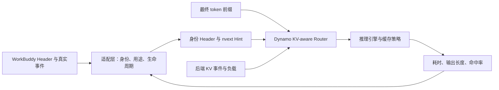

# 基于 Agent Hint 的推理加速原理与 NVIDIA Dynamo 实践

## 1. 调研问题与结论

起点是 [WorkBuddy 原生模型请求与生命周期分析](../designs/workbuddy/workbuddy-native-request-lifecycle-analysis.md)：请求已经暴露 session、parent、purpose 和 compact 等信息，这些信息到底能驱动什么加速算法？

本文承接仓库的 [Hint 通用分类调研](agent-hints-concept-taxonomy.md) 和 [Hint 基础知识](../../knowledge/agent/concepts/agent-hints.md)，聚焦推理服务消费的结构化 Hint。研究范围是公开文档、官方开源集成和论文；**未部署 Dynamo、未回放 WorkBuddy 请求、未测得本项目加速比**。在线资料访问日期为 2026-09-08；Dynamo `dev` 文档和 NAT `develop` 是滚动快照，不能当作任意稳定版本的能力保证。

核心判断：

1. **Hint 的价值是减少调度器的信息盲区。** 加速来自少做重复 prefill、提前做下一轮工作、减少排队和 KV 抖动，并非 metadata 本身让矩阵计算变快。
2. **身份、预测和控制需要分开。** session/parent 是关联依据；预计输出长度和返回时间是预测；优先级和会话控制才直接表达执行意图。
3. **KV-aware routing 应先作为基线。** 它可从真实 token 前缀和后端 KV 事件工作，不要求先补齐 WorkBuddy 全部生命周期。显式 Hint 的收益应在此基线上单独测量。[Dynamo KV-aware routing](https://docs.dynamo.nvidia.com/dynamo/dev/knowledge-base/concepts/system-architecture/kv-aware-routing)
4. **Dynamo 与本仓库不是同一个协议。** 仓库的 `agent_hint.sessionid/session_control.type` 不能原样发送就期待 Dynamo 理解。Dynamo 使用会话 Header、`nvext.agent_hints`，并另有实验性的会话控制路径。[Agents overview](https://docs.dynamo.nvidia.com/dynamo/dev/agents/overview)

## 2. 加速原理：Hint 改变哪一个决策

下面是本文的分析模型，不是 Dynamo 的源码公式。对于一条模型调用：

```text
调用时间 ≈ 排队 + KV 装载/传输 + 未命中前缀的 prefill + decode
任务时间 ≈ Agent 依赖图上关键路径的模型调用、工具执行和编排开销
```

因此，单次 TTFT 下降不一定等于整个 Agent 任务同比提速。假设可优化部分只占任务时间的 30%，该部分快 4 倍，其余不变，则总加速比只有 `1 / (0.7 + 0.3 / 4) ≈ 1.29`。这是示意计算，不是实测。

| 原理 | 使用的信号 | 算法动作 | 主要收益 | 成本与失效条件 |
|---|---|---|---|---|
| 避免重算 | token 前缀、KV 所在位置、session 辅助关联 | 前缀复用、KV-aware 路由 | prefill、TTFT、有效吞吐 | 前缀不同、缓存被淘汰；热 worker 可能拥堵 |
| 改善负载估计 | 预计输出 token、当前负载 | 预测 decode 占用并分配 worker | 负载均衡、尾延迟 | 输出预测失准、流量分布漂移 |
| 改变等待顺序 | priority、业务重要性 | 优先调度重要请求 | 关键请求延迟 | 不创造算力，可能增加其他请求等待 |
| 提前执行 | 下一轮确定前缀、预计返回时机 | speculative prefill、KV prefetch | 隐藏下一轮准备时间 | 预测未命中、挤占正式请求资源 |
| 保留高价值状态 | 复用概率、存活状态、token 区间 | 优先级淘汰、分层存储、及时释放 | 减少缓存抖动和重复 prefill | 过度保留会压缩可用容量 |
| 限制活跃工作集 | Agent 身份、工具边界、会话资源量 | 按完整 Agent 程序准入、暂停、恢复 | 高并发下稳定吞吐 | 排队和公平性成本，需生命周期观测 |

### 2.1 前缀复用：必须匹配内容，不能只匹配身份

vLLM APC 复用相同前缀的 KV，从而跳过共享部分的 prefill；它不直接缩短新 token 的 decode。长输入、多轮追加的请求更适合这类优化。[vLLM APC](https://docs.vllm.ai/en/v0.22.1/features/automatic_prefix_caching/)

**对 WorkBuddy 的推论：** 23 个工具、工具定义字符数很大，只说明潜在复用价值高。真正的命中需要检查最终聊天模板处理后的 token 序列。主、子 Agent 工具数量不同，或者 system prompt、工具顺序发生变化，都可能提前截断公共前缀。相同 parent 不证明相同 KV；字符数也不能直接换算成 token 数。

路由可以理解为选择下式代价最小的 worker，其中各项均需用同一成本尺度估计：

```text
cost(worker) = 预计等待时间
             + 未命中部分的 prefill 时间
             + 预计 decode 负担
             + 必要的 KV 传输时间
```

Dynamo 实际结合 cache overlap 与活跃 prefill/decode 负载；后端 KV 创建和释放事件更新索引。因此，缓存最多的 worker 也可能因为负载过高而落选。路由选择和 NIXL 等传输机制是不同职责。[KV-aware routing](https://docs.dynamo.nvidia.com/dynamo/dev/knowledge-base/concepts/system-architecture/kv-aware-routing)

### 2.2 预测：把未知工作量变成可校准的估计

Dynamo 的 `osl` 是预计输出 token 数；启用 `--router-track-output-blocks` 后参与输出 block 跟踪和路由估计。它不是 `max_tokens`，不会要求模型恰好输出对应长度。[Agent Hints](https://docs.dynamo.nvidia.com/dynamo/dev/agents/agent-hints)

**建议的 WorkBuddy 预测器：** 先按模型、purpose、Agent 类型和输入长度区间统计实际输出长度，样本足够后再学习更细的模式。用历史滑动统计预测本轮，不能把本轮最终输出作为在线可用特征。`tools.names` 描述可用能力，不能代表本轮实际选择的工具。

### 2.3 提前执行：预填充与预取解决不同的问题

`speculative_prefill` 的文档实现是：当前响应完成后，用历史加 assistant 响应构造预计下一轮前缀，经模板处理和 tokenize，发起 `max_tokens=1` 的后台请求来预热 KV。它不等于预测未知工具结果，也不等于 draft model 验证式的 speculative decoding。[nvext reference](https://docs.dynamo.nvidia.com/dynamo/dev/additional-resources/nvidia-request-extensions-nvext)

KV prefetch 则把已经计算、存于低层存储的 KV 提前搬到 GPU；两者可能组合，但一个主要涉及计算，一个主要涉及搬运。Dynamo 的架构文章讨论了利用工具返回时机做预取，以及 HiCache/KVBM 分层缓存方向；不能据此断言开启一个 Hint 就自动实现所有存储层的生命周期控制。[Agentic inference architecture](https://docs.dynamo.nvidia.com/dynamo/dev/digest/agentic-inference)

**本文的启用判断：** 预计命中概率 × 可隐藏延迟，应超过额外计算、缓存污染和带宽竞争的成本。WorkBuddy 若本轮结束后即 compact、取消，或者下一轮模板变更，则预热可能失效。

### 2.4 缓存保留：优化未来价值，而非单看最近使用时间

LRU 只看 recency。业务如果知道固定系统前缀反复使用、某段临时上下文即将结束，就能更合理地保留或淘汰。TensorRT-LLM 已有 token 范围级 retention 配置，支持优先级及持续时间，是“应用知识指导缓存策略”的明确实践。[TensorRT-LLM reuse optimizations](https://developer.nvidia.com/blog/introducing-new-kv-cache-reuse-optimizations-in-nvidia-tensorrt-llm/)

**一个设计用价值模型：** `未来复用概率 × 重算代价 − 持有内存的机会成本`。这不是现成 Dynamo API。pause 不应无条件 pin，stop 不应无条件删除所有同前缀 block；共享 block 仍可能被其他请求引用。thinking 是否不再复用，也必须依据下一轮实际序列化结果判断。

## 3. NVIDIA Dynamo：公开接口与启用条件

### 3.1 三种信号面

| 信号面 | 公开形式 | 消费者与含义 |
|---|---|---|
| 身份 | `X-Dynamo-Session-ID`、`X-Dynamo-Parent-Session-ID` | trace、回放及显式启用的会话策略；默认不保证 sticky |
| 请求优化意图 | `nvext.agent_hints` | router 和支持该功能的 engine |
| 实验性会话控制 | `nvext.session_control` | 显式绑定，以及 SGLang streaming session 的 KV 生命周期 |

身份文档另外提供 `X-Dynamo-Session-Final: true`，在会话结束时通过专门的最小请求通知生命周期消费者；这不是“所有 backend 都立刻释放 KV”的保证。[Session IDs](https://docs.dynamo.nvidia.com/dynamo/dev/agents/session-i-ds)

用于普通请求的示意映射如下，数值只是示例：

```text
X-Dynamo-Session-ID: <WorkBuddy x-conversation-id>
X-Dynamo-Parent-Session-ID: <WorkBuddy x-parent-conversation-id，存在时发送>
```

```json
{
  "model": "deployed-model",
  "messages": [{"role": "user", "content": "继续分析"}],
  "nvext": {
    "agent_hints": {
      "priority": 5,
      "osl": 512,
      "speculative_prefill": false
    }
  }
}
```

### 3.2 Hint 支持不等于默认生效

| 字段 | 已文档化行为 | 必要条件或边界 |
|---|---|---|
| `priority` | 高值优先；软优先级可影响 router 和后端 | router 需实际产生排队；engine 需单独启用 |
| `strict_priority` | pending queue 的绝对层级，高层先出队 | 只影响 router 等待队列，不传给 engine |
| `osl` | 预计输出长度 | 需开启输出 block 跟踪 |
| `speculative_prefill` | 下一轮前缀预热 | 必须真实前缀匹配并命中预热缓存才有收益 |

当前 Hint 文档列出三个后端均支持 priority-aware routing 和 speculative prefill；priority-based cache eviction 列为 SGLang 支持、vLLM/TRT-LLM planned。[Agent Hints](https://docs.dynamo.nvidia.com/dynamo/dev/agents/agent-hints)

优先级各层配置独立：router 使用 KV 路由与 `--router-queue-threshold`；vLLM 使用 `--scheduling-policy priority`；SGLang 使用 `--enable-priority-scheduling`，缓存淘汰另配 `--radix-eviction-policy priority`。无等待队列时，router priority 没有可重排的对象。HTTP 优先级 Header 可覆盖同名 body Hint。[Priority Scheduling](https://docs.dynamo.nvidia.com/dynamo/dev/agents/priority-scheduling)

**不要混淆两种 TRT-LLM 能力：** 引擎自己的 token-range retention 已有实践，但当前 Dynamo nvext reference 明确写明 TRT-LLM 不支持该路径的 per-request priority；不能从前者推出后者已端到端打通。[nvext reference](https://docs.dynamo.nvidia.com/dynamo/dev/additional-resources/nvidia-request-extensions-nvext)

### 3.3 生命周期能力的特殊实现：SGLang session control

这是 **experimental** 能力。`bind` 只做路由绑定；`open` 开启 SGLang streaming session，要求 SGLang ≥ 0.5.11 且启用 `--enable-streaming-session`。首次请求可复用 radix 公共前缀，后续状态放入专用 session slot；这些 KV 不参与普通淘汰，靠 close 或空闲超时释放。只支持顺序追加，compact、rewind 等不能直接当普通续接。官方提供了 OpenCode provider fork 的接入示例，不能视为 OpenCode 上游已普遍支持。[SGLang agent workloads](https://docs.dynamo.nvidia.com/dynamo/dev/knowledge-base/modular-components/backends/sg-lang/agents-on-sg-lang)

**对 WorkBuddy 的推论：** 这条路径最适合有明确结束信号、短寿命且顺序追加的子 Agent。当前缺失可靠 stop 的情况下不宜大规模启用，否则持有的 KV 只能等 timeout。也不能同时假设这些不可淘汰的 session KV 能由另一套暂停策略自由回收；组合需要单独验证。

## 4. 已有实践与证据强度

### 4.1 NAT + Dynamo：Hint 驱动的自定义学习路由

NVIDIA NeMo Agent Toolkit 的公开实验集成包含 `external/dynamo/generalized/frontend.py`、`processor.py`、`router.py`：接收并转发 `x-prefix-*`，利用 prefix ID、预计请求数、OSL 和 IAT（请求间隔）进行路由。Thompson Sampling 路径结合 LinTS 与 Beta bandits，在缓存局部性、worker 负载和工作量预测间学习取舍。这是自定义 frontend/router，不是给默认 Dynamo 发送这些 Header 就自动生效。[NAT setup and architecture](https://github.com/NVIDIA/NeMo-Agent-Toolkit/blob/develop/external/dynamo/README.md)

官方示例围绕 ReAct banking 工具选择 benchmark，并提供评估流程；工具 stub 捕获调用意图，不能直接代表真实 WorkBuddy 的工具耗时分布。[NAT integration example](https://github.com/NVIDIA/NeMo-Agent-Toolkit/tree/develop/examples/dynamo_integration)

**可借鉴的工程方法：** WorkBuddy 的 purpose 可以作为特征分组，session 可以关联历史调用；但必须用实际反馈更新估计，并保留普通 KV-aware routing 作为退化路径。IAT 应来自历史请求间隔或工具事件，不能从“声明了哪些工具”推出来。

### 4.2 ThunderAgent：把调度单位提升为整个 Agent 程序

ThunderAgent 论文把模型与工具循环抽象为 LLM Program，联合管理 KV 和工具资源，并报告 serving 吞吐提升 1.5–3.6 倍。论文包含高并发 H100 实验；收益包括程序调度及环境准备等机制，不能全部归因于某个 Hint 字段。[ThunderAgent paper](https://arxiv.org/abs/2602.13692)

Dynamo 已文档化移植的 `dynamo.thunderagent_router`，但明确 **未发布，需 source checkout**。它按 session 维护 reasoning/acting 与 active/paused 状态，在工具边界做逻辑暂停，不中断正在 decode 的请求；恢复时按容量准入，并设置超时防饥饿。[Dynamo ThunderAgent scheduler](https://docs.dynamo.nvidia.com/dynamo/dev/agents/thunder-agent-program-scheduler)

**对 WorkBuddy 的价值：** 这是 pause/resume 等生命周期为什么值得补齐的最直接案例。但 scheduler 为控制资源而 pause，与用户切换窗口、归档或网络重连语义不同，不能互相替代。

### 4.3 公开数字应怎样解读

| 工作 | 公开报告 | 可以说明什么 | 不能说明什么 |
|---|---|---|---|
| NAT 自定义路由 | 相对默认 Dynamo，p50 TTFT 约降至 1/4，p50 tokens/s 约 1.5 倍；优先级标记另有最高 63% p50 TTFT 降幅 | workload-aware 路由有可观收益空间 | 三个数字不能相乘；不是 WorkBuddy 端到端收益 |
| TRT-LLM priority eviction | 内部 benchmark 缓存命中率提高约 20%，随工作负载变化 | 复用价值可改善淘汰 | 不代表延迟下降 20%；原文没有统一明确为百分点 |
| ThunderAgent | serving 吞吐约 1.5–3.6 倍 | 高并发程序级调度值得验证 | 不是 Dynamo 移植版的已复现实测 |

来源分别为 [Dynamo architecture report](https://docs.dynamo.nvidia.com/dynamo/dev/digest/agentic-inference)、[TRT-LLM report](https://developer.nvidia.com/blog/introducing-new-kv-cache-reuse-optimizations-in-nvidia-tensorrt-llm/)、[ThunderAgent paper](https://arxiv.org/abs/2602.13692)。以上均为作者报告，本次未独立复现。

## 5. WorkBuddy 原生信息到算法的映射

下表的原生可观测性来自 [本仓库生命周期分析](../designs/workbuddy/workbuddy-native-request-lifecycle-analysis.md)；“使用建议”是本次调研推论，不是 WorkBuddy 已实现功能。

| 原生信息 | 使用建议 | 不能直接推出的结论 |
|---|---|---|
| `x-conversation-id` | 映射 Dynamo canonical session Header；关联长度与间隔统计 | 默认 sticky、KV 存在或有效 |
| `x-parent-conversation-id` | 重建父子树，寻找公共前缀候选 | 子 Agent 完整继承父 KV |
| `x-root-request-id` | 关联编排链，分析任务关键路径 | 所有请求共用一个 session 或 worker |
| `x-agent-type/purpose` | 业务分类；学习 OSL，配置有依据的服务等级 | 所有 main 都比 subagent 重要 |
| `conversation_topic` | 标题单独统计与调度，不计入主会话 start | 可以丢弃标题请求 |
| 首次有效调用 | 建立本地状态；经过验证后可作为子会话 open 候选 | 全局真实 start，尤其采集器重启后 |
| `conversation:compact` | 标记上下文转换，比较压缩前后 token 前缀，停止旧前缀预测 | 收到 compact 请求即可删掉旧 KV |
| tools 定义 | 对最终序列化/token 前缀做分析，识别稳定公共部分 | 字符数=token 数；工具存在=正在执行 |
| request/message ID、retry count | 关联尝试、避免重复累计生命周期统计 | 每次 retry 都是新任务 |
| 无明确 pause/resume/stop | 先保持 unknown，补 Hook/Event 及确认机制 | 连接变化=resume，沉默=stop |

尤其是 compact：生成摘要本身仍可能读取旧上下文，后续请求还可能失败、重试；应等新的上下文版本生效，再降低旧版本保留价值。建议在适配层维护 `context_epoch` 与事件来源/可信度，这是本项目可扩展的内部状态，不是 Dynamo 现成 Hint 字段。



## 6. 建议验证顺序：先证明消费，再证明收益

这是后续 PoC 方案，本次只完成调研。第一轮无需修改 WorkBuddy 产品；可以先用已授权采集的数据构建受控回放，再在模型发送点或现有服务入口做适配。若沿用仓库“无额外常驻代理”的约束，应在已控制的发送点实现转换。

| 阶段 | 对照实验 | 要证明的事情 |
|---|---|---|
| A | 普通负载路由 vs KV-aware；同样开启引擎 prefix cache | 真实公共前缀、索引更新和路由局部性有收益 |
| B | KV-aware vs KV-aware + OSL | 预测增加的路由精度能改善延迟/吞吐 |
| C | 无 priority vs 按业务设置 priority | 拥塞时改善目标请求，同时报告其他请求损失 |
| D | 无预热 vs speculative prefill | 净节省大于无效预热和资源竞争 |
| E | 普通子 Agent vs SGLang session control | 结束回收可靠，持有量受控，超时可恢复 |
| F | request-level vs ThunderAgent program-level | 多会话、长工具等待和内存压力下任务 goodput 提高 |

实验至少覆盖主 Agent 多轮、父子 fan-out、compact、短/长工具间隔和 retry；每组保持模型、GPU 数、输入、生成参数一致，固定 Dynamo commit/镜像及后端版本。分别测冷缓存与稳态，改变并发与 KV 压力；不要只测单 worker，因为它无法证明跨 worker 路由收益。

建议记录：

- 每次调用：session、parent、purpose、实际 worker、输入/输出 token、预测 OSL、TTFT、排队和 ITL。
- 缓存：实际复用 token、未命中 prefill token、eviction/recompute、驻留 KV、传输字节、无效预热计算量。
- 完整任务：成功率、p50/p95 完成时间、单位时间完成任务数、满足 SLO 的 goodput、GPU 时间/任务。
- 生命周期：事件来源、context epoch、open/close 成功情况、timeout、孤儿 session 和重试次数。

预测器再加入空 Hint、打乱 Hint、仅身份 Header 三组消融；保持其余路由设置一致。这样能区分“有真实预测信息”与“只是改了默认配置”的收益。回放真实到达间隔适合比较服务策略；要判断完整任务时间，还需保留模型—工具依赖，避免把原本串行的链条错误并发化。

**落地优先级：** 先做实际 token 前缀分析和 KV-aware 基线，再做 purpose 分组的 OSL/priority；有可靠完成事件后再试子 Agent session control。pause/resume 的程序级调度是第二阶段研究，不应成为首轮 Hint 验证的前置阻塞。

## 7. 文档边界与待验证项

- `agent_hint` 是本仓库扩展；`nvext.agent_hints` 是 Dynamo 扩展，二者需要适配。
- Dynamo 通用 nvext reference 强调身份在 Header，未列出实验性 `session_control`，但 SGLang 专页已描述该 API；应固定源码/镜像并进行端到端能力探测，不能只按通用 schema 或示例猜兼容性。
- 架构文章讨论的 TTL、token-range 保留与分层生命周期不代表已有统一生产 API；其中明确说明 `nvext.cache_control` 不是受支持的 TTL pinning 扩展。
- 优先级文档提及的队列策略和配置页存在表述差异；具体可用枚举与参数以目标版本的 CLI/schema 为准。本报告不据此给出可直接部署的完整命令。
- SGLang session KV 隔离、NAT 自定义学习路由、ThunderAgent 是不同实现路径，不能假定任意组合。首轮实验应逐项启用并检查消费者行为。
- 本次没有验证 WorkBuddy 自带 Dynamo 原生适配，也没有证据证明 pause/resume/stop 已能从现有模型请求完整恢复。

继续阅读入口：[Dynamo Agent Hints](https://docs.dynamo.nvidia.com/dynamo/dev/agents/agent-hints)、[Dynamo routing configuration](https://docs.dynamo.nvidia.com/dynamo/knowledge-base/modular-components/router/configuration-and-tuning)、[NAT 可复现集成](https://github.com/NVIDIA/NeMo-Agent-Toolkit/tree/develop/examples/dynamo_integration)、[ThunderAgent 原始实现](https://github.com/Agentic-Kinetics/ThunderAgent)。
