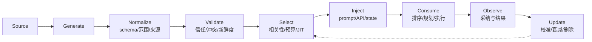

# Agent Hint 通用概念、分类与应用场景调研

## 业务背景

Agent 的核心不是一次文本生成，而是在不完全信息下反复进行“理解目标—选择下一步—执行动作—观察结果—调整策略”。系统中的很多信息都在帮助这个决策过程：用户的一句提醒、工具描述、历史成功经验、页面的可访问性语义、失败后的反思、路由优先级，都可能被称为 Hint。

如果把 Hint 简化为 prompt，便无法解释结构化工具注解和推理调度元数据；如果把 Hint 等同于所有上下文，又失去概念的区分度。本调研回答：**在 Agent 系统中，什么信息应被视为 Hint，它有哪些类型，如何进入决策闭环，适合哪些场景，又该怎样与约束、反馈、记忆和策略区分？**

> 调研快照：2026-09-02。业界尚不存在统一的 Agent Hint 标准；本文是基于经典启发式搜索、人类建议学习、LLM Agent、MCP 和推理服务接口的综合分类，不宣称某一家厂商首次定义了通用概念。

## 约束条件

- 以论文、标准规范和产品官方文档为主要证据，区分通用机制与厂商术语。
- 覆盖模型内决策、Agent Runtime、外部环境和 serving infrastructure，而不是只看 prompt。
- Hint 按“建议性信号”理解；安全策略、权限校验等不可绕过规则不降级为 Hint。
- 对尚未形成标准术语的综合结论，明确标注为本文归纳。

## 待解决问题

- [x] Hint 的必要特征和概念边界是什么？
- [x] 可以从哪些互补维度对 Hint 分类？
- [x] Hint 在感知、规划、工具、记忆、协作、运行和学习环节如何应用？
- [x] Hint 如何生成、选择、注入、消费、验证和失效？
- [x] 如何评估 Hint 的收益、风险和可信度？
- [x] MCP Tool Annotations、Reflexion、Voyager、Dynamo 等案例处于框架的什么位置？

## 调研与实践

### 一、概念来源：Hint 不是新发明

#### 1. 经典 AI：启发式信息缩小搜索空间

经典启发式搜索用一个不必精确但计算成本较低的估计，引导搜索优先扩展更可能接近目标的节点。A* 中 heuristic function 不直接给出最终路径，而是与已发生的路径成本共同决定搜索顺序。这个传统提供了 Hint 最重要的原型：**它不替代求解器，而是用部分知识改变求解器的搜索顺序。**

#### 2. 交互式学习：建议影响 reward、value、policy 或当前决策

人类建议强化学习研究把 advice 定义为可影响 Agent 探索、决策或策略信念的外部输入，并区分 reward shaping、value shaping、policy shaping 和 decision biasing。建议可能正确，也可能噪声很大，因此系统需要解释、融合、衰减和覆盖机制。

#### 3. LLM Agent：自然语言成为统一的软控制面

LLM 可以直接消费任务分解、示例、经验、批评和工具文档。Reflexion 把任务反馈转成语言反思，存入 episodic memory 并影响后续尝试；Voyager 把环境反馈、执行错误、自验证和检索出的技能放回迭代提示。这说明 Hint 既可以来自人，也可以由环境、模型、检索器或评估器生成。

#### 4. Agent 协议与基础设施：Hint 也可以完全不进入模型

MCP `ToolAnnotations` 明确把 `readOnlyHint`、`destructiveHint`、`idempotentHint`、`openWorldHint` 定义为对客户端的提示，并要求不可信服务器提供的 annotations 不得直接作为安全决策依据。NVIDIA Dynamo 的 `agent_hints` 由 serving stack 消费，用于优先级、输出长度估计和 KV Cache 优化。两者都可能不进入模型上下文。

因此，“Hint = 给 LLM 的提示词”不成立；更准确的对象是 **Agent 系统中某个决策组件**。

#### 5. 演进脉络与 NVIDIA 的位置

| 阶段 | 代表工作 | Hint 的角色 |
|---|---|---|
| 1960s：启发式搜索 | A* 等 informed search | 用成本/距离估计引导状态空间搜索 |
| 2010s：交互式学习 | human advice、policy shaping | 用人类建议影响策略或当前动作选择 |
| 2023 起：LLM Agent | ReAct、Reflexion、Voyager | 用自然语言反馈、反思和检索技能指导多步决策 |
| 2025：协议化工具 Hint | MCP Tool Annotations | 用结构化注解向 Agent client 表达工具风险与行为性质 |
| 2026：基础设施 Agent Hints | NVIDIA Dynamo | 将 Agent harness 掌握的意图显式传给 router/backend |

NVIDIA 在 2026 年 3 月发布的 Dynamo Agentic Inference 资料中，把 **Agent Hints** 作为 “Harness–Orchestrator Interface” 明确命名并产品化。这可以视为公开资料中对 **Agent 推理服务 Hint** 的一次代表性首次系统化提出：此前优先级、长度估计、cache hint 等机制分别存在，但 Dynamo 将它们收敛到 `nvext.agent_hints`。这一历史位置不等于 NVIDIA 发明了 Hint、heuristic 或 Agent guidance 的通用思想。

### 二、工作定义

本文将 Agent Hint 定义为：

> **由人、环境、模型或系统产生，面向 Agent 决策链中某个消费者的辅助信号；它提供方向、偏好、估计、可供性或风险线索，以降低搜索与试错成本，但不单独拥有最终裁决权。**

一个信号被称为 Hint，通常同时具有以下特征：

1. **决策相关**：对应一个明确决策点，如选计划、选工具、选动作、选 worker。
2. **信息不完备**：给出局部方向或估计，而不是完整答案或确定流程。
3. **建议性**：消费者可结合目标、观察、约束和其他证据接受、降权或忽略。
4. **可能不可靠**：可能过期、错误、冲突、有偏或被恶意伪造。
5. **有成本收益目标**：希望减少搜索、token、工具调用、失败重试、人工干预或延迟。

#### Hint 的抽象结构

```text
Hint = {
  producer,       // 用户、环境、检索器、critic、runtime...
  consumer,       // LLM、planner、tool router、scheduler...
  decision_point, // 影响哪个选择
  payload,        // 文本、schema、分数、候选、注解或 metadata
  scope,          // step / task / session / project / global
  confidence,     // 可信度或校准分数
  provenance,     // 来源和证据
  validity,       // 版本、TTL、适用状态
  strength        // 建议权重；不得冒充不可绕过约束
}
```

这不是现有标准 schema，而是本文为设计和评审 Hint 机制归纳的最小信息模型。

### 三、概念边界

| 相邻概念 | 核心含义 | 与 Hint 的关系 |
|---|---|---|
| Instruction / Goal | 要完成什么、期望什么结果 | 指令定义目标；Hint 帮助选择路径。若“建议”不可忽略，它实际是指令 |
| Constraint / Policy | 明确允许、禁止或必须满足的边界 | 强约束由代码、权限或验证器执行，不能依赖 Agent 是否采纳 Hint |
| Observation | 环境当前发生了什么 | 原始 observation 是事实；提炼“下一步可能点哪个按钮”后才成为 Hint |
| Feedback | 对已经发生的动作或结果作评价 | Feedback 是来源；转化成下一次可执行方向后成为反思/学习 Hint |
| Reward | 用于优化策略的标量目标信号 | Reward 可经 shaping 影响学习；部署时语言指导不一定改变模型权重 |
| Memory | 跨时间保存的信息集合 | Memory 是存储；检索、排序并注入当前决策的片段才作为 Hint 生效 |
| Context | 当前消费者可见的全部信息 | Hint 是其中为特定决策主动选择的辅助信号，不是上下文的同义词 |
| Tool schema | 工具名称、参数和返回契约 | schema 描述能力；用途、风险、调用时机和示例可充当工具选择 Hint |
| Plan | 拟执行的步骤序列 | Plan 可驱动执行；meta-plan 或部分子目标也可作为 planner 的 Hint |
| Default | 未指定时采用的确定值 | Default 决定行为；Hint 只影响选择，不应悄悄变成无法覆盖的默认值 |

判断规则：**如果信号错误时，系统仍应通过独立证据或规则纠正它，它是 Hint；如果错误也必须照做，它已经是命令或策略。**

### 四、主分类：按消费者和决策点

这是最实用的分类，因为它直接回答“谁在什么决策上使用 Hint”。同一个 payload 被不同消费者使用时，可以属于不同类别。

#### 1. 认知与推理 Hint（LLM / reasoner）

用于帮助模型理解任务、发现中间步骤或关注关键证据。

| 形式 | 示例 | 适用场景 |
|---|---|---|
| 方向线索 | “先检查时间范围，再比较价格” | 问题求解、调查、诊断 |
| 部分结果 | 已知中间变量或失败位置 | 数学、代码修复、数据分析 |
| 示例/演示 | few-shot 轨迹、工具调用样例 | 格式学习、冷启动、长尾工具 |
| 证据提示 | 检索出的相关段落、引用候选 | RAG、研究、合规审查 |
| 不确定性提示 | “该结论可能受版本影响” | 促使验证、避免过度自信 |

自然语言 Hint 最灵活，也最容易造成 prompt 膨胀、位置偏差和上下文干扰。

#### 2. 规划与搜索 Hint（planner / search policy）

用于改变候选计划、状态或动作的探索顺序，不直接替代规划器。

- goal-distance / cost heuristic：估计某状态离目标的距离或剩余成本。
- subgoal / landmark：提示应先达到的中间状态。
- meta-plan：提供任务类型级套路，如“先收集证据，再并行验证，最后汇总”。
- candidate ranking：对多个计划、工具链或下一动作打分。
- branch pruning suggestion：标记低价值或高风险分支，但最终剪枝仍须满足系统规则。

适用于 Web 自动化、代码 Agent、机器人、长任务规划和多工具工作流。对要求最优性的搜索，Hint 必须满足 admissibility/consistency 条件；LLM 给出的启发值通常没有这种保证。

#### 3. 工具与动作 Hint（tool router / policy / approval UI）

用于回答“有什么能力、什么时候用、怎样用、风险多大、失败后能否重试”。

- 工具描述、参数说明、返回结构和正反例影响模型的工具选择及参数生成。
- `tool_choice=auto` 允许模型参考描述自行决策；`required` 或指定工具是约束，不再是 Hint。
- MCP Tool Annotations 提供只读、破坏性、幂等性和开放世界交互的风险词汇。
- 编译错误、HTTP 状态、表单校验信息是 action-result Hint，可指导修参或选择替代工具。
- UI affordance、按钮 role/name、可点击状态提示可执行动作集合。

这一类最接近真实世界副作用，必须区分“用于排序和展示的 Hint”与“由权限系统强制的安全决策”。

#### 4. 感知与环境 Hint（perception / state estimator / LLM）

用于把高噪声环境转成更易决策的语义状态。

- 浏览器 Accessibility Tree 的 role、name、state 比原始 DOM 更接近 Agent 可操作语义。
- 视觉 grounding 的 bounding box、OCR、显著区域或对象关系提示关注和操作位置。
- 进度标志、面包屑、当前选中项、可撤销状态帮助判断所处阶段。
- affordance 或合法动作掩码缩小动作候选；若掩码是强制合法集合，它属于约束，排序分数才是 Hint。

环境 Hint 可能被网页或工具输出操纵，必须保留来源边界，不能把页面中的命令当作高优先级指令。

#### 5. 记忆与经验 Hint（retriever / reasoner / planner）

用于把历史经验转成当前可用的局部指导。

- episodic：相似任务的成败轨迹、Reflexion 的语言反思。
- semantic：领域规则、事实和稳定概念。
- procedural：Voyager 式技能、可复用代码和操作模板。
- preference：用户偏好、项目习惯和过去的人工纠正。

记忆不会自动成为 Hint。典型链路是 `存储 → 检索 → 相关性/可信度排序 → 压缩 → 注入 → 使用结果追踪`。错误检索、过期经验和自我强化偏差是主要风险。

#### 6. 协作与编排 Hint（orchestrator / peer agent）

用于多 Agent 的任务分配、交接和冲突协调。

- capability hint：子 Agent 声明擅长的任务、工具或上下文范围。
- delegation hint：建议某子任务交给谁，而非强制路由。
- handoff hint：已完成内容、未解决问题、证据位置、建议下一步和置信度。
- progress hint：`planning / retrieving / acting / blocked / verifying` 等阶段信号。
- dependency hint：任务间可能的先后关系或共享上下文机会。

self-reported 能力和进度可能不准确，应结合实际成功率、成本与可用性校准。

#### 7. 运行时与服务 Hint（runtime / router / scheduler / cache）

用于不改变任务语义的执行优化。

- request priority、deadline、latency class、预计 token/成本。
- session locality、prefix/cache reuse、可预测下一轮。
- retry safety、幂等性、可批处理性、可暂停点。
- 数据驻留、硬件亲和性或模型能力偏好中的“软偏好”部分。

NVIDIA Dynamo `nvext.agent_hints` 是具体实现：`priority`、`strict_priority`、`osl`、`speculative_prefill` 作用于队列、输出资源估计和 KV Cache 预热。它是重要案例，但不是 Agent Hint 通用概念的起点或全部。

#### 8. 反馈与学习 Hint（critic / learner / future policy）

用于把执行结果转化为后续尝试或模型更新的方向。

- 用户指出错误位置或给出下一步建议。
- verifier/critic 产生语言 critique、失败归因或候选修复。
- execution feedback 提供测试失败、异常、环境状态差异。
- hindsight 从完整轨迹识别关键错误动作并生成局部纠正。
- curriculum hint 选择略高于当前能力的任务或逐步减少提示强度。

它既可以是 test-time in-context learning，也可以进入训练数据、reward/value/policy shaping。前者改变当前上下文，后者可能长期改变参数或策略。

### 五、辅助分类维度

#### 1. 按来源

| 来源 | 优点 | 主要风险 |
|---|---|---|
| 人类显式提供 | 意图直接，适合偏好和纠错 | 成本高、覆盖有限、可能主观不一致 |
| 环境原生提供 | 接近真实状态，如错误码、合法动作 | 低层、噪声大或被攻击者控制 |
| 规则/启发式生成 | 便宜、稳定、可解释 | 脆弱、覆盖窄、分布外失效 |
| 检索/记忆生成 | 可复用历史经验 | 相关不等于正确，陈旧和污染 |
| LLM/critic 生成 | 灵活、能生成语言解释 | 幻觉、自我确认、额外成本 |
| 其他 Agent 提供 | 支持专业分工 | 能力自报不实、传播错误 |
| 运行时测量/预测 | 可直接优化性能 | 估计误差、跨层语义不一致 |

#### 2. 按编码形式

- 非结构化文本：表达力强，解析和一致性弱。
- 半结构化模板：兼顾可读性和字段约束，如 handoff Markdown。
- 结构化 schema：布尔注解、枚举、分数、候选列表、metadata。
- 连续信号：embedding、logit bias、value/priority score。
- 多模态标注：框、mask、轨迹、指向手势。

#### 3. 按时机和生命周期

- static：构建时写入工具描述、项目规则或领域知识。
- request-time：随用户任务或请求产生。
- step-time / just-in-time：只在关键状态或 Agent 卡住时注入。
- post-action：根据执行反馈产生。
- cross-episode：从历史任务沉淀并在未来检索。
- training-time：用于 shaping、distillation 或 curriculum。

生命周期应区分 step、task、session、project 和 global；越长寿命越需要版本、来源和失效策略。

#### 4. 按约束强度

```text
信息补充 ── 候选排序 ── 默认偏好 ── 强烈建议 ── 硬约束
  Hint          Hint         可覆盖默认       灰区       Policy
```

若消费者理论上可忽略、实际却因高权重永不忽略，应评审它是不是隐性策略；安全要求必须移动到硬约束一侧。

#### 5. 按可验证性

- 可直接验证：文件存在、测试通过、工具是否只读。
- 统计可校准：预计输出长度、成功率、完成时间。
- 仅可事后评价：高层计划是否有帮助。
- 主观偏好：表达风格、用户习惯。

可验证性决定 Hint 能否自动更新置信度，以及错误后应降权还是禁用。

### 六、统一生命周期



1. **生成**：从规则、检索、预测、用户建议或执行反馈得到候选 Hint。
2. **规范化**：记录消费者、作用域、来源、时间、置信度和预期语义。
3. **验证**：检查来源信任、政策冲突、是否过期、消费者能否理解。
4. **选择**：在 token、延迟和注意力预算内只注入相关 Hint，优先 JIT。
5. **注入**：文本进入 context；结构化字段进入 tool/runtime API；分数进入排序器。
6. **消费**：消费者保留自主决策，并记录接受、拒绝或覆盖原因。
7. **观测**：衡量任务结果、成本、安全事件及 Hint 是否真正影响决策。
8. **更新**：校准置信度、缩短 TTL、修订内容或移除负收益 Hint。

### 七、Hint 对端到端体验的贡献

Hint 的价值不应只用“模型回答是否更准”衡量。它可以同时改善用户体验、Agent 决策、Runtime 执行和工程运营。

#### 1. 加速：四种不同层次

| 加速层次 | 机制 | 端到端收益 | 代表例子 |
|---|---|---|---|
| 决策收敛加速 | 缩小计划、工具、动作和证据候选 | 减少错误分支、工具调用与重试 | tool description、subgoal、相似修复、AX semantic role |
| 上下文加速 | 只在需要时加载相关知识和工具 | 减少输入 token，提高 prompt cache 稳定性，降低干扰 | Agent Skills、tool search、JIT memory retrieval |
| 执行加速 | 向 runtime 暴露负载、优先级、locality 和可预测性 | 改善 TTFT、吞吐、KV Cache 命中和资源调度 | Dynamo `priority`、`osl`、`speculative_prefill` |
| 感知加速 | 尽早展示阶段、计划或进度 | 降低用户感知等待时间和重复询问 | preamble、progress hint、工具执行状态 |

OpenAI 模型指南建议减少重复指令、只暴露相关工具；其公开内部 Coding Agent eval 示例中，精简 system prompt 带来约 10–15% 的分数提升，同时减少 41–66% token 和 33–67% 成本。这个结果不能泛化为所有 Hint，但说明 **Hint selection 本身和 Hint 内容同样重要**：相关的少量 Hint 可能优于全量静态上下文。

#### 2. 追溯：解释“Agent 为什么这样做”

只有最终 transcript 往往只能看到“做了什么”，不能区分哪些信号影响了决策。可追溯 Hint 需要记录：

- `hint_id`、类型、生产者、来源证据和版本。
- 注入的 session / turn / tool call / decision point。
- 消费者是否收到、是否采纳、是否被覆盖及原因。
- 采纳前后的候选排序或动作差异。
- 最终结果、成本和安全影响。

这能回答四类生产问题：错误是模型能力不足、Hint 错误、Hint 没有送达，还是正确 Hint 被其他信息覆盖？没有这条链路，Hint 优化只能依赖猜测。

#### 3. 维测：把 Agent Loop 变成可观测系统

生命周期事件为 Hint 的生成和测量提供天然采样点：

| 事件位置 | 可观测内容 | 可生成的 Hint / 用途 |
|---|---|---|
| Session/turn start | 任务、工作区、历史状态 | 动态项目上下文、恢复点、用户偏好 |
| Before model | prompt、tool set、模型参数 | 上下文去重、工具过滤、模型路由建议 |
| Before tool selection/use | 候选工具、参数、权限状态 | 工具优先级、参数修复、风险提醒 |
| After tool/model | 结果、错误、token、延迟 | 重试建议、失败归因、成本异常提示 |
| Pre/Post compact | 被压缩状态和摘要 | 必须保留的决策、文件、blocker 和下一步 |
| Stop/session end | 完成状态、产物和验证 | 质量 gate、经验提取、跨会话 handoff |

Gemini CLI hook 的通用输入包含 `session_id`、`transcript_path`、`cwd`、事件名和时间戳；Cursor hooks 包含 conversation/generation ID、模型、版本、workspace 和 transcript path，并可在 shell 执行后观察 duration。这类关联字段使事件能够同时服务 trace、metric 和 Hint 效果归因。

#### 4. 可靠性、安全与可维护性

- 在动作前提示幂等性、破坏性和开放世界风险，可改善工具选择和审批说明。
- 在动作后把测试失败、诊断或 verifier 结果变成局部反馈 Hint，可减少整轮重做。
- 动态 Hint 可在不修改模型权重或 Agent 核心代码时更新领域知识和项目状态。
- compaction Hint 保留当前任务、关键决定、活动文件和 blocker，可减少长会话“失忆”。
- capability/load Hint 可改善多 Agent 分派和 handoff，降低重复劳动。

但安全边界不能只靠 Hint：例如 hook 返回 deny、policy engine 拒绝、sandbox 阻断属于确定性控制；它们可以同时提供解释性 Hint，但最终安全性来自强制执行。

### 八、基于 Hint 加速的优秀模式

#### 模式 A：按需技能与工具发现

静态把全部规则、技能和工具描述塞进 context 会增加 token、降低 cache 稳定性并制造工具混淆。更好的做法是：先用轻量 description/capability Hint 检索候选，再只加载当前任务相关技能和工具。Gemini CLI 官方将 Agent Skills 描述为“仅在需要时激活”，明确用于避免主上下文膨胀；OpenAI 也建议只暴露相关工具并使用 tool search。

#### 模式 B：语义环境代替原始环境穷举

Browser Agent 不必把完整 DOM、CSS 和脚本都交给模型。Accessibility Tree 的 role、name、state，加上当前可交互元素和视觉 grounding，可把数千节点压缩成小得多的语义动作空间。这里 semantic role 是感知 Hint；域名限制、付款确认仍应是强约束。

#### 模式 C：局部验证结果即时回灌

在 `PostToolUse` / `AfterTool` 对刚修改的文件运行最窄相关测试或静态检查，只把失败摘要和修复位置反馈给 Agent。相比等到任务末尾运行全套测试，它能更早发现错误，保留更强的因果邻近性，并减少返工。Claude Code、Codex、Gemini CLI、Cursor、OpenCode 和 Copilot 的 hook/plugin 机制都能承载这种模式。

#### 模式 D：长会话压缩前保存 continuation Hint

在 `PreCompact` 记录目标、已完成步骤、关键决定、修改文件、未解决 blocker、验证状态和下一步，再把结构化摘要注入压缩过程。OpenCode 官方插件示例直接支持向 compaction context 注入这些状态。它减少压缩后的重新扫描和错误重复。

#### 模式 E：可预测下一轮的 KV Cache 预热

Dynamo `speculative_prefill` 在本轮结束后构造可预测的下一轮前缀，并用单 token 请求预填 KV Cache；真实下一轮共享该前缀时可降低 TTFT。该优化适合稳定的“LLM → tool → LLM”循环，不适合下一轮上下文不可预测或额外预填成本高于命中收益的场景。

#### 模式 F：预计输出长度驱动负载均衡

Harness 可按任务或工具类型学习输出长度，将 `osl` Hint 传给 Router 估计 worker 占用和输出 block。关键是持续对比 predicted/actual tokens 并校准；静态拍脑袋的 OSL 可能比缺省策略更差。

#### 模式 G：优先级贯穿队列、引擎和 Cache

用户交互请求和后台总结任务可携带不同 priority。Dynamo 能将统一优先级用于 Router queue，并向支持的 backend 转换语义；SGLang 还可据此进行 priority-aware radix cache eviction。优先级只在发生排队或显存压力时有可观察收益，并须防止所有调用方自报最高级造成饥饿。

### 九、主流 Agent 软件的 Hint 支持程度

截至 2026-09-02，主流产品通常不提供一个统一的 `Hint` 对象，而是通过多种扩展能力间接支持。下表中的“高”表示覆盖多个 Hint 生命周期环节，不表示不同产品语义兼容。

| 产品 | 静态/按需语义 Hint | 工具/能力 Hint | 生命周期事件与反馈回灌 | 追溯/维测基础 | 综合判断 |
|---|---|---|---|---|---|
| Codex | `AGENTS.md`、rules、skills、memory | Plugins、MCP、apps | Hooks 可运行脚本或 MCP tools，覆盖 tool、compact、prompt、subagent、stop 等节点 | transcript、hooks、Record & Replay、SDK/App Server 事件 | 高；能力完整，但通用 Hint schema 仍分散 |
| Claude Code | `CLAUDE.md`、skills、commands | MCP、plugins、tool description | 丰富 hooks：session、prompt、tool、permission、compact、subagent、stop | session/cwd/tool JSON、transcript 与 hook 日志 | 高；确定性 hook 和反馈回灌成熟 |
| Gemini CLI | `GEMINI.md`、Agent Skills、extensions | MCP、custom tools、policy | Before/After Agent、Model、Tool、ToolSelection、Compress、Notification | `session_id`、timestamp、transcript、token metadata | 很高；事件粒度最细之一，明确支持动态过滤/注入 |
| Cursor | rules、skills、subagents、commands | MCP、plugins | Hooks 可观察、修改或阻断 agent loop 与 shell/MCP 操作 | conversation/generation ID、model/version、duration、transcript | 很高；IDE、plugin 和 observability 结合紧密 |
| OpenCode | `AGENTS.md`、rules、commands | custom tools、MCP、plugins | 广泛 event bus、tool before hook、compaction hook | session/message/file/LSP events、structured logging | 高；开放灵活，但部分 hook 带 experimental 语义 |
| GitHub Copilot | custom instructions、prompt files、skills、custom agents | MCP、subagents | Hooks 在固定生命周期确定执行，可审批/拒绝工具并运行检查 | GitHub/IDE/CLI 各 surface 的日志和运行记录 | 高；企业工作流覆盖广，能力随使用 surface 有差异 |
| NVIDIA Dynamo | 不负责模型语义 Hint | 不负责工具层 | `agent_hints` 进入 Router/backend | session/trace 与 serving metrics | 专精；基础设施 Hint 强，Agent 上层 Hint 不在其职责内 |

业界共同缺口不是“完全不支持 Hint”，而是：

1. 缺少跨产品统一的 provenance、confidence、scope、TTL 和 consumer schema。
2. 很少原生记录 Hint exposure、accept/override 和 outcome 的因果链。
3. rules、skills、memory、hook output、tool annotations 和 serving metadata 各自演进，难以端到端关联。
4. Plugin 生态的事件输入可信度、权限和失败语义并不统一。

### 十、Plugin 开放事件是不是 Hint？

**事件本身通常不是 Hint，而是 Hint 的原料、触发点或传输通道。**

```text
Event（发生了什么）
  └─ Hook/Plugin（在什么时机处理）
       ├─ Log/Metric（只观察：不是 Hint）
       ├─ Context/Ranking（影响后续决策：是 Hint）
       ├─ Retry reason（把反馈回灌：反馈型 Hint）
       ├─ Argument rewrite（动作变换，不一定是 Hint）
       └─ Allow/Deny（强制控制：Policy，不是 Hint）
```

| Plugin 行为 | 正确归类 | 原因 |
|---|---|---|
| 订阅 `tool.completed` 并写日志 | Event / telemetry | 没有进入任何后续决策 |
| 根据失败事件生成“检查参数 X”并注入下一轮 | Feedback Hint | 将事实提炼为可覆盖的行动建议 |
| `SessionStart` 动态注入当前分支和相关规范 | Context Hint | 为本 session 的推理提供局部指导 |
| `BeforeToolSelection` 给工具打分或过滤建议 | Tool-routing Hint | 改变候选排序；若直接移除则可能成为约束 |
| `PreToolUse` 检测到越权并强制 deny | Policy / guardrail | 不允许 Agent 覆盖，不属于 Hint |
| deny 后把原因返回给模型供其换方案 | Policy + Feedback Hint | deny 是强制控制，reason 是后续决策线索 |
| 修改 tool args 后直接执行 | Transformation / middleware | Agent 未进行二次选择时，不是 Hint |

所以 Plugin 事件体系与 Hint 体系关系密切，但不能画等号。Event 回答“何时、发生了什么”，Hook 回答“在哪里扩展”，Hint 回答“向哪个决策提供什么辅助信号”，Policy 回答“什么必须被执行”。

### 十一、典型应用场景

| 场景 | 合适的 Hint | 不应伪装成 Hint 的内容 | 主要指标 |
|---|---|---|---|
| Code Agent 修复测试 | 错误位置、相似修复、相关模块、验证命令 | 禁止目录、必须通过的检查 | 一次修复率、重复失败、调用成本 |
| 大规模工具选择 | 用途、正反例、风险注解、历史成功率 | 实际权限、审批、schema 校验 | 选对率、参数正确率、误/漏调用 |
| Browser / Computer Use | AX 语义、视觉 grounding、导航阶段 | 域名 allowlist、付款确认、凭据隔离 | 成功率、无效点击、危险动作拦截 |
| RAG / 调研 | 证据、来源质量、时间性、冲突提醒 | 引用真实性要求、禁止伪造来源 | 证据召回、引用正确率、利用率 |
| 长程任务规划 | subgoal、landmark、meta-plan、预计成本 | 最终完成条件和不可违反约束 | 完成率、重规划次数、路径成本 |
| 多 Agent 编排 | 能力、负载、进度、handoff、依赖 | 隔离、预算上限、授权范围 | 路由成功、交接遗漏、重复劳动 |
| 人机协作 | 用户纠错、偏好、关键状态求助 | 用户批准本身、合规签字 | 求助时机、人工负担、采纳收益 |
| 推理服务优化 | priority、OSL、cache reuse、retry safety | 配额、租户隔离、硬 admission | TTFT、吞吐、cache hit、公平性 |
| 自我改进 | critique、失败归因、反思、成功经验 | 离线评测和发布门槛 | 后续增益、迁移性、错误固化率 |

### 十二、冲突、信任与安全

推荐的基本顺序：

```text
不可绕过政策/权限 > 用户明确目标与批准 > 环境事实 > 可信 Hint > 不可信 Hint > 默认行为
```

Hint 冲突不应采用“最后写入者赢”。可按来源信任、适用范围、时效、置信度、证据质量和状态匹配度仲裁，并保留审计记录。

#### 主要失败模式

- **错误 Hint / negative transfer**：不相关经验把 Agent 引向错误分支。
- **过度依赖**：Agent 机械执行 Hint，不再根据环境验证。
- **上下文污染**：过多 Hint 稀释目标和关键证据。
- **陈旧性**：工具、页面、代码或偏好变化后旧 Hint 仍被复用。
- **注入与伪造**：网页、工具输出或第三方 server 冒充高可信指导。
- **自我确认循环**：Agent 反复检索自己的错误反思并不断加强。
- **优先级膨胀/饥饿**：所有请求都声明高 priority，使信号失效。
- **隐性策略**：把安全要求写成模型可忽略的提示，形成越权路径。

#### 设计原则

- provenance first：Hint 必须携带来源，而不是只保存内容。
- fail-safe boundary：Hint 可降级；权限、隔离、审批由强制机制保证。
- just-in-time：在相关决策点注入最少必要 Hint。
- calibrate and expire：维护置信度、版本和 TTL，允许自动衰减。
- observable consumption：记录 Hint 是否被看到、采纳、覆盖及结果。
- counterfactual evaluation：与无 Hint 或替代 Hint 基线比较。
- graceful abstention：低置信度时允许不提示，并请求澄清或重新观察。

### 十三、评估框架

#### 1. 信号质量

- coverage：需要帮助的决策中有多少获得 Hint。
- relevance / precision：注入的 Hint 有多少与当前状态相关。
- calibration：声明置信度与实际正确率是否一致。
- freshness：过期 Hint 比例和平均存活时间。

#### 2. 决策影响

- exposure：消费者是否实际收到 Hint。
- acceptance / override rate：采纳、拒绝和覆盖比例。
- decision delta：有无 Hint 时动作或排序发生变化的比例。
- regret：采纳 Hint 相对最佳已知决策造成的损失。

#### 3. 端到端价值

- 任务成功率、质量或安全事件变化。
- token、延迟、工具调用、重试和人工介入成本。
- 跨任务/跨版本迁移效果。
- 长期公平性，例如低优先级任务是否饥饿。

最小实验包含 `no-hint`、`random/irrelevant hint`、`candidate hint` 三组，并固定模型、工具、任务和预算。候选 Hint 相对两种对照都稳定增益，才能说明其内容而非额外 token 或注意力提示产生作用。

### 十四、代表案例在分类框架中的位置

| 案例 | Hint 来源 → 消费者 | 分类 | 关键启示 |
|---|---|---|---|
| A* heuristic | 领域估计函数 → search algorithm | 规划/搜索 | 改变搜索顺序；特定条件下才能保留最优性 |
| Human advice / policy shaping | 人类 → learner/policy | 反馈与学习 | 建议可作用于 reward、value、policy 或当前决策 |
| Tool schema / description | tool developer → LLM/tool router | 工具与动作 | 描述影响工具选择；强制 tool choice 是约束 |
| MCP Tool Annotations | MCP server → client/approval UI | 工具风险 | 字段都是不保证真实的 Hint，须按来源决定信任 |
| Reflexion | task feedback + self-reflection → future trials | 记忆 + 学习 | 语言反馈可在不更新权重时改变后续策略 |
| Voyager skill library | 历史执行与验证 → planner/code generator | 经验 + 动作 | 可检索技能把程序性记忆变成任务级 Hint |
| Accessibility semantics | web/app → perception/action policy | 感知与环境 | 语义界面缩小可操作元素搜索空间 |
| Dynamo `agent_hints` | harness → router/backend | 运行时与服务 | Hint 不必进入 LLM，可优化队列、负载和 KV Cache |

Dynamo 案例的独特贡献是把 Agent 上层已知、推理层无法可靠猜出的信息建立成显式接口。当前公开字段包括跨层软优先级 `priority`、Router 队列层级 `strict_priority`、预计输出长度 `osl` 和下一轮 KV 预热开关 `speculative_prefill`。它说明通用 Hint 框架应允许“生产者与消费者都不是 LLM”的情况。

## 决策或结果

1. 将 Agent Hint 从 “Dynamo serving contract” 修正为 **面向 Agent 决策点的、可被覆盖的辅助信号**。
2. 以“消费者/决策点”为主分类：认知推理、规划搜索、工具动作、感知环境、记忆经验、协作编排、运行服务、反馈学习。
3. 来源、编码、时机、作用域、强度和可验证性作为正交维度。
4. Hint 与强约束的边界是设计重点：权限、安全、合规和资源隔离中，Hint 不能承担最终控制。
5. NVIDIA Dynamo 保留为运行时/服务类案例，不再作为概念定义和研究出发点。

## Knowledge Extraction（知识沉淀）

- [x] 通用定义、概念边界和分类在具体产品之外仍成立。
- [x] 已将原有 Dynamo 条目改写为通用原子知识，未创建近似重复笔记。
- [x] 原子笔记只回答“如何理解和设计 Agent Hint”这一独立问题。
- [x] 业务文档、原子知识和知识地图已建立双向链接。

提炼条目：[Agent Hint 的通用模型、分类与设计原则](../../knowledge/agent/concepts/agent-hints.md)

## 参考资料

- [Hart, Nilsson, Raphael: A Formal Basis for the Heuristic Determination of Minimum Cost Paths](https://ieeexplore.ieee.org/document/4082128)
- [Reinforcement Learning With Human Advice—A Survey](https://www.frontiersin.org/journals/robotics-and-ai/articles/10.3389/frobt.2021.584075/full)
- [Policy Shaping—Integrating Human Feedback with Reinforcement Learning](https://papers.nips.cc/paper/5187-policy-shaping-integrating-human-feedback-with-reinforcement-learning)
- [ReAct—Synergizing Reasoning and Acting in Language Models](https://arxiv.org/abs/2210.03629)
- [Reflexion—Language Agents with Verbal Reinforcement Learning](https://arxiv.org/abs/2303.11366)
- [Voyager—An Open-Ended Embodied Agent with Large Language Models](https://arxiv.org/abs/2305.16291)
- [Synergizing In-context Learning with Hints](https://aclanthology.org/2024.emnlp-main.320/)
- [MCP Specification: Tools / ToolAnnotations](https://modelcontextprotocol.io/specification/2025-06-18/server/tools)
- [MCP Blog: Tool Annotations as Risk Vocabulary](https://blog.modelcontextprotocol.io/posts/2026-03-16-tool-annotations/)
- [OpenAI: Function Calling and Other API Updates](https://openai.com/index/function-calling-and-other-api-updates/)
- [W3C: Core Accessibility API Mappings](https://www.w3.org/TR/core-aam-1.2/)
- [OpenAI Codex: Hooks](https://developers.openai.com/codex/hooks)
- [OpenAI: Plugins](https://developers.openai.com/plugins)
- [OpenAI Model Guidance: lean prompts and tool selection](https://developers.openai.com/api/docs/guides/latest-model)
- [Claude Code: Hooks](https://code.claude.com/docs/en/hooks-guide)
- [Gemini CLI: Hooks Reference](https://geminicli.com/docs/hooks/reference/)
- [Cursor: Hooks](https://prod.cursor.com/docs/hooks)
- [OpenCode: Plugins](https://dev.opencode.ai/docs/plugins/)
- [GitHub Copilot: Customization Cheat Sheet](https://docs.github.com/en/copilot/reference/customization-cheat-sheet)
- [NVIDIA Dynamo: Agent Hints](https://docs.nvidia.com/dynamo/agents/agent-hints)
- [NVIDIA Dynamo: Priority Scheduling](https://docs.nvidia.com/dynamo/agents/priority-scheduling)
- [NVIDIA Dynamo: Full-Stack Optimizations for Agentic Inference](https://docs.nvidia.com/dynamo/dev/digest/agentic-inference)
