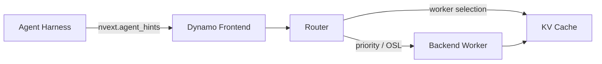

# NVIDIA Dynamo Agent Hints 调研

## 业务背景

Agent 工作负载通常以“长前缀 LLM 调用 → 工具执行 → 携带增长后上下文再次调用”的形式运行。仅兼容 OpenAI 请求格式的推理服务看不到调用的业务紧急程度、预计输出规模和下一轮是否可预测，因而难以针对 Agent 的排队、负载均衡和 KV Cache 复用做跨层优化。

本调研澄清 “Agent Hints” 的具体含义，并评估 harness 应如何向 NVIDIA Dynamo 传递 serving intent。

> 调研快照：2026-09-02。Agent Hints 是快速演进中的 Dynamo 扩展，字段和后端支持应以部署版本文档为准。

## 约束条件

- 以 NVIDIA Dynamo 官方文档和官方 GitHub 仓库为主要证据。
- 区分 prompt、session identity、调度 hint 和强制策略，避免概念混用。
- 只总结公开接口；不把规划中的 TTL、token-range retention 等能力写成已实现功能。

## 待解决问题

- [x] Agent Hints 是什么，解决哪一层的问题？
- [x] 当前公开字段分别如何生效？
- [x] Dynamo Router、vLLM、SGLang、TensorRT-LLM 的支持边界是什么？
- [x] 如何验证 hint 确实产生效果？
- [x] 它与 session ID、sticky routing、prompt 和 SLA 有什么区别？

## 调研与实践

### 1. 术语消歧

公开资料中 “agent hint” 也可能指给模型的自然语言线索、代码 Agent 的规则文件或 UI 提示。本调研中的专有名词 **Agent Hints** 特指 Dynamo 请求体 `nvext.agent_hints`：由 Agent harness 随单次推理请求发送、由 serving stack 消费的可选结构化元数据。

它不进入模型上下文，不直接改变模型行为；其目标是让 orchestrator 知道“如何服务这次请求”，而不是告诉模型“如何回答”。

### 2. 请求契约与数据流

```json
{
  "model": "my-model",
  "messages": [{"role": "user", "content": "Continue the report."}],
  "nvext": {
    "agent_hints": {
      "priority": 5,
      "strict_priority": 1,
      "osl": 1024,
      "speculative_prefill": true
    }
  }
}
```



Frontend 负责解析和归一化扩展；Router 将其用于队列排序、资源估计和 worker 选择；支持的 backend 再将 `priority` 用于引擎调度或 Cache 淘汰。每一层都需要相应配置，发送字段本身不等于功能已启用。

### 3. 字段语义

| 字段 | 类型/默认值 | 当前作用 | 关键边界 |
|---|---|---|---|
| `priority` | `i32` / 未设置 | 跨层软优先级；Dynamo API 语义为数值越高越重要 | Router 需形成等待队列；backend 需启用优先级调度；不是容量预留或硬 SLA |
| `strict_priority` | `u32` / 未设置等价于 0 | Router 等待队列的绝对层级，同层内再使用 FCFS/WSPT 等策略 | 仅影响已经入队的请求，不传给 backend、不抢占运行中请求、不跨 Router 副本排序 |
| `osl` | `u32` / 未设置 | harness 预计的输出 token 数；用于输出 block 跟踪与资源估计 | `--router-track-output-blocks` 等相关能力需要显式启用；估计误差会降低路由质量 |
| `speculative_prefill` | `bool` / `false` | 响应结束后构造可预测的下一轮前缀，以 `max_tokens=1` 的后台请求预热 KV Cache | 仅适合下一轮前缀高度可预测的多轮流；会消耗额外计算，且不是 sticky routing |

`speculative_prefill` 的官方实现流程是：累积本轮完整响应，结束后把 assistant 响应追加到历史，构造并 tokenize 下一轮 prompt，再发出单 token 请求填充 KV Cache。实际下一轮请求命中已预热前缀时，才可能降低 TTFT。

### 4. 优先级分层生效

| 层 | 生效条件 | 可观察结果 |
|---|---|---|
| Router queue | 配置 `--router-queue-threshold`，且负载足以让请求等待 | 高优先级请求更早 dispatch |
| vLLM engine | `--scheduling-policy priority` | Dynamo 将统一优先级转换为 vLLM 所需极性后转发 |
| SGLang engine | `--enable-priority-scheduling` | 引擎内部队列优先调度高优先级请求 |
| SGLang radix cache | `--radix-eviction-policy priority` | 显存压力下先淘汰低优先级叶节点，同优先级按 LRU |
| TensorRT-LLM | 当前没有经 Dynamo 暴露的 per-request engine priority | 仍可在 Router 入队阶段使用优先级 |

Dynamo v1.1.0 起统一为“数值越高优先级越高”。客户端不应为 vLLM 自行取反，Dynamo 会处理后端的极性差异。官方版本说明还指出，EPP / Inference Gateway 对 priority hints 的转发修复需要 Dynamo v1.2.0 或更高版本。

### 5. 与相邻概念的边界

| 概念 | 属性 | 与 Agent Hints 的区别 |
|---|---|---|
| Prompt / system instruction | 模型语义输入 | 进入上下文并影响生成内容；Agent Hints 不进入模型上下文 |
| Session ID | 被动身份 | 用于 trace、join 和可选的 session-aware 能力；hint 表达主动 serving intent |
| Sticky/session-aware routing | 路由策略 | session ID 或 hint 的存在都不会自动启用粘性路由 |
| Admission control / capacity reservation | 强制资源策略 | `priority` 只是调度信号，不预留 GPU、不保证 SLA、不等价于 Kubernetes `PriorityClass` |
| Cache pinning / TTL | Cache 生命周期策略 | 当前公开 Agent Hints 只有优先级影响的保留倾向，没有通用的 TTL 或 token-range pinning 契约 |

### 6. 验证方法

1. 使用逐请求可设置 `nvext` 的压测数据，在同一轮同时发送至少两个优先级层级。
2. 固定模型、输入/输出长度、streaming 模式和 endpoint，避免混入其他变量。
3. 将负载提高到 Router 确实入队，并确认 `dynamo_frontend_router_queue_pending_requests > 0`。
4. 若验证 engine scheduling，单独开启对应 backend flag，不要把 Router 效果误认为 engine 效果。
5. 对比各层级 TTFT 分布，并检查 gateway 是否完整保留 `nvext`；若低数值反而更快，先排查客户端或网关是否错误取反。

对 `osl`，应同时记录预测值与实际输出 token 数，按任务/工具调用类型做误差分布；对 speculative prefill，应比较命中率、额外 prefill 计算量和端到端 TTFT，而不是只看 Cache 是否被填充。

## 决策或结果

- 将 Agent Hints 定义为 **harness 与 inference serving stack 之间的逐请求、结构化、可选优化契约**。
- 接入时先落地 `priority` 与 `osl` 的可观测闭环，再按“下一轮前缀可预测性”灰度启用 `speculative_prefill`。
- 业务优先级到数值的映射应由可信 gateway/harness 统一控制，不能允许不受信任调用方无限抬高优先级。
- 所有 hint 都按 best-effort 处理；可靠性、隔离、配额和 SLA 仍由独立控制面保证。

## Knowledge Extraction（知识沉淀）

- [x] 哪些结论脱离当前任务后仍然成立？——结构化 serving intent、跨层生效条件与验证方法。
- [x] 是否可以更新已有原子知识，而不是创建近似笔记？——现有知识库没有回答此问题的条目。
- [x] 每篇沉淀笔记是否只回答一个可独立检索的问题？
- [x] 业务文档与原子知识是否已建立双向链接？

提炼条目：[Agent Hints 如何把 Agent 意图传递给推理服务？](../../knowledge/agent/integration/agent-hints-serving-contract.md)

## 参考资料

- [NVIDIA Dynamo：Agent Hints](https://docs.nvidia.com/dynamo/agents/agent-hints)
- [NVIDIA Dynamo：NVIDIA Request Extensions (`nvext`)](https://github.com/ai-dynamo/dynamo/blob/main/docs/fern/pages/developer-guide/additional-resources/nvidia-request-extensions-nvext.md)
- [NVIDIA Dynamo：Priority Scheduling](https://docs.nvidia.com/dynamo/agents/priority-scheduling)
- [NVIDIA Dynamo：SGLang for Agentic Workloads](https://docs.nvidia.com/dynamo/dev/knowledge-base/modular-components/backends/sg-lang/agents-on-sg-lang)
- [NVIDIA Dynamo：Full-Stack Optimizations for Agentic Inference](https://docs.nvidia.com/dynamo/dev/digest/agentic-inference)
