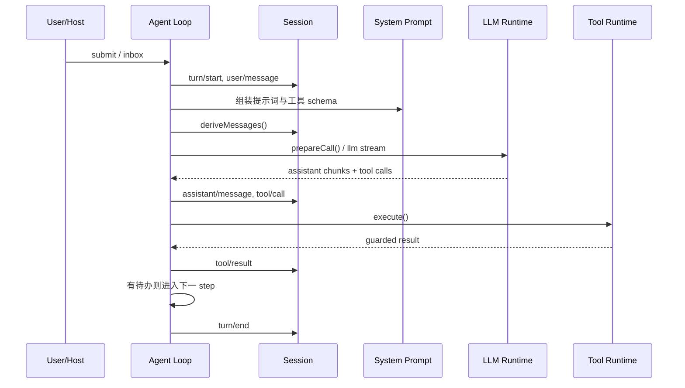

# DeepSeek Harness 简介与架构总览

## 1. DSH 是什么

DeepSeek Harness（命令名 `dsh`）是 DeepSeek AI 开源的 Agent Harness。它不是单纯的模型 API 客户端，而是把模型适配、系统提示词、工具、会话、沙箱、审批、Agent Loop 和 Web UI 组合成一个可运行 Agent 的宿主。

它最鲜明的设计是“一切皆插件”：上述能力都通过 Cordis 插件向共享 `Context` 提供 Service、Event 或可逆 Effect。因此改变配置树即可替换能力实现，通常不需要修改一个特权“核心”。

当前应把它视为开发者预览，而非稳定生产平台：官方明确提示会有破坏兼容的变化，且项目尚未接受安全审计。

## 2. 三层心智模型

### 2.1 发行与组合层

- **Profile**：一种具名运行形态，位于 `$DSH_HOME/profiles/<name>`。官方提供 `web`、`headless`、`sdk`、`sdk-minimal`、`acp`。
- **Bundle**：一组可分发的 Cordis 配置行与插件代码，例如 base、web-app、headless。
- **Patch**：按 id 修改或插入配置行。后应用的层优先，目标行的 `config` 是整体替换，不是深度合并。

生效顺序为：

```text
空配置树
  → profile 声明的 bundles（按顺序）
  → profile/cordis.patch.yml
  → $DSH_HOME/cordis.patch.yml
  → 命令行 --patch（按出现顺序）
  → 运行时强制开关（如 telemetry opt-out）
```

`sdk-minimal` 是例外：它使用一棵独立的显式 SDK 配置树，不叠加 `dsh-base`。

### 2.2 Cordis 运行时层

Cordis 的四个重点：

- `Context`：插件访问服务和注册扩展的入口，同时表示作用域。
- Plugin/Service：插件提供能力，Service 形成插件之间的稳定契约。
- Event/Waterfall：插件通过类型化事件观察或拦截流程。
- Effect/Fiber：注册项与插件生命周期绑定，卸载时自动撤销；外部资源通过 disposer 清理。

配置文件中的先后顺序不应被当作服务启动顺序。插件使用 `inject` 声明依赖，Cordis 在依赖就绪后激活它。

### 2.3 Agent 执行层

核心 Service 如下：

| 包 | `ctx` 键 | 责任 |
|---|---|---|
| `packages/core/session` | `ctx.sessions` | 仅追加 `SessionEvent` 日志与内存会话 |
| `packages/core/system-prompt` | `ctx.systemPrompt` | 组装提示词片段和工具 schema |
| `packages/core/tools` | `ctx.tools` | 工具注册、作用域可见性与执行流水线 |
| `packages/core/agent` | `ctx.agents` | Agent 接口、工厂和活动实例注册表 |
| `packages/core/agent-loop` | `ctx.agentLoop` | 默认 turn/step 驱动器 |
| `packages/llm/llm` | `ctx.llm` | 模型消息、流协议和 Adapter seam |

## 3. 一次请求如何运行

DSH 将一次模型请求及随后的工具调用称为 **step**；一次用户工作从领取输入开始，可能经历多个 step，直到没有待完成工作，整体称为 **turn**。



关键不变式是“模型可见即已记录”：送进模型的上下文必须能从 Session 日志重建。消息历史由日志投影得到，而不是另存一份可漂移的状态。这使恢复、回放、fork、压缩和 UI 轨迹能够基于同一真源工作。

## 4. 扩展能力放在哪里

| 需求 | 首选扩展点 |
|---|---|
| 新模型或公司网关 | 向 `ctx.llm` 注册 Adapter |
| 新模型工具 | `ctx.tools.register()` |
| 工具审批、拒绝、重试或审计 | `tools/pre-execute`、guard、`tools/execute`、`tools/post-execute`、`tools/result` |
| 新持久化后端 | 实现 Session Persistence，而非修改内存 Session |
| 新文件/进程执行环境 | 分别实现 `fs`、`subprocess`、`sandbox` 等 seam |
| 改写模型请求或轮次控制 | `agent/*` waterfall/event |
| 需要重载后保留的新事实 | 扩展 `SessionEventMap` 并提供投影 |
| 新 Web UI 能力 | Host API/route 与 Client slot/plugin |

一个完整 seam 通常包含 Service Definition、Provider 和 Consumer。扩展插件应依赖 Definition，不直接依赖某个具体 Provider。

## 5. 优势、代价与适用场景

优势：组合与替换能力强；生命周期由框架统一收口；持久事件流使行为可追踪；同一核心可承载 Web、Headless、SDK、ACP 等形态。

代价：插件树和配置层增加了定位复杂度；热更新要求严格的资源清理；接口仍快速演进；第三方插件具有接近核心运行时的权限，供应链和权限风险更高。

适合用于研究可组合 Agent Runtime、构建定制 Agent 产品或验证可替换的模型/工具/存储栈。若只需要一次简单模型调用，直接使用模型 SDK 往往更轻。

## 6. 参考

- [官方仓库与运行说明](https://github.com/deepseek-ai/deepseek-harness/tree/76fda729799fe9b3848dbe2c211d4b231032b81e)
- [官方架构文档](https://github.com/deepseek-ai/deepseek-harness/blob/76fda729799fe9b3848dbe2c211d4b231032b81e/docs/architecture.zh.md)
- [官方 Packages 总览](https://github.com/deepseek-ai/deepseek-harness/blob/76fda729799fe9b3848dbe2c211d4b231032b81e/packages/README.zh.md)
- [Cordis Primer](https://github.com/deepseek-ai/deepseek-harness/blob/76fda729799fe9b3848dbe2c211d4b231032b81e/docs/cordis-primer.zh.md)
- [安全说明](https://github.com/deepseek-ai/deepseek-harness/blob/76fda729799fe9b3848dbe2c211d4b231032b81e/SAFETY.zh.md)
