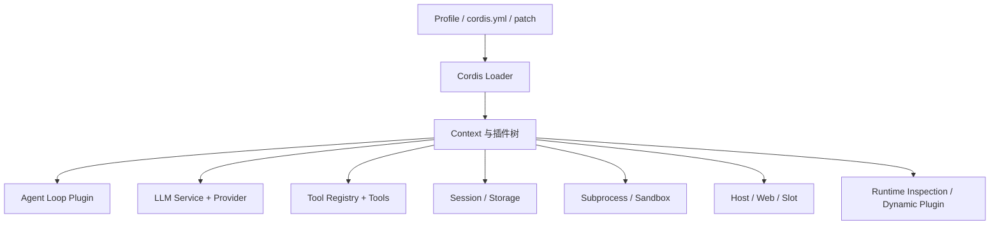
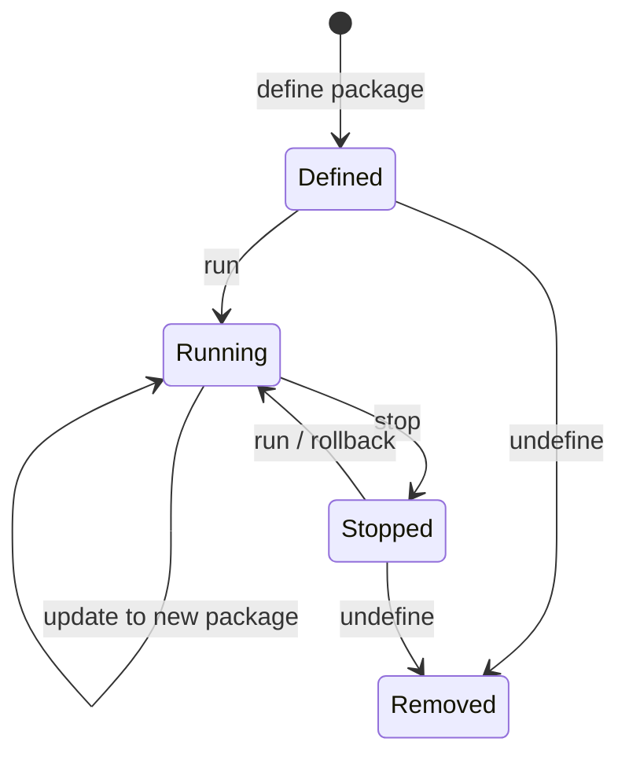
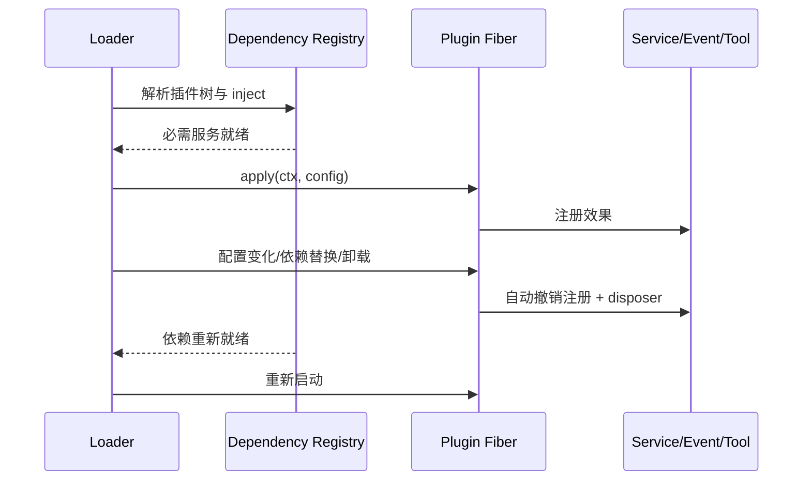

# DeepSeek Harness（DSH）插件系统学习报告

> 本文中的 DSH 指 DeepSeek Harness。内容以 2026-08-25 的官方仓库和文档为准。DSH 仍处于快速演进阶段，示例应与实际检出的版本一起使用。

## 核心结论

- DSH 不是“Agent 加少量 [Hook](../../../knowledge/agent/concepts/hook-mechanism.md)”的插件架构，而是建立在 [Cordis](../../../knowledge/agent/concepts/cordis-plugin-runtime.md) 上的插件化 Agent Runtime：工具、LLM 适配器、文件访问、会话与 Agent Loop 都可由插件提供或替换。
- Cordis 的核心抽象是 `Context`、Plugin、Service、Event、Effect/Fiber 与依赖注入。插件间通过 `ctx` 上的服务契约协作，而不是直接引用具体实现。
- `cordis.yml` 描述插件树与组合关系；配置列表位置不保证启动顺序，真正的启动约束来自 `inject` 声明的服务依赖。
- 生命周期是 DSH 的关键优势：通过 `ctx` 注册的事件、工具等效果随插件卸载自动撤销，外部资源可用 `ctx.effect()` 返回 disposer。
- DSH 还提供运行时检查与动态 Cordis Package 能力，使 Agent 有机会修改自身 Runtime；这同时显著放大了安全、审批、回滚与可观测性要求。

## 1. “一切皆插件”的含义

传统 Coding Agent 常把插件放在外围，只允许监听事件或新增工具。DSH 则把 Harness 本身拆成可组合服务：



这带来两个直接结果：

1. **可替换性强**：同一抽象服务可以挂接不同 provider，组合出 headless、web、minimal 等运行形态。
2. **契约责任更重**：插件不只是“扩展功能”，还可能成为 Runtime 的关键基础设施。服务缺失、生命周期泄漏或配置错误会直接改变 Agent 行为。

## 2. Cordis 核心抽象

### 2.1 Context

`Context` 是插件访问运行时能力的入口。插件用它注册事件、效果和工具，也通过它取得依赖服务。Context 还代表作用域：子上下文中的注册可以随该作用域一起释放。

### 2.2 Plugin

DSH 支持三种插件入口：函数、带 `apply()` 的对象，以及 `Service` 类。最小函数插件为：

```ts
import type { Context } from "@deepseek-ai/cordis"

export const name = "hello-plugin"

export function apply(ctx: Context) {
  console.log("[hello-plugin] loaded")
}
```

对象形式便于把 metadata、依赖和入口放在一起；类形式适合提供可被其他插件消费的 Service：

```ts
import { Service, type Context } from "@deepseek-ai/cordis"

export default class PolicyService extends Service {
  static inject = ["tools"]

  constructor(ctx: Context) {
    super(ctx, "policy")
  }
}
```

官方 Registry API 将插件公共元数据归纳为：

| 字段 | 语义 |
|---|---|
| `name` | 诊断与日志显示名 |
| `Config` | 启动前执行的 Standard Schema 配置校验 |
| `inject` | 插件所需服务；齐备时才加载 |
| `provide` | 插件提供的服务名 |
| `intercept` | 声明消费的服务拦截配置 |

### 2.3 Service 与依赖注入

Service 是插件之间的稳定能力边界。例如 Tool 插件不需要知道工具注册表的具体实现，只声明依赖 `tools` 并调用 `ctx.tools`：

```ts
import type { Context } from "@deepseek-ai/cordis"

export const name = "repo-tool"
export const inject = ["tools"]

export function apply(ctx: Context) {
  ctx.tools.register(/* tool definition */)
}
```

Cordis 等待必须依赖可用后再启动插件。`ctx.inject(deps, callback)` 还能在依赖出现时加载回调、依赖变化时卸载并重新运行。这比依靠 YAML 条目顺序可靠得多。

设计服务时应遵循：

- 服务名稳定、方法最小化、输入输出可类型检查。
- “接口定义”和“provider 实现”分离，允许替换实现。
- 必需依赖用 `inject`；可选能力通过显式 feature detection 处理。
- 不跨过 Service 契约读取另一个插件内部状态。

### 2.4 Event 与 Waterfall

Cordis 同时支持广播事件与 waterfall。广播适合通知多个观察者；waterfall 适合按顺序变换值并允许短路。插件应按语义选择，避免把需要确定返回值的决策做成无序通知。

事件类型可通过 TypeScript declaration merging 扩展。类型声明只提供编译期约束，真正的监听与触发仍需在运行时注册。

### 2.5 Effect、Fiber 与自动清理

通过 `ctx` 注册的监听器、工具和计时任务受到作用域管理，插件卸载时自动撤销。外部资源使用 `ctx.effect()` 显式提供清理函数：

```ts
import type { Context } from "@deepseek-ai/cordis"

export function apply(ctx: Context) {
  ctx.effect(() => {
    const timer = setInterval(() => console.log("heartbeat"), 5_000)
    return () => clearInterval(timer)
  })
}
```

这是一种“注册即绑定生命周期”的模型。它对热更新、动态启停和 provider 切换尤其重要。

## 3. 配置与加载

### 3.1 cordis.yml

Cordis Loader 从 `cordis.yml` 组装插件树。基础条目可以是相对路径或 npm 包名：

```yaml
- name: './hello.ts'
```

给 DSH Web 叠加本地插件时，官方教程使用 patch：

```yaml
- insert:
    - id: hello
      name: '/absolute/path/to/deepseek-harness/scratch-plugin/src/my-plugin.ts'
```

```bash
pnpm dsh web --patch ./scratch-plugin/cordis.yml
```

这里有三个容易踩坑的点：

- patch 不会改变 profile 的模块解析目录，因此教程要求本地插件使用绝对路径。
- 同级插件可以并发启动，YAML 中的先后位置不构成依赖顺序。
- 配置应通过插件导出的 `Config` schema 校验；不要在 `apply()` 内静默接受错误配置。

### 3.2 Profile、Bundle 与 Patch

从部署角度，可把 DSH 组合看成多层配置：基础 bundle 提供共同能力，profile 选择运行形态，patch 叠加局部插件或覆盖配置。最终生效的是组合后的插件树，而不是任意一个文件。

因此排障时要先回答：

1. 当前启动的是哪个 profile？
2. 应用了哪些 patch，覆盖顺序是什么？
3. 插件条目最终是否存在？
4. 它声明的 `inject` 是否都有 provider？
5. 配置 schema、模块解析和启动日志是否报错？

## 4. DSH 包分层

官方仓库的 `packages/` 按能力域组织，包名通常采用 `@deepseek-ai/dsh-*`。主要层次包括：

| 包组 | 职责 |
|---|---|
| `core/` | Session、Prompt、Tool、Agent Service 与具体 Loop |
| `api/` | 远程 BFF 组合与 RPC Gateway |
| `llm/` | LLM 抽象服务与 provider adapter |
| `subprocess/` | 子进程抽象与本地进程树 provider |
| `bundle/` | 可由 `dsh --profile` 使用的组合层 |
| `preset/` | 每个 session 的 Agent 组合 |
| `web/` | Web 能力、搜索/抓取 provider 与模型工具 |
| `extensions/` | Runtime 检查和动态插件能力 |

学习源码时，先从包组 README 找到“包 → ctx service key”的映射，再读具体 provider；否则容易把接口与某个实现混在一起。

## 5. 插件能扩展什么

按照 DSH 的架构，插件可处于多个层次：

| 层次 | 例子 | 影响范围 |
|---|---|---|
| Model | 新增 OpenAI-compatible provider、路由策略 | 推理请求 |
| Tool | 注册模型可调用工具 | Agent 行为空间 |
| Session/Storage | 会话、附件、spill provider | 持久化与上下文 |
| Runtime | Agent Loop、guard、permission、sandbox | 核心执行语义 |
| Interface | Web Host、UI Slot、TUI | 人机交互 |
| Workflow | goal、plan、schedule、subagent | 长任务编排 |

这也是 DSH 与多数 Agent 插件系统最大的差异：插件既可以是叶子扩展，也可以提供底层 Service，甚至参与组合 Agent 本身。

## 6. 动态插件与自修改 Runtime

DSH 的 `extensions/` 域包含对当前 Cordis Runtime 的检查与动态 Package 管理能力。相关工具可检查服务、事件、内置对象和 UI slot，定义不可变 Package，运行、更新、停止或永久移除动态插件。

典型状态转换为：



要注意：动态定义成功不等于已经执行；涉及浏览器侧或高权限能力时还可能进入审批流程。`stop` 保留定义、版本指针和授权，适合临时禁用与回滚；`undefine` 是永久删除，不应被当作普通停止使用。

自修改能力建议视为高风险、显式 opt-in 功能：

- Package 不可变，以新版本更新，保留可审计历史。
- Host 与 Client 两侧权限分开审查。
- 激活前读取真实 Runtime surface，不猜测 service/event/slot 名称。
- 所有激活、更新、回滚和拒绝都进入审计日志。
- 默认禁用网络、文件系统和任意进程能力，按最小权限授权。

## 7. 生命周期与热更新



一个可热更新插件必须满足：

- `apply()` 可重复执行，不依赖未清理的全局单例。
- 每个连接、Worker、监听器、计时器都有作用域或 disposer。
- Service 切换时，消费者不会继续保存旧 provider 的引用。
- 外部副作用具有幂等键或补偿机制。
- schema 变化有版本迁移，不直接解释旧配置。

## 8. 安全与可靠性

DSH 插件可以接近 Runtime 核心，其安全边界比普通 UI 插件更敏感。主要风险包括：

| 风险 | 例子 | 控制措施 |
|---|---|---|
| 供应链 | npm 包更新注入恶意代码 | 锁版本、审查源码、生成 SBOM |
| 权限扩大 | Tool 可读写任意路径或执行命令 | capability allowlist、工作区边界 |
| 依赖劫持 | 伪造同名 Service provider | service 所有权、启动清单与签名 |
| 生命周期泄漏 | unload 后连接/进程仍存活 | `ctx.effect()`、卸载集成测试 |
| 配置覆盖 | patch 意外覆盖 profile 安全策略 | 输出并审查最终组合配置 |
| 自修改 | Agent 动态加载未经审查的 Package | 默认关闭、人工审批、版本化回滚 |
| Prompt Injection | 外部内容诱导调用敏感工具 | source/sink 标记、工具策略与审批 |

插件测试至少包含：配置 schema、缺失依赖、正常加载、卸载清理、provider 替换、并发事件、错误隔离和权限拒绝路径。

## 9. 最小实践路线

建议按 Cordis 抽象逐层练习：

1. 写 `hello` 函数插件，通过 patch 加载到 Web profile。
2. 用 `ctx.effect()` 管理计时器，验证卸载时自动停止。
3. 提供一个 `greeter` Service，并写另一个 `inject` 它的消费者插件。
4. 分别实现广播 Event 和 waterfall，观察组合顺序与短路。
5. 注册一个无副作用 Tool，再增加 schema 和错误处理。
6. 替换同一 Service 的 provider，验证消费者重载与旧资源释放。
7. 最后研究 runtime inspect/dynamic package，不要从高权限自修改开始。

验收清单：

- [ ] 能从最终 `cordis.yml` 组合定位每项能力由哪个插件提供。
- [ ] 插件依赖通过 `inject` 表达，不依赖条目顺序。
- [ ] 配置失败时插件不会带着部分副作用启动。
- [ ] reload/unload 后无监听器、进程、计时器和连接泄漏。
- [ ] provider 替换后消费者使用新实例。
- [ ] Tool 与动态 Package 的权限、审批、审计和回滚路径均被测试。

## 10. 与 Agent OS 接入的关系

DSH 可作为“可组合 Agent Runtime”接入 Agent OS，而不只是一个 CLI 客户端。推荐映射如下：

| Agent OS 能力 | DSH 接入点 |
|---|---|
| Model Gateway | LLM Service provider |
| Tool Gateway | Tool registry/provider |
| Sandbox | subprocess/sandbox Service provider |
| Session Store | Session/attachment/spill provider |
| Observability | Event 监听与 service wrapper |
| Workflow | goal/plan/schedule/subagent 插件 |
| Web/Console | Host、API、UI slot 插件 |

接入时应维护一份“Agent OS 契约 → DSH service key → provider 包”的映射表，并把 profile/patch 组合固化为可版本化部署制品。不要让上层系统依赖具体插件类或包内结构，否则会失去 DSH 服务抽象带来的可替换性。

## 11. 与 OpenCode 插件系统的关键差异

| 维度 | OpenCode | DSH |
|---|---|---|
| 核心模型 | 宿主 + Hook/能力扩展 | 插件组合成 Harness |
| 依赖组织 | 加载顺序与宿主上下文 | Service registry + `inject` |
| 替换深度 | 主要扩展 Tool、Hook、Catalog | 可替换 Model、Storage、Loop、UI 等 |
| 生命周期 | 经典 Hook；V2 强化 scoped registration | Cordis Effect/Fiber 原生管理 |
| 配置 | `opencode.json(c)` 与插件目录 | profile/bundle/patch + `cordis.yml` 插件树 |
| 动态自修改 | 不是经典 API 的中心能力 | 有专门 runtime inspect/dynamic package 子系统 |
| 学习重点 | Hook 契约、顺序、SDK 兼容性 | Service 契约、依赖注入、作用域与组合 |

简化理解：OpenCode 是“在一个既定 Agent 上挂扩展”，DSH 是“用插件搭出一个 Agent”。

## 12. 遗留问题

- [ ] 固定一个 DSH commit，生成完整 package → service key → provider 映射。
- [ ] 实测 profile、bundle、home patch、runtime overlay 的最终覆盖规则。
- [ ] 验证插件启动失败对兄弟插件、依赖消费者和整棵子树的影响。
- [ ] 走读 Tool 注册 DSL、permission 与 subprocess/sandbox 的真实调用链。
- [ ] 评估动态 Cordis Package 的 VM 隔离边界与 Client 侧审批模型。
- [ ] 为 Agent OS 实现一个最小 Service provider，并完成热替换与泄漏测试。

## Knowledge Extraction（知识沉淀）

- [x] 已抽取通用知识：[Cordis 插件运行时](../../../knowledge/agent/concepts/cordis-plugin-runtime.md)
- [x] 已关联对比概念：[Hook 扩展机制](../../../knowledge/agent/concepts/hook-mechanism.md)
- [x] 原子知识已通过“应用记录”反向链接本报告。

## 参考

- [DeepSeek Harness 官方仓库](https://github.com/deepseek-ai/deepseek-harness)
- [Cordis Tutorial](https://github.com/deepseek-ai/deepseek-harness/blob/master/docs/cordis-tutorial/index.md)
- [Your First Harness Plugin](https://github.com/deepseek-ai/deepseek-harness/blob/master/docs/user/develop/basic/index.md)
- [Cordis Registry API](https://github.com/deepseek-ai/deepseek-harness/blob/master/docs/cordis-api/registry.md)
- [DSH Packages Overview](https://github.com/deepseek-ai/deepseek-harness/blob/master/packages/README.md)
- [Runtime Extensions Overview](https://github.com/deepseek-ai/deepseek-harness/blob/master/packages/extensions/README.md)
- [Plugin Config Catalog](https://github.com/deepseek-ai/deepseek-harness/blob/master/docs/config-catalog.md)
