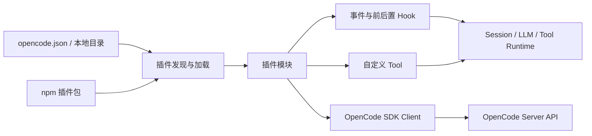
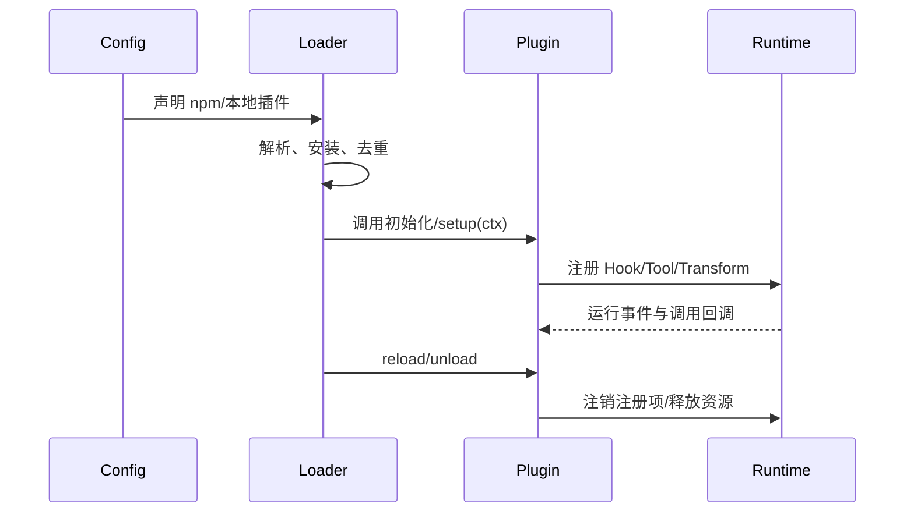

# OpenCode 插件系统学习报告

> 研究对象：Anomaly OpenCode。本文以 2026-08-25 的官方文档与公开源码为准；V2 插件 API 仍处于 beta，接口可能继续变化。

## 核心结论

- OpenCode 插件是运行在宿主进程内的 JavaScript/TypeScript 模块，不是独立进程或安全沙箱。插件拥有较强能力，应按可信代码管理。
- 当前需要区分两代接口：稳定文档中的经典 [Hook](../../../knowledge/agent/concepts/hook-mechanism.md) API，以及 V2 文档中的 `Plugin.define()` + capability/transform API。新项目可学习 V2，但生产使用必须锁版本。
- 经典插件通过返回 Hook 表扩展行为；V2 插件通过受限 `ctx` 能力注册工具、转换 catalog，并拦截工具或模型调用，生命周期与注销语义更明确。
- 插件来源包括全局/项目配置、全局/项目插件目录和 npm 包。加载顺序确定，但多个 Hook 会依次执行，前一个插件的修改可被后一个观察到。
- OpenCode 插件适合做工具扩展、审计、策略拦截、外部系统集成和上下文增强；它不是 MCP 的替代品，二者分别解决“宿主内扩展”和“跨进程工具协议”。

## 1. 定位与边界

OpenCode 的插件系统位于 Agent Runtime 内部。插件初始化时得到宿主提供的上下文，并在约定的扩展点上注册逻辑。



需要特别区分以下扩展机制：

| 机制          | 运行位置                       | 主要作用           | 典型场景              |
| ----------- | -------------------------- | -------------- | ----------------- |
| Plugin      | OpenCode 进程内               | 改写行为、监听事件、注册工具 | 策略、审计、上下文注入       |
| Custom Tool | Plugin 或 `.opencode/tools` | 暴露模型可调用函数      | 内部 API、领域操作       |
| MCP Server  | 独立进程或远端                    | 用标准协议提供工具/资源   | 跨 Agent 复用、隔离集成   |
| Command     | OpenCode 配置/插件             | 把固定模板暴露为用户命令   | `/review`、标准工作流入口 |
| Skill       | 文件化指令与资源                   | 按需注入工作方法和知识    | 可复用流程、规范与模板       |

判断原则：若能力需要深度介入 OpenCode 生命周期，优先 Plugin；若能力要被多个 Agent/客户端复用，优先 MCP；若只是增加一个模型工具，先考虑 Custom Tool。

## 2. 经典插件 API

### 2.1 插件入口

经典插件导出一个或多个异步函数。初始化参数包含 `project`、`client`、`$`、`directory`、`worktree` 等宿主能力，返回值是 Hook 与工具定义：

```ts
import type { Plugin } from "@opencode-ai/plugin"

export const AuditPlugin: Plugin = async ({ client, directory }) => {
  await client.app.log({
    body: {
      service: "audit-plugin",
      level: "info",
      message: `loaded for ${directory}`,
    },
  })

  return {
    "tool.execute.before": async (input, output) => {
      // 可检查并按契约修改 output.args
    },
    event: async ({ event }) => {
      // 统一观察运行时事件
    },
  }
}
```

初始化上下文的含义：

| 字段 | 用途 | 注意事项 |
|---|---|---|
| `project` | 当前项目元数据 | 不要假设所有运行模式都有相同项目状态 |
| `directory` | 当前工作目录 | 用于路径解析与作用域判断 |
| `worktree` | Git worktree 根目录 | 可能与 `directory` 不同 |
| `client` | 类型化 OpenCode SDK Client | 推荐用它访问宿主 API 和结构化日志 |
| `$` | Bun Shell | 能执行系统命令，属于高权限能力 |

### 2.2 加载来源与优先顺序

经典 API 的官方文档给出四类来源，依次为：

1. 全局配置 `~/.config/opencode/opencode.json` 中声明的 npm 插件。
2. 项目配置 `opencode.json` 中声明的 npm 插件。
3. 全局目录 `~/.config/opencode/plugins/` 中的本地插件。
4. 项目目录 `.opencode/plugins/` 中的本地插件。

npm 插件由 OpenCode 启动时通过 Bun 安装，并缓存到 `~/.cache/opencode/node_modules/`。同名同版本 npm 插件会去重；本地模块与名称相近的 npm 插件仍会分别加载。

这意味着加载顺序也是策略优先级的一部分。多个 Hook 串行运行时，后加载插件可能看到或覆盖前面插件对可变输出的修改，因此应避免多个插件无约束地写同一字段。

### 2.3 常见 [Hook](../../../knowledge/agent/concepts/hook-mechanism.md) 类型

Hook 的准确集合应以目标版本的 `@opencode-ai/plugin` 类型定义为准，常见能力可归为：

| 类别 | 代表性 Hook/能力 | 用途 |
|---|---|---|
| 生命周期与事件 | `event` | 观察 session、message、file、permission 等事件 |
| 工具执行 | `tool.execute.before/after` | 参数校验、审计、结果加工 |
| Shell | `shell.env` | 为命令注入环境变量 |
| 权限 | `permission.ask` | 自动批准、拒绝或改写权限决策 |
| LLM 请求 | `chat.params`、`chat.headers` | 调整模型参数或请求头 |
| 上下文 | `experimental.chat.messages.transform` | 在送入模型前变换消息 |
| 压缩 | `experimental.session.compacting` | 向压缩摘要注入关键状态或替换提示词 |

带 `experimental` 的 Hook 不应作为稳定契约。升级 OpenCode 时应通过类型检查与集成测试重新确认。

### 2.4 自定义工具

插件可通过 `tool()` 定义类型安全的模型工具：

```ts
import { type Plugin, tool } from "@opencode-ai/plugin"

export const RepoInfoPlugin: Plugin = async () => ({
  tool: {
    repo_info: tool({
      description: "Return repository-specific metadata",
      args: {
        key: tool.schema.string(),
      },
      async execute({ key }, context) {
        return `${key}: ${context.worktree}`
      },
    }),
  },
})
```

工具名与内置工具冲突时，插件工具优先。这既能用于替换默认实现，也会造成供应链和误覆盖风险，因此团队插件应使用清晰命名空间，并对冲突做启动时检查。

## 3. V2 插件 API

V2 把插件从“返回一个 Hook 对象”演进为“通过受限 capability context 注册变换和拦截器”。典型入口如下：

```ts
import { Plugin } from "@opencode-ai/plugin"

export default Plugin.define({
  id: "com.example.repo-policy",
  setup: async (ctx) => {
    await ctx.command.transform((commands) => {
      commands.update("review", (command) => {
        command.description = "Review correctness and missing tests"
      })
    })
  },
})
```

V2 的重要设计点：

- 每个插件有唯一 `id`，便于查询、替换和诊断。
- 插件只使用 `ctx` 暴露的能力，不直接访问 OpenCode 私有 Core Service。
- catalog/agent/model/command/tool 等域通过 `transform()` 组合修改。
- Runtime Hook 按插件与注册顺序串行执行；在途调用使用开始时的注册快照。
- 注册项有生命周期，插件卸载后应恢复之前的有效状态。
- Effect 入口提供作用域资源管理；finalizer、fiber 和注册项会随插件 reload/unload 释放。

V2 配置支持 npm 包、显式本地路径及带 `options` 的对象形式。可用 `opencode2 api get /api/plugin` 检查激活的插件 ID。由于 V2 文档明确标注 beta，不应在未锁定 OpenCode 与 `@opencode-ai/plugin` 版本的情况下发布长期维护插件。

## 4. 生命周期与执行模型

### 4.1 启动阶段



经典接口的工程重点是避免初始化副作用泄漏；V2/Effect 更强调作用域化注册与自动清理。不论使用哪代 API，插件都应做到：初始化幂等、显式清理外部资源、避免在模块顶层启动不可控任务。

### 4.2 错误与组合

- 插件初始化失败应写结构化日志，且不要让错误信息携带密钥。
- Hook 改写输入前先复制或严格按官方给定的 mutable output 操作，避免依赖内部对象形状。
- 多插件写同一字段时，建立所有权规则；例如“安全插件只收紧，业务插件只补充”。
- 耗时逻辑不要阻塞高频 Hook；网络调用要设置超时、取消和失败降级。

## 5. 安全模型

OpenCode 插件不是受限扩展。一个插件可能接触源码、会话、模型输入、工具参数、环境变量，并可通过 `$` 执行命令。因此安装插件与执行任意第三方代码在风险上接近。

最低安全基线：

1. npm 依赖锁定精确版本，提交 lockfile，并审查安装脚本。
2. 项目级插件进入代码评审；禁止从不可信分支自动加载。
3. 密钥仅通过最小权限环境或宿主凭据能力提供，日志默认脱敏。
4. 工具参数使用 schema 校验；文件路径规范化后再做工作区边界检查。
5. 外部网络、Shell 和写文件操作建立 allowlist，并记录审计事件。
6. 升级 OpenCode 后运行加载、Hook 顺序、权限和卸载清理测试。

## 6. 最小实践路线

建议按以下顺序学习：

1. 创建 `.opencode/plugins/hello.ts`，只写结构化启动日志。
2. 增加只读事件 Hook，观察一次完整 session 的事件流。
3. 创建一个无副作用的自定义工具，练习 schema、执行上下文与错误返回。
4. 增加 `tool.execute.before` 策略检查，验证多插件执行顺序。
5. 对同一能力分别实现 Plugin Tool 与 MCP Server，比较部署和隔离边界。
6. 最后再试 V2 transform/Effect，并测试 reload 后资源是否释放。

验收清单：

- [ ] 全局与项目插件均能被发现，加载顺序符合预期。
- [ ] 插件初始化失败有可定位日志，不影响无关插件。
- [ ] 工具参数非法时失败明确，不执行副作用。
- [ ] 权限、Shell、文件与网络路径都有最小权限控制。
- [ ] reload/unload 后没有残留监听器、进程、计时器或连接。
- [ ] 目标 OpenCode 与插件 SDK 版本已锁定并写入兼容矩阵。

## 7. 与 Agent OS 接入的关系

如果把 OpenCode 接入统一 Agent OS，插件最适合承担“OpenCode 进程内适配器”：

- 将 OpenCode session/tool 事件转换成统一遥测事件。
- 在工具执行前后挂接组织级权限、审计和脱敏策略。
- 注入 Gateway 追踪 ID、租户信息和请求头。
- 将 OpenCode 特有能力封装为统一 Tool 或 RPC，而非让上层直接依赖内部结构。

不建议让插件同时承担远程协议、持久化与复杂调度。跨进程能力应下沉到 MCP、Gateway 或独立服务，插件只保留薄适配层。这样可降低 OpenCode API 变化对平台的影响。

## 8. 遗留问题

- [ ] 选定一个 OpenCode 版本，基于其 SDK 类型生成完整 Hook 清单。
- [ ] 验证经典 API 与 V2 API 在同一进程中的共存和迁移策略。
- [ ] 实测一个 Hook 抛错是否中断后续 Hook，以及不同类别 Hook 的超时行为。
- [ ] 验证 npm 插件缓存、版本更新与离线部署流程。
- [ ] 为 Agent OS 编写最小审计插件 PoC，并记录事件字段映射。

## Knowledge Extraction（知识沉淀）

- [x] 已抽取通用知识：[Hook 扩展机制](../../../knowledge/agent/concepts/hook-mechanism.md)
- [x] 已建立与相关机制的链接：[Cordis 插件运行时](../../../knowledge/agent/concepts/cordis-plugin-runtime.md)
- [x] 原子知识已通过“应用记录”反向链接本报告。

## 参考

- [OpenCode 官方插件文档（经典 API）](https://opencode.ai/docs/plugins/)
- [OpenCode V2 插件文档](https://opencode.ai/v2/docs/build/plugins)
- [OpenCode 官方仓库](https://github.com/anomalyco/opencode)
- [OpenCode Plugin SDK 源码](https://github.com/anomalyco/opencode/tree/dev/packages/plugin)
