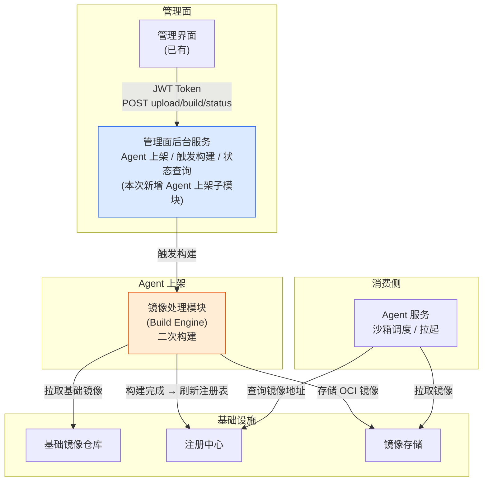
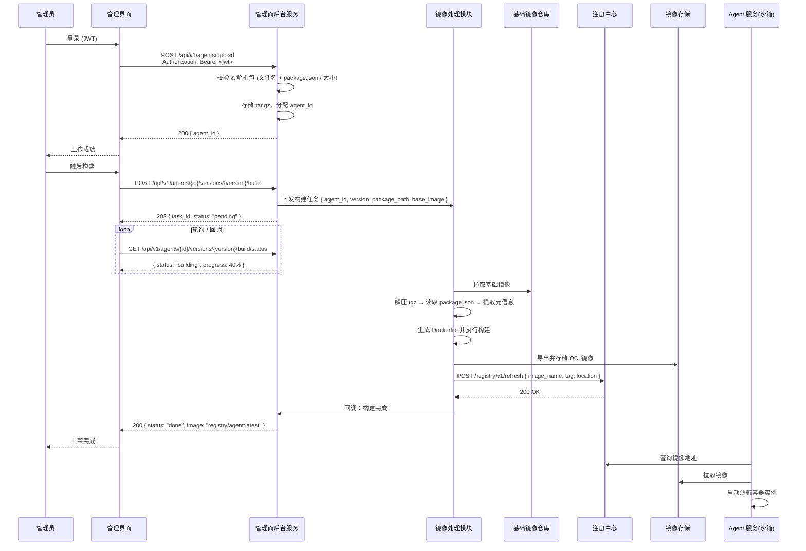
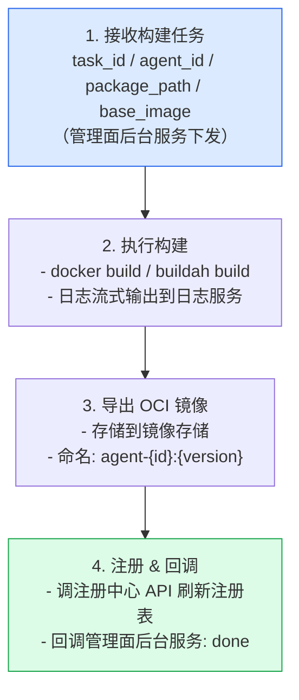

# 三方 Agent 上架设计说明书

> 版本：v1.0  
> 状态：MVP 已实现（见 `control-panel/backend/app/image_process/`）

---

## 1. 概述

### 1.1 项目背景与目标

在 Agent 服务平台的运营过程中，管理员需将第三方 AI 编程 Agent（如 Claude Code、OpenCode 等）以离线方式集成到平台中。本文档定义一套标准化的**三方 Agent 上架流程**：管理员通过管理界面上传 Agent 离线软件包，系统自动完成二次镜像构建，生成符合 OCI 标准的容器镜像，并同步至注册中心，供下游 Agent 服务（沙箱）按需拉起。

### 1.2 适用场景

| 场景 | 说明 |
|------|------|
| 内网 / 隔离环境 | 无外网访问能力的开发机或容器集群 |
| 企业统一管控 | 管理员集中管理 Agent 版本与下发策略 |
| Agent OS 沙箱镜像预装 | 多租户共享同一 Agent 镜像，由沙箱按用户实例化 |

### 1.3 术语表

| 术语 | 说明 |
|------|------|
| **Agent 软件包** | 管理员上传的 `.tgz` / `.tar.gz` 压缩包，内含 Agent 离线安装包（npm 格式）。元信息由系统自动解析提取 |
| **基础镜像** | 预制的操作系统 + 运行时依赖（Node.js、Git、sshd 等）的 OCI 镜像，随系统版本升级迭代 |
| **二次构建** | 将 Agent 软件包与基础镜像叠加，生成可直接运行的 OCI 格式镜像 |
| **OCI** | Open Container Initiative，容器镜像工业标准格式 |
| **注册中心** | 仅维护镜像注册表（agent_id ↔ 镜像地址映射），不持有镜像文件本身。供沙箱调度服务查询可用镜像 |
| **沙箱** | 为每个用户启动的隔离容器实例，基于 Agent 镜像运行 |

---

## 2. 系统架构

### 2.1 整体架构图



### 2.2 组件职责

| 组件 | 职责 | 输入 | 输出 |
|------|------|------|------|
| **管理界面** | 管理员操作入口；上传包、触发构建、查看状态 | 用户操作 | HTTP 请求 (JWT) |
| **管理面后台服务** | 提供管理面统一入口；Agent 上架子模块负责接收上传、校验、管理构建任务生命周期 | HTTP 请求 + tar.gz | 状态码 + JSON 响应 |
| **镜像处理模块（Build Engine）** | 解压包 → 读取包内 package.json → 叠加基础镜像 → 导出 OCI → 存储 → 回调注册 | 构建任务指令 | OCI 镜像 + 状态回调 |
| **基础镜像仓库** | 提供预制的运行环境镜像 | — | OCI 镜像 (pull) |
| **注册中心** | 统一管理上架后的 Agent 镜像元信息 | 镜像元数据 | 注册表查询 |
| **Agent 服务（沙箱）** | 查询注册中心获取镜像地址，从镜像存储拉取镜像，为终端用户启动隔离实例 | 注册表查询结果 | 运行中的容器 |

### 2.3 核心流程时序图



---

## 3. 上传包规范

### 3.1 上传流程

管理员上传 npm 官方 `.tgz` 包后，系统自动解析文件名提取元信息，管理员在 UI 中确认并补充必要字段即可，**无需手工编写任何清单文件**。

```
管理员操作                                  系统行为
─────────────────────────────────────────────────────────
① 从 npm registry 下载 .tgz 包
   例: opencode-linux-arm64-1.17.14.tgz

② 在管理界面上传该 .tgz                 → 存入包存储，返回包 ID
                                          →
③ 系统弹出确认表单                         ← 从文件名 + 包内提取元信息
   ├─ Agent 名称: [opencode]   ← 已填      - 文件名解析 → name / version / platform
   ├─ 版本:      [1.17.14]    ← 已填      - package.json: display_name / entrypoint
   ├─ 平台:      [linux-arm64] ← 已填
   ├─ 入口命令:   [npx opencode] ← 已填
   └─ 显示名称:   [OpenCode]    ← 可改

④ 管理员确认 / 修改后提交                  → 写入 Agent 记录，状态: uploaded
```

### 3.2 自动提取规则

系统从上传包的文件名和包内容中自动提取以下信息：

| 元信息 | 来源 | 规则 |
|--------|------|------|
| `name` (agent_id) | 文件名第一段 | `opencode-linux-arm64-1.17.14.tgz` → `opencode` |
| `version` | 文件名最后一段 | `opencode-linux-arm64-1.17.14.tgz` → `1.17.14` |
| `platform` | 文件名中间段 | `opencode-linux-arm64-1.17.14.tgz` → `linux-arm64` |
| `platform` 映射 | 平台映射表 | `linux-x64` → `linux/amd64`, `linux-arm64` → `linux/arm64` ... |
| `display_name` | 包内 `package.json` → `name` 或 `displayName` | — |
| `entrypoint` | 包内 `package.json` → `bin` 字段或已知默认值 | `bin: { "opencode": "..." }` → `opencode` |
| `runtime` | 文件后缀 + 包内容判断 | `.tgz` 内含 `node_modules/` → `nodejs` |
| `runtime_version` | 基础镜像当前版本 | 固定为 Node.js 22（基础镜像提供） |

管理员可在确认表单中覆盖 `display_name` 和 `entrypoint`；`name`、`version`、`platform` 由文件名唯一确定，不可改。

### 3.3 文件名解析规范

npm 平台特定包的文件名遵循约定格式：

```
{name}-{platform}-{version}.tgz

示例:
  opencode-linux-arm64-1.17.14.tgz    → opencode, linux-arm64, 1.17.14
  opencode-linux-x64-1.17.14.tgz           → opencode, linux-x64, 1.17.14
  opencode-win32-x64-1.17.14.tgz           → opencode, win32-x64, 1.17.14
  opencode-darwin-arm64-1.17.14.tgz        → opencode, darwin-arm64, 1.17.14
```

解析逻辑：从文件名尾部向前取三段——`{version}.tgz`（版本号 + 扩展名）、`{platform}`（OS-arch 标识）、`{name}`（剩余部分）。

因为 npm 包名可能含多个 `-`（如 `claude-code-linux-x64-2.1.89.tgz`），系统优先匹配已知的 platform 枚举值来定位分段边界。

| 平台标识 | 映射目标 |
|----------|----------|
| `linux-x64` | `linux/amd64` |
| `linux-arm64` | `linux/arm64` |
| `linux-x64-musl` | `linux/amd64-musl` |
| `win32-x64` | `windows/amd64` |
| `darwin-arm64` | `darwin/arm64` |

> RPM / DEB 等其他格式的文件名解析规则后续补充，当前 MVP 阶段仅支持 `.tgz`。

#### 3.3.1 解析阶段风险

文件名解析仅发生在上传阶段，无法通过解析的包**直接拒绝**，不进入后续流程。

**非法文件名**：

| 场景 | 示例 | 拒绝原因 | 处理 |
|------|------|------|------|
| 缺少版本段 | `opencode-linux-x64.tgz` | 无法确定版本号 | 400，拒绝上传 |
| 缺少平台段 | `opencode-1.17.14.tgz` | 无法确定目标平台 | 400，拒绝上传 |
| 平台不在白名单 | `opencode-solaris-sparc-1.17.14.tgz` | 系统不支持该平台 | 400，拒绝上传 |
| 疑似拼写错误 | `opencode-linux-x8-1.17.14.tgz` | 模糊匹配失败 | 400，拒绝上传 |
| 文件名不含 `-{platform}-{version}` 结构 | `agent_package.tgz` | 完全无法解析 | 400，code=40001 |

**错误包名（能解析但不匹配）**：

| 场景 | 示例 | 风险 | 处理 |
|------|------|------|------|
| 名称不在已知 Agent 列表中 | `unknown-agent-linux-x64-1.0.0.tgz` | 非受支持的 Agent | 400，拒绝上传 |
| 文件名版本与包内 `package.json` 版本不一致 | 文件名标 `2.1.89`，包内是 `2.1.88` | 实际内容与声明不符 | 上传阶段检测到即 400 拒绝 |
| 后缀非 `.tgz` | `opencode-linux-x64-1.17.14.tar.gz` | 格式不匹配（文件名包含冗余 `-`） | 400，拒绝。建议管理员先 `mv` 重命名为 `.tgz` |
| 后缀非 `.tgz` | `opencode-linux-x64-1.17.14.deb` | deb 格式当前不支持 | 400，后续扩展后再开放 |

> 解析阶段只负责**格式校验 + 提取基本信息**，不保证包内容正确运行，后者由构建阶段兜底。

### 3.4 目录结构约定

从 npm registry 下载的 `.tgz` 包解压后为标准 npm 包结构：

```
opencode-linux-arm64-1.17.14.tgz
  └── package/                          ← 解压后顶层
      ├── package.json                  ← 含 name, version, bin 等元信息
      ├── package-lock.json
      └── node_modules/
          └── ...
```

### 3.5 支持的 Agent 列表

| Agent ID | 显示名称 | 运行时 | 入口命令 | npm 包前缀 |
|----------|------|:---:|------|------|
| `claude-code` | Claude Code | Node.js 22 | `claude` | `@anthropic-ai/claude-code` |
| `opencode` | OpenCode | Node.js 22 | `opencode` | `opencode` |

> agent_id 由文件名自动解析，上表中 agent_id 与实际 npm 包前缀的映射关系维护在后台 Agent 元信息配置中。后续新增 Agent 只需新增配置条目，无需改代码。

### 3.6 包大小限制

| 项目 | 值 |
|------|-----|
| 单包上限 | 500 MB（预留 Claude Code npm offline 完整包空间） |
| 请求体上限 | 500 MB |
| 存储空间告警阈值 | 镜像存储使用率 > 80% 告警 |

---

## 4. 基础镜像设计

### 4.1 基础镜像依赖矩阵

基础镜像由系统统一维护，随系统升级迭代。**OS 版本由系统的整体 OS 策略决定，不在基础镜像中单独指定**。

基础镜像规约：`agent-base:1.0`

| 依赖 | 版本 | 用途 | 安装方式 |
|------|------|------|----------|
| openEuler | 24.03 | OS 底座 | FROM openeuler/openeuler:24.03 |
| Node.js | 24.18.0（通过 nvm 安装） | Claude Code / OpenCode 运行时 | nvm + npmmirror 镜像 |
| npm | 随 Node 24 内置 | npm install | 随 Node.js |
| OpenSSH Server | 系统自带 | 沙箱 SSH 交互入口 | yum install |
| curl | 系统自带 | 下载 nvm / 连通性诊断 | yum install |
| ca-certificates | 系统自带 | HTTPS 通信 | yum install |
| findutils | 系统自带 | `find` 命令（提取可执行文件） | yum install |

### 4.2 多 Agent 运行环境兼容方案

基础镜像统一提供 Node.js 运行时，同时支撑 Claude Code 和 OpenCode 运行。**每个 Agent 独立构建为一个镜像**，不合并打包：

```
基础镜像 (agent-base:1.0)
   │
   ├── 二次构建 ──→ agent-claude-code:2.1.89  （独立镜像）
   │                   └── /root/.local/bin/claude
   │
   ├── 二次构建 ──→ agent-opencode:1.17.14     （独立镜像）
   │                   └── /root/.local/bin/opencode
   │
   └── 二次构建 ──→ agent-claude-code:2.2.0    （同一 Agent 不同版本，独立镜像）
                       └── /root/.local/bin/claude
```

Agent 镜像内部结构示例：

```
{id}:{version}
  ├── /root/.local/bin/{cli}     ← 从 tgz 提取的可执行文件
  ├── ...                         ← 继承基础镜像的运行时环境（Node.js、sshd 等）
```

> 每个 Agent 独立镜像，沙箱按需选择拉取具体版本。多租户共享同一镜像，实例化时由沙箱注入用户专属配置。

### 4.3 MCP 服务说明

#### 4.3.1 概念与角色

MCP（Model Context Protocol）是 AI Agent 调用外部工具/数据的标准协议。在本地沙箱场景下：

```
Agent 进程 (Claude Code / OpenCode) → 读取 ~/.claude/mcp.json
  ├── 启动子进程 → filesystem MCP Server → 读写容器内文件
  ├── 启动子进程 → git MCP Server       → 操作代码仓库
  └── 启动子进程 → shell MCP Server     → 执行 bash 命令
```

MCP Server 在沙箱中以子进程形式运行，通过 **stdio** 与 Agent 通信。**容器销毁时 MCP Server 一并退出，无状态。**

#### 4.3.2 预装清单（基础镜像内置）

| MCP Server | npm 包 | 版本 | 必要性 | 说明 |
|------------|--------|------|:---:|------|
| filesystem | `@anthropic-ai/mcp-server-filesystem` | 锁定 | 必须 | 所有 Agent 写代码都需要文件读写 |
| git | `@anthropic-ai/mcp-server-git` | 锁定 | 建议 | 代码版本管理 |
| shell | `@anthropic-ai/mcp-server-shell` | 锁定 | 建议 | 执行构建/测试等 bash 命令 |

**离线安装方式**：在基础镜像构建阶段，通过 `npm install -g` 安装到 `/opt/mcp-servers/`，Agent 启动时直接引用本地路径，避免运行时 `npx` 联网下载。

#### 4.3.3 MCP 配置注入方式

Agent 的 MCP 配置文件 (`~/.claude/mcp.json`) 在沙箱启动时由平台侧动态注入，指向基础镜像内预装的 MCP Server 路径：

```json
{
  "mcpServers": {
    "filesystem": {
      "command": "node",
      "args": ["/opt/mcp-servers/filesystem", "/workspace"]
    },
    "git": {
      "command": "node",
      "args": ["/opt/mcp-servers/git", "--repository", "/workspace"]
    }
  }
}
```

> MCP 配置**由沙箱启动编排层负责注入**，不属于 Agent 上架流程的范围，此处仅声明基础镜像所需预装的 MCP 依赖。

### 4.4 镜像版本与系统升级策略

- 基础镜像名：`agent-base:1.0`
- 每次系统升级时重新构建基础镜像，Agent 元信息中声明的依赖若无法满足则拒绝上架
- 已上架 Agent 不受基础镜像升级影响（镜像已固化），如需升级需重新上架新版本

---

## 5. 镜像处理模块（二次构建）

### 5.1 构建流程



### 5.2 二次打包 Dockerfile

以 Agent 元信息为例，Dockerfile 生成规则如下：

```dockerfile
# agent.Dockerfile（使用 Docker build arg）
ARG BASE_IMAGE=agent-base:1.0
FROM ${BASE_IMAGE}
ARG HOME_DIR=/root
ARG TGZ_FILE
ARG AGENT_ID
ARG VERSION
ARG CMD

WORKDIR ${HOME_DIR}
COPY ${TGZ_FILE} /tmp/
RUN mkdir -p /tmp/agent-package \
    && tar xzf /tmp/${TGZ_FILE} -C /tmp/agent-package \
    && mkdir -p ${HOME_DIR}/.local/bin \
    && find /tmp/agent-package/package -type f -executable -exec cp {} ${HOME_DIR}/.local/bin/ \; \
    && rm -rf /tmp/agent-package /tmp/${TGZ_FILE}
ENV PATH="${HOME_DIR}/.local/bin:$PATH"
LABEL agent_id="${AGENT_ID}"
LABEL version="${VERSION}"
CMD /bin/bash -c "service ssh restart && ${CMD}"
```


### 5.3 构建状态机

```
  pending ──→ building ──→ done
                │
                └──→ failed (可手动重试)
```

| 状态 | 说明 | 可执行操作 |
|------|------|-----------|
| `pending` | 任务已创建，等待调度 | 取消 |
| `building` | 正在执行构建（可查询进度） | 取消 |
| `done` | 构建成功，镜像已存储并注册 | — |
| `failed` | 构建失败 | 重试 |
| `cancelled` | 已被管理员取消 | — |

### 5.4 输出规范

| 项目 | 规约 |
|------|------|
| 镜像名称 | `{agent_id}:{version}` |
| 存储路径 | 由 `output_dir` 参数指定 |
| 镜像格式 | gzip 压缩 tar 包 (`{agent_id}-{version}.tar.gz`) |

### 5.5 容器化部署

镜像处理模块（Build Engine）以容器化方式部署，在容器内执行镜像构建。支持四种构建方案，详见 `containerized-build.md`。

#### 5.5.1 方案总览

| 维度 | Docker-out-of-Docker | Buildah + vfs | Buildah + overlay | BuildKit |
|------|---------------------|---------------|-------------------|----------|
| **守护进程** | 需要 dockerd | 无（daemonless） | 无（daemonless） | 无（daemonless） |
| **容器用户** | docker 组成员 | 普通用户 | 普通用户 | 普通用户 |
| **外部依赖** | 宿主机：docker | 宿主机：docker；容器：buildah | 宿主机：docker、内核 ≥ 5.4；容器：buildah | 宿主机：`kernel.apparmor_restrict_unprivileged_userns=0`；容器：fuse3、shadow-utils、配置 subuid/subgid |
| **构建耗时** | 较快 | 较慢 | 中等 | 穿刺中 |
| **构建容器新增体积** | 较少 | 较多 | 中等 | 穿刺中 |
| **存储引擎** | overlay2（宿主机 Docker） | vfs（无共享层，每次全量复制） | overlay（共享层 + fuse-overlayfs） | 待确认 |
| **安全评级** | 🔴 高风险 | 🟠 中高风险 | 🔴 高风险 | 🟢 低风险 |

#### 5.5.2 特权对比矩阵

| 特权 | Docker | Buildah vfs | Buildah overlay | BuildKit | 作用 | 风险 |
|------|:---:|:---:|:---:|:---:|------|------|
| Docker socket 挂载 | ✔️ | — | — | — | 控制宿主机 Docker daemon | 攻击者可创建特权容器实现逃逸 |
| SYS_ADMIN 能力项 | — | ✔️ | ✔️ | — | 挂载文件系统、创建隔离命名空间 | 允许执行高危系统调用（mount、加载内核模块等） |
| Seccomp 无限制 | — | ✔️ | ✔️ | 部分放宽¹ | 放行 mount、unshare 等系统调用 | 高风险系统调用可执行，降低逃逸难度 |
| AppArmor 无限制 | — | ✔️ | ✔️ | 部分放宽¹ | 支持容器内挂载 overlayfs | 容器内进程可访问 /proc、/sys 等特殊文件 |
| 系统路径无限制 | — | ✔️ | ✔️ | — | 允许访问所有虚拟文件系统（构建时需访问 /proc 等） | 容器内进程可访问 /proc、/sys，降低逃逸难度 |
| FUSE 设备 | — | — | ✔️ | — | 支持 fuse-overlayfs，提高构建速度、减少磁盘占用 | 风险较低，需配合 SYS_ADMIN、AppArmor、Seccomp 等特权才能实现逃逸 |

> ¹ BuildKit 仅需放宽 apparmor/seccomp/landlock 中与构建相关的特定规则（非全局 `unconfined`），精确配置仍在穿刺中。宿主机需配置 `kernel.apparmor_restrict_unprivileged_userns=0`。BuildKit 不使用 SYS_ADMIN，安全评级显著优于其他方案。

#### 5.5.3 安全风险概要

> 详细分析见 `codeagent/knowledge-base/notes/containerized-build-security-analysis.md`

| 方案 | 核心攻击面 | 关键逃逸路径 | 逃逸难度 |
|------|-----------|-------------|:---:|
| **Docker-out-of-Docker** | `docker.sock` 等效宿主机 root | `docker run --privileged -v /:/host` | 极低（一条命令） |
| **Buildah + vfs** | `SYS_ADMIN` + seccomp/apparmor 关闭 | cgroup release_agent（需 cgroup v1）、mount 宿主机磁盘设备 | 中等 |
| **Buildah + overlay** | vfs 全部攻击面 + `/dev/fuse` | 上述全部 + FUSE 文件系统劫持、overlay 镜像层投毒 | 中低（最多路径） |
| **BuildKit** | seccomp/apparmor 部分放宽（无 SYS_ADMIN） | 待穿刺确认（预期攻击面显著小于 Buildah） | 待评估（预期高） |

**缓解措施**（构建容器独立部署时）：

| 措施 | Docker 方案 | Buildah 方案 | BuildKit 方案 |
|------|-----------|-------------|-------------|
| 对外接口保护 | Unix socket / HTTPS + 非对称加密密钥或配置文件权限访问控制 | 同左 | 同左 |
| 输入校验 | 严格校验构建参数，禁止运行前端上传的 npm 包或二进制 | 同左 | 同左 |
| 构建隔离 | Docker socket 代理 | 自定义 seccomp profile（移除 kexec、bpf 等） | 自定义 seccomp profile（精确放行） |
| 长期方向 | rootless Docker | rootless Buildah（无需 SYS_ADMIN） | BuildKit 原生无需 SYS_ADMIN |
| 接口签名 | `build(task_id, agent_id, version, tgz_path, output_dir)` | 同左 | 同左 |

#### 5.5.4 部署模式

镜像处理模块支持两种部署方式：

| 维度 | 合并部署（进程内） | 独立部署 |
|------|------------------|----------|
| 架构 | 镜像处理模块作为控制面进程内调用 | 镜像处理模块作为独立进程运行 |
| 资源隔离 | 构建镜像与控制面共享资源 | 构建资源独立分配，不影响 API 响应 |
| 部署复杂度 | 无需额外组件 | 需要启动独立特权容器 |
| 故障隔离 | 构建崩溃可能影响 API 服务 | 构建崩溃不影响 API 服务 |

---

## 6. 接口设计

### 6.1 接口矩阵总览

| 方法 | 路径 | 说明 |
|:---:|------|------|
| `POST` | `/api/v1/agents/upload` | 上传 Agent 离线包 |
| `GET` | `/api/v1/agents` | 分页查询已上传 Agent |
| `POST` | `/api/v1/agents/{id}/versions/{version}/build` | 触发二次构建（异步） |
| `GET` | `/api/v1/agents/{id}/versions/{version}/build/status` | 查询构建状态与进度 |

> **MVP 未实现**：`DELETE /agents/{id}/versions/{version}`（下架）、注册中心相关接口。列表接口 `/api/v1/agents` 走本地数据库，非注册中心。

### 6.2 各接口详细定义

#### 6.2.1 上传 Agent 离线包

```
POST /api/v1/agents/upload
Content-Type: multipart/form-data
Authorization: Bearer <JWT>
```

**请求**：

| 字段 | 类型 | 必选 | 说明 |
|------|------|:---:|------|
| `package` | file | ✓ | `.tar.gz` 格式的 Agent 离线包 |
| `agent_id` | string | ✗ | 如未指定，系统自动从文件名解析 |

**响应**：

```json
// 200 OK
{
  "code": 0,
  "data": {
    "agent_id": "claude-code",
    "version": "2.1.89"
  }
}
```

**错误码**：

| code | 说明 |
|:---:|------|
| 0 | 成功 |
| 40001 | 无法解析文件名，且未指定 agent_id |
| 40002 | Agent 元信息确认字段校验失败（必要字段缺失） |
| 40003 | 文件包大小超限 |
| 40004 | agent_id + version 已存在 |
| 40005 | 文件格式非 tar.gz |

#### 6.2.2 触发二次构建

```
POST /api/v1/agents/{agent_id}/versions/{version}/build
Authorization: Bearer <JWT>
```

**请求体**：

```json
{}
```

**响应**：

```json
// 202 Accepted
{
  "code": 0,
  "data": {
    "task_id": "build-a1b2c3",
    "agent_id": "claude-code",
    "version": "2.1.89",
    "status": "pending",
    "created_at": "2026-07-08T10:05:00Z"
  }
}
```

#### 6.2.3 查询构建状态

```
GET /api/v1/agents/{agent_id}/versions/{version}/build/status
Authorization: Bearer <JWT>
```

**响应**：

```json
// 构建中
{
  "code": 0,
  "data": {
    "task_id": "build-a1b2c3",
    "status": "building",
    "progress": 65,
    "log_url": "https://logs.example.com/build-a1b2c3",
    "started_at": "2026-07-08T10:05:05Z"
  }
}

// 构建完成
{
  "code": 0,
  "data": {
    "task_id": "build-a1b2c3",
    "status": "done",
    "image": "registry.example.com/agent-claude-code:2.1.89",
    "image_digest": "sha256:abc...",
    "registered": true,
    "finished_at": "2026-07-08T10:10:00Z",
    "duration_seconds": 295
  }
}

// 构建失败
{
  "code": 0,
  "data": {
    "task_id": "build-a1b2c3",
    "status": "failed",
    "error_code": "BUILD_NPM_INSTALL_FAILED",
    "error_message": "npm install --offline failed: missing dependency @anthropic-ai/claude-code-linux-x64",
    "log_url": "https://logs.example.com/build-a1b2c3",
    "finished_at": "2026-07-08T10:06:00Z"
  }
}
```

#### 6.2.4 查询 Agent 列表

管理界面直接调用注册中心查询已上架的 Agent 列表：

```
GET /registry/v1/agents?page=1&size=20
Authorization: Bearer <JWT>
```

**响应**：

```json
{
  "code": 0,
  "data": {
    "total": 5,
    "items": [
      {
        "agent_id": "claude-code",
        "name": "Claude Code",
        "latest_version": "2.1.89",
        "status": "ready",
        "image": "registry.example.com/agent-claude-code:2.1.89",
        "created_at": "2026-07-08T10:00:00Z"
      }
    ]
  }
}
```

> 管理界面展示的 Agent 列表直接由注册中心提供，不经过管理面后台服务中转。

### 6.3 注册中心交互协议

镜像处理模块在构建成功后，调用注册中心接口注册新镜像：

```
POST /registry/v1/agents/refresh
Authorization: Bearer <internal-service-token>
```

```json
{
  "agent_id": "claude-code",
  "version": "2.1.89",
  "image": "registry.example.com/agent-claude-code:2.1.89",
  "image_digest": "sha256:abc...",
  "platform": "linux-x64",
  "size_bytes": 524288000
}
```

```json
// 200 OK
{
  "code": 0,
  "message": "registered"
}
```

### 6.4 认证鉴权

Agent 上架功能的接口作为**管理面后台服务**的一部分，鉴权由管理面统一 IAM 服务提供：

```
请求链路:
管理界面 → [IAM JWT] → 管理面后台服务

JWT Payload:
{
  "sub": "admin-user-123",
  "role": "agent_admin",
  "exp": 1718124300
}
```

- 管理界面通过 IAM 服务获取 JWT，调用管理面后台服务时携带
- 管理面后台服务验证 JWT 后解析 `sub` / `role`，仅 `role: agent_admin` 可操作上架接口
- 管理面后台服务与镜像处理模块之间通过内部服务 Token 通信（内网环境）
- 镜像处理模块与注册中心之间通过内部服务 Token 通信
- 所有外部 HTTP 接口均强制 HTTPS（生产环境）

---

## 7. 代码设计

### 7.1 模块划分

本次代码设计的范围是**管理面后台服务中新增的 Agent 上架子模块**。管理界面、IAM 和注册中心均为外部已有组件。

```
control-panel/backend/app/           # 管理面后台服务
├── api/v1/
│   └── agents.py                    # Agent 上架路由（upload/list/build/status）
├── image_process/                   # Agent 上架子模块（本次新增）
│   ├── __init__.py
│   ├── agent_service.py             # Agent 管理（上传/查询）
│   ├── build_service.py             # 构建任务管理（状态机/异步调度）
│   └── engine/                      # 镜像处理引擎
│       ├── __init__.py
│       ├── build.py                 # 构建引擎（DockerBuilder + BuildahBuilder 类继承）
│       ├── manifest.py              # 文件名解析 + package.json 提取
│       ├── agent.Dockerfile         # Agent 镜像 Dockerfile 模板（ARG 化）
│       └── base.Dockerfile          # 基础镜像 Dockerfile
├── models/
│   └── agent.py                     # Agent + BuildTask ORM 模型
├── schemas/
│   └── agent.py                     # Pydantic 请求/响应 Schema
├── config.py                        # 配置管理（扩展 image process 配置项）
└── main.py                          # FastAPI 入口（已注册 agent router + 表创建）
```

> **实现说明**：与原始设计的差异见下表。

| 设计项 | 原设计 | 实际实现 |
|--------|--------|----------|
| 注册中心 | 独立组件，3 个接口 | **未实现**（MVP 不包含） |
| 下架接口 | DELETE /agents/{id}/versions/{version} | **未实现**（MVP 不包含） |
| `api/middleware.py` | 新建 JWT 中间件 | **复用**已有 `iam/security.py` |
| `engine/dockerfile_gen.py` | 独立文件 | **合并入** `build.py` |
| `storage/` | 独立包（package_store + image_store） | **删除**，直接用 `pathlib.Path` |
| `exceptions.py` | 自定义异常层级 | **删除**，直接用 `fastapi.HTTPException` |
| 平台支持 | 6 个 (linux-x64, arm64, win32, darwin...) | **仅 linux-arm64** |
| 构建后端 | 仅 Docker | **Docker + Buildah** 双模式（类继承） |
| 日志 | 文件 `build.log` | **Python logging**（info=成功, error=失败, debug=子进程输出） |
| 镜像输出 | OCI tar | **tar.gz**（`{agent_id}-{version}.tar.gz`） |
| 基础镜像 | `registry.example.com/agent-base:1.0.0-linux-x64` | **`agent-base:1.0`**（内网镜像，自建 base.Dockerfile） |
| Agent 包存储 | `PackageStore` 类 | **直接文件读写**（`Path.mkdir() + write_bytes()`） |

**模块边界**：

```
管理界面 ──IAM JWT──→ api/v1/agents.py ──→ image_process/agent_service.py ──→ engine/manifest.py
                              │                    │                              │
                              │                    └── image_process/build_service.py
                              │                              │
                              │                    └── engine/build.py (DockerBuilder / BuildahBuilder)
                              │
                              └── app/debug.py (/debug/agent-registry 调试页)
```

- `api/v1/agents.py` 校验 IAM JWT，对外暴露 REST 接口（upload / list / build / status）
- `image_process/agent_service.py` 上传编排、本地文件存储、列表查询
- `image_process/build_service.py` 构建任务状态机 + asyncio 后台调度
- `engine/build.py` 镜像构建引擎（Docker + Buildah 双后端，通过 AbstractBuilder 多态）
- `engine/manifest.py` 文件名解析 + 包元信息提取
- `agent.Dockerfile` 独立 Dockerfile 模板（build-arg 方式）

### 7.2 核心数据结构

数据模型使用 **SQLAlchemy 2.0 ORM**（持久层） + **Pydantic v2**（API 请求/响应）。

**ORM 模型** (`app/models/agent.py`)：

| 模型 | 表名 | 关键字段 |
|------|------|----------|
| `Agent(Base)` | `agent` | `id`(UUID PK), `agent_id`(unique, indexed), `display_name`, `version`, `platform`, `entrypoint`, `package_path`, `source_filename`, `status`(uploaded/ready/failed), `image`, `image_digest`, `created_at`, `updated_at` |
| `BuildTask(Base)` | `build_task` | `task_id`(PK), `agent_id`(indexed), `version`, `status`(pending/building/done/failed/cancelled), `progress`(0-100), `image`, `image_digest`, `error_code`, `error_message`, `created_at`, `started_at`, `finished_at` |

**Pydantic Schema** (`app/schemas/agent.py`)：

| Schema | 用途 |
|--------|------|
| `AgentUploadResult` | POST /upload 响应：`agent_id`, `version`, `platform`, `display_name`, `entrypoint`, `source_filename` |
| `AgentInfo` | 列表项：+`status`, `image`, `image_digest`, `created_at` |
| `AgentListResult` | GET / 响应：`total: int`, `items: list[AgentInfo]` |
| `BuildTaskResponse` | POST /build 响应：`task_id`, `agent_id`, `version`, `status`, `created_at` |
| `BuildStatusResponse` | GET /status 响应：+`progress`, `image`, `image_digest`, `error_code`, `error_message`, `duration_seconds`, `registered` |

### 7.3 核心函数签名

```python
# image_process/agent_service.py（模块级 async 函数）
async def upload(session: AsyncSession, filename: str, content: bytes) -> AgentUploadResult
async def list_agents(session: AsyncSession, page=1, page_size=20) -> AgentListResult
async def get_agent(session: AsyncSession, agent_id: str, version: str) -> Agent | None

# image_process/build_service.py（模块级 async 函数）
async def create_and_start(session: AsyncSession, agent_id: str, version: str) -> BuildTaskResponse
async def get_status(session: AsyncSession, agent_id: str, version: str) -> BuildStatusResponse | None
async def cancel(session: AsyncSession, agent_id: str, version: str) -> bool

# image_process/engine/build.py
class AbstractBuilder(ABC):
    async def build_image(work_dir, image_name, build_args) -> None
    async def save_image(image_name, agent_id, version, work_dir) -> None
    async def get_image_id(image_name) -> str
    async def check_available() -> bool

class DockerBuilder(AbstractBuilder):    # docker build / save / inspect
    async def run(cmd: list[str], fail_msg: str) -> None        # 子进程 + 日志
    async def run_shell(cmd: str, fail_msg: str) -> None         # shell pipe 模式
    async def _stream(proc, fail_msg) -> None                     # 逐行 logger.debug

class BuildahBuilder(DockerBuilder):    # 继承 run/run_shell/_stream，覆写 build_image/save_image/get_image_id
    # buildah bud --storage-driver vfs / buildah push / buildah inspect

async def build(task_id, agent_id, version, tgz_path, output_dir, cmd=None, on_progress=None) -> BuildResult
```

### 7.4 异常处理策略

异常直接使用 `fastapi.HTTPException`（含 `code` + `message` detail），构建引擎使用 `BuildError(Exception)`。不使用自定义异常层级。

---

## 8. 安装部署

### 8.1 目录结构

系统目录分为**共享空间**和**用户空间**两部分：

```
共享空间:
  $AGENTOS_COMMON/                          ← 默认 /home/agentos/common
  └── agent-base-1.0.tar.gz                 ← 基础镜像

用户空间（每个管理员独立）:
  $AGENTOS_HOME_BASE/$username/             ← 默认 /home/agentos/users/{username}
  ├── uploads/                               ← Agent 包上传暂存
  ├── agents/                                ← 校验通过的 Agent 包
  ├── run/                                   ← 镜像构建工作目录
  └── images/                                ← 构建完成的镜像产物
```

| 目录 | 用途 | 写入时机 | 清理策略 |
|------|------|---------|---------|
| `$AGENTOS_COMMON/` | 基础镜像等共享静态资源 | 系统部署时 | 系统升级时覆盖 |
| `$AGENTOS_HOME_BASE/$username/uploads/` | 管理员上传的 Agent 包暂存 | 上传请求到达时 | 校验通过后移走；校验失败即时删除 |
| `$AGENTOS_HOME_BASE/$username/agents/` | 校验通过的 Agent 包永久存储 | 上传校验通过后从 `uploads/` 移入 | 仅在下架时删除 |
| `$AGENTOS_HOME_BASE/$username/run/` | 构建任务临时工作区 | 每次构建任务启动时创建 `run/{task_id}/` | 构建完成后（无论成功/失败）清理 |
| `$AGENTOS_HOME_BASE/$username/images/` | 构建完成的镜像产物 | 构建成功后写入 | 仅在下架对应版本时删除 |

### 8.2 安装流程

#### 8.2.1 基础镜像分发

基础镜像随源码树的 `deploy/` 目录分发，不再打入 whl 包的 `data/` 目录：

```
源码树结构：
  deploy/
  └── agent-base-1.0.tar.gz    ← 基础镜像
```

系统部署时，将基础镜像拷贝到共享空间：

| 源 | 目标 |
|---|------|
| `deploy/agent-base-1.0.tar.gz` | `$AGENTOS_COMMON/agent-base-1.0.tar.gz` |

首次部署时自动创建 `$AGENTOS_COMMON/` 和 `$AGENTOS_HOME_BASE/` 目录树；升级部署时仅覆盖共享空间中的基础镜像，不影响用户空间已有数据。

#### 8.2.2 用户空间初始化

管理员首次上传 Agent 包时，系统自动创建其用户空间目录：

```
$AGENTOS_HOME_BASE/$username/
├── uploads/
├── agents/
├── run/
└── images/
```

### 8.3 上传流程

管理员通过管理界面上传 Agent 离线包（`.tgz`），系统处理流程：

```
1. 接收上传
   管理界面 → POST /api/v1/agents/upload
   → 暂存到 $AGENTOS_HOME_BASE/$username/uploads/{filename}

2. 校验
   - 文件名解析（提取 agent_id / version / platform）
   - 文件大小（≤ 500 MB）
   - 文件格式（.tgz）
   - 版本幂等（同一 agent_id + version 不重复）

3. 校验结果
   ├── 通过 → 移动到 $AGENTOS_HOME_BASE/$username/agents/{agent_id}-{version}.tgz
   │         → 写入 Agent 记录（status: uploaded）
   └── 失败 → 删除 $AGENTOS_HOME_BASE/$username/uploads/{filename}
             → 返回 400 错误码
```

### 8.4 构建流程

镜像处理模块的运行时行为：

```
1. 准备阶段
   工作目录:  $AGENTOS_HOME_BASE/$username/run/{task_id}/
   基础镜像:  $AGENTOS_COMMON/agent-base-1.0.tar.gz
   Agent 包:  $AGENTOS_HOME_BASE/$username/agents/{agent_id}-{version}.tgz

2. 构建阶段
   - 加载基础镜像（docker load / buildah pull）
   - 解压 Agent 包 → 生成 Dockerfile → 执行构建
   - 日志输出到日志服务

3. 导出阶段
   - 产物: $AGENTOS_HOME_BASE/$username/images/{agent_id}-{version}.tar.gz
   - 注册: 回调注册中心 API

4. 清理阶段
   - 删除 $AGENTOS_HOME_BASE/$username/run/{task_id}/
```

### 8.5 环境变量

| 变量 | 默认值 | 说明 |
|------|--------|------|
| `AGENTOS_COMMON` | `/home/agentos/common` | 共享资源目录（基础镜像存放路径） |
| `AGENTOS_HOME_BASE` | `/home/agentos/users` | 用户数据根目录（上传/构建/镜像产物均在此下按用户隔离） |

---

## 9. DFX 设计

### 9.1 可靠性

| 场景 | 策略 |
|------|------|
| 构建过程异常退出 | Build Engine 进程守护，异常退出自动标记 `failed`，支持手动重试 |
| 基础镜像拉取失败 | 重试 3 次，间隔 10s/30s/60s，仍失败则 `failed` 并上报原因 |
| 注册中心不可达 | 重试 3 次，仍失败则任务标记 `failed`，支持后续补偿注册 |
| Agent 包存储 | 使用 RAID / 分布式存储，保证包文件不丢失 |
| 镜像存储 | OCI 镜像存储到指定持久化路径，采用 CRC 校验完整性 |
| 并发构建 | 不同 Agent 构建并行执行，同一 Agent 同一版本串行（幂等锁） |
| 进程崩溃恢复 | 启动时扫描 `building` 状态任务，重新调度或标记 `failed` |

### 9.2 安全性

| 层面 | 措施 |
|------|------|
| **传输** | 全链路 HTTPS |
| **认证** | 管理界面→管理面后台服务：IAM JWT；内部服务间：service token |
| **授权** | 管理界面仅 `role: agent_admin` 可操作；普通用户只读 |
| **上传校验** | 文件名解析校验；文件大小限制；文件魔数校验（tgz/tar.gz） |
| **构建隔离** | 每次构建在独立工作区执行，构建完成后清理临时文件；容器化构建安全分析见第 5.5.3 节及 `containerized-build-security-analysis.md` |
| **镜像安全** | 基础镜像经安全扫描后方可发布；构建产物可选签名（cosign） |
| **敏感信息** | API Key 等凭证不写入包内，不写入镜像，由沙箱运行时注入 |

### 9.3 可扩展性

| 维度 | 设计 |
|------|------|
| Agent 类型 | 新增 Agent 只需上传 npm 平台 tgz 包，系统自动解析，无需改动代码 |
| 安装模式 | `install_mode` 支持 `npm_offline`、`binary_copy`，后续可扩展 `apt_offline` 等 |
| 注册中心 | 注册中心客户端抽象为接口，可适配不同镜像仓库（Harbor / Docker Registry / OCI Distribution） |

### 9.4 可维护性

| 措施 | 说明 |
|------|------|
| 构建日志 | 每次构建全量日志持久化存储，保留 30 天，含完整命令输出便于排错 |
| 镜像版本追溯 | 镜像 digest + Agent 版本一一对应，可追溯每次构建的输入 |
| 配置化管理 | 基础镜像地址、包大小上限、重试策略等敏感配置集中管理，支持热更新 |
| 健康检查 | Agent 上架子模块暴露 `/health` 端点 + `/ready` 就绪探针 |

### 9.5 可观测性

| 指标 | 方式 |
|------|------|
| 构建状态查询 | REST API 轮询 (`GET /status`) 或 WebSocket 推送 |
| 构建进度 | 返回百分比 (0-100)，关键阶段可细化上报 |
| 监控指标 | Prometheus 指标：`agent_build_total`、`agent_build_duration_seconds`、`agent_build_errors_total` |
| 告警 | 构建失败率 > 10% 告警；单次构建超 10 分钟告警；存储使用率 > 80% 告警 |

### 9.6 兼容性

| 维度 | 策略 |
|------|------|
| Agent 版本 | 同一 Agent 的多个版本可并存（claude-code:2.0.0 / 2.1.0），旧版本可选择性保留或下架 |
| 基础镜像升级 | 基础镜像升级后，已上架 Agent 不受影响（镜像已固化）；新上架 Agent 自动使用新基础镜像 |
| 向下兼容 | Agent 上架接口 API 版本化 (`/api/v1/`)，接口变更不破坏旧客户端 |

---

## 10. 验收标准

### 10.1 上传校验

| 编号 | 用例 | 预期 |
|:---:|------|------|
| TC-01 | 上传标准命名的 tgz（如 `opencode-linux-x64-1.17.14.tgz`） | 200，自动解析返回 agent_id + version + platform |
| TC-02 | 上传无法解析文件名的 tgz（如 `agent.tar.gz`），且未指定 agent_id | 400，code=40001，"无法解析文件名" |
| TC-03 | 上传后管理员确认表单缺少必要字段 | 400，code=40002，明确指出缺失字段 |
| TC-04 | 上传 tar.gz 超过 500 MB | 400，code=40003，"包大小超限" |
| TC-05 | 重复上传相同 agent_id + version | 400，code=40004，"版本已存在" |
| TC-06 | 上传非 tar.gz 格式文件 | 400，code=40005，"文件格式非法" |

### 10.2 构建

| 编号 | 用例 | 预期 |
|:---:|------|------|
| TC-07 | 正常包触发构建 | 202，返回 task_id + status=pending |
| TC-08 | 构建过程可查询状态与进度 | GET /status 返回 building + progress 递增 |
| TC-09 | 构建完成 | GET /status 返回 done + image URL + digest |
| TC-10 | npm 依赖不完整（缺少平台二进制） | status=failed，error_code="BUILD_NPM_INSTALL_FAILED" |
| TC-11 | 基础镜像不存在 | status=failed，error_code="BUILD_BASE_IMAGE_NOT_FOUND" |
| TC-12 | 构建过程中取消 | status=cancelled |

### 10.3 注册

| 编号 | 用例 | 预期 |
|:---:|------|------|
| TC-13 | 构建完成后注册中心可查询到新镜像 | GET /registry/v1/agents/claude-code 返回包含 2.1.89 |
| TC-14 | 注册中心不可达时任务失败 | status=failed，error_code="REGISTRY_REFRESH_FAILED" |

### 10.4 运行验证（端到端）

| 编号 | 用例 | 预期 |
|:---:|------|------|
| TC-15 | 沙箱成功拉取 Agent 镜像 | `docker pull` / `crictl pull` 成功 |
| TC-16 | 容器启动后 Agent 可执行 `--version` | 输出正确版本号，无异常退出 |
| TC-17 | Agent 启动并完成一轮完整对话 | Claude Code → 发起对话 → 流式回复 → 正常退出 |
| TC-18 | MCP Server 被 Agent 正确加载 | Agent 启动日志中看到 MCP Server 连接成功 |

### 10.5 DFX

| 编号 | 用例 | 预期 |
|:---:|------|------|
| TC-19 | 断网环境执行构建 | 成功，不依赖任何外网连接 |
| TC-20 | 同时上传两个不同 Agent | 互不干扰，各自构建成功 |
| TC-21 | 同一 Agent 同一版本重复触发构建 | 返回已有任务的 status，不启动新任务（幂等） |
| TC-22 | 构建日志可追溯 | 构建失败后可查看完整构建日志 |
| TC-23 | 未授权用户（非 agent_admin）调接口 | 403 Forbidden |

---

## 11. 附录

### A. 基础镜像 Dockerfile 参考

实际文件：`control-panel/backend/app/image_process/engine/base.Dockerfile`

```dockerfile
FROM openeuler/openeuler:24.03
ARG NODE_VERSION=24.18.0
ARG HOME_DIR=/root

RUN yum install -y \
        openssh-server curl ca-certificates findutils \
    && yum clean all && rm -rf /var/cache/yum

# nvm（gitcode raw 镜像）
RUN mkdir -p ~/.nvm \
    && curl -fsSL https://raw.gitcode.com/GitHub_Trending/nv/nvm/raw/v0.40.5/nvm.sh \
        -o ~/.nvm/nvm.sh \
    && echo ". ~/.nvm/nvm.sh" > ~/.bashrc

# Node.js（npmmirror 镜像）
RUN /bin/bash -c ". ~/.bashrc \
    && export NVM_NODEJS_ORG_MIRROR=https://npmmirror.com/mirrors/node \
    && nvm install ${NODE_VERSION}"
ENV PATH="$HOME_DIR/.nvm/versions/node/v${NODE_VERSION}/bin:${PATH}"

RUN npm config set registry https://registry.npmmirror.com

# MCP Server
RUN npm install -g @modelcontextprotocol/server-filesystem \
    && npm cache clean --force

# sshd
RUN mkdir /var/run/sshd \
    && echo 'PermitRootLogin yes' >> /etc/ssh/sshd_config \
    && echo 'PasswordAuthentication no' >> /etc/ssh/sshd_config
```

### B. 接口 OpenAPI 描述（核心部分）

```yaml
openapi: "3.1.0"
info:
  title: Agent Registry API
  version: "1.0.0"
servers:
  - url: https://api.internal.example.com
paths:
  /api/v1/agents/upload:
    post:
      summary: 上传 Agent 离线包
      security:
        - BearerAuth: []
      requestBody:
        content:
          multipart/form-data:
            schema:
              type: object
              required: [package]
              properties:
                package:
                  type: string
                  format: binary
      responses:
        "200":
          description: 上传成功
  /api/v1/agents/{agent_id}/build:
    post:
      summary: 触发二次构建
      security:
        - BearerAuth: []
      parameters:
        - name: agent_id
          in: path
          required: true
          schema:
            type: string
      requestBody:
        content:
          application/json:
            schema:
              type: object
              properties:
                base_image:
                  type: string
                platform:
                  type: string
      responses:
        "202":
          description: 构建任务已创建
  /api/v1/agents/{agent_id}/build/status:
    get:
      summary: 查询构建状态
      security:
        - BearerAuth: []
      parameters:
        - name: agent_id
          in: path
          required: true
          schema:
            type: string
      responses:
        "200":
          description: 构建状态
components:
  securitySchemes:
    BearerAuth:
      type: http
      scheme: bearer
      bearerFormat: JWT
```
