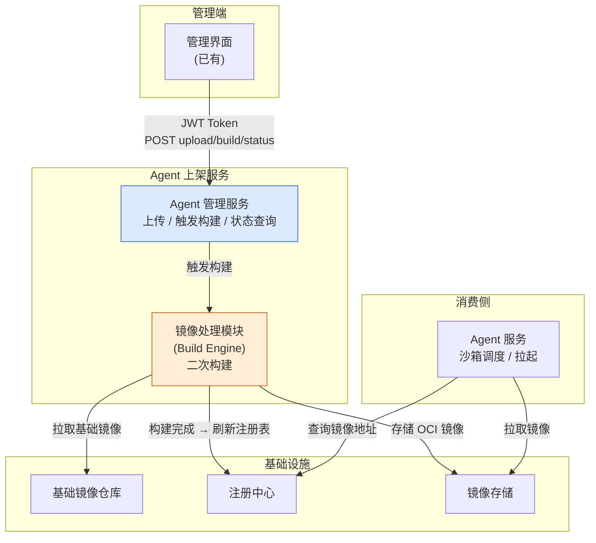
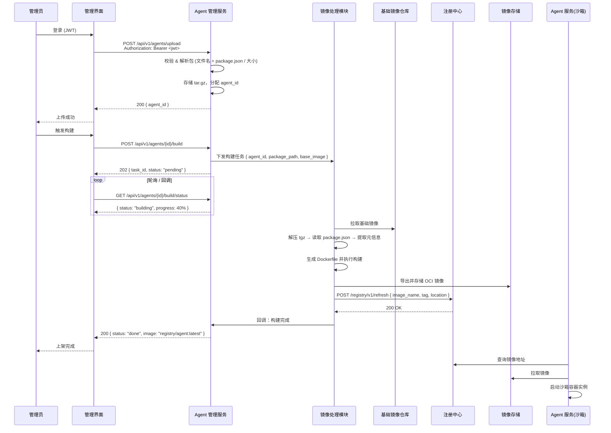
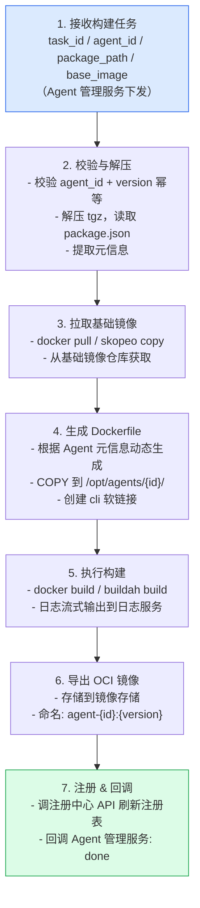

# 三方 Agent 上架设计说明书

> 版本：v1.0  
> 状态：设计阶段

---

## 1. 概述

### 1.1 项目背景与目标

在 Agent 服务平台的运营过程中，管理员需将第三方 AI 编程 Agent（如 Claude Code、OpenCode 等）以离线方式集成到平台中。本文档定义一套标准化的**三方 Agent 上架流程**：管理员通过管理界面上传 Agent 离线软件包，系统自动完成二次镜像构建，生成符合 OCI 标准的容器镜像，并同步至注册中心，供下游 Agent 服务（沙箱）按需拉起。

### 1.2 适用场景

| 场景 | 说明 |
|------|------|
| 内网 / 隔离环境 | 无外网访问能力的开发机或容器集群 |
| 企业统一管控 | 管理员集中管理 Agent 版本与下发策略 |
| Agent OS 沙箱镜像预装 | 多租户共享同一 Agent 镜像，由沙箱按用户实例化 |

### 1.3 术语表

| 术语 | 说明 |
|------|------|
| **Agent 软件包** | 管理员上传的 `.tgz` / `.tar.gz` 压缩包，内含 Agent 离线安装包（npm 格式）。元信息由系统自动解析提取 |
| **基础镜像** | 预制的操作系统 + 运行时依赖（Node.js、Git、sshd 等）的 OCI 镜像，随系统版本升级迭代 |
| **二次构建** | 将 Agent 软件包与基础镜像叠加，生成可直接运行的 OCI 格式镜像 |
| **OCI** | Open Container Initiative，容器镜像工业标准格式 |
| **注册中心** | 仅维护镜像注册表（agent_id ↔ 镜像地址映射），不持有镜像文件本身。供沙箱调度服务查询可用镜像 |
| **沙箱** | 为每个用户启动的隔离容器实例，基于 Agent 镜像运行 |

---

## 2. 系统架构

### 2.1 整体架构图



### 2.2 组件职责

| 组件 | 职责 | 输入 | 输出 |
|------|------|------|------|
| **管理界面** | 管理员操作入口；上传包、触发构建、查看状态 | 用户操作 | HTTP 请求 (JWT) |
| **Agent 管理服务** | 接收上传、校验、存储包文件；管理构建任务生命周期；对外暴露 REST API | HTTP 请求 + tar.gz | 状态码 + JSON 响应 |
| **镜像处理模块（Build Engine）** | 解压包 → 读取包内 package.json → 叠加基础镜像 → 导出 OCI → 存储 → 回调注册 | 构建任务指令 | OCI 镜像 + 状态回调 |
| **基础镜像仓库** | 提供预制的运行环境镜像 | — | OCI 镜像 (pull) |
| **注册中心** | 统一管理上架后的 Agent 镜像元信息 | 镜像元数据 | 注册表查询 |
| **Agent 服务（沙箱）** | 查询注册中心获取镜像地址，从镜像存储拉取镜像，为终端用户启动隔离实例 | 注册表查询结果 | 运行中的容器 |

### 2.3 核心流程时序图



---

## 3. 上传包规范

### 3.1 上传流程

管理员上传 npm 官方 `.tgz` 包后，系统自动解析文件名提取元信息，管理员在 UI 中确认并补充必要字段即可，**无需手工编写任何清单文件**。

```
管理员操作                                  系统行为
─────────────────────────────────────────────────────────
① 从 npm registry 下载 .tgz 包
   例: opencode-linux-arm64-musl-1.17.14.tgz

② 在管理界面上传该 .tgz                 → 存入包存储，返回包 ID
                                          →
③ 系统弹出确认表单                         ← 从文件名 + 包内提取元信息
   ├─ Agent 名称: [opencode]   ← 已填      - 文件名解析 → name / version / platform
   ├─ 版本:      [1.17.14]    ← 已填      - package.json: display_name / entrypoint
   ├─ 平台:      [linux-arm64-musl] ← 已填
   ├─ 入口命令:   [npx opencode] ← 已填
   └─ 显示名称:   [OpenCode]    ← 可改

④ 管理员确认 / 修改后提交                  → 写入 Agent 记录，状态: uploaded
```

### 3.2 自动提取规则

系统从上传包的文件名和包内容中自动提取以下信息：

| 元信息 | 来源 | 规则 |
|--------|------|------|
| `name` (agent_id) | 文件名第一段 | `opencode-linux-arm64-musl-1.17.14.tgz` → `opencode` |
| `version` | 文件名最后一段 | `opencode-linux-arm64-musl-1.17.14.tgz` → `1.17.14` |
| `platform` | 文件名中间段 | `opencode-linux-arm64-musl-1.17.14.tgz` → `linux-arm64-musl` |
| `platform` 映射 | 平台映射表 | `linux-x64` → `linux/amd64`, `linux-arm64` → `linux/arm64` ... |
| `display_name` | 包内 `package.json` → `name` 或 `displayName` | — |
| `entrypoint` | 包内 `package.json` → `bin` 字段或已知默认值 | `bin: { "opencode": "..." }` → `opencode` |
| `runtime` | 文件后缀 + 包内容判断 | `.tgz` 内含 `node_modules/` → `nodejs` |
| `runtime_version` | 基础镜像当前版本 | 固定为 Node.js 22（基础镜像提供） |

管理员可在确认表单中覆盖 `display_name` 和 `entrypoint`；`name`、`version`、`platform` 由文件名唯一确定，不可改。

### 3.3 文件名解析规范

npm 平台特定包的文件名遵循约定格式：

```
{name}-{platform}-{version}.tgz

示例:
  opencode-linux-arm64-musl-1.17.14.tgz    → opencode, linux-arm64-musl, 1.17.14
  opencode-linux-x64-1.17.14.tgz           → opencode, linux-x64, 1.17.14
  opencode-win32-x64-1.17.14.tgz           → opencode, win32-x64, 1.17.14
  opencode-darwin-arm64-1.17.14.tgz        → opencode, darwin-arm64, 1.17.14
```

解析逻辑：从文件名尾部向前取三段——`{version}.tgz`（版本号 + 扩展名）、`{platform}`（OS-arch 标识）、`{name}`（剩余部分）。

因为 npm 包名可能含多个 `-`（如 `claude-code-linux-x64-2.1.89.tgz`），系统优先匹配已知的 platform 枚举值来定位分段边界。

| 平台标识 | 映射目标 |
|----------|----------|
| `linux-x64` | `linux/amd64` |
| `linux-arm64` | `linux/arm64` |
| `linux-x64-musl` | `linux/amd64-musl` |
| `linux-arm64-musl` | `linux/arm64-musl` |
| `win32-x64` | `windows/amd64` |
| `darwin-arm64` | `darwin/arm64` |

> RPM / DEB 等其他格式的文件名解析规则后续补充，当前 MVP 阶段仅支持 `.tgz`。

### 3.4 目录结构约定

从 npm registry 下载的 `.tgz` 包解压后为标准 npm 包结构：

```
opencode-linux-arm64-musl-1.17.14.tgz
  └── package/                          ← 解压后顶层
      ├── package.json                  ← 含 name, version, bin 等元信息
      ├── package-lock.json
      └── node_modules/
          └── ...
```

### 3.5 支持的 Agent 列表

| Agent ID | 显示名称 | 运行时 | 入口命令 | npm 包前缀 |
|----------|------|:---:|------|------|
| `claude-code` | Claude Code | Node.js 22 | `claude` | `@anthropic-ai/claude-code` |
| `opencode` | OpenCode | Node.js 22 | `opencode` | `opencode` |

> agent_id 由文件名自动解析，上表中 agent_id 与实际 npm 包前缀的映射关系维护在后台 Agent 元信息配置中。后续新增 Agent 只需新增配置条目，无需改代码。

### 3.6 包大小限制

| 项目 | 值 |
|------|-----|
| 单包上限 | 500 MB（预留 Claude Code npm offline 完整包空间） |
| 请求体上限 | 500 MB |
| 存储空间告警阈值 | 镜像存储使用率 > 80% 告警 |

---

## 4. 基础镜像设计

### 4.1 基础镜像依赖矩阵

基础镜像名称规约：`registry.example.com/agent-base:<system_version>-<arch>`

| 依赖 | 版本 | 用途 | 安装方式 |
|------|------|------|----------|
| Ubuntu | 22.04 LTS | OS 底座 | FROM ubuntu:22.04 |
| Node.js | 22.x LTS (≥ 22.12.0) | Claude Code / OpenCode 运行时 | 预编译二进制 |
| npm | 10.x (随 Node 22 内置) | npm offline install | 随 Node.js |
| Git | ≥ 2.40 | 代码仓库操作 | apt install |
| ripgrep | ≥ 14.0 | Claude Code 代码检索 | 官方二进制 |
| OpenSSH Server | ≥ 8.9 | 沙箱 SSH 交互入口 | apt install |
| bash | ≥ 5.1 | 基础 Shell | 系统自带 |
| curl | ≥ 7.81 | API 连通性诊断 | 系统自带 |
| ca-certificates | 最新 | HTTPS 通信 | 系统自带 |

### 4.2 多 Agent 运行环境兼容方案

基础镜像同时包含 Node.js 22，即可同时支撑 Claude Code 和 OpenCode 运行。所有 Agent 共享同一套运行时环境，不单独维护。

```
基础镜像
  ├── /opt/agents/              ← Agent 软件层（二次构建时注入）
  │   ├── claude-code/          ← claude-code v2.1.89
  │   └── opencode/             ← opencode v0.9.0
  ├── /opt/mcp-servers/         ← MCP Server 预装层
  │   ├── filesystem/
  │   ├── git/
  │   └── shell/
  └── /usr/local/bin/           ← 全局 CLI 软链接
```

### 4.3 MCP 服务说明

#### 4.3.1 概念与角色

MCP（Model Context Protocol）是 AI Agent 调用外部工具/数据的标准协议。在本地沙箱场景下：

```
Agent 进程 (Claude Code / OpenCode) → 读取 ~/.claude/mcp.json
  ├── 启动子进程 → filesystem MCP Server → 读写容器内文件
  ├── 启动子进程 → git MCP Server       → 操作代码仓库
  └── 启动子进程 → shell MCP Server     → 执行 bash 命令
```

MCP Server 在沙箱中以子进程形式运行，通过 **stdio** 与 Agent 通信。**容器销毁时 MCP Server 一并退出，无状态。**

#### 4.3.2 预装清单（基础镜像内置）

| MCP Server | npm 包 | 版本 | 必要性 | 说明 |
|------------|--------|------|:---:|------|
| filesystem | `@anthropic-ai/mcp-server-filesystem` | 锁定 | 必须 | 所有 Agent 写代码都需要文件读写 |
| git | `@anthropic-ai/mcp-server-git` | 锁定 | 建议 | 代码版本管理 |
| shell | `@anthropic-ai/mcp-server-shell` | 锁定 | 建议 | 执行构建/测试等 bash 命令 |

**离线安装方式**：在基础镜像构建阶段，通过 `npm install -g` 安装到 `/opt/mcp-servers/`，Agent 启动时直接引用本地路径，避免运行时 `npx` 联网下载。

#### 4.3.3 MCP 配置注入方式

Agent 的 MCP 配置文件 (`~/.claude/mcp.json`) 在沙箱启动时由平台侧动态注入，指向基础镜像内预装的 MCP Server 路径：

```json
{
  "mcpServers": {
    "filesystem": {
      "command": "node",
      "args": ["/opt/mcp-servers/filesystem", "/workspace"]
    },
    "git": {
      "command": "node",
      "args": ["/opt/mcp-servers/git", "--repository", "/workspace"]
    }
  }
}
```

> MCP 配置**由沙箱启动编排层负责注入**，不属于 Agent 上架流程的范围，此处仅声明基础镜像所需预装的 MCP 依赖。

### 4.4 镜像版本与系统升级策略

- 基础镜像版本跟随系统版本迭代：`registry.example.com/agent-base:1.0.0-linux-x64`
- 每次系统升级时重新构建基础镜像，Agent 元信息中声明的依赖若无法满足则拒绝上架
- 已上架 Agent 不受基础镜像升级影响（镜像已固化），如需升级需重新上架新版本

---

## 5. 镜像处理模块（二次构建）

### 5.1 构建流程



### 5.2 Agent 元信息 → Dockerfile 生成规则

以 Agent 元信息为例，Dockerfile 生成规则如下：

```dockerfile
# 模板（由 Build Engine 动态生成）
FROM registry.example.com/agent-base:1.0.0-linux-x64

<% if install_mode == "npm_offline" %>
# npm 离线安装
COPY agent-package/ /tmp/agent-package/
WORKDIR /tmp/agent-package
RUN npm install --offline --omit=dev
RUN npm link
<% endif %>

<% if install_mode == "binary_copy" %>
# 直接拷贝二进制
COPY agent-package/bin/ /usr/local/bin/
RUN chmod +x /usr/local/bin/*
<% endif %>

# 创建 Agent 目录
RUN mkdir -p /opt/agents/<%= id %>/
COPY agent-package/ /opt/agents/<%= id %>/

# 全局路径
ENV PATH="/usr/local/bin:/opt/agents/<%= id %>/bin:${PATH}"
```

- `<%= %>` 占位符从 Agent 元信息 (agent_id, install_mode 等) 填充
- `install_mode` 决定用 `npm install --offline` 还是 `COPY` 方式

### 5.3 构建状态机

```
  pending ──→ building ──→ done
                │
                └──→ failed (可手动重试)
```

| 状态 | 说明 | 可执行操作 |
|------|------|-----------|
| `pending` | 任务已创建，等待调度 | 取消 |
| `building` | 正在执行构建（可查询进度） | 取消 |
| `done` | 构建成功，镜像已存储并注册 | — |
| `failed` | 构建失败 | 重试 |
| `cancelled` | 已被管理员取消 | — |

### 5.4 输出规范

| 项目 | 规约 |
|------|------|
| 镜像名称 | `agent-{agent_id}:{version}` |
| 存储路径 | `/data/agent-images/{agent_id}/{version}/` |
| 镜像格式 | OCI (application/vnd.oci.image.manifest.v1+json) |
| Tag 策略 | 固定版本号，不追加 `latest` |

---

## 6. 接口设计

### 6.1 接口矩阵总览

| 方法 | 路径 | 调用方 | 被调用方 | 说明 |
|:---:|------|--------|----------|------|
| `POST` | `/api/v1/agents/upload` | 管理界面 | Agent 管理服务 | 上传 Agent 离线包 |
| `POST` | `/api/v1/agents/{id}/build` | 管理界面 | Agent 管理服务 | 触发二次构建 |
| `GET` | `/api/v1/agents/{id}/build/status` | 管理界面 | Agent 管理服务 | 查询构建状态与进度 |
| `GET` | `/api/v1/agents` | 管理界面 | Agent 管理服务 | 查询已上架 Agent 列表 |
| `DELETE` | `/api/v1/agents/{id}` | 管理界面 | Agent 管理服务 | 下架 Agent（删除镜像+注销） |
| `POST` | `/api/v1/agents/{id}/build/retry` | 管理界面 | Agent 管理服务 | 重试失败的构建 |
| `POST` | `/registry/v1/agents/refresh` | 镜像处理模块 | 注册中心 | 刷新注册表 |
| `GET` | `/registry/v1/agents/{id}` | Agent 服务 | 注册中心 | 查询可用镜像信息 |

### 6.2 各接口详细定义

#### 6.2.1 上传 Agent 离线包

```
POST /api/v1/agents/upload
Content-Type: multipart/form-data
Authorization: Bearer <JWT>
```

**请求**：

| 字段 | 类型 | 必选 | 说明 |
|------|------|:---:|------|
| `package` | file | ✓ | `.tar.gz` 格式的 Agent 离线包 |
| `agent_id` | string | ✗ | 如未指定，系统自动从文件名解析 |

**响应**：

```json
// 200 OK
{
  "code": 0,
  "data": {
    "agent_id": "claude-code",
    "version": "2.1.89",
    "package_path": "/data/packages/claude-code-2.1.89.tar.gz",
    "uploaded_at": "2026-07-08T10:00:00Z"
  }
}
```

**错误码**：

| code | 说明 |
|:---:|------|
| 0 | 成功 |
| 40001 | 无法解析文件名，且未指定 agent_id |
| 40002 | Agent 元信息确认字段校验失败（必要字段缺失） |
| 40003 | 文件包大小超限 |
| 40004 | agent_id + version 已存在 |
| 40005 | 文件格式非 tar.gz |

#### 6.2.2 触发二次构建

```
POST /api/v1/agents/{agent_id}/build
Authorization: Bearer <JWT>
```

**请求体**：

```json
{
  "base_image": "registry.example.com/agent-base:1.0.0-linux-x64",
  "platform": "linux-x64"
}
```

**响应**：

```json
// 202 Accepted
{
  "code": 0,
  "data": {
    "task_id": "build-a1b2c3",
    "agent_id": "claude-code",
    "version": "2.1.89",
    "status": "pending",
    "created_at": "2026-07-08T10:05:00Z"
  }
}
```

#### 6.2.3 查询构建状态

```
GET /api/v1/agents/{agent_id}/build/status
Authorization: Bearer <JWT>
```

**响应**：

```json
// 构建中
{
  "code": 0,
  "data": {
    "task_id": "build-a1b2c3",
    "status": "building",
    "progress": 65,
    "log_url": "https://logs.example.com/build-a1b2c3",
    "started_at": "2026-07-08T10:05:05Z"
  }
}

// 构建完成
{
  "code": 0,
  "data": {
    "task_id": "build-a1b2c3",
    "status": "done",
    "image": "registry.example.com/agent-claude-code:2.1.89",
    "image_digest": "sha256:abc...",
    "registered": true,
    "finished_at": "2026-07-08T10:10:00Z",
    "duration_seconds": 295
  }
}

// 构建失败
{
  "code": 0,
  "data": {
    "task_id": "build-a1b2c3",
    "status": "failed",
    "error_code": "BUILD_NPM_INSTALL_FAILED",
    "error_message": "npm install --offline failed: missing dependency @anthropic-ai/claude-code-linux-x64",
    "log_url": "https://logs.example.com/build-a1b2c3",
    "finished_at": "2026-07-08T10:06:00Z"
  }
}
```

#### 6.2.4 查询 Agent 列表

```
GET /api/v1/agents?page=1&size=20
Authorization: Bearer <JWT>
```

**响应**：

```json
{
  "code": 0,
  "data": {
    "total": 5,
    "items": [
      {
        "agent_id": "claude-code",
        "name": "Claude Code",
        "latest_version": "2.1.89",
        "status": "ready",
        "image": "registry.example.com/agent-claude-code:2.1.89",
        "created_at": "2026-07-08T10:00:00Z"
      }
    ]
  }
}
```

### 6.3 注册中心交互协议

镜像处理模块在构建成功后，调用注册中心接口注册新镜像：

```
POST /registry/v1/agents/refresh
Authorization: Bearer <internal-service-token>
```

```json
{
  "agent_id": "claude-code",
  "version": "2.1.89",
  "image": "registry.example.com/agent-claude-code:2.1.89",
  "image_digest": "sha256:abc...",
  "platform": "linux-x64",
  "size_bytes": 524288000
}
```

```json
// 200 OK
{
  "code": 0,
  "message": "registered"
}
```

### 6.4 认证鉴权

```
请求链路:
管理界面 → [IAM JWT] → Agent 管理服务

JWT Payload:
{
  "sub": "admin-user-123",
  "role": "agent_admin",
  "exp": 1718124300
}
```

- 管理界面与 Agent 管理服务之间通过 IAM 签发的 JWT 进行认证，验证通过后解析 `role` 字段
- Agent 管理服务与镜像处理模块之间通过内部服务 Token 通信（内网环境，非 JWT）
- 镜像处理模块与注册中心之间通过内部服务 Token 通信
- 所有 HTTP 接口均强制 HTTPS（生产环境）

---

## 7. 代码设计

### 7.1 模块划分

```
agent-registry/
├── api/                          # HTTP 接口层
│   ├── routes.py                 # 路由注册
│   ├── middleware.py             # JWT 鉴权中间件
│   └── schemas.py                # 请求/响应 Pydantic Schema
├── services/                     # 业务逻辑层
│   ├── agent_service.py          # Agent 管理（上传/查询/下架）
│   ├── build_service.py          # 构建任务管理（状态机/调度）
│   └── registry_client.py        # 注册中心 HTTP Client
├── engine/                       # 镜像处理模块
│   ├── builder.py                # Docker / Buildah 构建引擎
│   ├── manifest.py               # 包元信息提取（文件名解析 + package.json 读取）
│   └── dockerfile_gen.py         # Dockerfile 动态生成
├── models/                       # 数据模型
│   ├── agent.py                  # Agent ORM / 领域模型
│   └── build_task.py             # BuildTask ORM / 领域模型
├── storage/                      # 存储层
│   ├── package_store.py          # 包文件存储（本地 / OSS）
│   └── image_store.py            # 镜像产物存储
├── config.py                     # 配置管理
└── exceptions.py                 # 统一异常定义
```

### 7.2 核心数据结构

```python
# models/agent.py
from pydantic import BaseModel
from typing import List, Optional
from enum import Enum

class AgentStatus(str, Enum):
    UPLOADED = "uploaded"       # 包已上传，未构建
    BUILDING = "building"       # 构建中
    READY = "ready"             # 构建完成，已注册
    FAILED = "failed"           # 构建失败
    RETIRED = "retired"         # 已下架

class AgentPackage(BaseModel):
    agent_id: str               # 从文件名解析，如 "claude-code"
    display_name: str           # 管理员确认的显示名称，如 "Claude Code"
    version: str                # 从文件名解析，如 "2.1.89"
    platform: str               # 从文件名解析，如 "linux-x64"
    entrypoint: str             # 管理员确认，从 package.json bin 提取默认值
    install_mode: str           # 由系统判断：含 node_modules → npm_offline

class AgentRecord(AgentPackage):
    package_path: str           # tgz 存储路径
    source_filename: str        # 原始文件名，如 "claude-code-linux-x64-2.1.89.tgz"
    status: AgentStatus
    image: Optional[str]        # 构建完成后的镜像 URL
    image_digest: Optional[str]
    created_at: str
    updated_at: str
```

```python
# models/build_task.py
from enum import Enum

class BuildStatus(str, Enum):
    PENDING = "pending"
    BUILDING = "building"
    DONE = "done"
    FAILED = "failed"
    CANCELLED = "cancelled"

class BuildTask(BaseModel):
    task_id: str
    agent_id: str
    version: str
    base_image: str             # 基础镜像引用
    platform: str               # linux-x64
    status: BuildStatus
    progress: int               # 0-100
    log_url: Optional[str]
    image: Optional[str]
    image_digest: Optional[str]
    error_code: Optional[str]
    error_message: Optional[str]
    started_at: Optional[str]
    finished_at: Optional[str]
```

### 7.3 核心函数签名

```python
# services/agent_service.py
class AgentService:
    async def upload(package: UploadFile) -> AgentUploadResult
    async def trigger_build(agent_id: str, base_image: str) -> BuildTask
    async def get_build_status(agent_id: str) -> BuildTask
    async def list_agents(page: int, size: int) -> AgentListResult
    async def retire_agent(agent_id: str) -> None

# engine/builder.py
class ImageBuilder:
    async def build(task: BuildTask) -> BuildResult
    async def cancel(task_id: str) -> None
    async def _parse_package(package_path: str) -> AgentPackage
    async def _generate_dockerfile(agent: AgentPackage) -> str
    async def _pull_base_image(base_image: str) -> None
    async def _export_oci(task: BuildTask) -> str
    async def _register(agent: AgentPackage, image: str) -> None
```

### 7.4 异常处理策略

```python
# exceptions.py
class AgentRegistryError(Exception):
    """基础异常，附带错误码"""
    def __init__(self, code: int, message: str):
        self.code = code
        self.message = message

class PackageValidationError(AgentRegistryError):
    """包校验失败 (40001-40005)"""
    pass

class BuildError(AgentRegistryError):
    """构建失败 (50001-50099)"""
    pass

class RegistryError(AgentRegistryError):
    """注册中心交互失败"""
    pass

# 在路由层统一捕获并转换为 HTTP 响应
@app.exception_handler(AgentRegistryError)
async def handler(request, exc: AgentRegistryError):
    return JSONResponse(status_code=400, content={
        "code": exc.code, "message": exc.message
    })
```

---

## 8. DFX 设计

### 8.1 可靠性

| 场景 | 策略 |
|------|------|
| 构建过程异常退出 | Build Engine 进程守护，异常退出自动标记 `failed`，支持手动重试 |
| 基础镜像拉取失败 | 重试 3 次，间隔 10s/30s/60s，仍失败则 `failed` 并上报原因 |
| 注册中心不可达 | 重试 3 次，仍失败则任务标记 `failed`，支持后续补偿注册 |
| Agent 包存储 | 使用 RAID / 分布式存储，保证包文件不丢失 |
| 镜像存储 | OCI 镜像存储到指定持久化路径，采用 CRC 校验完整性 |
| 并发构建 | 不同 Agent 构建并行执行，同一 Agent 同一版本串行（幂等锁） |
| 进程崩溃恢复 | 启动时扫描 `building` 状态任务，重新调度或标记 `failed` |

### 8.2 安全性

| 层面 | 措施 |
|------|------|
| **传输** | 全链路 HTTPS |
| **认证** | 管理界面→Agent 管理服务：IAM JWT；内部服务间：service token |
| **授权** | 管理界面仅 `role: agent_admin` 可操作；普通用户只读 |
| **上传校验** | 文件名解析校验；文件大小限制；文件魔数校验（tgz/tar.gz） |
| **构建隔离** | 每次构建在独立工作区执行，构建完成后清理临时文件 |
| **镜像安全** | 基础镜像经安全扫描后方可发布；构建产物可选签名（cosign） |
| **敏感信息** | API Key 等凭证不写入包内，不写入镜像，由沙箱运行时注入 |

### 8.3 可扩展性

| 维度 | 设计 |
|------|------|
| Agent 类型 | 新增 Agent 只需上传 npm 平台 tgz 包，系统自动解析，无需改动代码 |
| 基础镜像 | 支持多 CPU 架构（x64 / ARM64），platform 由文件名解析 |
| 安装模式 | `install_mode` 支持 `npm_offline`、`binary_copy`，后续可扩展 `apt_offline` 等 |
| 注册中心 | 注册中心客户端抽象为接口，可适配不同镜像仓库（Harbor / Docker Registry / OCI Distribution） |

### 8.4 可维护性

| 措施 | 说明 |
|------|------|
| 构建日志 | 每次构建全量日志持久化存储，保留 30 天，含完整命令输出便于排错 |
| 镜像版本追溯 | 镜像 digest + Agent 版本一一对应，可追溯每次构建的输入 |
| 配置化管理 | 基础镜像地址、包大小上限、重试策略等敏感配置集中管理，支持热更新 |
| 健康检查 | Agent 管理服务暴露 `/health` 端点 + `/ready` 就绪探针 |

### 8.5 可观测性

| 指标 | 方式 |
|------|------|
| 构建状态查询 | REST API 轮询 (`GET /status`) 或 WebSocket 推送 |
| 构建进度 | 返回百分比 (0-100)，关键阶段可细化上报 |
| 监控指标 | Prometheus 指标：`agent_build_total`、`agent_build_duration_seconds`、`agent_build_errors_total` |
| 告警 | 构建失败率 > 10% 告警；单次构建超 10 分钟告警；存储使用率 > 80% 告警 |

### 8.6 兼容性

| 维度 | 策略 |
|------|------|
| OS / Arch | 基础镜像维护 `linux-x64` 和 `linux-arm64` 两套，上传时按包平台匹配 |
| Agent 版本 | 同一 Agent 的多个版本可并存（claude-code:2.0.0 / 2.1.0），旧版本可选择性保留或下架 |
| 基础镜像升级 | 基础镜像升级后，已上架 Agent 不受影响（镜像已固化）；新上架 Agent 自动使用新基础镜像 |
| 向下兼容 | Agent 管理服务 API 版本化 (`/api/v1/`)，接口变更不破坏旧客户端 |

---

## 9. 验收标准

### 9.1 上传校验

| 编号 | 用例 | 预期 |
|:---:|------|------|
| TC-01 | 上传标准命名的 tgz（如 `opencode-linux-x64-1.17.14.tgz`） | 200，自动解析返回 agent_id + version + platform |
| TC-02 | 上传无法解析文件名的 tgz（如 `agent.tar.gz`），且未指定 agent_id | 400，code=40001，"无法解析文件名" |
| TC-03 | 上传后管理员确认表单缺少必要字段 | 400，code=40002，明确指出缺失字段 |
| TC-04 | 上传 tar.gz 超过 500 MB | 400，code=40003，"包大小超限" |
| TC-05 | 重复上传相同 agent_id + version | 400，code=40004，"版本已存在" |
| TC-06 | 上传非 tar.gz 格式文件 | 400，code=40005，"文件格式非法" |

### 9.2 构建

| 编号 | 用例 | 预期 |
|:---:|------|------|
| TC-07 | 正常包触发构建 | 202，返回 task_id + status=pending |
| TC-08 | 构建过程可查询状态与进度 | GET /status 返回 building + progress 递增 |
| TC-09 | 构建完成 | GET /status 返回 done + image URL + digest |
| TC-10 | npm 依赖不完整（缺少平台二进制） | status=failed，error_code="BUILD_NPM_INSTALL_FAILED" |
| TC-11 | 基础镜像不存在 | status=failed，error_code="BUILD_BASE_IMAGE_NOT_FOUND" |
| TC-12 | 构建过程中取消 | status=cancelled |

### 9.3 注册

| 编号 | 用例 | 预期 |
|:---:|------|------|
| TC-13 | 构建完成后注册中心可查询到新镜像 | GET /registry/v1/agents/claude-code 返回包含 2.1.89 |
| TC-14 | 注册中心不可达时任务失败 | status=failed，error_code="REGISTRY_REFRESH_FAILED" |

### 9.4 运行验证（端到端）

| 编号 | 用例 | 预期 |
|:---:|------|------|
| TC-15 | 沙箱成功拉取 Agent 镜像 | `docker pull` / `crictl pull` 成功 |
| TC-16 | 容器启动后 Agent 可执行 `--version` | 输出正确版本号，无异常退出 |
| TC-17 | Agent 启动并完成一轮完整对话 | Claude Code → 发起对话 → 流式回复 → 正常退出 |
| TC-18 | MCP Server 被 Agent 正确加载 | Agent 启动日志中看到 MCP Server 连接成功 |

### 9.5 DFX

| 编号 | 用例 | 预期 |
|:---:|------|------|
| TC-19 | 断网环境执行构建 | 成功，不依赖任何外网连接 |
| TC-20 | 同时上传两个不同 Agent | 互不干扰，各自构建成功 |
| TC-21 | 同一 Agent 同一版本重复触发构建 | 返回已有任务的 status，不启动新任务（幂等） |
| TC-22 | 构建日志可追溯 | 构建失败后可查看完整构建日志 |
| TC-23 | 未授权用户（非 agent_admin）调接口 | 403 Forbidden |

---

## 10. 附录

### A. 基础镜像 Dockerfile 参考

```dockerfile
FROM ubuntu:22.04

ARG NODE_VERSION=22.12.0
ARG RG_VERSION=14.1.1

RUN apt-get update \
    && apt-get install -y --no-install-recommends \
        openssh-server \
        git \
        curl \
        ca-certificates \
        build-essential \
    && rm -rf /var/lib/apt/lists/*

# Node.js (预编译二进制)
COPY node-v${NODE_VERSION}-linux-x64.tar.xz /tmp/
RUN tar -xf /tmp/node-v${NODE_VERSION}-linux-x64.tar.xz -C /usr/local --strip-components=1 \
    && rm /tmp/node-v${NODE_VERSION}-linux-x64.tar.xz

# ripgrep
COPY ripgrep-${RG_VERSION}-x86_64-unknown-linux-musl.tar.gz /tmp/
RUN tar -xf /tmp/ripgrep-${RG_VERSION}-x86_64-unknown-linux-musl.tar.gz -C /tmp/ \
    && mv /tmp/ripgrep-${RG_VERSION}-x86_64-unknown-linux-musl/rg /usr/local/bin/ \
    && rm -rf /tmp/ripgrep-*

# MCP Server 预装
RUN npm install -g \
    @anthropic-ai/mcp-server-filesystem \
    @anthropic-ai/mcp-server-git \
    @anthropic-ai/mcp-server-shell \
    && npm cache clean --force

# 配置 sshd
RUN mkdir /var/run/sshd \
    && echo 'PermitRootLogin yes' >> /etc/ssh/sshd_config \
    && echo 'PasswordAuthentication no' >> /etc/ssh/sshd_config

# Agent 目录
RUN mkdir -p /opt/agents /opt/mcp-servers /workspace

EXPOSE 22
CMD ["/usr/sbin/sshd", "-D"]
```

### B. 接口 OpenAPI 描述（核心部分）

```yaml
openapi: "3.1.0"
info:
  title: Agent Registry API
  version: "1.0.0"
servers:
  - url: https://api.internal.example.com
paths:
  /api/v1/agents/upload:
    post:
      summary: 上传 Agent 离线包
      security:
        - BearerAuth: []
      requestBody:
        content:
          multipart/form-data:
            schema:
              type: object
              required: [package]
              properties:
                package:
                  type: string
                  format: binary
      responses:
        "200":
          description: 上传成功
  /api/v1/agents/{agent_id}/build:
    post:
      summary: 触发二次构建
      security:
        - BearerAuth: []
      parameters:
        - name: agent_id
          in: path
          required: true
          schema:
            type: string
      requestBody:
        content:
          application/json:
            schema:
              type: object
              properties:
                base_image:
                  type: string
                platform:
                  type: string
      responses:
        "202":
          description: 构建任务已创建
  /api/v1/agents/{agent_id}/build/status:
    get:
      summary: 查询构建状态
      security:
        - BearerAuth: []
      parameters:
        - name: agent_id
          in: path
          required: true
          schema:
            type: string
      responses:
        "200":
          description: 构建状态
components:
  securitySchemes:
    BearerAuth:
      type: http
      scheme: bearer
      bearerFormat: JWT
```
