# Gateway SSH Public-Key Authentication Design

## 概述

本文档描述了 Gateway 在 cc-switch 场景下通过 SSH 进行终端交互的完整认证链路设计，涵盖 SSH 密钥认证原理、密钥管理方案对比、TUI 载体分析，以及最终选型方案 A（端到端公钥认证）的详细实现。

**设计目标**：用户通过 Gateway 拉起 cc 容器实例后，通过本地终端模拟器建立 SSH 连接，实现端到端加密的 TUI 交互。

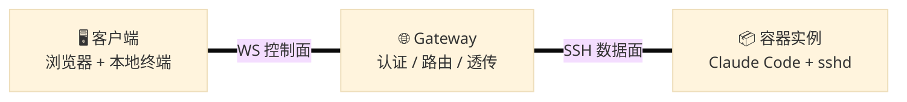

---

## 一、SSH 公钥认证基础原理

### 1.1 密钥文件分布全景

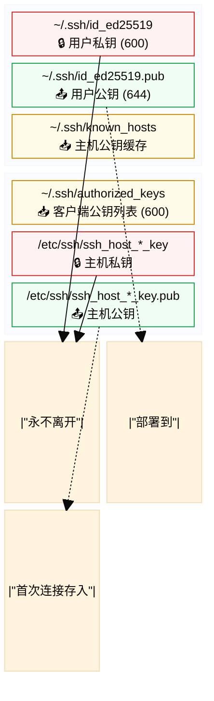

### 1.2 完整认证握手流程（四阶段）

整个 SSH 连接涉及**两次独立的非对称加密验证**：第一次用主机密钥验证服务器身份（防中间人），第二次用用户密钥验证用户身份（替代密码）。

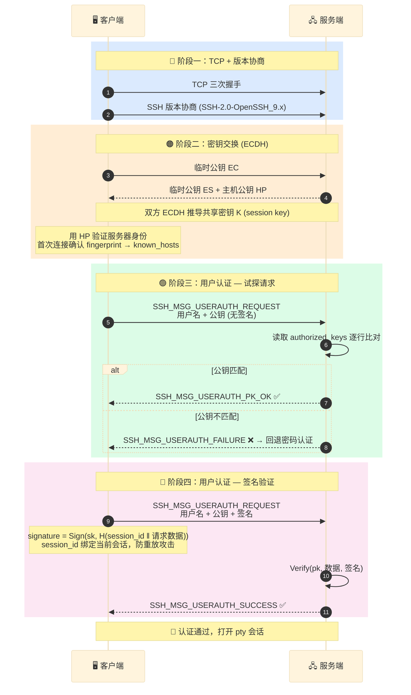

### 1.3 多用户场景

多用户只是 `authorized_keys` 文件的排列组合，核心认证逻辑完全一致。

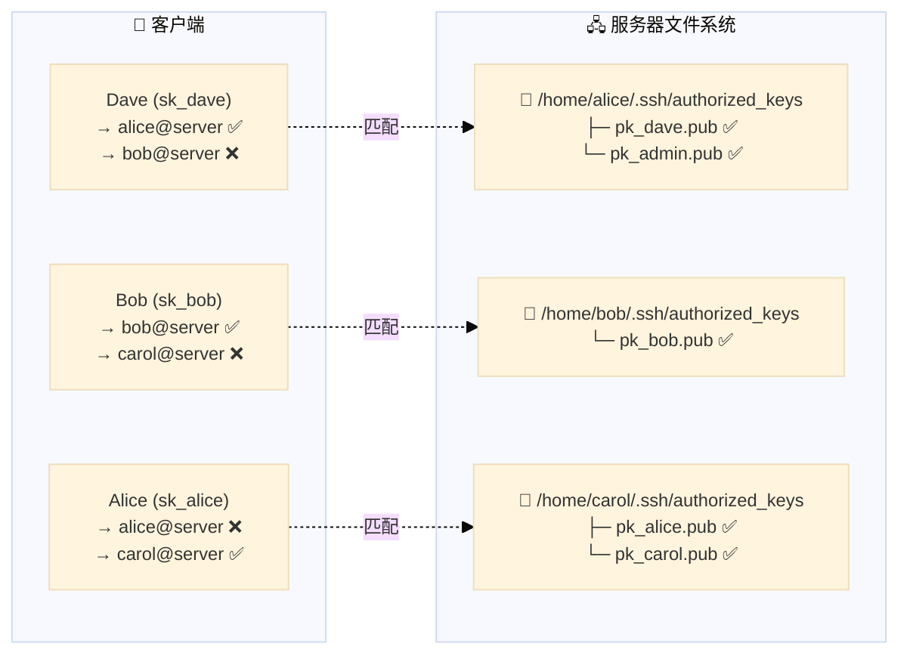

**关键规则**：
- 同一公钥可授权多个用户（一把私钥登多个账户）
- 一个用户可被多个公钥授权（多设备登录同一账户）
- 认证结果取决于：客户端用的**私钥** 是否在目标用户 `authorized_keys` 中有对应的**公钥**

---

## 二、密钥管理方案对比

### 2.1 方案 A：用户持长期私钥（端到端认证）

```mermaid
%%{init: {'theme': 'base', 'themeVariables': { 'fontSize': '13px'}}}%%
flowchart LR
    Client["🖥️ 客户端<br/>━━━━━━━━━<br/>🔒 sk_user (本地)<br/>永不离开客户端"] 
    ===|"① SSH 连接<br/>用户私钥签名"| 
    Gateway["🌐 Gateway<br/>━━━━━━━━━<br/>SSH 透传代理<br/>不持有 sk_user<br/>不解密会话内容"]
    ===|"② SSH 转发<br/>用户私钥签名"|
    Container["📦 容器实例<br/>━━━━━━━━━<br/>sshd<br/>authorized_keys<br/>📥 pk_user"]

    classDef clientNode fill:#dbeafe,stroke:#2563eb,color:#1e40af
    classDef gwNode fill:#fef3c7,stroke:#d97706,color:#78350f
    classDef containerNode fill:#dcfce7,stroke:#16a34a,color:#14532d
    
    class Client clientNode
    class Gateway gwNode
    class Container containerNode
```

| 动作 | 内容 |
|------|------|
| **密钥生成** | 用户本地 `ssh-keygen`，私钥永不离身 |
| **公钥部署** | 用户通过 WS/API 将公钥上传 Gateway → Gateway 拉起实例时写入 `authorized_keys` |
| **认证方式** | SSH 透传（TCP 转发或 ProxyJump），Gateway 只转发加密流量不解密 |
| **私钥传输** | **无**，私钥始终在用户本地 |
| **安全等级** | 🔒 **高** — Gateway 无法看到会话内容，即使被攻破也无法伪装用户 |

### 2.2 方案 B：Gateway 动态生成临时密钥

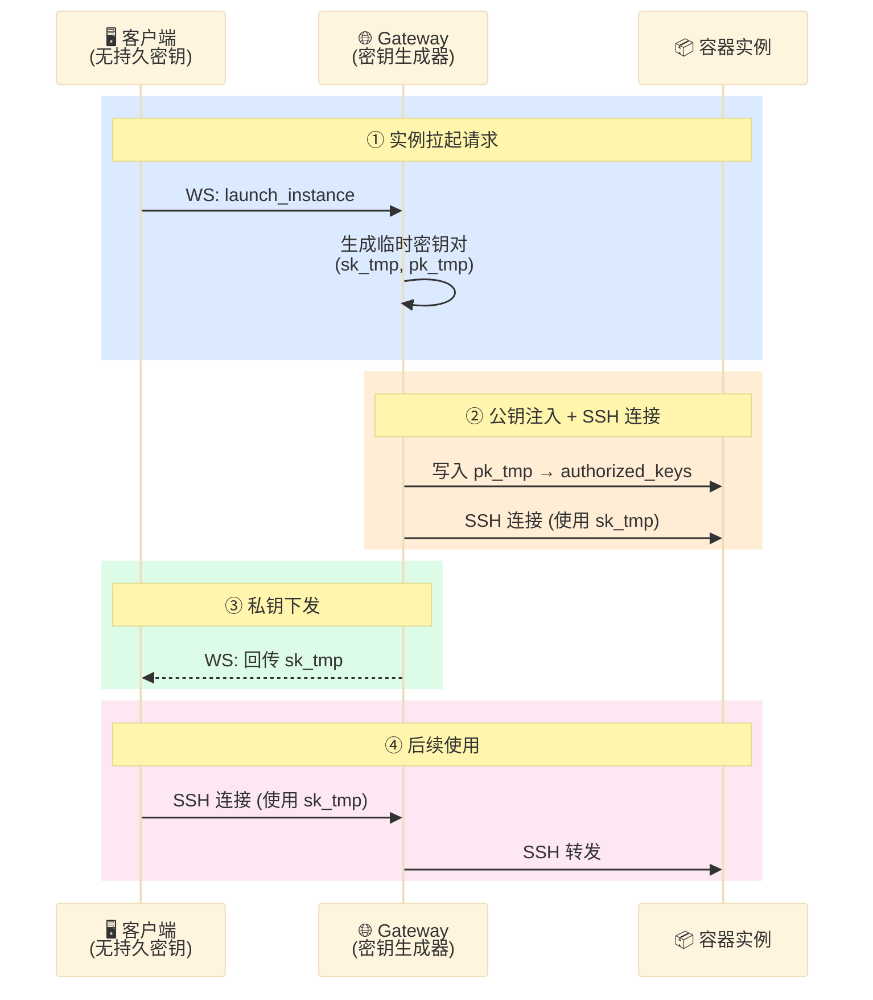

| 动作 | 内容 |
|------|------|
| **密钥生成** | Gateway 在拉起实例时动态生成临时密钥对 |
| **公钥部署** | Gateway 直接写入实例 `authorized_keys` |
| **私钥回传** | Gateway 通过已有 WS 安全通道将私钥下发给客户端 |
| **私钥传输** | ⚠️ **有** — 私钥经 WS 通道传输一次 |
| **生命周期** | 实例销毁时密钥对同时废弃 |
| **安全等级** | 🔓 **中高** — Gateway 持有私钥副本，可看到会话内容；但密钥一次性，攻击窗口小 |

### 2.3 方案对比总结

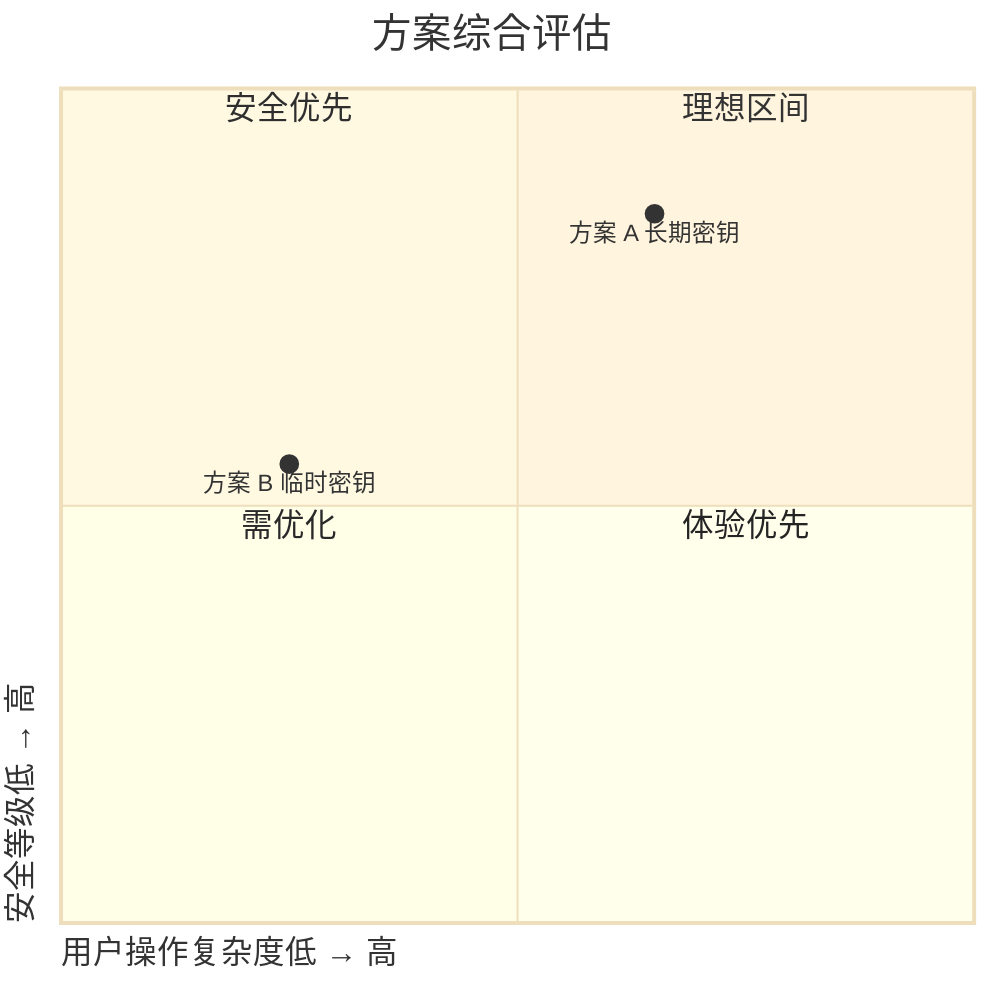

| 维度 | 🔑 方案 A (长期密钥) | 🔄 方案 B (临时密钥) |
|------|:---:|:---:|
| 私钥是否离开客户端 | ❌ 否 | ✅ 是（经 WS 传输一次） |
| Gateway 可读会话 | ❌ 否 | ✅ 是 |
| 用户操作复杂度 | 🔴 高（需生成+上传公钥） | 🟢 **低**（无感知） |
| 客户端 SSH 依赖 | ✅ 需要本地安装 | ❌ 不需要 |
| 密钥泄露波及面 | 🔴 大（长期有效） | 🟢 小（单实例、一次性） |
| 适合 TUI 载体 | 🖥️ **本地终端模拟器** | 🌐 纯浏览器（xterm.js） |

---

## 三、TUI 载体分析

### 3.1 方式一：浏览器终端（xterm.js over WS）

```mermaid
%%{init: {'theme': 'base', 'themeVariables': { 'fontSize': '13px'}}}%%
flowchart LR
    Browser["🌐 浏览器<br/>xterm.js"] 
    ===|"WS 帧<br/>(pty I/O 封装)"| 
    GW["🌐 Gateway<br/>━━━━━━━━<br/>WS ↔ SSH 协议转换"]
    ===|"SSH 连接<br/>(Gateway 持有密钥)"|
    Instance["📦 容器实例<br/>sshd + Claude Code"]

    classDef browserNode fill:#fef3c7,stroke:#d97706,color:#78350f
    classDef gwNode fill:#dbeafe,stroke:#2563eb,color:#1e40af
    classDef instNode fill:#dcfce7,stroke:#16a34a,color:#14532d
    
    class Browser browserNode
    class GW gwNode
    class Instance instNode
```

- SSH 协议终结在 Gateway，Gateway 将 pty 输入输出通过 WS 帧转发
- Gateway 同时作为 SSH 客户端和 WS 服务端
- 密钥在 Gateway 上管理（方案 B 天然匹配）
- 防火墙友好，仅需 443 端口

### 3.2 方式二：本地终端模拟器（Native SSH）

```mermaid
%%{init: {'theme': 'base', 'themeVariables': { 'fontSize': '13px'}}}%%
flowchart LR
    Term["🖥️ 本地终端<br/>ssh client + sk_user"] 
    ===|"SSH 加密连接<br/>(用户私钥签名)"|
    GW["🌐 Gateway<br/>━━━━━━━━<br/>TCP 层透传<br/>(不解密 SSH)"]
    ===|"SSH 加密连接<br/>(用户私钥签名)"|
    Instance["📦 容器实例<br/>sshd + Claude Code"]

    classDef termNode fill:#e0e7ff,stroke:#4f46e5,color:#312e81
    classDef gwNode fill:#fef3c7,stroke:#d97706,color:#78350f
    classDef instNode fill:#dcfce7,stroke:#16a34a,color:#14532d
    
    class Term termNode
    class GW gwNode
    class Instance instNode
```

- 客户端运行标准 SSH，Gateway 做 ProxyJump 或 TCP 转发
- SSH 连接端到端加密（Gateway 只透传 TCP/SSH 层）
- 密钥在本地（方案 A 天然匹配）

### 3.3 区别与联系

| | 🌐 xterm.js over WS | 🖥️ 本地 SSH 客户端 |
|---|---|---|
| **网络通道** | 复用已有 WS 连接（单端口 443） | 新 TCP 连接（端口 22 或其他） |
| **SSH 对端** | Gateway（Gateway 做 SSH 客户端连实例） | Gateway 透明转发，实际对端是实例 |
| **密钥位置** | Gateway | 用户本地 |
| **WS/SSH 关系** | WS **承载** SSH 的终端 I/O，SSH 对用户透明 | WS 和 SSH **独立并存**，各管各的通道 |
| **防火墙友好** | ✅ 是（仅需 443） | ⚠️ 可能需要开放额外端口 |
| **客户端依赖** | 仅需浏览器 | 需安装 SSH 客户端 |

---

## 四、选定方案：方案 A — 端到端公钥认证

### 4.1 整体拓扑

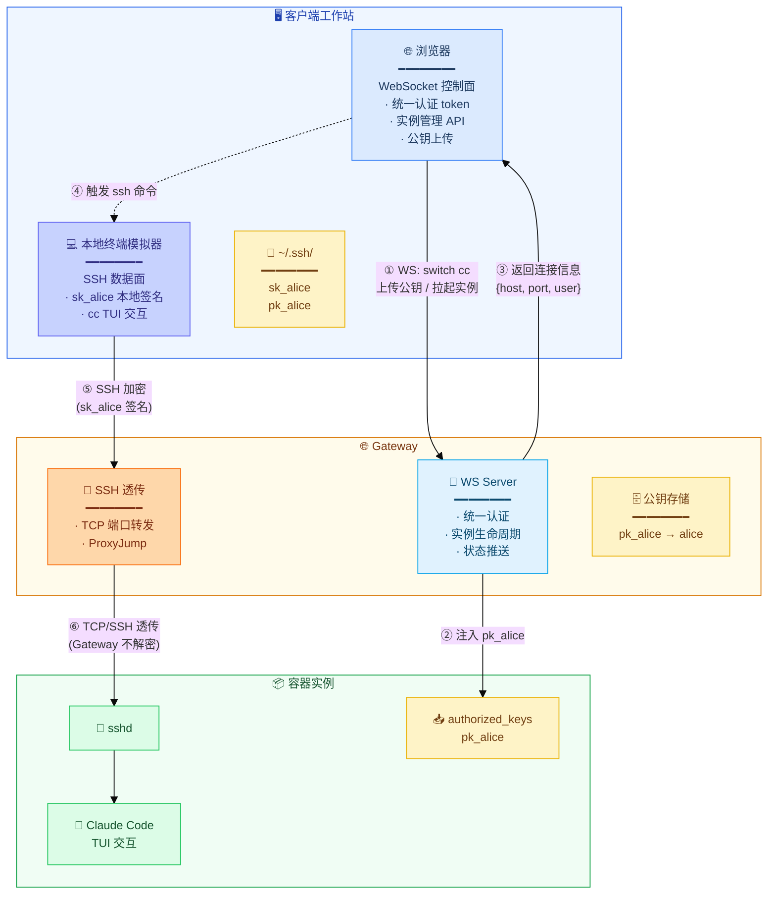

### 4.2 双通道架构

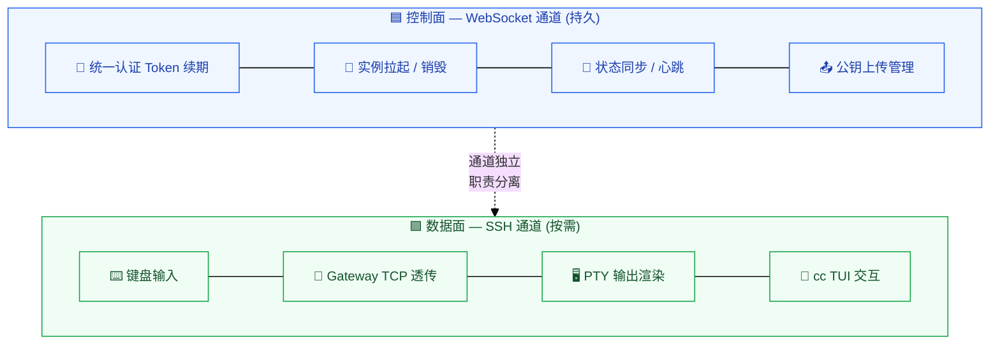

- **WS 通道**（控制面）：持久长连接，负责统一认证续期、实例生命周期管理、状态推送
- **SSH 通道**（数据面）：按需建立，承载 cc 实例的终端 pty I/O，端到端加密

### 4.3 密钥生命周期

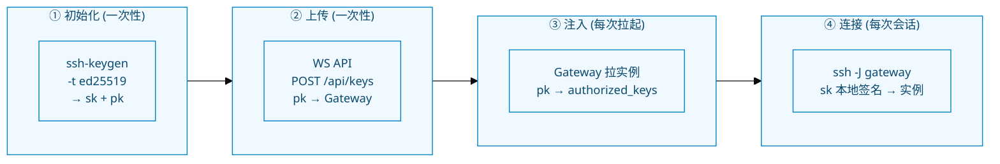

#### 阶段 1：初始化 — 用户生成密钥对

```bash
ssh-keygen -t ed25519 -f ~/.ssh/id_ed25519_cc
# → sk_alice : ~/.ssh/id_ed25519_cc        (权限 600)
# → pk_alice : ~/.ssh/id_ed25519_cc.pub    (权限 644)
```

#### 阶段 2：公钥上传 — 通过 WS 控制面

```http
POST /api/keys
Authorization: Bearer <token>
Content-Type: application/json

{
    "public_key": "ssh-ed25519 AAAAC3NzaC1lZDI1NTE5AAAAI... alice@workstation"
}
```

Gateway 将公钥关联到用户身份，持久化存储。用户可管理多把密钥（laptop 一把、desktop 一把）。

#### 阶段 3：实例拉取 — 公钥注入

Gateway 在拉起容器实例时将用户公钥注入至 `authorized_keys`：

| 方式 | 说明 | 推荐度 |
|------|------|:---:|
| **cloud-init** | 通过容器平台的 user-data 注入 | ⭐⭐⭐ |
| **volume mount** | `-v /keys/alice.pub:/home/cc/.ssh/authorized_keys:ro` | ⭐⭐ |
| **SSH 后门注入** | Gateway 先用临时密钥 SSH 进入，写入后删除 | ⭐ |

#### 阶段 4：SSH 连接

```bash
# 直接使用 ProxyJump
ssh -J alice@gateway:2222 cc@<container-ip>

# 或配置 ~/.ssh/config
Host cc
    HostName <container-ip>
    User cc
    ProxyJump alice@gateway:2222
    IdentityFile ~/.ssh/id_ed25519_cc

ssh cc
```

### 4.4 完整时序图

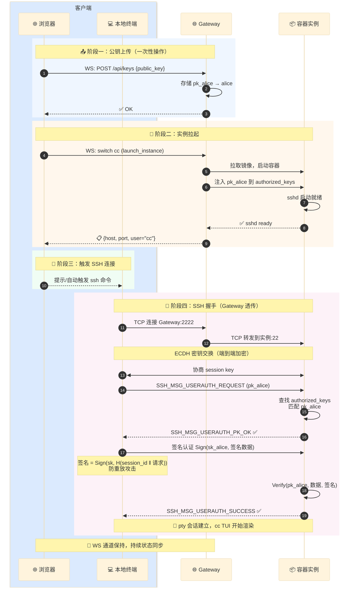

### 4.5 SSH 透传实现要点

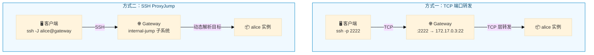

#### 方式 I：TCP 端口转发（更简单）

Gateway 为每个实例分配一个转发端口，随实例生命周期动态分配和回收：

| Gateway 端口 | 转发目标 | 所属用户 |
|:---:|---|---|
| `:2222` | → `172.17.0.3:22` | alice |
| `:2223` | → `172.17.0.4:22` | bob |

Gateway 做纯 TCP 层转发，完全不接触 SSH 协议层。

#### 方式 II：SSH ProxyJump（更标准）

```ssh_config
# Gateway sshd 配置 — 自定义子系统方案
Match User *
    ForceCommand internal-jump
```

客户端使用 `ssh -J alice@gateway cc@<container>` 即可。Gateway 上的跳板服务根据用户身份和请求参数，动态解析目标实例地址后建立转发。

### 4.6 优势与代价

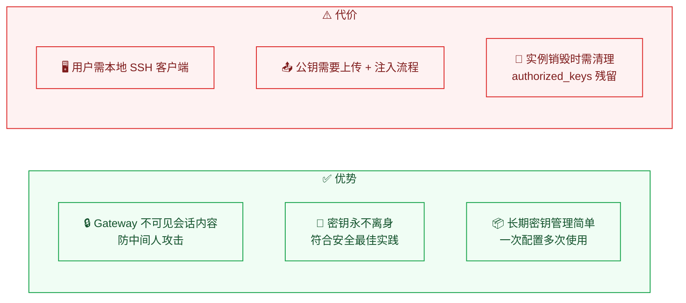

---

## 五、总结

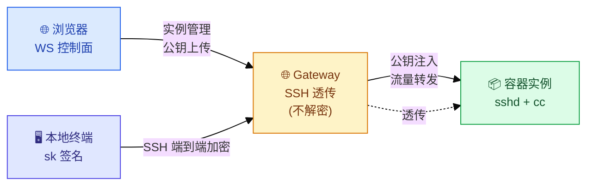

| 设计要点 | 说明 |
|----------|------|
| **认证链路** | 浏览器 (WS) → Gateway (透传) → 容器 (sshd)，SSH 端到端加密 |
| **通道分离** | WS = 控制面（实例管理），SSH = 数据面（cc TUI 交互） |
| **密钥策略** | 用户持长期私钥（方案 A），Gateway 不持有私钥、不可见会话内容 |
| **公钥注入** | Gateway 在拉起实例时自动将用户公钥写入 `authorized_keys` |
| **安全边界** | Gateway 即使被攻破也无法解密 SSH 会话或伪装用户身份 |
