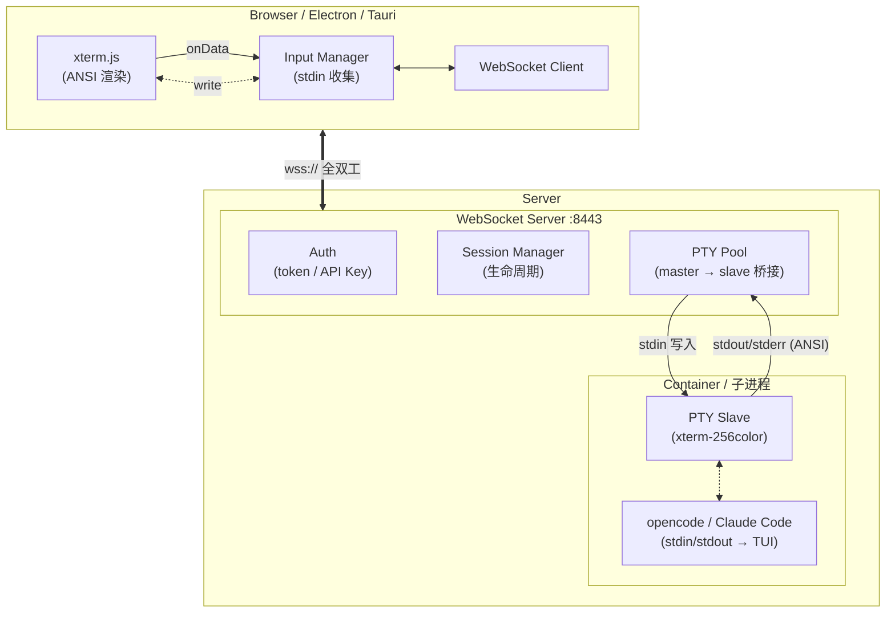
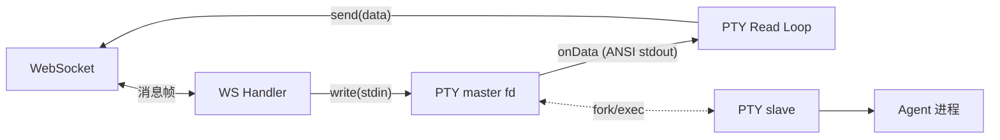
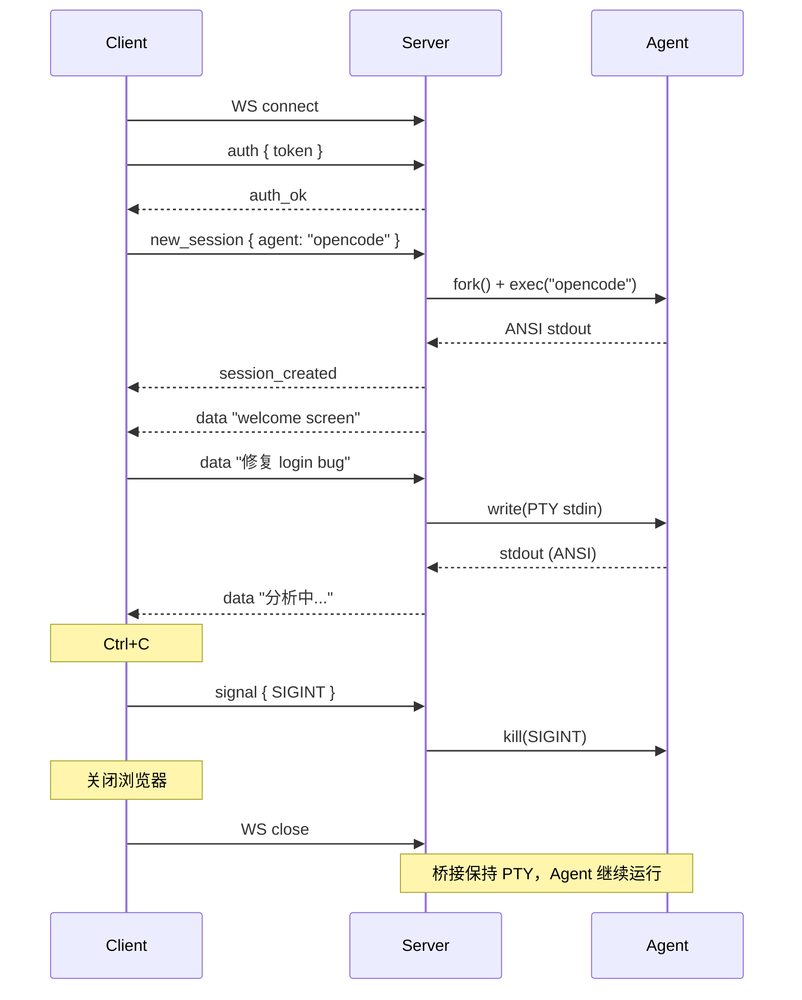
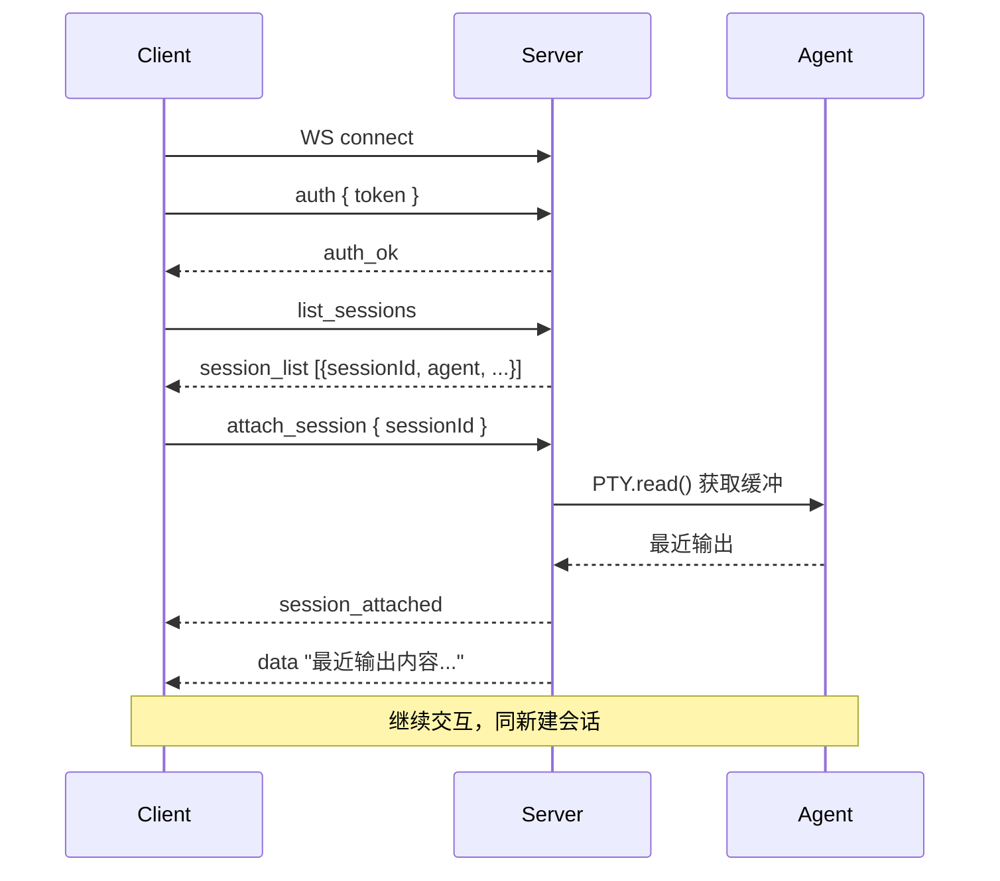

# PTY Remote Agent Terminal Architecture

> 服务端部署 opencode / Claude Code + PTY，客户端通过 xterm.js 渲染完整 ANSI 输出，双向通信基于 WebSocket。

---

## 一、总体架构



---

## 二、通信协议

### 2.1 传输层

| 项目 | 选型 | 理由 |
|------|------|------|
| 协议 | **WebSocket** (wss://) | 全双工、低延迟、浏览器原生支持 |
| 端口 | `8443`（默认，可配） | 复用已有 TLS 证书 |
| 心跳 | 每 30s ping/pong | 保持连接存活 |

### 2.2 消息格式

所有消息为 **JSON 帧**，用 `type` 字段区分：

```json
{
  "type": "string",
  "seq": 0,
  "ts": 1719123456789,
  "payload": {}
}
```

| 字段 | 类型 | 说明 |
|------|------|------|
| `type` | string | 消息类型 |
| `seq` | number | 消息序号（控制消息用），数据消息可选 |
| `ts` | number | Unix 毫秒时间戳 |
| `payload` | object/string | 类型相关负载 |

### 2.3 消息类型（上行 Client → Server）

| type | 方向 | 说明 | payload |
|------|------|------|---------|
| `auth` | ↑ | 认证 | `{ token: "...", sessionId?: "..." }` |
| `data` | ↑ | 终端输入（stdin） | `"用户敲的字符..."`（**纯字符串**，非 JSON 内嵌） |
| `resize` | ↑ | 窗口大小变更 | `{ cols: 120, rows: 40 }` |
| `signal` | ↑ | 信号发送 | `{ signal: "SIGINT" \| "SIGTERM" \| "SIGQUIT" }` |
| `new_session` | ↑ | 创建新 Agent 会话 | `{ agent: "opencode" \| "claude", cwd?: "/path", env?: {} }` |
| `attach_session` | ↑ | 重连已有会话 | `{ sessionId: "..." }` |
| `list_sessions` | ↑ | 列出用户会话 | `{}` |

### 2.4 消息类型（下行 Server → Client）

| type | 方向 | 说明 | payload |
|------|------|------|---------|
| `auth_ok` | ↓ | 认证成功 | `{ sessionId: "...", cols: 120, rows: 40 }` |
| `auth_err` | ↓ | 认证失败 | `{ message: "..." }` |
| `data` | ↓ | 终端输出（含完整 ANSI） | `"...ANSI 转义序列..."`（**纯字符串**） |
| `resize_ack` | ↓ | 窗口大小确认 | `{ cols: 120, rows: 40 }` |
| `session_created` | ↓ | 新会话已创建 | `{ sessionId: "...", agent: "opencode" }` |
| `session_attached` | ↓ | 已重连 | `{ sessionId: "...", history: "最近输出..." }` |
| `session_list` | ↓ | 会话列表 | `{ sessions: [...] }` |
| `session_closed` | ↓ | 会话已终止 | `{ sessionId: "...", exitCode: 0 }` |
| `error` | ↓ | 错误 | `{ code: 500, message: "..." }` |
| `pong` | ↓ | 心跳应答 | `{}` |

### 2.5 `data` 消息特殊处理

`data` 消息**不走 JSON 序列化**（避免 ANSI 转义符被破坏），而是直接以字符串形式随 WebSocket 文本帧发送：

```
Server → Client（WS text frame，非 JSON）:
data\n\x1b[32m✓ done\x1b[0m\nmodified 2 files

Client → Server（WS text frame，非 JSON）:
data\n修复 login bug
```

这是性能最优方案——不需要在 JSON 中 escape ANSI 控制码，也不需要 base64 编解码。

---

## 三、服务端设计

### 3.1 核心组件

```
server/
├── main.py               # 入口：启动 WS Server
├── auth.py               # 认证（JWT / API Key）
├── session_manager.py    # 会话生命周期管理
├── pty_bridge.py         # PTY master ←→ WebSocket 桥接
├── pty_pool.py           # PTY 资源池
└── config.py             # 配置
```

### 3.2 PTY Bridge 核心逻辑



```python
import asyncio
import json
import os
import pty
import signal
import struct
import fcntl
import termios
from pathlib import Path

class PTYBridge:
    """单个会话的 PTY ↔ WebSocket 桥接"""

    def __init__(self, session_id: str, websocket, agent: str, cwd: str):
        self.session_id = session_id
        self.ws = websocket
        self.agent = agent
        self.cwd = cwd
        self.cols = 120
        self.rows = 40
        self.master_fd = None
        self.pid = None
        self._buffer = b""
        self._ready = asyncio.Event()

    async def start(self):
        """创建 PTY 并启动 Agent 进程"""
        pid, master_fd = pty.fork()

        if pid == 0:
            # 子进程：设置终端环境
            os.environ["TERM"] = "xterm-256color"
            os.environ["COLUMNS"] = str(self.cols)
            os.environ["LINES"] = str(self.rows)
            os.chdir(self.cwd)

            if self.agent == "opencode":
                os.execvpe("opencode", ["opencode"], os.environ)
            elif self.agent == "claude":
                os.execvpe("claude", ["claude"], os.environ)
            else:
                os.execvpe(self.agent, [self.agent], os.environ)

        # 父进程：管理 PTY master
        self.master_fd = master_fd
        self.pid = pid

        # 设置窗口大小
        self._set_winsize()

        # 启动读取循环
        asyncio.create_task(self._read_loop())

    async def write(self, data: str):
        """写入 PTY（来自客户端的 stdin）"""
        os.write(self.master_fd, data.encode())

    async def resize(self, cols: int, rows: int):
        """响应客户端窗口大小变更"""
        self.cols = cols
        self.rows = rows
        self._set_winsize()

    async def send_signal(self, sig: str):
        """发送信号给 Agent 进程"""
        sig_map = {
            "SIGINT":  signal.SIGINT,
            "SIGTERM": signal.SIGTERM,
            "SIGQUIT": signal.SIGQUIT,
        }
        if self.pid and sig in sig_map:
            os.kill(self.pid, sig_map[sig])
        elif sig == "SIGINT":
            os.write(self.master_fd, b"\x03")  # 写入 Ctrl+C 字符

    async def kill(self):
        """终止进程并清理"""
        if self.pid:
            try:
                os.kill(self.pid, signal.SIGTERM)
                os.waitpid(self.pid, os.WNOHANG)
            except ProcessLookupError:
                pass
        if self.master_fd:
            os.close(self.master_fd)

    def _set_winsize(self):
        """设置 PTY 窗口大小，触发 SIGWINCH"""
        if self.master_fd:
            winsize = struct.pack("HHHH", self.rows, self.cols, 0, 0)
            fcntl.ioctl(self.master_fd, termios.TIOCSWINSZ, winsize)

    async def _read_loop(self):
        """持续读取 PTY 输出，推送至客户端"""
        loop = asyncio.get_event_loop()
        while True:
            try:
                data = await loop.run_in_executor(
                    None, os.read, self.master_fd, 4096
                )
                if not data:
                    break  # 子进程已退出
                await self.ws.send(f"data\n{data.decode(errors='replace')}")
            except OSError:
                break
        # 子进程退出
        _, exit_code = os.waitpid(self.pid, 0)
        await self.ws.send(
            json.dumps({
                "type": "session_closed",
                "sessionId": self.session_id,
                "exitCode": exit_code >> 8,
            })
        )
```

### 3.3 Session Manager

```python
class SessionManager:
    """管理用户的所有 Agent 会话"""

    def __init__(self):
        self.sessions: dict[str, PTYBridge] = {}
        self.user_sessions: dict[str, list[str]] = {}  # user_id → [session_id]

    async def create(self, user_id: str, ws, agent: str, cwd: str) -> PTYBridge:
        session_id = f"{user_id}-{agent}-{uuid4().hex[:8]}"
        bridge = PTYBridge(session_id, ws, agent, cwd)
        await bridge.start()
        self.sessions[session_id] = bridge
        self.user_sessions.setdefault(user_id, []).append(session_id)
        return bridge

    def get(self, session_id: str) -> PTYBridge | None:
        return self.sessions.get(session_id)

    async def attach(self, session_id: str, ws) -> PTYBridge | None:
        bridge = self.sessions.get(session_id)
        if bridge:
            bridge.ws = ws
        return bridge

    def list_for_user(self, user_id: str) -> list[dict]:
        result = []
        for sid in self.user_sessions.get(user_id, []):
            b = self.sessions.get(sid)
            if b:
                result.append({
                    "sessionId": sid,
                    "agent": b.agent,
                    "cwd": b.cwd,
                    "active": b.pid is not None,
                })
        return result

    async def remove(self, session_id: str):
        bridge = self.sessions.pop(session_id, None)
        if bridge:
            await bridge.kill()
```

### 3.4 WebSocket Server 入口

```python
import asyncio
import json
import websockets
from websockets.asyncio.server import serve

session_mgr = SessionManager()

async def handler(websocket):
    user_id = None
    bridge: PTYBridge | None = None

    async for raw in websocket:
        # 解析消息（data 类型是纯文本行，其他是 JSON）
        parts = raw.split("\n", 1)
        msg_type = parts[0]
        payload = parts[1] if len(parts) > 1 else ""

        match msg_type:
            case "auth":
                p = json.loads(payload)
                # 验证 token... 简化示例直接放行
                user_id = p.get("token", "anon")
                await websocket.send(json.dumps({
                    "type": "auth_ok", "sessionId": p.get("sessionId", "")
                }))

            case "new_session":
                p = json.loads(payload)
                bridge = await session_mgr.create(
                    user_id, websocket,
                    agent=p.get("agent", "opencode"),
                    cwd=p.get("cwd", "/home/user"),
                )
                await websocket.send(json.dumps({
                    "type": "session_created",
                    "sessionId": bridge.session_id,
                    "agent": bridge.agent,
                }))

            case "attach_session":
                p = json.loads(payload)
                bridge = await session_mgr.attach(p["sessionId"], websocket)
                if bridge:
                    await websocket.send(json.dumps({
                        "type": "session_attached",
                        "sessionId": bridge.session_id,
                    }))
                else:
                    await websocket.send(json.dumps({
                        "type": "error", "code": 404, "message": "session not found"
                    }))

            case "data":
                if bridge:
                    await bridge.write(payload)  # 写入 PTY

            case "resize":
                p = json.loads(payload)
                if bridge:
                    await bridge.resize(p["cols"], p["rows"])

            case "signal":
                p = json.loads(payload)
                if bridge:
                    await bridge.send_signal(p["signal"])

            case "list_sessions":
                if user_id:
                    await websocket.send(json.dumps({
                        "type": "session_list",
                        "sessions": session_mgr.list_for_user(user_id),
                    }))

            case "ping":
                await websocket.send("pong\n")


asyncio.run(serve(handler, "0.0.0.0", 8443))
```

---

## 四、客户端设计

### 4.1 核心组件

```
client/
├── terminal.js     # xterm.js 实例 + PTY 桥接逻辑
├── session.js      # 会话管理（创建/重连/列表）
├── transport.js    # WebSocket 通信层
├── auth.js         # 认证 token 管理
└── index.html      # 入口页面
```

### 4.2 客户端核心逻辑（TypeScript）

```typescript
import { Terminal } from "@xterm/xterm";
import { FitAddon } from "@xterm/addon-fit";
import { WebglAddon } from "@xterm/addon-webgl";
import "xterm/css/xterm.css";

class AgentTerminal {
  private term: Terminal;
  private ws: WebSocket;
  private sessionId: string | null = null;
  private fitAddon: FitAddon;

  constructor(container: HTMLElement) {
    this.term = new Terminal({
      cursorBlink: true,
      fontSize: 14,
      fontFamily: "JetBrains Mono, monospace",
      theme: { background: "#1e1e1e" },
      cols: 120,
      rows: 40,
    });

    // 高性能 WebGL 渲染器
    this.term.loadAddon(new WebglAddon());
    this.fitAddon = new FitAddon();
    this.term.loadAddon(this.fitAddon);
    this.term.open(container);
    this.fitAddon.fit();

    // 窗口大小变更 → 服务端
    this.term.onResize(({ cols, rows }) => {
      this.send("resize", { cols, rows });
    });

    // 键盘输入 → 服务端 (stdin)
    this.term.onData((data) => {
      this.sendRaw("data", data);  // 直接发送字符串，不 JSON 序列化
    });
  }

  // ── 会话控制 ──

  async connect(url: string, token: string): Promise<void> {
    this.ws = new WebSocket(url);

    this.ws.onopen = () => {
      this.send("auth", { token });
    };

    this.ws.onmessage = (e) => {
      this.handleMessage(e.data as string);
    };

    this.ws.onclose = () => {
      this.term.writeln("\r\n\x1b[31m[Connection lost. Reconnecting...]\x1b[0m");
    };
  }

  async newSession(agent: "opencode" | "claude"): Promise<void> {
    this.send("new_session", { agent, cwd: "/home/user/project" });
  }

  async attachSession(sessionId: string): Promise<void> {
    this.send("attach_session", { sessionId });
  }

  // ── 消息处理 ──

  private handleMessage(raw: string): void {
    const newlineIdx = raw.indexOf("\n");
    if (newlineIdx === -1) return;

    const type = raw.substring(0, newlineIdx);
    const payload = raw.substring(newlineIdx + 1);

    switch (type) {
      case "data":
        // 直接写入 xterm（完整 ANSI 渲染）
        this.term.write(payload);
        break;

      case "auth_ok":
        const auth = JSON.parse(payload);
        this.sessionId = auth.sessionId;
        break;

      case "session_created":
        const created = JSON.parse(payload);
        this.sessionId = created.sessionId;
        break;

      case "session_list":
        // 展示会话列表供用户选择
        break;

      case "error":
        const err = JSON.parse(payload);
        this.term.writeln(`\r\n\x1b[31m[Error] ${err.message}\x1b[0m`);
        break;

      case "pong":
        break;
    }
  }

  private send(type: string, payload: object): void {
    if (this.ws.readyState === WebSocket.OPEN) {
      this.ws.send(`${type}\n${JSON.stringify(payload)}`);
    }
  }

  private sendRaw(type: string, data: string): void {
    if (this.ws.readyState === WebSocket.OPEN) {
      this.ws.send(`${type}\n${data}`);
    }
  }

  disconnect(): void {
    this.ws.close();
    this.term.dispose();
  }
}
```

---

## 五、前端 HTML 入口

```html
<!DOCTYPE html>
<html>
<head>
  <meta charset="utf-8" />
  <style>
    * { margin: 0; padding: 0; box-sizing: border-box; }
    html, body { height: 100%; background: #1e1e1e; }
    #toolbar {
      height: 36px; background: #2d2d2d; display: flex;
      align-items: center; padding: 0 12px; gap: 8px;
    }
    #terminal-container { height: calc(100% - 36px); }
    select, button {
      padding: 2px 8px; border: 1px solid #555;
      background: #3c3c3c; color: #ccc; border-radius: 3px; cursor: pointer;
    }
  </style>
</head>
<body>
  <div id="toolbar">
    <select id="agent-select">
      <option value="opencode">opencode</option>
      <option value="claude">Claude Code</option>
    </select>
    <button id="btn-new">新会话</button>
    <button id="btn-reconnect" style="display:none">重连</button>
    <span id="status" style="color:#888;font-size:12px;margin-left:auto;"></span>
  </div>
  <div id="terminal-container"></div>
  <script type="module" src="./terminal.js"></script>
</body>
</html>
```

---

## 六、完整通信时序

### 6.1 新建会话



### 6.2 重连已有会话



---

## 七、增强能力

### 7.1 tmux 内置（可选）

按需在 Agent 进程外包一层 tmux，实现断线保护：

```python
async def start(self):
    pid, master_fd = pty.fork()
    if pid == 0:
        os.environ["TERM"] = "xterm-256color"
        os.chdir(self.cwd)
        # tmux 包裹：断开后 Agent 继续运行
        os.execvpe("tmux", [
            "tmux", "new-session", "-A",
            "-s", f"agent-{self.session_id}",
            self.agent  # opencode / claude
        ], os.environ)
```

客户端重连后只需 `tmux attach` 即可恢复。但 Web 场景下客户端无感知，服务端自动 attach。

### 7.2 输出缓冲（重连时回放最近输出）

PTY Bridge 维护一个环形缓冲区，重连时把最近 N 行推送给新客户端：

```python
class PTYBridge:
    def __init__(self, ...):
        self._ring_buffer: list[str] = []
        self._ring_max = 500  # 最多保留 500 行

    async def _read_loop(self):
        while True:
            data = await loop.run_in_executor(None, os.read, self.master_fd, 4096)
            if not data:
                break
            text = data.decode(errors="replace")
            self._ring_buffer.append(text)
            if len(self._ring_buffer) > self._ring_max:
                self._ring_buffer = self._ring_buffer[-self._ring_max:]
            if self.ws:
                await self.ws.send(f"data\n{text}")

    def get_recent_output(self) -> str:
        return "".join(self._ring_buffer)
```

---

## 八、部署形态

| 形态 | 说明 |
|------|------|
| **单机直连** | 一台服务器上同时跑 WebSocket Server + opencode PTY |
| **Docker + 单容器** | 一个容器 = opencode + sshd + ws-server，适合个人开发 |
| **Gateway + 多容器** | Gateway 做 WebSocket 入口 + 路由，每个用户一个容器实例，适合多租户平台 |

### Docker 最小镜像

```dockerfile
FROM node:22-slim

RUN apt update && apt install -y \
    python3 python3-pip tmux \
    && rm -rf /var/lib/apt/lists/*

# 安装 opencode
RUN npm install -g opencode-ai

# 安装 WS Server 依赖
WORKDIR /app
COPY server/package.json .
RUN npm install
COPY server/ .

EXPOSE 8443
CMD ["node", "main.js"]
```


