# 三方 Agent 制品管理与镜像工厂总体设计（V2 评审稿）

> 文档状态：评审稿，未定稿  
> 适用范围：AgentOS Control Panel 三方 Agent 管理模块、`image_process` 镜像处理服务  
> 代码基线：`refactor/image_process`，`86f565d`（不含其后的 openclaw/node 安装模式改动）  
> 历史参考：`containerized-build.md`、`third-party-agent-integration-guide.md`  
> 上传门禁参考：OWASP [File Upload Cheat Sheet](https://cheatsheetseries.owasp.org/cheatsheets/File_Upload_Cheat_Sheet.html)（实践清单，非代码依赖）  
> 说明：本文是面向后续扩展的新版本总体设计，不替代或覆盖旧版设计文档。

## 1. 背景

当前三方 Agent 上架能力围绕单一场景实现：管理员上传符合 NPM `pack` 布局、且包名带平台后缀的离线 `.tgz` 包，系统将其中的可执行文件加入固定的 `agent-base:1.0`，生成 Agent 运行镜像并完成注册。

这一方案已经打通上传、构建、状态查询、离线镜像保存和注册链路，但输入格式、校验逻辑、构建方式和基础镜像被绑定在同一流程中。继续增加 node 包、wheel、独立 binary、OCI 镜像、SDK/SSH 注入、基础镜像升级、同包多基础镜像、制品删除和配额等能力时，容易要求同时修改管理面 API、Service、数据库模型、镜像处理客户端、Dockerfile 和注册逻辑，形成霰弹修改。

为了使后续能力能够沿制品类型（处理不同类型的三方制品）、处理 Recipe（根据需求选择不同的构建内容）和基础镜像（三方Agent默认运行底座）三个维度独立演进。初版的验收目标为ScienceFlow和OpenClaw,可以顺利上架至一体机。

## 2. 本次需求

本轮设计同时面向三个需求。针对用户上传场景的复杂问题，将管理产品的对象设定为**Agent Card**；已上传未构建等中间态不暂时不做管理，构建失败默认删除软件包并且需要重新上传才可以再次进行构建，即不进行单独的上传软件包的管理。

| 需求 | 需求描述 | 备注 |
|---|---|---|
| 1. 智能体卡片展示 | 增加智能体卡片描述；卡片信息**必须**来自注册中心 | 避免双份数据存储带来的问题 |
| 2. 新包 / 新构建方式 | 构建侧高内聚低耦合，新增软件包类型或 Recipe 不改管理面主链 | 重构目标是减少不同类型构建方式的适配成本 |
| 3. 智能体卡片管理 | 同一套卡片，按视图区分能力。权威数据在注册中心。**改（升级）**不在本次承载 | 见下方用户视图 / 管理员视图 |

智能体卡片本质是「软件包 + 机上预置依赖」经 Recipe 得到的可运行身份。卡片上的展示字段、运行字段和本机资源路径**全部收拢到注册中心**，管理面不为卡片再建第二份库。升级（改机上依赖）本轮不做流程，但源包路径已落在卡片上，后续可直接用。

卡片管理功能区分两种视图：

| | 用户视图 | 管理员视图 |
|---|---|---|
| 查 | 注册中心卡片列表/详情（名称、版本、描述等展示字段） | 同上，并可见本机软件包路径、镜像路径（待评审）还需要可见实例数量等，可以参考实例管理的部分能力 |
| 增 | 无 | 上架并构建，写入注册中心 |
| 删 | 无 | 先查实例，无实例才整卡拆除（软件包、镜像文件、已 load 镜像、注册记录） |
| 改 | 无 | 本轮不做（机上依赖升级） |

用户视图只消费已发布卡片，不接触本机路径和拆除动作。管理员视图在同一卡片上叠加运维信息与增删。

## 3. 系统上下文

参与方：普通用户、管理员、管理面、镜像工厂、注册中心。用户与管理员看到的是同一批注册中心卡片，接口按角色裁剪。

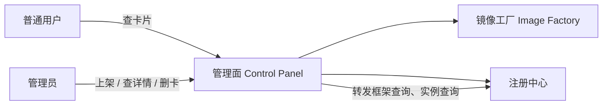

| 参与方 | 职责 |
|---|---|
| 普通用户 | 用户视图：刷新、查看已发布卡片 |
| 管理员 | 管理员视图：上架、查看含路径的详情、发起删卡 |
| 管理面 | 按角色鉴权；上传通用门禁与落盘；把路径交给工厂；用结果注册；按卡片路径清本机文件；转发查询 |
| 镜像工厂 | 解析制品、选择 Recipe 与 Base、校验能否构建并执行；按指示卸本机已 load 镜像 |
| 注册中心 | **卡片权威**；框架查询、实例查询、落卡与删卡 |

现状是**串行且耦合**：管理面既做落盘，又做包格式/平台校验和「能不能构建」；镜像处理只按固定 Dockerfile 和固定 base 执行。两个进程只是把执行器隔开，构建知识仍在管理面。注册串在构建成功之后。

目标：管理面只做通用门禁并把路径交出；解析、选策略、选 Base、构建都在工厂内完成。管理面再用工厂返回的名称、版本、镜像和 runtime 去注册中心落卡。

**现状**

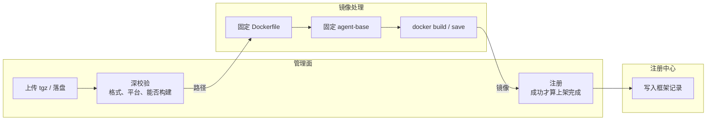

**目标**

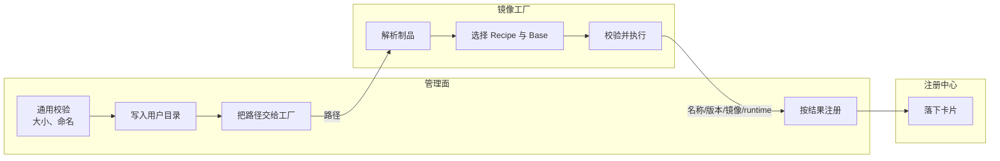

对应目标图，上传职责拆成两层，互不替代：

| | 管理面：通用门禁 | 镜像工厂：构建条件 |
|---|---|---|
| 问题 | 这是不是一次可接受的上传 | 这个文件能不能、以及如何做成镜像 |
| 做什么 | 单文件大小、实际字节封顶、磁盘余量；扩展名白名单；文件名去掉路径穿越，落盘名由服务端生成；先写临时文件再改名 | 解析包内容；选择 Recipe 与 Base；判断能否构建；执行 build/import/inject |
| 不做什么 | 不解包、不读 package.json、不选策略/底座 | 不管用户身份、配额展示、卡片目录 |
| 参考 | OWASP File Upload Cheat Sheet（实践清单，不是库） | Recipe 策略 + 工厂 |

## 4. 静态结构

本图说明卡片只属于注册中心；管理面不持有卡片库；工厂只持有 Recipe。

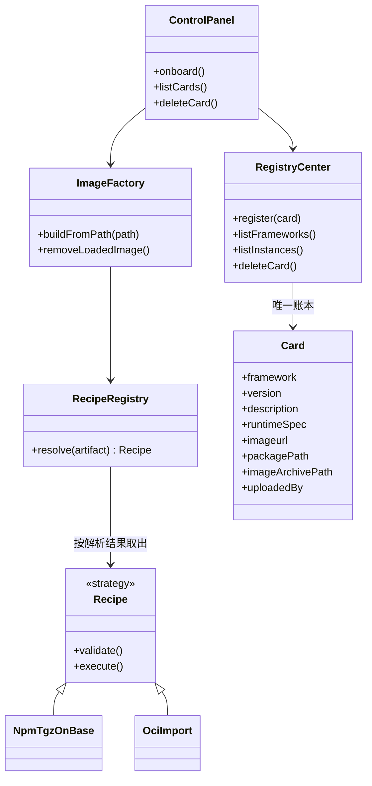

**卡片必须来自注册中心，一份数据。** 管理面不为卡片建 `LocalBinding` / `AgentRegistration` 一类本地表。上架时把展示、运行、本机路径一次性写入注册中心；查询只读注册中心；删除按卡片上的路径清文件。

现网注册中心 `/api/images`（jiuwenswarm `ImageEntry`）偏运行目录，不够管卡片。本设计**要求注册中心扩字段**，不以当前实现为上限：

| 字段 | 现网 | 本轮 | 谁用 |
|---|---|---|---|
| `framework` / `framework_version` | 有 | 保留，卡片主键 | 两种视图 |
| `runtime_spec` / `imageurl` / 资源字段 | 有 | 保留 | 拉起实例 |
| `uploaded_by` | 有 | 保留 | 管理员 |
| `description` | 无 | **新增** | 两种视图展示 |
| `package_path` | 无 | **新增** | 管理员详情、整卡删源包 |
| `image_archive_path` | 无 | **新增** | 管理员详情、整卡删落盘镜像 |
| `recipe_id` / `base_ref` | 无 | 建议一并写入 | 本轮不跑升级，留给后续改 |

用户视图由管理面裁掉 `package_path`、`image_archive_path` 等运维字段。文件仍物理落在管理面机器上，**路径记在卡片里**，不在管理面再抄一份。

**Recipe 与 Base 都在工厂内选择。** 管理面不理解包格式，也不选底座。工厂解析路径上的制品后，由 `RecipeRegistry` 匹配策略并选定 Base，再校验、执行。新增包类型或构建方式只改工厂。

## 5. 主成功路径

中间态不画进主路径。失败见 §7。

### 5.1 上架（增）

本图描述管理员上架：连续上传并构建，成功后注册中心落下带描述的卡片。

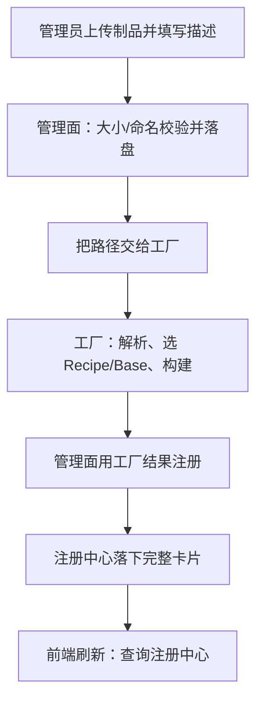

管理面在上架时只做通用校验（大小、安全命名）并落盘，然后把路径交给工厂。名称、版本、用哪条 Recipe、用哪个 Base，都由工厂解析后决定并随构建结果返回。管理面据此注册，不本地建卡片表。

### 5.2 查询（查）

本图描述卡片查询：列表对两种视图相同，都回源注册中心；本机路径只给管理员详情。

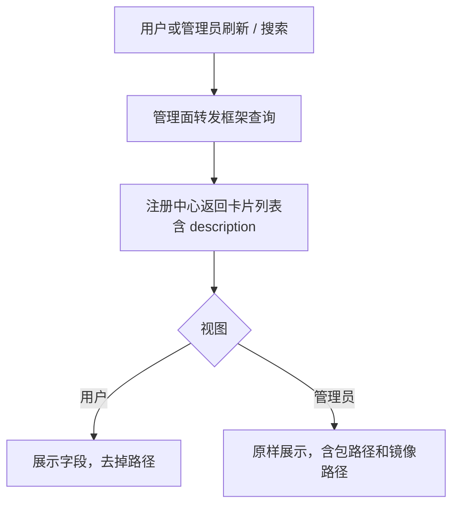

### 5.3 删除（删）

本图描述整卡拆除。有实例则到此为止。

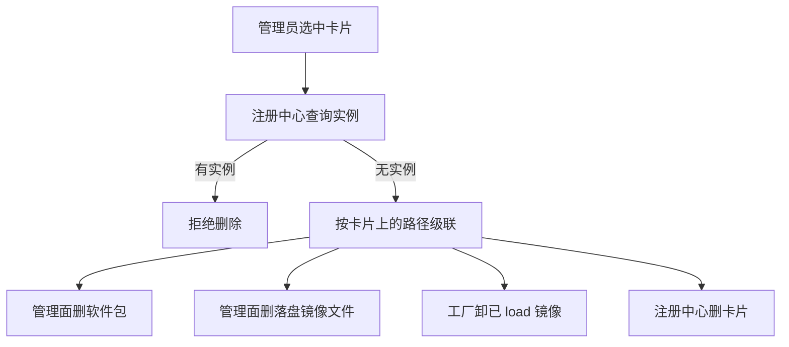

「改」即升级，本轮无主成功路径。

## 6. 关键交互

把上一节跨进程箭头展开为调用。对象与 §4 类图一致。

### 6.1 上架

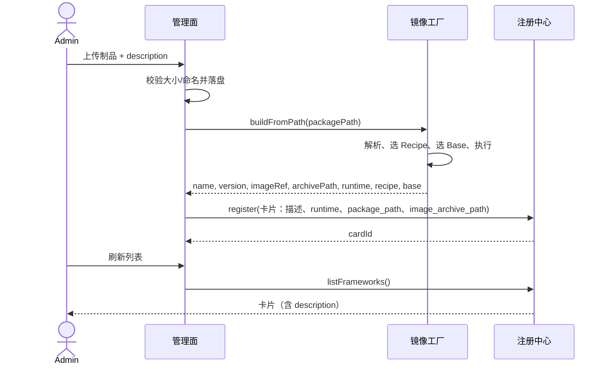

### 6.2 查询

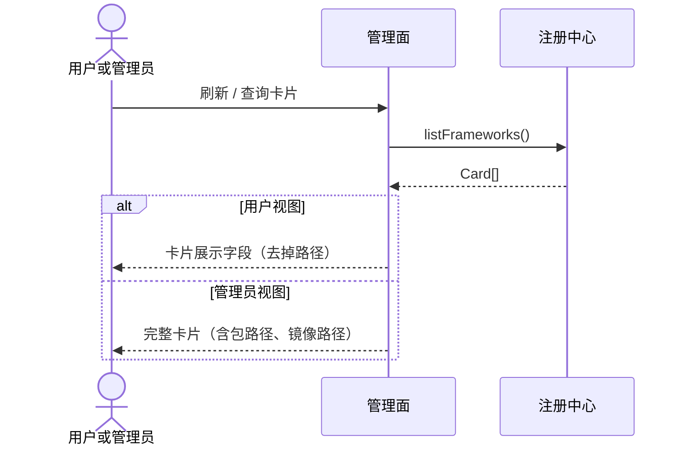

查询不经过镜像工厂。上架、删除时序仅管理员可发起。

### 6.3 删除

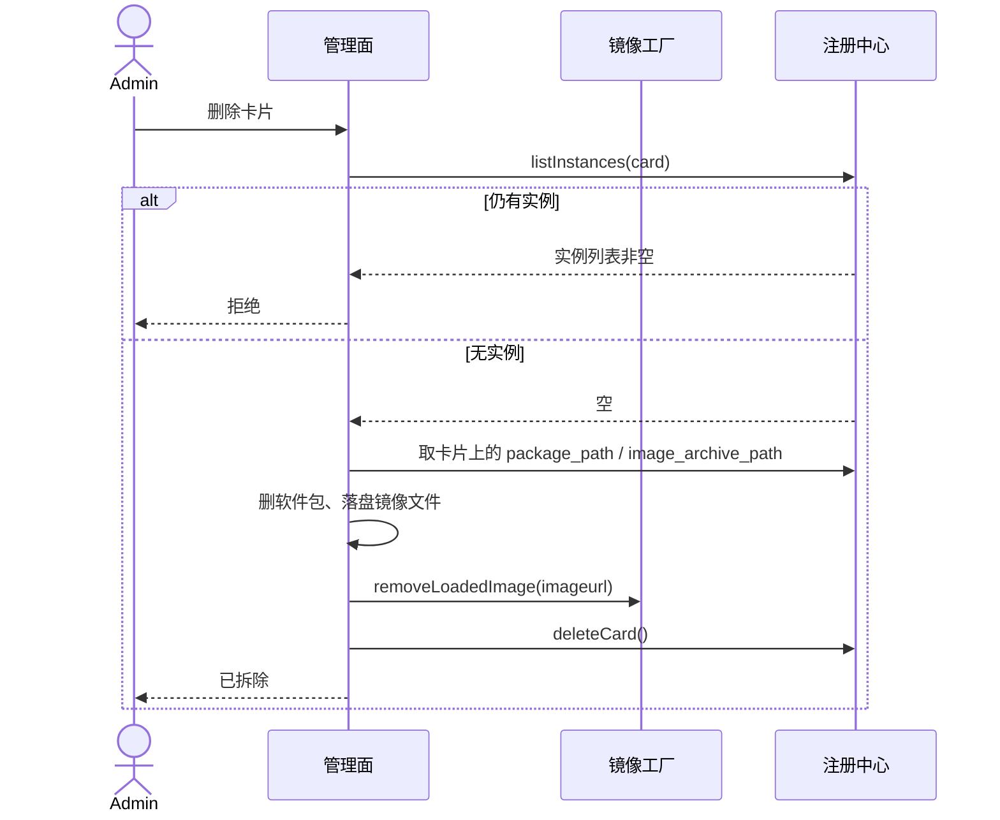

## 7. 异常

不塞进主流程。本轮只关心这两条：

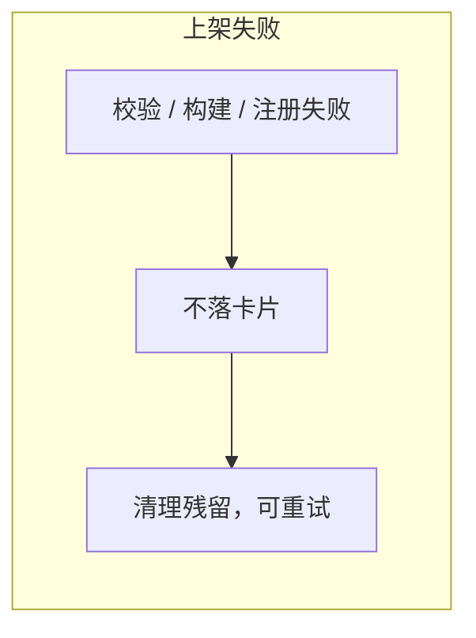

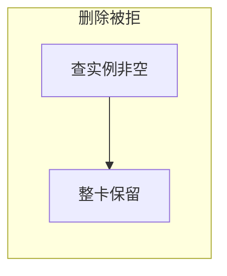

构建失败不在注册中心造半张卡。注册失败也不用 Job 成功冒充已上架。

## 8. 构建扩展（需求 2）

管理面编排固定：通用校验并落盘 → 把路径交给工厂 → 用结果注册。  
工厂内部：解析 → `RecipeRegistry.resolve` 选策略与 Base → 校验并执行。新增方式只加 Recipe。

| Recipe | 输入 | 作用 |
|---|---|---|
| `npm_tgz_on_base` | npm tgz | 基于预置 Base 构建（现网能力包装） |
| `oci_import` | OCI/Docker archive | 已构建镜像直接导入 |

后续 node/wheel 等只加新策略。工厂契约是「路径进、构建结果出」，不接收用户身份，也不要求管理面传入 Recipe 或 Base。

## 9. 范围确认

| 做 | 不做 |
|---|---|
| 卡片只存在注册中心；新增 `description`、`package_path`、`image_archive_path` | 管理面再做 LocalBinding / 卡片表 |
| 上架连续完成并一次写全卡片 | 已上传未构建作为可管理对象 |
| 查询回源；用户视图裁路径，管理员看全字段 | 用户侧增删卡 |
| 无实例按卡片路径整卡拆除 | 本轮实现升级流程（字段可先写入） |
| Recipe 插拔以支持新包和新构建 | 用户自定义 Recipe 脚本 |

## 10. 总结

- **卡片**是注册中心上的唯一账本：展示、运行、本机路径都在一张卡上，现网缺的字段由注册中心新增。  
- **构建**用策略 + 工厂拆开扩展轴。  
- **管理**本轮做增、删、查，区分用户/管理员视图；改（升级）不做流程。  
- 管理面不建第二份卡片库；删文件时读卡片上的路径，卸镜像仍交给工厂。
