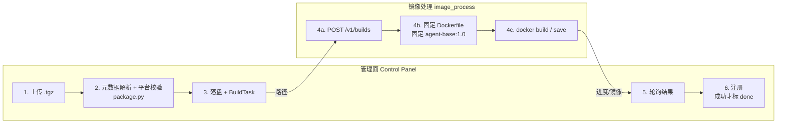
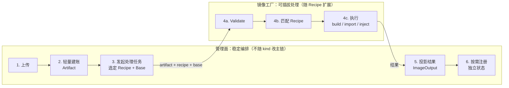

# 三方 Agent 制品管理与镜像工厂总体设计（V2 评审稿）

> 文档状态：评审稿，未定稿  
> 适用范围：AgentOS Control Panel 三方 Agent 管理模块、`image_process` 镜像处理服务  
> 代码基线：`refactor/image_process`，`86f565d`（不含其后的 openclaw/node 安装模式改动）  
> 历史参考：`containerized-build.md`、`third-party-agent-integration-guide.md`  
> 说明：本文是面向后续扩展的新版本总体设计，不替代或覆盖旧版设计文档。

## 1. 背景

当前三方 Agent 上架能力围绕单一场景实现：管理员上传符合 NPM `pack` 布局、且包名带平台后缀的离线 `.tgz` 包，系统将其中的可执行文件加入固定的 `agent-base:1.0`，生成 Agent 运行镜像并完成注册。

这一方案已经打通上传、构建、状态查询、离线镜像保存和注册链路，但输入格式、校验逻辑、构建方式和基础镜像被绑定在同一流程中。继续增加 node 包、wheel、独立 binary、OCI 镜像、SDK/SSH 注入、基础镜像升级、同包多基础镜像、制品删除和配额等能力时，容易要求同时修改管理面 API、Service、数据库模型、镜像处理客户端、Dockerfile 和注册逻辑，形成霰弹修改。

为了使后续能力能够沿制品类型（处理不同类型的三方制品）、处理 Recipe（根据需求选择不同的构建内容）和基础镜像（三方Agent默认运行底座）三个维度独立演进。初版的验收目标为ScienceFlow和OpenClaw,可以顺利上架至一体机。

## 2. 架构对比：现状与目标

**一句话目标：把「上传 → 校验 → 固定构建 → 注册」这条难扩展的串行专用编排，拆成可独立演进的稳定编排 + 可插拔处理。**

对比范围只看**管理面（Control Panel）**与**镜像处理模块（image_process / Image Factory）**。

### 2.1 现状：串行专用编排（As-Is）

服务虽已拆分，业务仍是一条写死的串行链路。新增一种包格式或构建方式，往往要同时改管理面解析、工厂 Dockerfile、任务字段和注册假设。



问题不在「有没有独立服务」，而在**编排语义是串行专用的**：

- 步骤顺序和含义绑死：上传就必须按 NPM pack 深校验，构建就必须走固定 Dockerfile，注册必须接在构建成功之后。
- 扩展点不独立：换输入、换构建法、换 base、换注册策略，都会扯动整条链。
- 管理面与镜像处理是进程拆分，不是扩展轴拆分。

### 2.2 目标：稳定编排 + 可插拔处理（To-Be）

目标是**让编排主链不再随制品类型变化**：

- 管理面只做稳定步骤：承担上传、建立元数据信息、发起处理任务、投影结果、按需注册并进行日志上报。
- 镜像工厂承接会变化的部分：某类制品如何校验、如何构建/导入/注入。
- 变化通过 **Artifact Kind × Recipe × BaseImage** 增加，而不是改串行主链。



读图时抓住两点：

1. **管理面主链固定**：1→2→3→5→6 对 npm tgz、OCI import、后续 node/wheel 都一样。  
2. **工厂内部可替换**：第 4 步换 Recipe，不改管理面编排代码。

### 2.3 新旧对照

| 维度 | 现状（串行专用） | 目标（可扩展编排） |
|---|---|---|
| 核心问题 | 一条链绑死输入/构建/注册 | 拆开扩展轴，主链稳定 |
| 管理面 | 深校验 + 编排 + 注册耦在一起 | 只做建账、选 Recipe/Base、投影、注册 |
| 镜像处理 | 固定一种构建 | 按 Recipe 插拔：校验与执行 |
| 扩展时改什么 | 整条串行链多处联改 | 新增 kind / Recipe / base，少动主链 |
| 注册 | 串在构建成功之后 | 从主链成功条件中拆出，可单独重试 |

## 3. 设计目标与非目标

### 3.1 设计目标

1. 将用户身份、用户目录、配额、产品账本、删除策略和注册编排稳定保留在管理面。
2. 将“制品能否按某种方式形成可运行镜像”及其执行逻辑收口到镜像工厂。
3. 使用统一 Artifact 模型支持 NPM tgz、OCI archive，并可扩展 wheel、binary 等输入类型。
4. 使用可注册的 Recipe 模型隔离不同校验、构建、注入和导入流程。
5. 支持基础镜像版本管理，以及同一 Artifact 基于不同基础镜像构建。
6. 支持已经构建完成的 OCI/Docker 镜像直接导入并注册，不强制再次构建。
7. 支持按层级、按策略删除源制品、构建输出和注册记录。
8. 保持已有 NPM tgz 构建能力兼容，并提供可回滚的渐进迁移路径。

### 3.2 非目标

1. 不将 IAM、用户目录或用户配额迁入镜像工厂。
2. 不在镜像工厂建设第二套用户、制品或构建业务数据库。
3. 第一阶段不支持用户动态上传代码形式的 Recipe。

## 4. 已有功能描述

### 4.1 管理面已有能力

- 三方 Agent API（`/api/v1/thirdparty_agent`）使用 `require_admin` 管理员鉴权。
- 接收 `.tgz` 上传，限制单包大小（`THIRDPARTY_AGENT_INSTALLER_MAX_BYTES`），并检查目标文件系统剩余空间（含固定余量）。
- 仅从 NPM `pack` 布局的 `package/package.json` 提取名称、版本、展示名和入口；包名必须带平台后缀，否则拒绝。
- 根据包名后缀 `-linux|-darwin|-win32-(x64|arm64)[-musl]` 校验 OS、CPU 架构和 libc。
- 入口优先取 `bin` 字段；缺失时扫描归档中的首个 ELF 可执行文件名。
- 安装包按 `{AGENTOS_HOME_BASE}/{uploaded_by}/installers/{agent_name}-{version}.tgz` 落盘；上传侧不以独立 Installer 表建账。
- PostgreSQL 账本现状：
  - `BuildTask`：构建任务与进度；
  - `AgentRegistration`：安装包路径到注册中心 `framework` / `framework_version` 的映射。
- 重名/重复上传：按目标 `installer_path` 是否已存在 `AgentRegistration` 判断。
- 创建构建任务时限制全局活动构建数最多为 5；同一 `installer_path` 已有活动任务时返回已有任务（幂等）。
- 后台编排 `_run_build`：向 `image_process` 提交绝对路径（安装包、输出目录、工作目录），主动轮询工厂进度并写回 `BuildTask`。
- 工厂返回 `done` 后，CP 调用 `AGENT_REGISTER_URL` 注册，并写入 `AgentRegistration`；注册成功后再将任务标为 `done`。
- 列表接口从注册中心查询镜像，再用本地 `AgentRegistration` 补齐展示字段。
- 状态查询接口直接读本地 `BuildTask`；`registered` 仍由 `status == "done"` 推导。

### 4.2 镜像处理服务已有能力

- 作为独立 FastAPI 服务部署，并通过共享卷访问用户目录；持有 Docker socket。
- 对外接口：`GET /health`、`POST /v1/builds`、`GET /v1/builds/{task_id}`。
- 构建后端为可替换的 `AbstractBuilder`，当前实现为 `DockerBuilder`（`docker build` / `docker save` / `docker inspect`）。
- 使用固定 `agent.Dockerfile` 和固定基础镜像 `agent-base:1.0`（`BASE_IMAGE` build-arg，默认值写死）。
- Dockerfile 假定 NPM `pack` 布局：解压 tgz 后把 `package/` 下可执行文件拷贝到 `/usr/local/bin`。
- 构建结果除镜像名、digest、离线 archive 路径外，还返回：
  - `base_image`；
  - 从基础镜像 LABEL `agentos.runtime_spec` 读取并补充 `sandbox_type` 的 `runtime_spec`；
  - `image_module_version`。
- 使用内存字典保存任务执行状态，完成任务默认保留 24 小时（`TASK_TTL_SECONDS`）。
- 支持相同活动 `task_id` 的基本幂等提交；并发上限由 CP 侧控制。

### 4.3 当前主要限制

- 上传制品只能按带平台后缀的 NPM `pack` `.tgz` 解释；不支持便携 Node 包、离线 `node_modules` 树、wheel、纯 binary、OCI archive 等输入。
- 产品元数据解析、平台校验和 Dockerfile 隐式假设分散在 CP 与工厂；工厂本身不做包内容预检，直接按可执行文件拷贝路径构建。
- 没有显式 `artifact_kind`、`recipe_id` 和可选 `base_ref`。
- 固定基础镜像 `agent-base:1.0`，不能基于同一制品选择或构建多个基础镜像版本。
- 不支持 OCI/Docker archive 上传、镜像注入或“已构建镜像直接导入注册”。
- 用户隔离不完整：安装包按用户目录落盘，但活动构建并发限制是全局的；业务唯一性分散在文件路径和 `AgentRegistration(framework, framework_version)`，尚未形成统一的用户级 Artifact 账本。
- 缺少删除 API、删除影响分析、级联策略和配额回收流程；上传侧也没有独立的数量/容量 reservation。
- 工厂重启会丢失执行态；CP 后台轮询对远端任务 404/消失缺少明确的超时与终态收敛协议。
- 注册被串进构建成功路径：注册失败会使 `BuildTask` 变为 `failed`，但数据库仍无独立、可重试的注册状态；查询侧继续用 `done` 推导 `registered`。
- 工厂接受绝对路径，但尚缺少通用的允许根目录、符号链接解析后再校验，以及解压炸弹/路径穿越防护。

## 5. 核心概念

### 5.1 Artifact

Artifact 表示用户交给 AgentOS 管理、可被检查、构建、转换、导入或注册的一个不可变输入制品。

Artifact 不是构建任务，不是基础镜像，也不等同于最终运行镜像。示例包括：

- NPM 离线包；
- Python wheel 或 sdist；
- ELF 等独立 binary；
- OCI image archive；
- Docker image archive；
- 后续可能支持的远程 registry image reference。

Artifact 负责表达制品的归属、存储、类型、摘要、生命周期和可追溯性。一个 Artifact 可以被多个处理任务引用，例如同一个 tgz 分别基于 base 1.0 和 base 2.0 构建。

### 5.2 Artifact Kind 与 Media Type

`kind` 表示平台理解的逻辑类型，初始建议：

```text
npm_tgz
oci_archive
docker_archive
```

后续可扩展：

```text
python_wheel
python_sdist
binary
generic_archive
registry_image_ref
```

`media_type` 表示文件或引用的物理格式。新增 kind 不应要求增加一组充满空值的数据库列；格式专有信息放在带 `schema_version` 的结构化 metadata 中。需要高频查询、唯一约束或索引的字段，再经评审提升为正式列。

### 5.3 BaseImage

BaseImage 是由 CP 管理版本和可见性的构建基础镜像目录项。CP 管理名称、版本、状态、默认版本和升级策略；工厂负责检查可用性、架构和 Recipe 兼容性，并在任务结果中返回不可变 digest。

BaseImage 与用户上传的 Source Image 必须区分：NPM tgz 通常需要外部 BaseImage；上传的 OCI 镜像自身是 Source Image，不应为了字段统一被强行建模为 BaseImage。

### 5.4 Recipe

Recipe 表示工厂对一种 Artifact 进行校验和处理、最终产生可注册镜像的版本化方法。Recipe 声明：

- 支持的 artifact kind；
- 是否要求 base image；
- 参数 schema；
- Buildability 校验规则；
- build、inject 或 import 执行流程；
- 输出镜像和 runtime profile；
- Recipe 自身版本。

第一阶段 Recipe 在工厂代码中注册，不允许用户上传任意构建脚本。

### 5.5 ImageProcessJob 与 ImageOutput

当前 `BuildTask` 名称只适合狭义构建。目标任务实际可能执行：

```text
build     从安装包和基础镜像构建
inject    向已有镜像注入 SDK/SSH
import    导入已构建镜像，不执行 Dockerfile build
validate  仅执行预检
```

本文暂称为 `ImageProcessJob`。为降低迁移风险，数据库表名可暂时保留 `build_tasks`，但领域语义和 API 应逐步通用化。

ImageOutput 表示任务产生或导入的可运行镜像，包括 image ref、digest、离线 archive 路径和 runtime profile。

### 5.6 卡片与 Registration

产品上的「卡片」来自注册中心框架管理，不是管理面本地造的目录对象。二次构建成功并完成注册后，注册中心落下一张可运行身份；前端展示、搜索、刷新都以这张卡为准。

Registration 表示管理面把一次 ImageOutput **发布**到注册中心的过程，属于编排，不属于镜像工厂。构建/导入成功与注册成功必须使用独立状态：Job 成功只表示本机已有可用镜像，卡片是否出现以注册中心查询结果为准。

展示与刷新：

- 三方智能体管理页的卡片列表走注册中心框架查询接口；管理面只做鉴权转发，不以本地表作为列表真相。
- 前端必须提供显式刷新：用户触发后重新向注册中心查找，而不是只读管理面缓存或本地 `AgentRegistration`。
- 管理面本地仅保留本机附属索引（源包路径、本地镜像文件、已 load 的 image ref），用于删除级联，不用于充当卡片目录。
- 删卡前通过注册中心实例查询确认无运行实例，再清本机附属物并删除注册中心卡片。

## 6. 稳定边界

架构总图见 [§2 架构对比](#2-架构对比现状与目标)。本节冻结 CP 与 Factory 的职责归属，作为后续功能设计不得突破的边界。

### 6.1 职责归属

| 能力 | 所属 | 原因 |
|---|---|---|
| IAM、操作者身份 | CP | 工厂不拥有用户模型 |
| 用户目录及路径布局 | CP | 目录属于用户制品管理语义 |
| 上传大小、数量、容量和重名 | CP | 属于 Admission 与产品策略 |
| Artifact、BaseImage、Job、本机附属索引 | CP PostgreSQL | 源包、任务和本机文件的过程账本 |
| 卡片目录（已发布框架）与实例查询 | 注册中心 | 卡片权威在注册中心；前端刷新回源查询 |
| Recipe 与 Buildability | Factory | 与具体构建/注入方式绑定 |
| Docker/OCI build、load、save、inspect | Factory | 高权限执行能力集中隔离 |
| 短期进度和执行错误 | Factory | 属于任务执行态 |
| 状态投影、重试和注册 | CP | 属于业务编排与最终一致性 |

## 7. 新增功能设计

### 7.1 通用 Artifact 管理

建议 Artifact 核心模型：

```text
id
owner_id
kind
name
version
display_name
source_type          # uploaded_file / registry_ref 等
storage_path         # 文件型制品适用
size_bytes
content_digest
media_type
metadata             # 带 schema_version
status
created_at
updated_at
deleted_at
```

建议状态：

```text
uploading -> inspecting -> available
                       -> invalid
available -> deleting -> deleted
                    -> delete_failed
```

CP 可以为不同 kind 注册轻量 `ArtifactInspector`，只提取建账和展示所需信息，不判断某个 Recipe 是否可构建。示例：NPM inspector 读取包名和版本；OCI inspector 读取 manifest、tag 和架构；wheel inspector 读取 distribution 和 wheel tags。

### 7.2 Recipe 扩展机制

建议初始 Recipe：

| Recipe ID | 输入 | 操作 | 是否需要 BaseImage |
|---|---|---|---|
| `npm_tgz_on_base` | `npm_tgz` | 解包并构建 | 是 |
| `oci_import` | `oci_archive`/`docker_archive` | load、inspect、输出可注册结果 | 否 |
| `oci_with_yuanrong_sdk` | OCI 镜像 | 注入 Yuanrong SDK | 否 |
| `oci_with_yuanrong_sdk_and_ssh` | OCI 镜像 | 注入 Yuanrong SDK 和 SSH | 否 |

后续可扩展 `python_wheel_on_base`、`binary_on_base` 等 Recipe。新增已有 kind 的 Recipe 时，主要修改工厂和测试；新增 kind 时，需要增加 Inspector、Recipe 和 capabilities 展示，但不修改 CP 通用账本与编排主流程。

工厂应提供 capabilities：

```http
GET /v1/capabilities
```

返回 Recipe ID、版本、支持的 artifact kind、是否要求 base、参数 schema 和输出能力。CP 和前端不得各自硬编码一份不一致的 Recipe 列表。

### 7.3 Buildability 校验

校验分为三层：

1. CP Admission：鉴权、大小、数量、容量、重名、用户目录归属。
2. Artifact Inspection：识别格式并提取最小产品元数据。
3. Factory Buildability：判断 Artifact 是否满足指定 Recipe 和 base 的技术条件。

工厂提供：

```http
POST /v1/validate
POST /v1/jobs
GET  /v1/jobs/{job_id}
```

`POST /v1/jobs` 必须在执行前调用与 `/v1/validate` 相同的 validator，避免调用方跳过预检。

结构化错误建议包含：

```json
{
  "code": "PACKAGE_ROOT_MISSING",
  "message": "package/ directory is required",
  "field": "artifact.path",
  "recipe_id": "npm_tgz_on_base",
  "details": {}
}
```

错误码至少覆盖无效 archive、缺失目录、缺失入口、平台不匹配、base 不可用、artifact kind 不支持、路径越界和镜像不可 load。

### 7.4 BaseImage 版本管理与同包多 base

建议 BaseImage 模型：

```text
id
name
version
image_ref
resolved_digest
os
architecture
status              # draft / validating / active / deprecated / disabled
is_default
metadata
created_at
updated_at
```

基础镜像升级通过新增版本完成，不原地覆盖旧版本。创建 ImageProcessJob 时，CP 固化 `base_image_id`、提交时的 `image_ref` 和工厂解析后的 digest。一个 Artifact 可以创建多个使用不同 BaseImage 的任务和 ImageOutput。

### 7.5 已构建镜像直接导入并注册

必须支持 OCI/Docker archive 不重建直接注册，推荐流程：

```text
上传 OCI/Docker archive
-> CP 建立 Artifact 账本
-> Factory oci_import: validate/load/inspect
-> 返回 image ref、digest、runtime profile
-> CP 建立 ImageOutput
-> CP 调用注册中心
```

`oci_import` 不执行 Dockerfile build，但必须检查 archive、OS/架构、入口、运行用户、必要端口和平台运行契约。whl、NPM tgz 和单独 binary 不是可运行镜像，不能直接注册，必须先通过 Recipe 产生 ImageOutput。

注册状态建议：

```text
not_requested
pending
registered
failed
unregistering
unregistered
```

注册失败不反向将镜像处理任务标记为失败，但应保存错误、支持重试，并禁止使用 `job.status == done` 推导 `registered == true`。

### 7.6 分层删除与策略化接口

删除涉及源 Artifact、任务记录、ImageOutput、本地 Docker image、外部注册记录和工作目录。不能使用一个隐式级联的 DELETE 完成所有动作。

首批策略：

| 策略 | 行为 |
|---|---|
| `source_only` | 删除源文件，保留输出、注册和历史任务 |
| `outputs_only` | 删除指定或全部派生输出，保留源 Artifact |
| `cascade` | 解除注册、删除输出、删除源文件并回收运行目录 |

建议先生成删除计划：

```http
POST /api/v1/artifacts/{artifact_id}/delete-plan
```

```json
{
  "policy": "cascade",
  "options": {
    "unregister": true,
    "remove_output_archives": true,
    "remove_local_images": false,
    "retain_job_history": true
  }
}
```

返回受影响任务、输出、注册记录、预计回收空间、阻塞原因和警告。执行接口建议创建异步删除任务：

```http
DELETE /api/v1/artifacts/{artifact_id}
GET    /api/v1/deletion-jobs/{deletion_job_id}
```

CP 内部使用 `DeletionPolicy.plan()` 与 `DeletionPolicy.execute()`；工厂只接受明确的资源标识执行镜像或产物清理辅助，不决定级联范围和用户策略。

### 7.7 数量与容量限制

配额建议独立为 `ArtifactQuotaService`：

```text
check_create
reserve
commit
release
reconcile
```

上传开始前预留数量和预期空间，上传或建账失败时释放，成功后提交真实大小。删除成功后释放配额。使用 reservation 防止并发上传同时通过检查。

配额至少区分：

- 用户源 Artifact 数量和总容量；
- 构建输出数量和总容量；
- 活动 ImageProcessJob 数量；
- 单文件最大大小。

### 7.8 共享路径安全

共享卷模型可以保留，目录归属仍由 CP 决定。工厂不识别 `users/{owner}`，但必须实现通用执行安全：

- 输入、输出和 work 路径必须位于配置的 allowed roots；
- 对路径执行规范化和符号链接解析后再次校验；
- 输入路径只读，输出/work 路径按需可写；
- 禁止 output/work 指向敏感路径或相互危险重叠；
- 限制归档展开后的文件数量、单文件大小和总展开大小；
- 防止归档路径穿越、符号链接逃逸和解压炸弹；
- 工厂接口仅在受限内部网络开放，并增加服务间认证或请求签名。

这些是工厂的执行安全约束，不属于用户目录业务语义。

## 8. 目标接口契约

### 8.1 创建处理任务

```json
{
  "contract_version": "1",
  "job_id": "job-123",
  "operation": "build",
  "artifact": {
    "id": "artifact-123",
    "kind": "npm_tgz",
    "path": "/home/agentos/users/admin/installers/opencode.tgz",
    "digest": "sha256:..."
  },
  "recipe": {
    "id": "npm_tgz_on_base",
    "version": "1"
  },
  "base": {
    "ref": "agent-base:2.0",
    "digest": "sha256:..."
  },
  "output": {
    "directory": "/home/agentos/users/admin/images"
  },
  "work_directory": "/home/agentos/users/admin/run/job-123",
  "parameters": {}
}
```

工厂不接收 username，也不从 artifact ID 或路径解析用户身份。

### 8.2 任务结果

```json
{
  "job_id": "job-123",
  "status": "done",
  "progress": 100,
  "operation": "build",
  "recipe_id": "npm_tgz_on_base",
  "recipe_version": "1",
  "output": {
    "image_ref": "opencode:1.2.0",
    "image_digest": "sha256:...",
    "archive_path": "/home/agentos/users/admin/images/opencode-1.2.0.tar.gz"
  },
  "base": {
    "ref": "agent-base:2.0",
    "digest": "sha256:..."
  },
  "runtime_profile": {
    "user": "agentos",
    "ports": ["tcp:2222"],
    "entrypoint": "opencode"
  },
  "error": null
}
```

## 9. 数据模型修改建议

### 9.1 新增或重构模型

- 新增通用 `Artifact` 作为主账本；当前上传结果主要落在用户目录文件 + `AgentRegistration`，缺少独立的源制品账本。
- 新增 `BaseImage` 产品目录。
- 新增 `ImageOutput`，避免将某次构建结果覆盖写回 Artifact。
- 将 `BuildTask` 扩展为通用 ImageProcessJob 语义，记录 owner、artifact、recipe、base 和参数快照。
- 将现有 `AgentRegistration` 演进为独立 `Registration`（或至少增加可重试的注册状态字段），与构建终态解耦。
- 新增 `DeletionJob` 和必要的配额 reservation 记录。

### 9.2 唯一性与隔离

当前唯一性分散：安装包按 `{owner}/installers/{agent_name}-{version}.tgz` 路径去重，注册记录主键为 `(framework, framework_version)`，构建并发按全局活动任务计数。该模型不适合用户级多类型制品目录。建议业务唯一性改为：

```text
(owner_id, kind, name, version)
```

Artifact 仍使用独立 UUID 主键。是否允许同一 owner 上传相同 name/version 但不同 digest，需要评审决定。

## 10. 需要进行的代码修改及原因

| 模块 | 修改 | 原因 |
|---|---|---|
| CP API | 增加 Artifact、BaseImage、ImageProcessJob、删除计划和注册重试接口 | 从 NPM 专用接口扩展为通用产品能力 |
| CP Service | 拆分 ArtifactService、QuotaService、JobOrchestrator、DeletionOrchestrator、RegistrationService | 避免单个 service 持续膨胀和跨领域修改 |
| CP package.py | 仅保留或迁移为 NPM ArtifactInspector；移除 Recipe/Dockerfile 相关校验 | 分离产品元数据与 Buildability |
| CP Model | 引入 Artifact、BaseImage、ImageOutput、Registration、DeletionJob；扩展任务快照 | 支持多类型、多 base、直接导入和可追溯状态 |
| CP Factory Client | 增加 capabilities、validate 和通用 jobs 契约 | 避免客户端绑定单一 tgz build |
| Factory Schema | 增加 artifact、recipe、base、operation、runtime profile 和结构化错误 | 建立可扩展稳定契约 |
| Factory Core | 增加 RecipeRegistry、Validator 和统一 Executor | 新增能力通过注册扩展而非修改巨型分支 |
| Factory Builder | 把固定 Dockerfile 和 `_BASE_IMAGE` 移入 `npm_tgz_on_base` Recipe | 消除全局固定基础镜像 |
| Factory Importer | 增加 OCI/Docker archive load、inspect 和结果输出 | 支持已构建镜像直接注册 |
| Factory Security | 增加 allowed roots、归档限制和服务认证 | 工厂持有 Docker socket，必须缩小输入攻击面 |
| 状态协调 | 定义工厂重启、任务丢失、超时和重复提交的收敛规则 | 防止 CP 任务永久停留在 pending/building |
| 注册逻辑 | 构建状态与注册状态解耦，支持重试和解除注册 | 当前 `done` 不能代表注册成功 |
| 测试 | 增加契约、Recipe、迁移、配额并发、删除和故障恢复测试 | 保证扩展不会破坏已有链路 |

## 11. 兼容与迁移方案

### 阶段 0：设计与契约冻结

- 评审领域模型、状态机、错误码、路径安全和接口契约。
- 不修改现网行为。

### 阶段 1：以 Recipe 包装现有能力

- 将现有流程包装为 `npm_tgz_on_base:v1`。
- 保持现有 CP API 和数据库可用。
- 固定 Dockerfile 行为移入 Recipe，但不改变输出。

### 阶段 2：迁移 Buildability

- 工厂增加 `/v1/validate`。
- build 强制执行同一 validator。
- CP package 模块只保留最小元数据提取。
- CP 将工厂结构化错误转换为稳定产品错误。

### 阶段 3：引入 Artifact 和用户级 Admission

- 新建 Artifact 等表并双写或执行一次性数据迁移。
- 将现有用户目录安装包与 `AgentRegistration` 映射为 `kind=npm_tgz` Artifact。
- 列表、上传和构建逐步切换到 Artifact ID。
- 引入数量/容量 reservation 和删除策略。

### 阶段 4：BaseImage 管理

- 增加基础镜像目录和版本状态。
- 构建请求支持 base 选择和 digest 固化。
- 支持同一 Artifact 多 base 构建。

### 阶段 5：镜像导入与注入

- 增加 `oci_import`，支持直接注册。
- 增加仅 SDK 注入。
- 增加 SDK + SSH 注入。

旧接口在迁移期转换为新 Job 请求；在调用方切换并完成数据迁移后再评审废弃时间，不建议一次性删除。

## 12. 测试与验收

### 12.1 兼容性

- 原有 NPM `pack` `.tgz`（平台后缀 + 可执行文件拷贝）成功和失败场景保持一致。
- 旧 API 在兼容期返回相同核心字段。
- 已有安装包文件、`BuildTask` 和 `AgentRegistration` 数据可迁移和查询。

### 12.2 扩展性

- 新增测试 Recipe 不修改 CP JobOrchestrator 主流程。
- 同一 Artifact 可使用两个 BaseImage 创建独立输出。
- OCI import 不执行 Dockerfile build 即可形成可注册 ImageOutput。

### 12.3 删除与配额

- 三种删除策略均先返回准确影响范围。
- 活动任务引用的 Artifact 不会被直接删除。
- 并发上传不会突破数量或容量上限。
- 部分删除失败可以重试，账本与实际文件可 reconcile。

### 12.4 故障恢复

- 工厂重启后 CP 活动任务能够在规定时间内收敛为重试或失败。
- 重复 job ID 不产生重复输出。
- 注册失败可以独立重试，不重复构建镜像。

### 12.5 安全

- 路径穿越、符号链接逃逸、解压炸弹和超量文件被拒绝。
- 非法 Recipe、artifact kind/Recipe 不匹配被拒绝。
- 未授权调用方不能直接访问工厂高权限接口。
- 敏感凭据不进入构建上下文、镜像层、错误详情和日志。

## 13. 评审决策点

以下内容由模块 Owner 提出建议，但需要相关团队共同评审。

### D1：Artifact 唯一性

- 建议：使用 `(owner_id, kind, name, version)` 作为默认业务唯一键。
- 待决策：同 owner、同 name/version、不同 digest 是拒绝、创建 revision，还是允许多个 Artifact。
- 影响：用户体验、升级语义、目录命名和历史可追溯性。

### D2：Artifact metadata 管理

- 建议：JSON metadata 必须包含 `schema_version`，每个 kind 有独立 schema。
- 待决策：schema 仅由代码校验，还是登记到 capabilities 并允许前端消费。
- 影响：数据库稳定性和新 kind 接入成本。

### D3：任务命名与 API 兼容

- 建议：领域名使用 ImageProcessJob；迁移期保留 `build_tasks` 表和旧 API 适配层。
- 待决策：是否在本轮直接更名数据库表和外部 API。
- 影响：迁移风险、概念准确性和客户端改造范围。

### D4：工厂执行态可靠性

- 方案 A：继续内存执行态，由 CP 负责超时和重提。
- 方案 B：工厂增加轻量持久执行日志，但不存业务账本。
- 方案 C：引入消息队列/任务系统。
- 建议：近期采用 A 并补全收敛协议；达到多实例或长任务规模后评审 C。
- 影响：部署复杂度、任务可靠性和多实例能力。

### D5：BaseImage 的来源和发布权限

- 待决策：仅允许系统预置，还是允许管理员上传 OCI archive/填写 registry ref。
- 待决策：tag 是否允许更新；建议 active 版本使用 digest 固化且禁止静默覆盖。
- 影响：供应链安全、升级流程和可复现构建。

### D6：直接导入镜像的准入标准

- 待决策：必须满足统一用户/端口/entrypoint 契约，还是允许管理员显式补充 runtime profile。
- 建议：工厂提供检测结果，缺失项允许管理员补充但必须显式确认并留审计记录。
- 影响：接入灵活性、运行成功率和安全责任边界。

### D7：删除默认策略

- 建议：默认 `source_only`，高影响 `cascade` 必须先执行 delete-plan 并二次确认。
- 待决策：存在已注册输出时是否允许 source_only；删除本地 archive 是否保留 Docker daemon 中镜像。
- 影响：磁盘回收、历史复现和运行实例可用性。

### D8：历史 BuildJob 与审计保留

- 建议：Artifact 和输出物理删除后保留脱敏任务记录、digest 和审计事件。
- 待决策：保留期限以及是否满足产品合规要求。
- 影响：数据库增长、故障追踪和合规。

### D9：配额统计口径

- 待决策：按逻辑文件大小还是实际磁盘占用；硬链接/重复 digest 是否去重计费；输出 archive 与 Docker daemon 镜像是否同时计费。
- 建议：第一阶段按 CP 管理文件的逻辑大小计费，Docker daemon 占用作为系统级容量指标。
- 影响：实现复杂度和用户可解释性。

### D10：Recipe 发布与版本兼容

- 建议：Recipe ID 稳定，行为不兼容时提升 Recipe version；BuildJob 保存版本快照。
- 待决策：旧 Recipe 版本保留期限和历史 Artifact 重建策略。
- 影响：可复现构建和工厂维护成本。

### D11：跨架构能力

- 建议：第一阶段继续要求 Artifact、BaseImage 和构建节点架构一致。
- 待决策：后续采用多架构工厂节点调度，还是 Buildx/QEMU 模拟。
- 影响：性能、部署成本和输出可信度。

### D12：工厂鉴权和部署隔离

- 建议：在内部网络隔离基础上增加服务身份认证，并限制 allowed roots。
- 待决策：采用 mTLS、短期签名 token 还是部署平台提供的 workload identity。
- 影响：安全强度和部署运维复杂度。

## 14. 建议评审顺序

1. 先对照 §2 拍板新旧架构差异与 CP / Factory 职责边界（§6）。
2. 再评审 Artifact、BaseImage、ImageOutput 和 Registration 概念。
3. 再评审 Recipe、validate/jobs 契约和错误模型。
4. 再评审删除、配额和状态恢复是否进入第一阶段。
5. 最后评审数据库迁移、旧 API 兼容和实施阶段。

只有前三项达成一致后，才建议进入详细设计和任务拆分，避免实现过程中反复移动职责边界。

## 15. 总结

本设计要解决的核心问题是：**现状虽已拆出镜像处理服务，但业务仍是难扩展的串行专用编排。**

目标把「上传 → 校验 → 固定构建 → 注册」拆成：

- 管理面：稳定编排（建账、发起任务、投影、按需注册）；
- 镜像工厂：可插拔处理（按 Recipe 校验与执行）。

扩展沿三个独立维度进行，而不是改整条串行链：

```text
Artifact Kind x Recipe x BaseImage Version
```

新增 Recipe 不应修改 CP 核心编排；新增 Artifact kind 只增加对应 Inspector 和 Recipe；新基础镜像版本只新增目录项和任务快照。该边界保留已有服务拆分成果，并为后续多种上架形态提供统一演进路径。
