# 三方 Agent 制品管理与镜像工厂总体设计（V2 评审稿）

> 文档状态：评审稿，未定稿  
> 适用范围：AgentOS Control Panel 三方 Agent 管理模块、`image_process` 镜像处理服务  
> 代码基线：`refactor/image_process`，`86f565d`（不含其后的 openclaw/node 安装模式改动）  
> 历史参考：`containerized-build.md`、`third-party-agent-integration-guide.md`  
> 说明：本文是面向后续扩展的新版本总体设计，不替代或覆盖旧版设计文档。

## 1. 背景

当前三方 Agent 上架能力围绕单一场景实现：管理员上传符合 NPM `pack` 布局、且包名带平台后缀的离线 `.tgz` 包，系统将其中的可执行文件加入固定的 `agent-base:1.0`，生成 Agent 运行镜像并完成注册。

这一方案已经打通上传、构建、状态查询、离线镜像保存和注册链路，但输入格式、校验逻辑、构建方式和基础镜像被绑定在同一流程中。继续增加 node 包、wheel、独立 binary、OCI 镜像、SDK/SSH 注入、基础镜像升级、同包多基础镜像、制品删除和配额等能力时，容易要求同时修改管理面 API、Service、数据库模型、镜像处理客户端、Dockerfile 和注册逻辑，形成霰弹修改。

为了使后续能力能够沿制品类型（处理不同类型的三方制品）、处理 Recipe（根据需求选择不同的构建内容）和基础镜像（三方Agent默认运行底座）三个维度独立演进。初版的验收目标为ScienceFlow和OpenClaw,可以顺利上架至一体机。

## 2. 本次需求

本轮设计同时面向三个需求。针对用户上传场景的复杂问题，将管理产品的对象设定为**Agent Card**；已上传未构建等中间态不暂时不做管理，构建失败默认删除软件包并且需要重新上传才可以再次进行构建，即不进行单独的上传软件包的管理。

| 需求 | 需求描述 | 备注 |
|---|---|---|
| 1. 智能体卡片展示 | 增加智能体卡片描述；卡片信息**必须**来自注册中心 | 避免双份数据存储带来的问题 |
| 2. 新包 / 新构建方式 | 构建侧高内聚低耦合，新增软件包类型或 Recipe 不改管理面主链 | 重构目标是减少不同类型构建方式的适配成本 |
| 3. 智能体卡片管理 | 同一套卡片，按视图区分能力。权威数据在注册中心。**改（升级）**不在本次承载 | 见下方用户视图 / 管理员视图 |

智能体卡片本质是「软件包 + 机上预置依赖」经 Recipe 得到的镜像文件。升级需要感知源软件包的存储路径，需要注册中心记住源包位置。

卡片管理功能区分两种视图：

| | 用户视图 | 管理员视图 |
|---|---|---|
| 查 | 注册中心卡片列表/详情（名称、版本、描述等展示字段） | 同上，并可见本机软件包路径、镜像路径（待评审）还需要可见实例数量等，可以参考实例管理的部分能力 |
| 增 | 无 | 上架并构建，写入注册中心 |
| 删 | 无 | 先查实例，无实例才整卡拆除（软件包、镜像文件、已 load 镜像、注册记录） |
| 改 | 无 | 本轮不做（机上依赖升级） |

用户视图只消费已发布卡片，不接触本机路径和拆除动作。管理员视图在同一卡片上叠加运维信息与增删。

## 3. 系统上下文

参与方：普通用户、管理员、管理面、镜像工厂、注册中心。用户与管理员看到的是同一批注册中心卡片，接口按角色裁剪。

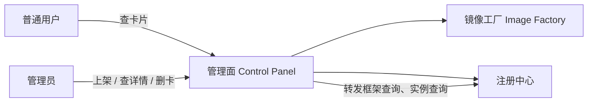

| 参与方 | 职责 |
|---|---|
| 普通用户 | 用户视图：刷新、查看已发布卡片 |
| 管理员 | 管理员视图：上架、查看含路径的详情、发起删卡 |
| 管理面 | 按角色鉴权；编排上传与构建、注册、按卡片清本机文件；转发查询 |
| 镜像工厂 | 按 Recipe 校验并执行 build/import/inject；按指示卸本机已 load 镜像 |
| 注册中心 | **卡片权威**；框架查询、实例查询、落卡与删卡 |

现状仍是串行专用链（深校验 + 固定 Dockerfile/base + 注册串成功）。目标是管理面主链固定，变化进 Recipe；卡片以注册中心为准。

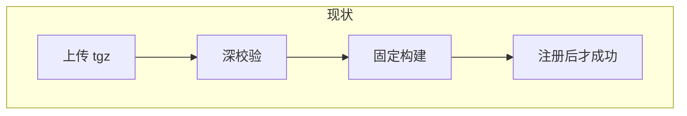

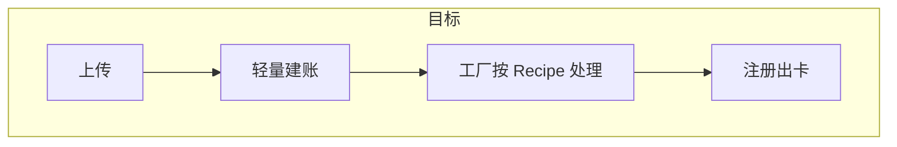

## 4. 静态结构

本图说明谁拥有卡片、谁拥有构建策略、谁只持有本机路径。

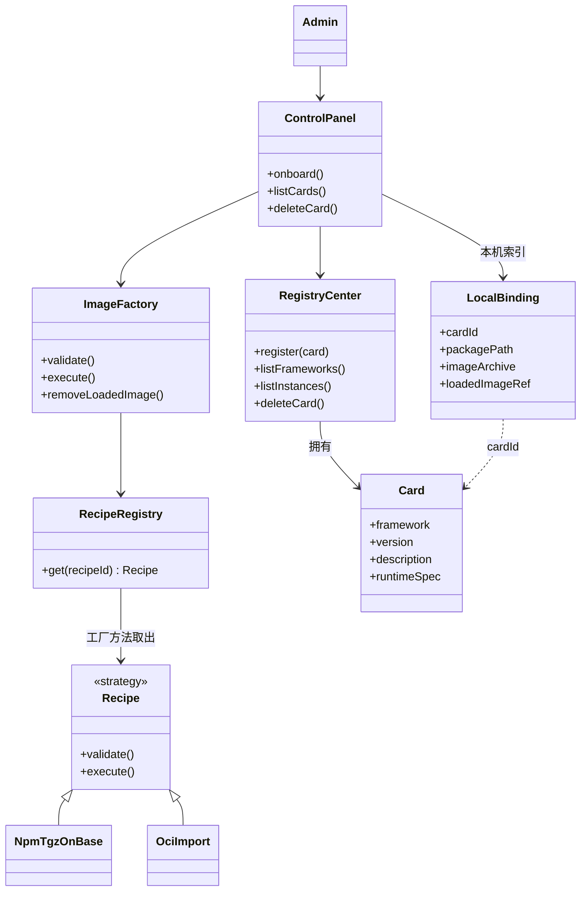

**卡片必须来自注册中心。** 管理面不得用本地 Job 状态冒充卡片。注册中心框架记录需新增展示字段，至少包括 `description`（上架时由管理面写入）。列表与刷新只查注册中心。

**本机索引不是第二份卡片目录。** `LocalBinding` 只存删卡和详情查询需要的路径：软件包落盘路径、本地镜像文件、已 load 的 image ref。本轮**不把这些路径写入注册中心**（那是后续升级的前置，见 §2）。

**Recipe 用策略 + 工厂。** 新增软件包类型或构建方式：增加 Inspector（可选）和 Recipe 实现并注册，不改管理面编排类。

## 5. 主成功路径

中间态不画进主路径。失败见 §7。

### 5.1 上架（增）

本图描述管理员上架：连续上传并构建，成功后注册中心落下带描述的卡片。

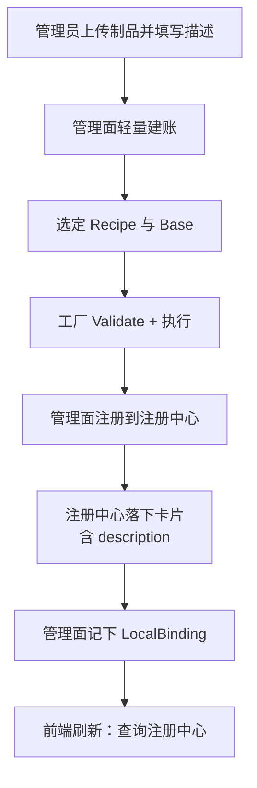

权威数据（名称、版本、描述、runtime）在注册中心。管理面只补本机路径索引。

### 5.2 查询（查）

本图描述卡片查询：列表对两种视图相同，都回源注册中心；本机路径只给管理员详情。

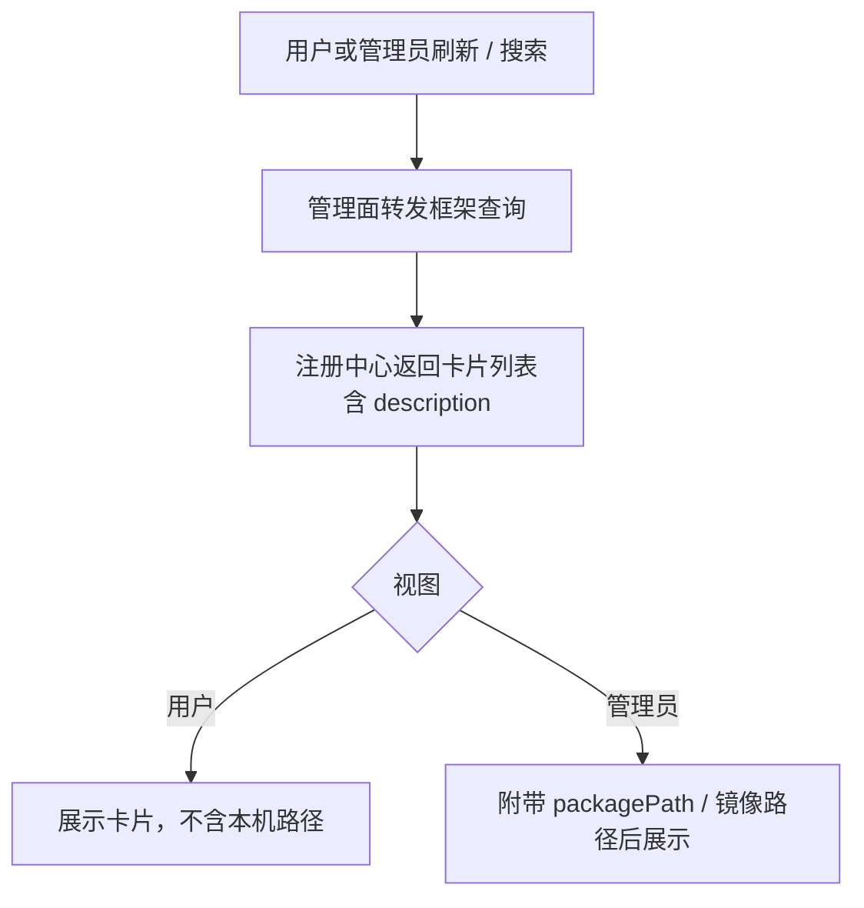

### 5.3 删除（删）

本图描述整卡拆除。有实例则到此为止。

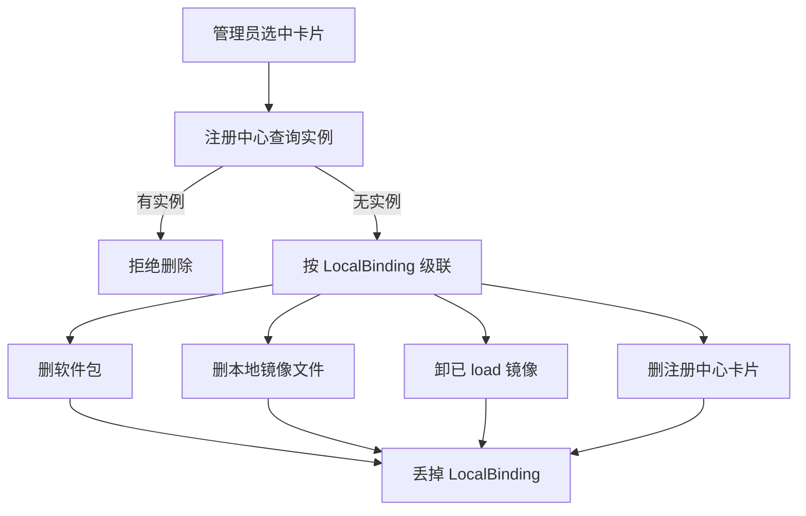

「改」即升级，本轮无主成功路径。

## 6. 关键交互

把上一节跨进程箭头展开为调用。对象与 §4 类图一致。

### 6.1 上架

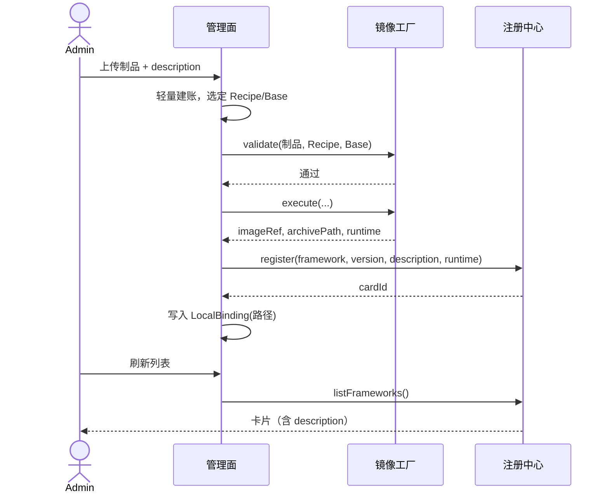

### 6.2 查询

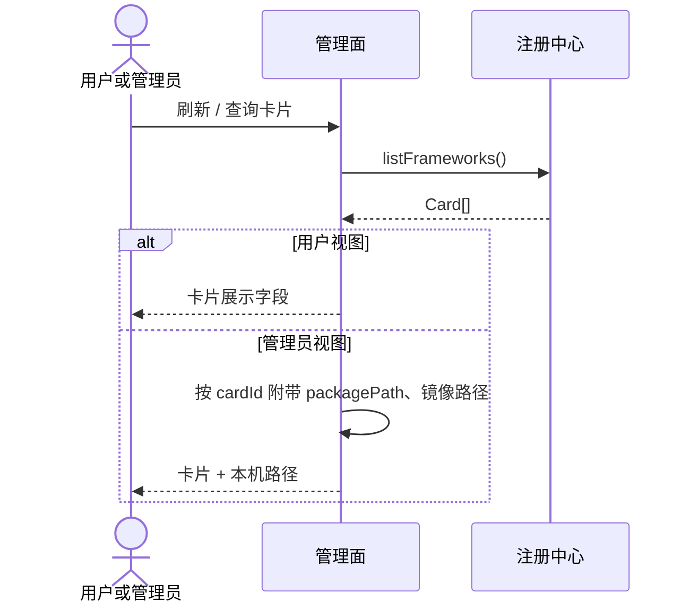

查询不经过镜像工厂。上架、删除时序仅管理员可发起。

### 6.3 删除

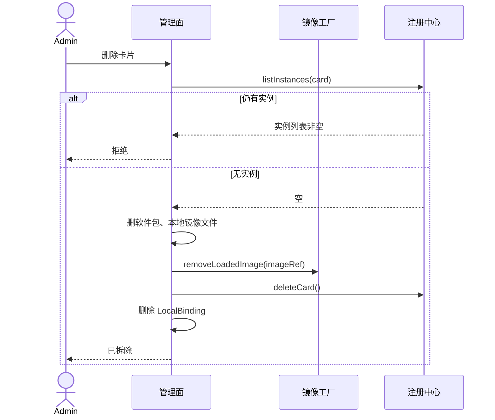

## 7. 异常

不塞进主流程。本轮只关心这两条：

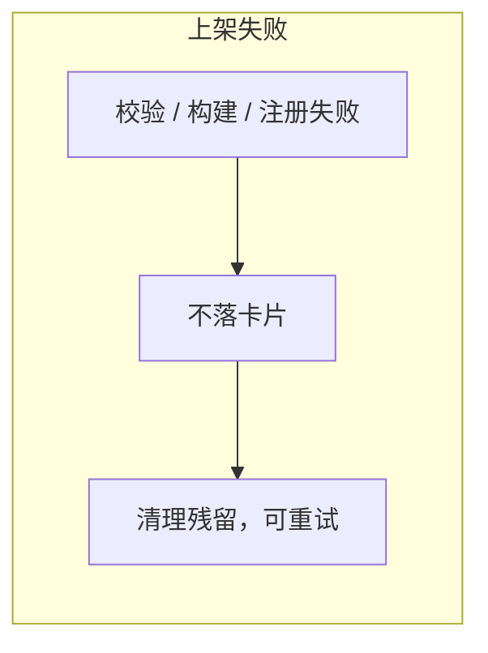

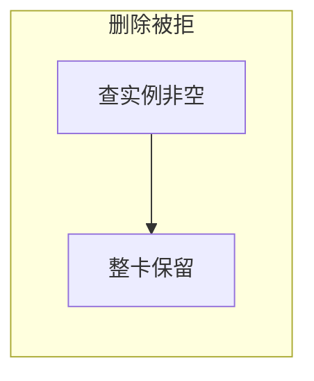

构建失败不在注册中心造半张卡。注册失败也不用 Job 成功冒充已上架。

## 8. 构建扩展（需求 2）

管理面编排固定：上传 → 建账 → 发起任务 → 注册。  
工厂用 `RecipeRegistry.get(id)` 取出策略，新增方式只加 Recipe。

| Recipe | 输入 | 作用 |
|---|---|---|
| `npm_tgz_on_base` | npm tgz | 基于预置 Base 构建（现网能力包装） |
| `oci_import` | OCI/Docker archive | 已构建镜像直接导入 |

后续 node/wheel 等只加新策略。工厂契约保持 `制品 + Recipe + Base`，不接收用户身份。

## 9. 范围确认

| 做 | 不做 |
|---|---|
| 卡片概念；注册中心增加 `description` | 管理面本地卡片墙 |
| 上架连续完成并落卡 | 已上传未构建作为可管理对象 |
| 查询回源注册中心；用户视图只看展示字段，管理员详情带本机路径 | 把包路径写入注册中心；用户侧增删卡 |
| 无实例整卡拆除 | 卡片升级 / 机上依赖升级 |
| Recipe 插拔以支持新包和新构建 | 用户自定义 Recipe 脚本 |

## 10. 总结

- **卡片**是注册中心的已发布身份，必须带来源与 `description`。  
- **构建**用策略 + 工厂拆开扩展轴，避免再改串行专用链。  
- **管理**本轮只做增、删、查，且区分用户视图与管理员视图；改（升级）明确后置，因此注册中心暂不承载软件包落盘位置。  
- 管理面只保留 `LocalBinding`，供管理员查询路径和整卡拆除，不进入用户视图。
