# 三方 Agent 制品管理与镜像工厂总体设计（V2 评审稿）

> 文档状态：评审稿，未定稿  
> 适用范围：AgentOS Control Panel 三方 Agent 管理模块、`image_process` 镜像处理服务  
> 代码基线：`refactor/image_process`，`86f565d`（不含其后的 openclaw/node 安装模式改动）  
> 历史参考：`containerized-build.md`、`third-party-agent-integration-guide.md`  
> 上传门禁参考：OWASP [File Upload Cheat Sheet](https://cheatsheetseries.owasp.org/cheatsheets/File_Upload_Cheat_Sheet.html)（实践清单，非代码依赖）  
> 说明：本文是面向后续扩展的新版本总体设计，不替代或覆盖旧版设计文档。

## 1. 背景

当前三方 Agent 上架能力围绕单一场景实现：管理员上传符合 NPM `pack` 布局、且包名带平台后缀的离线 `.tgz` 包，系统将其中的可执行文件加入固定的 `agent-base:1.0`，生成 Agent 运行镜像并完成注册。

这一方案已经打通上传、构建、状态查询、离线镜像保存和注册链路，但输入格式、校验逻辑、构建方式和基础镜像被绑定在同一流程中。继续增加 node 包、wheel、独立 binary、OCI 镜像、SDK/SSH 注入、基础镜像升级、同包多基础镜像、制品删除和配额等能力时，容易要求同时修改管理面 API、Service、数据库模型、镜像处理客户端、Dockerfile 和注册逻辑，形成霰弹修改。

为了使后续能力能够沿制品类型（处理不同类型的三方制品）、处理 Recipe（根据需求选择不同的构建内容）和基础镜像（三方Agent默认运行底座）三个维度独立演进。初版的验收目标为ScienceFlow和OpenClaw,可以顺利上架至一体机。

## 2. 本次需求

本轮设计同时面向三个需求。产品主对象是**Agent Card**（已注册为框架的软件包）。尚未注册成功的落盘包不做成卡片，只在异常路径上允许删除或重试构建，不进入用户视图。

| 需求 | 需求描述 | 备注 |
|---|---|---|
| 1. 智能体卡片展示 | 增加智能体卡片描述；卡片信息**必须**来自注册中心 | 避免双份数据存储带来的问题 |
| 2. 新包 / 新构建方式 | 构建侧高内聚低耦合，新增软件包类型或 Recipe 不改管理面主链 | 重构目标是减少不同类型构建方式的适配成本 |
| 3. 智能体卡片管理 | 同一套卡片，按视图区分能力。权威数据在注册中心。本轮**改**只做描述编辑；**改（升级机上依赖）**不在本次承载 | 见下方用户视图 / 管理员视图 |

智能体卡片本质是「软件包 + 机上预置依赖」经 Recipe 得到的可运行身份。卡片上的展示字段、运行字段和本机资源路径**全部收拢到注册中心**，管理面不为卡片再建第二份库。升级（改机上依赖）本轮不做流程，但源包路径已落在卡片上，后续可直接用。

卡片管理功能区分两种视图：

| | 用户视图 | 管理员视图 |
|---|---|---|
| 查 | 注册中心卡片列表/详情（名称、版本、描述等展示字段） | 卡片展示：智能体名称、版本、描述；以及按该卡从**实例管理接口**汇总的**已创建实例数**、**已注册实例数**。详情另可见本机软件包路径、镜像路径 |
| 增 | 无 | 上架并构建，写入注册中心 |
| 删 | 无 | 先查实例，无实例才整卡拆除（软件包、镜像文件、已 load 镜像、注册记录） |
| 改 | 无 | 可编辑描述并写回注册中心。机上依赖升级本轮不做 |

用户视图只消费已发布卡片，不接触本机路径、实例计数运维和拆除动作。管理员视图在同一卡片上叠加运维信息、描述编辑与增删。实例计数不落卡片、不进管理面库，查询时现取。

## 3. 系统上下文

参与方：普通用户、管理员、管理面、镜像工厂、注册中心。用户与管理员看到的是同一批注册中心卡片，接口按角色裁剪。

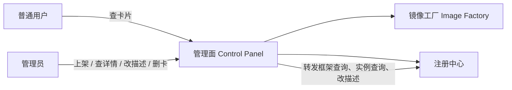

| 参与方 | 职责 |
|---|---|
| 普通用户 | 用户视图：刷新、查看已发布卡片 |
| 管理员 | 管理员视图：上架、查看名称/版本/描述与实例计数、编辑描述、发起删卡 |
| 管理面 | 按角色鉴权；上传通用门禁与落盘；把路径交给工厂；用结果注册；按卡片路径清本机文件；转发查询与改描述；按卡汇总实例管理计数 |
| 镜像工厂 | 解析制品、选择 Recipe 与 Base、校验能否构建并执行；按指示卸本机已 load 镜像 |
| 注册中心 | **卡片权威**；框架查询、实例查询、落卡、改描述与删卡 |

现状是**串行且耦合**：管理面既做落盘，又做包格式/平台校验和「能不能构建」；镜像处理只按固定 Dockerfile 和固定 base 执行。两个进程只是把执行器隔开，构建知识仍在管理面。注册串在构建成功之后。

目标：管理面只做通用门禁并把路径交出；解析、选策略、选 Base、构建都在工厂内完成。管理面再用工厂返回的名称、版本、镜像和 runtime 去注册中心落卡。

**现状**

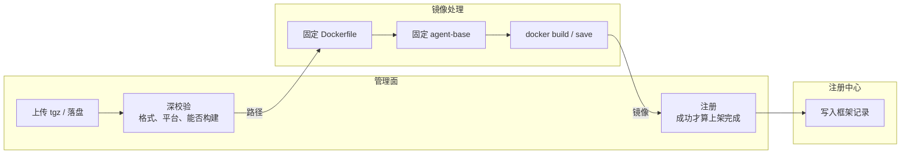

**目标**

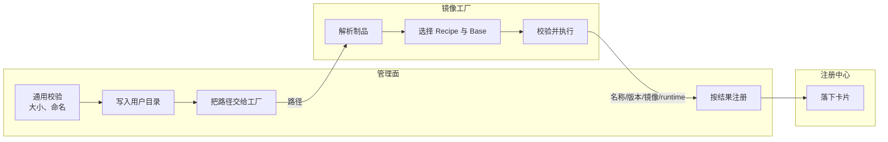

对应目标图，上传职责拆成两层，互不替代：

| | 管理面：通用门禁 | 镜像工厂：构建条件 |
|---|---|---|
| 校验核心 | 这是不是一次可接受的上传 | 这个文件能不能、以及如何做成镜像 |
| 重点关注 | 单文件大小、实际字节封顶、磁盘余量；扩展名白名单；文件名去掉路径穿越，落盘名由服务端生成；先写临时文件再改名 | 解析包内容；选择构建方式和基础镜像；判断能否构建；执行构建、导入或注入 |
| 不关注 | 不解包、不读包内清单、不选构建方式或底座 | 不管用户身份、配额展示、卡片目录 |
| 参考 | OWASP File Upload Cheat Sheet | 按制品类型匹配处理方式 |

## 4. 卡片字段

管理面卡片对应注册中心 `GET/POST /api/images` 的框架记录，本轮在该记录上增加下列字段。

| 字段 | 现网 | 本轮 | 谁用 |
|---|---|---|---|
| `framework` / `framework_version` | 有 | 保留，卡片主键 | 两种视图 |
| `runtime_spec` / `imageurl` / 资源字段 | 有 | 保留 | 拉起实例 |
| `uploaded_by` | 有 | 保留 | 管理员 |
| `description` | 无 | **新增**；管理员可改，写回注册中心 | 两种视图展示；仅管理员编辑 |
| `package_path` | 无 | **新增** | 管理员详情、整卡删源包 |
| `image_archive_path` | 无 | **新增** | 管理员详情、整卡删落盘镜像 |
| `recipe_id` / `base_ref` | 无 | 建议一并写入 | 本轮不跑升级，留给后续改 |

用户视图由管理面裁掉路径类运维字段。文件物理上仍在管理面机器，路径记在卡片上。

已创建 / 已注册实例数**不是卡片字段**。管理员查询时，管理面按该卡的智能体名称与版本调用既有**实例管理接口**汇总，不写入注册中心，也不抄进本机包表。

管理面镜像相关**只保留一张表**，替换现网的 `build_tasks` 与 `agent_registrations`。工厂不建库。

```text
content_digest     主键，锁与去重
package_path
locked_until
last_error         未注册时才有
```

已注册后卡片在注册中心，本行可删除或标已消费，不再抄名称/版本/描述。未注册包的删除、重试和摘要锁都打这张表。

## 5. 主成功路径

中间态不画进主路径。失败见 §7。

### 5.1 上架（增）

本图描述管理员上架：连续上传并构建，成功后注册中心落下带描述的卡片。

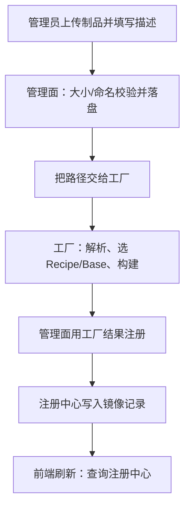

管理面在上架时只做通用校验（大小、安全命名）并落盘，然后把路径交给工厂。名称、版本、用哪条 Recipe、用哪个 Base，都由工厂解析后决定并随构建结果返回。管理面据此注册，不本地建卡片表。

### 5.2 查询（查）

本图描述卡片查询：列表都回源注册中心。管理员视图再按卡调实例管理接口，补上已创建 / 已注册实例数；本机路径只给管理员详情。

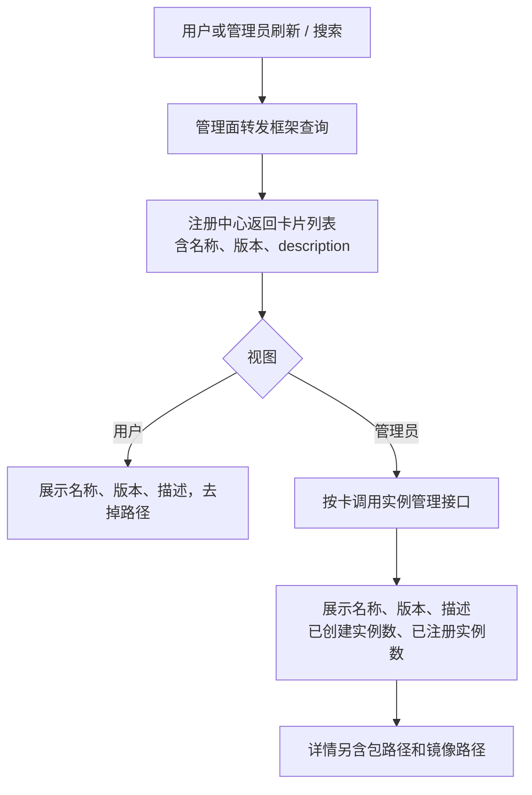

### 5.3 删除（删）

本图描述整卡拆除。有实例则到此为止。

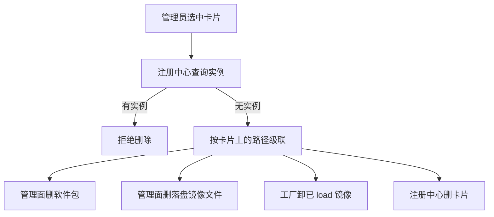

本轮「改」只做描述编辑，见 §5.4。机上依赖升级无主成功路径。

### 5.4 编辑描述（改）

本图描述管理员改卡片描述：只写回注册中心上的 `description`，不触构建、不改路径、不改实例。

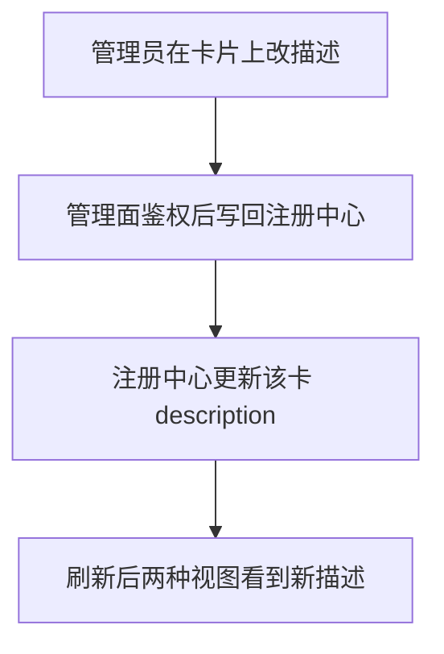

## 6. 关键交互

把上一节跨进程箭头展开为调用。参与方与 §3 一致。

### 6.1 上架

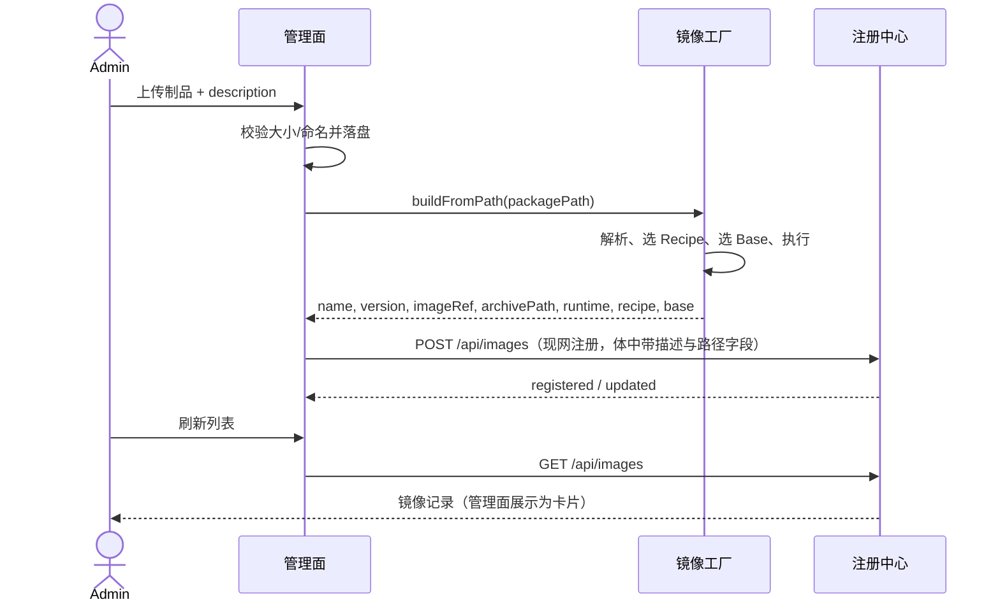

### 6.2 查询

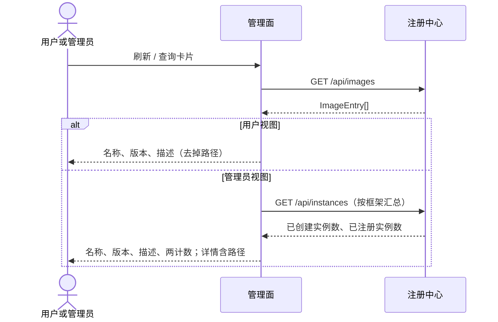

查询不经过镜像工厂。上架、改描述、删除时序仅管理员可发起。

### 6.3 删除

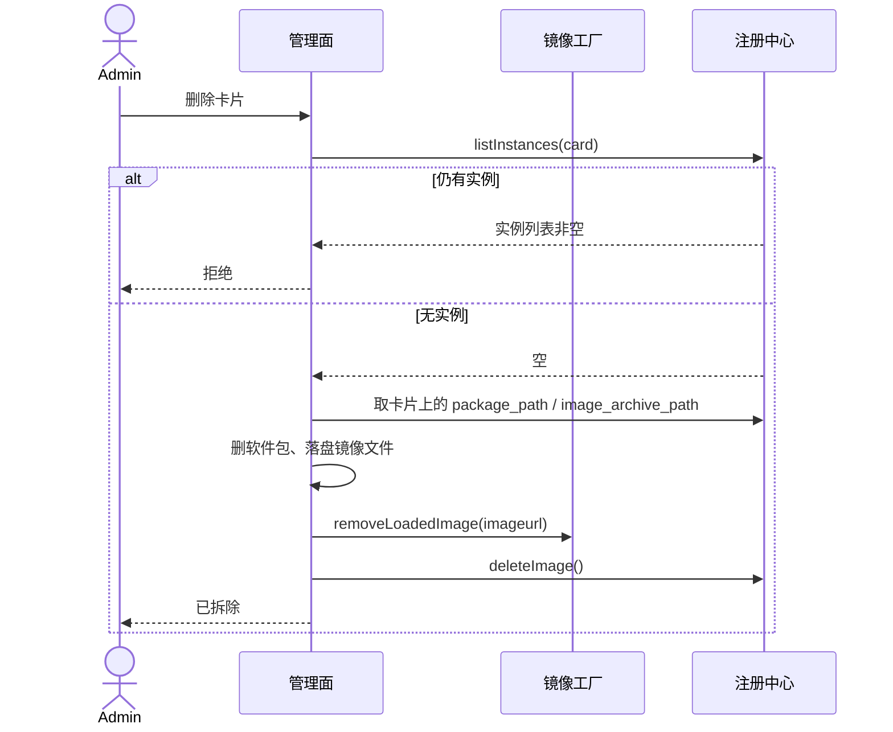

### 6.4 编辑描述

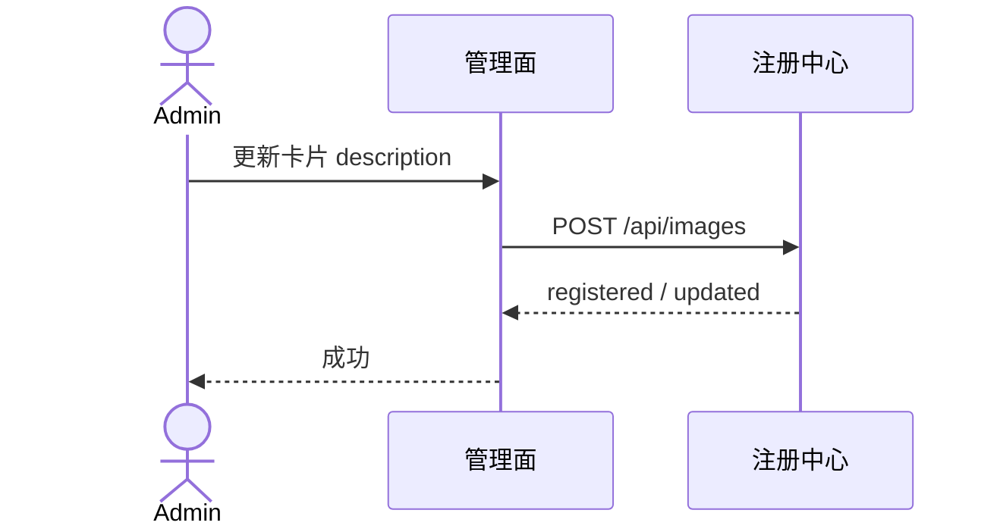

改描述走 `POST /api/images`。不经过镜像工厂，不改本机包表。

## 7. 异常

不塞进主成功路径。对已经落盘的软件包只分两种，不再单独做「上传包目录」产品：

| 状态 | 怎么管 | 能做什么 |
|---|---|---|
| 已注册为框架 | 按卡片，权威在注册中心 | 与 §5 相同：查、改描述、整卡拆除（有实例则拒绝） |
| 未注册为框架 | 不是卡片；管理面只记住这次的包路径和失败原因 | **删除该软件包**，或 **按原路径重试构建** |

未注册包括：工厂解析/构建失败、注册中心写入失败。这两种都不在注册中心造半张卡，也不用 Job 成功冒充已上架。

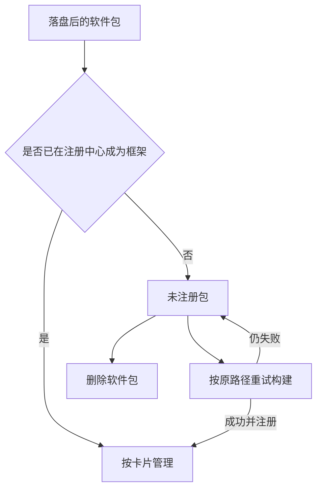

未注册包的删除只清管理面磁盘上的该文件（及构建残留目录），不查实例、不调注册中心删卡。重试构建仍走工厂「路径进、结果出」，成功后再注册。

**同一软件包要互斥，不同包不互斥。** 锁按内容摘要（sha256）持有，不是锁整个上传窗口，以免堵死后续并行上架。

- 首次上架、以及未注册包的**重试构建**，开始时加锁，结束（成功出卡 / 仍失败）或超时后释放。  
- **未持锁**的未注册包才允许删除或再次构建；持锁期间这两项都拒绝。  
- 同一摘要已在处理中，再上传同一包直接拒绝，不新开一条流水。  
- 前端与后端一致：持锁时禁用「删除」「重新构建」，上传同包给出进行中提示；禁用按钮不能代替管理面互斥。

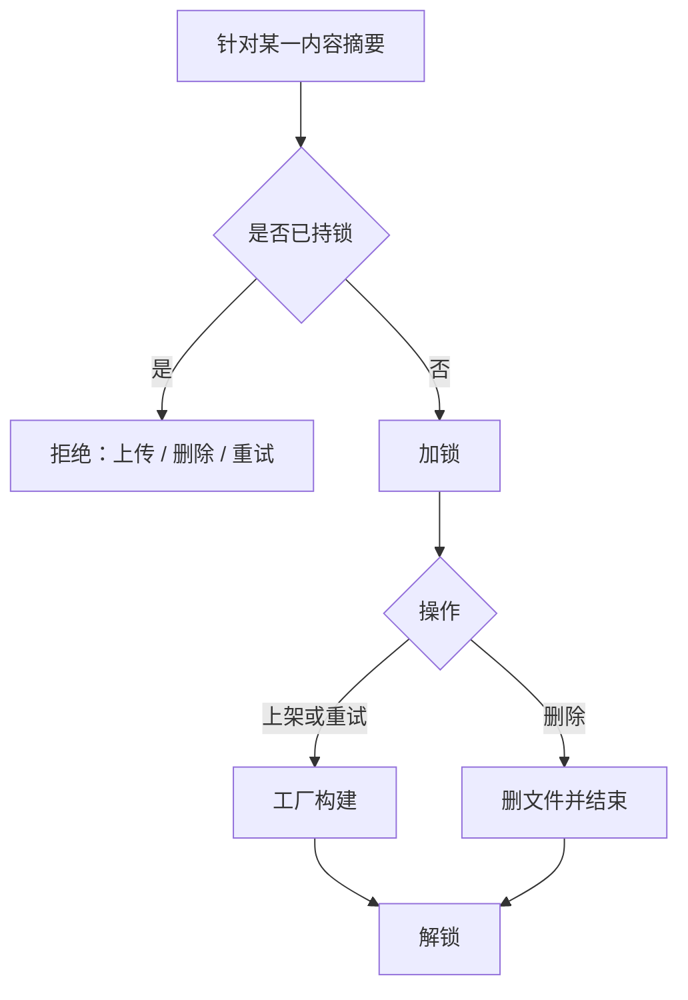

已注册卡片上若删除被拒，仍只是：

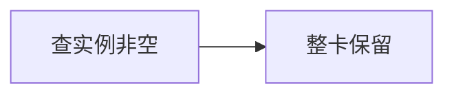

## 8. 静态结构（代码设计）

整体涉及三个组件。

| 组件 | 仓库与进程 | 管理面后端如何访问 |
|---|---|---|
| 管理面后端 | `control-panel/backend`，独立进程 | — |
| 镜像工厂 | 同仓库 `control-panel/image_process`，独立进程 | 现网已有 `image_process_client`，配置 `IMAGE_PROCESS_URL` |
| 注册中心 | 独立组件，配置 `AGENT_REGISTER_URL` | 现网写在 Service 里的 HTTP 调用，本轮收拢为 `AgentRegisterClient` |

因此管理面后端会留 **两个组件间客户端**：`ImageProcessClient`（现网 `image_process_client`）、`AgentRegisterClient`（收拢对 `AGENT_REGISTER_URL` 的调用）。两者都走 **组件间通信**（§8.5），当前实现缺省 HTTP。

### 8.1 组件间交互

本图是组件间调用接口。各组件删除的接口见 8.2–8.4。

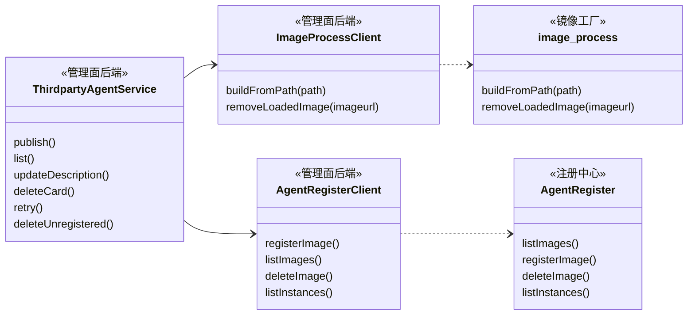

`deleteCard` 在清完本机文件并卸镜像后，经 `AgentRegisterClient.deleteImage` 回写注册中心。

### 8.2 管理面后端

现网把上传、深校验、异步 Job、本地注册副本揉在 `ThirdpartyAgentService`。目标拆成门禁、本机包、卡片编排三块；卡片目录不再落本库。本轮在 Service 上新增方法，调用走镜像工厂与注册中心（见 8.1）。

**新增方法**

| 方法 | 做什么 | 调用 |
|---|---|---|
| `updateDescription` | 改描述 | 注册中心 `registerImage`（POST upsert） |
| `deleteCard` | 整卡拆除 | 注册中心 `listInstances` → 本机清文件 → 工厂 `removeLoadedImage` → 注册中心 `deleteImage` |
| `retry` | 未注册包按原路径重试 | 工厂 `buildFromPath` → 注册中心 `registerImage` |
| `deleteUnregistered` | 删除未注册包 | 只清本机，不调注册中心 |

**现网接口收拢**

| | 现网 | 本轮 |
|---|---|---|
| 删 | `GET/POST /installers` | 列表回源注册中心；上传并入上架 |
| 删 | `POST/GET /build_tasks` | 上架连续完成，不把 Job 当产品 |
| 保留 | `GET /api/v1/agent/instances` | 实例管理；卡片上的两计数也走注册中心实例查询 |

**类：新增 / 保留 / 删除**

| | 类型 | 职责 |
|---|---|---|
| 演进 | `ThirdpartyAgentService` | 现网上传/构建/列表/注册的编排入口；本轮新增 `updateDescription`、`deleteCard`、`retry`、`deleteUnregistered` |
| 新增 | `UploadGate` | 从现网 `upload` 里拆出的通用门禁：大小、扩展名、安全命名、临时文件再改名；不解包 |
| 新增 | `LocalPackageRecord` / `LocalPackageStore` | 一张本机包表：摘要、路径、锁、失败原因 |
| 新增 | `CardViewProjector` | 按角色裁字段；管理员再填两计数 |
| 演进 | `ImageProcessClient` | 现网模块 `image_process_client`；改入参为只交路径 |
| 演进 | `AgentRegisterClient` | 收拢对 `AGENT_REGISTER_URL` 的调用 |
| 新增 | 组件间通信接口 | 两个客户端共用；本轮缺省 HTTP，TLS 预留，见 §8.5 |
| 新增 | `LocalFileCleaner` | 按路径删源包和镜像文件 |
| 保留 | 鉴权（`require_admin` / 用户角色） | 视图裁剪的输入 |
| 删除 | `BuildTask`、`AgentRegistration` | 被本机包表 + 注册中心镜像记录替代 |
| 删除 | `package.extract_package_meta` 及平台校验 | 迁到工厂 Recipe |
| 删除 | `create_build_task` / `get_build_task` / `list_installers` | 上架与列表走工厂、注册中心 |

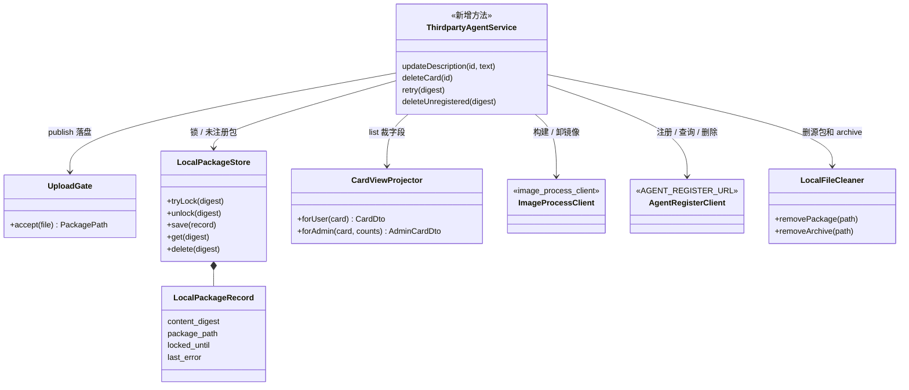

本图只含管理面后端进程内对象。`publish`：门禁落盘 → 摘要加锁 → `buildFromPath` → `registerImage` → 解锁。`deleteCard`：查实例 → 清文件 → `removeLoadedImage` → `deleteImage`。

### 8.3 镜像工厂

现网 `build()` 固定拷贝 `agent.Dockerfile`、固定 `agent-base:1.0`，且要求调用方传入 `agent_name` / `version`。目标把「能不能构建、如何构建」收进 Recipe；运行时后端仍可插拔。

**对外 HTTP**

| | 现网 | 本轮 |
|---|---|---|
| 改 | `POST /v1/builds` 必填 `task_id, agent_name, version, installer_path, output_dir` | `POST /v1/builds` 入参只需 `package_path`（可选请求 id） |
| 保留 | `GET /v1/builds/{id}` | 仅供上架等待进度；工厂内存任务，不落库 |
| 新增 | — | `POST /v1/images/remove`（或等价）按 `imageurl` 卸本机已 load 镜像 |
| 删除 | 调用方指定 `output_dir` / `work_dir` 作为权威产物路径 | 产物路径由工厂写入约定目录后在 `BuildResult` 返回 |

**类：新增 / 保留 / 删除**

| | 类型 | 职责 |
|---|---|---|
| 新增 | `FactoryService` | `buildFromPath`、`removeLoadedImage` |
| 新增 | `Recipe`（接口） | `matches` / `selectBase` / `validate` / `execute` |
| 新增 | `RecipeRegistry` | 按路径解析唯一 Recipe |
| 新增 | `NpmTgzOnBaseRecipe` | 现网 npm tgz + 预置 Base；接收现网 `package.py` 的解析与平台校验 |
| 新增 | `OciImportRecipe` | 已有 OCI/Docker archive 导入 |
| 保留并改名 | `ImageRuntime` ← 现网 `AbstractBuilder` | `build` / `loadArchive` / `saveArchive` / `remove` / `inspect` |
| 保留 | `DockerRuntime` ← 现网 `DockerBuilder` | 本机 dockerd |
| 保留 | 内存 `TaskRecord` | 进行中构建；进程内，非产品目录 |
| 删除 | `build()` 里写死 Dockerfile 拷贝与 `_BASE_IMAGE` | 变为 `NpmTgzOnBaseRecipe` 的实现细节 |
| 删除 | 入参强制 `agent_name` / `version` | 由 Recipe 解析后写入 `BuildResult` |

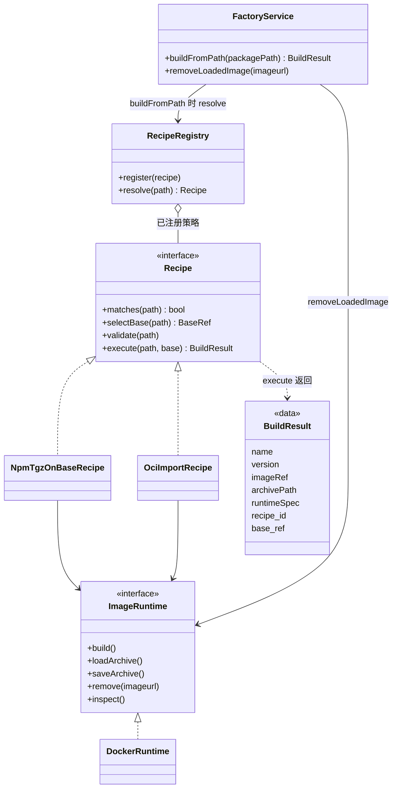

`Recipe` 接口不依赖 `ImageRuntime`；只有具体策略在 `execute` 时使用运行时。`FactoryService` 构建走 Recipe，卸镜像绕过 Recipe 直接打运行时。`BuildResult` 是返回值，不是工厂持有的实体。

`FactoryService.buildFromPath`：`RecipeRegistry.resolve` → `validate` → `selectBase` → `execute`。新增包类型只加 Recipe 实现并注册，不改工厂编排入口与管理面后端。

| Recipe | 输入 | 作用 |
|---|---|---|
| `npm_tgz_on_base` | npm tgz | 基于预置 Base 构建（现网能力包装） |
| `oci_import` | OCI/Docker archive | 已构建镜像直接导入 |

后续 node/wheel 只加新 `Recipe` 子类。工厂不接收用户身份，也不接收管理面传入的 Recipe 或 Base。

### 8.4 注册中心

对外仍是镜像接口与实例接口。管理面卡片读写 `/api/images` 上的框架记录；删除由 `deleteImage` 回写。

| 现网 | 本轮 |
|---|---|
| `GET /api/images`、`POST /api/images` | 沿用。POST 为 upsert。扩 `description` 等字段 |
| `GET /api/images/{framework}/launch-spec` | 沿用 |
| `GET /api/instances` 及实例注册/心跳 | 沿用；计数、删前检查 |
| 镜像删除 | `deleteImage`：`deleteCard` 清完本机与已 load 镜像后调用；处理逻辑在现有镜像接口上改 |

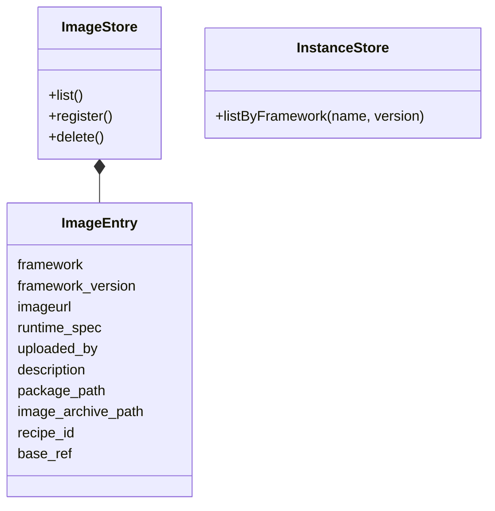

路径记在 `ImageEntry` 上。`unlink` 与 `docker rmi` 在管理面后端与工厂；注册中心只删记录。

### 8.5 组件间通信（预留 TLS）

范围：管理面后端 → 镜像工厂、管理面后端 → 注册中心。浏览器到管理面、NFS、docker.sock 不在本条。

两个客户端共用组件间通信抽象。本轮缺省 HTTP；TLS 为后续实现，配上运维证书路径后切换。

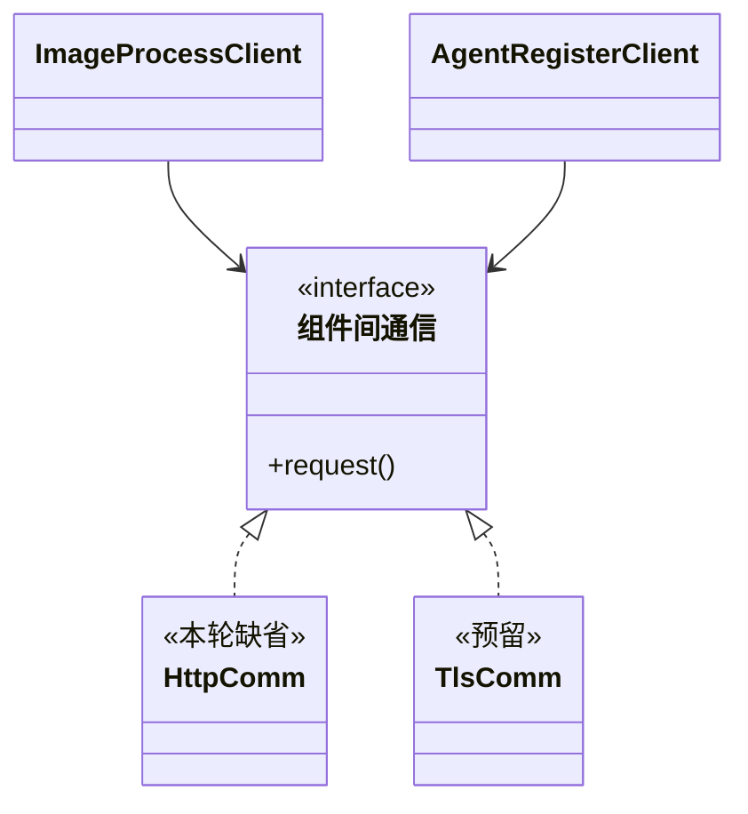

| | 本轮 | 后续 |
|---|---|---|
| 实现 | `HttpComm`：现网明文 HTTP | `TlsComm`：校验证书、HTTPS |
| 选择 | 固定走缺省实现 | 读到证书路径则切 `TlsComm`，两个客户端都不用改 |
| 证书 | 不涉及 | 运维发放并挂到约定路径，应用不签发、不内置 CA |
| 配置点（预留，本轮可空） | `INTERNAL_TLS_CA_FILE` / `CERT_FILE` / `KEY_FILE`，建议 `/etc/agentos/tls/` | 配齐后自动切 TLS |

镜像工厂与注册中心本轮仍明文监听。双向 TLS 若需要，作为 `TlsComm` 的选项。

## 9. 范围确认

| 做 | 不做 |
|---|---|
| 卡片数据落在注册中心镜像记录；管理面只留一张本机包表 | 继续保留 `build_tasks` + `agent_registrations` |
| 上架连续完成并一次写全镜像记录；失败包可删或重试，不进卡片墙 | 把未注册包做成第二套卡片目录 |
| 查询回源 `GET /api/images`；用户视图裁路径；管理员看名称/版本/描述、实例计数与路径 | 用户侧增删改卡；把实例计数写入镜像记录或本机库 |
| 改描述走 `POST /api/images`；整卡拆除末步 `deleteImage` 回写注册中心 | 本轮实现升级流程（字段可先写入） |
| Recipe 插拔以支持新包和新构建 | 用户自定义 Recipe 脚本 |
| 组件间通信抽象为接口，本轮只落明文 HTTP | 本轮实现 TLS/mTLS；应用内签发证书 |

## 10. 总结

- **卡片**对应注册中心 `/api/images` 记录；管理面编排增删查与改描述。  
- **构建**用策略 + 工厂拆开扩展轴。  
- **管理**区分用户/管理员视图。管理员卡片展示名称、版本，以及实例管理接口给出的已创建 / 已注册实例数。改（升级）不做流程。  
- 已注册包按卡片管；未注册包只支持删除或重试构建，不进用户视图。管理面只留一张本机包表。  
- 同一内容摘要加锁防并发；未持锁才可删或重试，重试再加锁。不同包不互斥。  
- **结构**见 §8：管理面后端编排；`deleteCard` 末步经 `AgentRegisterClient.deleteImage` 回写注册中心。  
- **组件间通信**：`ImageProcessClient`、`AgentRegisterClient`；本轮 HTTP，TLS 预留。  
