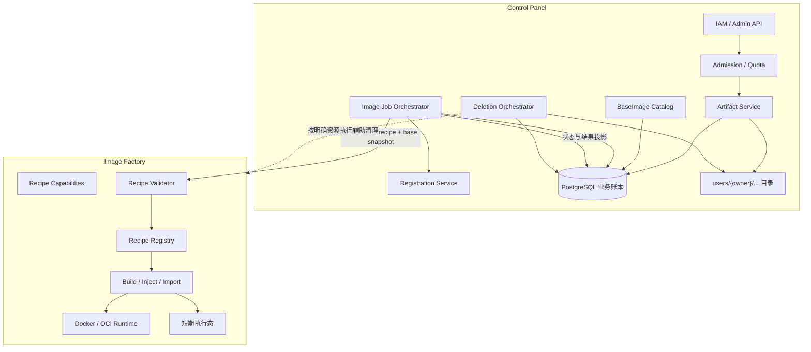

# 三方 Agent 制品管理与镜像工厂总体设计（V2 评审稿）

> 文档状态：评审稿，未定稿  
> 适用范围：AgentOS Control Panel 三方 Agent 管理模块、`image_process` 镜像处理服务  
> 代码基线：`refactor/image_process`，HEAD `68b395f`  
> 历史参考：`containerized-build.md`、`third-party-agent-integration-guide.md`  
> 说明：本文是面向后续扩展的新版本总体设计，不替代或覆盖旧版设计文档。

### 实现对齐修订摘要（2026-08-22）

当前分支在总体边界不变的前提下做了以下落地调整：

1. 卡片数据以注册中心 `/api/images` 为唯一权威，管理面不再保存卡片副本，只保留未注册包、失败原因和内容摘要锁。
2. 已实现管理员卡片列表/详情、描述编辑、未注册包删除与重试、无实例卡片拆除，以及用户/管理员字段裁剪。
3. 新增同一框架多版本的默认版本管理：首次注册自动成为默认版本；管理员可手工切换；删除无实例的默认版本时，按语义版本提升剩余最高版本。
4. 启动 Agent 的命令改为管理员上传时手工填写，镜像工厂不再读取 `package.json.bin` 或扫描 ELF 自动推断入口。
5. 为兼容现有启动链，当前暂把手工 `launch_command` 写入注册中心 `framework`。后续注册中心和启动协议新增独立 `launch_command` 后，`framework` 恢复为稳定的软件/卡片标识。
6. 注册中心调用异常统一在管理面 Service 转换为 `AgentServiceError`；实例查询失败时不得显示虚假的 0，也不得继续删除。

本修订同时明确注册中心必须增加的卡片字段与默认版本接口，见 §6.9。

## 1. 背景

当前三方 Agent 上架能力围绕单一场景实现：管理员上传符合 NPM `pack` 布局的离线 `.tgz` 包，系统将其中的可执行文件加入固定的 `agent-base:1.0`，生成 Agent 运行镜像并尝试注册。

这一方案已经打通上传、构建、状态查询、离线镜像保存和注册链路，但输入格式、校验逻辑、构建方式和基础镜像被绑定在同一流程中。继续增加 wheel、binary、OCI 镜像、SDK/SSH 注入、基础镜像升级、同包多基础镜像、制品删除和配额等能力时，容易要求同时修改管理面 API、Service、数据库模型、镜像处理客户端、Dockerfile和注册逻辑，形成霰弹修改。

本次设计的目标不是一次实现所有格式，而是建立稳定的扩展边界，使后续能力能够沿制品类型、处理 Recipe 和基础镜像三个维度独立演进。

## 2. 设计目标与非目标

### 2.1 设计目标

1. 将用户身份、用户目录、配额、产品账本、删除策略和注册编排稳定保留在管理面。
2. 将“制品能否按某种方式形成可运行镜像”及其执行逻辑收口到镜像工厂。
3. 使用统一 Artifact 模型支持 NPM tgz、OCI archive，并可扩展 wheel、binary 等输入类型。
4. 使用可注册的 Recipe 模型隔离不同校验、构建、注入和导入流程。
5. 支持基础镜像版本管理，以及同一 Artifact 基于不同基础镜像构建。
6. 支持已经构建完成的 OCI/Docker 镜像直接导入并注册，不强制再次构建。
7. 支持按层级、按策略删除源制品、构建输出和注册记录。
8. 保持已有 NPM tgz 构建能力兼容，并提供可回滚的渐进迁移路径。

### 2.2 非目标

1. 不将 IAM、用户目录或用户配额迁入镜像工厂。
2. 不在镜像工厂建设第二套用户、制品或构建业务数据库。
3. 不将 Control Panel 收缩为镜像工厂的反向代理。
4. 第一阶段不支持用户动态上传代码形式的 Recipe。
5. 第一阶段不解决跨架构模拟构建；是否引入 Buildx/QEMU 单独评审。
6. 不把模型 API Key、SSH 私钥等凭据固化到镜像层。

## 3. 已有功能描述

### 3.1 管理面已有能力（设计基线）

- 三方 Agent API 使用 `require_admin` 管理员鉴权。
- 接收 `.tgz` 上传，限制单包大小，并检查目标文件系统剩余空间。
- 从 `package/package.json` 提取名称、版本和展示名；入口自动解析已在当前实现中删除。
- 根据包名后缀校验 OS、CPU 架构和 libc。
- 按 `{AGENTOS_HOME_BASE}/{uploaded_by}/installers` 保存安装包。
- 在 PostgreSQL 中保存 `AgentInstaller` 和 `BuildTask`。
- 以 `agent_name + version` 检查重名。
- 创建构建任务，并限制全局活动构建数最多为 5。
- 将安装包、输出目录和工作目录的绝对路径提交给 `image_process`。
- 查询构建状态时轮询工厂，将进度和结果投影到 PostgreSQL。
- 构建完成后尝试调用 `AGENT_REGISTER_URL` 注册镜像。

### 3.2 镜像处理服务已有能力

- 作为独立 FastAPI 服务部署，并通过共享卷访问用户目录。
- 持有 Docker socket，执行 `docker build`、`docker save` 和镜像 ID 查询。
- 使用固定 `agent.Dockerfile` 和固定 `agent-base:1.0`。
- 使用内存字典保存任务执行状态，完成任务默认保留 24 小时。
- 提供创建构建任务和查询任务状态接口。
- 支持相同活动 `task_id` 的基本幂等提交。

### 3.3 当前主要限制

- 上传制品只能按 NPM tgz 解释。
- 产品元数据解析、平台校验和 Dockerfile 隐式假设分散在 CP 与工厂。
- 没有显式 `artifact_kind`、`recipe_id` 和可选 `base_ref`。
- 固定基础镜像，不能基于同一制品构建多个基础镜像版本。
- 不支持 OCI/Docker archive 上传、镜像注入或直接注册。
- Installer 主键和构建并发限制是全局维度，尚未形成真正的用户级隔离。
- 缺少删除 API、删除影响分析、级联策略和配额回收流程。
- 工厂重启会丢失执行态，CP 对远端任务消失缺少收敛机制。
- 注册失败不会影响构建完成状态，但当前没有独立、可信的注册状态。
- 工厂接受绝对路径，但尚缺少通用的允许根目录和路径逃逸防护。

## 4. 核心概念

### 4.1 Artifact

Artifact 表示用户交给 AgentOS 管理、可被检查、构建、转换、导入或注册的一个不可变输入制品。

Artifact 不是构建任务，不是基础镜像，也不等同于最终运行镜像。示例包括：

- NPM 离线包；
- Python wheel 或 sdist；
- ELF 等独立 binary；
- OCI image archive；
- Docker image archive；
- 后续可能支持的远程 registry image reference。

Artifact 负责表达制品的归属、存储、类型、摘要、生命周期和可追溯性。一个 Artifact 可以被多个处理任务引用，例如同一个 tgz 分别基于 base 1.0 和 base 2.0 构建。

### 4.2 Artifact Kind 与 Media Type

`kind` 表示平台理解的逻辑类型，初始建议：

```text
npm_tgz
oci_archive
docker_archive
```

后续可扩展：

```text
python_wheel
python_sdist
binary
generic_archive
registry_image_ref
```

`media_type` 表示文件或引用的物理格式。新增 kind 不应要求增加一组充满空值的数据库列；格式专有信息放在带 `schema_version` 的结构化 metadata 中。需要高频查询、唯一约束或索引的字段，再经评审提升为正式列。

### 4.3 BaseImage

BaseImage 是由 CP 管理版本和可见性的构建基础镜像目录项。CP 管理名称、版本、状态、默认版本和升级策略；工厂负责检查可用性、架构和 Recipe 兼容性，并在任务结果中返回不可变 digest。

BaseImage 与用户上传的 Source Image 必须区分：NPM tgz 通常需要外部 BaseImage；上传的 OCI 镜像自身是 Source Image，不应为了字段统一被强行建模为 BaseImage。

### 4.4 Recipe

Recipe 表示工厂对一种 Artifact 进行校验和处理、最终产生可注册镜像的版本化方法。Recipe 声明：

- 支持的 artifact kind；
- 是否要求 base image；
- 参数 schema；
- Buildability 校验规则；
- build、inject 或 import 执行流程；
- 输出镜像和 runtime profile；
- Recipe 自身版本。

第一阶段 Recipe 在工厂代码中注册，不允许用户上传任意构建脚本。

### 4.5 ImageProcessJob 与 ImageOutput

当前 `BuildTask` 名称只适合狭义构建。目标任务实际可能执行：

```text
build     从安装包和基础镜像构建
inject    向已有镜像注入 SDK/SSH
import    导入已构建镜像，不执行 Dockerfile build
validate  仅执行预检
```

本文暂称为 `ImageProcessJob`。为降低迁移风险，数据库表名可暂时保留 `build_tasks`，但领域语义和 API 应逐步通用化。

ImageOutput 表示任务产生或导入的可运行镜像，包括 image ref、digest、离线 archive 路径和 runtime profile。

### 4.6 Registration

Registration 表示 CP 将一个 ImageOutput 发布到外部 Agent 注册中心的过程。注册属于管理面编排，不属于镜像工厂。构建/导入成功与注册成功必须使用独立状态表示。

## 5. 总体架构



### 5.1 稳定边界

| 能力 | 所属 | 原因 |
|---|---|---|
| IAM、操作者身份 | CP | 工厂不拥有用户模型 |
| 用户目录及路径布局 | CP | 目录属于用户制品管理语义 |
| 上传大小、数量、容量和重名 | CP | 属于 Admission 与产品策略 |
| Artifact、BaseImage、Job、Registration 账本 | CP PostgreSQL | 避免第二套业务真相源 |
| Recipe 与 Buildability | Factory | 与具体构建/注入方式绑定 |
| Docker/OCI build、load、save、inspect | Factory | 高权限执行能力集中隔离 |
| 短期进度和执行错误 | Factory | 属于任务执行态 |
| 状态投影、重试和注册 | CP | 属于业务编排与最终一致性 |

## 6. 新增功能设计

### 6.1 通用 Artifact 管理

建议 Artifact 核心模型：

```text
id
owner_id
kind
name
version
display_name
source_type          # uploaded_file / registry_ref 等
storage_path         # 文件型制品适用
size_bytes
content_digest
media_type
metadata             # 带 schema_version
status
created_at
updated_at
deleted_at
```

建议状态：

```text
uploading -> inspecting -> available
                       -> invalid
available -> deleting -> deleted
                    -> delete_failed
```

CP 可以为不同 kind 注册轻量 `ArtifactInspector`，只提取建账和展示所需信息，不判断某个 Recipe 是否可构建。示例：NPM inspector 读取包名和版本；OCI inspector 读取 manifest、tag 和架构；wheel inspector 读取 distribution 和 wheel tags。

### 6.2 Recipe 扩展机制

建议初始 Recipe：

| Recipe ID | 输入 | 操作 | 是否需要 BaseImage |
|---|---|---|---|
| `npm_tgz_on_base` | `npm_tgz` | 解包并构建 | 是 |
| `oci_import` | `oci_archive`/`docker_archive` | load、inspect、输出可注册结果 | 否 |
| `oci_with_yuanrong_sdk` | OCI 镜像 | 注入 Yuanrong SDK | 否 |
| `oci_with_yuanrong_sdk_and_ssh` | OCI 镜像 | 注入 Yuanrong SDK 和 SSH | 否 |

后续可扩展 `python_wheel_on_base`、`binary_on_base` 等 Recipe。新增已有 kind 的 Recipe 时，主要修改工厂和测试；新增 kind 时，需要增加 Inspector、Recipe 和 capabilities 展示，但不修改 CP 通用账本与编排主流程。

工厂应提供 capabilities：

```http
GET /v1/capabilities
```

返回 Recipe ID、版本、支持的 artifact kind、是否要求 base、参数 schema 和输出能力。CP 和前端不得各自硬编码一份不一致的 Recipe 列表。

### 6.3 Buildability 校验

校验分为三层：

1. CP Admission：鉴权、大小、数量、容量、重名、用户目录归属。
2. Artifact Inspection：识别格式并提取最小产品元数据。
3. Factory Buildability：判断 Artifact 是否满足指定 Recipe 和 base 的技术条件。

工厂提供：

```http
POST /v1/validate
POST /v1/jobs
GET  /v1/jobs/{job_id}
```

`POST /v1/jobs` 必须在执行前调用与 `/v1/validate` 相同的 validator，避免调用方跳过预检。

结构化错误建议包含：

```json
{
  "code": "PACKAGE_ROOT_MISSING",
  "message": "package/ directory is required",
  "field": "artifact.path",
  "recipe_id": "npm_tgz_on_base",
  "details": {}
}
```

错误码至少覆盖无效 archive、缺失目录、缺失入口、平台不匹配、base 不可用、artifact kind 不支持、路径越界和镜像不可 load。

### 6.4 BaseImage 版本管理与同包多 base

建议 BaseImage 模型：

```text
id
name
version
image_ref
resolved_digest
os
architecture
status              # draft / validating / active / deprecated / disabled
is_default
metadata
created_at
updated_at
```

基础镜像升级通过新增版本完成，不原地覆盖旧版本。创建 ImageProcessJob 时，CP 固化 `base_image_id`、提交时的 `image_ref` 和工厂解析后的 digest。一个 Artifact 可以创建多个使用不同 BaseImage 的任务和 ImageOutput。

### 6.5 已构建镜像直接导入并注册

必须支持 OCI/Docker archive 不重建直接注册，推荐流程：

```text
上传 OCI/Docker archive
-> CP 建立 Artifact 账本
-> Factory oci_import: validate/load/inspect
-> 返回 image ref、digest、runtime profile
-> CP 建立 ImageOutput
-> CP 调用注册中心
```

`oci_import` 不执行 Dockerfile build，但必须检查 archive、OS/架构、入口、运行用户、必要端口和平台运行契约。whl、NPM tgz 和单独 binary 不是可运行镜像，不能直接注册，必须先通过 Recipe 产生 ImageOutput。

注册状态建议：

```text
not_requested
pending
registered
failed
unregistering
unregistered
```

注册失败不反向将镜像处理任务标记为失败，但应保存错误、支持重试，并禁止使用 `job.status == done` 推导 `registered == true`。

### 6.6 分层删除与策略化接口

删除涉及源 Artifact、任务记录、ImageOutput、本地 Docker image、外部注册记录和工作目录。不能使用一个隐式级联的 DELETE 完成所有动作。

首批策略：

| 策略 | 行为 |
|---|---|
| `source_only` | 删除源文件，保留输出、注册和历史任务 |
| `outputs_only` | 删除指定或全部派生输出，保留源 Artifact |
| `cascade` | 解除注册、删除输出、删除源文件并回收运行目录 |

建议先生成删除计划：

```http
POST /api/v1/artifacts/{artifact_id}/delete-plan
```

```json
{
  "policy": "cascade",
  "options": {
    "unregister": true,
    "remove_output_archives": true,
    "remove_local_images": false,
    "retain_job_history": true
  }
}
```

返回受影响任务、输出、注册记录、预计回收空间、阻塞原因和警告。执行接口建议创建异步删除任务：

```http
DELETE /api/v1/artifacts/{artifact_id}
GET    /api/v1/deletion-jobs/{deletion_job_id}
```

CP 内部使用 `DeletionPolicy.plan()` 与 `DeletionPolicy.execute()`；工厂只接受明确的资源标识执行镜像或产物清理辅助，不决定级联范围和用户策略。

### 6.7 数量与容量限制

配额建议独立为 `ArtifactQuotaService`：

```text
check_create
reserve
commit
release
reconcile
```

上传开始前预留数量和预期空间，上传或建账失败时释放，成功后提交真实大小。删除成功后释放配额。使用 reservation 防止并发上传同时通过检查。

配额至少区分：

- 用户源 Artifact 数量和总容量；
- 构建输出数量和总容量；
- 活动 ImageProcessJob 数量；
- 单文件最大大小。

### 6.8 共享路径安全

共享卷模型可以保留，目录归属仍由 CP 决定。工厂不识别 `users/{owner}`，但必须实现通用执行安全：

- 输入、输出和 work 路径必须位于配置的 allowed roots；
- 对路径执行规范化和符号链接解析后再次校验；
- 输入路径只读，输出/work 路径按需可写；
- 禁止 output/work 指向敏感路径或相互危险重叠；
- 限制归档展开后的文件数量、单文件大小和总展开大小；
- 防止归档路径穿越、符号链接逃逸和解压炸弹；
- 工厂接口仅在受限内部网络开放，并增加服务间认证或请求签名。

这些是工厂的执行安全约束，不属于用户目录业务语义。

### 6.9 卡片、启动命令与默认版本管理

#### 6.9.1 卡片权威与本地状态

已注册卡片以注册中心 `/api/images` 记录为唯一权威。管理面本地只保留 `local_packages`，用于未注册包、失败重试和内容摘要锁：

```text
content_digest     SHA-256 主键、去重与互斥
package_path       本地源包路径
locked_until       摘要锁过期时间
last_error         最近一次构建或注册失败
request_id         工厂任务 ID
description        上传时填写的卡片描述
uploaded_by        上传管理员
launch_command     管理员手工填写的启动 Agent 命令
```

构建并注册成功后删除对应本地记录。实例计数不落库，管理员查询卡片时从注册中心实例接口实时汇总；实例查询失败必须返回错误，禁止将“未知”投影为 0。

#### 6.9.2 启动命令兼容策略

`framework` 是卡片/软件身份，`launch_command` 是运行行为，两者概念上必须分离。但现有启动链沿用了历史约定，把 `framework` 当作启动命令。当前实现为保持可用采用以下临时映射：

```text
registry.framework = upload.launch_command
factory manifest.name = 从包名解析出的制品名，仅用于镜像 tag 和构建追溯
```

上传表单必须提示管理员手工填写启动 Agent 的命令并做非空校验。失败重试沿用本地保存的 `launch_command`。镜像工厂不解析 `package.json.bin`，不扫描 ELF 推断入口，也不因缺少可自动识别的入口而拒绝构建。

TODO：注册中心和实例启动协议完成独立字段后，调整为：

```json
{
  "framework": "scienceflow",
  "framework_version": "1.2.0",
  "launch_command": "science-flow-agent"
}
```

届时启动端只能读取 `launch_command`，不得再从 `framework` 推断可执行命令。若运行协议支持 argv，后续优先把该字段升级为字符串数组，避免 shell 拆词和注入问题。

#### 6.9.3 注册中心必须新增的字段

注册中心 `POST /api/images`、`GET /api/images` 和 `GET /api/images/{framework}/launch-spec` 必须接收、持久化并返回以下字段，不能依赖框架默认行为忽略额外字段：

| 字段 | 要求 | 用途 |
|---|---|---|
| `is_default` | **本轮必须新增**；同一 `framework` 存在版本时恰好一个为 `true` | 默认版本展示、解析和删除提升 |
| `description` | **本轮必须新增**，默认空字符串，支持 upsert 更新 | 用户/管理员卡片描述 |
| `package_path` | **本轮必须新增**，可空 | 管理员详情、删除本地源包 |
| `image_archive_path` | **本轮必须新增**，可空 | 管理员详情、删除离线镜像文件 |
| `recipe_id` | **本轮必须新增**，可空 | 构建方式追溯 |
| `base_ref` | **本轮必须新增**，可空 | 基础镜像追溯、后续升级 |
| `launch_command` | **后续协议必须新增** | 独立表达启动 Agent 的命令；兼容期暂由 `framework` 承载 |

现有 `runtime_spec`、`env_vars`、`workspace`、`mounts`、`image_module_version`、`uploaded_by` 继续保留。`imageurl` 以 `runtime_spec.rootfs.imageurl` 为运行权威值；如列表接口提供顶层投影，其值必须保持一致。

#### 6.9.4 默认版本接口与约束

新增接口：

```http
PUT /api/images/{framework}/default
Content-Type: application/json

{"framework_version": "2.10.0"}
```

注册中心必须保证：

- 目标框架版本不存在时返回 404。
- 切换后同一框架只有一个默认版本。
- `GET /api/images` 返回每个版本的 `is_default`。
- 未指定版本的 launch-spec 解析到默认版本。
- 删除有实例的任何版本返回 409。
- 删除默认版本后，若仍有其他版本，按语义版本提升最高版本；例如 `2.10.0 > 2.9.0`，release 高于相同核心版本的 prerelease。
- 删除最后一个版本时允许该框架不再存在默认版本。

长期应由注册中心在同一事务中完成“删除默认版本并提升继任版本”。管理面当前的删除前提升只作为兼容措施，不能成为两个组件各自维护默认状态的长期方案。

## 7. 目标接口契约

### 7.1 创建处理任务

```json
{
  "contract_version": "1",
  "job_id": "job-123",
  "operation": "build",
  "artifact": {
    "id": "artifact-123",
    "kind": "npm_tgz",
    "path": "/home/agentos/users/admin/installers/opencode.tgz",
    "digest": "sha256:..."
  },
  "recipe": {
    "id": "npm_tgz_on_base",
    "version": "1"
  },
  "base": {
    "ref": "agent-base:2.0",
    "digest": "sha256:..."
  },
  "output": {
    "directory": "/home/agentos/users/admin/images"
  },
  "work_directory": "/home/agentos/users/admin/run/job-123",
  "parameters": {}
}
```

工厂不接收 username，也不从 artifact ID 或路径解析用户身份。

### 7.2 任务结果

```json
{
  "job_id": "job-123",
  "status": "done",
  "progress": 100,
  "operation": "build",
  "recipe_id": "npm_tgz_on_base",
  "recipe_version": "1",
  "output": {
    "image_ref": "opencode:1.2.0",
    "image_digest": "sha256:...",
    "archive_path": "/home/agentos/users/admin/images/opencode-1.2.0.tar.gz"
  },
  "base": {
    "ref": "agent-base:2.0",
    "digest": "sha256:..."
  },
  "runtime_profile": {
    "user": "agentos",
    "ports": ["tcp:2222"]
  },
  "error": null
}
```

`launch_command` 不属于工厂自动解析结果。它由管理员在管理面填写并保存在本地未注册包记录中，注册时再按 §6.9 的兼容策略写入注册中心。

## 8. 数据模型修改建议

### 8.1 新增或重构模型

当前实现先收敛为一张轻量本地表 `local_packages`，字段见 §6.9.1；已注册卡片不在管理面复制。以下 Artifact、BaseImage、ImageOutput 等模型仍属于后续完整演进目标：

- 新增通用 `Artifact`，逐步替代 NPM 专用 `AgentInstaller` 作为主账本。
- 新增 `BaseImage` 产品目录。
- 新增 `ImageOutput`，避免将某次构建结果覆盖写回 Artifact。
- 将 `BuildTask` 扩展为通用 ImageProcessJob 语义，记录 owner、artifact、recipe、base 和参数快照。
- 新增 `Registration` 或至少增加独立注册状态字段。
- 新增 `DeletionJob` 和必要的配额 reservation 记录。

### 8.2 唯一性与隔离

当前 `(agent_name, version)` 全局主键不适合用户级制品目录。建议业务唯一性改为：

```text
(owner_id, kind, name, version)
```

Artifact 仍使用独立 UUID 主键。是否允许同一 owner 上传相同 name/version 但不同 digest，需要评审决定。

## 9. 需要进行的代码修改及原因

| 模块 | 修改 | 原因 |
|---|---|---|
| CP API | 增加 Artifact、BaseImage、ImageProcessJob、删除计划和注册重试接口 | 从 NPM 专用接口扩展为通用产品能力 |
| CP 上架表单/API | 增加必填 `launch_command`；提示该值当前同时作为框架名 | 保持现有启动链可用，同时停止不可靠的自动入口推断 |
| CP Service | 拆分 ArtifactService、QuotaService、JobOrchestrator、DeletionOrchestrator、RegistrationService | 避免单个 service 持续膨胀和跨领域修改 |
| CP package.py | 仅保留或迁移为 NPM ArtifactInspector；移除 Recipe/Dockerfile 相关校验 | 分离产品元数据与 Buildability |
| CP Model | 引入 Artifact、BaseImage、ImageOutput、Registration、DeletionJob；扩展任务快照 | 支持多类型、多 base、直接导入和可追溯状态 |
| CP Factory Client | 增加 capabilities、validate 和通用 jobs 契约 | 避免客户端绑定单一 tgz build |
| Factory Schema | 增加 artifact、recipe、base、operation、runtime profile 和结构化错误 | 建立可扩展稳定契约 |
| Factory Core | 增加 RecipeRegistry、Validator 和统一 Executor | 新增能力通过注册扩展而非修改巨型分支 |
| Factory Builder | 把固定 Dockerfile 和 `_BASE_IMAGE` 移入 `npm_tgz_on_base` Recipe | 消除全局固定基础镜像 |
| Factory Importer | 增加 OCI/Docker archive load、inspect 和结果输出 | 支持已构建镜像直接注册 |
| Factory Security | 增加 allowed roots、归档限制和服务认证 | 工厂持有 Docker socket，必须缩小输入攻击面 |
| 状态协调 | 定义工厂重启、任务丢失、超时和重复提交的收敛规则 | 防止 CP 任务永久停留在 pending/building |
| 注册逻辑 | 构建状态与注册状态解耦，支持重试和解除注册 | 当前 `done` 不能代表注册成功 |
| 注册中心 | 增加 §6.9.3 字段、默认版本接口和删除默认版本后的语义版本提升 | 卡片权威数据必须完整，默认版本不能由管理面本地复制 |
| 测试 | 增加契约、Recipe、迁移、配额并发、删除和故障恢复测试 | 保证扩展不会破坏已有链路 |

## 10. 兼容与迁移方案

### 阶段 0：设计与契约冻结

- 评审领域模型、状态机、错误码、路径安全和接口契约。
- 不修改现网行为。

### 阶段 1：以 Recipe 包装现有能力

- 将现有流程包装为 `npm_tgz_on_base:v1`。
- 保持现有 CP API 和数据库可用。
- 固定 Dockerfile 行为移入 Recipe，但不改变输出。
- 删除 NPM `bin`/ELF 入口自动推断；启动命令改由管理员显式填写，兼容期写入 `framework`。
- 注册中心补齐卡片扩展字段和默认版本管理接口。

### 阶段 2：迁移 Buildability

- 工厂增加 `/v1/validate`。
- build 强制执行同一 validator。
- CP package 模块只保留最小元数据提取。
- CP 将工厂结构化错误转换为稳定产品错误。

### 阶段 3：引入 Artifact 和用户级 Admission

- 新建 Artifact 等表并双写或执行一次性数据迁移。
- 将现有 AgentInstaller 记录映射为 `kind=npm_tgz` Artifact。
- 列表、上传和构建逐步切换到 Artifact ID。
- 引入数量/容量 reservation 和删除策略。

### 阶段 4：BaseImage 管理

- 增加基础镜像目录和版本状态。
- 构建请求支持 base 选择和 digest 固化。
- 支持同一 Artifact 多 base 构建。

### 阶段 5：镜像导入与注入

- 增加 `oci_import`，支持直接注册。
- 增加仅 SDK 注入。
- 增加 SDK + SSH 注入。

旧接口在迁移期转换为新 Job 请求；在调用方切换并完成数据迁移后再评审废弃时间，不建议一次性删除。

## 11. 测试与验收

### 11.1 兼容性

- 原有 NPM tgz 成功和失败场景保持一致。
- 旧 API 在兼容期返回相同核心字段。
- 已有 AgentInstaller 和 BuildTask 数据可迁移和查询。
- 启动命令与包名不同时，注册后的 `framework` 必须等于管理员填写的 `launch_command`。
- 缺少手工启动命令的历史未注册包不得生成空 `framework`，应提示删除后重新上传。

### 11.2 扩展性

- 新增测试 Recipe 不修改 CP JobOrchestrator 主流程。
- 同一 Artifact 可使用两个 BaseImage 创建独立输出。
- OCI import 不执行 Dockerfile build 即可形成可注册 ImageOutput。
- 新增独立 `launch_command` 后，启动端不再依赖 `framework` 作为命令。

### 11.3 删除与配额

- 三种删除策略均先返回准确影响范围。
- 活动任务引用的 Artifact 不会被直接删除。
- 并发上传不会突破数量或容量上限。
- 部分删除失败可以重试，账本与实际文件可 reconcile。

### 11.4 故障恢复

- 工厂重启后 CP 活动任务能够在规定时间内收敛为重试或失败。
- 重复 job ID 不产生重复输出。
- 注册失败可以独立重试，不重复构建镜像。

### 11.5 安全

- 路径穿越、符号链接逃逸、解压炸弹和超量文件被拒绝。
- 非法 Recipe、artifact kind/Recipe 不匹配被拒绝。
- 未授权调用方不能直接访问工厂高权限接口。
- 敏感凭据不进入构建上下文、镜像层、错误详情和日志。

## 12. 评审决策点

以下内容由模块 Owner 提出建议，但需要相关团队共同评审。

### D1：Artifact 唯一性

- 建议：使用 `(owner_id, kind, name, version)` 作为默认业务唯一键。
- 待决策：同 owner、同 name/version、不同 digest 是拒绝、创建 revision，还是允许多个 Artifact。
- 影响：用户体验、升级语义、目录命名和历史可追溯性。

### D2：Artifact metadata 管理

- 建议：JSON metadata 必须包含 `schema_version`，每个 kind 有独立 schema。
- 待决策：schema 仅由代码校验，还是登记到 capabilities 并允许前端消费。
- 影响：数据库稳定性和新 kind 接入成本。

### D3：任务命名与 API 兼容

- 建议：领域名使用 ImageProcessJob；迁移期保留 `build_tasks` 表和旧 API 适配层。
- 待决策：是否在本轮直接更名数据库表和外部 API。
- 影响：迁移风险、概念准确性和客户端改造范围。

### D4：工厂执行态可靠性

- 方案 A：继续内存执行态，由 CP 负责超时和重提。
- 方案 B：工厂增加轻量持久执行日志，但不存业务账本。
- 方案 C：引入消息队列/任务系统。
- 建议：近期采用 A 并补全收敛协议；达到多实例或长任务规模后评审 C。
- 影响：部署复杂度、任务可靠性和多实例能力。

### D5：BaseImage 的来源和发布权限

- 待决策：仅允许系统预置，还是允许管理员上传 OCI archive/填写 registry ref。
- 待决策：tag 是否允许更新；建议 active 版本使用 digest 固化且禁止静默覆盖。
- 影响：供应链安全、升级流程和可复现构建。

### D6：直接导入镜像的准入标准

- 待决策：必须满足统一用户/端口契约，还是允许管理员显式补充 runtime profile。
- 建议：工厂提供用户、端口等检测结果；启动命令一律由管理员显式填写并留审计记录，不再由工厂自动推断。
- 影响：接入灵活性、运行成功率和安全责任边界。

### D7：删除默认策略

- 建议：默认 `source_only`，高影响 `cascade` 必须先执行 delete-plan 并二次确认。
- 待决策：存在已注册输出时是否允许 source_only；删除本地 archive 是否保留 Docker daemon 中镜像。
- 影响：磁盘回收、历史复现和运行实例可用性。

### D8：历史 BuildJob 与审计保留

- 建议：Artifact 和输出物理删除后保留脱敏任务记录、digest 和审计事件。
- 待决策：保留期限以及是否满足产品合规要求。
- 影响：数据库增长、故障追踪和合规。

### D9：配额统计口径

- 待决策：按逻辑文件大小还是实际磁盘占用；硬链接/重复 digest 是否去重计费；输出 archive 与 Docker daemon 镜像是否同时计费。
- 建议：第一阶段按 CP 管理文件的逻辑大小计费，Docker daemon 占用作为系统级容量指标。
- 影响：实现复杂度和用户可解释性。

### D10：Recipe 发布与版本兼容

- 建议：Recipe ID 稳定，行为不兼容时提升 Recipe version；BuildJob 保存版本快照。
- 待决策：旧 Recipe 版本保留期限和历史 Artifact 重建策略。
- 影响：可复现构建和工厂维护成本。

### D11：跨架构能力

- 建议：第一阶段继续要求 Artifact、BaseImage 和构建节点架构一致。
- 待决策：后续采用多架构工厂节点调度，还是 Buildx/QEMU 模拟。
- 影响：性能、部署成本和输出可信度。

### D12：工厂鉴权和部署隔离

- 建议：在内部网络隔离基础上增加服务身份认证，并限制 allowed roots。
- 待决策：采用 mTLS、短期签名 token 还是部署平台提供的 workload identity。
- 影响：安全强度和部署运维复杂度。

## 13. 建议评审顺序

1. 先评审 CP 与 Factory 的职责边界。
2. 再评审 Artifact、BaseImage、ImageOutput 和 Registration 概念。
3. 再评审 Recipe、validate/build 契约和错误模型。
4. 再评审删除、配额和状态恢复。
5. 最后评审数据库迁移、旧 API 兼容和实施阶段。

只有前四项达成一致后，才建议进入详细设计和任务拆分，避免实现过程中反复移动职责边界。

## 14. 总结

本设计将当前“上传 NPM tgz 并基于固定基础镜像构建”的单一路径，演进为三个可独立扩展的维度：

```text
Artifact Kind x Recipe x BaseImage Version
```

CP 长期拥有用户、目录、账本、配额、删除、版本选择和注册；Factory 长期拥有 Buildability、Recipe 和高权限镜像执行。新增 Recipe 不应修改 CP 核心编排，新增 Artifact kind 只增加对应 Inspector 和 Recipe，新基础镜像版本只新增目录项和任务快照。

该边界既保留当前已经落地的服务拆分成果，也为 wheel、binary、OCI 直接导入、SDK/SSH 注入、同包多 base 和策略化删除提供统一演进路径。

当前实现补充形成了卡片管理闭环：卡片权威在注册中心，管理面只保留未注册包状态；管理员可以编辑描述、切换默认版本，并在无实例时拆除卡片。注册中心必须新增并透传 `is_default`、`description`、`package_path`、`image_archive_path`、`recipe_id`、`base_ref`，后续必须增加独立 `launch_command`。兼容期由管理员手工填写启动命令并暂存到 `framework`，该映射必须作为 TODO 在注册中心与启动协议完成字段拆分后移除。
