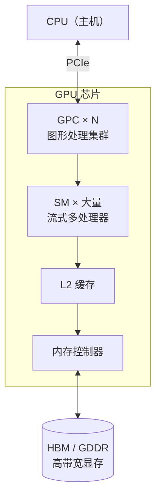
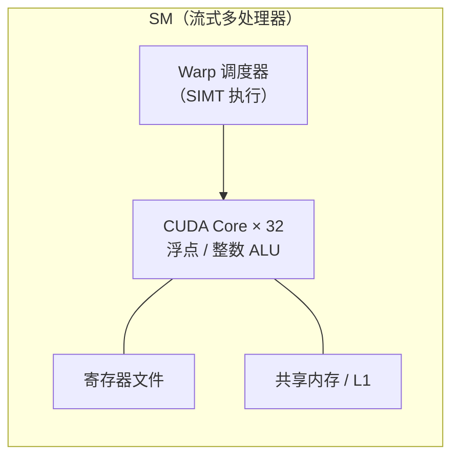

# Why GPU so Fast？
希望通过这篇文章了解一下GPU的发展和和相关的硬件知识

## GPU的诞生

随着缩放定律带来的芯片性能提升走向瓶颈，工程师将视野转向专用硬件如TPU，然而，专用计算硬件只能聚焦于某一类或者某几类特定的计算任务，在处理其他任务时则可能力不从心。
而GPU则是向通用性演进的典型代表。虽然其最初设计目标是为图形渲染加速，但高度并行的SIMT（Single Instruction Multiple Threads，单指令多线程）架构意外契合了通用计算的演进需求，超高的并行度获得了远超CPU的计算性能。
<details close>
<summary>CPU VS GPU</summary>

1. CPU：少量大核心，强通用、强分支逻辑
CPU 核心数量很少（主流台式机 4~32 核），每个核心超大缓存、复杂控制单元、强大分支预测、乱序执行。
擅长：
复杂分支判断、if/else、循环跳转、递归、函数调用（复杂逻辑）
串行流程、条件多变、依赖前一步结果的计算
复杂数据结构：链表、树、哈希、复杂指针操作
分支多、逻辑不规则的任务（业务代码、操作系统、编译器）
缺点：同一时间能跑的独立计算流很少，大规模重复计算效率低。

2. GPU：海量小核心，弱逻辑、强并行
GPU 有成百上千个极简小计算核心（流处理器 CUDA Core / ALU），控制单元极简，缓存很小，分支处理能力很差。
设计目标：大量无依赖、重复、同一种运算同时执行。
擅长：
矩阵运算、图像像素处理、光线追踪、AI 训练推理
海量数据做相同数学计算（向量、浮点运算）
规则、少分支、数据互相不依赖的任务
短板：一旦出现大量分支判断（一部分线程走 A 逻辑、一部分走 B），会出现线程束分化，性能暴跌；复杂递归、复杂指针运算几乎不适合 GPU。
</details>

- GPU快的核心：[高并发计算](# "相比于CPU，单位面积内逻辑控制单元更少，流处理器更多")；[低内存延迟](# 'SIMT核心管理多个线程组（wrap）不会因为等待内存数据阻塞执行')；[特化内存与计算架构](# 'GPU常配备高带宽内存；GPU还会集成专用计算单元')
- 算力评估：FLOPS（Floating-Point Operations Per Second，每秒浮点运算次数）来表示，通常数量级为T(万亿)，也即是大家听到的TFLOPS，公式如下：

```
算力（FLOPS）= CUDA核心数 × 加速频率 × 每核心单个周期浮点计算系数
```
- GPU架构原型：[Fermi](https://www.nvidia.com/content/PDF/fermi_white_papers/NVIDIA_Fermi_Compute_Architecture_Whitepaper.pdf)架构是现代通用GPU架构的基石

### GPU 架构简图

以 Fermi 为代表的现代通用 GPU，整体可理解为「大量 SM + 共享 L2 + 高带宽显存」：



SM 是 GPU 的基本计算单元，内部结构大致如下：



### CUDA编程简要示例

## 参考文档

1. [知乎专栏](https://zhuanlan.zhihu.com/p/678001378)
2. [知乎专栏](https://zhuanlan.zhihu.com/p/31825598174)