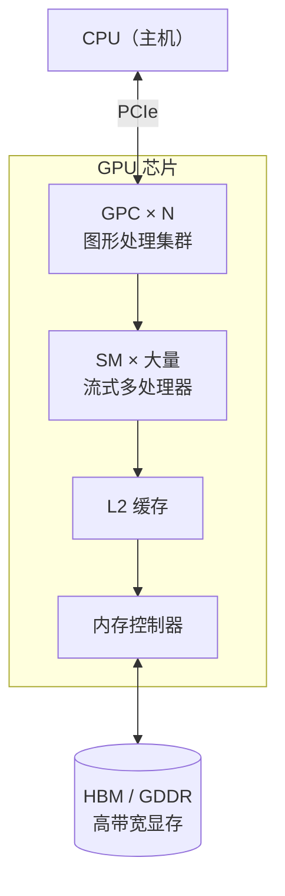
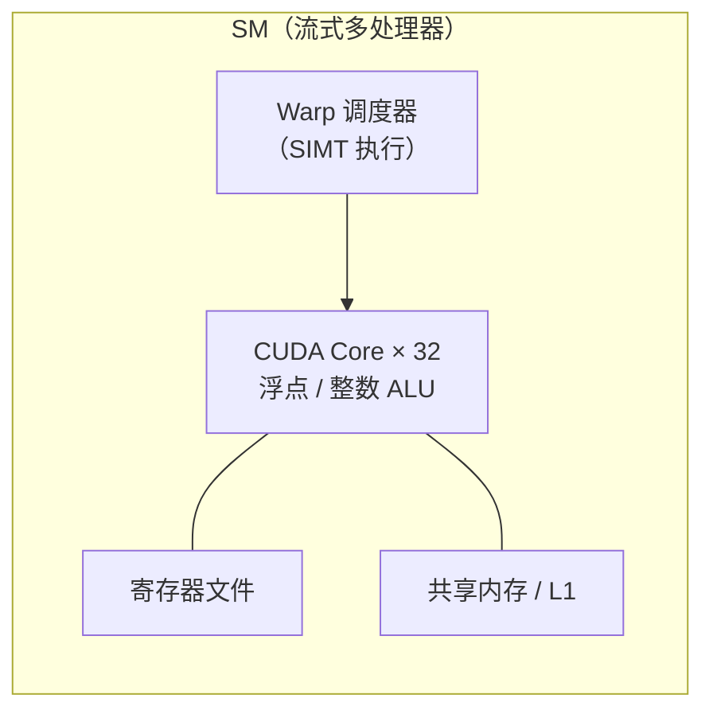

# Why GPU so Fast？
希望通过这篇文章了解一下GPU的发展和和相关的硬件知识，帮助学习NPU的相关知识

## GPU的诞生

随着缩放定律带来的芯片性能提升走向瓶颈，工程师将视野转向专用硬件如TPU，然而，专用计算硬件只能聚焦于某一类或者某几类特定的计算任务，在处理其他任务时则可能力不从心。
而GPU则是向通用性演进的典型代表。虽然其最初设计目标是为图形渲染加速，但高度并行的SIMT（Single Instruction Multiple Threads，单指令多线程）架构意外契合了通用计算的演进需求，超高的并行度获得了远超CPU的计算性能。
<details close>
<summary>CPU VS GPU</summary>

1. CPU：少量大核心，强通用、强分支逻辑
CPU 核心数量很少（主流台式机 4~32 核），每个核心超大缓存、复杂控制单元、强大分支预测、乱序执行。
擅长：
复杂分支判断、if/else、循环跳转、递归、函数调用（复杂逻辑）
串行流程、条件多变、依赖前一步结果的计算
复杂数据结构：链表、树、哈希、复杂指针操作
分支多、逻辑不规则的任务（业务代码、操作系统、编译器）
缺点：同一时间能跑的独立计算流很少，大规模重复计算效率低。

2. GPU：海量小核心，弱逻辑、强并行
GPU 有成百上千个极简小计算核心（流处理器 CUDA Core / ALU），控制单元极简，缓存很小，分支处理能力很差。
设计目标：大量无依赖、重复、同一种运算同时执行。
擅长：
矩阵运算、图像像素处理、光线追踪、AI 训练推理
海量数据做相同数学计算（向量、浮点运算）
规则、少分支、数据互相不依赖的任务
短板：一旦出现大量分支判断（一部分线程走 A 逻辑、一部分走 B），会出现线程束分化，性能暴跌；复杂递归、复杂指针运算几乎不适合 GPU。
</details>

- GPU快的核心：[高并发计算](# "相比于CPU，单位面积内逻辑控制单元更少，流处理器更多")；[低内存延迟](# 'SIMT核心管理多个线程组（wrap）不会因为等待内存数据阻塞执行')；[特化内存与计算架构](# 'GPU常配备高带宽内存；GPU还会集成专用计算单元')
- 算力评估：FLOPS（Floating-Point Operations Per Second，每秒浮点运算次数）来表示，通常数量级为T(万亿)，也即是大家听到的TFLOPS，公式如下：

```
算力（FLOPS）= CUDA核心数 × 加速频率 × 每核心单个周期浮点计算系数
```
- GPU架构原型：[Fermi](https://www.nvidia.com/content/PDF/fermi_white_papers/NVIDIA_Fermi_Compute_Architecture_Whitepaper.pdf)架构是现代通用GPU架构的基石

### GPU 架构简图

以 Fermi 为代表的现代通用 GPU，整体可理解为「大量 SM + 共享 L2 + 高带宽显存」：


```mermaid
flowchart TB
    CPU["CPU（主机）"]

    subgraph GPU["GPU 芯片"]
        direction TB
        GPC["GPC × N<br/>图形处理集群"]
        SM["SM × 大量<br/>流式多处理器"]
        L2["L2 缓存"]
        MC["内存控制器"]

        GPC --> SM
        SM --> L2
        L2 --> MC
    end

    VRAM[("HBM / GDDR<br/>高带宽显存")]

    CPU <-->|PCIe| GPC
    MC <--> VRAM
```

SM 是 GPU 的基本计算单元，内部结构大致如下：


```mermaid
flowchart LR
    subgraph SM["SM（流式多处理器）"]
        direction TB
        WS["Warp 调度器<br/>（SIMT 执行）"]
        CORE["CUDA Core × 32<br/>浮点 / 整数 ALU"]
        REG["寄存器文件"]
        SHMEM["共享内存 / L1"]

        WS --> CORE
        CORE --- REG
        CORE --- SHMEM
    end
```

### CUDA编程简要示例

以CPU上的SAXPY为例，对比下两段代码
CPU:
'''
// SAXPY函数实现
void saxpy(int n, float a, float *x, float *y) {
    for (int i = 0; i < n; i++) {
        y[i] = a * x[i] + y[i];
    }
}

int main() {
    float a = 2.0;
    int n; // 向量长度
    float *x; // 向量x
    float *y; // 向量y
    // 此处省略内存分配、元素赋值、长度指定
    // ...
    // 调用SAXPY函数
    saxpy(n, a, x, y);

    return 0;
}
'''
GPU:
'''
__global__ void saxpy(int n, float a, float *x, float *y) {
    int i = blockIdx.x * blockDim.x + threadIdx.x;
    if (i < n) {
        y[i] = a * x[i] + y[i];
    }
}

int main() {
    float a = 2.0;
    int n; // 向量长度
    float *hx; // host向量x
    float *hy; // host向量y
    // 此处省略内存分配、元素赋值、长度指定
       
    // GPU内存分配
    int vector_size = n * sizeof(float); // 向量数据大小
    float *dx; // device向量x
    float *dy; // device向量y
    cudaMalloc(&dx, vector_size);
    cudaMalloc(&dy, vector_size);
    
    // 将host向量内容拷贝到device向量
    cudaMemcpy(dx, hx, vector_size, cudaMemcpyHostToDevice);
    cudaMemcpy(dy, hy, vector_size, cudaMemcpyHostToDevice);
    
    // 执行saxpy
    int t = 256; // 每个thread block的线程数
    int blocks_num = (n + t - 1) / t; // thread block数量
    saxpy<<<blocks_num, t>>>(n, a, dx, dy);
    
    // 将device向量y内容（计算结果）拷贝到host向量y
    cudaMemcpy(hy, dy, vector_size, cudaMemcpyDeviceToHost);
    
    // ... (剩余逻辑)
    
    return 0;
}
'''
#### Host? Device!
GPU编程的思维是将GPU当作CPU的协同外设使用，通常GPU自身无法独立运行，需要CPU指定任务，分配数据，驱动运行。__gloable__代表内核函数，交给GPU来执行。
cudaMalloc、cudaMemcpy，是CPU操作GPU内存的操作,CPU分配GPU的内存用于GPU的数据搬运和计算，因此我们常说的Host,Device就由来于此。文中提到的统一内存（unified memory）代指CPU和GPU共享同一段地址空间的内存架构，理论上可以实现数据交换自动化，没有host to device但是事实上呢？

#### 线程组织
在CUDA编程中，线程以thread，thread block，grid的层级结构进行组织
● 线程（thread，绿色部分）：最基本的执行单元。线程包含独立寄存器状态和独立程序计数器。

● 线程块（thread block）：由多个线程组成的集合，支持一维、二维或三维结构。线程块内的线程可以通过共享内存进行通信，线程块之间无法通过共享内存通信，但可通过全局内存进行数据交互。

● Warp：硬件底层概念，GPU实际运行时将32个线程组成一个warp，同一warp内的线程同步执行相同的指令。

● 线程块与warp的关系：warp是底层概念，NVIDIA的warp固定包含32个线程，warp是线程硬件调度的最小粒度。线程块是软件概念，线程块有多少个线程组成由代码指定。在运行时，硬件会将线程块中的线程32个为一组打包成多个warp进行调度，因此，线程块里的线程数最好为32的整数倍，以避免为拼凑完整warp而自动分配无效线程造成资源浪费。

● 网格（grid，总体）：网格是所有线程块的集合，支持一维、二维或三维结构，覆盖整个计算任务的运行范围。
AMD叫法：NDRange；Work Group；Wavefront；Work Item
线程块计算：线程块包含的线程数可以指定，线程块的数量由计算规模确定，
'''
int blocks_num = (n + t - 1) / t; // thread block数量,向上取整写法
'''
# 从 SIMD 到 SIMT：GPU 如何将数据并行抽象为线程并行

SIMT（Single Instruction, Multiple Threads，单指令多线程）是 NVIDIA 在 GPU 架构中引入并推广的一种并行执行模型，也是现代通用 GPU 的核心基础之一。它将底层的数据并行能力包装成更易于编程的线程模型，使 GPU 不再局限于图形渲染，而能够用于科学计算、深度学习、数据处理等通用计算任务。

要理解 SIMT 的工作方式及其意义，需要先从更基础的并行计算模型——SIMD 讲起。可以将二者的关系概括为：

> **SIMD 直接描述硬件如何并行处理多份数据；SIMT 则在 SIMD 式执行机制之上，提供线程级的编程抽象。**

---

## 1. SIMD：一条指令处理多份数据

SIMD（Single Instruction, Multiple Data，单指令多数据）指的是：

> 在同一时刻，使用同一条指令处理多个数据元素。

假设需要分别计算 4 组数据的加法：

```text
c0 = a0 + b0
c1 = a1 + b1
c2 = a2 + b2
c3 = a3 + b3
```

在传统的标量执行方式中，处理器通常需要依次执行 4 次加法。SIMD 则可以将这 4 组数据分别装入两个向量寄存器：

```text
A = [a0, a1, a2, a3]
B = [b0, b1, b2, b3]
```

随后只需执行一条向量加法指令：

```text
C = A + B
```

硬件中的多个计算通道会同时完成：

```text
[a0 + b0, a1 + b1, a2 + b2, a3 + b3]
```

因此，从硬件执行的角度看，SIMD 可以表示为多个并行的计算通道共同执行同一条指令：

```text
同一条指令
     │
     ├── 操作数 a0、b0 → 结果 c0
     ├── 操作数 a1、b1 → 结果 c1
     ├── 操作数 a2、b2 → 结果 c2
     └── 操作数 a3、b3 → 结果 c3
```

这些并行计算通道通常称为 **lane**。每个 lane 处理不同的数据，但所有 lane 在同一时刻执行相同的操作。

CPU 中常见的 SIMD 实现包括：

- x86 平台的 SSE、AVX、AVX2 和 AVX-512；
- ARM 平台的 NEON 和 SVE；
- RISC-V 平台的向量扩展 RVV。

SIMD 特别适合图像处理、音视频编解码、矩阵计算等具有明显数据并行性的任务。

---

## 2. SIMD 的编程局限

SIMD 的优势是能够充分利用硬件中的并行计算单元，但它的编程模型比较接近底层硬件。

开发者或编译器通常需要明确处理：

- 向量寄存器中应装入哪些数据；
- 一次向量运算包含多少个元素；
- 数据是否按照适合向量访问的方式排列；
- 数据数量不是向量宽度整数倍时如何处理；
- 不同元素需要执行不同逻辑时如何使用掩码。

例如，下面的计算包含条件分支：

```text
如果 ai > 0：
    ci = ai * 2
否则：
    ci = ai + 1
```

不同数据元素可能进入不同分支，但 SIMD 的各个 lane 原则上需要共同执行一条指令。因此，处理器通常需要借助掩码：

```text
执行 ai * 2，只启用满足 ai > 0 的 lane
执行 ai + 1，只启用满足 ai <= 0 的 lane
```

这意味着 SIMD 虽然提供了很高的计算效率，但开发者看到的仍然是“一个向量中包含多个数据元素”的硬件式抽象。

---

## 3. SIMT：将数据通道抽象为线程

SIMT 的核心思想，是将 SIMD 中的多个数据通道进一步抽象为多个线程。

在 SIMD 模型中，开发者关注的是：

```text
一条向量指令 + 一组向量操作数
```

而在 SIMT 模型中，开发者面对的是：

```text
同一段线程程序 + 多个拥有各自数据状态的线程
```

每个线程在逻辑上都拥有自己的执行上下文，例如：

- 独立的线程编号；
- 独立的寄存器状态；
- 独立的局部变量；
- 独立的数据地址；
- 逻辑上独立的控制流状态。

以向数组中的每个元素加 1 为例，在 CUDA 中可以写成：

```cpp
__global__ void add_one(float* data, int n)
{
    int i = blockIdx.x * blockDim.x + threadIdx.x;

    if (i < n) {
        data[i] += 1.0f;
    }
}
```

从程序员的视角来看，每个线程只负责一个数组元素，核心在于，int i = blockIdx.x * blockDim.x + threadIdx.x;这段中不同的i代表了不同的线程：

```text
线程 0 → data[0] += 1
线程 1 → data[1] += 1
线程 2 → data[2] += 1
线程 3 → data[3] += 1
...
```

开发者编写的不是一条显式操作整个向量的指令，而是“一个线程应该完成什么工作”。随后，GPU 创建大量线程，并让它们并行处理不同的数据。

这种方式将底层的数据并行机制隐藏在线程模型之后，使程序员可以通过线程编号自然地表达数据并行任务。

---

## 4. SIMT 并不意味着每个线程都被完全独立执行

SIMT 在编程模型上表现为大量独立线程，但硬件通常不会逐个调度和执行这些线程。GPU 会将多个线程组织成固定大小的线程组。

在 NVIDIA GPU 中，这种线程组称为 **Warp**，通常包含 32 个线程：

```text
一个 Warp
├── 线程 0
├── 线程 1
├── 线程 2
├── ...
└── 线程 31
```

GPU 通常以 Warp 为单位进行指令调度。同一个 Warp 中处于激活状态的线程，在某个执行周期内共同执行同一条指令，但各自使用不同的寄存器数据和内存地址：

```text
同一条指令
     │
     ├── 线程 0 的操作数 → 线程 0 的结果
     ├── 线程 1 的操作数 → 线程 1 的结果
     ├── 线程 2 的操作数 → 线程 2 的结果
     └── ...
```

从底层执行方式看，这与 SIMD 非常相似：

- SIMD 将一条指令发送到多个数据 lane；
- SIMT 将同一条指令发送给一个 Warp 中的多个活动线程。

因此，SIMT 常被理解为：

> **以 Warp 为执行单位、以线程为编程抽象的 SIMD 式并行模型。**

不过，SIMT 并不等同于简单地给 SIMD 换一个名字。它在 SIMD 式硬件执行机制之上增加了线程状态、线程索引、线程调度和控制流管理，使程序员看到的是大量逻辑线程，而不是一组显式的向量元素。

---

## 5. SIMT 如何处理线程分支

线程级抽象允许不同线程在逻辑上选择不同的执行路径。例如：

```cpp
if (threadIdx.x % 2 == 0) {
    do_A();
} else {
    do_B();
}
```

在程序语义上：

- 偶数编号线程执行 `do_A()`；
- 奇数编号线程执行 `do_B()`。

但如果这些线程属于同一个 Warp，硬件通常无法让它们在同一时刻执行两条不同的指令。GPU 一般会分阶段执行两个分支：

```text
第一阶段：执行 do_A()
          启用偶数线程，屏蔽奇数线程

第二阶段：执行 do_B()
          启用奇数线程，屏蔽偶数线程

第三阶段：分支重新汇合
          所有线程继续执行后续指令
```

这种现象称为 **分支发散（branch divergence）**。

分支发散不会改变程序的正确性，但会降低并行计算单元的利用率。原本可以同时工作的线程，因为执行路径不同而不得不分批工作。

因此，SIMT 编程虽然允许线程拥有逻辑上独立的控制流，但要获得较高性能，仍应尽量让同一个 Warp 中的线程执行相同路径。

---

## 6. 从 SIMD 到 SIMT 的抽象变化

SIMD 与 SIMT 的关键区别，不在于底层是否同时计算多个数据，而在于它们向程序员暴露了不同的抽象。

| 对比维度 | SIMD | SIMT |
|---|---|---|
| 完整名称 | Single Instruction, Multiple Data | Single Instruction, Multiple Threads |
| 编程对象 | 向量及其数据元素 | 大量逻辑线程 |
| 硬件执行单位 | 向量 lane | Warp、wavefront 等线程组 |
| 数据状态 | 存放在向量寄存器的不同位置 | 每个线程拥有自己的逻辑寄存器状态 |
| 控制流 | 通常通过掩码控制不同 lane | 线程可以编写不同分支，由硬件处理发散 |
| 常见平台 | CPU 向量计算单元 | GPU |
| 编程方式 | 向量指令、编译器自动向量化 | CUDA、HIP、OpenCL 等线程编程模型 |
| 主要抽象 | 一条指令处理一个数据向量 | 一个线程程序被大量线程共同运行 |

抽象过程可以概括为：

```text
SIMD：
程序员组织向量
→ 一条向量指令
→ 多个 lane 处理不同数据

SIMT：
程序员组织线程
→ GPU 将线程组成 Warp
→ Warp 发射同一条指令
→ 多个线程处理各自的数据
```

---

## 7. SIMT 的意义

SIMT 的价值并不只是让 GPU 同时运行更多计算，而是为庞大的数据并行硬件提供了一种更自然的编程方式。

如果直接使用 SIMD 模型，开发者需要显式考虑向量宽度、向量寄存器和掩码等底层细节。SIMT 则允许开发者先把问题拆分成大量相似的小任务，再用一个线程描述其中一个任务：

```text
定义一个线程要做什么
        ↓
创建大量逻辑线程
        ↓
每个线程根据编号选择自己的数据
        ↓
GPU 将线程自动组织成 Warp
        ↓
底层计算单元以 SIMD 式方式批量执行
```

这样，程序员面对的是相对直观的线程模型，而硬件仍然能够利用规则、宽广的数据通路实现高吞吐量。

这也是 SIMT 推动 GPU 通用化的重要原因之一：它在底层并行计算能力与上层通用程序表达之间建立了一层有效的抽象。

---

## 8. 总结

SIMD 和 SIMT 都利用了“对不同数据执行相同计算”这一基本思想，但两者处于不同的抽象层次：

- **SIMD 是数据级并行模型**：一条向量指令直接作用于多个数据元素；
- **SIMT 是线程级编程模型**：程序员编写一个线程程序，由大量线程分别处理自己的数据；
- **SIMT 的底层执行仍具有明显的 SIMD 特征**：线程被组织成 Warp，并以线程组为单位发射指令；
- **SIMT 比 SIMD 提供了更高层的抽象**：它隐藏了显式向量操作，使数据并行任务可以通过线程和线程编号来表达；
- **SIMT 的独立线程是逻辑抽象**：同一个 Warp 中的线程仍然共享指令执行资源，分支发散会降低执行效率。

一句话概括二者的关系：

> **SIMD 是“用一条指令直接处理一组数据”，SIMT 是“编写一个线程程序，再由硬件以类似 SIMD 的方式批量执行大量线程”。**

## 参考文档

1. [知乎专栏](https://zhuanlan.zhihu.com/p/678001378)
2. [知乎专栏](https://zhuanlan.zhihu.com/p/31825598174)