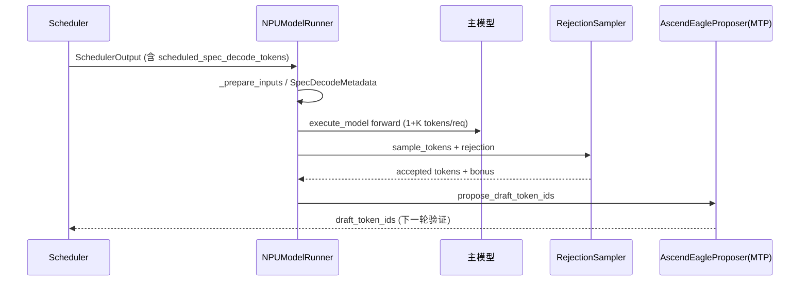

# MTP Code Walkthrough Guide

本文档梳理 vLLM Ascend 中 **Multi-Token Prediction (MTP)** 投机解码的主线代码路径，包括走读目录、推荐阅读顺序与关键变量说明。

> 设计文档：[mtp-design-310p.md](../../work/mtp-design-310p.md)  
> **说明**：用户指南 `Multi_Token_Prediction.md` 中提到的 `mtp_proposer.py` / `AscendMtpProposer` 在当前代码中已并入 **`AscendEagleProposer`**（`method == "mtp"` 与 EAGLE 共用实现，通过 `self.method` 分支区分）。

---

## 一、整体数据流

一轮 decode 的核心逻辑：

1. **主模型**一次前向处理 **1（确定 token）+ K（上轮 draft tokens）** 个 token；
2. **Rejection Sampling** 决定接受多少个 draft / bonus token；
3. **MTP draft 模型**预测下一轮 K 个 draft token，供 scheduler 在下一轮调度。



---

## 二、走读目录与推荐顺序

### 第 0 层：配置与文档（约 5 分钟）

| 顺序 | 文件 | 关注点 |
|------|------|--------|
| 0.1 | `docs/source/user_guide/feature_guide/Multi_Token_Prediction.md` | 算法、限制（K≤15、fullgraph capture 为 n×(K+1)） |
| 0.2 | `docs/source/user_guide/feature_guide/speculative_decoding.md` | 启动参数示例 |
| 0.3 | 启动参数 | `--speculative-config '{"method":"mtp","num_speculative_tokens":K,...}'` |

### 第 1 层：入口与 Proposer 工厂（约 15 分钟）

| 顺序 | 文件 | 函数/类 | 说明 |
|------|------|---------|------|
| 1.1 | `vllm_ascend/spec_decode/__init__.py` | `get_spec_decode_method` | `method in ("eagle","eagle3","mtp")` → `AscendEagleProposer` |
| 1.2 | `vllm_ascend/worker/model_runner_v1.py` | `_set_up_drafter`（约 504 行） | 创建 `self.drafter`、`self.rejection_sampler` |
| 1.3 | `vllm_ascend/platform.py` | `_get_default_max_cudagraph_capture_size`（约 187 行） | `decode_query_len = 1 + K` 影响 graph capture |

### 第 2 层：主循环 — ModelRunner 两阶段（核心，约 45–60 分钟）

| 顺序 | 文件 | 函数 | 说明 |
|------|------|------|------|
| 2.1 | `model_runner_v1.py` | `execute_model`（约 1578 行） | 准备输入 → 主模型 forward → 暂存 `execute_model_state` |
| 2.2 | `model_runner_v1.py` | `_prepare_inputs`（约 631 行） | token 布局、PCP/MTP 输入 |
| 2.3 | `model_runner_v1.py` | `_build_attn_state`（约 1196 行） | MTP 时 `DecodeOnly` → `SpecDecoding` |
| 2.4 | `model_runner_v1.py` | `_calc_spec_decode_metadata`（约 1227 行） | 构造 `SpecDecodeMetadata` |
| 2.5 | `model_runner_v1.py` | `sample_tokens`（约 1970 行） | `_sample` → `_bookkeeping_sync` → `propose_draft_token_ids` |
| 2.6 | `model_runner_v1.py` | `_sample`（约 2171 行） | 有 spec 时走 `rejection_sampler` |
| 2.7 | `model_runner_v1.py` | `propose_draft_token_ids`（约 1326 行） | 调用 `drafter.propose` / `prepare_inputs*` |

**MTP 在 `propose_draft_token_ids` 的分支**：走 `use_eagle()` 路径（与 EAGLE 相同），根据 `disable_padded_drafter_batch` 选择 `prepare_inputs` 或 `prepare_inputs_padded`。

### 第 3 层：Draft / MTP 模型（约 45 分钟）

| 顺序 | 文件 | 函数 | 说明 |
|------|------|------|------|
| 3.1 | `vllm_ascend/spec_decode/eagle_proposer.py` | `load_model`（约 202 行） | 加载 MTP 层；`_maybe_share_embeddings` / `_maybe_share_lm_head` |
| 3.2 | 同上 | `_maybe_share_embeddings`（约 261 行） | MTP 默认共享主模型 embedding |
| 3.3 | 同上 | `_maybe_share_lm_head`（约 324 行） | DeepSeek MLA 共享 `lm_head` |
| 3.4 | 同上 | `_propose`（约 515 行） | draft 多步前向 + `argmax` 出 draft tokens |
| 3.5 | 同上 | `_run_first_pass` 等（约 850+ 行） | `method == "mtp"` 时 positions/hidden_states 与 EAGLE 处理不同 |
| 3.6 | `vllm_ascend/patch/worker/patch_deepseek_mtp.py` | `AscendDeepSeekMultiTokenPredictorLayer` | NPU 上 MTP 层 forward（QuaRot、position=0 mask） |
| 3.7 | `vllm_ascend/patch/worker/patch_qwen3_next_mtp.py` | （按需） | Qwen3-Next MTP 专用 patch |

### 第 4 层：采样与接受（约 30 分钟）

| 顺序 | 文件 | 说明 |
|------|------|------|
| 4.1 | vLLM 上游 `vllm/v1/sample/rejection_sampler.py` | `RejectionSampler` 接口与 `parse_output` |
| 4.2 | `vllm_ascend/sample/rejection_sampler.py` | NPU Triton/PyTorch 实现 |
| 4.3 | `vllm_ascend/patch/worker/patch_rejection_sampler.py` | 将 Ascend 实现 patch 进 vLLM |
| 4.4 | `vllm_ascend/ops/triton/reject_sample.py` | kernel 层（可选深入） |

### 第 5 层：Attention / Graph / 长序列（按需深入）

| 顺序 | 文件 | 说明 |
|------|------|------|
| 5.1 | `vllm_ascend/attention/mla_v1.py` | `decode_threshold`、`pad_actual_seq_len_q_mtp_*`、MTP+PD |
| 5.2 | `vllm_ascend/attention/attention_v1.py` | `_EXTRA_CTX.is_draft_model` 分支 |
| 5.3 | `vllm_ascend/compilation/acl_graph.py` | fullgraph + MTP capture |
| 5.4 | `vllm_ascend/worker/pcp_utils.py` | `generate_pcp_mtp_input`、`mtp_slot_pad`（PCP+MTP） |
| 5.5 | `vllm_ascend/ops/rotary_embedding.py` | `use_mtp` 对 RoPE 的影响 |

### 第 6 层：测试与回归（验证理解）

| 文件 | 用途 |
|------|------|
| `tests/e2e/singlecard/spec_decode/test_mtp_eagle_correctness.py` | 正确性 |
| `tests/e2e/multicard/4-cards/long_sequence/test_mtp.py` | PCP+DCP+fullgraph |
| `tests/e2e/multicard/4-cards/spec_decode/test_mtp_qwen3_next.py` | Qwen3-Next MTP |
| `tests/ut/spec_decode/test_eagle_proposer.py` | proposer 单测（搜索 `method = "mtp"`） |

---

## 三、关键变量速查表

### 配置层（`VllmConfig.speculative_config`）

| 变量 | 含义 |
|------|------|
| `method` | `"mtp"`（e2e 中还有 `deepseek_mtp`、`qwen3_next_mtp` 等，由 vLLM 映射到同一 proposer 族） |
| `num_speculative_tokens` | **K**，每轮 draft token 数量 |
| `disable_padded_drafter_batch` | MTP 是否使用不等长 batch（影响 `prepare_inputs` 路径） |

### ModelRunner 实例字段

| 变量 | 典型值 / 含义 |
|------|----------------|
| `decode_threshold` | `1 + K`，attention 区分 decode / spec 的阈值 |
| `decode_token_per_req` | 同 `1 + K` |
| `num_spec_tokens` / `uniform_decode_query_len` | graph padding、uniform batch 长度 |
| `self.drafter` | `AscendEagleProposer`（MTP 时 `method == "mtp"`） |
| `self.rejection_sampler` | 仅在 PP last rank 且开启 spec 时创建 |
| `self._draft_token_ids` | 上轮 propose 结果，供 scheduler 与下轮 `_prepare_inputs` |
| `execute_model_state` | `execute_model` 与 `sample_tokens` 之间的暂存（logits、metadata、hidden_states） |

### `SpecDecodeMetadata`（每步构造）

| 字段 | 含义 |
|------|------|
| `draft_token_ids` | 上轮 MTP 提出、本轮主模型要验证的 token |
| `num_draft_tokens` | 每个 request 的 draft 数（可不等长） |
| `cu_num_draft_tokens` / `cu_num_sampled_tokens` | 前缀和，用于展平 batch |
| `target_logits_indices` | 主模型 logits 上与 draft 对齐的位置 |
| `bonus_logits_indices` | **bonus token**（多接受 1 个时）的 logits 下标 |
| `logits_indices` | 全部参与采样的 token 下标 |

### Draft Proposer（`AscendEagleProposer`）

| 变量 | 含义 |
|------|------|
| `self.method` | `"mtp"` |
| `self.num_speculative_tokens` | K |
| `self.decode_threshold` | proposer 侧 `1 + K` |
| `token_indices_to_sample` | 从 target hidden 取哪些位置算 logits |
| `_EXTRA_CTX.num_tokens` / `num_accept_tokens` | draft 多步循环里的 batch 维度 |

### Attention / 前向上下文

| 变量 | 含义 |
|------|------|
| `attn_state` | MTP decode 常为 `AscendAttentionState.SpecDecoding` |
| `_EXTRA_CTX.is_draft_model` | 区分 draft forward 与 target forward |
| `_EXTRA_CTX.is_draft_model_prefill` | draft prefill 路径 |
| `actual_seq_lengths_q` | MTP + torchair + PD 场景下 Q 长度 padding |

### PCP 相关（`pcp_size > 1`）

| 变量 | 含义 |
|------|------|
| `pcp_manager.mtp_slot_pad` | 预分配 MTP slot mapping |
| `input_ids_pcp_full` / `query_start_loc_pcp_full` | PCP 切分后的完整序列视图 |
| `generate_pcp_mtp_input` | prefill + decode 混合时 MTP 输入生成 |

---

## 四、建议的第一遍精读路径（约 2 小时）

1. **`_set_up_drafter`** — 弄清 `drafter` / `rejection_sampler` 何时创建  
2. **`execute_model` + `sample_tokens`** — 两阶段如何衔接  
3. **`_calc_spec_decode_metadata`** — 对照注释里的数字例子（约 1237 行）  
4. **`propose_draft_token_ids` 的 eagle 分支** — 跟踪到 `drafter._propose`  
5. **`eagle_proposer._propose` + `method == "mtp"` 分支** — draft 如何逐步生成 K 个 token  
6. **`patch_deepseek_mtp.py`** — MTP 层在 NPU 上的数学实现  
7. **`mla_v1.decode_threshold`** — 理解为何 K ≤ 15  

---

## 五、与官方用户文档的差异

| 用户文档 | 当前代码 |
|----------|----------|
| `mtp_proposer.py` / `AscendMtpProposer` | 不存在；MTP 使用 `AscendEagleProposer`，`self.method == "mtp"` 分支 |
| `get_spec_decode_method` 仅列出 `"mtp"` | e2e 中 `deepseek_mtp` 等由 **vLLM 上游** 在解析 `speculative_config` 时归一化 |
| — | **MTP + PCP + fullgraph**：`model_runner_v1.py` 约 1498 行、`eagle_proposer.py` 约 722 行注释标明兼容限制 |

---

## 六、代码锚点（便于 IDE 跳转）

### Proposer 工厂

```python
# vllm_ascend/spec_decode/__init__.py
elif method in ("eagle", "eagle3", "mtp"):
    return AscendEagleProposer(vllm_config, device, runner)
```

### Drafter 初始化

```python
# vllm_ascend/worker/model_runner_v1.py — _set_up_drafter
self.decode_token_per_req = 1 + spec_token_num
self.drafter = self._get_drafter()
self.rejection_sampler = RejectionSampler(self.sampler)
```

### Attention 状态（MTP）

```python
# model_runner_v1.py — _build_attn_state
if self.speculative_config and self.speculative_config.method == "mtp":
    attn_state = AscendAttentionState.SpecDecoding
```

### SpecDecodeMetadata 示例（注释）

```text
# num_draft_tokens:         [  3,   0,   2,   0,   1]
# cu_num_draft_tokens:      [  3,   3,   5,   5,   6]
# bonus_logits_indices:     [  3,   4,   7,   8,  10]
```

### MTP 共享 Embedding

```python
# eagle_proposer.py — _maybe_share_embeddings
# MTP model
share_embeddings = True
logger.info("Detected MTP model. Sharing target model embedding weights with the draft model.")
```

---

## 七、相关文档

- [Multi Token Prediction（用户指南）](https://github.com/vllm-project/vllm-ascend/blob/main/docs/source/user_guide/feature_guide/Multi_Token_Prediction.md)
- [Speculative Decoding](https://github.com/vllm-project/vllm-ascend/blob/main/docs/source/user_guide/feature_guide/speculative_decoding.md)
- [ModelRunner prepare_inputs](https://github.com/vllm-project/vllm-ascend/blob/main/docs/source/developer_guide/Design_Documents/ModelRunner_prepare_inputs.md)
- [ACL Graph](https://github.com/vllm-project/vllm-ascend/blob/main/docs/source/developer_guide/Design_Documents/ACL_Graph.md)
- [Context Parallel](https://github.com/vllm-project/vllm-ascend/blob/main/docs/source/developer_guide/Design_Documents/context_parallel.md)
