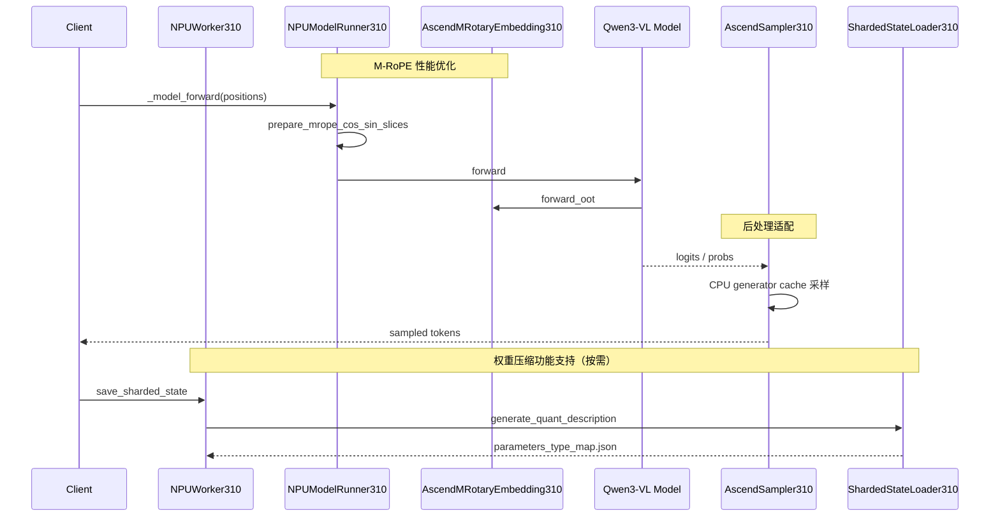
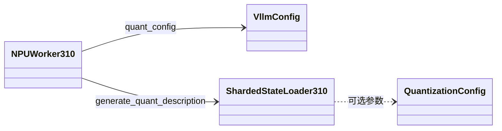
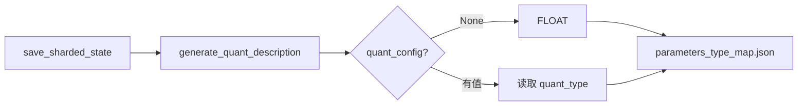
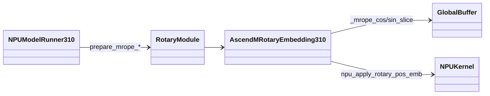
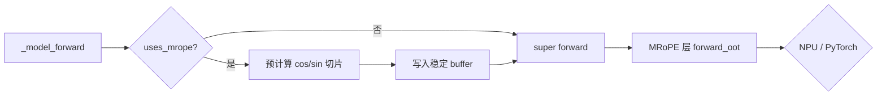
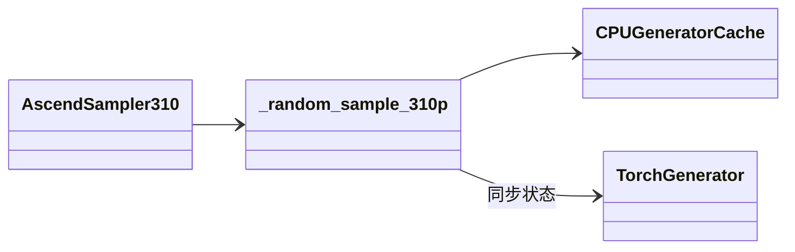
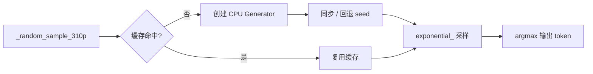

# Qwen3-VL Ascend Adaptation Design

> 工程：vllm-project/vllm-ascend · 310P · Qwen3-VL

---

## 概述

Qwen3-VL 在 310P 上的适配优化覆盖 **Forward（M-RoPE）→ 采样（后处理）→ 权重落盘（压缩元数据）** 三条链路，各模块正交、按需触发。

---

## 第一章 权重压缩功能支持

VL 模型的 `quant_config` 常挂在 `language_model` 而非多模态根节点。改为由 `NPUWorker310` 从 `vllm_config.quant_config` 传入；`generate_quant_description` 在配置为 `None` 时按 FLOAT 生成 `parameters_type_map.json`。

### 接口描述

| 接口 | 说明 |
|------|------|
| `NPUWorker310.save_sharded_state(path, pattern?, max_size?)` | 入口：保存分片权重并生成量化元数据 |
| `ShardedStateLoader310.save_model(model, path, pattern?, max_size?)` | 按 TP rank 写出 safetensors 分片 |
| `ShardedStateLoader310.generate_quant_description(model, path, quant_config?)` | 生成 `parameters_type_map.json`；`quant_config=None` 时全局按 FLOAT |

**输出**：`path/parameters_type_map.json`，含 `model_quant_type`、`version` 及各参数名 → 量化类型映射。

### 单元测试（PR #7546）

**文件**：`tests/ut/_310p/test_sharded_state_loader_310p.py`

| 用例 | 覆盖接口 | 验证要点 |
|------|----------|----------|
| `test_generate_quant_description_no_quant_config_310` | `generate_quant_description` | `quant_config=None` 时 `model_quant_type` 与 weight 均为 FLOAT |

### 类图

### 流程图

---

## 第二章 M-RoPE 性能优化

每次 forward 前预计算 cos/sin 切片并写入稳定 buffer（支持 graph replay）；`AscendMRotaryEmbedding310` 在 `rotary_dim ∈ {64,128}` 时走 NPU 算子，否则 PyTorch 回退。

### 接口描述

| 接口 | 说明 |
|------|------|
| `NPUModelRunner310._model_forward(..., positions?)` | `uses_mrope=True` 时先调用 slice 准备，再执行父类 forward |
| `prepare_mrope_cos_sin_slices_from_runner(runner, positions)` | 解析 MRoPE 层并填充全局 cos/sin buffer |
| `set_mrope_apply_rotary_slices(cos_sin_cache, positions, *, mrope_section, mrope_interleaved, capacity_tokens)` | 按 positions 预计算切片，写入 `_mrope_cos_slice` / `_mrope_sin_slice` |
| `AscendMRotaryEmbedding310.forward_oot(positions, query, key)` | 读全局 buffer 执行 RoPE；`rotary_dim∈{64,128}` 走 NPU，否则 PyTorch |
| `merge_mrope_cos_sin_for_apply(cos, sin, mrope_section, mrope_interleaved)` | 合并 T/H/W 三维 cos/sin（支持 interleaved 模式） |

**前置条件**：每层 `forward_oot` 前须已完成一次 `set_mrope_apply_rotary_slices`。

### 单元测试（PR #8774）

**文件**：`tests/ut/_310p/ops/test_rotary_embedding_310.py`（PR 新增）

| 用例 | 覆盖接口 | 验证要点 |
|------|----------|----------|
| `test_set_mrope_apply_rotary_slices_populates_globals` | `set_mrope_apply_rotary_slices` | 调用后 `_mrope_cos_slice` / `_mrope_sin_slice` 非空，token 维与 positions 一致 |
| `test_set_mrope_apply_rotary_slices_reuses_buffer_address` | `set_mrope_apply_rotary_slices` | 连续两次调用，cos buffer 内存地址不变（graph replay 稳定存储） |

### 类图

### 流程图

---

## 第三章 后处理适配

310P 采样路径通过 CPU generator 缓存执行 `exponential_`，缓存键为 `(batch_index, id(generator))`，状态同步失败时回退 `initial_seed`，保证 RNG 与原始 generator 一致。

### 接口描述

| 接口 | 说明 |
|------|------|
| `AscendSampler310(logprobs_mode?)` | 310P 采样器，内部挂载 `AscendTopKTopPSampler310` |
| `AscendTopKTopPSampler310.forward_native(logits, generators, k, p)` | Top-K/Top-P 过滤后调用 310P 随机采样 |
| `_random_sample_310p(probs, generators)` | Gumbel-max 采样：CPU 上 `exponential_`，再 `probs.div_(q).argmax` |
| `_get_cpu_generator_310p(i, generator)` | 按 slot + generator 身份获取/创建 CPU Generator |
| `fill_exponential_310p(q, generators, has_draft_mask?)` | 在 CPU 填充指数随机数后拷回 NPU（draft 场景可选 mask） |

**缓存**：模块级 `_CPU_GENERATOR_CACHE_310P: dict[int, tuple[Generator, int]]`。

### 单元测试（PR #8495）

**文件**：`tests/ut/_310p/sample/test_sampler_310.py`（PR 新增）

| 用例 | 覆盖接口 | 验证要点 |
|------|----------|----------|
| `test_random_sample_310p_reuse_cpu_generator_cache` | `_random_sample_310p` / `_get_cpu_generator_310p` | 同一 slot、同一 generator 连续采样仅创建 1 次 CPU Generator，二次复用缓存 |
| `test_random_sample_310p_fallback_to_initial_seed_when_set_state_failed` | `_get_cpu_generator_310p` | `get_state` / `set_state` 失败时回退 `manual_seed(initial_seed)` |
| `test_random_sample_310p_rebuild_cache_when_generator_identity_changes` | `_get_cpu_generator_310p` | 同 slot 换不同 generator 对象时重建缓存，状态与新区块一致 |

### 类图

### 流程图

