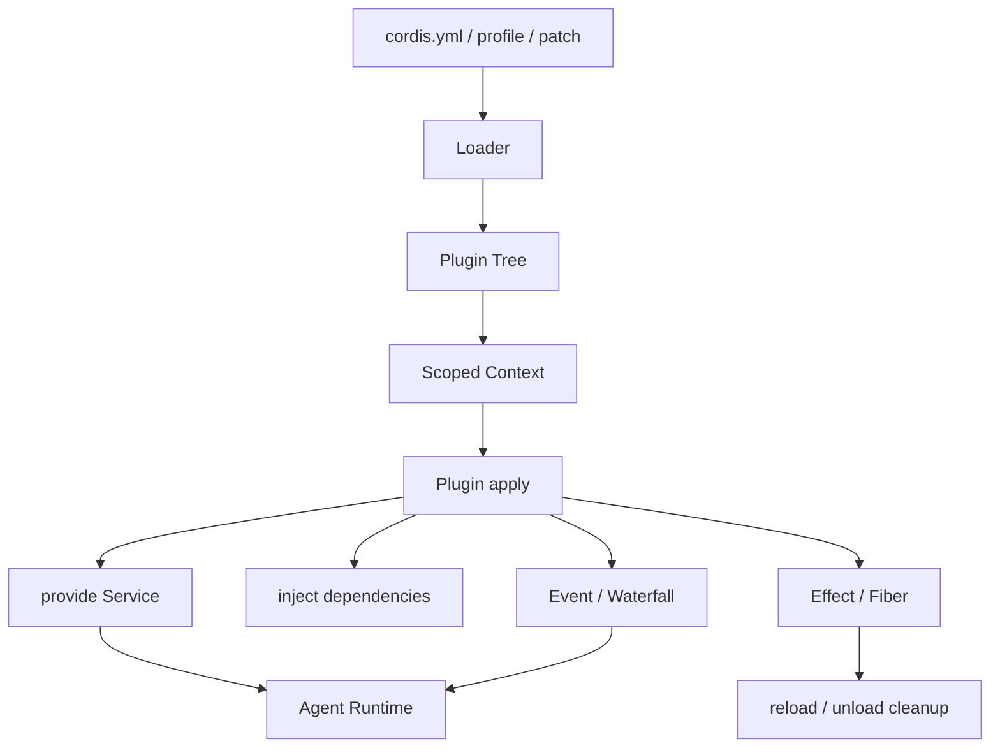

# Cordis 插件运行时

## 核心问题

Cordis 如何通过插件、上下文、服务依赖和作用域生命周期，将 DeepSeek Harness 组织成可组合、可替换的 Agent Runtime？

## 简要结论

Cordis 是 DeepSeek Harness（DSH）底层的插件框架。它把 Runtime 能力表示为挂载到共享 `Context` 的 Plugin 与 Service，通过 `inject` 表达依赖，通过 Event/Waterfall 协作，并用 Effect/Fiber 将注册项和资源绑定到插件作用域。`cordis.yml` 描述组合结构，但启动顺序由服务依赖而非列表位置决定。

与只在既定主流程上暴露 Hook 的插件系统相比，Cordis 更接近微内核式组合容器：工具、模型适配器、文件访问、会话存储乃至 Agent Loop 都可以由插件提供或替换。

## 工作原理

### 1. 核心对象



| 抽象 | 职责 |
|---|---|
| `Context` | 当前插件作用域访问服务、事件和注册 API 的入口 |
| Plugin | 最小装配与生命周期单元，可为函数、对象或 Service 类 |
| Service | 插件间共享能力的命名契约；provider 与 consumer 解耦 |
| `inject` | 声明必需服务，依赖齐备时才启动消费者 |
| Event | 向多个监听者广播事实或状态变化 |
| Waterfall | 按次序传递并变换一个值，可表达短路 |
| Effect/Fiber | 追踪异步工作、注册项与清理动作的作用域生命周期 |
| Loader | 读取配置、挂载插件树并协调启动和卸载 |

### 2. 插件入口

最常见的函数插件导出 `apply(ctx, config)`；对象插件将 metadata 与 `apply` 放在一起；提供 Service 时可继承 `Service` 类。插件公共元数据包括：

- `name`：诊断显示名。
- `Config`：启动前执行的 Standard Schema 配置校验。
- `inject`：所需服务。
- `provide`：提供的服务名。
- `intercept`：声明消费的服务拦截配置。

```ts
import type { Context } from "@deepseek-ai/cordis"

export const name = "repo-tool"
export const inject = ["tools"]

export function apply(ctx: Context) {
  ctx.tools.register(/* tool definition */)
}
```

### 3. 服务依赖与重载

`inject` 是启动约束，不是文档注释。消费者仅在必需 Service 可用时加载；服务消失或替换时，相关作用域可以卸载并在依赖重新就绪后再运行。`ctx.inject(deps, callback)` 是动态依赖回调的快捷方式。

因此：

- `cordis.yml` 同级条目可以并发启动，列表先后不保证初始化顺序。
- 插件不应在模块加载阶段捕获尚未就绪的 Service。
- 消费者不应长期保存已被替换 provider 的内部引用。
- 一个 Service 应有稳定、最小的接口，并把实现细节留在 provider 内。

### 4. 作用域化副作用

通过 `ctx` 注册的监听器、工具等效果会绑定到插件作用域。外部资源通过 `ctx.effect()` 返回 disposer：

```ts
export function apply(ctx: Context) {
  ctx.effect(() => {
    const timer = setInterval(tick, 5_000)
    return () => clearInterval(timer)
  })
}
```

当插件卸载、配置变化或依赖替换时，作用域负责撤销注册并执行清理。这使热更新成为可管理的状态转换，而不是简单地再次执行初始化函数。

### 5. 组合配置

DSH 通过 profile、bundle、patch 与 `cordis.yml` 组合插件树。排障时应查看最终组合结果，而不能只检查某个局部配置文件。一个插件未启动通常需要依次检查：

1. 最终插件树中是否存在该条目。
2. 模块路径或 npm 包是否能解析。
3. `Config` schema 是否接受当前配置。
4. `inject` 声明的 Service 是否都有 provider。
5. `apply()` 是否启动失败或在依赖变化后被卸载。

## 适用边界

- 本文聚焦 Cordis 在 DSH 中的核心组合模型，不覆盖每个 DSH package 的业务 API。
- DSH 与 Cordis 仍在演进；包名、Service surface、配置层和动态扩展能力应以锁定 commit 的官方文档与类型为准。
- 自动清理只覆盖被 Cordis 正确追踪的注册项；直接创建的连接、Worker 或进程仍需显式 disposer。
- 依赖注入解决装配与生命周期，不等于安全隔离。插件仍可能和宿主共享进程与权限。
- 动态 Cordis Package、自修改 Runtime 和浏览器侧插件属于更高风险扩展面，需要独立审批、审计与回滚设计。

## 实践意义

- 把 Agent OS 契约映射成 DSH Service，而不是耦合具体 provider 包。
- 用 `inject` 表达启动条件，不通过 YAML 顺序制造隐式依赖。
- 所有外部资源都纳入 `ctx.effect()` 或等价的作用域清理。
- 对 provider 替换、依赖消失、配置失败和 reload/unload 编写集成测试。
- 部署时固化最终 profile/patch 组合，并记录 DSH commit 与包版本。

## 应用记录

- [DeepSeek Harness（DSH）插件系统学习报告](../../../agent/study-notes/dsh/plugin-system.md)
- [OpenCode 插件系统学习报告](../../../agent/study-notes/opencode/plugin-system.md)

## 相关知识

- [Hook 扩展机制](hook-mechanism.md)
- [Agent 架构总览](../architecture/overview.md)
- [Sandbox 生命周期](../integration/sandbox-lifecycle.md)

## 参考资料

- [DeepSeek Harness Cordis Tutorial](https://github.com/deepseek-ai/deepseek-harness/blob/master/docs/cordis-tutorial/index.md)
- [Your First Harness Plugin](https://github.com/deepseek-ai/deepseek-harness/blob/master/docs/user/develop/basic/index.md)
- [Cordis Registry API](https://github.com/deepseek-ai/deepseek-harness/blob/master/docs/cordis-api/registry.md)
- [DeepSeek Harness Packages](https://github.com/deepseek-ai/deepseek-harness/blob/master/packages/README.md)
