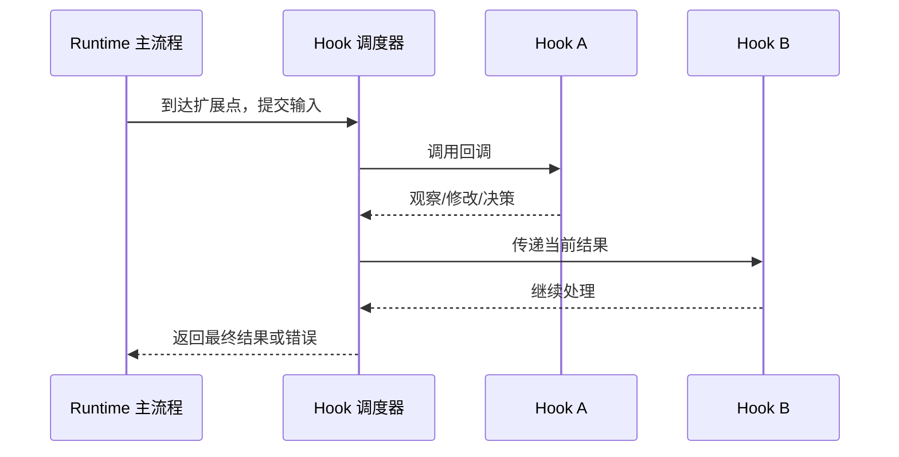

# Hook 扩展机制

## 核心问题

Hook 是什么，它如何在不修改宿主主流程的前提下观察或改变 Agent Runtime 的行为？

## 简要结论

Hook（钩子）是宿主在生命周期或执行路径的特定位置公开的回调契约。宿主负责定义触发时机、输入输出、执行顺序、错误传播和权限边界；扩展方只注册回调。它适合审计、策略校验、参数变换、上下文注入和外部通知，但不天然提供进程隔离、稳定 API 或跨产品可移植性。

## 工作原理

### 1. 基本结构

一个完整的 Hook 契约至少需要说明：

| 契约   | 需要回答的问题                     |
| ---- | --------------------------- |
| 触发点  | 在操作之前、之后，还是生命周期事件发生时？       |
| 数据   | 输入是否只读？哪些输出允许修改？            |
| 顺序   | 多个回调串行、并行，还是无序广播？           |
| 短路   | 回调能否拒绝、替换结果或终止后续执行？         |
| 错误   | 异常会阻断主流程、跳过当前扩展，还是仅记日志？     |
| 生命周期 | 注册何时生效，reload/unload 后如何撤销？ |
| 权限   | 回调能访问哪些文件、密钥、网络和进程能力？       |

### 2. 常见类型

- **通知型 Hook**：只观察事件，例如 session 完成后发送通知。通常不应修改主流程状态。
- **前置 Hook**：操作执行前检查或改写参数，例如工具参数校验、权限拦截。
- **后置 Hook**：操作完成后加工结果，例如脱敏、指标采集、缓存更新。
- **变换型 Hook**：把多个回调串成 pipeline/waterfall，后一个回调接收前一个的结果。
- **决策型 Hook**：允许批准、拒绝或替换默认行为，必须明确优先级和短路规则。

### 3. 组合语义

Hook 的价值不只取决于“有哪些事件”，更取决于多个 Hook 如何组合：

- 串行执行简单且可预测，但高频路径会累积延迟。
- 并行通知延迟较低，但不能依赖确定的修改顺序。
- 共享可变对象方便渐进修改，却容易产生插件间隐式耦合。
- 快照式调用可以让在途操作不受注册表变化影响，适合热更新。
- 插件卸载时自动注销 Hook，可避免重复监听和旧逻辑残留。

当多个 Hook 修改同一字段时，应定义所有权或单调规则。例如安全 Hook 只允许收紧权限，业务 Hook 只补充非敏感上下文；不要依赖偶然的加载顺序解决冲突。

### 4. Hook 与相邻机制

| 机制         | 与 Hook 的区别                                             |
| ---------- | ------------------------------------------------------ |
| Event      | Event 常表示已发生事实；Hook 更强调宿主提供的介入点，可能允许修改或阻断。             |
| Middleware | Middleware 通常包裹完整请求形成调用链；Hook 可以散布在更细的生命周期节点。          |
| Plugin     | Plugin 是部署和生命周期单元，一个 Plugin 可注册多个 Hook、Tool 或 Service。 |
| MCP        | MCP 是跨进程能力协议；Hook 通常是特定宿主的进程内扩展契约。                     |
| Tool       | Tool 由模型主动选择调用；Hook 由 Runtime 在预定义时机自动触发。              |

## 适用边界

- 本文描述通用机制，不保证不同 Agent 产品使用相同的 Hook 名称、数据结构或错误语义。
- 带 `experimental` 标记的 Hook 通常不属于稳定兼容契约，升级时必须重新验证。
- 进程内 Hook 与宿主共享权限和故障域，不能当作安全沙箱。
- Hook 不适合承载长时间阻塞任务；网络访问应有超时、取消与失败降级。
- 是否能够修改参数、阻断执行或影响后续 Hook，必须以具体宿主版本的类型和源码为准。

## 实践意义

- 设计 Hook 时，先定义顺序、短路、错误和卸载语义，再扩充事件数量。
- 使用结构化输入输出与 schema 校验，避免把宿主内部对象直接暴露给插件。
- 对权限、Shell、文件和模型请求 Hook 建立审计与脱敏策略。
- 测试至少覆盖多 Hook 冲突、异常传播、超时、reload/unload 和在途调用。
- 对跨 Agent 复用的能力，优先把业务实现放入独立服务或 MCP，Hook 只做薄适配。

## 应用记录

- [OpenCode 插件系统学习报告](../../../agent/study-notes/opencode-plugin.md)
- [DeepSeek Harness（DSH）插件系统学习报告](../../../agent/study-notes/dsh-plugin.md)

## 相关知识

- [Cordis 插件运行时](cordis-plugin-runtime.md)
- [ACP 与 MCP 桥接模式](../integration/acp-mcp-bridge.md)

## 参考资料

- [OpenCode Plugins](https://opencode.ai/docs/plugins/)
- [OpenCode V2 Plugins](https://opencode.ai/v2/docs/build/plugins)
- [DeepSeek Harness Cordis Tutorial](https://github.com/deepseek-ai/deepseek-harness/blob/master/docs/cordis-tutorial/index.md)

