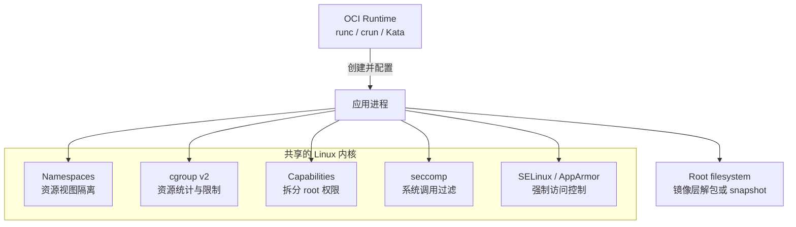
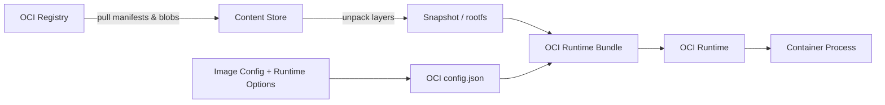
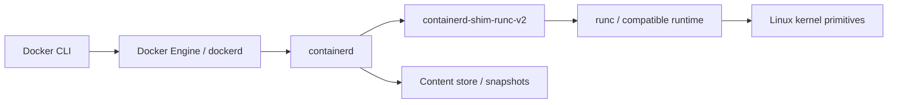

# Linux 容器隔离与 OCI 运行时

## 核心问题

Linux 容器如何通过内核隔离原语、OCI 标准和容器运行时，把一个普通进程组织成具有独立资源视图、资源配额与受限权限的容器？

## 一句话解释

Linux 容器是利用 namespace、cgroup 和权限控制把宿主进程限制在独立资源视图中的运行方式，OCI 则为其镜像和运行时行为提供跨工具标准。

## 详细解释

Linux namespace 为进程提供彼此不同的系统资源视图，cgroup 负责统计和限制资源，capabilities、seccomp 与 LSM（SELinux/AppArmor）进一步收缩权限和内核攻击面；OCI 则标准化镜像格式、运行时 bundle、配置和生命周期，使 Docker、containerd、runc、crun、Kata 等组件可以互操作。

容器隔离不是单一功能，也不等于虚拟机隔离。传统 Linux 容器与宿主共享内核，实际安全性取决于内核补丁、用户映射、挂载、设备、capability、系统调用过滤、LSM、运行时权限和外部接口是否正确配置。需要独立内核边界时，可采用 Kata Containers 等基于轻量虚拟机的 OCI 兼容运行时，但仍需根据威胁模型评估，而不能只按产品名称判断安全等级。

## 1. 从普通进程到容器



一个容器通常组合以下机制：

1. 准备 root filesystem 与 OCI `config.json`。
2. 创建或加入所需 namespace。
3. 把进程放入对应 cgroup，设置资源边界。
4. 配置 UID/GID、capabilities、`no_new_privileges`、seccomp 和 LSM label。
5. 设置挂载、设备、环境变量、工作目录和启动参数。
6. 启动容器 init 进程并维护其标准输入输出、退出状态和子进程回收。

因此，“容器”是多种内核能力与用户态约定的组合结果，不是一个独立的 Linux 内核对象。

## 2. Namespace：隔离资源视图

Namespace 让不同进程看到不同的全局资源实例。Linux 常见 namespace 包括：

| Namespace | 隔离对象 | 容器中的直观效果 |
|---|---|---|
| Mount | 挂载点与文件系统视图 | 容器有独立根目录和挂载树 |
| PID | 进程 ID 空间 | 容器内进程可从 PID 1 开始，默认看不到宿主其他进程 |
| Network | 网卡、路由、端口、iptables 等 | 容器拥有独立网络栈，可连接 veth/bridge |
| UTS | hostname 与 domain name | 容器可以使用独立主机名 |
| IPC | System V IPC、POSIX 消息队列 | 隔离共享内存、信号量和消息队列 |
| User | UID/GID 与 capability 映射 | 容器内 UID 0 可映射为宿主非 root UID |
| Cgroup | 可见的 cgroup 层级根 | 限制容器观察宿主 cgroup 拓扑 |
| Time | 单调时钟和 boot time offset | 为特定场景提供时间视图隔离 |

Namespace 解决的是“看见什么”，不是完整访问控制。例如，mount namespace 能让进程看到独立挂载树，但如果把敏感宿主目录可写 bind mount 进去，进程仍可修改该目录。Network namespace 隔离网络栈，但是否允许访问外网或宿主服务仍取决于路由、防火墙和代理策略。

User namespace 是 rootless 容器的重要基础：容器内 UID/GID 映射到宿主的非特权 ID，使容器内“root”不等于宿主 root。但内核文档同时指出，开放非特权 user namespace 会增加内核对象和资源滥用面，因此应结合 cgroup 资源限制、内核补丁与系统策略使用。

常用观察命令：

```bash
# 查看进程所属 namespace；符号链接 inode 相同通常表示同一 namespace
ls -l /proc/<pid>/ns

# 列出系统中的 namespace
lsns

# 进入目标进程已有的 mount、PID、network 等 namespace
nsenter --target <pid> --mount --pid --net --uts --ipc

# 在新的 namespace 中启动命令，适合最小实验
unshare --mount --pid --fork --mount-proc sh
```

`nsenter` 和 `unshare` 是否成功取决于 user namespace、capability、LSM 与发行版策略；它们不是绕过权限检查的工具。

## 3. cgroup v2：资源统计、控制与压力传播

cgroup（control group）将进程组织成层级，并由不同 controller 管理资源。cgroup v2 使用统一层级，常见控制器包括：

| Controller/接口 | 作用 | 常见限制示例 |
|---|---|---|
| CPU | 调度份额和带宽限制 | `cpu.weight`、`cpu.max` |
| Memory | 内存统计、软硬边界与 OOM 行为 | `memory.current`、`memory.high`、`memory.max` |
| IO | 块设备 IO 权重和带宽/IOPS | `io.weight`、`io.max` |
| PIDs | 限制进程/线程数量 | `pids.max` |
| cpuset | 约束允许使用的 CPU 与 NUMA memory node | `cpuset.cpus`、`cpuset.mems` |

Namespace 与 cgroup 的分工不同：namespace 隔离视图，cgroup 控制“能用多少”。只配置 namespace 而不限制资源，容器仍可能耗尽宿主内存、PID 或 IO；只配置 cgroup 而不隔离视图，则更像受限进程组而非完整容器。

cgroup v2 的实际挂载通常位于 `/sys/fs/cgroup`，可通过以下方式观察：

```bash
# 查看当前进程所属 cgroup
cat /proc/self/cgroup

# 确认 cgroup 文件系统
findmnt -t cgroup2

# 查看压力停顿信息（PSI）
cat /proc/pressure/cpu
cat /proc/pressure/memory
cat /proc/pressure/io
```

生产系统通常通过 systemd、容器运行时或编排器管理 cgroup，不应绕过管理层随意修改其层级和控制文件。

## 4. 权限收缩：Capabilities、seccomp 与 LSM

### 4.1 Linux Capabilities

传统 Unix 把进程粗略分为 root 与非 root。Linux capabilities 将 root 权限拆成多个单元，例如网络管理、改变文件所有者、加载内核模块等。容器运行时可以只保留应用所需 capability，并丢弃其他权限。

原则是默认最小权限：

- 不因为应用“需要 root”就给予 `--privileged`。
- 优先让容器进程以非 root 用户运行。
- 从默认集合继续 drop 不需要的 capabilities；仅按明确需求 add。
- 谨慎对待 `CAP_SYS_ADMIN`，它覆盖大量敏感内核操作，不能视作普通权限。

### 4.2 seccomp

seccomp BPF 根据系统调用号和参数过滤进程可调用的内核接口，从而减少应用暴露的内核攻击面。过滤器可以拒绝、终止、记录、通知用户态或允许调用。内核文档明确指出 seccomp 不是完整 sandbox，它应与 namespace、capabilities、LSM 等机制组合。

容器运行时通常应用默认 seccomp profile。关闭 profile 或使用 `unconfined` 会扩大系统调用面；自定义 profile 应基于实际调用测试，既避免无必要放行，也避免把正常应用误杀。

### 4.3 LSM：SELinux 与 AppArmor

Linux Security Modules 为对象访问提供强制访问控制。SELinux 通常使用 label 与 policy，AppArmor 通常使用基于程序路径的 profile。它们可以限制即使拥有传统文件权限或某些 capability 的进程，补足仅靠 namespace 无法表达的访问策略。

### 4.4 `no_new_privileges`

进程设置 `no_new_privileges` 后，通过 `execve` 执行新程序时不能获得原本没有的额外权限，例如利用 setuid binary 提权。它也是非特权进程安装 seccomp filter 的重要前提之一。

这些机制互为补充：

```text
可见资源 = namespace 与挂载配置
资源上限 = cgroup
特权操作 = UID/GID + capabilities + no_new_privileges
系统调用面 = seccomp
对象访问 = DAC 权限 + SELinux/AppArmor
```

## 5. OCI 标准：镜像与运行时的契约

Open Container Initiative 维护三个核心规范：

| 规范 | 解决的问题 | 关键对象 |
|---|---|---|
| Image Specification | 镜像如何描述、寻址和传输 | manifest、index、config、filesystem layers、descriptor |
| Runtime Specification | runtime 如何创建和管理容器 | bundle、`config.json`、state、create/start/kill/delete、hooks |
| Distribution Specification | 客户端如何与 Registry 分发内容 | blob、manifest、pull/push HTTP API |

### 5.1 OCI Image

OCI Image 不是一个简单 tar 包，而是内容寻址对象的集合：

- **Image Manifest**：引用 image config 与一组有序 filesystem layers。
- **Image Index**：引用多个 manifest，常用于多架构镜像。
- **Image Config**：记录层顺序、环境、入口、参数等运行配置。
- **Filesystem Layer**：描述相对上一层的文件系统变更。
- **Descriptor**：使用 media type、digest 和 size 引用内容。

Digest 绑定内容本身；tag 只是可变名称。需要可复现部署时应记录 digest，而不是只依赖可能被重新指向的 tag。

### 5.2 OCI Runtime Bundle

OCI Runtime 接收 runtime bundle。其最小结构包含：

```text
bundle/
├── config.json   # OCI Runtime 配置
└── rootfs/       # 容器根文件系统
```

`config.json` 描述要运行的进程、root filesystem、挂载、namespace、UID/GID、capabilities、资源限制和 hooks 等。OCI Runtime Spec 定义容器的状态与 create/start/kill/delete 等生命周期操作，但不负责镜像下载、构建、Registry、集群调度或上层网络策略。

### 5.3 从 Image 到 Runtime Bundle



镜像规范和运行时规范之间是“解包与转换”关系：上层 image manager/runtime manager 负责拉取和验证内容、准备 snapshot/rootfs，并结合运行参数生成 OCI runtime spec；低层 runtime 负责按 bundle 创建进程。

## 6. Docker、containerd 与低层 Runtime 的职责

典型 Linux Docker Engine 路径可简化为：



| 组件 | 主要职责 |
|---|---|
| Docker CLI | 向 Docker Engine API 发送构建、镜像和容器管理请求 |
| Docker Engine | 提供用户级容器产品能力，包括镜像、网络、卷、构建与 API |
| containerd | 管理镜像内容、snapshot、container/task 生命周期和 runtime shim |
| shim | 维持容器 IO、报告退出状态、回收进程，使容器生命周期与 containerd daemon 解耦 |
| runc | 根据 OCI bundle 创建和运行容器进程，完成 namespace、mount、capability 等配置 |
| crun | 使用 C 实现的 OCI runtime，可作为 runc 的替代实现之一 |

这张图是常见路径，不是所有部署的强制拓扑。Kubernetes 可通过 CRI 使用 containerd；其他产品也可使用不同 snapshotter、shim 或 OCI runtime。不要把“Docker”“containerd”“runc”当作同一层的同义词。

## 7. 不同隔离实现的边界

### 7.1 runc 与 crun

runc 和 crun 都是 OCI Runtime Spec 的实现，通常依赖宿主 Linux 内核的 namespace、cgroup、capabilities、seccomp 与 LSM。二者在实现语言、性能、功能细节和版本支持上存在差异，但传统运行模式下都与宿主共享内核。

### 7.2 Rootless 容器

Rootless 模式让 daemon 和容器不以宿主 root 运行，通常依赖 user namespace 将容器 UID/GID 映射到宿主非特权 ID。它能减少 daemon 或容器逃逸后的宿主权限，但不是“自动安全”：内核、user namespace、网络辅助程序、挂载方式和资源控制仍需正确配置。

Rootless 与 `USER` 指令不同：`USER` 只决定容器进程默认用户；rootless 描述宿主侧 daemon/runtime 的权限模型。

### 7.3 Kata Containers

Kata Containers 提供 OCI/CRI 兼容接口，但把 workload 放入轻量虚拟机，使 workload 使用 guest kernel，与宿主 kernel 之间增加 hypervisor/VM 边界。代价通常包括更高启动、内存和设备虚拟化成本。它适合需要更强内核隔离的场景，但安全性仍依赖 hypervisor、guest image、共享文件系统、设备透传和控制面配置。

### 7.4 bubblewrap

bubblewrap 是构造非特权 Linux sandbox 的低层工具。它使用 user/mount/PID/network 等 namespace，可设置只读 bind mount，并允许调用者提供 seccomp filter。它不定义镜像、Registry、daemon 或完整容器平台。

bubblewrap 官方明确指出：它负责提供构造 sandbox 的原语，不提供一套固定安全策略；实际安全边界完全取决于调用参数与上层框架。仅仅“使用了 bwrap”不能证明文件、网络、D-Bus、设备或系统调用已被正确隔离。

## 8. 安全边界与常见误区

### 8.1 容器不是虚拟机

传统 Linux 容器共享宿主 kernel。内核漏洞、错误 capability、危险设备、可写宿主挂载或暴露的管理 socket 都可能突破预期边界。VM 型 runtime 增加独立 kernel/hypervisor 边界，但不消除共享目录、设备和控制面风险。

### 8.2 `root in container` 不必然等于 `root on host`

是否等价取决于 user namespace 映射和授予的能力。未使用 user namespace 的容器内 UID 0 通常仍是宿主 UID 0，只是受到 namespace、capability、seccomp 和 LSM 约束；错误配置可能显著扩大风险。

### 8.3 `chroot` 不是完整 sandbox

`chroot` 只改变路径解析的根目录，不提供 PID、network、user 等视图隔离，也不自动限制系统调用、资源或特权。完整容器需要组合其他机制。

### 8.4 挂载和管理接口可能直接穿透边界

- 可写 bind mount 允许容器直接修改宿主对应目录。
- 挂载 Docker/containerd 管理 socket 往往等价于授予创建高权限容器的控制能力。
- `--privileged`、宿主 PID/network namespace、危险设备和广泛 capabilities 会显著削弱隔离。
- 镜像内容、构建过程与 Registry 属于供应链边界，运行时隔离不能替代签名、来源验证和漏洞修复。

### 8.5 资源限制也是安全边界的一部分

未配置 memory、PID、CPU 和 IO 边界时，受限进程仍可能通过资源耗尽影响同一宿主其他 workload。Linux 内核与 containerd 的官方安全指南均强调及时修补内核和 runtime，因为共享内核是传统容器的主要边界。

## 9. 选择隔离方式

不要从产品名称出发，应先写威胁模型：谁不可信、要保护什么、可接受多少性能与运维成本。

| 需求 | 可考虑的机制 | 必须额外验证 |
|---|---|---|
| 打包和运行可信应用 | OCI image + runc/crun 容器 | 镜像来源、非 root、最小权限、资源限制 |
| 非特权本地进程文件/网络收缩 | bubblewrap 等 namespace sandbox | 精确挂载、网络、IPC/socket、seccomp 与上层 policy |
| daemon 与容器避免宿主 root | Rootless container | UID/GID 映射、网络、cgroup、挂载兼容性 |
| 不可信多租户需要独立 kernel | Kata/轻量 VM/普通 VM | hypervisor、guest、共享文件系统、设备与控制面 |
| 只需资源配额，不需完整文件/网络隔离 | systemd/cgroup | 进程权限、文件访问和网络仍需单独控制 |

“更强隔离”不是单一排序：传统容器、rootless、bwrap、Kata 和 VM 在兼容性、启动速度、资源开销、设备访问与攻击面上各有取舍。

## 适用边界

- 本文聚焦 Linux 容器；Windows containers、macOS Docker Desktop 的 Linux VM 边界不在本文范围。
- OCI 规定可移植数据和生命周期契约，不保证所有 runtime 实现支持完全相同的 Linux 扩展功能。
- 本文不展开 overlayfs、CNI、eBPF 网络、镜像签名、Kubernetes CRI 与 device/GPU passthrough 的实现细节。
- 具体字段、默认 seccomp profile、capability 集合与 rootless 支持会随 kernel、发行版和 runtime 版本变化，部署时应读取对应版本官方文档。
- 容器配置是否构成有效安全边界，必须结合完整数据流与威胁模型验证。

## 实践意义

- 排障时按“镜像/内容 → snapshot/rootfs → OCI spec → runtime/shim → namespace/cgroup → 进程”逐层定位。
- 安全评审不要只检查镜像和 Dockerfile，还要检查 runtime spec、挂载、设备、socket、capabilities、seccomp、LSM 与 cgroup。
- 默认使用非 root、最小 capability、只读文件系统/挂载和明确资源上限；高权限例外需要说明理由。
- 对不可信代码执行，显式决定是否接受共享宿主内核；若不能接受，应选择 VM 型边界。
- 版本管理需要同时覆盖 kernel、container manager、shim 和 OCI runtime，避免只升级上层 CLI。

## 相关知识

- [Docker 基础与常用语法](../../../foundations/tools/docker-basics.md)
- [Sandbox 生命周期](../../integration/sandbox-lifecycle.md)
- [认证与安全](05-auth-security.md)

## 参考资料

### Linux 内核与系统调用

- [Linux namespaces(7)](https://man7.org/linux/man-pages/man7/namespaces.7.html)
- [Linux user_namespaces(7)](https://man7.org/linux/man-pages/man7/user_namespaces.7.html)
- [Linux cgroup v2](https://docs.kernel.org/admin-guide/cgroup-v2.html)
- [Linux control groups v2](https://man7.org/linux/man-pages/man7/cgroups.7.html)
- [Linux Seccomp BPF](https://docs.kernel.org/userspace-api/seccomp_filter.html)
- [Linux capabilities(7)](https://man7.org/linux/man-pages/man7/capabilities.7.html)
- [Linux namespaces and resource control](https://docs.kernel.org/admin-guide/namespaces/resource-control.html)
- [nsenter(1)](https://man7.org/linux/man-pages/man1/nsenter.1.html)
- [unshare(1)](https://man7.org/linux/man-pages/man1/unshare.1.html)

### OCI 标准

- [Open Container Initiative](https://opencontainers.org/)
- [OCI Image Specification](https://specs.opencontainers.org/image-spec/)
- [OCI Runtime Specification](https://specs.opencontainers.org/runtime-spec/runtime/)
- [OCI Distribution Specification](https://specs.opencontainers.org/distribution-spec/)
- [OCI Runtime Spec — Linux](https://github.com/opencontainers/runtime-spec/blob/main/config-linux.md)

### 容器管理与 Runtime

- [Docker Engine security](https://docs.docker.com/engine/security/)
- [Docker Rootless mode](https://docs.docker.com/engine/security/rootless/)
- [Docker seccomp security profiles](https://docs.docker.com/engine/security/seccomp/)
- [Docker Linux kernel capabilities](https://docs.docker.com/engine/containers/run/#runtime-privilege-and-linux-capabilities)
- [containerd Runtime v2](https://github.com/containerd/containerd/blob/main/docs/runtime-v2.md)
- [containerd Operator Security Guidelines](https://github.com/containerd/containerd/blob/main/docs/security/OPERATOR_GUIDELINES.md)
- [runc](https://github.com/opencontainers/runc)
- [crun](https://github.com/containers/crun)

### 其他隔离实现

- [Kata Containers Architecture](https://github.com/kata-containers/kata-containers/blob/main/docs/design/architecture/README.md)
- [Kata Containers Documentation](https://katacontainers.io/docs/)
- [bubblewrap README](https://github.com/containers/bubblewrap)
- [bubblewrap sandbox security model](https://github.com/containers/bubblewrap/blob/main/README.md#sandbox-security)
