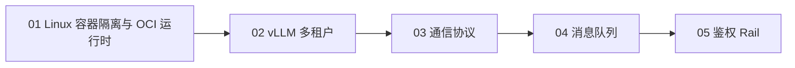

# 01 基础设施

> **第二站 · 介绍级**。从运行环境、模型服务、通信、异步处理到认证安全建立基础设施全局认知，再读 [Claude Code](../../products/claude-code/README.md) 等产品知识。

## 技术链路

## 文档索引

| # | 文档 | 主题 |
|---|------|------|
| 1 | [01-sandbox-oci-docker.md](01-sandbox-oci-docker.md) | namespace/cgroup → OCI → containerd/runc → 隔离选型 |
| 2 | [02-vllm-multitenant.md](02-vllm-multitenant.md) | vLLM 推理、多租户、API Key 计量 |
| 3 | [03-communication-protocols.md](03-communication-protocols.md) | ZMQ / SSH / HTTP / ACP / MCP |
| 4 | [04-message-queue.md](04-message-queue.md) | TDMQ / CMQ 异步落库 |
| 5 | [05-auth-security.md](05-auth-security.md) | OAuth / API Key / Agent Rail |

## Capstone 延伸阅读

- [The LLM Engineer Handbook 2025](https://maximelabonne.medium.com/the-llm-engineer-handbook-2025-77a9a3173016) — 容器 vLLM + 多租户 + MQ 计费 + Agent 安全
- B 站搜索：`云原生容器从底层 runc 到 Docker 完整教程` · `vLLM 生产级落地 容器 + 网关 + 消息队列` · `大模型 Agent 安全防护 Rail 护栏实战`
- GitHub 搜索：`llm multi-tenant gateway vllm docker mq`
- 推荐项目：[baggie11/Multi-tenant-LLM-gateway](https://github.com/baggie11/Multi-tenant-LLM-gateway)

## 跨域基础

- [Docker 基础与常用语法](../../../foundations/tools/docker-basics.md) — 面向日常使用的镜像、容器、卷、网络、Dockerfile 与 Compose 命令。
- [SSH 公钥免密登录](../../../foundations/tools/ssh-key-auth.md) — SSH 公钥认证配置、安全边界与排障。
