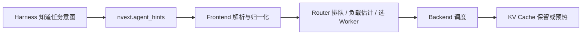

# Agent Hints 如何把 Agent 意图传递给推理服务？

## 核心问题

Agent harness 如何在不修改 prompt 的情况下，把单次调用的调度和 Cache 优化意图传递给推理服务？

## 简要结论

NVIDIA Dynamo 的 Agent Hints 是放在 `nvext.agent_hints` 中的逐请求结构化元数据。它把 harness 掌握的业务意图转换为 serving stack 可消费的信号：`priority` / `strict_priority` 影响排队和调度，`osl` 帮助估计输出负载，`speculative_prefill` 请求预热可预测的下一轮 KV Cache。

Hint 是 best-effort 优化信号，不进入模型上下文，也不等同于 session identity、粘性路由、准入控制、容量预留或 SLA 保证。字段只有在 Router 和 backend 的对应能力已启用且存在排队或显存压力时才会产生效果。

## 工作原理

| Hint | 消费层 | 语义 |
|---|---|---|
| `priority` | Router + 支持的 backend | 跨层软优先级；Dynamo 中数值越高越重要 |
| `strict_priority` | Router pending queue | 绝对队列层级；只比较已经等待的请求 |
| `osl` | Router | 预计输出 token 数，用于输出 block 跟踪和资源估计 |
| `speculative_prefill` | Frontend / Router / backend | 在本轮完成后以单 token 请求预填可预测的下一轮前缀 |

优先级是分层配置的：Router 需要启用队列阈值；vLLM 需要 `--scheduling-policy priority`；SGLang 的请求调度和 radix cache 淘汰分别需要 `--enable-priority-scheduling` 与 `--radix-eviction-policy priority`。Dynamo 负责归一化不同 backend 的优先级极性。

## 适用边界

- 本文针对 NVIDIA Dynamo 2026 年公开的 Agent Hints 接口；字段及 backend 支持具有版本敏感性。
- `strict_priority` 不抢占运行中请求、不跨 Router 副本排序，也不传给 backend。
- 没有 Router 排队时，Router priority 不会改善 TTFT；没有 engine 排队或显存压力时，backend scheduling / eviction priority 也难以观察。
- `speculative_prefill` 只有实际下一轮共享预测前缀时才有收益，同时会引入额外计算。
- Session ID 是被动身份，Agent Hints 是主动 serving intent；二者都不会自动开启 sticky routing。
- 当前公开契约不提供通用 Cache TTL 或 token-range pinning。

## 实践意义

- 让 harness 输出其独有、而推理服务无法从 prompt 稳定推断的信号，避免 serving stack 猜测业务意图。
- 先建立字段透传、各层配置和指标观测，再逐项启用优化；“请求里有 hint”不能证明它已经生效。
- 将业务等级集中映射为受控的 priority，防止不受信任调用方造成优先级膨胀和饥饿。
- 用混合优先级压测验证 TTFT；用预测/实际输出误差验证 `osl`；用命中率、额外算力和端到端 TTFT 验证 speculative prefill。
- 把 hint 视为可降级的建议，隔离、配额、鉴权和 SLA 必须由强制策略保证。

## 应用记录

- [NVIDIA Dynamo Agent Hints 调研](../../../agent/investigations/nvidia-dynamo-agent-hints.md)

## 相关知识

- [vLLM 多租户](../concepts/infrastructure/02-vllm-multitenant.md)
- [通信协议](../concepts/infrastructure/03-communication-protocols.md)

## 参考资料

- [NVIDIA Dynamo：Agent Hints](https://docs.nvidia.com/dynamo/agents/agent-hints)
- [NVIDIA Dynamo：`nvext` Agent Hints 字段定义](https://github.com/ai-dynamo/dynamo/blob/main/docs/fern/pages/developer-guide/additional-resources/nvidia-request-extensions-nvext.md#agent-hints)
- [NVIDIA Dynamo：Priority Scheduling](https://docs.nvidia.com/dynamo/agents/priority-scheduling)
- [NVIDIA Dynamo：SGLang for Agentic Workloads](https://docs.nvidia.com/dynamo/dev/knowledge-base/modular-components/backends/sg-lang/agents-on-sg-lang)
