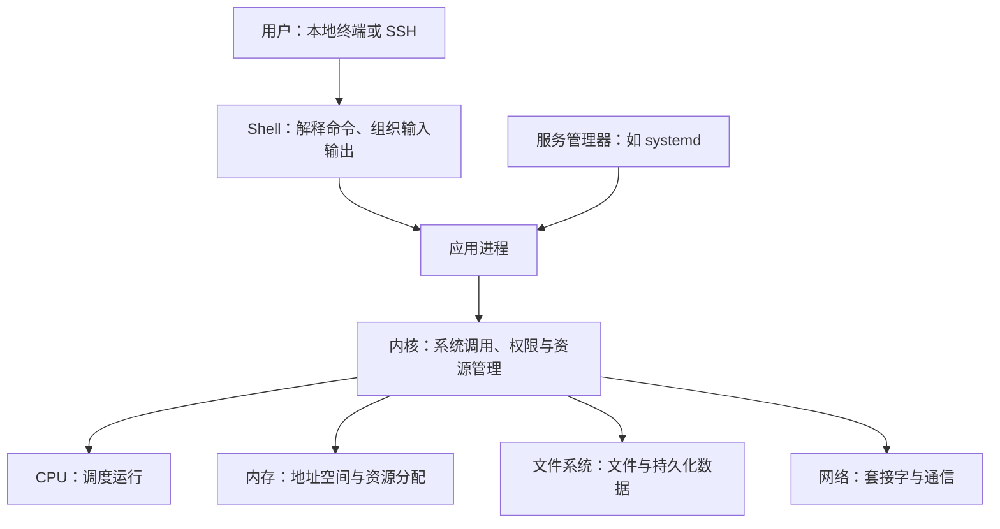

# Linux 快速入门：核心认知与学习路线

## 学习目标

面向已经会常用命令、但缺少系统认知的开发者。第一轮用约 4～6 小时建立框架，之后通过实际问题逐步补齐。时间是学习安排的估计，不代表熟练掌握所需时间。

入门后的目标是：能解释一个服务如何运行，发生问题时知道先观察哪个对象、用什么证据缩小范围。命令参数可以随时查手册。

## 一张认知地图

Linux 严格说是内核；日常使用的 Linux 发行版还包含系统工具、库、包管理器和服务管理器。Ubuntu、Debian 等发行版共享大量内核机制，但软件版本、包管理和默认配置可能不同。



程序运行时有用户身份、参数、工作目录、环境变量和打开的文件描述符。内核根据权限和资源条件处理它的请求。终端、Shell、应用和内核各有职责；SSH 只是常见的远程入口。

## 六个核心模块

| 模块 | 先建立的认知 | 观察入口 | 能回答的问题 |
| --- | --- | --- | --- |
| 命令与执行环境 | Shell 解析命令；PATH 决定如何查找外部程序；子进程继承环境；管道连接输入输出 | `type`、`command -v`、`pwd`、`printenv PATH` | 为什么同一条命令换个终端就不工作？ |
| 进程与生命周期 | 程序是文件，进程是运行实例；PID、父子关系、信号、退出码描述运行与结束 | `ps -ef`、`top`、`jobs`、`echo $?` | 谁启动了它，为什么退出，谁负责重启？ |
| 文件与存储 | 路径组织成目录树；挂载把文件系统接入目录；文件描述符是进程访问已打开对象的句柄 | `ls -l`、`df -h`、`df -i`、`du -sh 目录`、`findmnt` | 文件在哪里，为什么磁盘满或文件不可见？ |
| 用户与权限 | 进程以某个身份访问资源；文件有属主、属组和权限；目录的执行权限控制路径遍历 | `id`、`ls -ld 目录`、`namei -l 路径` | 文件存在，为什么仍无法读取或执行？ |
| 网络与服务 | 服务进程监听地址和端口；客户端经解析、路由、连接和应用协议完成请求 | `ip addr`、`ip route`、`ss -lntp`、`getent hosts 域名`、`curl -v URL` | 进程在运行，为什么别人连不上？ |
| 资源与运维 | CPU、内存、磁盘和网络会限制服务；日志与监控提供线索；服务管理器负责生命周期 | `free -h`、`vmstat 1`、`systemctl status 服务`、`journalctl -u 服务` | 服务为什么慢，为什么启动失败？ |

这些观察入口以常见 Linux 环境为前提，部分工具需安装，部分进程信息需相应权限；命令只提供证据，单个指标通常不足以确定原因。

## 用一个服务串起来

围绕“启动一个 Python HTTP 服务”理解完整链路：

1. Shell 找到 Python，把参数、当前目录、环境和输入输出设置交给新进程。
2. 进程以当前用户身份运行；读取文件要通过权限检查。
3. 内核为进程调度 CPU、管理内存，并处理打开文件和监听端口等请求。
4. 客户端连接监听地址和端口，服务读取文件、返回响应并输出日志。
5. 进程退出后，端口不再由它监听。是否重新启动，取决于是否有服务管理机制及相应配置。

这样就能定位三个近期术语：[nohup](../tools/nohup.md) 影响挂断信号处理；[systemd](../tools/systemd.md) 管理主机服务；[HA](../reliability/high-availability.md) 进一步考虑主机或依赖故障后的整体可用性。

## 第一轮：4～6 小时

建议使用可随时恢复的 Linux 虚拟机或测试机。macOS 终端适合练习部分 Unix 命令，但不是 Linux；普通容器可练进程与文件基础，通常不能完整呈现主机启动及 systemd 管理过程。

| 顺序 | 预计时间 | 学习和练习 | 完成标志 |
| --- | --- | --- | --- |
| 1. 建立地图 | 30 分钟 | 读本页；查看 `uname -r`、`cat /etc/os-release`、`ps -p 1 -o comm=` | 能区分内核、发行版、Shell、服务管理器 |
| 2. 理解执行 | 45～60 分钟 | 查找程序位置；改变工作目录；练习标准输出、标准错误、重定向和管道 | 能解释程序从哪里启动、输出去了哪里 |
| 3. 理解身份与文件 | 45～60 分钟 | 在个人练习目录观察属主和权限；比较 `df` 与 `du` | 能把访问失败与空间不足分开排查 |
| 4. 串起进程和网络 | 60～90 分钟 | 完成下方小实验 | 能从请求找到监听端口和对应进程 |
| 5. 服务与排障 | 60～90 分钟 | 阅读 systemd 笔记；观察测试机上的一个现有服务及日志 | 能区分启动失败、运行退出、监听错误和资源不足 |

### 小实验：让“进程—端口—文件—日志”连起来

前提：测试机有 Python 3 和 curl；只在个人练习目录操作。第一个终端执行：

```bash
mkdir -p ~/linux-learning/http-demo
cd ~/linux-learning/http-demo
printf 'hello linux\n' > hello.txt
python3 -m http.server 18080 --bind 127.0.0.1
```

第二个终端执行：

```bash
curl -v http://127.0.0.1:18080/hello.txt
ss -lntp 'sport = :18080'
ps -ef | grep '[p]ython3 -m http.server 18080'
```

观察并解释：

- 为什么当前目录决定提供哪些文件？请求不存在的文件时，404 与连接失败有何区别？
- 为什么监听 `127.0.0.1` 时，不能直接通过机器的外部地址访问？
- 为什么第一个终端没有立即返回提示符？按 Ctrl+C 后，再请求会怎样？
- 把启动命令的输出重定向到 `server.log` 后，访问记录出现在哪里？

实验中的文件服务器只用于理解机制。完成后用 Ctrl+C 停止；如果端口已被占用，选择另一个空闲端口并同步修改请求。

## 日常排障的固定问法

先确认是在宿主机还是容器、哪个用户、哪个工作目录和什么启动方式下发生，再按症状选入口：

| 症状 | 首先确认 | 下一步追问 |
| --- | --- | --- |
| 命令找不到 | PATH、程序位置、是否安装 | 交互 Shell 和服务环境是否不同？ |
| Permission denied | 当前身份、目标及父目录权限 | 是否还存在 ACL、只读挂载或安全策略限制？ |
| 服务启动失败 | 服务状态、最近日志、退出原因 | 命令路径、配置、依赖、工作目录是否正确？ |
| 接口连不上 | 进程、监听地址、端口、本机请求 | 再看 DNS、路由、防火墙；HTTP 错误则继续查应用 |
| 运行慢或被终止 | 时间范围、日志、资源趋势 | 区分 CPU 忙、I/O 等待、内存压力及资源限额 |
| 磁盘满 | 对应挂载点、空间和 inode | 是否有大文件，或已删除但仍被进程打开的文件？ |

始终把“观察到什么”和“推测原因是什么”分开。先缩小范围，再修改配置；用相同请求或任务验证修改效果。

## 日常积累方式

每次解决一个实际问题，记录五件事：

1. **现象与环境**：哪个用户、主机或容器，如何启动，实际报错是什么。
2. **归属模块**：执行环境、进程、文件、权限、网络还是资源。
3. **关键证据**：哪条命令的哪个输出支持判断。
4. **机制与修复**：为什么会发生，修改什么，如何确认恢复。
5. **可复用结论**：是否值得新增或更新一个原子知识点，并链接回本页。

例如，“SSH 退出后任务停止”可以补进程、会话和 SIGHUP；“手动执行成功但 systemd 失败”可以补环境继承、用户身份和工作目录。遇到真实问题再深入相应机制。

第一轮暂不展开内核源码、调度算法细节、驱动开发、复杂 Shell 编程或完整集群运维。后续遇到容器资源限制时再学 cgroup，遇到容器可见性差异时再学 namespace。

## 已有知识入口

- [SSH 公钥免密登录](../tools/ssh-key-auth.md)：远程操作入口。
- [nohup](../tools/nohup.md)：临时任务与挂断信号。
- [systemd](../tools/systemd.md)：长期服务管理。
- [Docker 基础](../tools/docker-basics.md)：在掌握主机进程、文件和网络后继续学习。
- [HA：高可用](../reliability/high-availability.md)：从单机运行扩展到系统可靠性。

## 参考入口

- [Ubuntu 命令行入门](https://ubuntu.com/tutorials/command-line-for-beginners)：需要补基础命令时按练习查阅。
- [Bash 手册：基础 Shell 功能](https://www.gnu.org/software/bash/manual/html_node/Basic-Shell-Features.html)：查执行、重定向和管道语义。
- [Linux 内核管理文档](https://docs.kernel.org/admin-guide/index.html)：遇到具体内核机制时查阅，不作为第一轮顺序阅读材料。
- 目标机器上的 `man` 和 `--help`：确认已安装版本的行为，如 `man ps`、`man systemd.service`。
